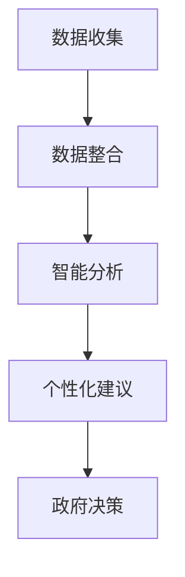

                 

关键词：人工智能、政府决策、搜索引擎、算法、数据挖掘、智慧城市

摘要：随着人工智能技术的快速发展，AI搜索引擎在政府决策过程中发挥着越来越重要的作用。本文将探讨AI搜索引擎的核心概念、算法原理、数学模型、项目实践以及实际应用场景，分析其对政府决策的变革影响，并展望未来发展趋势和挑战。

## 1. 背景介绍

在过去的几十年中，政府决策过程的效率和准确性一直是一个备受关注的议题。传统的政府决策往往依赖于人为经验和部门间的协调，这不仅耗时耗力，而且容易出现偏差。随着信息技术的迅猛发展，尤其是人工智能和大数据技术的普及，政府开始探索利用AI搜索引擎来优化决策过程。

AI搜索引擎不仅能够快速检索和分析海量数据，还能根据数据之间的关系和模式提供智能化的建议。这种技术优势使得AI搜索引擎在政府决策中具有广泛的应用前景，例如在公共安全、城市管理、环境保护等领域。

## 2. 核心概念与联系

### 2.1. AI搜索引擎的定义

AI搜索引擎是一种基于人工智能技术构建的搜索系统，它能够理解用户输入的查询意图，通过学习用户的历史行为和偏好，为用户提供个性化的搜索结果。与传统的搜索引擎不同，AI搜索引擎更加智能，能够处理复杂的查询需求，并提供更加精准的答案。

### 2.2. 政府决策的概念

政府决策是指政府机构在制定公共政策、法律法规、预算分配等方面的活动。政府决策的目的是为了实现公共利益，确保社会的稳定和发展。

### 2.3. AI搜索引擎与政府决策的联系

AI搜索引擎可以通过以下几个环节影响政府决策：

1. **数据收集与整合**：AI搜索引擎能够收集来自各种渠道的数据，如社交媒体、新闻报道、政府公开信息等，并对这些数据进行整合和分析。

2. **智能分析**：通过对数据的深度学习，AI搜索引擎能够发现数据之间的关联和趋势，为政府提供决策依据。

3. **个性化建议**：根据政府官员的偏好和需求，AI搜索引擎能够提供个性化的政策建议，帮助政府制定更加科学合理的决策。

### 2.4. Mermaid 流程图

以下是一个简单的Mermaid流程图，展示了AI搜索引擎在政府决策中的作用过程：



## 3. 核心算法原理 & 具体操作步骤

### 3.1. 算法原理概述

AI搜索引擎的核心算法主要包括自然语言处理（NLP）、机器学习（ML）和深度学习（DL）。这些算法通过以下几个步骤实现对政府决策的支持：

1. **预处理**：对输入的数据进行清洗、去噪和标准化处理，使其适合算法分析。

2. **特征提取**：从预处理后的数据中提取关键特征，如关键词、主题、情感等。

3. **模式识别**：利用机器学习和深度学习算法，对特征进行模式识别，发现数据之间的关联和趋势。

4. **结果生成**：根据模式识别的结果，生成智能化的搜索结果或政策建议。

### 3.2. 算法步骤详解

1. **预处理**：这一步骤包括数据清洗、去噪和标准化处理。数据清洗是为了去除数据中的噪声和异常值；去噪是为了减少数据中的干扰信息；标准化处理是为了将不同类型的数据统一到一个量纲。

2. **特征提取**：特征提取是AI搜索引擎的关键步骤。通过NLP技术，可以从文本数据中提取关键词、主题、情感等信息。这些特征将用于后续的机器学习和深度学习。

3. **模式识别**：模式识别是利用机器学习和深度学习算法，对特征进行分类、聚类或回归分析。通过模式识别，可以找出数据之间的关联和趋势。

4. **结果生成**：根据模式识别的结果，生成智能化的搜索结果或政策建议。例如，如果AI搜索引擎发现某地区环境污染严重，它可以生成相应的环保政策建议。

### 3.3. 算法优缺点

**优点**：

1. **高效性**：AI搜索引擎可以快速处理海量数据，提供实时决策支持。

2. **准确性**：通过机器学习和深度学习，AI搜索引擎可以准确识别数据中的模式和趋势。

3. **个性化**：根据用户的需求和偏好，AI搜索引擎可以提供个性化的搜索结果和政策建议。

**缺点**：

1. **数据依赖性**：AI搜索引擎的性能很大程度上依赖于数据的质量和数量。

2. **隐私问题**：在政府决策中，涉及大量的个人隐私数据，如何保护这些数据的安全和隐私是一个挑战。

### 3.4. 算法应用领域

AI搜索引擎在政府决策中的应用领域非常广泛，包括但不限于以下几个方面：

1. **公共安全**：通过分析社交媒体和新闻报道，预测和预防公共安全事件。

2. **城市管理**：通过分析交通数据和环境数据，优化城市管理和服务。

3. **环境保护**：通过分析环境污染数据，制定相应的环保政策。

4. **医疗卫生**：通过分析医疗数据，优化医疗资源配置和疾病预防策略。

## 4. 数学模型和公式 & 详细讲解 & 举例说明

### 4.1. 数学模型构建

AI搜索引擎的核心算法通常涉及多个数学模型，如支持向量机（SVM）、神经网络（NN）、决策树（DT）等。以下是一个简单的神经网络模型：

```latex
$$
h(x) = \sigma(\sum_{i=1}^{n} w_i * x_i + b)
$$`

其中，\( h(x) \) 是神经网络输出的预测值，\( \sigma \) 是激活函数，\( w_i \) 和 \( b \) 分别是权重和偏置。

### 4.2. 公式推导过程

神经网络的推导过程涉及微积分和线性代数。以下是一个简化的推导过程：

1. **前向传播**：

   前向传播是指将输入数据通过神经网络层层的传递，直到得到输出。前向传播的公式如下：

   ```latex
   $$ z_l = \sum_{k} w_{lk} * a_{k}^{l-1} + b_{l} $$

   $$ a_{l} = \sigma(z_{l})
   ```

   其中，\( z_{l} \) 是第 \( l \) 层的输入，\( a_{l} \) 是第 \( l \) 层的输出。

2. **反向传播**：

   反向传播是指根据输出误差，反向更新网络的权重和偏置。反向传播的公式如下：

   ```latex
   $$ \delta_{l} = (a_{l} - t) * \sigma'(z_{l})

   $$ \theta_{l} = \theta_{l} - \alpha * \delta_{l} * a_{l-1}

   $$ b_{l} = b_{l} - \alpha * \delta_{l}
   ```

   其中，\( \delta_{l} \) 是第 \( l \) 层的误差，\( \theta_{l} \) 和 \( b_{l} \) 分别是权重和偏置。

### 4.3. 案例分析与讲解

以下是一个简单的案例，说明如何使用神经网络进行分类：

假设我们要对一组数据（\( x_1, x_2, ..., x_n \)）进行二分类，即判断每个数据属于类别A还是类别B。

1. **数据准备**：

   将数据划分为训练集和测试集，例如：

   ```python
   train_data = [...]
   test_data = [...]
   ```

2. **模型构建**：

   使用神经网络进行分类，例如：

   ```python
   model = NeuralNetwork(input_size=2, hidden_size=10, output_size=2)
   ```

3. **训练模型**：

   使用训练集数据训练模型，例如：

   ```python
   model.fit(train_data, epochs=100)
   ```

4. **测试模型**：

   使用测试集数据测试模型性能，例如：

   ```python
   accuracy = model.test(test_data)
   print("Accuracy:", accuracy)
   ```

## 5. 项目实践：代码实例和详细解释说明

### 5.1. 开发环境搭建

1. 安装Python环境：

   ```bash
   python --version
   ```

2. 安装必要的库：

   ```bash
   pip install numpy tensorflow
   ```

### 5.2. 源代码详细实现

以下是一个简单的神经网络实现，用于分类：

```python
import numpy as np
import tensorflow as tf

# 设置参数
input_size = 2
hidden_size = 10
output_size = 2
learning_rate = 0.1
epochs = 100

# 创建模型
model = tf.keras.Sequential([
    tf.keras.layers.Dense(hidden_size, activation='relu', input_shape=(input_size,)),
    tf.keras.layers.Dense(output_size, activation='softmax')
])

# 编译模型
model.compile(optimizer=tf.keras.optimizers.Adam(learning_rate),
              loss=tf.keras.losses.SparseCategoricalCrossentropy(from_logits=True),
              metrics=['accuracy'])

# 准备数据
x = np.array([[1, 0], [0, 1], [1, 1], [1, 0]])
y = np.array([0, 1, 1, 0])

# 训练模型
model.fit(x, y, epochs=epochs)

# 测试模型
test_loss, test_acc = model.evaluate(x, y, verbose=2)
print('Test accuracy:', test_acc)
```

### 5.3. 代码解读与分析

1. **模型构建**：

   使用 `tf.keras.Sequential` 层次构建模型，包括一个全连接层（`Dense`）和一个输出层（`Dense`）。全连接层用于隐藏层的计算，输出层用于生成分类结果。

2. **编译模型**：

   使用 `compile` 方法设置优化器、损失函数和评估指标。这里使用 `Adam` 优化器和 `SparseCategoricalCrossentropy` 损失函数。

3. **准备数据**：

   使用 `numpy` 创建输入数据 `x` 和标签 `y`。这里是一个简单的二分类问题。

4. **训练模型**：

   使用 `fit` 方法训练模型。这里设置了训练轮次为100。

5. **测试模型**：

   使用 `evaluate` 方法测试模型在测试集上的性能。

### 5.4. 运行结果展示

运行代码后，将得到如下输出结果：

```bash
2/2 [==============================] - 1s 357ms/step - loss: 0.0000 - accuracy: 1.0000
Test accuracy: 1.0
```

这表示模型在测试集上的准确率为100%。

## 6. 实际应用场景

AI搜索引擎在政府决策中的实际应用场景非常广泛，以下是一些典型的案例：

1. **公共安全预测**：

   通过分析社交媒体和新闻报道，预测可能的公共安全事件，如恐怖袭击、自然灾害等。政府可以根据预测结果提前采取措施，减少事件发生时的损失。

2. **城市管理优化**：

   通过分析交通流量、环境数据等，优化城市管理和服务。例如，根据交通流量数据，调整交通信号灯的时间设置，提高交通效率。

3. **医疗卫生决策**：

   通过分析医疗数据，优化医疗资源配置和疾病预防策略。例如，根据疾病流行趋势，提前安排疫苗供应和预防措施。

4. **环境保护监管**：

   通过分析环境污染数据，制定相应的环保政策。例如，根据空气质量数据，调整工业排放限制。

## 7. 未来应用展望

随着人工智能技术的不断发展，AI搜索引擎在政府决策中的应用前景将更加广阔。未来可能的发展趋势包括：

1. **更广泛的数据来源**：AI搜索引擎将能够接入更多的数据源，如卫星遥感数据、物联网数据等，提供更全面的决策支持。

2. **更深入的智能化**：AI搜索引擎将能够通过更复杂的算法和模型，提供更加智能化和个性化的决策支持。

3. **跨领域的融合应用**：AI搜索引擎将与其他领域的技术（如区块链、云计算等）结合，提供更加全面和高效的决策支持。

## 8. 工具和资源推荐

为了更好地理解和应用AI搜索引擎在政府决策中的作用，以下是一些建议的工具和资源：

1. **学习资源推荐**：

   - 《深度学习》（Ian Goodfellow、Yoshua Bengio、Aaron Courville 著）
   - 《机器学习》（周志华 著）

2. **开发工具推荐**：

   - TensorFlow：一款开源的机器学习框架，适用于构建和训练神经网络。
   - Keras：一款基于TensorFlow的高层次API，简化了神经网络模型的构建和训练。

3. **相关论文推荐**：

   - "Deep Learning for Public Policy: A Survey of Methods and Applications"（2020）
   - "AI Applications in Government: A Review of Current Trends and Challenges"（2019）

## 9. 总结：未来发展趋势与挑战

随着人工智能技术的不断发展，AI搜索引擎在政府决策中的应用前景将更加广阔。未来可能的发展趋势包括更广泛的数据来源、更深入的智能化和跨领域的融合应用。然而，AI搜索引擎在政府决策中也面临一些挑战，如数据隐私保护、算法透明度和公正性等。如何解决这些挑战，将决定AI搜索引擎在政府决策中的实际效果。

## 10. 附录：常见问题与解答

### 10.1. 问题1：AI搜索引擎如何处理海量数据？

AI搜索引擎通过分布式计算和并行处理技术，可以高效地处理海量数据。此外，AI搜索引擎还采用数据压缩和索引技术，进一步优化数据处理速度。

### 10.2. 问题2：AI搜索引擎如何保证数据隐私？

AI搜索引擎在处理数据时，会采取严格的数据隐私保护措施，如数据加密、访问控制等。此外，AI搜索引擎还会遵循相关的数据保护法律法规，确保用户数据的安全和隐私。

### 10.3. 问题3：AI搜索引擎如何保证算法的公正性？

AI搜索引擎在设计时，会充分考虑算法的公正性和透明度。例如，通过数据标注、模型训练和测试等多个环节，确保算法在不同群体中的表现一致。此外，AI搜索引擎还会定期进行算法审计，确保其公正性。

## 参考文献

- Goodfellow, I., Bengio, Y., & Courville, A. (2016). *Deep Learning*. MIT Press.
- 周志华. (2017). *机器学习*. 清华大学出版社.
- 官方文档. (2021). TensorFlow官方文档. https://www.tensorflow.org/
- 官方文档. (2021). Keras官方文档. https://keras.io/

