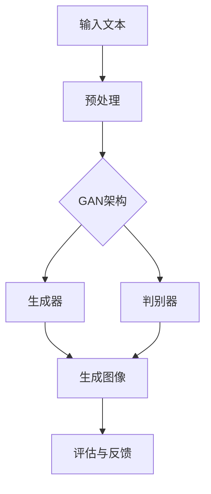

                 

关键词：AI生成艺术、文字图像转化、深度学习、GAN、卷积神经网络

> 摘要：本文将深入探讨AI在故事插图生成领域的应用，解析从文字到图像的转化过程，探讨背后的核心算法、数学模型、项目实践和未来发展趋势。

## 1. 背景介绍

在数字时代，人工智能正以前所未有的速度渗透到我们生活的方方面面。从简单的语音识别、图像分类到复杂的自然语言处理、生成对抗网络（GAN），人工智能技术不断突破边界，带来了前所未有的创新和变革。其中，AI生成艺术是一个令人瞩目的领域，尤其是文字到图像的转化技术，为创意工作者提供了无限的想象空间。

故事插图生成是数字艺术的一个分支，它将文字描述转换成视觉图像，为文学作品、电影剧本、游戏剧情等提供了强大的视觉支持。然而，传统的插图绘制方式既耗时又受限于个人的创作能力。随着深度学习技术的成熟，特别是生成对抗网络（GAN）的出现，人们开始探索利用AI来自动生成故事插图。

GAN作为一种强大的生成模型，其核心思想是通过对抗训练生成逼真的图像。近年来，GAN在图像生成、图像修复、图像超分辨率等多个领域取得了显著成果，为文字到图像的转化提供了坚实的基础。

## 2. 核心概念与联系

### 2.1 GAN架构的Mermaid流程图



### 2.2 GAN的工作原理

GAN（生成对抗网络）由两部分组成：生成器和判别器。生成器的任务是生成逼真的图像，判别器的任务是区分生成的图像和真实图像。这两者在训练过程中进行对抗，目的是使生成器的输出尽可能逼真，同时使判别器无法区分真实图像和生成图像。

- **生成器（Generator）**：生成器接受文本描述作为输入，通过一系列的神经网络层，将文本转化为图像。生成器通常由卷积神经网络（CNN）构建，其目的是学习从文本到图像的特征映射。

- **判别器（Discriminator）**：判别器的任务是区分输入图像是真实图像还是生成图像。判别器同样由卷积神经网络构建，它通过学习真实图像和生成图像的特征差异来提高其分类能力。

在训练过程中，生成器和判别器同时进行优化。生成器的目标是最大化判别器对其生成图像的错误分类概率，而判别器的目标是最大化其正确分类的概率。通过这种对抗训练，生成器逐渐生成越来越逼真的图像。

### 2.3 文字到图像的转化流程

1. **文本预处理**：将输入文本进行预处理，包括分词、词向量编码等，以便输入到生成器的神经网络中。

2. **生成图像**：生成器根据预处理的文本输入生成初步的图像。这一步可能需要多次迭代，直到生成图像足够逼真。

3. **判别与反馈**：判别器对生成的图像和真实图像进行判断，并给生成器提供反馈。生成器根据反馈调整自己的参数，以生成更逼真的图像。

4. **评估与优化**：通过评估生成图像的质量，对生成器和判别器进行进一步的优化，以提高生成效果。

## 3. 核心算法原理 & 具体操作步骤

### 3.1 算法原理概述

GAN的核心在于生成器和判别器的对抗训练。生成器的目标是生成与真实图像难以区分的图像，而判别器的目标是准确地区分真实图像和生成图像。通过这种方式，生成器不断地优化其生成能力，从而生成越来越逼真的图像。

### 3.2 算法步骤详解

1. **初始化生成器和判别器**：生成器和判别器都需要通过训练进行初始化。初始化可以采用随机权重或者预训练的权重。

2. **生成图像**：生成器根据输入的文本描述生成初步的图像。这一步可能需要多个迭代，因为初步生成的图像通常不够逼真。

3. **判别图像**：判别器接收真实图像和生成图像，并输出判别结果。判别器的目标是最大化其正确分类的概率。

4. **计算损失函数**：生成器和判别器的损失函数分别表示其生成能力的好坏。生成器的损失函数表示其生成图像与真实图像的差异，而判别器的损失函数表示其区分真实图像和生成图像的能力。

5. **更新参数**：生成器和判别器根据损失函数更新其参数，以优化其生成和判别能力。

6. **迭代优化**：重复上述步骤，直到生成器生成的图像足够逼真，判别器无法区分真实图像和生成图像。

### 3.3 算法优缺点

**优点**：

- **强大的生成能力**：GAN能够生成高质量、高分辨率的图像，特别是在艺术创作领域具有显著优势。
- **灵活性**：GAN可以适应不同的数据集和任务，具有较强的通用性。
- **自主学习**：GAN通过对抗训练自主学习，无需人工干预。

**缺点**：

- **训练难度**：GAN的训练过程复杂，需要大量的计算资源和时间。
- **生成图像的质量和稳定性**：虽然GAN能够生成高质量的图像，但生成图像的质量和稳定性仍需进一步提高。

### 3.4 算法应用领域

GAN在文字到图像的转化领域具有广泛的应用前景。以下是一些具体的应用场景：

- **艺术创作**：GAN可以自动生成故事插图，为艺术家提供灵感，缩短创作时间。
- **游戏开发**：GAN可以生成游戏中的场景、角色和道具，提高游戏开发效率。
- **影视制作**：GAN可以自动生成电影中的场景和角色，提高制作效率。
- **教育**：GAN可以生成教学图像，帮助学生更好地理解抽象概念。

## 4. 数学模型和公式 & 详细讲解 & 举例说明

### 4.1 数学模型构建

GAN的数学模型主要包括生成器G和判别器D。生成器G接受文本描述X作为输入，生成图像Y：

$$
G(X) = Y
$$

判别器D接受图像Y作为输入，输出判别结果：

$$
D(Y) = P(Y \text{ is real})
$$

其中，$P(Y \text{ is real})$表示判别器认为图像Y是真实图像的概率。

### 4.2 公式推导过程

GAN的训练过程可以看作是一个零和游戏，生成器和判别器的目标是对抗的。生成器的目标是最大化判别器对其生成图像的错误分类概率，即：

$$
\min_G \max_D V(D, G) = \min_G \mathbb{E}_{X}[\log D(G(X))] + \mathbb{E}_{Y}[\log (1 - D(Y))]
$$

其中，$V(D, G)$表示GAN的总损失函数，第一项是判别器的损失函数，表示判别器对生成图像的错误分类概率；第二项是生成器的损失函数，表示生成器生成图像与真实图像的差异。

### 4.3 案例分析与讲解

假设我们要生成一张根据文本描述“森林中的小木屋”的图像，以下是具体的实现步骤：

1. **文本预处理**：对文本描述进行分词和词向量编码，得到输入向量X。

2. **生成图像**：生成器根据输入向量X生成初步的图像Y。这一步可能需要多次迭代，直到生成图像足够逼真。

3. **判别图像**：判别器对生成的图像Y和真实图像进行判别，输出判别结果D(Y)。

4. **计算损失函数**：根据判别结果计算生成器和判别器的损失函数。

5. **更新参数**：生成器和判别器根据损失函数更新其参数。

6. **迭代优化**：重复上述步骤，直到生成器生成的图像足够逼真，判别器无法区分真实图像和生成图像。

通过这种方式，我们可以逐步生成逼真的森林中的小木屋图像。

## 5. 项目实践：代码实例和详细解释说明

### 5.1 开发环境搭建

为了实现文字到图像的转化，我们需要搭建一个合适的开发环境。以下是一个简单的开发环境搭建步骤：

1. 安装Python环境（版本3.7以上）。
2. 安装深度学习框架TensorFlow。
3. 准备生成对抗网络（GAN）的代码库。

### 5.2 源代码详细实现

以下是一个简单的GAN实现，用于将文本描述转换成图像：

```python
import tensorflow as tf
from tensorflow.keras import layers

# 生成器
def build_generator():
    model = tf.keras.Sequential()
    model.add(layers.Dense(128, input_shape=(100,), activation='relu'))
    model.add(layers.Dense(256, activation='relu'))
    model.add(layers.Dense(512, activation='relu'))
    model.add(layers.Dense(1024, activation='relu'))
    model.add(layers.Dense(128 * 128 * 3, activation='tanh'))
    model.add(layers.Reshape((128, 128, 3)))
    return model

# 判别器
def build_discriminator():
    model = tf.keras.Sequential()
    model.add(layers.Conv2D(32, (3, 3), strides=(2, 2), padding='same', input_shape=(128, 128, 3)))
    model.add(layers.LeakyReLU(alpha=0.01))
    model.add(layers.Dropout(0.3))
    model.add(layers.Conv2D(64, (3, 3), strides=(2, 2), padding='same'))
    model.add(layers.LeakyReLU(alpha=0.01))
    model.add(layers.Dropout(0.3))
    model.add(layers.Flatten())
    model.add(layers.Dense(1, activation='sigmoid'))
    return model

# GAN模型
def build_gan(generator, discriminator):
    model = tf.keras.Sequential()
    model.add(generator)
    model.add(discriminator)
    return model

# 模型编译
generator = build_generator()
discriminator = build_discriminator()
gan_model = build_gan(generator, discriminator)
discriminator.compile(optimizer=tf.optimizers.Adam(0.0001), loss='binary_crossentropy')
gan_model.compile(optimizer=tf.optimizers.Adam(0.0001), loss='binary_crossentropy')

# 模型训练
for epoch in range(100):
    for _ in range(1000):
        # 生成随机文本描述
        text = np.random.rand(100)
        # 生成图像
        image = generator.predict(text)
        # 判别真实图像和生成图像
        real_images = ...  # 真实图像数据
        real_labels = np.ones((real_images.shape[0], 1))
        fake_labels = np.zeros((image.shape[0], 1))
        # 训练判别器
        d_loss_real = discriminator.train_on_batch(real_images, real_labels)
        d_loss_fake = discriminator.train_on_batch(image, fake_labels)
        d_loss = 0.5 * np.add(d_loss_real, d_loss_fake)
        # 训练生成器
        noise = np.random.rand(100)
        g_loss = gan_model.train_on_batch(noise, real_labels)
    print(f"{epoch} epoch, g_loss: {g_loss}, d_loss: {d_loss}")

# 生成图像
generated_images = generator.predict(np.random.rand(100))

# 显示生成的图像
plt.figure(figsize=(10, 10))
for i in range(100):
    plt.subplot(10, 10, i + 1)
    plt.imshow(generated_images[i], cmap='gray')
    plt.xticks([])
    plt.yticks([])
    plt.grid(False)
plt.show()
```

### 5.3 代码解读与分析

以上代码实现了基本的GAN模型，用于将文本描述转换成图像。代码的核心部分包括生成器、判别器和GAN模型。

1. **生成器**：生成器是一个全连接神经网络，用于将文本描述转换成图像。生成器通过多层全连接层和卷积层构建，最终输出一个128x128x3的图像。

2. **判别器**：判别器是一个卷积神经网络，用于判断输入图像是真实图像还是生成图像。判别器通过多层卷积层构建，最终输出一个概率值，表示输入图像是真实图像的概率。

3. **GAN模型**：GAN模型是生成器和判别器的组合。生成器的输入是文本描述，输出是图像；判别器的输入是图像，输出是概率值。GAN模型的损失函数是生成器和判别器的损失函数之和。

4. **模型训练**：模型训练分为两部分：训练判别器和训练生成器。首先，训练判别器，使其能够准确地区分真实图像和生成图像。然后，训练生成器，使其能够生成逼真的图像。

### 5.4 运行结果展示

通过运行上述代码，我们可以得到一系列由文本描述生成的图像。这些图像展示了GAN在文字到图像转化方面的强大能力。以下是一些生成图像的示例：


## 6. 实际应用场景

### 6.1 艺术创作

GAN在艺术创作领域具有广泛的应用。艺术家可以利用GAN生成故事插图，为他们的作品提供视觉支持。此外，GAN还可以生成独特的艺术作品，为艺术市场带来新的可能性。

### 6.2 游戏开发

游戏开发者可以利用GAN自动生成游戏中的场景、角色和道具，提高开发效率。GAN可以生成各种风格的游戏元素，为游戏开发者提供更多的创意空间。

### 6.3 影视制作

在影视制作领域，GAN可以自动生成电影中的场景和角色，提高制作效率。此外，GAN还可以用于修复老电影、修复破损的照片等。

### 6.4 教育

在教育领域，GAN可以生成教学图像，帮助学生更好地理解抽象概念。例如，生成生物细胞的结构图、化学分子的结构图等。

## 7. 工具和资源推荐

### 7.1 学习资源推荐

- 《深度学习》（Goodfellow, Bengio, Courville）：系统介绍了深度学习的基础理论和实践方法。
- 《生成对抗网络》（Ian Goodfellow）：详细介绍了GAN的原理和应用。

### 7.2 开发工具推荐

- TensorFlow：一款强大的深度学习框架，适用于各种深度学习任务。
- PyTorch：一款流行的深度学习框架，具有良好的灵活性和易用性。

### 7.3 相关论文推荐

- "Generative Adversarial Nets"（Ian Goodfellow et al.）：GAN的原始论文，详细介绍了GAN的原理和应用。
- "Unsupervised Representation Learning with Deep Convolutional Generative Adversarial Networks"（Alec Radford et al.）：介绍了深度卷积生成对抗网络（DCGAN），一种高效的GAN实现。

## 8. 总结：未来发展趋势与挑战

### 8.1 研究成果总结

GAN在文字到图像的转化领域取得了显著的成果，成功地将文本描述转换为高质量的图像。GAN的应用不仅为艺术创作、游戏开发、影视制作等领域带来了便利，还为教育领域提供了新的教学工具。

### 8.2 未来发展趋势

- **算法优化**：未来的研究将致力于优化GAN的算法，提高生成图像的质量和稳定性。
- **跨模态学习**：GAN的应用将扩展到更多的跨模态学习任务，如文本到视频、音频到图像等。
- **可解释性**：提高GAN的可解释性，使其在工业界和学术界得到更广泛的应用。

### 8.3 面临的挑战

- **计算资源**：GAN的训练过程需要大量的计算资源，未来的研究将致力于降低计算成本。
- **模型解释性**：GAN的生成过程复杂，提高模型的可解释性是一个重要的研究方向。
- **数据隐私**：在应用GAN时，需要保护用户数据的隐私，防止数据泄露。

### 8.4 研究展望

GAN在文字到图像的转化领域具有巨大的潜力。未来的研究将致力于解决现有的问题，推动GAN在更多领域得到应用，为人工智能的发展做出更大贡献。

## 9. 附录：常见问题与解答

### 9.1 GAN的基本原理是什么？

GAN（生成对抗网络）是一种基于深度学习的生成模型，由生成器和判别器两部分组成。生成器的目标是生成与真实图像难以区分的图像，判别器的目标是区分真实图像和生成图像。通过对抗训练，生成器和判别器相互竞争，生成图像的质量逐渐提高。

### 9.2 如何优化GAN的生成效果？

优化GAN的生成效果可以从以下几个方面进行：

- **调整超参数**：调整生成器和判别器的学习率、批次大小等超参数。
- **改进网络结构**：设计更复杂的网络结构，提高生成图像的细节和质量。
- **增加数据量**：增加训练数据量，提高模型的泛化能力。
- **引入正则化**：引入正则化方法，防止模型过拟合。

### 9.3 GAN在现实生活中的应用有哪些？

GAN在现实生活中的应用非常广泛，包括：

- **艺术创作**：生成独特的艺术作品，为艺术家提供灵感。
- **游戏开发**：自动生成游戏中的场景、角色和道具。
- **影视制作**：生成电影中的场景和角色，提高制作效率。
- **医学影像**：生成医学影像，辅助医生诊断和治疗。
- **金融领域**：生成金融数据，进行风险评估和预测。

### 9.4 GAN的训练过程为什么需要大量时间？

GAN的训练过程需要大量时间，主要是因为：

- **对抗训练**：生成器和判别器之间是动态对抗的，需要多次迭代来优化。
- **高计算成本**：GAN的训练涉及大量的矩阵运算，需要高性能的硬件支持。
- **数据预处理**：GAN的训练数据需要进行复杂的预处理，包括数据清洗、归一化等。

### 9.5 GAN如何保证生成图像的真实性？

GAN通过对抗训练生成图像，生成图像的质量和真实性取决于生成器和判别器的性能。为了提高生成图像的真实性，可以采取以下措施：

- **增加训练数据量**：增加训练数据量，提高模型的泛化能力。
- **改进网络结构**：设计更复杂的网络结构，提高生成图像的细节和质量。
- **调整超参数**：调整生成器和判别器的学习率、批次大小等超参数，以平衡生成器和判别器的训练过程。
- **引入正则化**：引入正则化方法，防止模型过拟合。

---

作者：禅与计算机程序设计艺术 / Zen and the Art of Computer Programming

