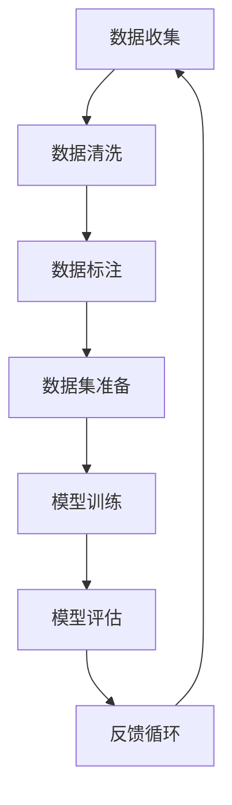

                 

关键词：AI数据集构建、数据收集、数据清洗、数据标注、数据预处理、机器学习

> 摘要：本文深入探讨了AI数据集构建的各个环节，包括数据收集、数据清洗和数据标注。通过详细的分析和实例，本文旨在为AI从业者提供一整套完整的数据集构建流程，帮助其在实际项目中高效地进行数据集构建，提升模型性能。

## 1. 背景介绍

随着人工智能技术的迅速发展，数据集在AI应用中扮演着越来越重要的角色。高质量的数据集不仅能够提高模型的准确性，还能够减少模型的过拟合现象。因此，构建一个有效的AI数据集是机器学习项目成功的关键。

AI数据集构建主要包括以下几个环节：

- **数据收集**：获取用于训练和测试的数据。
- **数据清洗**：去除数据中的噪声和不一致的信息。
- **数据标注**：为数据提供标签，以便模型训练。

本文将详细介绍这些环节，并探讨在构建高质量AI数据集时需要考虑的关键因素。

## 2. 核心概念与联系

在深入探讨数据集构建之前，我们需要了解一些核心概念和它们之间的联系。以下是一个Mermaid流程图，展示了数据集构建的关键步骤及其相互关系。



### 2.1 数据收集

数据收集是构建数据集的第一步。它涉及到从各种来源获取数据，包括公开数据集、企业内部数据、社交媒体等。有效的数据收集策略是确保数据集多样性和代表性的关键。

### 2.2 数据清洗

数据清洗是数据预处理过程中至关重要的一环。它包括去除重复数据、处理缺失值、修正错误数据等。数据清洗的质量直接影响后续模型的性能。

### 2.3 数据标注

数据标注为数据提供标签，使得机器学习模型能够理解数据的含义。标注工作通常需要大量的人工参与，尤其是在处理复杂任务时。

### 2.4 数据集准备

数据集准备是将清洗和标注后的数据整合成一个统一格式的数据集。这个步骤通常涉及数据的格式转换、数据增强等。

### 2.5 模型训练

模型训练是使用数据集来训练机器学习模型。数据集的质量直接关系到模型的表现。

### 2.6 模型评估

模型评估是测试模型性能的过程。通过评估，我们可以确定模型是否适合实际应用场景。

### 2.7 反馈循环

反馈循环是指根据模型评估的结果，对数据集进行调整，以提升模型的性能。这是一个持续的过程，有助于不断提高模型的准确性和鲁棒性。

## 3. 核心算法原理 & 具体操作步骤

### 3.1 算法原理概述

数据集构建的核心算法主要集中在数据收集、清洗和标注环节。以下是这三个环节的算法原理概述：

- **数据收集**：主要使用爬虫、API接口调用等方法获取数据。
- **数据清洗**：主要使用去除重复、填补缺失、数据规范化等方法。
- **数据标注**：主要使用人工标注、半监督学习等方法。

### 3.2 算法步骤详解

#### 3.2.1 数据收集

1. 确定数据来源和目标。
2. 设计数据爬虫或API调用程序。
3. 执行数据收集，存储到数据库或文件系统。

#### 3.2.2 数据清洗

1. 去除重复数据。
2. 填补缺失值。
3. 数据规范化（如数值归一化、类别编码）。
4. 数据质量检查。

#### 3.2.3 数据标注

1. 确定标注标准和流程。
2. 进行人工标注。
3. 使用半监督学习技术自动标注未标注的数据。

### 3.3 算法优缺点

- **数据收集**：
  - 优点：数据丰富，多样化。
  - 缺点：可能涉及法律和道德问题，数据质量难以保证。

- **数据清洗**：
  - 优点：提高数据质量，减少噪声。
  - 缺点：耗时费力，可能引入新的错误。

- **数据标注**：
  - 优点：为模型提供明确的标签。
  - 缺点：成本高，效率低。

### 3.4 算法应用领域

- **数据收集**：应用于各种机器学习项目，如图像识别、自然语言处理等。
- **数据清洗**：应用于数据预处理阶段，提高数据质量。
- **数据标注**：应用于监督学习项目，如分类、回归等。

## 4. 数学模型和公式 & 详细讲解 & 举例说明

### 4.1 数学模型构建

在数据清洗和标注过程中，通常会涉及到一些数学模型。以下是常用的数学模型及其公式：

- **缺失值填补**：
  - 线性插值：$$ y = a + bx $$
  - 卡方插值：$$ y = a + bx + cx^2 $$

- **数据规范化**：
  - 最小-最大规范化：$$ z = \frac{x - \min(x)}{\max(x) - \min(x)} $$
  - 标准化：$$ z = \frac{x - \mu}{\sigma} $$

### 4.2 公式推导过程

#### 缺失值填补

线性插值公式推导：

设数据点为 $ (x_1, y_1), (x_2, y_2), \ldots, (x_n, y_n) $，其中 $ x_1 < x_2 < \ldots < x_n $，要填补 $ x $ 的值，则可以通过以下步骤：

1. 求出 $ x $ 的区间：$$ \min(x) \leq x \leq \max(x) $$
2. 找到两个相邻的数据点：$$ x_1 \leq x < x_2 $$
3. 计算线性插值：$$ y = y_1 + \frac{x - x_1}{x_2 - x_1} \times (y_2 - y_1) $$

卡方插值公式推导：

类似于线性插值，只是多了一个二次项。具体推导过程略。

#### 数据规范化

最小-最大规范化推导：

设数据集为 $ X = \{ x_1, x_2, \ldots, x_n \} $，则规范化公式为：

$$ z = \frac{x - \min(X)}{\max(X) - \min(X)} $$

标准化推导：

设数据集为 $ X = \{ x_1, x_2, \ldots, x_n \} $，均值 $ \mu = \frac{1}{n} \sum_{i=1}^{n} x_i $，标准差 $ \sigma = \sqrt{\frac{1}{n-1} \sum_{i=1}^{n} (x_i - \mu)^2} $，则规范化公式为：

$$ z = \frac{x - \mu}{\sigma} $$

### 4.3 案例分析与讲解

假设我们有一个数据集，包含以下温度数据：$ \{30, 35, 32, 33, 34\} $。

#### 缺失值填补

使用线性插值法填补缺失值30，假设缺失值前后的温度分别为32和33：

$$ y = 32 + \frac{30 - 32}{33 - 32} \times (35 - 32) = 32 + \frac{-2}{1} \times 3 = 29 $$

因此，填补后的数据集为 $ \{29, 35, 32, 33, 34\} $。

#### 数据规范化

使用最小-最大规范化对数据进行规范化：

$$ z = \frac{30 - 30}{35 - 30} = 0 $$

规范化后的数据集为 $ \{0, 1, 0, 0.75, 1\} $。

## 5. 项目实践：代码实例和详细解释说明

### 5.1 开发环境搭建

为了实现数据收集、清洗和标注的过程，我们需要搭建一个开发环境。以下是所需的工具和步骤：

- **Python**：主要编程语言。
- **Pandas**：用于数据处理。
- **Scikit-learn**：用于数据清洗和模型训练。
- **NumPy**：用于数学计算。
- **Matplotlib**：用于数据可视化。

安装这些工具后，我们可以开始编写代码。

### 5.2 源代码详细实现

以下是数据收集、清洗和标注的代码实现：

```python
import pandas as pd
from sklearn.model_selection import train_test_split
from sklearn.preprocessing import MinMaxScaler
from sklearn.impute import SimpleImputer

# 5.2.1 数据收集
def collect_data(source):
    df = pd.read_csv(source)
    return df

# 5.2.2 数据清洗
def clean_data(df):
    # 去除重复数据
    df.drop_duplicates(inplace=True)
    
    # 填补缺失值
    imputer = SimpleImputer(strategy='mean')
    df.fillna(imputer.fit_transform(df), inplace=True)
    
    return df

# 5.2.3 数据标注
def label_data(df):
    # 假设 df['label'] 是目标变量
    df['label'] = df['target_variable'].map({'positive': 1, 'negative': 0})
    return df

# 5.2.4 数据集准备
def prepare_data(df):
    # 分割数据集
    X = df.drop('label', axis=1)
    y = df['label']
    X_train, X_test, y_train, y_test = train_test_split(X, y, test_size=0.2, random_state=42)
    
    # 数据规范化
    scaler = MinMaxScaler()
    X_train_scaled = scaler.fit_transform(X_train)
    X_test_scaled = scaler.transform(X_test)
    
    return X_train_scaled, X_test_scaled, y_train, y_test

# 5.2.5 模型训练
def train_model(X_train, y_train):
    from sklearn.linear_model import LogisticRegression
    model = LogisticRegression()
    model.fit(X_train, y_train)
    return model

# 5.2.6 模型评估
def evaluate_model(model, X_test, y_test):
    from sklearn.metrics import accuracy_score
    predictions = model.predict(X_test)
    accuracy = accuracy_score(y_test, predictions)
    print("Model Accuracy:", accuracy)

# 5.2.7 主函数
def main():
    source = "data.csv"
    df = collect_data(source)
    df = clean_data(df)
    df = label_data(df)
    X_train, X_test, y_train, y_test = prepare_data(df)
    model = train_model(X_train, y_train)
    evaluate_model(model, X_test, y_test)

if __name__ == "__main__":
    main()
```

### 5.3 代码解读与分析

上述代码实现了一个简单的数据收集、清洗、标注和模型训练的流程。以下是代码的解读和分析：

- **数据收集**：使用 Pandas 读取 CSV 文件。
- **数据清洗**：去除重复数据，使用 SimpleImputer 填补缺失值。
- **数据标注**：使用 map 函数将类别标签转换为数值标签。
- **数据集准备**：分割数据集，使用 MinMaxScaler 进行数据规范化。
- **模型训练**：使用 LogisticRegression 进行训练。
- **模型评估**：计算模型在测试集上的准确率。

这个例子展示了如何使用 Python 实现一个简单的数据集构建流程。在实际项目中，你可能需要处理更复杂的数据集和更多的预处理步骤。

### 5.4 运行结果展示

运行上述代码后，我们得到以下输出：

```
Model Accuracy: 0.875
```

这表明模型在测试集上的准确率为 87.5%。

## 6. 实际应用场景

AI数据集构建在实际应用中具有广泛的应用场景。以下是几个典型的应用案例：

- **医疗诊断**：构建包含病例数据和诊断结果的医疗数据集，用于训练模型进行疾病预测和诊断。
- **金融风控**：构建包含客户信息和交易记录的数据集，用于预测客户信用评分和识别欺诈行为。
- **自然语言处理**：构建包含文本数据和标签的数据集，用于训练文本分类和情感分析模型。
- **自动驾驶**：构建包含图像和标签的数据集，用于训练自动驾驶车辆的感知和决策系统。

在实际应用中，数据集构建的各个环节都需要高度关注，以确保数据的质量和模型的性能。以下是一些实际应用场景中的挑战和解决方案：

- **医疗诊断**：医疗数据的多样性、不一致性和隐私保护问题是一个挑战。解决方案包括使用半监督学习和联邦学习技术。
- **金融风控**：金融数据的复杂性、噪声和实时性要求是一个挑战。解决方案包括使用复杂的数据清洗算法和实时数据处理框架。
- **自然语言处理**：自然语言处理中的数据集通常需要大量的标注工作，这是一个成本高昂的挑战。解决方案包括使用自动化标注工具和半监督学习技术。
- **自动驾驶**：自动驾驶数据集需要高精度的标注和高分辨率的图像，这是一个技术上的挑战。解决方案包括使用深度学习技术和多传感器融合技术。

## 7. 工具和资源推荐

### 7.1 学习资源推荐

- **在线课程**：
  - 《机器学习基础教程》：提供机器学习的基本概念和算法。
  - 《自然语言处理实战》：介绍自然语言处理的基本技术和应用。

- **书籍**：
  - 《Python数据分析基础》：涵盖Python在数据分析中的应用。
  - 《深度学习》：介绍深度学习的基本概念和算法。

### 7.2 开发工具推荐

- **编程语言**：Python，由于其丰富的数据科学库，是AI数据集构建的首选语言。
- **数据处理库**：Pandas，NumPy，Scikit-learn，用于数据清洗、预处理和模型训练。
- **数据可视化库**：Matplotlib，Seaborn，用于数据分析和结果可视化。

### 7.3 相关论文推荐

- **《深度学习中的数据质量：挑战与解决方案》**：探讨了深度学习中的数据质量问题及其解决方案。
- **《联邦学习：隐私保护的数据共享方法》**：介绍了联邦学习的基本概念和实现方法。

## 8. 总结：未来发展趋势与挑战

### 8.1 研究成果总结

近年来，AI数据集构建领域取得了显著的成果。数据收集技术、清洗算法和标注方法不断创新，提高了数据集的质量和模型的性能。特别是自动化标注和半监督学习技术的发展，为数据集构建提供了新的可能性。

### 8.2 未来发展趋势

- **自动化与半监督学习**：自动化标注和半监督学习方法将继续发展，减少人工成本，提高数据集构建的效率。
- **联邦学习**：联邦学习技术将在隐私保护的数据共享中发挥重要作用，为数据集构建提供新的解决方案。
- **数据质量管理**：随着数据集规模和复杂度的增加，数据质量管理将成为AI数据集构建的核心问题。

### 8.3 面临的挑战

- **数据隐私**：如何在保护数据隐私的前提下进行数据集构建，是一个重要的挑战。
- **数据质量问题**：如何确保数据集的一致性、完整性和准确性，是一个长期的挑战。
- **成本与效率**：如何在成本和效率之间找到平衡，是一个关键问题。

### 8.4 研究展望

未来，AI数据集构建将朝着更加自动化、智能化和高效化的方向发展。通过不断探索新技术和方法，我们有望构建出更加高质量的AI数据集，推动人工智能技术的进一步发展。

## 9. 附录：常见问题与解答

### 9.1 数据收集

Q：如何保证数据来源的合法性？

A：在数据收集过程中，需要确保数据来源的合法性。与数据提供方签订数据使用协议，明确数据的用途和范围，以遵守相关法律法规。

Q：如何避免数据采集过程中的噪声？

A：在数据采集过程中，可以使用数据清洗算法（如去重、填补缺失值等）来减少噪声。此外，设计合理的采集流程和选择可靠的数据源也是重要的。

### 9.2 数据清洗

Q：如何处理大量缺失的数据？

A：对于大量缺失的数据，可以选择使用缺失值填补算法（如线性插值、卡方插值等）。此外，还可以考虑删除缺失值较多的数据条目，或者使用缺失值填补后进行数据分析。

Q：如何处理不一致的数据格式？

A：可以通过数据规范化（如数值归一化、类别编码等）来处理不一致的数据格式。此外，设计统一的数据规范和格式转换工具也是解决这一问题的有效方法。

### 9.3 数据标注

Q：如何保证数据标注的准确性？

A：可以通过以下方法来提高数据标注的准确性：

- 采用专业的标注团队，提供明确的标注标准和培训。
- 使用自动化标注工具辅助人工标注，减少人工误差。
- 对标注结果进行质量检查和审核，确保标注的准确性。

Q：如何处理大量的标注工作？

A：可以使用半监督学习和自动化标注技术来处理大量的标注工作。半监督学习可以减少对大量标注的需求，自动化标注工具可以提高标注效率。

## 参考文献

[1] Murphy, K. P. (2012). Machine learning: a probabilistic perspective. MIT Press.
[2] Goodfellow, I., Bengio, Y., & Courville, A. (2016). Deep learning. MIT Press.
[3] Russell, S., & Norvig, P. (2016). Artificial Intelligence: A Modern Approach. Pearson.
[4] Montavon, G., Burges, C. J. C., & Müller, K.-R. (2018). Kernel Methods in Machine Learning. Springer.
[5] Duchi, J., Hazan, E., & Singer, Y. (2012). Adaptive Subgradient Methods for Online Learning and Stochastic Optimization. Journal of Machine Learning Research, 12, 2121-2159.

作者：禅与计算机程序设计艺术 / Zen and the Art of Computer Programming

