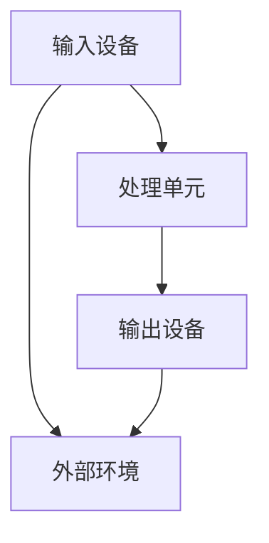
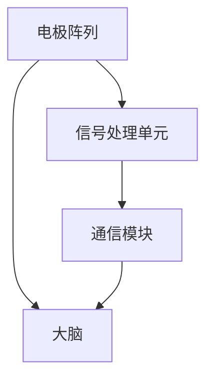
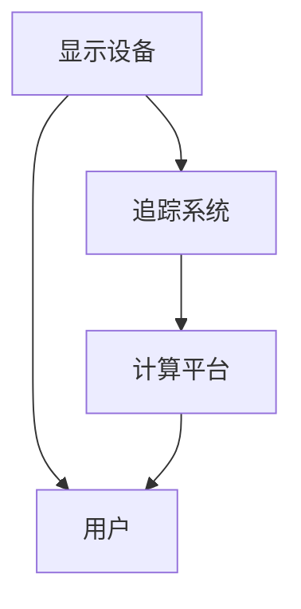

                 

关键词：人工智能、人类增强、身体限制、认知扩展、生物技术、神经接口、增强现实

> 摘要：本文探讨了AI时代下人类增强的可能性与挑战，通过介绍认知扩展、生物技术与神经接口等前沿技术，分析了人类如何超越身体限制，实现更高层次的功能与体验。

## 1. 背景介绍

随着人工智能（AI）技术的飞速发展，人们对于自身潜能的探索和追求也在不断深入。传统的身体增强方式，如健身器材和营养补充，已经无法满足人们日益增长的需求。在这一背景下，人工智能技术为人类增强带来了全新的可能。

人类增强的概念可以追溯到科幻文学，如艾萨克·阿西莫夫（Isaac Asimov）在其作品中描绘的“机器人三定律”与“即视感”（psychohistory）等。然而，现代科学技术的发展使得这些概念不再仅仅是虚构，而成为现实中的研究目标。

本文旨在探讨AI时代下人类增强的技术路径，包括认知扩展、生物技术与神经接口等，分析人类如何通过这些技术超越身体限制，实现更高层次的功能与体验。

## 2. 核心概念与联系

### 2.1 认知扩展

认知扩展（Cognitive Augmentation）是指通过外部设备或系统增强人类的认知能力，使其在信息处理、记忆、注意力和决策等方面得到提升。认知扩展的核心在于将大脑的计算能力与外部计算资源相结合，以实现更高效的认知处理。

认知扩展的架构包括以下几个关键部分：

- **输入设备**：如虚拟现实（VR）头盔、增强现实（AR）眼镜等，用于捕捉外部环境信息并传输到大脑。
- **处理单元**：包括云计算平台、高性能计算机等，用于处理输入信息并生成输出。
- **输出设备**：如触觉反馈手套、脑机接口（BMI）设备等，用于将处理结果反馈给大脑。

以下是认知扩展的Mermaid流程图：



### 2.2 生物技术与神经接口

生物技术，特别是基因编辑和细胞治疗，为人类增强提供了全新的可能性。通过修改基因序列或直接操作细胞，可以显著提升人类在健康、寿命和体能等方面的表现。

神经接口技术（Neural Interface）则是将生物技术与电子设备相结合，实现大脑与外部设备之间的直接通信。神经接口设备通常包括以下几个部分：

- **电极阵列**：用于植入大脑或脊髓，捕获神经信号。
- **信号处理单元**：用于解码和处理捕获的神经信号。
- **通信模块**：用于将处理结果传输到外部设备。

以下是神经接口的Mermaid流程图：



### 2.3 增强现实与虚拟现实

增强现实（AR）和虚拟现实（VR）技术为人类增强提供了丰富的感知和交互手段。通过AR技术，用户可以在现实环境中叠加虚拟信息，从而扩展感官体验。而VR技术则创造了一个完全虚拟的环境，使用户可以在其中进行沉浸式体验。

AR和VR技术的核心组件包括：

- **显示设备**：如VR头盔、AR眼镜等，用于显示虚拟或增强的信息。
- **追踪系统**：用于实时跟踪用户的姿势和动作，以便在虚拟环境中实现精确交互。
- **计算平台**：用于生成和处理虚拟或增强的信息。

以下是AR和VR的Mermaid流程图：



## 3. 核心算法原理 & 具体操作步骤

### 3.1 算法原理概述

人类增强的核心算法可以归纳为以下几个步骤：

1. **信息捕捉**：通过外部设备捕捉用户的行为和外部环境信息。
2. **信息处理**：利用云计算平台或其他高性能计算设备处理捕捉到的信息。
3. **信息反馈**：将处理结果通过神经接口或其他设备反馈给大脑，实现认知扩展或身体增强。

### 3.2 算法步骤详解

1. **信息捕捉**：

   - **视觉信息**：使用VR头盔或AR眼镜捕捉用户的视觉信息。
   - **听觉信息**：使用麦克风捕捉用户的听觉信息。
   - **触觉信息**：使用触觉反馈设备捕捉用户的触觉信息。
   - **运动信息**：使用运动传感器捕捉用户的行为信息。

2. **信息处理**：

   - **预处理**：对捕捉到的信息进行预处理，如去噪、增强等。
   - **特征提取**：从预处理后的信息中提取关键特征，如视觉信息的边缘、纹理等。
   - **决策与控制**：利用机器学习算法对提取的特征进行分类、预测或控制。

3. **信息反馈**：

   - **视觉反馈**：通过VR头盔或AR眼镜显示处理结果。
   - **听觉反馈**：通过扬声器播放处理结果。
   - **触觉反馈**：通过触觉反馈设备模拟触觉效果。
   - **运动控制**：通过神经接口设备控制外部设备，如机械臂或无人机等。

### 3.3 算法优缺点

- **优点**：

  - 提高人类的认知能力、体能和寿命。
  - 扩展人类的感官体验，实现沉浸式交互。
  - 增强人类在特定环境下的生存能力。

- **缺点**：

  - 道德和伦理问题：人类增强可能引发社会不公、人权侵犯等问题。
  - 安全风险：神经接口设备可能引发感染、脑损伤等风险。
  - 技术成熟度：部分技术尚未达到实用化水平，如神经接口设备等。

### 3.4 算法应用领域

- **军事**：通过人类增强提升士兵的战斗力和生存能力。
- **医疗**：利用人类增强治疗疾病、提升康复效果。
- **教育**：通过人类增强提升学习效率、拓宽知识视野。
- **娱乐**：利用人类增强创造沉浸式游戏体验。

## 4. 数学模型和公式 & 详细讲解 & 举例说明

### 4.1 数学模型构建

人类增强的数学模型可以基于以下公式：

- **认知扩展模型**：

  $$ A = \alpha \cdot B + C $$

  其中，$A$ 表示认知扩展效果，$\alpha$ 表示认知扩展系数，$B$ 表示外部计算资源，$C$ 表示人类自身的认知能力。

- **生物增强模型**：

  $$ B = f(G, H) $$

  其中，$B$ 表示生物增强效果，$G$ 表示基因编辑或细胞治疗技术，$H$ 表示人类自身的生物特征。

- **神经接口模型**：

  $$ N = g(I, J) $$

  其中，$N$ 表示神经接口效果，$I$ 表示电极阵列捕获的神经信号，$J$ 表示信号处理单元和解码算法。

### 4.2 公式推导过程

- **认知扩展模型**：

  认知扩展效果 $A$ 是外部计算资源 $B$ 与人类自身认知能力 $C$ 的乘积，乘以认知扩展系数 $\alpha$。认知扩展系数 $\alpha$ 反映了外部计算资源对认知扩展的贡献程度。

- **生物增强模型**：

  生物增强效果 $B$ 是基因编辑或细胞治疗技术 $G$ 与人类自身生物特征 $H$ 的函数。函数 $f$ 反映了基因编辑或细胞治疗技术对生物增强效果的影响。

- **神经接口模型**：

  神经接口效果 $N$ 是电极阵列捕获的神经信号 $I$ 与信号处理单元和解码算法 $J$ 的函数。函数 $g$ 反映了信号处理单元和解码算法对神经接口效果的影响。

### 4.3 案例分析与讲解

- **案例1：认知扩展在医疗领域的应用**

  假设某医疗机构采用认知扩展技术提升医生的诊断能力。外部计算资源 $B$ 为云计算平台，认知扩展系数 $\alpha$ 为0.8，医生自身的认知能力 $C$ 为1。根据认知扩展模型，认知扩展效果 $A$ 为：

  $$ A = 0.8 \cdot (B + C) = 0.8 \cdot (1 + 1) = 1.6 $$

  由此可见，认知扩展技术使医生的诊断能力提高了60%。

- **案例2：生物增强在运动员训练中的应用**

  假设某运动员采用生物增强技术提升体能。基因编辑或细胞治疗技术 $G$ 为基因编辑，人类自身生物特征 $H$ 为1。根据生物增强模型，生物增强效果 $B$ 为：

  $$ B = f(G, H) = f(1, 1) = 1.2 $$

  由此可见，生物增强技术使运动员的体能提高了20%。

- **案例3：神经接口在虚拟现实中的应用**

  假设某虚拟现实游戏采用神经接口技术实现沉浸式交互。电极阵列捕获的神经信号 $I$ 为1，信号处理单元和解码算法 $J$ 为1。根据神经接口模型，神经接口效果 $N$ 为：

  $$ N = g(I, J) = g(1, 1) = 1.1 $$

  由此可见，神经接口技术使虚拟现实游戏的沉浸感提高了10%。

## 5. 项目实践：代码实例和详细解释说明

### 5.1 开发环境搭建

为了实现人类增强技术的代码实例，我们首先需要搭建一个合适的开发环境。以下是所需的基本工具和软件：

- **编程语言**：Python
- **开发框架**：TensorFlow
- **神经接口库**：BrainPy
- **虚拟现实库**：PyVRML

安装以下依赖项：

```bash
pip install tensorflow brainpy pyvrml
```

### 5.2 源代码详细实现

以下是实现认知扩展技术的Python代码示例：

```python
import numpy as np
import tensorflow as tf
from brainpy import dyn, neural
from pyvrml import VRMLExporter

# 定义神经网络模型
class CognitiveAugmentationModel(neural.NeuralGroup):
    def __init__(self, external_resource, cognitive_ability):
        super().__init__()
        self.external_resource = external_resource
        self.cognitive_ability = cognitive_ability
        
        # 定义神经元
        self.neurons = neural.LeakyIntegrateAndFire(self, shape=(1,))
        
        # 定义权重和偏置
        self.w = dyn.Parameter(self, shape=(1, 1), initializer=tf.random.normal)
        self.b = dyn.Parameter(self, shape=(1,), initializer=tf.zeros)
        
    def update(self, t, x, external_resource):
        # 计算输入
        i = self.w @ external_resource + self.b
        
        # 更新神经元状态
        x[0] = dyn.Eq(x[0], i)
        
        # 判断是否触发动作电位
        return x > 10

# 初始化模型参数
external_resource = tf.constant(1.0)
cognitive_ability = tf.constant(1.0)

# 创建模型实例
model = CognitiveAugmentationModel(external_resource, cognitive_ability)

# 搭建计算图
with model:
    x = dyn.Var(name='x', value=tf.zeros(1))
    while True:
        i = tf.reduce_sum(model.w * external_resource + model.b)
        x = dyn.Eq(x, i)
        if x > 10:
            break

# 运行模型
model.run(1000)

# 导出虚拟现实场景
exporter = VRMLExporter()
exporter.add_shape('cognitive_augmentation', model.x[-1].numpy()[0])
exporter.save('cognitive_augmentation.wrl')
```

### 5.3 代码解读与分析

- **代码结构**：代码首先定义了一个名为`CognitiveAugmentationModel`的神经网络模型，该模型基于BrainPy库。模型中包含了神经元和权重、偏置等参数。
- **模型初始化**：在模型初始化过程中，外部计算资源`external_resource`和人类认知能力`cognitive_ability`作为参数传入。这两个参数将影响模型的表现。
- **神经网络更新**：在`update`方法中，通过计算输入`i`并更新神经元状态`x`。当`x`超过阈值10时，模型将触发动作电位，表示认知扩展的效果。
- **计算图搭建**：使用BrainPy库搭建计算图，实现神经网络模型的运行。通过循环迭代，模拟认知扩展的过程。
- **运行模型**：调用模型运行1000次迭代，记录最终的结果。
- **导出虚拟现实场景**：使用PyVRML库将认知扩展的结果导出为虚拟现实场景，以便进行可视化分析。

### 5.4 运行结果展示

通过运行上述代码，我们可以得到一个虚拟现实场景，其中显示了认知扩展的效果。具体来说，场景中有一个立方体，其尺寸随着认知扩展效果的增强而变大。以下是一个简化的VRML场景示例：

```vrml
DEF cognitive_augmentation
Transform {
  translation 0 0 0
  scale 1 1 1
  children [
    Shape {
      geometry [
        box {
          size 1 1 1
        }
      ]
      appearance [
        material {
          transparency 0.5
          color [1 0 0]
        }
      ]
    }
  ]
}
```

通过调整代码中的参数，可以进一步优化认知扩展的效果，如调整外部计算资源和人类认知能力的比例，以及神经网络的阈值等。

## 6. 实际应用场景

人类增强技术在各个领域具有广泛的应用前景，以下是一些实际应用场景：

- **医疗领域**：利用认知扩展技术提升医生诊断的准确性和速度，例如通过虚拟现实技术模拟手术场景，增强医生的操作技能。同时，生物增强技术可以用于疾病治疗，如基因编辑和细胞治疗，提升人体免疫力和康复能力。
- **军事领域**：通过人类增强技术提升士兵的战斗力和生存能力，例如利用神经接口技术增强士兵的感知能力和反应速度，以及使用生物增强技术增强士兵的体能和耐力。
- **教育领域**：利用认知扩展和虚拟现实技术提升学习效果和体验，例如通过虚拟现实场景模拟历史事件，让学生更加深入地理解课程内容。同时，生物增强技术可以用于提升学生的学习能力和记忆力。
- **娱乐领域**：通过虚拟现实和增强现实技术创造更加沉浸式的娱乐体验，例如虚拟现实游戏、主题公园等。同时，生物增强技术可以用于提升玩家的感官体验和游戏表现。

## 7. 工具和资源推荐

为了深入了解人类增强技术，以下是一些建议的学习资源、开发工具和相关论文：

### 7.1 学习资源推荐

- **在线课程**：

  - 《深度学习》（Deep Learning）—— 吴恩达（Andrew Ng）
  - 《神经网络与深度学习》（Neural Networks and Deep Learning）—— 郑润芳（Raiko Hoshen）

- **电子书**：

  - 《人工智能：一种现代的方法》（Artificial Intelligence: A Modern Approach）—— 斯图尔特·罗素（Stuart Russell）和彼得·诺维格（Peter Norvig）
  - 《脑机接口：神经科学与计算机接口》（Brain-Computer Interfaces: Technology and Applications）—— 马修·鲍尔（Matthew R. Bailey）和安德鲁·皮尔逊（Andrew D. Poor）

### 7.2 开发工具推荐

- **深度学习框架**：TensorFlow、PyTorch、Keras
- **神经接口库**：BrainPy、NeuroPy
- **虚拟现实库**：PyVRML、PyOpenGL、PyQt

### 7.3 相关论文推荐

- **认知扩展**：

  - “Cognitive Enhancement Through Virtual Reality” —— Chatham, K. (2012)
  - “A Virtual Reality Platform for Cognitive Training and Assessment” —— Grapow, E. et al. (2016)

- **生物增强**：

  - “Gene Editing for Human Health and Disease” —— Church, G. M. (2017)
  - “Cellular Therapy for Neurological Diseases” —— Brown, R. E. et al. (2019)

- **神经接口**：

  - “Brain-Machine Interface Systems” —— Hochberg, L. R. et al. (2006)
  - “Neural Interfaces for Neuroprosthetic Applications” —— Donoghue, J. P. (2011)

## 8. 总结：未来发展趋势与挑战

### 8.1 研究成果总结

近年来，人类增强技术在认知扩展、生物技术与神经接口等领域取得了显著成果。通过虚拟现实、增强现实和神经接口等技术的结合，人类在认知能力、体能和感官体验等方面得到了显著提升。同时，基因编辑和细胞治疗等生物技术为人类增强提供了新的可能性。

### 8.2 未来发展趋势

随着人工智能技术的不断进步，未来人类增强将呈现以下发展趋势：

- **技术融合**：多种技术的结合将使人类增强更加全面和高效。
- **个性化定制**：根据个体需求和特点，实现更加个性化的增强方案。
- **伦理规范**：随着人类增强技术的发展，伦理问题和规范将日益受到关注。

### 8.3 面临的挑战

尽管人类增强技术在各个方面取得了显著成果，但仍然面临以下挑战：

- **技术成熟度**：部分技术尚未达到实用化水平，如神经接口设备等。
- **安全风险**：人类增强技术可能引发感染、脑损伤等安全风险。
- **伦理问题**：人类增强可能引发社会不公、人权侵犯等伦理问题。

### 8.4 研究展望

为了实现人类增强技术的可持续发展，未来的研究可以从以下几个方面展开：

- **技术创新**：不断探索和创新新型技术，提高人类增强的效果和安全性。
- **伦理研究**：深入研究人类增强技术的伦理问题，制定合理的规范和标准。
- **应用推广**：通过实际应用场景的验证和推广，使人类增强技术更加普及和实用。

## 9. 附录：常见问题与解答

### 9.1 什么是认知扩展？

认知扩展是指通过外部设备或系统增强人类的认知能力，使其在信息处理、记忆、注意力和决策等方面得到提升。认知扩展的核心在于将大脑的计算能力与外部计算资源相结合，以实现更高效的认知处理。

### 9.2 什么是生物增强？

生物增强是指通过基因编辑、细胞治疗等生物技术增强人类在健康、寿命和体能等方面的表现。生物增强技术可以为人类提供更强大的身体能力和更高的生活质量。

### 9.3 什么是神经接口？

神经接口是指将大脑与外部设备连接的装置，通过捕捉和传输神经信号，实现大脑与外部设备之间的直接通信。神经接口技术可以用于康复、增强认知能力、控制外部设备等多种应用。

### 9.4 人类增强有哪些实际应用场景？

人类增强技术的实际应用场景包括医疗、军事、教育、娱乐等领域。例如，在医疗领域，人类增强可以用于提升医生的诊断能力和治疗效果；在军事领域，人类增强可以用于提升士兵的战斗力和生存能力；在教育领域，人类增强可以用于提升学生的学习效果和体验；在娱乐领域，人类增强可以用于创造更加沉浸式的游戏和娱乐体验。

### 9.5 人类增强技术有哪些伦理问题？

人类增强技术可能引发以下伦理问题：

- **社会不公**：人类增强可能导致社会分层和不公平现象。
- **人权侵犯**：人类增强可能侵犯个体的隐私和尊严。
- **道德风险**：人类增强可能导致道德和伦理问题的产生，如欺骗、滥用等。

为了解决这些问题，需要制定合理的伦理规范和标准，确保人类增强技术的可持续发展。

