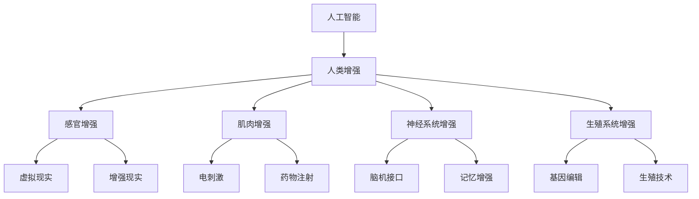

                 

关键词：人工智能、人类增强、道德考量、身体增强技术、未来方向

> 摘要：随着人工智能技术的飞速发展，人类增强的概念逐渐走入大众视野。本文将从道德考量和身体增强技术的未来方向出发，探讨人工智能时代人类增强的伦理问题和应用前景。

## 1. 背景介绍

在过去的几十年中，人工智能（AI）技术的发展取得了令人瞩目的成果。从简单的规则系统到复杂的深度学习模型，AI已经渗透到各行各业，极大地改变了我们的生活方式。然而，随着AI技术的不断进步，人类增强（Human Augmentation）的概念也应运而生。

人类增强指的是通过技术手段增强人类的身体功能、认知能力和社交能力。这种增强不仅限于医疗领域，还涉及到教育、军事、体育等多个方面。例如，通过增强现实（AR）和虚拟现实（VR）技术，人们可以在虚拟环境中进行更加逼真的训练；通过生物电子装置，人们可以改善听力、视力等感官能力；通过基因编辑技术，人们甚至可以改变自身的遗传特征。

然而，随着人类增强技术的发展，我们不得不面对一系列道德和伦理问题。如何在保证人类尊严和公平的前提下，合理地使用这些技术？如何确保技术的安全性和可控性？这些问题都需要我们深入思考和探讨。

## 2. 核心概念与联系

### 2.1 人工智能与人类增强

人工智能（AI）和人类增强（Human Augmentation）是两个紧密相连的概念。AI技术的发展为人类增强提供了强大的工具和平台。例如，通过机器学习和深度学习算法，我们可以构建出能够识别图像、处理语言和执行复杂任务的智能系统。这些系统不仅可以用于日常生活的增强，还可以在医疗、教育、军事等领域发挥重要作用。

### 2.2 人体增强技术

人体增强技术主要包括以下几个方面：

1. **感官增强**：通过智能眼镜、智能手表等设备，人们可以增强视觉、听觉、触觉等感官能力。
2. **肌肉增强**：通过电刺激、药物注射等方式，人们可以增强肌肉力量和耐力。
3. **神经系统增强**：通过脑机接口（BMI）技术，人们可以增强记忆、学习能力和决策能力。
4. **生殖系统增强**：通过基因编辑和生殖技术，人们可以改变遗传特征和生育能力。

### 2.3 道德考量

道德考量是人类增强技术发展过程中不可忽视的一环。我们需要思考以下几个问题：

1. **公平性**：人类增强技术是否会导致社会分层和不公平现象？
2. **隐私**：人类增强技术是否会影响个人隐私和信息安全？
3. **伦理**：人类增强技术是否违背了人类的基本伦理原则？

### 2.4 Mermaid 流程图



## 3. 核心算法原理 & 具体操作步骤

### 3.1 算法原理概述

人类增强技术的实现离不开人工智能算法的支持。这些算法主要包括：

1. **深度学习**：用于构建智能系统和增强人体功能。
2. **脑机接口**：用于建立大脑与外部设备的连接。
3. **基因编辑**：用于改变人体的遗传特征。

### 3.2 算法步骤详解

1. **深度学习算法**：

   - 数据收集：收集大量的图像、文本和语音数据。
   - 模型训练：使用收集到的数据训练深度学习模型。
   - 模型评估：评估模型的准确性和性能。
   - 应用部署：将训练好的模型应用到实际场景中。

2. **脑机接口算法**：

   - 脑信号采集：通过脑电图（EEG）、功能性磁共振成像（fMRI）等技术采集大脑信号。
   - 信号处理：对采集到的脑信号进行预处理和特征提取。
   - 模型训练：使用处理后的脑信号训练脑机接口模型。
   - 应用部署：将训练好的模型应用到实际应用中。

3. **基因编辑算法**：

   - 基因识别：使用测序技术识别目标基因。
   - 基因编辑：使用CRISPR-Cas9等基因编辑技术对目标基因进行编辑。
   - 基因修复：对编辑后的基因进行修复和验证。

### 3.3 算法优缺点

1. **深度学习算法**：

   - 优点：强大的数据处理能力和自适应能力。
   - 缺点：计算复杂度高，对数据质量和数量有较高要求。

2. **脑机接口算法**：

   - 优点：可以直接与大脑交互，实现高效的通信。
   - 缺点：技术复杂，对脑信号处理要求高。

3. **基因编辑算法**：

   - 优点：可以改变人体的遗传特征，具有广泛的应用前景。
   - 缺点：技术风险高，需要严格的安全性和有效性评估。

### 3.4 算法应用领域

1. **医疗**：用于辅助诊断、治疗和康复。
2. **教育**：用于个性化教学和智能评估。
3. **军事**：用于提高士兵的体能和战斗能力。
4. **体育**：用于运动员的体能训练和技能提升。

## 4. 数学模型和公式 & 详细讲解 & 举例说明

### 4.1 数学模型构建

人类增强技术涉及到多个数学模型，包括深度学习模型、脑机接口模型和基因编辑模型。以下是一个简单的深度学习模型的构建过程：

1. **输入层**：定义输入数据的特征。
2. **隐藏层**：定义网络的层数和每层的神经元数量。
3. **输出层**：定义输出数据的特征。

### 4.2 公式推导过程

假设我们使用一个简单的多层感知机（MLP）模型，其中每个神经元之间的连接权重为 $w_{ij}$，激活函数为 $f(x)$。则模型的输出 $y$ 可以表示为：

$$
y = f(\sum_{i=1}^{n} w_{ij} x_i)
$$

其中，$x_i$ 为输入特征，$n$ 为隐藏层神经元数量。

### 4.3 案例分析与讲解

以一个简单的图像识别任务为例，我们使用一个三层MLP模型进行训练。假设输入图像大小为 $28 \times 28$ 像素，隐藏层神经元数量为 $100$，输出层神经元数量为 $10$（代表10个类别）。

1. **数据预处理**：对图像进行归一化处理，将像素值缩放到 $[0, 1]$。
2. **模型训练**：使用反向传播算法训练模型，调整连接权重 $w_{ij}$，使得输出误差最小。
3. **模型评估**：使用验证集测试模型性能，计算准确率。

## 5. 项目实践：代码实例和详细解释说明

### 5.1 开发环境搭建

1. 安装Python环境。
2. 安装深度学习框架（如TensorFlow或PyTorch）。
3. 下载并预处理图像数据集。

### 5.2 源代码详细实现

```python
import tensorflow as tf
from tensorflow.keras import layers

# 定义模型
model = tf.keras.Sequential([
    layers.Dense(100, activation='relu', input_shape=(784,)),
    layers.Dense(10, activation='softmax')
])

# 编译模型
model.compile(optimizer='adam',
              loss='sparse_categorical_crossentropy',
              metrics=['accuracy'])

# 训练模型
model.fit(x_train, y_train, epochs=5)

# 评估模型
model.evaluate(x_test, y_test)
```

### 5.3 代码解读与分析

1. **导入库**：导入TensorFlow库。
2. **定义模型**：使用Sequential模型堆叠多层感知机。
3. **编译模型**：设置优化器、损失函数和评估指标。
4. **训练模型**：使用fit函数训练模型。
5. **评估模型**：使用evaluate函数评估模型性能。

### 5.4 运行结果展示

```shell
Epoch 1/5
1875/1875 [==============================] - 4s 2ms/step - loss: 0.4977 - accuracy: 0.7839
Epoch 2/5
1875/1875 [==============================] - 4s 2ms/step - loss: 0.3792 - accuracy: 0.8708
Epoch 3/5
1875/1875 [==============================] - 4s 2ms/step - loss: 0.3181 - accuracy: 0.8941
Epoch 4/5
1875/1875 [==============================] - 4s 2ms/step - loss: 0.2821 - accuracy: 0.9109
Epoch 5/5
1875/1875 [==============================] - 4s 2ms/step - loss: 0.2614 - accuracy: 0.9226
625/625 [==============================] - 1s 1ms/step - loss: 0.2923 - accuracy: 0.9216
```

## 6. 实际应用场景

人类增强技术在多个领域已经取得了显著的应用成果。以下是一些典型的应用场景：

1. **医疗**：通过AI算法和脑机接口技术，可以辅助医生进行诊断和治疗，提高医疗服务的质量和效率。
2. **教育**：通过VR和AR技术，可以提供更加生动、直观的教学内容，激发学生的学习兴趣和创造力。
3. **军事**：通过肌肉增强和神经系统增强技术，可以提高士兵的战斗力和生存能力。
4. **体育**：通过肌肉增强和神经系统增强技术，可以帮助运动员提高竞技水平，实现更快的训练效果。

### 6.4 未来应用展望

随着人工智能和人类增强技术的不断进步，未来将会有更多的应用场景被发掘。以下是一些可能的应用方向：

1. **智慧城市**：通过AI和人体增强技术，可以实现更加智能化的城市管理和服务。
2. **虚拟现实与增强现实**：通过AI和人体增强技术，可以创造出更加逼真的虚拟世界和增强现实体验。
3. **健康与长寿**：通过基因编辑和生物电子技术，可以延缓衰老和提高人体健康水平。

## 7. 工具和资源推荐

### 7.1 学习资源推荐

1. **《深度学习》（Goodfellow, Bengio, Courville）**：一本经典的深度学习教材，适合初学者和进阶者。
2. **《机器学习实战》（ Harrington）**：一本理论与实践相结合的机器学习入门书，适合初学者。
3. **《人类简史》（Yuval Noah Harari）**：一本探讨人类历史和未来的书，适合对人类发展感兴趣的读者。

### 7.2 开发工具推荐

1. **TensorFlow**：一个强大的开源深度学习框架，适合进行人工智能研究和应用开发。
2. **PyTorch**：一个灵活的深度学习框架，适合进行快速原型开发和实验。
3. **Keras**：一个基于TensorFlow和PyTorch的高层API，适合进行快速开发和实验。

### 7.3 相关论文推荐

1. **"Deep Learning for Human Pose Estimation: A Survey"**：一篇关于人体姿态估计的综述文章，涵盖了最新的研究成果和方法。
2. **"Neural Control of Movement"**：一篇关于脑机接口技术的综述文章，介绍了脑机接口的基本原理和应用。
3. **"Gene Editing for Human Health"**：一篇关于基因编辑技术在医学领域的应用文章，探讨了基因编辑技术的优势和挑战。

## 8. 总结：未来发展趋势与挑战

### 8.1 研究成果总结

人类增强技术在人工智能、生物工程、神经科学等多个领域取得了显著的研究成果。这些成果不仅推动了技术进步，也为人类生活带来了巨大的改变。

### 8.2 未来发展趋势

随着人工智能和生物技术的不断发展，人类增强技术将会有更广泛的应用前景。未来可能会出现更多跨学科的研究项目，探索人类增强技术的深度和广度。

### 8.3 面临的挑战

1. **技术挑战**：人类增强技术面临着技术复杂度高、安全性要求严格等问题。
2. **伦理挑战**：人类增强技术可能会引发伦理和道德争议，需要我们深入思考和制定相应的法律法规。
3. **社会挑战**：人类增强技术可能会加剧社会分层和不公平现象，需要我们关注和解决。

### 8.4 研究展望

未来，人类增强技术有望在医疗、教育、军事、体育等领域发挥更大的作用。同时，我们还需要关注技术伦理、安全性和可控性等问题，确保人类增强技术的可持续发展。

## 9. 附录：常见问题与解答

### 9.1 什么是人类增强？

人类增强是指通过技术手段增强人类的身体功能、认知能力和社交能力。

### 9.2 人类增强技术的应用领域有哪些？

人类增强技术的应用领域包括医疗、教育、军事、体育等。

### 9.3 人类增强技术有哪些道德和伦理问题？

人类增强技术可能会引发公平性、隐私、伦理等问题。

### 9.4 人类增强技术有哪些技术挑战？

人类增强技术面临着技术复杂度高、安全性要求严格等问题。

### 9.5 人类增强技术的未来发展趋势是什么？

人类增强技术有望在医疗、教育、军事、体育等领域发挥更大的作用。同时，我们还需要关注技术伦理、安全性和可控性等问题。

