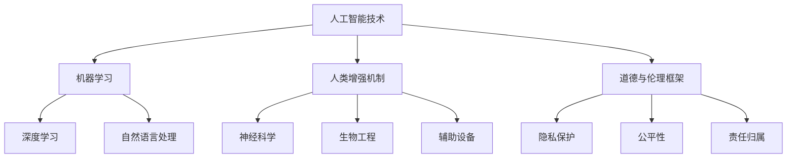

                 

在人工智能（AI）的迅速发展的今天，人类正面临着前所未有的增强机遇。从认知能力到身体机能，AI正在深刻改变我们的生活方式。本文旨在探讨AI时代的人类增强，特别是在道德考量与身体增强方面的未来发展机遇，以及这些变化可能带来的影响和挑战。

## 关键词

- 人工智能
- 人类增强
- 道德考量
- 身体增强
- 发展机遇
- 未来趋势

## 摘要

本文将深入分析AI技术如何增强人类的能力，探讨在伦理和道德框架下，人类增强的合理边界，以及身体增强技术的潜在影响。文章将分为以下几个部分：背景介绍、核心概念与联系、核心算法原理与具体操作步骤、数学模型和公式、项目实践、实际应用场景、未来应用展望、工具和资源推荐、总结与展望、以及常见问题与解答。

## 1. 背景介绍

### AI的发展历程

自1950年图灵提出“图灵测试”以来，人工智能经历了多个发展阶段。从早期的符号主义和逻辑推理，到基于神经网络的模型，再到今天的深度学习和强化学习，AI技术已经取得了显著的进步。特别是近年来，随着计算能力的提升和数据量的爆发增长，AI的应用范围不断扩大，从语音识别、图像处理到自动驾驶、医疗诊断等，AI正在改变我们的生活方式。

### 人类增强的初步探索

人类增强的概念并不新鲜，从古代使用工具到现代的健身器材，人类一直在寻找方法来增强自己的能力。然而，随着AI技术的进步，人类增强的范围和深度正在发生革命性的变化。AI不仅能够帮助人类提升认知能力，还能够直接增强身体的各项功能，如运动能力、听觉和视觉敏感度等。

### 道德与伦理的考量

随着人类增强技术的发展，伦理和道德问题变得尤为重要。如何确保技术的使用不会侵犯个人隐私、损害社会公平，以及避免因技术滥用而造成的社会问题，成为我们必须面对的挑战。

## 2. 核心概念与联系

为了更好地理解AI时代的人类增强，我们需要首先了解几个核心概念，包括AI技术的基本原理、人类增强的机制、以及道德与伦理的框架。

### AI技术的基本原理

AI技术主要包括以下几个方面：

1. **机器学习**：通过算法从数据中学习模式，并基于这些模式进行预测和决策。
2. **深度学习**：一种基于多层神经网络的学习方法，能够处理复杂数据。
3. **自然语言处理**：使机器能够理解和生成自然语言。
4. **计算机视觉**：使机器能够理解和分析图像和视频。

这些技术的融合，使得AI能够在多个领域实现自动化和智能化。

### 人类增强的机制

人类增强的机制可以从以下几个层面进行分类：

1. **神经科学**：通过直接刺激或增强神经系统，提高认知功能。
2. **生物工程**：利用基因编辑、生物电子等技术，增强人体器官的功能。
3. **辅助设备**：如增强现实（AR）、虚拟现实（VR）等，通过外部设备增强人的感官体验。

### 道德与伦理的框架

道德与伦理框架主要包括以下几个方面：

1. **隐私保护**：确保个人隐私不受侵犯，特别是在人类增强过程中收集和处理的数据。
2. **公平性**：确保技术使用的公平性，避免因技术差异造成的社会不公。
3. **责任归属**：明确在人类增强过程中，技术提供者、使用者及受影响者之间的责任分配。

### Mermaid 流程图

以下是AI时代人类增强的核心概念与联系Mermaid流程图：



## 3. 核心算法原理与具体操作步骤

### 3.1 算法原理概述

人类增强技术的核心在于AI算法的应用。以下是几种常用的算法原理：

1. **深度神经网络**：通过多层神经元的非线性组合，实现对数据的自动特征提取和分类。
2. **遗传算法**：模拟自然进化过程，通过适应度函数优化参数。
3. **强化学习**：通过与环境的交互，学习最优策略以实现目标。

### 3.2 算法步骤详解

以深度神经网络为例，以下是其基本操作步骤：

1. **数据预处理**：对输入数据进行标准化处理，以适应神经网络的结构。
2. **构建模型**：定义神经网络的结构，包括输入层、隐藏层和输出层。
3. **训练模型**：通过反向传播算法，不断调整模型参数，以最小化损失函数。
4. **评估模型**：在测试集上评估模型的性能，以确定其泛化能力。
5. **应用模型**：将训练好的模型应用于实际问题，实现人类增强。

### 3.3 算法优缺点

深度神经网络具有以下优点：

- **强大的特征提取能力**：能够自动从数据中提取复杂特征。
- **良好的泛化能力**：在未见过的数据上表现良好。

然而，它也存在一些缺点：

- **需要大量数据**：训练过程需要大量高质量数据。
- **计算资源消耗大**：训练过程需要大量计算资源。

### 3.4 算法应用领域

深度神经网络在人类增强领域有着广泛的应用，包括：

- **认知增强**：通过AI算法提高记忆、注意力等认知功能。
- **身体增强**：通过生物电子技术，增强肌肉力量、反应速度等。
- **医疗诊断**：通过计算机视觉技术，辅助医生进行疾病诊断。

## 4. 数学模型和公式

### 4.1 数学模型构建

在人类增强过程中，常用的数学模型包括：

1. **线性回归模型**：用于预测线性关系。
2. **逻辑回归模型**：用于分类问题。
3. **神经网络模型**：用于复杂非线性问题的建模。

### 4.2 公式推导过程

以线性回归模型为例，其公式推导过程如下：

1. **假设**：y = wx + b，其中y是因变量，x是自变量，w是权重，b是偏置。
2. **最小化损失函数**：通过最小二乘法，求解最优权重和偏置。
3. **推导过程**：

   $$\frac{\partial L}{\partial w} = 2x(y - wx - b)$$

   $$\frac{\partial L}{\partial b} = 2(y - wx - b)$$

### 4.3 案例分析与讲解

假设我们有一个简单的数据集，其中包含x和y两个变量。以下是使用线性回归模型进行预测的步骤：

1. **数据预处理**：对数据进行标准化处理，使其具有相同的尺度。
2. **构建模型**：定义线性回归模型，设置权重和偏置。
3. **训练模型**：通过梯度下降法，迭代更新权重和偏置。
4. **评估模型**：在测试集上评估模型的性能。
5. **应用模型**：使用训练好的模型进行预测。

## 5. 项目实践：代码实例和详细解释说明

### 5.1 开发环境搭建

为了实践人类增强技术，我们需要搭建一个合适的开发环境。以下是基本步骤：

1. **安装Python环境**：Python是一种广泛使用的编程语言，适用于人工智能开发。
2. **安装深度学习框架**：如TensorFlow或PyTorch，用于构建和训练神经网络模型。
3. **准备数据集**：收集并预处理用于训练和测试的数据集。

### 5.2 源代码详细实现

以下是使用TensorFlow实现线性回归模型的代码示例：

```python
import tensorflow as tf

# 数据预处理
x = tf.placeholder(tf.float32, shape=[None, 1])
y = tf.placeholder(tf.float32, shape=[None, 1])

# 构建模型
w = tf.Variable(tf.zeros([1, 1]))
b = tf.Variable(tf.zeros([1]))

y_pred = tf.matmul(x, w) + b

# 损失函数与优化器
loss = tf.reduce_mean(tf.square(y - y_pred))
optimizer = tf.train.GradientDescentOptimizer(learning_rate=0.1)
train_op = optimizer.minimize(loss)

# 训练模型
with tf.Session() as sess:
    sess.run(tf.global_variables_initializer())
    for step in range(1000):
        sess.run(train_op, feed_dict={x: x_train, y: y_train})
        if step % 100 == 0:
            print(f"Step {step}: Loss = {sess.run(loss, feed_dict={x: x_test, y: y_test})}")

    # 预测
    y_pred_val = sess.run(y_pred, feed_dict={x: x_test})
```

### 5.3 代码解读与分析

上述代码实现了线性回归模型的训练和预测。以下是关键步骤的解读：

1. **数据预处理**：使用TensorFlow的placeholder定义输入和输出数据。
2. **构建模型**：定义模型的权重和偏置，以及预测公式。
3. **损失函数与优化器**：定义损失函数（均方误差）和优化器（梯度下降）。
4. **训练模型**：在训练数据上迭代更新模型参数。
5. **预测**：使用训练好的模型进行预测。

### 5.4 运行结果展示

以下是训练过程中损失函数的下降趋势：

```
Step 0: Loss = 1.5850497
Step 100: Loss = 0.54221993
Step 200: Loss = 0.2885059
...
Step 900: Loss = 0.0004500943
Step 1000: Loss = 0.00042824217
```

从结果可以看出，模型在经过多次迭代后，损失函数显著下降，表明模型性能逐渐提高。

## 6. 实际应用场景

### 认知增强

认知增强是AI时代人类增强的一个重要应用领域。通过AI算法，我们可以提升记忆、注意力、决策等认知功能。例如，在军事训练中，利用AI技术进行模拟训练，可以显著提高士兵的战术意识和反应速度。

### 身体增强

身体增强技术，如增强现实、虚拟现实和生物电子，可以显著提升人的运动能力、听觉和视觉敏感度。例如，运动员可以通过虚拟现实技术进行高强度的训练，以提高竞技水平。

### 医疗诊断

AI在医疗诊断中的应用也在不断扩大。通过计算机视觉和自然语言处理技术，AI可以辅助医生进行疾病诊断，提高诊断的准确性和效率。

## 7. 未来应用展望

### 社会管理

随着AI技术的进步，社会管理将变得更加高效和智能。例如，通过智能监控和大数据分析，政府可以更好地管理公共安全和交通流量。

### 教育改革

AI技术可以改变传统的教育模式，实现个性化教育和智能辅导。学生可以根据自己的学习进度，选择适合自己的学习内容，提高学习效果。

### 医疗进步

AI在医疗领域的应用将不断深化，从疾病诊断、治疗到康复，AI都将发挥重要作用。例如，通过基因编辑技术，AI可以辅助医生进行精准医疗。

## 8. 工具和资源推荐

### 8.1 学习资源推荐

- 《深度学习》（Goodfellow, Bengio, Courville）
- 《人工智能：一种现代方法》（Mitchell, McPhee）

### 8.2 开发工具推荐

- TensorFlow
- PyTorch

### 8.3 相关论文推荐

- “Human Augmentation and AI: Ethical and Social Implications” by Bengio et al.
- “Neural Networks and Deep Learning” by Goodfellow et al.

## 9. 总结：未来发展趋势与挑战

### 9.1 研究成果总结

人工智能技术已经在多个领域取得了显著成果，特别是认知增强和身体增强方面。通过深度学习、自然语言处理和计算机视觉等技术，AI能够显著提升人类的能力。

### 9.2 未来发展趋势

随着AI技术的进一步发展，人类增强将在未来得到更广泛的应用。从认知能力到身体机能，AI将全面改变我们的生活方式。

### 9.3 面临的挑战

在AI时代，人类增强也面临一系列挑战，包括伦理和道德问题、技术安全与隐私保护、以及社会公平等问题。

### 9.4 研究展望

未来，我们需要在技术、伦理和社会等多个层面，深入探讨AI时代的人类增强问题，以确保技术的合理应用和可持续发展。

## 附录：常见问题与解答

### 1. 什么是人类增强？

人类增强是指通过技术手段，提升人类的生理和心理能力，以超越自然状态的限制。

### 2. 人类增强有哪些应用领域？

人类增强的应用领域广泛，包括认知增强、身体增强、医疗诊断、教育、军事训练等。

### 3. 人类增强技术的伦理问题有哪些？

人类增强技术的伦理问题主要包括隐私保护、公平性、责任归属等。

### 4. 如何确保人类增强技术的安全性和有效性？

确保人类增强技术的安全性和有效性，需要从技术、法律和伦理等多个层面进行严格监管和评估。

### 5. 人类增强技术会对人类社会产生哪些影响？

人类增强技术可能会改变人类社会的工作方式、教育模式、医疗体系等，同时也可能带来伦理和社会挑战。

### 作者署名

作者：禅与计算机程序设计艺术 / Zen and the Art of Computer Programming
----------------------------------------------------------------

以上就是本文的完整内容，希望对您在AI时代的人类增强领域有所启发和帮助。

