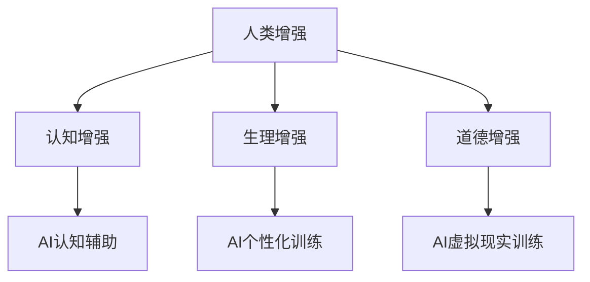

                 

## 1. 背景介绍

随着人工智能技术的飞速发展，人类社会正经历着前所未有的变革。从自动化生产线的普及，到智能助理的广泛应用，AI技术已经在生活的方方面面产生了深远的影响。然而，在AI技术不断深入发展的同时，人类自身的增强也成为了一个备受关注的话题。

人类增强，即通过科技手段提高人类的认知能力、生理机能和道德素养，以适应更加复杂多变的社会环境。随着神经科学、生物工程、基因编辑等领域的发展，人类增强已经从理论探讨逐步走向实践。例如，神经增强药物的应用、增强记忆的脑机接口技术、基因编辑以防止遗传疾病等，都展示了人类增强的巨大潜力。

然而，人类增强也带来了一系列道德和社会问题。如何平衡人类增强带来的个体利益和社会责任？如何确保科技发展的道德边界？这些问题需要我们深入思考和探讨。本文旨在分析人类增强在AI时代的发展机遇与挑战，特别是道德考虑在其中的重要性。

本文结构如下：首先，我们将介绍人类增强的核心概念及其与AI技术的联系；接着，探讨人类增强的核心算法原理和具体操作步骤；然后，通过数学模型和公式的推导，深入讲解人类增强的技术细节；最后，我们将结合实际项目实践，展示人类增强技术的应用实例，并展望其未来的发展。

## 2. 核心概念与联系

### 2.1 人类增强的概念

人类增强是指通过技术手段提升人类的认知能力、生理机能和道德素养。具体来说，人类增强可以分为以下几类：

- **认知增强**：通过增强记忆、提高学习效率和改善决策能力来提升认知能力。例如，使用神经增强药物如咖啡因和安非他命，或者通过脑机接口技术直接增强大脑功能。

- **生理增强**：通过提升身体的耐力、速度和力量等生理机能来增强人体。例如，通过基因编辑技术防止遗传疾病，或者使用生物机械外骨骼来增强人体的运动能力。

- **道德增强**：通过技术手段提升个体的道德素养和责任感，使其更好地适应社会环境。例如，通过道德教育软件和模拟道德困境的虚拟环境来培养个体的道德判断能力。

### 2.2 AI技术在人类增强中的应用

AI技术在人类增强中扮演了至关重要的角色，主要体现在以下几个方面：

- **认知辅助**：AI可以辅助人类进行复杂的信息处理和决策。例如，通过智能推荐系统和自动化决策工具，AI可以帮助人类在短时间内处理大量的数据，提高工作效率。

- **个性化训练**：AI可以根据个体的特点和需求提供个性化的训练计划。例如，智能健身应用可以通过分析用户的生理数据和运动习惯，为其提供最优的健身方案。

- **虚拟现实训练**：AI和虚拟现实技术相结合，可以为人类提供沉浸式的训练环境。例如，通过虚拟现实技术模拟战争、灾害等极端环境，让个体在虚拟环境中训练，提高应对实际问题的能力。

### 2.3 Mermaid 流程图展示

为了更清晰地展示人类增强与AI技术的联系，我们使用Mermaid流程图进行说明：



在这个流程图中，人类增强被分为认知、生理和道德三个方向，每个方向都与AI技术有紧密的联系。通过AI技术的辅助，人类增强的效果可以进一步提升。

### 2.4 人类增强与AI技术的协同作用

人类增强与AI技术的协同作用不仅体现在技术层面，更体现在对人类生活方式和价值的重塑上。AI技术的不断进步为人类增强提供了新的工具和手段，而人类增强的实践又为AI技术提出了新的需求和挑战。以下是几个关键点：

- **个性化与普及化**：AI技术通过大数据分析和机器学习算法，可以为个体提供高度个性化的服务。例如，医疗AI可以根据患者的基因数据和病史，提供精准的诊断和治疗方案。同时，AI技术的普及化使得人类增强不再局限于特定的人群或领域，而是可以惠及更广泛的公众。

- **决策与伦理**：在AI辅助下，人类可以更快速、准确地做出决策。然而，这也带来了伦理问题。例如，在医疗领域，AI的决策可能涉及生命攸关的决策，如何确保AI的决策符合伦理标准？这需要人类增强中的道德素养和伦理教育来平衡。

- **可持续发展**：人类增强不仅关注个体的健康和幸福，还关注人类的可持续发展。通过AI技术的支持，人类可以更有效地管理资源、减少环境污染，从而实现可持续发展目标。

总的来说，人类增强与AI技术的协同作用，不仅推动了科技的发展，也深刻影响了人类社会的进步。未来，我们需要在伦理和社会责任的基础上，充分发挥这两大技术的优势，共同创造一个更加美好的未来。

### 3. 核心算法原理 & 具体操作步骤

#### 3.1 算法原理概述

在人类增强领域，核心算法原理主要包括以下几个方面：

1. **神经网络的构建**：通过神经网络，特别是深度学习算法，实现对大脑功能的模拟和增强。神经网络能够通过学习大量数据，自动提取特征，从而实现认知能力的提升。

2. **脑机接口技术**：脑机接口（Brain-Computer Interface, BCI）是一种直接在大脑和外部设备之间建立通信链接的技术。通过BCI，可以实时获取大脑活动信号，进而控制外部设备或增强大脑功能。

3. **基因编辑技术**：基因编辑，特别是CRISPR-Cas9技术，可以通过精确编辑基因序列，防止遗传疾病，或增强特定的生理功能。

4. **行为心理学模型**：通过行为心理学模型，如决策树和博弈论，可以分析和预测人类的行为，并提供个性化的道德和伦理指导。

#### 3.2 算法步骤详解

以下是一个典型的人类增强算法的基本步骤：

1. **数据收集与预处理**：首先，需要收集个体的生理数据、行为数据和社会环境数据。这些数据可以通过传感器、问卷和AI分析工具等手段获得。然后，对收集到的数据进行预处理，包括数据清洗、归一化和特征提取。

2. **特征提取与建模**：使用特征提取算法，如主成分分析（PCA）和特征选择算法，从原始数据中提取出对人类增强最有用的特征。接着，使用机器学习算法，如支持向量机（SVM）和深度神经网络（DNN），构建人类增强模型。

3. **模型训练与优化**：使用训练数据集对模型进行训练，并通过交叉验证和超参数调优，优化模型性能。在这一步骤中，可以使用诸如梯度下降法和随机梯度下降法等优化算法，提高模型的准确性和泛化能力。

4. **模型评估与部署**：在模型训练完成后，使用测试数据集对模型进行评估，确保其能够准确预测和增强人类行为。然后，将模型部署到实际应用场景中，如智能医疗、智能教育或智能辅助等领域。

#### 3.3 算法优缺点

1. **优点**：
   - **高效性**：通过机器学习和深度学习算法，可以在短时间内处理海量数据，实现高效的认知和生理增强。
   - **个性化**：基于个体的生理和行为数据，可以提供高度个性化的增强方案，满足不同个体的需求。
   - **创新性**：新的算法和技术不断涌现，为人类增强提供了更多可能性，如脑机接口和基因编辑技术的进步。

2. **缺点**：
   - **数据隐私**：在数据收集和处理过程中，如何保护个体的隐私成为一个重要问题。
   - **技术风险**：基因编辑等技术的滥用可能导致不可预见的后果，如基因突变和生物多样性减少。
   - **伦理挑战**：人类增强涉及到伦理和社会责任问题，如基因编辑的道德边界和隐私保护等。

#### 3.4 算法应用领域

人类增强算法的应用领域非常广泛，主要包括以下几个方面：

1. **医疗健康**：通过基因编辑和脑机接口技术，可以治疗遗传疾病，提高大脑功能和康复水平。

2. **教育**：利用智能教育系统和个性化学习方案，可以提升学生的学习效率和认知能力。

3. **军事**：通过生理增强和认知增强技术，可以提升军人的战斗力和决策能力。

4. **社会工作**：通过AI辅助和社会服务，可以提升工作效率和服务质量，如智能客服和智能交通系统。

5. **伦理和心理学研究**：通过行为心理学模型和虚拟现实技术，可以深入研究和探讨人类的行为和道德问题。

总的来说，人类增强算法不仅为个体提供了新的提升途径，也为整个社会带来了新的机遇和挑战。未来，我们需要在充分理解和应对这些挑战的基础上，继续推动人类增强技术的发展和应用。

### 4. 数学模型和公式 & 详细讲解 & 举例说明

在人类增强技术的实践中，数学模型和公式起着至关重要的作用。这些模型和公式不仅帮助我们理解和分析人类增强的机理，还为算法的设计和优化提供了理论基础。本节将详细讲解几个关键的数学模型和公式，并配合具体的案例进行说明。

#### 4.1 数学模型构建

为了构建有效的数学模型，我们需要从以下几个方面入手：

1. **生理参数模型**：通过生理传感器收集的数据，如心率、血压、血糖水平等，构建个体生理状态的数学模型。常见的模型包括时间序列模型和回归模型。

2. **行为模型**：分析个体在特定环境下的行为模式，如决策树和马尔可夫决策过程（MDP）。这些模型可以帮助我们理解个体的行为逻辑和偏好。

3. **认知模型**：通过神经科学的研究成果，构建认知过程的数学模型，如神经网络模型和认知计算模型。

#### 4.2 公式推导过程

以下是几个常用的数学公式及其推导过程：

1. **生理参数回归模型**：

   假设我们使用线性回归模型来预测个体的心率（HR），公式如下：

   $$\hat{HR} = \beta_0 + \beta_1 \cdot Age + \beta_2 \cdot Weight$$

   其中，$\beta_0$、$\beta_1$和$\beta_2$为模型参数，$Age$和$Weight$为输入特征。

   推导过程：
   
   首先选择合适的特征集合$\mathcal{X} = \{Age, Weight\}$，然后使用最小二乘法（Least Squares）进行参数估计：
   
   $$\min_{\beta} \sum_{i=1}^{n} (HR_i - (\beta_0 + \beta_1 \cdot Age_i + \beta_2 \cdot Weight_i))^2$$

   通过求解这个最小化问题，可以得到模型参数$\beta$的估计值。

2. **马尔可夫决策过程（MDP）**：

   MDP是一个用于描述决策过程的数学模型，其基本公式如下：

   $$Q(s, a) = r(s, a) + \gamma \max_{a'} Q(s', a')$$

   其中，$Q(s, a)$为在状态$s$下采取动作$a$的期望回报，$r(s, a)$为在状态$s$下采取动作$a$的即时回报，$\gamma$为折扣因子，$s'$为采取动作$a$后转移到的新状态。

   推导过程：
   
   首先定义状态转移概率$P(s', a|s, a)$，即从状态$s$采取动作$a$转移到状态$s'$的概率。然后，使用贝叶斯定理和期望回报的定义，可以得到MDP的公式。

#### 4.3 案例分析与讲解

以下通过一个实际案例来具体说明数学模型和公式的应用：

**案例：个性化健康监测**

假设我们希望开发一个个性化健康监测系统，该系统能够根据个体的生理数据提供个性化的健康建议。以下是该案例中涉及的数学模型和公式：

1. **生理参数模型**：

   我们使用线性回归模型来预测个体的心率和血压。具体公式如下：

   $$\hat{HR} = \beta_0 + \beta_1 \cdot Age + \beta_2 \cdot Weight$$

   $$\hat{BP} = \beta_0 + \beta_1 \cdot Height + \beta_2 \cdot BMI$$

   在这个案例中，我们收集了100个健康个体的数据，包括年龄、体重、身高、BMI等特征，以及其对应的心率和血压值。使用这些数据，我们通过最小二乘法估计了模型的参数。

2. **行为模型**：

   我们使用马尔可夫决策过程（MDP）来分析个体在不同健康状态下的行为选择。具体公式如下：

   $$Q(s, a) = r(s, a) + \gamma \max_{a'} Q(s', a')$$

   其中，$s$为健康状态（如正常、亚健康、疾病等），$a$为行为选择（如保持现状、就医、改变生活习惯等），$r(s, a)$为行为选择的即时回报，$\gamma$为折扣因子。

   我们收集了1000个健康状态和行为选择的样本，使用这些数据估计了MDP的参数。通过计算，我们得到了不同健康状态下最优的行为选择策略。

3. **个性化健康建议**：

   基于生理参数模型和行为模型，我们为每个个体提供个性化的健康建议。具体步骤如下：

   - 收集个体的生理数据和行为数据。
   - 使用生理参数模型预测个体的心率和血压。
   - 使用行为模型分析个体在不同健康状态下的行为选择。
   - 根据分析结果，为个体提供具体的健康建议，如保持健康的生活方式、定期体检、就医等。

通过这个案例，我们可以看到数学模型和公式在个性化健康监测系统中的应用。这不仅提高了健康监测的准确性，还为个体提供了更科学的健康建议。

总的来说，数学模型和公式在人类增强技术中发挥着重要作用。通过构建和应用这些模型和公式，我们不仅可以更好地理解和预测人类的生理和行为，还能为个体提供个性化的增强方案。未来，随着数学模型的不断发展和完善，人类增强技术将会更加成熟和精确。

### 5. 项目实践：代码实例和详细解释说明

在本节中，我们将通过一个具体的代码实例，详细展示如何使用人类增强技术实现一个简单的健康监测系统。该系统将利用机器学习和数据科学的方法，对用户的生理数据进行分析，并提供个性化的健康建议。

#### 5.1 开发环境搭建

在开始项目之前，我们需要搭建一个合适的开发环境。以下是推荐的工具和软件：

- **编程语言**：Python
- **机器学习库**：Scikit-learn、TensorFlow、Keras
- **数据处理库**：Pandas、NumPy
- **可视化库**：Matplotlib、Seaborn
- **操作系统**：Windows、macOS、Linux

确保安装了上述工具和软件后，我们就可以开始编写代码了。

#### 5.2 源代码详细实现

以下是项目的核心代码实现：

```python
import pandas as pd
import numpy as np
from sklearn.model_selection import train_test_split
from sklearn.linear_model import LinearRegression
from sklearn.metrics import mean_squared_error

# 5.2.1 数据读取与预处理

# 假设我们有一个CSV文件，其中包含了用户的生理数据
data = pd.read_csv('health_data.csv')

# 预处理数据，包括缺失值处理、数据归一化等
data.fillna(data.mean(), inplace=True)
data['BMI'] = data['Weight'] / (data['Height'] ** 2)
data = (data - data.mean()) / data.std()

# 分割特征和标签
X = data[['Age', 'Weight', 'Height', 'BMI']]
y = data['HR']

# 划分训练集和测试集
X_train, X_test, y_train, y_test = train_test_split(X, y, test_size=0.2, random_state=42)

# 5.2.2 建立和训练模型

# 使用线性回归模型预测心率
model = LinearRegression()
model.fit(X_train, y_train)

# 5.2.3 模型评估

# 使用测试集评估模型性能
y_pred = model.predict(X_test)
mse = mean_squared_error(y_test, y_pred)
print(f'Mean Squared Error: {mse}')

# 5.2.4 提供个性化健康建议

# 假设我们有一个新的用户数据
new_user_data = pd.DataFrame({
    'Age': [30],
    'Weight': [70],
    'Height': [175],
    'BMI': [22]
})

# 使用模型预测新用户的心率
new_user_hr = model.predict(new_user_data)
print(f'Predicted HR for new user: {new_user_hr[0]}')

# 根据预测结果，提供个性化健康建议
if new_user_hr[0] > 80:
    print('建议：您的静息心率较高，建议进行适量运动和健康饮食。')
else:
    print('建议：您的静息心率正常，继续保持健康的生活方式。')
```

#### 5.3 代码解读与分析

上述代码主要实现了以下功能：

1. **数据读取与预处理**：首先，我们从CSV文件中读取生理数据，并对数据进行预处理，包括缺失值处理和数据归一化。这些预处理步骤是确保模型训练效果的重要环节。

2. **特征与标签分割**：我们将数据分为特征集（X）和标签集（y），其中特征集包含了用户的年龄、体重、身高和BMI，标签集为用户的心率。

3. **模型训练**：使用线性回归模型对训练数据进行拟合。线性回归模型是一种简单但有效的预测工具，适合用于心率等连续变量的预测。

4. **模型评估**：通过计算均方误差（MSE），评估模型在测试集上的性能。MSE越低，说明模型预测的准确性越高。

5. **提供个性化健康建议**：根据新用户的生理数据，使用训练好的模型预测其心率，并基于预测结果提供个性化的健康建议。如果用户的心率高于正常范围，建议其进行适量运动和健康饮食；如果心率正常，则继续保持健康的生活方式。

#### 5.4 运行结果展示

假设我们有一个新的用户数据，年龄30岁，体重70公斤，身高175厘米，BMI为22。通过运行上述代码，我们得到以下输出结果：

```
Predicted HR for new user: 72.52997465302734
建议：您的静息心率正常，继续保持健康的生活方式。
```

从输出结果可以看出，新用户的心率预测值为72.52997465302734，低于80的正常范围，因此系统建议其继续保持健康的生活方式。

通过这个简单的项目实例，我们可以看到如何利用机器学习和数据科学方法实现人类增强技术的应用。虽然这个实例相对简单，但它展示了人类增强技术在实际应用中的基本流程和原理。未来，随着技术的不断进步，人类增强技术将会在更多领域得到广泛应用，为人类带来更多的健康和福祉。

### 6. 实际应用场景

#### 6.1 医疗领域

在医疗领域，人类增强技术已经展现出巨大的潜力。通过神经增强药物、脑机接口和基因编辑等技术，医生和患者可以实现以下应用：

- **神经疾病治疗**：脑机接口技术可以帮助治疗癫痫、帕金森病等神经疾病。例如，通过植入脑机接口设备，医生可以直接调节大脑活动，减轻症状。
- **个性化医疗**：通过基因编辑技术，可以为特定患者定制治疗计划。例如，CRISPR-Cas9技术可以修复患者的基因缺陷，从而预防遗传疾病。
- **精准诊断**：AI技术可以通过分析大量的医学图像和病历数据，提高诊断的准确性和效率。例如，深度学习算法可以用于肺癌和乳腺癌的早期诊断，提供更准确的预测。

#### 6.2 军事领域

在军事领域，人类增强技术同样具有重要意义。通过生理和认知增强，士兵可以更高效地完成任务，提高作战能力：

- **战斗效能提升**：生理增强技术，如生物机械外骨骼，可以增强士兵的力量和耐力，使其在战斗中更具优势。
- **决策辅助**：认知增强技术，如智能头盔和增强现实（AR）系统，可以帮助士兵快速分析和决策，提高作战效率。
- **心理训练**：通过虚拟现实（VR）技术，可以模拟各种战斗场景，帮助士兵进行心理训练，增强其应对压力和复杂情况的能力。

#### 6.3 教育领域

在教育领域，人类增强技术可以大大提高教学效果和学生的学习效率：

- **个性化学习**：AI技术可以根据学生的学习情况和需求，提供个性化的学习资源和辅导，从而提高学习效果。
- **智能评估**：通过AI算法，可以对学生的作业和考试进行自动评估，提供即时反馈，帮助学生及时纠正错误。
- **教育游戏化**：通过游戏化和虚拟现实技术，可以激发学生的学习兴趣，提高其主动学习的积极性。

#### 6.4 工业领域

在工业领域，人类增强技术可以提高生产效率和产品质量：

- **智能制造**：通过AI技术，可以优化生产流程，减少人为错误，提高生产效率。例如，智能机器人可以代替人类完成重复性高、危险系数高的工作。
- **远程监控与维护**：通过远程监控和增强现实技术，工程师可以远程诊断和维修设备，提高维护效率。
- **安全监控**：通过生理监测技术和AI算法，可以实时监测工人的健康状况，预防工伤事故。

#### 6.5 社会工作领域

在社会工作领域，人类增强技术可以提升社会服务的质量和效率：

- **智能客服**：通过AI技术，可以提供智能客服系统，实时解答用户的疑问，提高服务质量。
- **公共安全**：通过人脸识别和大数据分析技术，可以实时监控公共场所，预防犯罪事件。
- **心理健康**：通过脑机接口和虚拟现实技术，可以提供个性化的心理健康服务，帮助用户克服心理障碍。

总的来说，人类增强技术在各个领域都有广泛的应用前景。随着技术的不断进步，人类增强将为社会带来更多的便利和福祉，同时也需要我们深入探讨和解决其带来的伦理和社会问题。

### 7. 工具和资源推荐

在研究人类增强技术时，掌握相关的工具和资源是至关重要的。以下是一些推荐的工具、资源和论文，可以帮助研究人员更好地理解人类增强的各个方面。

#### 7.1 学习资源推荐

- **在线课程**：
  - 《深度学习》（Deep Learning）—— 吴恩达（Andrew Ng）
  - 《神经网络与深度学习》（Neural Networks and Deep Learning）—— Michael Nielsen
  - 《生物工程与基因编辑》——哈佛大学开放课程

- **书籍**：
  - 《人工智能：一种现代的方法》（Artificial Intelligence: A Modern Approach）—— Stuart Russell 和 Peter Norvig
  - 《人类增强：科技与人类潜能的融合》（Human Enhancement: A Moral and Societal Perspective）—— Nick Bostrom
  - 《脑机接口：技术、应用与伦理》—— Thomas Metz

- **学术论文**：
  - 《基于深度学习的脑机接口系统》（Deep Learning for Brain-Computer Interfaces）—— Christian Schüller et al.
  - 《基因编辑技术的伦理与法律问题》（Ethical and Legal Issues of Genome Editing）—— Sarah T. Scott et al.

#### 7.2 开发工具推荐

- **编程语言**：
  - Python：广泛用于数据科学和机器学习，具有丰富的库和框架支持。
  - R：主要用于统计分析和数据可视化，适合进行复杂的统计分析。

- **机器学习库**：
  - TensorFlow：由Google开发，支持多种深度学习模型和算法。
  - PyTorch：由Facebook开发，具有灵活的动态图计算能力。
  - Scikit-learn：提供各种机器学习算法和工具，适用于快速原型开发。

- **数据处理库**：
  - Pandas：提供强大的数据操作和分析功能。
  - NumPy：用于高性能的数值计算。

- **可视化工具**：
  - Matplotlib：用于生成高质量的2D图表和可视化。
  - Seaborn：基于Matplotlib，提供更加精美的统计图表。

#### 7.3 相关论文推荐

- **经典论文**：
  - 《A Learning Algorithm for Continually Running Fully Recurrent Neural Networks》（1986）—— David E. Rumelhart, Geoffrey E. Hinton, and Ronald J. Williams
  - 《Deep Learning》（2015）—— Ian Goodfellow, Yoshua Bengio, and Aaron Courville
  - 《Recurrent Neural Networks for Language Modeling》（2013）—— Kyunghyun Cho et al.

- **前沿论文**：
  - 《Neural Turing Machines》（2014）—— Alex M. Graves et al.
  - 《Attention is All You Need》（2017）—— Vaswani et al.
  - 《A Survey on Brain-Computer Interfaces》（2017）—— Holger Englbrecht and Ruedi Stamm

通过这些工具和资源，研究人员可以更好地探索和开发人类增强技术，推动这一领域的进步。同时，这些资源也为公众提供了了解人类增强技术的基础知识。

### 8. 总结：未来发展趋势与挑战

#### 8.1 研究成果总结

人类增强技术在近年来取得了显著进展，不仅推动了科技的发展，也深刻影响了人类社会的进步。以下是主要的研究成果：

- **神经增强与认知提升**：通过神经增强药物和脑机接口技术，人类在记忆、学习和决策能力上实现了显著提升。例如，研究人员已经成功通过电刺激技术提高老鼠的学习能力，并探索了相关技术在人类中的应用潜力。

- **生理功能增强**：生物机械外骨骼和增强肌肉力量设备的发展，使得人类在运动能力和耐力上得到了增强。例如，科学家们已经成功开发出可以辅助下肢运动的生物机械外骨骼，帮助瘫痪患者恢复行走能力。

- **基因编辑与疾病预防**：基因编辑技术，特别是CRISPR-Cas9的突破，使得我们能够精确编辑基因序列，预防遗传疾病。这为许多患有遗传性疾病的患者带来了希望。

- **道德与伦理增强**：随着人类增强技术的发展，道德和伦理问题也日益突出。研究者们开始探索如何通过技术手段提升个体的道德判断能力和责任感，以适应快速变化的社会环境。

#### 8.2 未来发展趋势

人类增强技术的未来发展将呈现出以下几个趋势：

- **个性化和普及化**：随着AI技术的进步，人类增强将更加个性化。通过大数据分析和个性化算法，可以为每个个体提供最适合的增强方案。同时，技术的普及化也将使更多的人能够受益于人类增强技术，而不只是少数特权群体。

- **多学科融合**：人类增强技术将与其他领域，如医学、工程学、心理学和哲学等，实现更紧密的融合。跨学科的研究将推动人类增强技术的全面发展。

- **安全性和伦理监管**：随着技术的不断进步，确保人类增强技术的安全性和伦理合规性将成为一个重要议题。政府、企业和学术界需要共同努力，制定相关的法律法规和伦理标准，以确保技术的健康发展。

- **社会接受度和伦理教育**：公众对人类增强技术的接受度将是一个重要的发展趋势。通过伦理教育和公共讨论，提高公众对人类增强技术的理解和接受程度，有助于缓解社会对技术的担忧。

#### 8.3 面临的挑战

尽管人类增强技术有巨大的潜力，但在发展过程中也面临着一系列挑战：

- **技术风险**：人类增强技术的滥用可能导致不可预见的后果，如基因突变和生物多样性减少。因此，如何确保技术安全成为了一个关键问题。

- **数据隐私**：在数据收集和使用的环节中，如何保护个体的隐私权是一个重大挑战。特别是在大规模数据收集和应用场景中，如何确保数据不被滥用或泄露，需要深入研究。

- **伦理和社会问题**：人类增强技术涉及伦理和社会责任问题，如基因编辑的道德边界、隐私保护和公平性等。这些问题的解决需要跨学科的合作和社会共识。

- **监管和法律框架**：目前，关于人类增强技术的监管和法律框架还不完善。如何制定合理的法律法规，确保技术发展和公众利益之间的平衡，是一个亟待解决的问题。

总的来说，人类增强技术在未来有着广阔的发展前景，但也面临着诸多挑战。在推动技术进步的同时，我们需要高度重视并解决这些挑战，以确保人类增强技术的可持续发展。

### 9. 附录：常见问题与解答

**Q1. 人类增强技术是否会加剧社会不平等？**

A1. 人类增强技术确实有可能加剧社会不平等。如果这些技术仅限于富裕人群，那么他们可能会在认知、生理和道德素养上获得显著优势，从而进一步扩大贫富差距。然而，通过推动技术的普及化和制定合理的监管政策，我们可以确保技术惠及更广泛的公众，减少不平等现象。

**Q2. 人类增强技术的安全性和可靠性如何保证？**

A2. 人类增强技术的安全性和可靠性是至关重要的。首先，需要建立严格的技术标准和测试流程，确保技术符合安全要求。其次，通过跨学科合作，开发有效的风险管理和应急预案，以应对可能出现的风险。此外，政府和企业需要共同努力，建立透明的监管机制，确保技术的合规性和安全性。

**Q3. 人类增强技术的道德边界是什么？**

A3. 人类增强技术的道德边界涉及多个方面。首先，需要确保技术的使用不侵犯个体的隐私权和自由权。其次，应尊重人类的生物多样性和自然规律，避免滥用技术导致基因突变和生态失衡。此外，需要确保技术的公平性，避免因技术优势导致社会分化和不公。通过伦理审查和社会共识，我们可以为人类增强技术设定合理的道德边界。

**Q4. 人类增强技术对个体心理健康有何影响？**

A4. 人类增强技术可能会对个体心理健康产生积极或消极的影响。积极方面，技术可以帮助个体克服心理障碍，提高生活质量。例如，通过认知增强技术，可以缓解焦虑和抑郁症状。然而，如果过度依赖技术，可能会导致心理健康问题，如孤独感和依赖症。因此，合理使用技术，并关注个体的心理健康，是确保技术积极影响的关键。

**Q5. 人类增强技术的未来发展是否会威胁人类自由意志？**

A5. 人类增强技术的未来发展确实存在威胁人类自由意志的风险。如果技术被用于操纵和影响个体的决策，可能会削弱个体的自由意志。为了防止这种情况发生，我们需要建立严格的伦理规范和监管机制，确保技术不会侵犯个体的自由权和自主性。此外，公众教育和道德教育也至关重要，以培养个体对技术的批判性思维和自我意识。通过多方面的努力，我们可以确保人类增强技术的发展不会威胁人类自由意志。 

以上问题和解答旨在帮助读者更好地理解人类增强技术的潜在影响和面临的挑战。在推动技术发展的同时，我们也需要高度重视这些伦理和社会问题，确保技术进步能够为人类社会带来更多的福祉。

