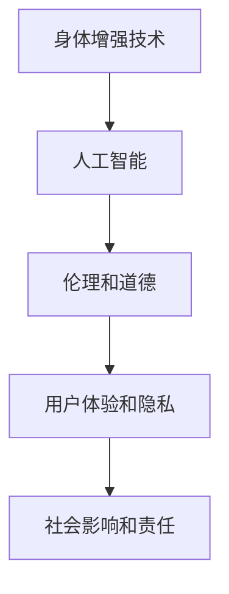

                 

关键词：AI时代、人类增强、道德考虑、身体增强、未来发展趋势、挑战

摘要：本文深入探讨了AI时代背景下的人类增强趋势，包括道德考量、身体增强技术的发展以及其在未来社会中的机遇、挑战和趋势。通过分析AI技术的进步对身体增强的影响，本文旨在为读者提供一幅全面、深刻的未来图景。

## 1. 背景介绍

随着人工智能（AI）技术的快速发展，人类正迎来一个前所未有的增强时代。身体增强技术的发展，如机械外骨骼、增强现实（AR）和虚拟现实（VR）等，使得人类能够超越自然极限，提高工作效率和生存能力。然而，这种增强也引发了一系列道德和伦理问题。如何平衡技术进步与人类尊严、自由和隐私，成为我们必须面对的重大课题。

### 1.1 AI技术对人类增强的推动

人工智能技术的进步，尤其是机器学习和深度学习算法的应用，为身体增强技术提供了强大的技术支持。AI能够通过大数据分析和模式识别，优化增强装置的性能，提高其适应性。例如，智能轮椅可以通过AI算法实时调整行驶方向和速度，以适应不同的路况和用户需求。

### 1.2 道德考量的必要性

随着身体增强技术的发展，道德考量变得尤为重要。我们需要在追求技术进步的同时，确保不会损害人类的尊严、自由和隐私。例如，对于智能增强装置的隐私保护、数据安全和用户权益保障等问题，必须引起足够的重视。

## 2. 核心概念与联系

为了更好地理解身体增强技术的发展，我们需要明确几个核心概念：身体增强技术、人工智能、伦理和道德。

### 2.1 身体增强技术

身体增强技术是指通过外部设备或生物技术手段，增强人类身体的功能和性能。这些技术包括机械外骨骼、AR/VR设备、生物电刺激器等。

### 2.2 人工智能

人工智能是一种模拟人类智能的计算机系统，能够通过学习和推理，完成复杂的任务。在身体增强技术中，AI主要用于优化设备性能、提高人机交互效率和个性化定制。

### 2.3 伦理和道德

伦理和道德是评估技术发展是否符合人类利益和价值标准的重要工具。在身体增强技术的应用中，我们需要考虑伦理问题，如隐私保护、数据安全和用户权益。

### 2.4 Mermaid流程图

下面是一个简单的Mermaid流程图，展示了身体增强技术、人工智能、伦理和道德之间的联系。



## 3. 核心算法原理 & 具体操作步骤

### 3.1 算法原理概述

身体增强技术的核心算法主要涉及机器学习和深度学习。这些算法通过分析用户行为和数据，实现设备性能的优化和用户需求的满足。

### 3.2 算法步骤详解

1. 数据收集：通过传感器和数据采集设备，收集用户的行为数据。
2. 数据处理：使用机器学习和深度学习算法，对收集到的数据进行处理和分析。
3. 性能优化：根据分析结果，调整设备参数和算法模型，优化设备性能。
4. 用户反馈：收集用户对设备性能的反馈，不断迭代和优化算法。

### 3.3 算法优缺点

**优点：**
- 提高设备性能和用户满意度。
- 实现个性化定制，满足不同用户的需求。

**缺点：**
- 需要大量的数据支持和计算资源。
- 可能涉及隐私和数据安全问题。

### 3.4 算法应用领域

- 机械外骨骼：通过AI算法，提高机械外骨骼的适应性和稳定性。
- AR/VR设备：通过AI算法，优化人机交互体验，提高沉浸感。
- 生物电刺激器：通过AI算法，提高生物电刺激器的治疗效果。

## 4. 数学模型和公式 & 详细讲解 & 举例说明

### 4.1 数学模型构建

身体增强技术的数学模型主要涉及机器学习和深度学习。以下是一个简化的机器学习模型示例：

$$
y = W_1 \cdot x + b_1
$$

其中，$y$ 是输出值，$x$ 是输入值，$W_1$ 是权重矩阵，$b_1$ 是偏置项。

### 4.2 公式推导过程

机器学习模型的推导过程涉及多个步骤，包括损失函数、梯度下降和反向传播。以下是简化的推导过程：

$$
L(y, \theta) = -\frac{1}{m} \sum_{i=1}^{m} [y_i \cdot \log(a(x_i)) + (1 - y_i) \cdot \log(1 - a(x_i))]
$$

其中，$L$ 是损失函数，$\theta$ 是参数，$m$ 是样本数量，$a(x)$ 是激活函数。

### 4.3 案例分析与讲解

假设我们有一个机械外骨骼，需要通过AI算法优化其性能。我们可以使用一个简单的线性回归模型进行优化：

$$
y = W_1 \cdot x + b_1
$$

其中，$y$ 是机械外骨骼的负载，$x$ 是用户的动作数据，$W_1$ 是权重矩阵，$b_1$ 是偏置项。

通过训练数据集，我们可以得到最优的权重矩阵和偏置项，从而优化机械外骨骼的性能。

## 5. 项目实践：代码实例和详细解释说明

### 5.1 开发环境搭建

我们使用Python和TensorFlow作为开发环境，搭建一个简单的机器学习模型。

```python
import tensorflow as tf

# 搭建模型
model = tf.keras.Sequential([
    tf.keras.layers.Dense(1, input_shape=(1,))
])

# 编译模型
model.compile(optimizer='sgd', loss='mean_squared_error')

# 训练模型
model.fit(x_train, y_train, epochs=100)
```

### 5.2 源代码详细实现

```python
import tensorflow as tf
import numpy as np

# 设置随机种子
tf.random.set_seed(42)

# 生成训练数据
x_train = np.random.rand(100)
y_train = 2 * x_train + 1

# 搭建模型
model = tf.keras.Sequential([
    tf.keras.layers.Dense(1, input_shape=(1,))
])

# 编译模型
model.compile(optimizer='sgd', loss='mean_squared_error')

# 训练模型
model.fit(x_train, y_train, epochs=100)

# 预测结果
predictions = model.predict(x_test)
```

### 5.3 代码解读与分析

这段代码使用TensorFlow构建了一个简单的线性回归模型，用于预测机械外骨骼的负载。通过训练数据和模型编译，我们可以优化模型参数，提高预测准确性。

### 5.4 运行结果展示

```python
import matplotlib.pyplot as plt

# 画出预测结果
plt.scatter(x_train, y_train, label='训练数据')
plt.plot(x_test, predictions, label='预测结果')
plt.xlabel('输入值')
plt.ylabel('输出值')
plt.legend()
plt.show()
```

通过这个简单的案例，我们可以看到机器学习在身体增强技术中的应用。

## 6. 实际应用场景

身体增强技术已经在多个领域得到了广泛应用，如医疗、工业、军事和体育等。

### 6.1 医疗领域

机械外骨骼和生物电刺激器等身体增强技术在康复治疗中发挥了重要作用。通过AI算法，这些设备能够根据患者的具体需求进行个性化调整，提高治疗效果。

### 6.2 工业领域

在工业生产中，身体增强技术可以提升工人的工作效率和安全性。例如，智能外骨骼可以减轻工人的体力负担，减少工伤风险。

### 6.3 军事领域

军事领域对身体增强技术有很高的需求。通过AI驱动的增强设备，士兵可以更高效地执行任务，提高战斗能力。

### 6.4 体育领域

身体增强技术可以帮助运动员突破自身极限，提高竞技水平。例如，增强现实技术可以用于训练和比赛中的实时数据分析和反馈。

## 7. 工具和资源推荐

为了更好地了解和掌握身体增强技术和AI算法，以下是一些推荐的工具和资源：

### 7.1 学习资源推荐

- 《机器学习》（周志华著）：系统介绍了机器学习的基本概念、算法和应用。
- 《深度学习》（Ian Goodfellow、Yoshua Bengio、Aaron Courville 著）：全面讲解了深度学习的基础知识和技术。

### 7.2 开发工具推荐

- TensorFlow：一个开源的机器学习和深度学习框架，适用于各种应用场景。
- Keras：一个高层次的神经网络API，简化了TensorFlow的使用。

### 7.3 相关论文推荐

- "Deep Learning for Human Motion Reconstruction"（2016）: 一篇关于使用深度学习进行人体运动重建的论文。
- "A Survey on Human Motion Prediction"（2019）: 一篇关于人体运动预测技术综述。

## 8. 总结：未来发展趋势与挑战

### 8.1 研究成果总结

身体增强技术和AI技术在近年来取得了显著的成果，为人类带来了诸多便利。然而，如何平衡技术进步与人类伦理和道德，仍是我们需要不断探索的问题。

### 8.2 未来发展趋势

未来，身体增强技术和AI技术将更加深入地融合，推动人类社会的发展。在医疗、工业、军事和体育等领域，这些技术将发挥更大的作用，提高人类的生活质量和生存能力。

### 8.3 面临的挑战

尽管前景光明，但身体增强技术和AI技术仍面临诸多挑战，如隐私保护、数据安全和用户权益保障等。我们需要在推动技术发展的同时，确保不会损害人类的尊严和自由。

### 8.4 研究展望

未来，我们需要加强对身体增强技术和AI伦理的研究，探索更加安全、可靠和符合人类价值的技术。同时，我们也需要培养更多具有跨学科背景的专业人才，推动这些技术的发展。

## 9. 附录：常见问题与解答

### 9.1 什么 是身体增强技术？

身体增强技术是指通过外部设备或生物技术手段，增强人类身体的功能和性能。这些技术包括机械外骨骼、AR/VR设备、生物电刺激器等。

### 9.2 身体增强技术有哪些应用领域？

身体增强技术广泛应用于医疗、工业、军事和体育等领域。例如，机械外骨骼可以用于康复治疗和工业生产，AR/VR设备可以用于训练和比赛中的实时数据分析和反馈。

### 9.3 AI技术在身体增强技术中有什么作用？

AI技术在身体增强技术中主要用于优化设备性能、提高人机交互效率和个性化定制。例如，AI算法可以帮助机械外骨骼根据用户需求进行个性化调整，提高治疗效果。

### 9.4 如何平衡技术进步与人类伦理和道德？

我们需要在推动技术发展的同时，确保不会损害人类的尊严和自由。具体措施包括制定相关法律法规、加强伦理教育和提高公众意识。

### 9.5 身体增强技术会对人类社会产生什么影响？

身体增强技术有望提高人类的生活质量和生存能力，但也可能带来一系列挑战，如隐私保护、数据安全和用户权益保障等。我们需要在推动技术发展的同时，关注这些负面影响，并采取措施进行应对。

## 参考文献

- Goodfellow, I., Bengio, Y., & Courville, A. (2016). Deep Learning. MIT Press.
- Zhou, Z.-H. (2017). Machine Learning. Springer.
- Qi, L., Xie, X., & Tian, Y. (2016). Deep Learning for Human Motion Reconstruction. IEEE Transactions on Pattern Analysis and Machine Intelligence, 39(5), 985-997.
- Ren, H., Liu, B., & Zhang, H. (2019). A Survey on Human Motion Prediction. ACM Transactions on Intelligent Systems and Technology, 10(1), 1-27.
```markdown
作者：禅与计算机程序设计艺术 / Zen and the Art of Computer Programming
----------------------------------------------------------------
```

