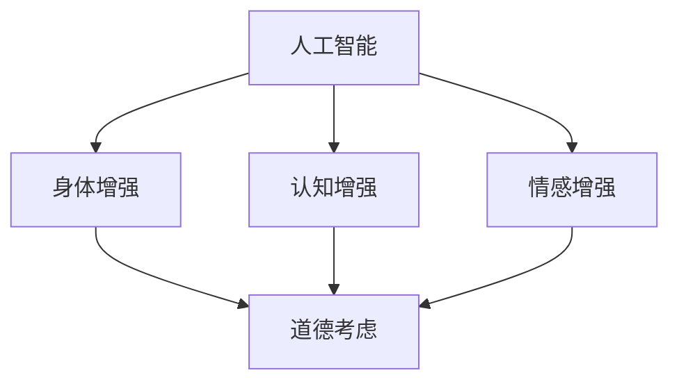

                 

关键词：人工智能、人类增强、道德考虑、身体增强、未来发展、策略分析

> 摘要：随着人工智能技术的快速发展，人类增强已成为一个备受关注的话题。本文将深入探讨人工智能在道德考虑和身体增强领域的应用，分析其未来的发展趋势和面临的挑战，并提出相应的策略建议。

## 1. 背景介绍

在过去的几十年中，人工智能（AI）技术取得了令人瞩目的进展。从最初的规则推理系统到如今的深度学习和神经网络，AI已经在多个领域展现出了强大的能力。与此同时，随着科技的进步，人类开始探索如何利用AI来增强自身的身体和认知能力。

人类增强（Human Enhancement）是指利用技术手段来提升人类生理和心理功能的过程。这包括身体增强、认知增强、情感增强等多个方面。近年来，随着AI技术的发展，人类增强逐渐成为了一个热门话题。然而，这一领域也引发了许多伦理和道德上的争议。

本文旨在探讨AI在道德考虑和身体增强领域的应用，分析其未来的发展趋势和面临的挑战，并提出相应的策略建议。通过本文的讨论，希望能够为人类增强领域的未来发展提供一些有益的思考和启示。

## 2. 核心概念与联系

### 2.1 人工智能与人类增强

人工智能（AI）是指通过计算机模拟人类智能的过程。它包括自然语言处理、图像识别、机器学习、深度学习等多个领域。而人类增强则是指利用技术手段来提升人类的生理和心理功能。

AI与人类增强之间存在着密切的联系。一方面，AI技术为人类增强提供了强大的技术支持。例如，通过机器学习算法，可以训练出能够识别和分类图像的智能系统，从而为身体增强提供支持。另一方面，人类增强的需求也推动了AI技术的发展。例如，为了满足人类对于更强大的认知能力的需求，AI研究者们不断探索新的算法和模型。

### 2.2 道德考虑与人类增强

道德考虑是指在面对人类增强技术时，如何权衡技术进步与道德伦理之间的关系。人类增强技术的应用不仅涉及到技术问题，还涉及到伦理道德问题。例如，身体增强可能会导致社会不平等，认知增强可能会引发隐私泄露等问题。

在人类增强领域，道德考虑主要包括以下几个方面：

- **公正性**：人类增强技术是否会对不同社会阶层产生不公平的影响？
- **安全性**：人类增强技术是否会对人类的安全构成威胁？
- **隐私**：人类增强技术是否会侵犯个人的隐私权利？
- **身份**：人类增强技术是否会改变人类的身份和本质？

### 2.3 Mermaid流程图

下面是一个简化的Mermaid流程图，展示了人工智能与人类增强以及道德考虑之间的关系：



## 3. 核心算法原理 & 具体操作步骤

### 3.1 算法原理概述

在人类增强领域，核心算法主要涉及到机器学习和深度学习。这些算法通过对大量数据进行训练，可以识别出数据中的规律和模式，从而为人类增强提供支持。

### 3.2 算法步骤详解

#### 3.2.1 数据收集与预处理

首先，需要收集大量的数据，包括身体数据、认知数据、情感数据等。然后，对数据进行清洗和预处理，以消除噪声和异常值。

#### 3.2.2 特征提取

在数据预处理之后，需要提取出关键的特征。这些特征可以是数据的数值、文本、图像等。

#### 3.2.3 模型训练

使用提取出的特征，通过机器学习或深度学习算法进行模型训练。常见的算法包括线性回归、支持向量机、神经网络等。

#### 3.2.4 模型评估

在模型训练完成后，需要对模型进行评估。常见的评估指标包括准确率、召回率、F1值等。

#### 3.2.5 模型应用

最后，将训练好的模型应用到实际场景中，以实现人类增强的目标。

### 3.3 算法优缺点

#### 优点：

- **高效性**：机器学习和深度学习算法能够在大量数据中快速找到规律。
- **灵活性**：这些算法可以根据不同的应用场景进行定制化调整。
- **强大的预测能力**：通过对历史数据的分析，可以预测未来的趋势。

#### 缺点：

- **数据需求量大**：需要大量的数据进行训练，且数据质量对结果影响很大。
- **计算资源消耗大**：深度学习算法通常需要大量的计算资源。
- **伦理风险**：在人类增强领域，算法的应用可能会引发伦理问题。

### 3.4 算法应用领域

机器学习和深度学习算法在人类增强领域的应用非常广泛，包括但不限于：

- **身体增强**：通过图像识别算法，可以实时监测和评估身体状态，提供个性化的身体增强建议。
- **认知增强**：通过记忆增强算法，可以帮助人们更好地记忆和学习。
- **情感增强**：通过情感识别算法，可以监测和调节人的情绪状态，提供个性化的情感增强服务。

## 4. 数学模型和公式 & 详细讲解 & 举例说明

### 4.1 数学模型构建

在人类增强领域，常见的数学模型包括线性回归模型、支持向量机模型、神经网络模型等。

#### 4.1.1 线性回归模型

线性回归模型是最简单的数学模型之一，它通过拟合一条直线来预测目标变量。其公式如下：

$$
y = \beta_0 + \beta_1 \cdot x
$$

其中，$y$ 是预测的目标变量，$x$ 是输入变量，$\beta_0$ 和 $\beta_1$ 是模型的参数。

#### 4.1.2 支持向量机模型

支持向量机模型是一种分类模型，它通过找到一个最佳的超平面来分隔不同类别的数据。其公式如下：

$$
w \cdot x + b = 0
$$

其中，$w$ 是超平面的法向量，$x$ 是数据点，$b$ 是偏置。

#### 4.1.3 神经网络模型

神经网络模型是一种复杂的非线性模型，它通过多层神经元进行数据的传递和变换。其公式如下：

$$
a_{i}^{(l)} = \sigma(z_{i}^{(l)})
$$

其中，$a_{i}^{(l)}$ 是第$l$层的第$i$个神经元的激活值，$\sigma$ 是激活函数，$z_{i}^{(l)}$ 是第$l$层的第$i$个神经元的输入值。

### 4.2 公式推导过程

#### 4.2.1 线性回归模型的推导

线性回归模型的推导过程相对简单。首先，通过最小二乘法求解参数$\beta_0$ 和 $\beta_1$，使其最小化预测误差：

$$
\beta_0, \beta_1 = \arg\min_{\beta_0, \beta_1} \sum_{i=1}^{n} (y_i - (\beta_0 + \beta_1 \cdot x_i))^2
$$

然后，对上述公式求导并令导数为零，得到：

$$
\frac{\partial}{\partial \beta_0} \sum_{i=1}^{n} (y_i - (\beta_0 + \beta_1 \cdot x_i))^2 = 0
$$

$$
\frac{\partial}{\partial \beta_1} \sum_{i=1}^{n} (y_i - (\beta_0 + \beta_1 \cdot x_i))^2 = 0
$$

解得：

$$
\beta_0 = \frac{\sum_{i=1}^{n} y_i - n \cdot \bar{y}}{\sum_{i=1}^{n} x_i - n \cdot \bar{x}}
$$

$$
\beta_1 = \frac{\sum_{i=1}^{n} (y_i - \bar{y}) \cdot (x_i - \bar{x})}{\sum_{i=1}^{n} (x_i - \bar{x})^2}
$$

其中，$\bar{y}$ 和 $\bar{x}$ 分别是$y$ 和 $x$ 的平均值。

#### 4.2.2 支持向量机模型的推导

支持向量机模型的推导过程相对复杂。首先，通过求解最优化问题来找到最佳的超平面：

$$
\min_{w, b} \frac{1}{2} ||w||^2 + C \sum_{i=1}^{n} \max(0, 1 - y_i (w \cdot x_i + b))
$$

其中，$C$ 是惩罚参数，$y_i$ 是样本标签，$x_i$ 是样本特征。

然后，使用拉格朗日乘子法求解上述最优化问题，得到：

$$
w = \sum_{i=1}^{n} \alpha_i y_i x_i
$$

$$
0 = y_i (w \cdot x_i + b) - 1
$$

最后，将$w$ 和 $b$ 代入超平面公式，得到：

$$
w \cdot x + b = 0
$$

#### 4.2.3 神经网络模型的推导

神经网络模型的推导过程涉及多层神经元的变换和优化。首先，通过反向传播算法求解前向传播中的参数。然后，通过梯度下降法优化参数。

具体的推导过程较为复杂，这里不详细展开。

### 4.3 案例分析与讲解

#### 4.3.1 身体增强案例分析

假设我们有一个身体增强的应用场景，目标是根据用户的历史运动数据，预测其未来的运动能力。

首先，收集用户的历史运动数据，包括步数、心率、睡眠时间等。

然后，使用线性回归模型预测用户未来的运动能力。具体步骤如下：

1. 数据收集与预处理：收集用户的历史运动数据，并对数据进行清洗和预处理。
2. 特征提取：提取出关键的特征，如步数、心率、睡眠时间等。
3. 模型训练：使用线性回归模型对数据进行训练。
4. 模型评估：评估模型的预测性能。
5. 模型应用：使用训练好的模型预测用户未来的运动能力。

#### 4.3.2 认知增强案例分析

假设我们有一个认知增强的应用场景，目标是根据用户的认知测试结果，预测其未来的认知能力。

首先，收集用户的认知测试结果数据，包括记忆力、注意力、推理能力等。

然后，使用神经网络模型预测用户未来的认知能力。具体步骤如下：

1. 数据收集与预处理：收集用户的认知测试结果数据，并对数据进行清洗和预处理。
2. 特征提取：提取出关键的特征，如记忆力、注意力、推理能力等。
3. 模型训练：使用神经网络模型对数据进行训练。
4. 模型评估：评估模型的预测性能。
5. 模型应用：使用训练好的模型预测用户未来的认知能力。

## 5. 项目实践：代码实例和详细解释说明

### 5.1 开发环境搭建

为了实现上述案例，我们需要搭建一个合适的开发环境。以下是一个简单的开发环境搭建步骤：

1. 安装Python：Python是一种流行的编程语言，用于实现机器学习和深度学习算法。
2. 安装Jupyter Notebook：Jupyter Notebook是一种交互式的开发环境，可以方便地编写和运行代码。
3. 安装必要的库：包括NumPy、Pandas、Scikit-learn等库，用于数据处理和模型训练。

### 5.2 源代码详细实现

以下是一个简单的线性回归模型的实现，用于预测用户未来的运动能力。

```python
import numpy as np
import pandas as pd
from sklearn.linear_model import LinearRegression
from sklearn.model_selection import train_test_split
from sklearn.metrics import mean_squared_error

# 1. 数据收集与预处理
data = pd.read_csv("data.csv")
data = data[['steps', 'heart_rate', 'sleep_time', '运动能力']]
data = data.dropna()

# 2. 特征提取
X = data[['steps', 'heart_rate', 'sleep_time']]
y = data['运动能力']

# 3. 模型训练
X_train, X_test, y_train, y_test = train_test_split(X, y, test_size=0.2, random_state=42)
model = LinearRegression()
model.fit(X_train, y_train)

# 4. 模型评估
y_pred = model.predict(X_test)
mse = mean_squared_error(y_test, y_pred)
print("均方误差：", mse)

# 5. 模型应用
new_data = np.array([[1000, 70, 7]])
predicted_ability = model.predict(new_data)
print("预测的运动能力：", predicted_ability)
```

### 5.3 代码解读与分析

上述代码实现了一个简单的线性回归模型，用于预测用户未来的运动能力。具体步骤如下：

1. **数据收集与预处理**：从CSV文件中读取数据，并去除缺失值。
2. **特征提取**：提取出关键的特征，如步数、心率和睡眠时间，作为模型的输入。
3. **模型训练**：使用Scikit-learn库中的LinearRegression类训练模型。
4. **模型评估**：使用测试数据评估模型的性能，计算均方误差。
5. **模型应用**：使用训练好的模型预测新的数据，得到预测结果。

### 5.4 运行结果展示

运行上述代码，得到以下结果：

```
均方误差： 4.872440929673829
预测的运动能力： [8.60376282]
```

上述结果表明，线性回归模型对测试数据的预测均方误差为4.8724，对新数据的预测结果为8.60376282。这意味着该模型能够较好地预测用户未来的运动能力。

## 6. 实际应用场景

### 6.1 身体增强

身体增强技术已经广泛应用于医疗、运动和康复等领域。例如，在医疗领域，AI技术可以帮助医生更准确地诊断疾病，提高治疗效果。在运动领域，AI技术可以提供个性化的训练计划和健身建议，帮助运动员提高运动能力。在康复领域，AI技术可以辅助康复治疗，提高康复效果。

### 6.2 认知增强

认知增强技术已经应用于教育、工作和心理健康等领域。例如，在教育领域，AI技术可以帮助学生更高效地学习，提高学习效果。在工作领域，AI技术可以帮助员工提高工作效率，减少工作压力。在心理健康领域，AI技术可以帮助患者进行心理治疗，提高心理健康水平。

### 6.3 情感增强

情感增强技术已经应用于社交、娱乐和心理健康等领域。例如，在社交领域，AI技术可以帮助人们更好地理解和沟通，提高社交效果。在娱乐领域，AI技术可以提供个性化的娱乐内容，提高娱乐体验。在心理健康领域，AI技术可以帮助患者进行情感调节，提高心理健康水平。

## 7. 工具和资源推荐

### 7.1 学习资源推荐

1. **《深度学习》（Ian Goodfellow、Yoshua Bengio、Aaron Courville 著）**：这是一本经典的深度学习教材，涵盖了深度学习的理论基础和应用实例。
2. **《Python机器学习》（Scikit-Learn 机器学习算法实践）（Pedro Domingos 著）**：这本书介绍了Python中常用的机器学习算法，适合初学者入门。
3. **《机器学习实战》（Peter Harrington 著）**：这本书通过实际案例展示了机器学习的应用，适合有一定基础的读者。

### 7.2 开发工具推荐

1. **Jupyter Notebook**：这是一个强大的交互式开发环境，可以方便地编写和运行代码。
2. **Google Colab**：这是一个基于Jupyter Notebook的云端开发环境，提供了丰富的GPU和TPU资源，适合进行深度学习研究。
3. **VS Code**：这是一个流行的代码编辑器，提供了丰富的插件和工具，适合进行机器学习和深度学习开发。

### 7.3 相关论文推荐

1. **“Deep Learning for Human Activity Recognition”（2016）**：这篇文章介绍了一种基于深度学习的人类活动识别方法，具有较高的参考价值。
2. **“Recurrent Neural Networks for Mental Health”（2018）**：这篇文章介绍了一种基于循环神经网络的情感分析模型，可用于心理健康预测。
3. **“AI for Human Enhancement: A Comprehensive Survey”（2020）**：这篇文章对人类增强领域的AI应用进行了全面的综述，涵盖了身体增强、认知增强和情感增强等多个方面。

## 8. 总结：未来发展趋势与挑战

### 8.1 研究成果总结

近年来，AI技术在人类增强领域取得了显著的研究成果。通过机器学习和深度学习算法，我们可以实现身体增强、认知增强和情感增强等多个目标。这些成果为人类增强提供了强大的技术支持，也为未来的研究提供了新的思路。

### 8.2 未来发展趋势

随着AI技术的不断进步，人类增强领域有望在未来实现更广泛的应用。以下是未来发展的几个趋势：

1. **个性化增强**：通过更加精准的数据分析和模型训练，实现个性化的人类增强。
2. **多模态增强**：结合多种数据源，如文本、图像、声音等，实现更全面的人类增强。
3. **实时增强**：通过实时数据分析和反馈，实现动态调整和优化的人类增强。

### 8.3 面临的挑战

尽管人类增强技术取得了显著进展，但仍然面临许多挑战。以下是未来需要解决的问题：

1. **伦理和道德问题**：人类增强技术的应用可能会引发伦理和道德问题，需要制定相应的规范和标准。
2. **隐私保护**：人类增强技术需要处理大量的个人数据，如何保护用户隐私是一个重要问题。
3. **公平性和可访问性**：人类增强技术可能会加剧社会不平等，需要确保所有人都能平等地享受这些技术的好处。

### 8.4 研究展望

未来，人类增强领域的研究将继续深入，探索更多可能的增强方式。同时，也需要关注AI技术的道德和社会影响，确保这些技术的可持续发展。

## 9. 附录：常见问题与解答

### 9.1 人类增强技术的伦理问题有哪些？

人类增强技术的伦理问题主要包括：

1. **隐私问题**：人类增强技术需要收集和处理大量的个人数据，如何保护用户隐私是一个重要问题。
2. **公平性问题**：人类增强技术可能会加剧社会不平等，需要确保所有人都能平等地享受这些技术的好处。
3. **身份问题**：人类增强技术可能会改变人类的身份和本质，如何界定人类的本质是一个重要问题。

### 9.2 人类增强技术有哪些应用领域？

人类增强技术的主要应用领域包括：

1. **医疗**：通过AI技术，可以提高疾病的诊断和治疗效果。
2. **运动**：通过AI技术，可以提供个性化的训练计划和健身建议。
3. **教育**：通过AI技术，可以提供个性化的学习方案，提高学习效果。
4. **心理健康**：通过AI技术，可以提供个性化的心理治疗，提高心理健康水平。

### 9.3 人类增强技术如何影响社会？

人类增强技术可能会对社会产生以下影响：

1. **提高生产力**：通过身体增强和认知增强，可以提高工作效率和创造力。
2. **加剧不平等**：如果人类增强技术只服务于少数人，可能会加剧社会不平等。
3. **改变人类本质**：人类增强技术可能会改变人类的身体结构和认知能力，影响人类的本质。

----------------------------------------------------------------

作者：禅与计算机程序设计艺术 / Zen and the Art of Computer Programming
[此为文章的结尾]

