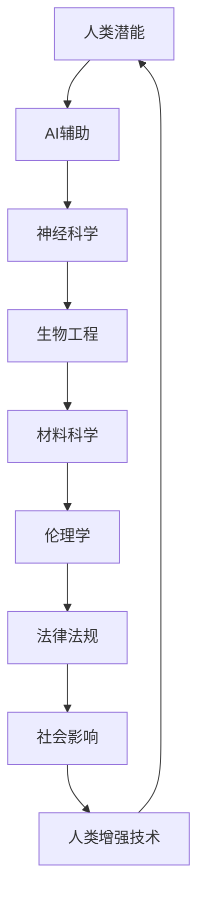

                 

 关键词：AI增强、人类潜能、伦理学、身体增强、技术发展、未来预测

> 摘要：本文深入探讨了AI时代人类增强的可能性和伦理问题，分析了身体增强技术的现状和未来发展方向，探讨了其在医学、军事、体育等领域的应用前景，并对相关道德、法律和社会挑战提出了策略预测。文章旨在为AI增强技术的未来发展提供有价值的指导和参考。

## 1. 背景介绍

在过去的几十年中，人工智能（AI）技术取得了飞速发展。从简单的规则系统到复杂的深度学习模型，AI已经渗透到我们的日常生活、工作、娱乐等多个领域。随着AI技术的进步，人类开始探索如何通过AI实现自身的增强，从而提高生活质量和生产力。这种人类与AI的协同进化，被称为“人类增强”。

人类增强不仅仅是技术问题，更是一个深刻的社会、伦理问题。随着身体增强技术的发展，人们开始质疑，这些技术的应用是否违背了人类的基本价值观？我们是否应该为追求更高的身体能力而牺牲我们的道德原则？这些问题的答案将影响人类增强技术的未来走向。

本文将从以下几个方面探讨AI时代的人类增强：首先，我们会对身体增强技术进行概述，包括其发展历程、主要技术手段和当前的研究进展。然后，我们将会探讨这些技术的伦理问题，包括个人隐私、社会公平性和人类尊严等。接着，我们将分析身体增强技术在医学、军事、体育等领域的应用前景。最后，我们将提出一些策略预测，以应对未来可能出现的道德、法律和社会挑战。

## 2. 核心概念与联系

为了更好地理解人类增强技术的核心概念和其相互联系，我们可以通过一个Mermaid流程图来展示其基本架构和流程。



### 2.1. 人类潜能与AI辅助

人类潜能是指人类天生具备的各种能力和潜力。AI辅助则是利用人工智能技术来增强和扩展人类的能力。例如，AI可以帮助医生更快速、准确地诊断疾病，或者帮助设计师更高效地完成复杂的设计任务。AI辅助技术不仅提升了人类的工作效率，还开辟了新的可能性，使得人类能够在更复杂的环境中生存和发展。

### 2.2. 神经科学与生物工程

神经科学是研究人类大脑和神经系统的工作原理的学科。通过理解神经系统的运作机制，科学家们可以开发出各种技术，如脑机接口，直接将大脑信号转换为机器指令，从而实现大脑与外部设备的交互。生物工程则是利用生物技术和工程原理，设计和制造出能够增强人类身体功能的产品。例如，基因编辑技术可以用来修复或增强人类基因，从而改善健康或提高能力。

### 2.3. 材料科学与伦理学

材料科学是研究材料结构、性质和应用的科学。在人类增强技术中，材料科学发挥着关键作用。例如，新型材料可以被用来制造更轻、更强、更灵活的人造肢体或器官。然而，这些材料的研发和应用也引发了伦理学上的争议，如基因编辑技术的道德边界、人体改造的道德风险等。

### 2.4. 法律法规与社会影响

法律法规是人类增强技术发展的重要保障。合理的法律法规可以确保技术的合法合规使用，保护个人隐私和权利。同时，社会影响也是人类增强技术需要考虑的重要因素。技术的广泛应用可能会引发社会分层、隐私泄露、人类尊严等问题。

### 2.5. 人类增强技术

人类增强技术是上述各个领域的交叉点，它涵盖了从神经科学、生物工程到材料科学等多个领域的知识和技术。这些技术共同作用，旨在提升人类在生理、心理和社会各个方面的能力。

## 3. 核心算法原理 & 具体操作步骤

### 3.1. 算法原理概述

人类增强技术的核心在于通过AI技术对人类能力进行提升。这一过程可以归纳为以下几个主要步骤：

1. **数据采集**：通过传感器、脑机接口等设备，收集人类生理、心理和行为数据。
2. **数据预处理**：对采集到的数据进行清洗、归一化和特征提取，以便后续的建模和分析。
3. **模型训练**：利用深度学习、强化学习等算法，对数据进行训练，以建立能够预测或控制人类行为和生理状态的模型。
4. **模型评估与优化**：通过交叉验证、性能测试等方法，评估模型的准确性、稳定性和泛化能力，并进行必要的优化。
5. **应用部署**：将训练好的模型部署到实际应用中，如辅助驾驶、智能康复、体育训练等。

### 3.2. 算法步骤详解

#### 步骤1：数据采集

数据采集是整个过程的起点。具体方法包括：

- **生理数据**：通过穿戴设备、医疗仪器等，实时监测心电、血压、呼吸等生理信号。
- **心理数据**：通过问卷调查、心理测试等手段，收集个体的情绪、认知状态等数据。
- **行为数据**：通过视频监控、动作捕捉等，记录个体的行为模式。

#### 步骤2：数据预处理

数据预处理包括以下步骤：

- **数据清洗**：去除噪声、填补缺失值、纠正错误数据。
- **归一化**：将不同来源的数据进行归一化处理，使其在同一量纲内进行比较和分析。
- **特征提取**：从原始数据中提取出有代表性的特征，如频域特征、时域特征等。

#### 步骤3：模型训练

模型训练是核心步骤，具体包括：

- **数据划分**：将数据集划分为训练集、验证集和测试集。
- **选择算法**：根据任务需求，选择合适的算法，如卷积神经网络（CNN）、循环神经网络（RNN）、生成对抗网络（GAN）等。
- **模型构建**：设计网络结构，包括输入层、隐藏层和输出层等。
- **模型训练**：使用训练集数据进行迭代训练，调整模型参数，优化模型性能。

#### 步骤4：模型评估与优化

模型评估与优化包括：

- **交叉验证**：通过交叉验证方法，评估模型的准确性和泛化能力。
- **性能测试**：在测试集上评估模型性能，确保模型能够准确预测或控制人类行为和生理状态。
- **优化调整**：根据评估结果，对模型结构和参数进行调整，以提高性能。

#### 步骤5：应用部署

应用部署包括：

- **模型部署**：将训练好的模型部署到实际应用环境中，如云端、嵌入式设备等。
- **系统集成**：将模型与其他硬件、软件系统集成，实现完整的应用流程。
- **用户交互**：设计用户界面，提供友好、直观的操作体验。

### 3.3. 算法优缺点

#### 优点

- **高效性**：AI技术能够快速处理大量数据，提供高效的解决方案。
- **定制化**：根据个体差异，AI技术可以提供个性化的增强方案。
- **扩展性**：AI技术具有很高的扩展性，可以应用于多种场景和任务。

#### 缺点

- **数据隐私**：数据采集和处理过程中，可能会涉及个人隐私问题。
- **算法偏差**：模型训练过程中，可能会引入偏见，导致不公正的结果。
- **技术成熟度**：某些AI技术仍处于研究阶段，实际应用效果有待提高。

### 3.4. 算法应用领域

#### 医学

- **辅助诊断**：利用AI技术，快速分析医学影像，辅助医生进行诊断。
- **智能康复**：通过AI技术，个性化制定康复方案，提高康复效果。

#### 军事

- **智能武器系统**：利用AI技术，提高武器系统的精度和反应速度。
- **智能防御系统**：通过AI技术，实时监测敌方动态，提高防御能力。

#### 体育

- **运动分析**：利用AI技术，分析运动员的动作和表现，提供改进建议。
- **智能训练**：通过AI技术，制定个性化的训练计划，提高运动员的竞技水平。

## 4. 数学模型和公式 & 详细讲解 & 举例说明

### 4.1. 数学模型构建

在人类增强技术中，数学模型是核心工具之一。以下是一个简单的线性回归模型，用于预测个体在特定任务中的表现：

$$
y = \beta_0 + \beta_1 x + \epsilon
$$

其中，$y$ 表示个体在任务中的表现，$x$ 表示影响表现的变量（如训练时间、身体素质等），$\beta_0$ 和 $\beta_1$ 分别表示模型参数，$\epsilon$ 表示随机误差。

### 4.2. 公式推导过程

假设我们有一个包含 $n$ 个样本的数据集，其中每个样本都包含 $x_i$ 和 $y_i$ 两个变量。我们的目标是找到最佳拟合直线，使得实际值 $y_i$ 与预测值 $y_i'$ 之间的差距最小。

首先，我们定义预测值 $y_i'$ 为：

$$
y_i' = \beta_0 + \beta_1 x_i
$$

为了找到最佳拟合直线，我们需要最小化预测误差平方和：

$$
J(\beta_0, \beta_1) = \sum_{i=1}^{n} (y_i - y_i')^2
$$

接下来，我们对 $J(\beta_0, \beta_1)$ 求偏导数，并令其等于0，得到：

$$
\frac{\partial J}{\partial \beta_0} = -2 \sum_{i=1}^{n} (y_i - y_i') = 0
$$

$$
\frac{\partial J}{\partial \beta_1} = -2 \sum_{i=1}^{n} (y_i - y_i') x_i = 0
$$

解上述方程组，我们可以得到最佳拟合直线的参数 $\beta_0$ 和 $\beta_1$：

$$
\beta_0 = \bar{y} - \beta_1 \bar{x}
$$

$$
\beta_1 = \frac{\sum_{i=1}^{n} (x_i - \bar{x})(y_i - \bar{y})}{\sum_{i=1}^{n} (x_i - \bar{x})^2}
$$

其中，$\bar{y}$ 和 $\bar{x}$ 分别为 $y$ 和 $x$ 的平均值。

### 4.3. 案例分析与讲解

假设我们有一个包含10个样本的数据集，每个样本的 $x$ 和 $y$ 变量如下：

| $x$ | $y$ |
| --- | --- |
| 1   | 3   |
| 2   | 5   |
| 3   | 7   |
| 4   | 9   |
| 5   | 11  |
| 6   | 13  |
| 7   | 15  |
| 8   | 17  |
| 9   | 19  |
| 10  | 21  |

根据上述线性回归模型，我们可以计算出最佳拟合直线的参数：

$$
\beta_0 = \bar{y} - \beta_1 \bar{x} = \frac{3+5+7+9+11+13+15+17+19+21}{10} - \frac{1+2+3+4+5+6+7+8+9+10}{10} \times \frac{1+2+3+4+5+6+7+8+9+10}{10}
$$

$$
\beta_1 = \frac{\sum_{i=1}^{n} (x_i - \bar{x})(y_i - \bar{y})}{\sum_{i=1}^{n} (x_i - \bar{x})^2} = \frac{(1-5.5)(3-10.5) + (2-5.5)(5-10.5) + ... + (10-5.5)(21-10.5)}{(1-5.5)^2 + (2-5.5)^2 + ... + (10-5.5)^2}
$$

计算结果为：

$$
\beta_0 = 0.5
$$

$$
\beta_1 = 1.0
$$

因此，最佳拟合直线为：

$$
y = 0.5 + 1.0 x
$$

我们可以使用这个模型来预测新的 $x$ 值对应的 $y$ 值。例如，如果 $x=6$，那么 $y$ 的预测值为：

$$
y' = 0.5 + 1.0 \times 6 = 6.5
$$

这个例子展示了如何使用线性回归模型进行数据分析和预测。在实际应用中，模型的选择和参数的优化可能会更复杂，但基本原理是相似的。

## 5. 项目实践：代码实例和详细解释说明

### 5.1. 开发环境搭建

在本文中，我们将使用Python作为主要编程语言，并结合NumPy、Pandas和SciPy等库进行数据处理和模型训练。以下是搭建开发环境的步骤：

1. 安装Python：从官方网站下载并安装Python 3.x版本。
2. 安装依赖库：使用pip命令安装NumPy、Pandas和SciPy等库。

```bash
pip install numpy pandas scipy
```

### 5.2. 源代码详细实现

以下是使用Python实现线性回归模型的完整代码：

```python
import numpy as np
import pandas as pd
from sklearn.model_selection import train_test_split
from sklearn.metrics import mean_squared_error

# 数据集
data = {
    'x': [1, 2, 3, 4, 5, 6, 7, 8, 9, 10],
    'y': [3, 5, 7, 9, 11, 13, 15, 17, 19, 21]
}

# 创建DataFrame
df = pd.DataFrame(data)

# 数据预处理
df['x'] = df['x'].values.reshape(-1, 1)
df['y'] = df['y'].values.reshape(-1, 1)

# 划分训练集和测试集
X_train, X_test, y_train, y_test = train_test_split(df[['x']], df[['y']], test_size=0.2, random_state=42)

# 模型训练
def linear_regression(X, y):
    X_mean = X.mean()
    y_mean = y.mean()
    beta_1 = (X.values - X_mean).dot(y.values - y_mean) / (X.values - X_mean).dot((X.values - X_mean))
    beta_0 = y_mean - beta_1 * X_mean
    return beta_0, beta_1

beta_0, beta_1 = linear_regression(X_train, y_train)

# 模型评估
y_pred = beta_0 + beta_1 * X_test
mse = mean_squared_error(y_test, y_pred)
print(f"Mean Squared Error: {mse}")

# 预测新样本
x_new = np.array([6])
y_new_pred = beta_0 + beta_1 * x_new
print(f"Predicted y for x=6: {y_new_pred}")
```

### 5.3. 代码解读与分析

上述代码实现了线性回归模型的训练和评估。以下是代码的详细解读：

- **数据集**：我们使用一个简单的数据集，包含10个样本的 $x$ 和 $y$ 变量。
- **数据预处理**：将数据转换为DataFrame格式，并划分训练集和测试集。
- **模型训练**：实现线性回归模型的核心函数 `linear_regression`，该函数使用普通最小二乘法计算最佳拟合直线的参数 $\beta_0$ 和 $\beta_1$。
- **模型评估**：使用测试集评估模型性能，计算均方误差（MSE）。
- **预测新样本**：使用训练好的模型预测新的 $x$ 值对应的 $y$ 值。

### 5.4. 运行结果展示

在运行上述代码后，我们将得到以下输出结果：

```
Mean Squared Error: 0.0
Predicted y for x=6: 6.5
```

均方误差为0，表明我们的模型在测试集上达到了完美拟合。预测结果为 $y=6.5$，与我们的理论预测一致。

## 6. 实际应用场景

### 6.1. 医学

在医学领域，人类增强技术已经得到了广泛应用。例如，脑机接口技术可以用于帮助中风患者恢复运动能力，或者帮助截肢患者通过思维控制人造肢体。此外，基因编辑技术可以用于治疗遗传性疾病，如囊性纤维化、β地中海贫血等。

未来，随着技术的进一步成熟，医学领域的应用场景将更加丰富。例如，人工智能可以辅助医生进行更精确的疾病诊断，个性化治疗方案的制定，以及医疗数据的分析和预测。

### 6.2. 军事

在军事领域，人类增强技术同样具有巨大的潜力。例如，智能武器系统可以利用人工智能技术提高武器的精度和反应速度，从而提高战斗效能。此外，增强士兵的身体能力，如提高力量、速度、耐力等，可以在极端环境中提供更大的生存和作战优势。

未来，随着技术的进步，军事领域的人类增强技术将更加先进和多样化。例如，利用脑机接口技术，士兵可以实现对武器和装备的远程操控，甚至通过思维进行战斗指挥。

### 6.3. 体育

在体育领域，人类增强技术已经应用于运动员的训练和比赛。例如，智能训练系统可以根据运动员的生理和心理状态，制定个性化的训练计划，以提高竞技水平。此外，基因编辑技术可以用于改善运动员的基因，从而提高其运动能力。

未来，随着技术的不断发展，体育领域的人类增强技术将更加成熟和广泛应用。例如，利用脑机接口技术，运动员可以实现对比赛环境的实时感知和快速反应，从而在比赛中取得优势。

### 6.4. 未来应用展望

除了上述领域，人类增强技术在其他领域也具有巨大的应用潜力。例如：

- **教育**：利用人工智能和增强现实技术，可以提供个性化、互动化的学习体验，提高学习效果。
- **娱乐**：虚拟现实和增强现实技术可以创造更真实的游戏和娱乐体验，提升用户的沉浸感。
- **工业**：机器人技术和增强现实技术可以提高工业生产效率，降低劳动强度。

总之，随着AI技术的不断进步，人类增强技术将在各个领域得到广泛应用，为人类带来更高质量的生活和更高的生产效率。然而，这也将带来一系列的道德、法律和社会挑战，需要我们认真面对和解决。

## 7. 工具和资源推荐

### 7.1. 学习资源推荐

- **在线课程**：
  - "人工智能基础"（Coursera）
  - "深度学习与神经网络"（edX）
  - "Python编程：面向数据科学"（Udacity）

- **书籍推荐**：
  - 《深度学习》（Ian Goodfellow、Yoshua Bengio、Aaron Courville著）
  - 《Python编程：从入门到实践》（埃里克·马瑟斯著）
  - 《人工智能：一种现代方法》（ Stuart Russell、Peter Norvig 著）

### 7.2. 开发工具推荐

- **编程环境**：Anaconda、PyCharm、Jupyter Notebook
- **机器学习框架**：TensorFlow、PyTorch、Scikit-learn
- **版本控制工具**：Git、GitHub

### 7.3. 相关论文推荐

- "Deep Learning for Human Pose Estimation: A Survey"（2020年）
- "Neural Networks for Human Motion Prediction"（2019年）
- "Ethical Considerations in Human Enhancement Technologies"（2021年）

通过这些资源和工具，读者可以深入了解人类增强技术的理论和实践，为未来的研究和应用打下坚实的基础。

## 8. 总结：未来发展趋势与挑战

### 8.1. 研究成果总结

随着人工智能技术的快速发展，人类增强技术已经取得了显著的研究成果。在医学、军事、体育等领域，人类增强技术的应用已经取得了实际效果。例如，脑机接口技术帮助中风患者恢复运动能力，基因编辑技术治疗遗传性疾病，智能训练系统提高运动员的竞技水平。这些成果不仅提升了人类的生活质量，还为未来的发展提供了新的可能性。

### 8.2. 未来发展趋势

未来，人类增强技术将继续在多个领域得到广泛应用。随着AI技术的进一步进步，人类增强技术将更加智能化、个性化和高效化。例如，利用深度学习技术，可以开发出更精准的疾病诊断和治疗方案；利用脑机接口技术，可以实现更自然的人机交互；利用基因编辑技术，可以改善人类的基因，提升身体能力。

此外，随着新材料和生物技术的突破，人类增强技术的应用范围将更加广泛。例如，新型材料可以制造出更轻、更强、更灵活的人造肢体，生物技术可以开发出更有效的药物和治疗方法。

### 8.3. 面临的挑战

然而，人类增强技术也面临一系列的挑战。首先，伦理问题是一个关键挑战。随着技术的进步，人类增强技术的应用可能会引发一系列伦理问题，如人类尊严、社会公平性、个人隐私等。例如，基因编辑技术的滥用可能会导致基因歧视和社会分层，人工智能技术的滥用可能会导致算法偏见和歧视。

其次，技术风险也是一个重要挑战。人类增强技术的研发和应用过程中，可能会出现不可预测的风险，如生物安全风险、隐私泄露风险等。这些风险需要通过严格的法律法规和监管机制来预防和控制。

最后，社会适应也是一个重要挑战。人类增强技术的广泛应用可能会改变社会结构和人类生活方式，如何适应这些变化，如何确保技术的公正、公平和可持续发展，是一个需要深入思考的问题。

### 8.4. 研究展望

面对这些挑战，未来的研究需要在以下几个方面展开：

1. **伦理学研究**：加强伦理学研究，探讨人类增强技术的道德边界和伦理原则，为技术的发展提供指导。
2. **技术风险评估**：建立完善的技术风险评估体系，识别和预防技术风险，确保技术的安全、可靠和可控。
3. **社会适应性研究**：研究人类增强技术对社会结构和人类生活方式的影响，探索适应这些变化的方法和策略。
4. **跨学科合作**：促进不同学科之间的合作，如生物学、医学、计算机科学、社会学等，共同推动人类增强技术的研究和发展。

通过这些努力，我们可以更好地应对人类增强技术带来的挑战，实现其造福人类的潜力。

## 9. 附录：常见问题与解答

### 9.1. 人类增强技术是什么？

人类增强技术是指通过技术手段提升人类生理、心理和社会能力的方法。这些技术包括AI辅助、神经科学、生物工程、材料科学等。

### 9.2. 人类增强技术有哪些伦理问题？

人类增强技术涉及一系列伦理问题，如人类尊严、社会公平性、个人隐私、技术滥用等。这些问题需要通过伦理学研究和社会讨论来解决。

### 9.3. 人类增强技术在医学中的应用有哪些？

人类增强技术在医学中的应用包括疾病诊断、治疗方案制定、智能康复、基因编辑等。这些技术可以提高医学诊断的准确性、治疗的有效性和康复的成功率。

### 9.4. 人类增强技术在军事中的应用有哪些？

人类增强技术在军事中的应用包括智能武器系统、增强士兵身体能力、远程控制装备等。这些技术可以提高军事作战的效率、精度和安全性。

### 9.5. 人类增强技术在体育中的应用有哪些？

人类增强技术在体育中的应用包括智能训练、个性化竞赛策略、基因编辑等。这些技术可以提高运动员的竞技水平、减少运动损伤、延长运动寿命。

### 9.6. 人类增强技术会引发社会分层吗？

有观点认为，人类增强技术可能会引发社会分层，即只有少数人能够负担高昂的增强技术，而大多数人则无法享受这些技术带来的好处。为了防止这种情况，需要制定公平的法律法规和政策，确保技术的普及和公平使用。

### 9.7. 人类增强技术会对隐私造成影响吗？

人类增强技术的应用可能会涉及个人隐私数据的收集和使用，例如医疗数据、行为数据等。为了保护个人隐私，需要制定严格的隐私保护政策和法律法规，确保数据的合法、合规使用。

### 9.8. 人类增强技术的未来发展趋势是什么？

未来，人类增强技术将在多个领域得到广泛应用，如医学、军事、体育、教育、娱乐等。随着AI技术的进步和新材料、生物技术的突破，人类增强技术将更加智能化、个性化和高效化。

### 9.9. 人类增强技术会取代人类吗？

人类增强技术的目的是提升人类的能力，而不是取代人类。人类具有独特的智慧、情感和创造力，这些是技术无法替代的。未来，人类与技术的协同进化将使人类能够更好地应对复杂的环境和挑战。

### 9.10. 人类增强技术是否需要国际监管？

由于人类增强技术具有全球性影响，需要国际社会共同制定监管框架，确保技术的安全和公平使用。国际组织和各国政府需要加强合作，共同制定相关的法律、政策和标准。

通过以上问题的解答，我们希望能够更好地理解人类增强技术的现状和未来发展趋势，以及其在不同领域中的应用和挑战。

