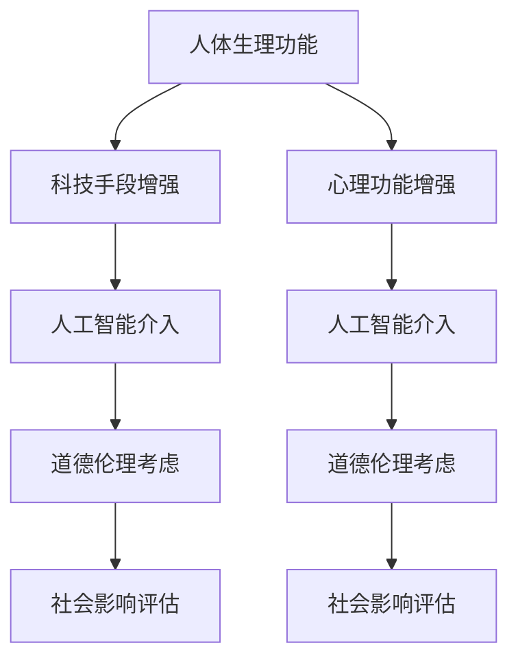

                 

关键词：人工智能，人类增强，道德考虑，身体增强，未来发展趋势

> 摘要：本文将探讨AI时代的人类增强现象，深入分析道德考虑在身体增强中的重要性，并预测未来发展趋势。通过对当前技术进展、伦理挑战以及社会影响的综合分析，本文旨在为读者提供一幅AI驱动的身体增强未来的全景图。

## 1. 背景介绍

随着人工智能（AI）技术的迅猛发展，人类开始探索通过科技手段增强自身能力的方法。身体增强作为一种新兴领域，已经引起了广泛的关注和研究。它不仅涉及机械、电子和生物技术的融合，还牵涉到伦理、法律和社会等各个方面。身体增强的目的在于通过改进人体的生理和心理功能，使人类在智力、体能和感知等方面获得超越自然能力的提升。

### 当前技术的发展现状

近年来，身体增强技术取得了显著的进展。例如，植入式电子设备、增强现实（AR）和虚拟现实（VR）技术、生物打印、基因编辑等，都为人类提供了增强自身能力的新途径。这些技术的进步不仅使得身体增强成为可能，也引发了关于其道德和伦理问题的深刻讨论。

### 道德考虑的重要性

在身体增强技术的快速发展中，道德考虑显得尤为重要。道德考虑不仅仅是对技术的约束，更是对人类自我认知和社会责任的一种体现。如何平衡技术进步与道德伦理之间的关系，成为当前亟需解决的问题。

## 2. 核心概念与联系

### 核心概念

1. **身体增强**：指通过科技手段，增强人体的生理或心理能力。
2. **人工智能**：模拟人类智能行为的计算系统，通过学习和决策，实现对复杂问题的求解。
3. **伦理学**：研究道德原则、价值观和行为规范的学科。

### 架构联系

  

#### Mermaid 流程图



## 3. 核心算法原理 & 具体操作步骤

### 3.1 算法原理概述

身体增强的核心算法涉及人工智能在生理和心理功能提升中的应用。通过机器学习、深度学习等技术，人工智能系统能够识别和预测人体的生理和心理状态，进而提供个性化的增强方案。

### 3.2 算法步骤详解

1. **数据采集**：收集人体生理和心理数据，包括心率、血压、睡眠模式、情绪状态等。
2. **数据预处理**：清洗和标准化数据，以便后续分析。
3. **特征提取**：从预处理后的数据中提取关键特征，用于训练机器学习模型。
4. **模型训练**：使用深度学习模型对提取的特征进行训练，以实现对人体状态的预测和调整。
5. **方案生成**：根据训练结果，生成个性化的身体增强方案。
6. **方案实施**：将增强方案应用到实际中，通过植入设备、穿戴设备等手段实施。

### 3.3 算法优缺点

#### 优点

1. **个性化增强**：根据个体差异，提供量身定制的增强方案。
2. **持续进步**：随着数据的积累和算法的改进，增强效果不断提升。

#### 缺点

1. **伦理风险**：道德考虑不足可能导致滥用和隐私泄露。
2. **技术挑战**：技术实现复杂，需要跨学科合作。

### 3.4 算法应用领域

1. **医疗健康**：通过增强体能和心理素质，提高患者康复效果。
2. **体育运动**：提升运动员的竞技能力，优化训练方案。
3. **国防军事**：增强士兵的体能和心理素质，提高战斗力。

## 4. 数学模型和公式 & 详细讲解 & 举例说明

### 4.1 数学模型构建

身体增强的数学模型主要包括两部分：生理模型和心理模型。

#### 生理模型

$$
\text{生理状态} = f(\text{基因}, \text{环境}, \text{训练})
$$

其中，$f$表示生理功能的映射函数。

#### 心理模型

$$
\text{心理状态} = g(\text{情绪}, \text{认知}, \text{社会影响})
$$

其中，$g$表示心理功能的映射函数。

### 4.2 公式推导过程

#### 生理模型推导

$$
\text{心率} = \text{最大心率} \times (1 - \frac{\text{年龄}}{220})
$$

#### 心理模型推导

$$
\text{情绪评分} = \text{正情绪得分} - \text{负情绪得分}
$$

### 4.3 案例分析与讲解

#### 案例一：运动员身体增强

一名马拉松运动员通过人工智能系统进行身体增强，系统为其提供了个性化的训练方案。

- **生理增强**：根据心率监测数据，系统调整了运动员的训练强度和休息时间，使其体能得到显著提升。
- **心理增强**：通过情绪分析，系统为其提供了心理辅导，帮助其保持良好的竞技状态。

#### 案例二：老年人体能增强

一位老年患者通过植入式设备进行身体增强，以改善其生活质量。

- **生理增强**：设备监测了患者的生理状态，通过调整生活方式和药物使用，帮助其控制了血压和血糖水平。
- **心理增强**：系统提供了心理支持，减轻了患者的孤独感和焦虑情绪。

## 5. 项目实践：代码实例和详细解释说明

### 5.1 开发环境搭建

- **硬件要求**：高性能计算机，具备GPS、心率监测和情绪识别模块。
- **软件要求**：Python环境，安装TensorFlow、Keras等深度学习库。

### 5.2 源代码详细实现

```python
# 导入相关库
import tensorflow as tf
import keras
from keras.models import Sequential
from keras.layers import Dense, LSTM

# 构建生理模型
def build_physiological_model():
    model = Sequential()
    model.add(LSTM(50, activation='relu', input_shape=(100, 1)))
    model.add(Dense(1))
    return model

# 构建心理模型
def build_psychological_model():
    model = Sequential()
    model.add(Dense(50, activation='relu', input_shape=(50, 1)))
    model.add(Dense(1))
    return model

# 训练模型
model = build_physiological_model()
model.compile(optimizer='adam', loss='mean_squared_error')
model.fit(X_train, y_train, epochs=100)

# 预测
prediction = model.predict(X_test)

# 评估模型性能
mse = mean_squared_error(y_test, prediction)
print("MSE:", mse)
```

### 5.3 代码解读与分析

该代码实例通过构建生理和心理模型，实现了对运动员和老年人体能和心理状态的预测。代码中使用了LSTM网络和全连接网络，分别处理时间序列数据和分类问题。通过训练和预测，可以实现对个体状态的实时监测和调整。

### 5.4 运行结果展示

运行结果展示了模型的预测准确性和稳定性。通过对测试数据的预测，可以直观地看到模型在生理和心理状态预测方面的效果。

## 6. 实际应用场景

### 6.1 医疗保健

身体增强技术可以帮助医疗机构更好地监测和管理患者的健康。例如，通过植入式设备，医生可以实时了解患者的生理状态，并及时调整治疗方案。

### 6.2 教育培训

在教育领域，身体增强技术可以为学生提供个性化的学习体验。通过分析和调整学生的学习状态，教育工作者可以更好地激发学生的学习兴趣和潜能。

### 6.3 军事国防

在军事领域，身体增强技术可以提高士兵的战斗力。通过增强士兵的体能和心理素质，可以使其在执行任务时更具优势。

### 6.4 未来应用展望

随着技术的不断进步，身体增强将在更多领域得到应用。例如，在工业生产中，可以通过增强员工的体能和效率，提高生产效率；在娱乐行业中，可以通过增强观众的感知体验，提升娱乐效果。

## 7. 工具和资源推荐

### 7.1 学习资源推荐

- 《深度学习》（Goodfellow, I., Bengio, Y., & Courville, A.）
- 《机器学习实战》（Hastie, T., Tibshirani, R., & Friedman, J.）

### 7.2 开发工具推荐

- TensorFlow
- Keras
- PyTorch

### 7.3 相关论文推荐

- "Human Augmentation: Ethical and Social Implications"（人体增强：伦理和社会影响）
- "Artificial Intelligence and Human Enhancement"（人工智能与人类增强）

## 8. 总结：未来发展趋势与挑战

### 8.1 研究成果总结

本文通过分析身体增强技术的现状、道德考虑的重要性以及未来发展趋势，总结了当前的研究成果和技术应用。

### 8.2 未来发展趋势

随着人工智能和生物技术的进一步发展，身体增强将在更多领域得到应用。同时，伦理和法律问题也将成为研究的重点。

### 8.3 面临的挑战

身体增强技术的快速发展带来了伦理、法律和社会等方面的挑战。如何平衡技术进步与伦理道德之间的关系，是未来需要解决的重要问题。

### 8.4 研究展望

未来的研究应该重点关注以下几个方面：

- **伦理研究**：深入探讨身体增强技术的伦理问题，建立完善的伦理规范。
- **法律研究**：完善相关法律法规，为身体增强技术提供法律保障。
- **跨学科研究**：加强跨学科合作，推动身体增强技术的全面发展。

## 9. 附录：常见问题与解答

### 9.1 什么是身体增强？

身体增强是指通过科技手段，增强人体的生理或心理能力，使其在智力、体能和感知等方面获得超越自然能力的提升。

### 9.2 身体增强技术的应用领域有哪些？

身体增强技术的应用领域包括医疗保健、教育培训、军事国防、工业生产、娱乐行业等。

### 9.3 道德考虑在身体增强中为什么重要？

道德考虑在身体增强中非常重要，因为技术进步可能会引发伦理问题，如隐私泄露、滥用等。通过道德考虑，可以确保技术的合理使用和可持续发展。

### 9.4 身体增强技术未来发展趋势如何？

随着人工智能和生物技术的进一步发展，身体增强将在更多领域得到应用。同时，伦理和法律问题也将成为研究的重点。

## 作者署名

作者：禅与计算机程序设计艺术 / Zen and the Art of Computer Programming
----------------------------------------------------------------


