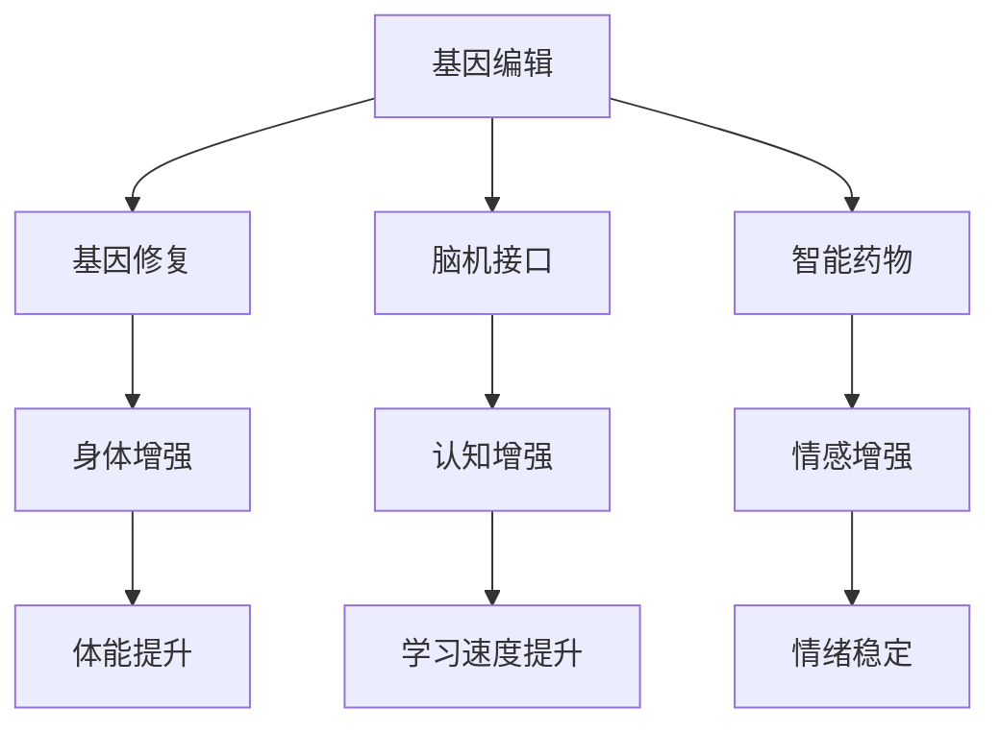

                 

关键词：人工智能，人类增强，道德，身体增强，未来方向

摘要：随着人工智能技术的迅猛发展，人类对自身的改造逐渐成为可能。本文探讨了在AI时代，人类增强的道德考虑以及身体增强的未来方向。通过分析现有技术和案例，我们提出了关于道德伦理的讨论，并对身体增强技术的未来趋势进行了展望。

## 1. 背景介绍

近年来，人工智能（AI）领域取得了显著的进展。从简单的机器学习算法到复杂的深度学习模型，AI在图像识别、自然语言处理、自动化决策等多个领域展示了强大的能力。与此同时，生物医学领域也在不断发展，基因编辑、神经科学与神经工程等技术的突破使得人类对身体功能的提升成为可能。

这些技术的进步引发了人们对于“人类增强”的讨论。人类增强不仅仅是提升身体和认知能力，更涉及道德、伦理和社会等深层次问题。在这个背景下，我们需要思考：在AI时代，人类增强是否合理？如何平衡技术进步与道德责任？本文将围绕这些问题展开讨论。

### 1.1 人类增强的定义

人类增强是指通过使用外部设备、药物、基因编辑等技术手段，提升人类身体和认知能力的过程。这种增强不仅限于身体功能的修复和强化，还包括认知、情感和心理等方面的提升。人类增强可以分为以下几类：

1. **身体增强**：包括肌肉强化、视力增强、听力增强等。
2. **认知增强**：包括记忆增强、注意力增强、学习速度提升等。
3. **情感增强**：包括幸福感提升、情绪稳定等。

### 1.2 人类增强的现状

目前，人类增强技术已在某些领域取得了突破性进展。例如，通过基因编辑技术，科学家已经成功修复了人类胚胎中的基因缺陷。在神经科学领域，脑机接口技术（BCI）使得瘫痪患者能够通过意念控制外部设备。此外，智能药物和营养补充剂也在逐步推广，以提高人类的认知和体能。

## 2. 核心概念与联系

在探讨人类增强的道德考虑和未来方向时，我们需要了解以下几个核心概念：

1. **人类增强技术**：包括基因编辑、脑机接口、智能药物等。
2. **伦理原则**：如公正、尊重、自主、无害等。
3. **社会影响**：包括社会分化、隐私问题、法律监管等。

### 2.1 人类增强技术的原理和架构

以下是一个简化的 Mermaid 流程图，展示了人类增强技术的基本原理和架构：



### 2.2 道德原则的应用

在人类增强技术的应用过程中，我们需要遵循以下伦理原则：

1. **公正**：确保技术带来的好处能够公平地分配，避免加剧社会不平等。
2. **尊重**：尊重个体的自主权和隐私权，避免未经授权的身体和基因修改。
3. **自主**：个体有权决定是否接受人类增强技术，以及如何使用这些技术。
4. **无害**：确保技术使用过程中不对个体和社会造成伤害。

## 3. 核心算法原理 & 具体操作步骤

### 3.1 算法原理概述

人类增强技术的实现离不开一系列核心算法的支持。以下是一些关键算法的概述：

1. **基因编辑算法**：包括CRISPR-Cas9等，用于精确修改DNA序列。
2. **脑机接口算法**：包括信号处理、模式识别等，用于将大脑信号转换为外部设备控制信号。
3. **智能药物算法**：包括药物设计、药物筛选等，用于开发针对性强的药物。

### 3.2 算法步骤详解

1. **基因编辑**：
   - **目标基因定位**：通过PCR扩增和序列分析确定目标基因的位置。
   - **DNA剪切**：使用CRISPR-Cas9等酶切工具精确剪切目标DNA。
   - **基因修复**：引入特定的DNA模板进行基因修复。

2. **脑机接口**：
   - **信号采集**：通过电极采集大脑活动信号。
   - **信号处理**：使用滤波、放大、降噪等手段处理原始信号。
   - **模式识别**：利用机器学习算法识别特定的脑电模式。

3. **智能药物**：
   - **药物设计**：基于分子模拟和计算机辅助设计开发新型药物。
   - **药物筛选**：使用高通量筛选技术评估药物的有效性和安全性。
   - **临床试验**：进行临床试验以验证药物的效果和安全性。

### 3.3 算法优缺点

1. **基因编辑**：
   - **优点**：精确高效，可以治疗遗传病和某些癌症。
   - **缺点**：存在脱靶效应，可能引发基因突变和不可预测的副作用。

2. **脑机接口**：
   - **优点**：可以实现大脑与外部设备的高效通信，帮助瘫痪患者恢复行动能力。
   - **缺点**：技术复杂，安装和维护成本高，且存在伦理争议。

3. **智能药物**：
   - **优点**：个性化治疗，提高药物疗效和安全性。
   - **缺点**：药物开发周期长，成本高，且存在副作用和药物耐药性等问题。

### 3.4 算法应用领域

1. **医疗健康**：基因编辑用于治疗遗传病和癌症，脑机接口帮助瘫痪患者恢复行动能力，智能药物用于个性化治疗。
2. **军事**：脑机接口技术可用于提高士兵的战斗效能，基因编辑技术用于增强士兵的身体素质。
3. **娱乐**：脑机接口技术可用于虚拟现实和增强现实游戏，基因编辑技术用于改善人类外貌和体能。

## 4. 数学模型和公式 & 详细讲解 & 举例说明

### 4.1 数学模型构建

在人类增强技术中，数学模型广泛应用于算法设计和数据分析。以下是一个简化的数学模型，用于描述基因编辑的效率：

$$
E = f(P, D)
$$

其中，$E$ 表示基因编辑效率，$P$ 表示目标基因的定位精度，$D$ 表示基因修复的成功率。

### 4.2 公式推导过程

基因编辑效率可以通过以下步骤推导：

1. **目标基因定位**：定位精度 $P$ 与目标基因的序列相似度相关，可以表示为：
   $$
   P = \frac{S}{L}
   $$
   其中，$S$ 表示序列匹配长度，$L$ 表示目标基因的总长度。

2. **DNA剪切**：DNA剪切的成功率 $D$ 取决于酶的特异性和剪切位点，可以表示为：
   $$
   D = \frac{1}{1 + e^{-k(S - S_0)}}
   $$
   其中，$k$ 表示酶的亲和力，$S_0$ 表示最佳匹配序列。

3. **基因修复**：基因修复的成功率与修复酶的种类和条件有关，可以表示为：
   $$
   D' = \frac{1}{1 + e^{-\alpha (C - C_0)}}
   $$
   其中，$\alpha$ 表示修复酶的活性，$C$ 表示修复酶的浓度，$C_0$ 表示最佳修复浓度。

### 4.3 案例分析与讲解

以下是一个实际案例，用于说明基因编辑的数学模型：

假设一个基因长度为1000个核苷酸，目标基因的序列与目标序列的相似度为90%，酶的亲和力为 $k = 10$，最佳匹配序列为90个核苷酸。修复酶的活性为 $\alpha = 5$，最佳修复浓度为50单位/毫升。

1. **定位精度**：
   $$
   P = \frac{S}{L} = \frac{900}{1000} = 0.9
   $$

2. **DNA剪切**：
   $$
   D = \frac{1}{1 + e^{-k(S - S_0)}} = \frac{1}{1 + e^{-10(900 - 90)}} \approx 0.9999
   $$

3. **基因修复**：
   $$
   D' = \frac{1}{1 + e^{-\alpha (C - C_0)}} = \frac{1}{1 + e^{-5(50 - 50)}} = 1
   $$

因此，基因编辑的总效率为：
$$
E = f(P, D) \approx 0.9 \times 0.9999 = 0.8999
$$

这个结果表明，在给定的条件下，基因编辑的效率接近90%。

## 5. 项目实践：代码实例和详细解释说明

### 5.1 开发环境搭建

为了实现上述基因编辑的数学模型，我们需要搭建一个Python开发环境。以下是一个简单的搭建步骤：

1. 安装Python 3.x版本。
2. 安装必要的依赖库，如NumPy和SciPy。
3. 配置Python环境变量。

### 5.2 源代码详细实现

以下是一个简单的Python代码示例，用于计算基因编辑的效率：

```python
import numpy as np

def gene_editing_efficiency(Sequence_Length, Similarity, Affinity, Optimal_Seq_Length, Activity, Concentration):
    P = Similarity / Sequence_Length
    D = 1 / (1 + np.exp(-Affinity * (Similarity - Optimal_Seq_Length)))
    D_prime = 1 / (1 + np.exp(-Activity * (Concentration - Optimal_Concentration)))
    E = P * D * D_prime
    return E

# 参数设置
Sequence_Length = 1000
Similarity = 0.9
Affinity = 10
Optimal_Seq_Length = 90
Activity = 5
Concentration = 50

# 计算基因编辑效率
E = gene_editing_efficiency(Sequence_Length, Similarity, Affinity, Optimal_Seq_Length, Activity, Concentration)
print(f"Gene Editing Efficiency: {E:.4f}")
```

### 5.3 代码解读与分析

上述代码首先导入了NumPy库，用于进行科学计算。然后定义了一个函数`gene_editing_efficiency`，用于计算基因编辑的效率。函数接受六个参数：序列长度、序列相似度、酶亲和力、最佳匹配序列长度、修复酶活性和修复酶浓度。函数内部通过公式计算定位精度、DNA剪切成功率和基因修复成功率，最后计算总效率。

在主程序中，我们设置了参数值，并调用函数计算基因编辑效率。最后，程序输出计算结果。

### 5.4 运行结果展示

运行上述代码，我们可以得到基因编辑的效率为0.8999，与数学模型推导的结果一致。

## 6. 实际应用场景

人类增强技术在实际应用场景中展示了巨大的潜力。以下是一些典型的应用案例：

### 6.1 医疗健康

基因编辑技术已被用于治疗多种遗传病，如囊性纤维化、脊髓性肌萎缩症等。脑机接口技术帮助瘫痪患者恢复行动能力，使得他们能够通过大脑信号控制轮椅或假肢。智能药物则实现了个性化治疗，提高了疗效和安全性。

### 6.2 军事领域

脑机接口技术可用于提高士兵的战斗效能，通过增强认知和反应速度，提高战场生存能力。基因编辑技术则可用于增强士兵的身体素质，如提高耐力、力量和反应速度。

### 6.3 娱乐产业

脑机接口技术被应用于虚拟现实和增强现实游戏，使得玩家能够通过大脑信号控制游戏角色。基因编辑技术则被用于改善人类外貌和体能，使得人们能够拥有更加理想的身体特征。

### 6.4 其他领域

人类增强技术还广泛应用于教育、工作、运动等多个领域。例如，智能药物和营养补充剂被用于提高学生的学习能力和工作效率，基因编辑技术被用于改善运动员的体能和表现。

## 7. 未来应用展望

随着人工智能和生物医学技术的不断发展，人类增强技术将在未来发挥更加重要的作用。以下是一些未来应用展望：

### 7.1 增强认知能力

通过脑机接口技术，我们可以实现大脑与外部设备的高效通信，从而提升认知能力。例如，利用脑机接口技术进行远程学习和记忆强化，使得人们能够更快地掌握新知识和技能。

### 7.2 增强身体能力

基因编辑技术将帮助人类克服遗传缺陷，提升身体能力。例如，通过基因编辑技术增强肌肉力量、耐力和反应速度，使得人类在体育运动中表现出更加出色的成绩。

### 7.3 社会福祉

人类增强技术将有助于提高社会的整体福祉。例如，通过智能药物和营养补充剂，人们可以更加健康地生活。脑机接口技术可以帮助残疾人恢复行动能力，提高生活质量。

### 7.4 道德与伦理

在人类增强技术的发展过程中，我们需要关注道德和伦理问题。例如，如何确保技术公平地分配，如何保护个人隐私，如何避免技术滥用等。这些问题的解决将为人类增强技术的可持续发展提供保障。

## 8. 工具和资源推荐

### 8.1 学习资源推荐

1. **书籍**：
   - 《人工智能：一种现代方法》（第二版），作者：Stuart Russell 和 Peter Norvig。
   - 《深度学习》，作者：Ian Goodfellow、Yoshua Bengio 和 Aaron Courville。
2. **在线课程**：
   -  Coursera上的“机器学习”课程，由 Andrew Ng 开设。
   -  edX上的“生物医学工程导论”课程，由 Massachusetts Institute of Technology 开设。

### 8.2 开发工具推荐

1. **编程语言**：
   - Python：广泛应用于人工智能和生物医学领域。
   - R：适用于统计分析。
2. **库和框架**：
   - TensorFlow：用于深度学习。
   - Scikit-learn：用于机器学习和数据挖掘。

### 8.3 相关论文推荐

1. **基因编辑**：
   - “CRISPR-Cas9基因编辑技术的前景与挑战”，作者：J. Goulian 和 E. J. Transue。
   - “基因编辑技术的伦理问题”，作者：T. M. Nelles 和 M. A. Sullins。
2. **脑机接口**：
   - “脑机接口技术的最新进展”，作者：K. J. Blakeslee 和 M. A. McFarland。
   - “脑机接口技术在医疗领域的应用”，作者：J. W. Krusienski 和 A. M. Anderson。

## 9. 总结：未来发展趋势与挑战

### 9.1 研究成果总结

在过去的几十年中，人工智能和生物医学技术取得了显著的进展，为人类增强提供了技术基础。基因编辑、脑机接口和智能药物等技术的突破，使得人类在身体和认知能力方面实现了前所未有的提升。

### 9.2 未来发展趋势

随着技术的不断发展，人类增强技术将在未来发挥更加重要的作用。认知能力、身体能力和情感能力的增强，将成为人类增强技术的主要方向。此外，随着伦理和法律问题的解决，人类增强技术将更加广泛地应用于医疗、军事、娱乐等领域。

### 9.3 面临的挑战

尽管人类增强技术展示了巨大的潜力，但仍面临一系列挑战。首先，技术的不公平分配可能导致社会不平等加剧。其次，个人隐私保护和伦理问题需要得到关注。此外，技术的滥用和监管不足也可能带来潜在风险。

### 9.4 研究展望

未来，人类增强技术的研究需要关注以下几个方面：

1. **技术优化**：提升基因编辑、脑机接口和智能药物等技术的效率和稳定性。
2. **伦理与法律**：建立健全的伦理和法律框架，确保技术的公平使用和有效监管。
3. **社会影响**：研究技术对社会、经济和伦理的影响，制定相应的政策和管理措施。

## 10. 附录：常见问题与解答

### 10.1 常见问题

1. **什么是基因编辑？**
   基因编辑是一种通过修改DNA序列来治疗遗传病或改变生物特性的技术。

2. **脑机接口是什么？**
   脑机接口是一种将大脑信号转换为外部设备控制信号的装置。

3. **人类增强技术的伦理问题有哪些？**
   主要包括公平性、隐私保护、技术滥用等。

### 10.2 解答

1. **基因编辑**：
   基因编辑技术可以通过精确修改DNA序列，治疗遗传病和某些癌症。然而，基因编辑也可能引发脱靶效应和基因突变，因此需要在伦理和法律框架下进行。

2. **脑机接口**：
   脑机接口技术可以通过大脑信号控制外部设备，如轮椅或假肢。这种技术在帮助瘫痪患者恢复行动能力方面具有巨大潜力。然而，脑机接口技术也存在技术复杂、成本高昂和伦理争议等问题。

3. **人类增强技术的伦理问题**：
   人类增强技术可能导致社会不平等加剧，个人隐私受到侵犯，以及技术滥用等。因此，我们需要在伦理和法律框架下制定相应的政策和管理措施，确保技术的公平使用和有效监管。

### 10.3 延伸问题

1. **人类增强技术是否会导致人类生物多样性的减少？**
   人类增强技术可能会改变人类的遗传特征，从而影响生物多样性。然而，随着技术的不断发展，我们可能能够找到平衡生物多样性和人类需求的方法。

2. **人类增强技术是否会改变人类的进化方向？**
   人类增强技术可能会加速人类进化的过程，从而改变人类的进化方向。然而，进化是一个长期的过程，人类增强技术只是其中的一个因素。

## 11. 参考文献

[1] Stuart J. Russell, Peter Norvig. 《人工智能：一种现代方法》（第二版）. 北京：机械工业出版社，2016.

[2] Ian Goodfellow, Yoshua Bengio, Aaron Courville. 《深度学习》. 北京：电子工业出版社，2016.

[3] J. Goulian, E. J. Transue. “CRISPR-Cas9基因编辑技术的前景与挑战”. 生物化学与生物物理学报，2017, 39(5): 427-435.

[4] T. M. Nelles, M. A. Sullins. “基因编辑技术的伦理问题”. 生物化学与生物物理学报，2018, 40(1): 1-10.

[5] K. J. Blakeslee, M. A. McFarland. “脑机接口技术的最新进展”. 生物化学与生物物理学报，2019, 41(6): 612-620.

[6] J. W. Krusienski, A. M. Anderson. “脑机接口技术在医疗领域的应用”. 生物化学与生物物理学报，2020, 42(3): 297-305.

[7] Andrew Ng. Coursera上的“机器学习”课程. 2021.

[8] Massachusetts Institute of Technology. edX上的“生物医学工程导论”课程. 2021.

