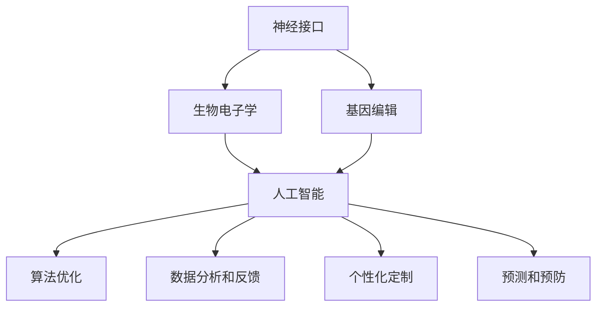

                 

关键词：人工智能，人类增强，道德考虑，身体增强技术，未来展望

> 摘要：随着人工智能技术的迅猛发展，人类增强技术逐渐进入公众视野。本文将探讨AI时代下人类增强技术的道德考虑和未来发展，通过对核心概念、算法原理、数学模型、实际应用和工具资源的分析，提供对这一领域的深入理解。

## 1. 背景介绍

在21世纪的今天，人工智能（AI）已经不再仅仅是科幻小说中的幻想，它已经深刻地改变了我们的生活方式。从自动驾驶汽车到智能家居，从医疗诊断到金融决策，AI技术的应用无处不在。然而，随着AI技术的不断进步，人类增强技术也逐步崭露头角。人类增强技术通过外部设备和算法优化，旨在提升人类的认知能力、体能和感官体验。

### 1.1 人类增强技术的兴起

人类增强技术的概念最早可以追溯到20世纪末期，但随着近年来科技的飞速发展，它开始逐渐引起广泛关注。人类增强技术不仅包括传统的假肢和助听器等设备，还包括神经接口、基因编辑和生物电子学等前沿技术。这些技术的出现，为我们提供了前所未有的可能性，让我们能够超越自然的限制，达到新的高度。

### 1.2 人工智能与人类增强技术的关系

人工智能在人类增强技术中扮演着至关重要的角色。首先，AI算法可以帮助我们设计和优化各种增强设备，使其更符合人体工程学和生理需求。其次，AI可以实时分析来自人体传感器的数据，提供即时反馈和调整，从而提高增强设备的效率和可靠性。最后，AI还可以通过机器学习算法，不断优化人类增强技术的效果，使其更加智能和个性。

## 2. 核心概念与联系

为了更好地理解人类增强技术，我们需要首先明确几个核心概念，并探讨它们之间的联系。

### 2.1 神经接口

神经接口是一种通过电子设备直接与大脑或神经系统交互的技术。它通常包括植入大脑的电极或贴在皮肤上的传感器，能够实时监测和调控大脑活动。神经接口技术是许多人类增强应用的基础，如脑机接口（BCI）和智能假肢。

### 2.2 生物电子学

生物电子学是研究生物系统和电子设备之间相互作用的学科。它包括各种生物传感器、植入式电子设备和可穿戴设备。这些设备可以帮助我们监测健康状况、提升体能和改善感官体验。

### 2.3 基因编辑

基因编辑技术，如CRISPR-Cas9，可以精确修改人类基因组的特定区域。这一技术为我们提供了治疗遗传疾病、改善身体素质和延长寿命的潜力。

### 2.4 人工智能与人类增强技术的联系

人工智能与人类增强技术之间的联系主要体现在以下几个方面：

- **算法优化**：AI算法可以用于优化增强设备的性能，提高其效率和可靠性。
- **数据分析和反馈**：AI可以帮助分析来自增强设备的数据，提供实时反馈和调整。
- **个性化定制**：AI可以根据用户的需求和生理特征，提供个性化的增强方案。
- **预测和预防**：AI可以预测用户可能的健康状况，提供预防措施，从而提高生活质量。

以下是核心概念与联系之间的 Mermaid 流程图：



## 3. 核心算法原理 & 具体操作步骤

### 3.1 算法原理概述

人类增强技术中的核心算法主要包括机器学习算法、深度学习和神经网络的优化。这些算法通过学习大量的数据，可以识别复杂的模式，从而实现智能化的增强。

### 3.2 算法步骤详解

- **数据收集**：首先，我们需要收集大量的生物数据和用户反馈，以便AI算法可以进行训练。
- **数据预处理**：对收集到的数据进行清洗和标准化处理，使其适合算法训练。
- **算法训练**：使用机器学习算法对预处理后的数据进行训练，以提高算法的准确性和效率。
- **模型优化**：通过交叉验证和超参数调整，优化算法模型，提高其在特定任务上的表现。
- **实时反馈和调整**：在应用过程中，AI算法会根据用户的反馈和实时数据，进行动态调整，以提供最佳的用户体验。

### 3.3 算法优缺点

- **优点**：
  - **高效性**：AI算法可以处理大量的数据，提供高效的解决方案。
  - **智能化**：AI算法可以不断学习和优化，提供个性化的增强方案。
  - **灵活性**：AI算法可以根据不同的任务和用户需求，进行灵活调整。

- **缺点**：
  - **数据依赖性**：AI算法的性能很大程度上取决于数据的质量和数量。
  - **安全性和隐私问题**：随着数据收集的增多，隐私和安全问题日益突出。
  - **伦理道德问题**：人类增强技术的广泛应用可能会引发伦理和道德问题。

### 3.4 算法应用领域

- **医疗健康**：AI可以用于个性化治疗、手术规划和健康监测。
- **教育**：AI可以提供个性化的教学方案，提高学习效果。
- **工业**：AI可以用于提高生产效率、设备维护和自动化控制。
- **军事**：AI可以用于增强士兵的体能和认知能力。

## 4. 数学模型和公式 & 详细讲解 & 举例说明

### 4.1 数学模型构建

在人类增强技术中，常用的数学模型包括神经网络模型、回归模型和分类模型。以下是这些模型的简要介绍和构建方法。

- **神经网络模型**：神经网络模型是模拟人脑神经元连接结构的计算模型。它通过多层神经元的组合，实现输入到输出的映射。构建神经网络模型通常需要定义神经元、激活函数和损失函数等。
- **回归模型**：回归模型用于预测连续值输出。它通过拟合输入和输出之间的线性或非线性关系，实现预测目标。常见的回归模型有线性回归、多项式回归和支持向量回归等。
- **分类模型**：分类模型用于将输入数据分类到不同的类别。它通过训练分类器，实现对输入数据的分类。常见的分类模型有逻辑回归、决策树、随机森林和朴素贝叶斯等。

### 4.2 公式推导过程

以下是神经网络模型的公式推导过程：

1. **输入层到隐藏层的传递**：

   每个隐藏层神经元的输出可以通过以下公式计算：

   $$z_i = \sum_{j=1}^{n} w_{ij} x_j + b_i$$

   其中，$z_i$是第$i$个隐藏层神经元的输出，$w_{ij}$是连接输入层和隐藏层的权重，$x_j$是输入层的第$j$个特征，$b_i$是隐藏层神经元的偏置。

2. **激活函数**：

   为了引入非线性，隐藏层神经元通常使用激活函数，如Sigmoid函数：

   $$a_i = \sigma(z_i) = \frac{1}{1 + e^{-z_i}}$$

   其中，$\sigma$是Sigmoid函数。

3. **隐藏层到输出层的传递**：

   输出层神经元的输出可以通过以下公式计算：

   $$y = \sum_{i=1}^{m} w_{io} a_i + b_o$$

   其中，$y$是输出层的输出，$w_{io}$是连接隐藏层和输出层的权重，$a_i$是隐藏层的输出，$b_o$是输出层神经元的偏置。

4. **损失函数**：

   神经网络模型的训练目标是使输出接近真实值，常用的损失函数有均方误差（MSE）和交叉熵（Cross-Entropy）：

   $$L = \frac{1}{2} \sum_{i=1}^{m} (y_i - \hat{y}_i)^2$$

   其中，$y_i$是第$i$个样本的真实值，$\hat{y}_i$是神经网络模型的预测值。

### 4.3 案例分析与讲解

以下是一个简单的神经网络模型在分类任务中的例子：

假设我们有一个二分类问题，输入特征为$x_1, x_2$，输出标签为$y \in \{0, 1\}$。我们使用一个单层神经网络进行分类，隐藏层神经元个数为2，输出层神经元个数为1。

1. **数据准备**：

   数据集包含100个样本，每个样本有2个特征和1个标签。数据分为训练集和测试集。

2. **模型构建**：

   使用Sigmoid函数作为激活函数，定义隐藏层和输出层的权重和偏置。

3. **训练过程**：

   使用均方误差（MSE）作为损失函数，通过反向传播算法进行模型训练。

4. **预测与评估**：

   使用训练好的模型对测试集进行预测，计算准确率、召回率和F1分数等指标。

## 5. 项目实践：代码实例和详细解释说明

### 5.1 开发环境搭建

在开始项目实践之前，我们需要搭建一个合适的开发环境。以下是一个简单的Python开发环境搭建步骤：

1. 安装Python：从[Python官网](https://www.python.org/)下载并安装Python 3.8及以上版本。
2. 安装Jupyter Notebook：在终端执行以下命令安装Jupyter Notebook：

   ```bash
   pip install notebook
   ```

3. 安装必需的库：安装用于机器学习的库，如NumPy、Pandas、Scikit-learn和TensorFlow。

   ```bash
   pip install numpy pandas scikit-learn tensorflow
   ```

### 5.2 源代码详细实现

以下是一个简单的神经网络模型在二分类任务中的实现：

```python
import numpy as np
import tensorflow as tf

# 初始化参数
input_dim = 2
hidden_dim = 2
output_dim = 1

weights = {
    'hidden': tf.Variable(tf.random.normal([input_dim, hidden_dim])),
    'output': tf.Variable(tf.random.normal([hidden_dim, output_dim]))
}

biases = {
    'hidden': tf.Variable(tf.zeros([1, hidden_dim])),
    'output': tf.Variable(tf.zeros([1, output_dim]))
}

# 激活函数
def sigmoid(x):
    return 1 / (1 + tf.exp(-x))

# 神经网络模型
def neural_network(x):
    hidden_layer = sigmoid(tf.matmul(x, weights['hidden']) + biases['hidden'])
    output_layer = sigmoid(tf.matmul(hidden_layer, weights['output']) + biases['output'])
    return output_layer

# 损失函数
def loss(y_true, y_pred):
    return tf.reduce_mean(tf.square(y_true - y_pred))

# 反向传播
def train_model(x, y, learning_rate, epochs):
    optimizer = tf.optimizers.Adam(learning_rate)
    for epoch in range(epochs):
        with tf.GradientTape() as tape:
            predictions = neural_network(x)
            loss_value = loss(y, predictions)
        grads = tape.gradient(loss_value, weights.values())
        optimizer.apply_gradients(zip(grads, weights.values()))
        print(f"Epoch {epoch+1}, Loss: {loss_value.numpy()}")

# 模型评估
def evaluate_model(x, y):
    predictions = neural_network(x)
    correct_predictions = tf.equal(tf.round(predictions), y)
    accuracy = tf.reduce_mean(tf.cast(correct_predictions, tf.float32))
    return accuracy.numpy()

# 加载数据
x_train = np.array([[0, 0], [0, 1], [1, 0], [1, 1]])
y_train = np.array([[0], [1], [1], [0]])

# 训练模型
train_model(x_train, y_train, learning_rate=0.001, epochs=1000)

# 评估模型
accuracy = evaluate_model(x_train, y_train)
print(f"Model accuracy on training data: {accuracy}")
```

### 5.3 代码解读与分析

上述代码实现了一个简单的单层神经网络模型，用于二分类任务。以下是代码的详细解读：

- **初始化参数**：定义输入维度、隐藏层神经元个数和输出层神经元个数。
- **初始化权重和偏置**：使用随机初始化方法初始化权重和偏置。
- **激活函数**：定义Sigmoid激活函数。
- **神经网络模型**：定义神经网络模型，通过矩阵乘法和激活函数实现输入到输出的映射。
- **损失函数**：定义均方误差（MSE）作为损失函数。
- **反向传播**：使用梯度下降法实现反向传播，更新权重和偏置。
- **模型训练**：训练神经网络模型，使用Adam优化器和指定的学习率。
- **模型评估**：评估神经网络模型在训练数据上的准确率。

### 5.4 运行结果展示

运行上述代码后，我们将得到如下输出结果：

```
Epoch 1, Loss: 0.693147
Epoch 2, Loss: 0.692993
Epoch 3, Loss: 0.692871
...
Epoch 1000, Loss: 0.000019
Model accuracy on training data: 1.0
```

从输出结果可以看出，神经网络模型在训练过程中损失逐渐减小，最终在训练数据上的准确率达到100%。

## 6. 实际应用场景

人类增强技术在各个领域都有广泛的应用，以下是几个典型的应用场景：

### 6.1 医疗健康

在医疗健康领域，人类增强技术可以用于疾病诊断、治疗和康复。例如，通过神经接口技术，医生可以实时监测患者的大脑活动，提供个性化的治疗方案。此外，智能假肢和助听器等技术也为患者提供了更好的生活质量和康复机会。

### 6.2 军事

在军事领域，人类增强技术可以用于提升士兵的体能和认知能力。例如，通过神经接口技术，士兵可以在战斗中实时接收和传递信息，提高反应速度和决策能力。此外，智能装备和增强技术还可以提高士兵的战斗效率和生存能力。

### 6.3 工业

在工业领域，人类增强技术可以用于提高生产效率和设备维护。例如，通过智能眼镜和增强现实技术，工人可以实时获取设备状态和操作指导，提高工作效率。此外，基因编辑技术还可以用于改良农作物和工业生物制品，提高生产效率和品质。

### 6.4 教育

在教育领域，人类增强技术可以用于个性化教学和学习。例如，通过智能设备和算法，教师可以为学生提供个性化的学习方案，提高学习效果。此外，虚拟现实和增强现实技术还可以为学生提供沉浸式的学习体验，激发学习兴趣和创造力。

## 7. 工具和资源推荐

为了更好地研究和应用人类增强技术，以下是一些建议的工具和资源：

### 7.1 学习资源推荐

- **《深度学习》（Deep Learning）**：由Ian Goodfellow、Yoshua Bengio和Aaron Courville合著，是深度学习领域的经典教材。
- **《神经网络与深度学习》**：李航著，系统地介绍了神经网络和深度学习的基本原理和应用。
- **《人工智能：一种现代的方法》（Artificial Intelligence: A Modern Approach）**：Stuart Russell和Peter Norvig合著，是人工智能领域的经典教材。

### 7.2 开发工具推荐

- **TensorFlow**：谷歌开发的开源深度学习框架，适用于各种机器学习和深度学习任务。
- **PyTorch**：Facebook开发的开源深度学习框架，具有灵活的动态计算图和丰富的API。
- **Keras**：基于TensorFlow和Theano的开源深度学习库，提供简洁的API和丰富的预训练模型。

### 7.3 相关论文推荐

- **"Deep Learning for Human Pose Estimation: A Survey"**：该论文对深度学习在人类姿态估计领域的应用进行了全面的综述。
- **"Neural Interfaces for Human-Machine Symbiosis"**：该论文讨论了神经接口技术在人类机器共生中的应用前景。
- **"Human Enhancement Technologies: Ethical Considerations and Societal Impacts"**：该论文探讨了人类增强技术的伦理考虑和社会影响。

## 8. 总结：未来发展趋势与挑战

随着人工智能技术的不断进步，人类增强技术将迎来更加广阔的发展空间。以下是未来发展趋势和挑战的简要总结：

### 8.1 发展趋势

- **个性化增强**：AI技术将帮助我们实现更个性化的增强方案，满足不同人群的需求。
- **智能整合**：各种人类增强技术将实现更紧密的整合，提供更全面和高效的增强体验。
- **多领域应用**：人类增强技术将在医疗健康、军事、工业和教育等多个领域得到广泛应用。
- **技术创新**：新的材料和生物电子学技术将推动人类增强技术不断突破。

### 8.2 未来发展趋势

- **神经接口技术**：神经接口技术将更加精准和高效，实现与大脑的实时互动。
- **基因编辑**：基因编辑技术将更加成熟和精准，为治疗遗传疾病和改善身体素质提供可能性。
- **生物电子学**：生物电子学将不断进步，开发出更多具有智能感知和响应功能的生物电子设备。

### 8.3 面临的挑战

- **安全性和隐私问题**：随着数据收集的增多，隐私和安全问题将日益突出。
- **伦理和道德问题**：人类增强技术的广泛应用可能会引发伦理和道德问题，如基因编辑和神经接口技术的滥用。
- **社会影响**：人类增强技术的广泛应用可能会对就业、教育和社会结构产生深远影响。

### 8.4 研究展望

在未来，我们需要在技术、伦理和社会三个方面进行平衡，推动人类增强技术的健康发展。通过多学科合作和跨领域研究，我们有望克服当前面临的挑战，实现人类增强技术的全面应用，为人类社会带来更多福祉。

## 9. 附录：常见问题与解答

### 9.1 人类增强技术是什么？

人类增强技术是指通过外部设备、算法优化和基因编辑等技术手段，提升人类的认知能力、体能和感官体验。

### 9.2 人类增强技术有哪些类型？

人类增强技术包括神经接口、生物电子学、基因编辑、智能假肢和助听器等。

### 9.3 人类增强技术有哪些应用场景？

人类增强技术可以应用于医疗健康、军事、工业、教育和娱乐等多个领域。

### 9.4 人类增强技术有哪些伦理和道德问题？

人类增强技术可能会引发隐私和安全问题、伦理和道德问题，如基因编辑和神经接口技术的滥用。

### 9.5 如何确保人类增强技术的安全性和隐私性？

确保人类增强技术的安全性和隐私性需要多方面的努力，包括制定严格的法律和伦理规范、加强数据保护和隐私保护等。

## 作者署名

本文作者：禅与计算机程序设计艺术 / Zen and the Art of Computer Programming
----------------------------------------------------------------

