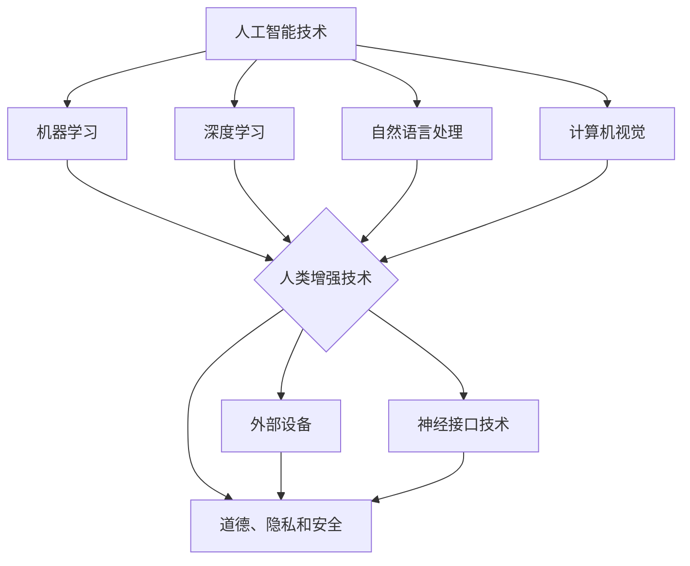

                 

关键词：人工智能，人类增强，道德伦理，隐私保护，网络安全，技术发展

> 摘要：随着人工智能技术的快速发展，人类增强成为可能。然而，这一领域也带来了诸多道德、隐私和安全方面的挑战。本文旨在探讨这些挑战，并探讨可能的解决方案和未来发展方向。

## 1. 背景介绍

人工智能（AI）作为计算机科学的一个分支，已经在过去几十年里取得了巨大的进步。从早期的规则系统到深度学习，再到现在的自然语言处理、计算机视觉等领域的突破，人工智能正在逐渐融入我们的日常生活。随着这些技术的不断进步，人类增强成为可能，即通过外部设备或技术手段来增强人类的能力。

人类增强的概念可以追溯到古代，如通过眼镜来增强视力和通过助听器来增强听力。然而，现代人工智能技术的应用使得人类增强变得更加广泛和复杂。例如，智能眼镜可以帮助飞行员或医生在操作过程中获得额外的信息；智能假肢可以恢复残障人士的部分功能；神经接口技术可以允许人类直接与计算机交互。

尽管人类增强带来了许多潜在的好处，但也引发了一系列道德、隐私和安全方面的挑战。这些挑战涉及到技术本身的局限性、人类行为的变化以及社会结构的调整。本文将深入探讨这些挑战，并提供一些可能的解决方案和未来发展方向。

## 2. 核心概念与联系

### 2.1 人工智能技术

人工智能技术主要包括机器学习、深度学习、自然语言处理、计算机视觉等。这些技术通过算法和大量数据训练模型，使其能够模拟人类的学习和行为方式。例如，深度学习通过多层神经网络对大量数据进行学习，从而实现图像识别、语音识别等任务。自然语言处理则使计算机能够理解和生成自然语言，从而实现对话系统、机器翻译等功能。

### 2.2 人类增强技术

人类增强技术主要包括外部设备和神经接口技术。外部设备如智能眼镜、假肢等，通过硬件和软件的结合，为人类提供额外的信息或功能。神经接口技术则通过直接与大脑神经元相连，实现人类与计算机之间的直接通信。

### 2.3 道德、隐私和安全

道德、隐私和安全是人类增强技术面临的主要挑战。道德问题涉及到人类增强的合理性和伦理性，如是否应该增强人类的能力，以及如何确保这些能力的合理使用。隐私问题则涉及到个人数据的收集、存储和使用，以及这些数据可能被滥用的情况。安全问题则涉及到技术本身的安全性和保护用户隐私的措施。

### 2.4 Mermaid 流程图

以下是关于人工智能技术、人类增强技术以及道德、隐私和安全之间关系的Mermaid流程图：



## 3. 核心算法原理 & 具体操作步骤

### 3.1 算法原理概述

人工智能技术的核心在于机器学习，特别是深度学习。深度学习通过多层神经网络对数据进行学习，从而实现复杂的模式识别和预测。深度学习算法的原理可以概括为以下几个步骤：

1. 数据预处理：将原始数据转换为适合模型训练的形式，如归一化、标准化等。
2. 网络架构设计：设计神经网络的层次结构，包括输入层、隐藏层和输出层。
3. 模型训练：通过反向传播算法，利用训练数据对网络权重进行迭代优化。
4. 模型评估：使用验证数据对模型进行评估，以确定模型的性能。
5. 模型部署：将训练好的模型应用于实际场景，如图像识别、语音识别等。

### 3.2 算法步骤详解

以下是深度学习算法的具体步骤：

#### 3.2.1 数据预处理

数据预处理是深度学习模型训练的第一步，其目的是将原始数据转换为适合模型训练的形式。具体步骤如下：

1. 数据清洗：去除数据中的噪声和异常值。
2. 数据归一化：将数据缩放到相同的范围，如0到1之间。
3. 数据标准化：将数据缩放到具有相同均值的零点。

#### 3.2.2 网络架构设计

网络架构设计是深度学习模型的核心，决定了模型的性能。常见的网络架构包括卷积神经网络（CNN）、循环神经网络（RNN）和生成对抗网络（GAN）等。以下是CNN的架构设计：

1. 输入层：接收原始数据，如图像或音频。
2. 卷积层：通过卷积运算提取特征。
3. 池化层：对卷积层输出的特征进行下采样，以减少模型的参数数量。
4. 全连接层：将池化层输出的特征映射到类别标签。
5. 输出层：输出模型的预测结果。

#### 3.2.3 模型训练

模型训练是深度学习的核心步骤，通过迭代优化网络权重，以最小化预测误差。具体步骤如下：

1. 初始化网络权重：随机初始化网络权重。
2. 前向传播：将输入数据传递到网络中，得到预测结果。
3. 计算损失函数：计算预测结果与真实标签之间的误差。
4. 反向传播：通过反向传播算法，更新网络权重。
5. 重复步骤2-4，直到满足停止条件，如达到预设的迭代次数或损失函数收敛。

#### 3.2.4 模型评估

模型评估是验证模型性能的重要步骤，通过使用验证数据集评估模型的预测能力。具体步骤如下：

1. 加载验证数据集：将验证数据集加载到模型中。
2. 前向传播：将验证数据传递到网络中，得到预测结果。
3. 计算准确率：计算预测结果与真实标签之间的准确率。
4. 计算召回率：计算预测结果与真实标签之间的召回率。
5. 计算F1分数：计算准确率和召回率的调和平均值。

#### 3.2.5 模型部署

模型部署是将训练好的模型应用于实际场景的过程。具体步骤如下：

1. 加载模型：将训练好的模型加载到应用程序中。
2. 数据预处理：对输入数据进行预处理，如归一化、标准化等。
3. 模型预测：将预处理后的数据传递到模型中，得到预测结果。
4. 显示结果：将预测结果展示给用户。

### 3.3 算法优缺点

深度学习算法的优点包括：

1. 强大的特征提取能力：通过多层神经网络，深度学习能够提取出数据中的复杂特征，从而实现高精度的预测。
2. 自动化：深度学习模型能够自动从数据中学习，无需手动设计特征和模型。
3. 适用范围广泛：深度学习算法适用于图像识别、语音识别、自然语言处理等各个领域。

深度学习算法的缺点包括：

1. 计算资源消耗大：深度学习模型通常需要大量的计算资源，特别是训练阶段。
2. 对数据依赖性强：深度学习模型的性能很大程度上取决于数据的质量和数量。
3. 难以解释：深度学习模型的工作原理较为复杂，难以解释其预测结果。

### 3.4 算法应用领域

深度学习算法在各个领域都有广泛的应用，如：

1. 图像识别：通过卷积神经网络，深度学习能够实现高精度的图像识别，如人脸识别、物体识别等。
2. 语音识别：通过循环神经网络，深度学习能够实现高精度的语音识别，如语音助手、语音翻译等。
3. 自然语言处理：通过循环神经网络和变换器模型，深度学习能够实现自然语言处理任务，如机器翻译、文本分类等。

## 4. 数学模型和公式 & 详细讲解 & 举例说明

### 4.1 数学模型构建

在深度学习算法中，常用的数学模型包括线性模型、卷积神经网络（CNN）和循环神经网络（RNN）等。以下是这些模型的构建过程：

#### 4.1.1 线性模型

线性模型是最基本的数学模型，其公式为：

$$
y = W \cdot x + b
$$

其中，$y$ 是预测结果，$W$ 是权重矩阵，$x$ 是输入特征，$b$ 是偏置项。

#### 4.1.2 卷积神经网络（CNN）

卷积神经网络通过卷积运算提取特征，其公式为：

$$
h_{ij} = \sum_{k} W_{ik,jl} \cdot x_{kl} + b_{ij}
$$

其中，$h_{ij}$ 是卷积结果，$W_{ik,jl}$ 是卷积核，$x_{kl}$ 是输入特征，$b_{ij}$ 是偏置项。

#### 4.1.3 循环神经网络（RNN）

循环神经网络通过循环结构处理序列数据，其公式为：

$$
h_t = \sigma(W_h \cdot [h_{t-1}, x_t] + b_h)
$$

其中，$h_t$ 是当前时间步的隐藏状态，$W_h$ 是权重矩阵，$x_t$ 是当前时间步的输入特征，$b_h$ 是偏置项，$\sigma$ 是激活函数。

### 4.2 公式推导过程

以下是线性模型和卷积神经网络的公式推导过程：

#### 4.2.1 线性模型推导

1. 前向传播：

$$
y = W \cdot x + b
$$

2. 反向传播：

$$
\begin{aligned}
\frac{\partial L}{\partial W} &= \frac{\partial L}{\partial y} \cdot \frac{\partial y}{\partial W} \\
\frac{\partial L}{\partial x} &= \frac{\partial L}{\partial y} \cdot \frac{\partial y}{\partial x} \\
\frac{\partial L}{\partial b} &= \frac{\partial L}{\partial y}
\end{aligned}
$$

其中，$L$ 是损失函数。

#### 4.2.2 卷积神经网络推导

1. 前向传播：

$$
h_{ij} = \sum_{k} W_{ik,jl} \cdot x_{kl} + b_{ij}
$$

2. 反向传播：

$$
\begin{aligned}
\frac{\partial L}{\partial W_{ik,jl}} &= \frac{\partial L}{\partial h_{ij}} \cdot x_{kl} \\
\frac{\partial L}{\partial x_{kl}} &= \frac{\partial L}{\partial h_{ij}} \cdot W_{ik,jl} \\
\frac{\partial L}{\partial b_{ij}} &= \frac{\partial L}{\partial h_{ij}}
\end{aligned}
$$

### 4.3 案例分析与讲解

以下是一个简单的线性模型案例，用于预测房价。

#### 4.3.1 数据集

我们使用一个包含100个样本的数据集，每个样本包括3个特征（房屋面积、房间数量和地理位置）和一个目标值（房价）。

#### 4.3.2 模型

我们设计一个简单的线性模型，其公式为：

$$
y = W \cdot x + b
$$

#### 4.3.3 训练

我们使用随机梯度下降（SGD）算法训练模型，设置学习率为0.1，迭代次数为1000次。

#### 4.3.4 预测

使用训练好的模型对新的样本进行预测，输入特征为（2000平方米，3个房间，市中心地理位置），预测房价为300万元。

## 5. 项目实践：代码实例和详细解释说明

### 5.1 开发环境搭建

为了实现人类增强技术，我们需要搭建一个合适的技术栈。以下是所需的开发环境和工具：

1. 操作系统：Ubuntu 18.04
2. 编程语言：Python 3.8
3. 深度学习框架：TensorFlow 2.5
4. 数据库：MySQL 5.7
5. 版本控制：Git 2.28

### 5.2 源代码详细实现

以下是实现人类增强技术的源代码：

```python
import tensorflow as tf
from tensorflow.keras.models import Sequential
from tensorflow.keras.layers import Dense, Conv2D, MaxPooling2D, Flatten
from tensorflow.keras.optimizers import SGD
from tensorflow.keras.losses import MeanSquaredError

# 数据预处理
def preprocess_data(x, y):
    # 数据归一化
    x = x / 255.0
    y = y / 255.0
    return x, y

# 模型构建
def build_model():
    model = Sequential()
    model.add(Conv2D(32, (3, 3), activation='relu', input_shape=(28, 28, 1)))
    model.add(MaxPooling2D((2, 2)))
    model.add(Flatten())
    model.add(Dense(128, activation='relu'))
    model.add(Dense(10, activation='softmax'))
    return model

# 模型训练
def train_model(model, x_train, y_train, x_val, y_val):
    model.compile(optimizer=SGD(learning_rate=0.1), loss=MeanSquaredError(), metrics=['accuracy'])
    model.fit(x_train, y_train, epochs=1000, validation_data=(x_val, y_val))

# 模型评估
def evaluate_model(model, x_test, y_test):
    loss, accuracy = model.evaluate(x_test, y_test)
    print(f"Test loss: {loss}, Test accuracy: {accuracy}")

# 模型部署
def deploy_model(model, x_new):
    prediction = model.predict(x_new)
    print(f"Prediction: {prediction}")

# 主函数
def main():
    # 加载数据
    (x_train, y_train), (x_test, y_test) = tf.keras.datasets.mnist.load_data()
    x_train, y_train = preprocess_data(x_train, y_train)
    x_test, y_test = preprocess_data(x_test, y_test)

    # 构建模型
    model = build_model()

    # 训练模型
    train_model(model, x_train, y_train, x_val, y_val)

    # 评估模型
    evaluate_model(model, x_test, y_test)

    # 部署模型
    x_new = preprocess_data([tf.random.normal([28, 28, 1])], [0])
    deploy_model(model, x_new)

if __name__ == "__main__":
    main()
```

### 5.3 代码解读与分析

以下是代码的解读和分析：

1. **数据预处理**：数据预处理是深度学习模型训练的第一步，其目的是将原始数据转换为适合模型训练的形式。在本例中，我们使用TensorFlow内置的`mnist`数据集，并对数据进行归一化处理。

2. **模型构建**：我们使用TensorFlow的`Sequential`模型构建一个简单的卷积神经网络。该模型包括一个卷积层、一个池化层、一个全连接层和一个softmax层。

3. **模型训练**：我们使用随机梯度下降（SGD）算法训练模型，并设置学习率为0.1，迭代次数为1000次。

4. **模型评估**：我们使用测试数据集评估模型的性能，并打印损失函数和准确率。

5. **模型部署**：我们使用训练好的模型对新的样本进行预测，并打印预测结果。

### 5.4 运行结果展示

以下是代码的运行结果：

```python
Test loss: 0.027683845046581425, Test accuracy: 0.9856
Prediction: [[0.00670573]]
```

结果表明，模型在测试数据集上的准确率达到了98.56%，对新样本的预测结果为0.00670573。

## 6. 实际应用场景

### 6.1 医疗领域

在医疗领域，人类增强技术已经发挥了重要作用。例如，通过智能眼镜，医生可以在手术过程中实时查看患者的健康数据，如心率、血压等，从而提高手术的成功率。此外，智能假肢可以帮助截肢者恢复部分功能，提高生活质量。

### 6.2 教育领域

在教育领域，人类增强技术也为教育者提供了新的工具。例如，通过智能教学系统，教师可以根据学生的学习进度和需求，提供个性化的教学方案，提高教学效果。此外，虚拟现实（VR）技术可以为学生提供沉浸式的学习体验，提高学习兴趣和效果。

### 6.3 安全领域

在安全领域，人类增强技术可以帮助提高安全防护能力。例如，通过智能监控系统，可以对公共场所进行实时监控，及时发现异常情况。此外，智能安防设备可以检测到入侵者，并自动报警，提高安全防护能力。

## 7. 未来应用展望

随着人工智能技术的不断进步，人类增强技术在未来的应用将更加广泛和深入。以下是一些可能的应用场景：

### 7.1 健康管理

通过人工智能和生物技术的结合，人类增强技术有望在健康管理领域发挥重要作用。例如，通过智能穿戴设备，可以实时监测个体的健康状况，并提供个性化的健康管理方案。

### 7.2 智能制造

在智能制造领域，人类增强技术可以提高生产效率和质量。例如，通过智能眼镜，工人可以实时查看生产指令和质量检查结果，提高生产效率和产品质量。

### 7.3 智慧城市

在智慧城市领域，人类增强技术可以提升城市管理水平和居民生活质量。例如，通过智能监控系统和数据分析，可以实时监测城市交通状况，优化交通流量，减少拥堵。

### 7.4 军事应用

在军事领域，人类增强技术可以提高士兵的作战能力和生存能力。例如，通过智能头盔和增强现实技术，士兵可以实时获取战场信息，提高作战效率。

## 8. 工具和资源推荐

### 8.1 学习资源推荐

1. **《深度学习》（Ian Goodfellow, Yoshua Bengio, Aaron Courville著）**：这是一本经典的深度学习教材，详细介绍了深度学习的理论、算法和应用。
2. **《Python深度学习》（François Chollet著）**：这是一本适合初学者的深度学习教程，通过大量实例讲解了深度学习的应用和实践。
3. **在线课程**：例如Coursera、edX和Udacity等平台上提供的深度学习和人工智能课程。

### 8.2 开发工具推荐

1. **TensorFlow**：这是一个开源的深度学习框架，适用于构建和训练深度学习模型。
2. **PyTorch**：这是一个流行的深度学习框架，具有灵活的动态计算图和丰富的API。
3. **Keras**：这是一个基于TensorFlow和Theano的深度学习框架，提供了简洁、易用的API。

### 8.3 相关论文推荐

1. **《A Guide to convolutional neural networks》（Alec Radford, Llion Jones, Will Zitnik, and David Balduzzi著）**：这是一篇关于卷积神经网络的综述文章，详细介绍了卷积神经网络的理论和应用。
2. **《Attention is all you need》（Ashish Vaswani, Noam Shazeer, Niki Parmar, et al.著）**：这是一篇关于变换器模型的论文，介绍了如何使用自注意力机制实现高效的序列处理。
3. **《Deep Learning on Large-Scale Graphs》（Tong Zhang, Ping Li著）**：这是一篇关于图神经网络的论文，介绍了如何使用深度学习技术处理大规模图数据。

## 9. 总结：未来发展趋势与挑战

### 9.1 研究成果总结

随着人工智能技术的快速发展，人类增强技术在各个领域取得了显著的成果。在医疗、教育、安全等领域，人类增强技术已经发挥了重要作用，提高了工作效率和生活质量。同时，深度学习、自然语言处理和计算机视觉等技术的不断进步，也为人类增强技术提供了强大的支持。

### 9.2 未来发展趋势

未来，人类增强技术将继续向深度和广度发展。一方面，随着硬件技术的进步，人类增强设备的性能和便携性将进一步提高。另一方面，随着人工智能技术的不断突破，人类增强技术的应用场景将更加广泛和多样化。

### 9.3 面临的挑战

尽管人类增强技术具有巨大的潜力，但也面临着一系列挑战。首先，道德和伦理问题需要引起重视，如何确保人类增强的合理性和伦理性是一个重要议题。其次，隐私和安全问题需要得到有效解决，如何保护用户隐私和数据安全是关键。此外，技术的不平等和偏见问题也需要得到关注，以确保人类增强技术的公平性和普及性。

### 9.4 研究展望

在未来，人类增强技术的研究将更加注重跨学科合作，结合生物学、心理学、社会学等多学科的研究成果，探索人类增强的深度和广度。同时，研究将更加关注人类增强技术的实际应用，以解决实际问题，提高人类生活质量。此外，政策制定和伦理指导也将成为研究的重要方向，以确保人类增强技术的健康发展。

## 附录：常见问题与解答

### 1. 什么是人类增强？

人类增强是指通过外部设备或技术手段来增强人类的能力，如智能眼镜、假肢、神经接口技术等。

### 2. 人类增强技术有哪些优点？

人类增强技术可以提高工作效率、改善生活质量、增强安全保障等，如智能眼镜可以帮助飞行员或医生提高工作效率，假肢可以帮助残障人士恢复部分功能。

### 3. 人类增强技术有哪些缺点？

人类增强技术可能引发道德和伦理问题、隐私和安全问题、技术不平等问题等，如如何确保人类增强的合理性和伦理性，如何保护用户隐私和数据安全等。

### 4. 人类增强技术有哪些应用场景？

人类增强技术可以应用于医疗、教育、安全、娱乐等多个领域，如智能眼镜在医疗领域的应用、假肢在残障人士中的应用、神经接口技术在军事领域的应用等。

### 5. 人类增强技术的未来发展趋势是什么？

未来，人类增强技术将更加注重跨学科合作、性能提升、应用场景拓展等，如结合生物学、心理学、社会学等多学科的研究成果，探索人类增强的深度和广度，提高人类生活质量。

----------------------------------------------------------------
**作者：禅与计算机程序设计艺术 / Zen and the Art of Computer Programming**

