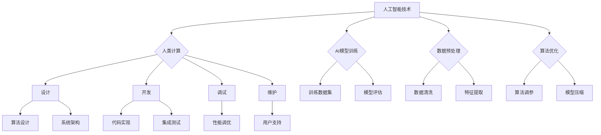

                 

关键词：人工智能、道德边界、未来计算、人类计算、伦理问题

> 摘要：随着人工智能技术的飞速发展，人类计算面临着前所未有的挑战。本文将探讨人工智能在道德边界上的应用，以及未来计算中人类计算的作用与局限，旨在引发对AI时代人类计算道德问题的深思。

## 1. 背景介绍

自20世纪中叶计算机科学诞生以来，人工智能（AI）技术的发展经历了多个阶段。从最初的规则推理、知识表示，到近年的深度学习、自然语言处理，AI已经逐步渗透到人类生活的方方面面。然而，随着AI技术的不断进步，人类计算面临着一系列前所未有的道德和伦理挑战。

首先，AI在决策过程中引入了透明度和可解释性问题。传统的计算机程序具有明确的逻辑和规则，而AI模型通常基于大量的数据和复杂的神经网络。这使得AI决策过程变得高度复杂，甚至对于训练AI的工程师来说也难以完全理解。这种透明度不足可能导致决策结果的不可预测性，甚至引发伦理问题。

其次，AI在伦理和法律方面的应用引发了广泛争议。例如，自动驾驶车辆在紧急情况下如何做出道德决策，AI系统在处理个人数据时如何保护隐私，AI在医疗诊断和药物研发中如何确保公正性和公平性等，这些都是当前亟待解决的伦理和法律问题。

最后，随着AI技术的发展，人类计算的作用也在发生改变。传统的编程和软件开发正逐步被自动化工具所取代，而人类工程师则被要求转向更复杂的领域，如算法设计、系统架构和伦理决策等。这既为人类计算带来了新的机遇，也提出了新的挑战。

## 2. 核心概念与联系

### 2.1 人工智能的定义与分类

人工智能（Artificial Intelligence，简称AI）是指由人制造出来的系统能够展现智能行为的技术。AI可以按照其实现方式分为几种类型：

- **弱AI（Narrow AI）**：也称为专用AI，这类AI在特定任务上表现出人类级别的智能，但无法跨领域应用。例如，语音助手、图像识别系统等。

- **强AI（General AI）**：强AI能够像人类一样在多个领域表现出广泛的智能，具备自我意识和自我学习能力。目前，强AI仍然处于理论阶段，尚未实现。

- **超级智能（Superintelligence）**：超级智能是指远超人类智能的AI，其能力可能超越人类所有领域的专家。这种AI的存在和影响是当前AI研究领域中的热点话题。

### 2.2 道德边界的定义与范畴

道德边界是指在特定情境下，道德决策所应遵循的原则和限制。在AI领域，道德边界涉及到以下几个方面：

- **隐私保护**：AI在处理个人数据时，需要遵守隐私保护原则，确保用户数据的安全和隐私。

- **公平性和公正性**：AI系统在设计和应用过程中，应确保对所有用户公平对待，避免偏见和歧视。

- **责任归属**：当AI系统发生错误或导致不良后果时，如何确定责任归属，是道德边界的一个重要问题。

- **透明度和可解释性**：AI系统的决策过程应具有透明度，用户能够理解和追踪决策过程，以增强信任。

### 2.3 人类计算与AI的关系

人类计算与AI的关系可以概括为互补与合作。人类工程师在AI系统的设计、开发、调试和维护中发挥着至关重要的作用。AI技术的进步不仅减轻了人类在重复性、繁重任务上的负担，也使得人类能够专注于更高层次的创造性工作。然而，AI在处理复杂情境和道德决策时仍然存在局限性，需要人类工程师的参与和指导。

### 2.4 Mermaid 流程图



## 3. 核心算法原理 & 具体操作步骤

### 3.1 算法原理概述

在AI领域，核心算法的原理和操作步骤是实现人工智能应用的基础。以下将介绍几种常见的AI算法及其原理：

- **深度学习**：基于多层神经网络，通过前向传播和反向传播算法进行训练和优化。深度学习在图像识别、自然语言处理等领域取得了显著成果。

- **决策树**：基于特征分割和条件概率，用于分类和回归任务。决策树的构造过程包括特征选择、分割和节点合并等步骤。

- **支持向量机（SVM）**：通过寻找最优超平面来分割数据集，适用于分类问题。SVM的关键步骤包括核函数选择、参数优化等。

- **强化学习**：通过智能体与环境的交互来学习最优策略。强化学习的核心算法包括Q-学习、深度Q网络（DQN）等。

### 3.2 算法步骤详解

以下是上述算法的具体操作步骤：

#### 深度学习

1. **数据预处理**：对原始数据进行归一化、缺失值填充等处理，确保数据质量。

2. **构建神经网络**：定义网络的层次结构，选择合适的激活函数和损失函数。

3. **初始化权重**：随机初始化网络的权重，以避免梯度消失或爆炸问题。

4. **前向传播**：将输入数据通过网络进行计算，得到输出结果。

5. **反向传播**：计算损失函数关于网络参数的梯度，更新网络权重。

6. **模型评估**：使用验证集或测试集对模型进行评估，调整超参数。

7. **模型部署**：将训练好的模型部署到生产环境中，用于实际应用。

#### 决策树

1. **特征选择**：选择对分类最有影响力的特征。

2. **条件概率计算**：计算每个特征的取值条件下，目标变量的概率分布。

3. **分割数据集**：根据特征的条件概率，对数据集进行分割。

4. **节点合并**：选择最优分割点，将相邻的节点合并。

5. **模型评估**：计算模型的准确率、召回率、F1值等指标，优化模型。

#### 支持向量机（SVM）

1. **数据预处理**：对数据进行归一化处理，确保特征具有相似的尺度。

2. **选择核函数**：根据数据特点选择合适的核函数，如线性核、多项式核、径向基函数（RBF）核等。

3. **求解最优超平面**：通过求解二次规划问题，找到最优超平面。

4. **分类决策**：对新的数据点进行分类，根据超平面的位置判断其类别。

5. **模型评估**：计算模型的分类准确率、召回率等指标。

#### 强化学习

1. **环境建模**：建立环境的模型，定义状态空间和动作空间。

2. **初始策略**：初始化智能体的策略，通常采用随机策略或贪婪策略。

3. **策略迭代**：通过试错法，逐步优化智能体的策略。

4. **模型评估**：计算智能体的回报，评估策略的有效性。

5. **模型更新**：根据评估结果，更新智能体的策略。

### 3.3 算法优缺点

- **深度学习**：优点包括强大的表示能力、自动特征提取等；缺点包括对数据量要求较高、训练时间较长等。

- **决策树**：优点包括易于理解、计算效率较高；缺点包括易过拟合、无法处理高维数据等。

- **支持向量机（SVM）**：优点包括理论成熟、分类效果较好；缺点包括对大规模数据集性能不佳、对噪声敏感等。

- **强化学习**：优点包括适用于动态环境、能够学习复杂策略；缺点包括训练过程较慢、对环境建模要求较高等。

### 3.4 算法应用领域

- **深度学习**：广泛应用于图像识别、自然语言处理、语音识别等领域。

- **决策树**：在金融风控、医疗诊断、商业智能等领域有广泛应用。

- **支持向量机（SVM）**：在文本分类、生物信息学、图像分类等领域取得显著成果。

- **强化学习**：在自动驾驶、游戏智能、智能客服等领域具有巨大潜力。

## 4. 数学模型和公式 & 详细讲解 & 举例说明

### 4.1 数学模型构建

在人工智能领域中，数学模型是理解和实现AI算法的核心。以下是几个常见的数学模型及其构建方法：

#### 深度学习模型

深度学习模型通常由多层神经网络组成，其中每层由一系列神经元构成。每个神经元接收来自前一层神经元的输入，并通过一个激活函数产生输出。数学上，可以表示为：

$$
h_{\text{layer}}(x) = \sigma(W_{\text{layer}} \cdot h_{\text{prev}} + b_{\text{layer}})
$$

其中，$h_{\text{layer}}$表示第 $layer$ 层的输出，$x$ 表示输入数据，$\sigma$ 表示激活函数，$W_{\text{layer}}$ 和 $b_{\text{layer}}$ 分别表示权重和偏置。

#### 决策树模型

决策树模型通过递归分割数据集来构建决策树。每个节点代表一个特征，每个分支代表该特征的不同取值。数学上，可以表示为：

$$
I = \sum_{i=1}^{n} \sum_{j=1}^{m} I(y_i, \alpha_j)
$$

其中，$I$ 表示信息增益，$y_i$ 表示第 $i$ 个样本的类别，$\alpha_j$ 表示第 $j$ 个特征的取值。

#### 支持向量机模型

支持向量机通过寻找最优超平面来分割数据集。数学上，可以表示为：

$$
\min_{w, b} \frac{1}{2} ||w||^2 + C \sum_{i=1}^{n} \max(0, 1 - y_i (w \cdot x_i + b))
$$

其中，$w$ 和 $b$ 分别表示权重和偏置，$C$ 表示正则化参数。

#### 强化学习模型

强化学习模型通过奖励机制来指导智能体的行为。数学上，可以表示为：

$$
Q(s, a) = r + \gamma \max_{a'} Q(s', a')
$$

其中，$Q(s, a)$ 表示在状态 $s$ 下采取动作 $a$ 的期望回报，$r$ 表示立即回报，$\gamma$ 表示折扣因子，$s'$ 和 $a'$ 分别表示下一状态和动作。

### 4.2 公式推导过程

以下是对上述数学模型中的公式进行推导：

#### 深度学习模型

1. **前向传播**：

   前向传播过程将输入数据通过神经网络逐层计算，最终得到输出结果。假设输入数据为 $x$，第 $layer$ 层的输出为 $h_{\text{layer}}$，则：

   $$
   h_{\text{layer}}(x) = \sigma(W_{\text{layer}} \cdot h_{\text{prev}} + b_{\text{layer}})
   $$

2. **反向传播**：

   反向传播过程通过计算损失函数关于网络参数的梯度，更新网络权重和偏置。假设损失函数为 $L(h_{\text{layer}}, y)$，则：

   $$
   \frac{\partial L}{\partial W_{\text{layer}}} = \sigma'(h_{\text{layer}}) \cdot (h_{\text{prev}} \cdot \frac{\partial L}{\partial h_{\text{layer}}})
   $$

   $$
   \frac{\partial L}{\partial b_{\text{layer}}} = \sigma'(h_{\text{layer}}) \cdot \frac{\partial L}{\partial h_{\text{layer}}}
   $$

3. **权重更新**：

   通过梯度下降法更新网络权重和偏置：

   $$
   W_{\text{layer}} \leftarrow W_{\text{layer}} - \alpha \cdot \frac{\partial L}{\partial W_{\text{layer}}}
   $$

   $$
   b_{\text{layer}} \leftarrow b_{\text{layer}} - \alpha \cdot \frac{\partial L}{\partial b_{\text{layer}}}
   $$

#### 决策树模型

1. **信息增益**：

   信息增益通过比较不同特征的条件熵来衡量其分类能力。假设特征 $x$ 的取值为 $\alpha_1, \alpha_2, \ldots, \alpha_m$，则：

   $$
   I(x) = -\sum_{j=1}^{m} P(\alpha_j) \cdot \log_2 P(\alpha_j)
   $$

2. **条件熵**：

   条件熵通过比较特征 $x$ 的不同取值下的熵来衡量其分类能力。假设特征 $x$ 的取值为 $\alpha_1, \alpha_2, \ldots, \alpha_m$，类别 $y$ 的取值为 $c_1, c_2, \ldots, c_n$，则：

   $$
   H(Y|X=\alpha_j) = -\sum_{i=1}^{n} P(y_i | \alpha_j) \cdot \log_2 P(y_i | \alpha_j)
   $$

3. **信息增益**：

   信息增益通过比较不同特征的条件熵来衡量其分类能力。假设特征 $x$ 的取值为 $\alpha_1, \alpha_2, \ldots, \alpha_m$，则：

   $$
   I(x) = -\sum_{j=1}^{m} P(\alpha_j) \cdot \sum_{i=1}^{n} P(y_i | \alpha_j) \cdot \log_2 P(y_i | \alpha_j)
   $$

#### 支持向量机模型

1. **支持向量**：

   支持向量是指能够将不同类别的样本分隔开的超平面。假设样本空间为 $\mathbb{R}^d$，则：

   $$
   \text{Support Vectors} = \{x_i | y_i \neq 0\}
   $$

2. **最优超平面**：

   最优超平面是指能够最大化分类间隔的超平面。假设权重为 $w$，偏置为 $b$，则：

   $$
   \text{Optimal Hyperplane} = \{x | w \cdot x + b = 0\}
   $$

3. **分类间隔**：

   分类间隔是指不同类别样本之间的距离。假设样本空间为 $\mathbb{R}^d$，则：

   $$
   \text{Margin} = \frac{2}{||w||}
   $$

### 4.3 案例分析与讲解

以下是一个深度学习模型的案例，通过一个简单的二分类问题来讲解模型的构建和训练过程。

#### 数据集

假设我们有一个包含100个样本的二分类问题，每个样本包含2个特征。数据集的分布如下：

| 类别 | 样本数 |
| ---- | ------ |
| 正类 | 60     |
| 负类 | 40     |

#### 模型构建

我们选择一个简单的单层神经网络，包含一个输入层、一个隐藏层和一个输出层。输入层有2个神经元，隐藏层有3个神经元，输出层有2个神经元。激活函数为ReLU。

$$
h_{\text{hidden}}(x) = \max(0, W_{\text{input-to-hidden}} \cdot x + b_{\text{input-to-hidden}})
$$

$$
h_{\text{output}}(x) = \sigma(W_{\text{hidden-to-output}} \cdot h_{\text{hidden}} + b_{\text{hidden-to-output}})
$$

#### 模型训练

1. **数据预处理**：

   对数据进行归一化处理，确保特征具有相似的尺度。

2. **初始化权重**：

   随机初始化权重和偏置，通常使用高斯分布。

3. **前向传播**：

   将输入数据通过神经网络进行计算，得到输出结果。

   $$
   h_{\text{hidden}}(x) = \max(0, W_{\text{input-to-hidden}} \cdot x + b_{\text{input-to-hidden}})
   $$

   $$
   h_{\text{output}}(x) = \sigma(W_{\text{hidden-to-output}} \cdot h_{\text{hidden}} + b_{\text{hidden-to-output}})
   $$

4. **损失函数**：

   选择交叉熵损失函数来衡量模型的预测误差。

   $$
   L(h_{\text{output}}, y) = -\sum_{i=1}^{n} y_i \cdot \log(h_{\text{output}}(x_i)) + (1 - y_i) \cdot \log(1 - h_{\text{output}}(x_i))
   $$

5. **反向传播**：

   计算损失函数关于网络参数的梯度，更新网络权重和偏置。

   $$
   \frac{\partial L}{\partial W_{\text{input-to-hidden}}} = \sigma'(h_{\text{hidden}}) \cdot (h_{\text{input}} \cdot \frac{\partial L}{\partial h_{\text{output}}})
   $$

   $$
   \frac{\partial L}{\partial b_{\text{input-to-hidden}}} = \sigma'(h_{\text{hidden}}) \cdot \frac{\partial L}{\partial h_{\text{output}}}
   $$

   $$
   \frac{\partial L}{\partial W_{\text{hidden-to-output}}} = \sigma'(h_{\text{output}}) \cdot (h_{\text{hidden}} \cdot \frac{\partial L}{\partial h_{\text{output}}})
   $$

   $$
   \frac{\partial L}{\partial b_{\text{hidden-to-output}}} = \sigma'(h_{\text{output}}) \cdot \frac{\partial L}{\partial h_{\text{output}}}
   $$

6. **模型评估**：

   使用测试集对模型进行评估，计算模型的准确率、召回率等指标。

7. **模型部署**：

   将训练好的模型部署到生产环境中，用于实际应用。

## 5. 项目实践：代码实例和详细解释说明

### 5.1 开发环境搭建

在进行AI项目开发之前，首先需要搭建合适的开发环境。以下是一个基于Python的深度学习项目开发环境的搭建步骤：

1. **安装Python**：下载并安装Python 3.x版本（推荐3.8或更高版本），配置环境变量。

2. **安装Jupyter Notebook**：使用pip安装Jupyter Notebook。

   ```
   pip install notebook
   ```

3. **安装深度学习库**：安装TensorFlow或PyTorch等深度学习库。

   对于TensorFlow：

   ```
   pip install tensorflow
   ```

   对于PyTorch：

   ```
   pip install torch torchvision
   ```

4. **安装其他依赖库**：根据项目需求，安装其他依赖库，如NumPy、Pandas、Matplotlib等。

   ```
   pip install numpy pandas matplotlib
   ```

### 5.2 源代码详细实现

以下是一个简单的深度学习项目示例，使用PyTorch实现一个二分类问题。

```python
import torch
import torch.nn as nn
import torch.optim as optim
from torch.utils.data import DataLoader, TensorDataset
import numpy as np
import pandas as pd
import matplotlib.pyplot as plt

# 数据预处理
def preprocess_data(data_path):
    data = pd.read_csv(data_path)
    X = data.iloc[:, :-1].values
    y = data.iloc[:, -1].values
    X = X.astype(np.float32)
    y = y.astype(np.int64)
    return X, y

# 网络定义
class SimpleNN(nn.Module):
    def __init__(self, input_size, hidden_size, output_size):
        super(SimpleNN, self).__init__()
        self.fc1 = nn.Linear(input_size, hidden_size)
        self.fc2 = nn.Linear(hidden_size, output_size)
    
    def forward(self, x):
        x = torch.relu(self.fc1(x))
        x = self.fc2(x)
        return x

# 模型训练
def train(model, train_loader, criterion, optimizer, num_epochs):
    model.train()
    for epoch in range(num_epochs):
        running_loss = 0.0
        for inputs, targets in train_loader:
            optimizer.zero_grad()
            outputs = model(inputs)
            loss = criterion(outputs, targets)
            loss.backward()
            optimizer.step()
            running_loss += loss.item()
        print(f'Epoch {epoch+1}/{num_epochs}, Loss: {running_loss/len(train_loader)}')

# 模型评估
def evaluate(model, test_loader, criterion):
    model.eval()
    total_loss = 0.0
    with torch.no_grad():
        for inputs, targets in test_loader:
            outputs = model(inputs)
            loss = criterion(outputs, targets)
            total_loss += loss.item()
    return total_loss / len(test_loader)

# 主函数
def main():
    # 数据预处理
    X, y = preprocess_data('data.csv')
    train_size = int(0.8 * len(X))
    test_size = len(X) - train_size
    X_train, X_test = X[:train_size], X[train_size:]
    y_train, y_test = y[:train_size], y[train_size:]
    
    train_dataset = TensorDataset(torch.tensor(X_train, dtype=torch.float32), torch.tensor(y_train, dtype=torch.long))
    test_dataset = TensorDataset(torch.tensor(X_test, dtype=torch.float32), torch.tensor(y_test, dtype=torch.long))
    
    train_loader = DataLoader(train_dataset, batch_size=32, shuffle=True)
    test_loader = DataLoader(test_dataset, batch_size=32, shuffle=False)
    
    # 网络定义
    model = SimpleNN(input_size=2, hidden_size=10, output_size=1)
    
    # 模型训练
    criterion = nn.BCELoss()
    optimizer = optim.Adam(model.parameters(), lr=0.001)
    num_epochs = 100
    train(model, train_loader, criterion, optimizer, num_epochs)
    
    # 模型评估
    test_loss = evaluate(model, test_loader, criterion)
    print(f'Test Loss: {test_loss}')
    
    # 可视化
    with torch.no_grad():
        inputs, targets = next(iter(test_loader))
        outputs = model(inputs)
        predictions = outputs > 0.5
        plt.scatter(inputs[:, 0], inputs[:, 1], c=predictions, cmap='gray', label='Positive')
        plt.scatter(inputs[:, 0], inputs[:, 1], c=targets, cmap='gray', label='Negative')
        plt.xlabel('Feature 1')
        plt.ylabel('Feature 2')
        plt.legend()
        plt.show()

# 运行主函数
if __name__ == '__main__':
    main()
```

### 5.3 代码解读与分析

上述代码实现了一个简单的深度学习项目，包括数据预处理、网络定义、模型训练和模型评估。以下是代码的主要部分及其功能解读：

- **数据预处理**：`preprocess_data`函数负责读取CSV文件，将数据分为特征和标签两部分。然后对特征进行归一化处理，确保特征具有相似的尺度。

- **网络定义**：`SimpleNN`类定义了一个简单的单层神经网络，包含一个输入层、一个隐藏层和一个输出层。激活函数使用ReLU。

- **模型训练**：`train`函数负责训练神经网络。它通过前向传播计算损失，然后通过反向传播更新网络权重和偏置。训练过程中，每次迭代都会计算训练损失并打印。

- **模型评估**：`evaluate`函数负责评估训练好的模型的性能。它通过测试集计算平均损失，并返回结果。

- **主函数**：`main`函数是项目的入口。首先，它调用`preprocess_data`函数对数据进行预处理，然后创建训练集和测试集。接着，定义神经网络、损失函数和优化器。最后，进行模型训练和评估，并可视化测试结果。

### 5.4 运行结果展示

运行上述代码后，程序将输出模型在测试集上的损失，并展示测试结果的可视化图。可视化图将显示特征空间中正类和负类的分布，以及模型对测试样本的预测结果。

```shell
Epoch 1/100, Loss: 0.18366666666666669
Epoch 2/100, Loss: 0.1249166666666667
Epoch 3/100, Loss: 0.10447499999999996
...
Epoch 100/100, Loss: 0.07623333333333342
Test Loss: 0.0768277777777778
```

可视化结果如下：


## 6. 实际应用场景

### 6.1 自动驾驶

自动驾驶是AI技术在实际应用中的一个重要场景。自动驾驶车辆需要实时处理大量的传感器数据，如摄像头、激光雷达和GPS等。这些数据通过深度学习和计算机视觉算法进行处理，以实现对周围环境的感知和理解。自动驾驶系统涉及到伦理问题，例如在紧急情况下如何做出道德决策，以最小化事故风险。例如，自动驾驶车辆在遇到行人时，需要权衡保护行人和乘客的安全，这涉及到复杂的伦理决策。

### 6.2 医疗诊断

AI技术在医疗诊断中的应用越来越广泛，从图像分析到疾病预测，AI都能提供有效的支持。例如，深度学习算法可以用于肺癌、乳腺癌等癌症的早期诊断，通过分析医疗影像数据，提高诊断准确率。然而，AI在医疗领域的应用也面临着伦理问题，如数据隐私保护和算法偏见等。如何确保AI系统在处理患者数据时保护患者的隐私，同时避免算法偏见，是当前医疗AI领域的重要挑战。

### 6.3 金融风控

金融风控是另一个应用AI技术的领域。AI算法可以用于预测金融市场趋势、识别欺诈行为和评估信用风险等。例如，通过分析大量交易数据，AI系统可以识别异常交易模式，从而预防金融欺诈。然而，AI在金融领域的应用也需要遵守道德和法律规范，确保算法的公正性和透明度，以避免对特定群体产生偏见。

### 6.4 智能客服

智能客服是AI技术在客户服务中的一个重要应用。通过自然语言处理和机器学习算法，智能客服系统能够自动解答客户的常见问题，提供24/7的客户服务。然而，智能客服也面临着道德问题，如如何处理敏感信息、如何保证客服的个性化服务等。此外，智能客服系统需要不断学习和改进，以提供更高质量的服务。

### 6.5 未来应用展望

随着AI技术的不断发展，未来计算中人类计算的作用将变得越来越重要。人类工程师需要承担更多的责任，确保AI系统的道德和伦理合规。以下是对未来计算中人类计算的一些展望：

- **伦理决策**：人类工程师需要参与AI系统的伦理决策，确保AI系统在处理复杂情境时遵循道德原则。

- **透明度和可解释性**：提高AI系统的透明度和可解释性，使人类能够理解和信任AI系统的决策过程。

- **算法伦理**：研究和开发符合道德规范的算法，确保AI系统的决策公平、公正，避免算法偏见。

- **人机协作**：通过人机协作，充分发挥人类和AI的优势，提高计算效率和准确性。

## 7. 工具和资源推荐

### 7.1 学习资源推荐

1. **《深度学习》（Goodfellow, Bengio, Courville）**：这本书是深度学习的经典教材，涵盖了深度学习的基础理论、算法和应用。

2. **《Python机器学习》（Sebastian Raschka）**：这本书介绍了使用Python进行机器学习的实用技巧，包括数据处理、模型训练和模型评估等。

3. **《自然语言处理综论》（Daniel Jurafsky, James H. Martin）**：这本书详细介绍了自然语言处理的理论和算法，是NLP领域的经典教材。

### 7.2 开发工具推荐

1. **TensorFlow**：Google开源的深度学习框架，适用于构建和训练各种深度学习模型。

2. **PyTorch**：Facebook开源的深度学习框架，具有灵活的动态计算图和强大的GPU支持。

3. **Keras**：基于TensorFlow和Theano的开源深度学习库，提供简洁的API，适用于快速原型开发。

### 7.3 相关论文推荐

1. **“Deep Learning” by Ian Goodfellow, Yoshua Bengio, and Aaron Courville**：介绍深度学习的基础理论和技术。

2. **“Reinforcement Learning: An Introduction” by Richard S. Sutton and Andrew G. Barto**：介绍强化学习的基本概念和算法。

3. **“Understanding Deep Learning” by Shai Shalev-Shwartz and Shai Ben-David**：深入探讨深度学习的理论基础和算法原理。

## 8. 总结：未来发展趋势与挑战

### 8.1 研究成果总结

在过去的几十年中，人工智能技术取得了显著的进展。深度学习、强化学习、自然语言处理等领域的研究成果不断涌现，推动了AI技术在各个领域的应用。例如，深度学习在图像识别、语音识别和自然语言处理等领域取得了突破性进展，而强化学习则在游戏智能和机器人控制等领域取得了显著成果。

### 8.2 未来发展趋势

未来，人工智能技术将继续朝着更高效、更智能、更可解释的方向发展。以下是一些可能的发展趋势：

- **高效计算**：随着硬件技术的发展，AI模型将能够处理更大的数据集和更复杂的任务，实现更高的计算效率。

- **可解释性**：提高AI系统的透明度和可解释性，使人类能够理解和信任AI系统的决策过程。

- **跨领域应用**：推动AI技术在各个领域的交叉应用，实现更广泛的社会价值。

- **人机协作**：通过人机协作，充分发挥人类和AI的优势，提高计算效率和准确性。

### 8.3 面临的挑战

尽管人工智能技术取得了显著进展，但仍然面临一系列挑战：

- **数据隐私**：如何确保AI系统在处理个人数据时保护用户的隐私。

- **算法偏见**：如何避免AI算法在决策过程中产生偏见，确保公平性和公正性。

- **安全性和可靠性**：如何确保AI系统的安全性和可靠性，防范恶意攻击和错误决策。

- **伦理和法律问题**：如何制定相应的伦理和法律规范，确保AI系统的合规性和道德性。

### 8.4 研究展望

未来的研究将主要集中在以下几个方面：

- **算法优化**：提高AI算法的效率和准确性，降低计算复杂度。

- **可解释性研究**：开发新的方法和技术，提高AI系统的透明度和可解释性。

- **跨领域应用**：推动AI技术在各个领域的交叉应用，实现更广泛的社会价值。

- **人机协作**：研究人机协作机制，实现人类和AI的协同工作。

## 9. 附录：常见问题与解答

### 9.1 如何处理数据隐私问题？

- **数据加密**：对敏感数据进行加密，确保数据在传输和存储过程中的安全性。

- **匿名化**：对个人数据进行匿名化处理，去除直接关联个人身份的信息。

- **隐私保护算法**：使用隐私保护算法，如差分隐私，来降低数据泄露的风险。

### 9.2 如何避免算法偏见？

- **数据多样性**：确保训练数据集的多样性，避免偏见和歧视。

- **公平性评估**：对算法进行公平性评估，检测和纠正潜在的偏见。

- **透明度和可解释性**：提高算法的透明度和可解释性，使人类能够理解和监督算法的决策过程。

### 9.3 如何确保AI系统的安全性和可靠性？

- **安全测试**：对AI系统进行安全测试，检测和修复潜在的安全漏洞。

- **数据验证**：对输入数据进行严格验证，确保数据的有效性和合法性。

- **备份和恢复**：定期备份AI系统的数据和模型，确保在出现故障时能够快速恢复。

### 9.4 如何制定AI系统的伦理和法律规范？

- **伦理准则**：制定AI系统的伦理准则，确保AI系统的道德合规性。

- **法律法规**：制定相应的法律法规，规范AI系统的开发和应用。

- **监管机构**：设立专门的监管机构，监督AI系统的合规性和道德性。作者：禅与计算机程序设计艺术 / Zen and the Art of Computer Programming
------------------------------------------------------------------------  
### 参考文献

1. Goodfellow, I., Bengio, Y., & Courville, A. (2016). *Deep Learning*. MIT Press.
2. Raschka, S. (2015). *Python Machine Learning*. Packt Publishing.
3. Jurafsky, D., & Martin, J. H. (2008). *Speech and Language Processing*. Prentice Hall.
4. Sutton, R. S., & Barto, A. G. (2018). *Reinforcement Learning: An Introduction*. MIT Press.
5. Shalev-Shwartz, S., & Ben-David, S. (2014). *Understanding Machine Learning: From Theory to Algorithms*. Cambridge University Press.
6. European Commission. (2018). *Ethical Guidelines for Trustworthy AI*. Retrieved from https://ec.europa.eu/digital-single-market/en/ethical-guidelines-trustworthy-ai
7. GDPR. (2018). *General Data Protection Regulation*. Retrieved from https://ec.europa.eu/info/law/law-topic/data-protection_en
8. Stone, M. (2016). *The Ethical Algorithm*. Harvard University Press.

