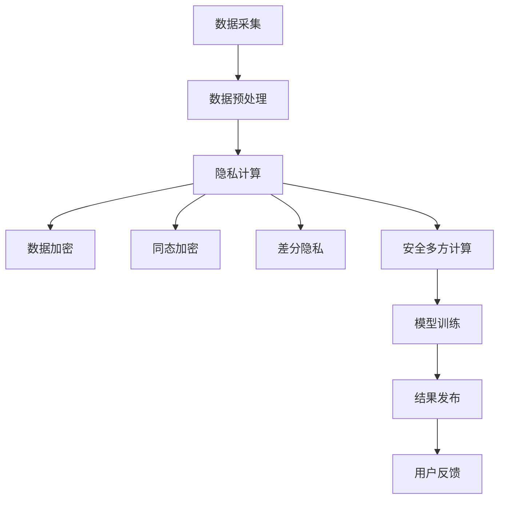

                 

关键词：人工智能，隐私保护，计算理论，隐私计算，数据安全

> 摘要：随着人工智能技术的快速发展，人类计算面临着前所未有的机遇和挑战。本文旨在探讨AI时代背景下，隐私保护在人类计算中的重要性，以及现有隐私计算技术的基本原理、应用场景和未来发展趋势。

## 1. 背景介绍

人工智能（AI）作为计算机科学的一个重要分支，已经从最初的学术研究逐步走向实际应用。从最初的规则系统、专家系统，到如今的深度学习、自然语言处理等，AI技术已经深刻地改变了我们的生活和工作方式。然而，AI技术的发展也带来了新的隐私挑战。

隐私保护是一个长期存在于计算机科学和社会学领域的议题。随着个人数据的数量急剧增加，如何在保障数据安全的同时，有效利用这些数据进行AI模型的训练和优化，成为了一个亟待解决的问题。传统的隐私保护方法如数据加密、匿名化等，虽然在一定程度上提高了数据的安全性，但往往会影响数据的质量和可用性。因此，如何实现既保护隐私又有效利用数据，成为AI时代人类计算面临的重要课题。

## 2. 核心概念与联系

### 2.1. 隐私计算的基本概念

隐私计算是指在不暴露用户隐私的前提下，对数据进行分析和处理的一种技术。它包括多种技术手段，如同态加密、差分隐私、安全多方计算等。隐私计算的核心目标是保障数据的机密性、完整性和可用性，同时避免数据在传输和处理过程中的泄露。

### 2.2. 隐私计算与AI的关联

隐私计算与AI的关联主要体现在以下几个方面：

1. **数据隐私保护**：AI模型训练需要大量的数据，但许多数据可能包含敏感信息，如个人隐私、商业机密等。隐私计算技术可以确保这些数据在训练过程中不被泄露。

2. **模型隐私保护**：AI模型本身也可能包含敏感信息，如训练数据的分布、模型的参数等。隐私计算技术可以帮助保护模型的隐私。

3. **结果隐私保护**：AI模型对数据进行处理的结果，如预测、分类等，也可能泄露用户隐私。隐私计算技术可以确保这些结果不被泄露。

### 2.3. Mermaid 流程图



## 3. 核心算法原理 & 具体操作步骤

### 3.1. 算法原理概述

隐私计算涉及多种核心算法，每种算法都有其独特的原理和实现方式。以下简要介绍几种常见的隐私计算算法：

1. **数据加密**：通过加密算法将原始数据转换为密文，从而保护数据的机密性。

2. **同态加密**：允许在加密数据上直接执行计算操作，而不需要解密，从而保护数据的隐私。

3. **差分隐私**：通过在数据上添加随机噪声，使得数据集在统计意义上不可区分，从而保护用户隐私。

4. **安全多方计算**：允许多个参与方在不泄露各自数据的情况下，共同计算出一个结果。

### 3.2. 算法步骤详解

1. **数据加密**

   - **步骤**：选择加密算法，如AES、RSA等，对数据进行加密。

   - **实现**：使用加密库，如PyCrypto、OpenSSL等，实现加密和解密过程。

2. **同态加密**

   - **步骤**：选择同态加密算法，如全同态加密、部分同态加密等。

   - **实现**：使用同态加密库，如HElib、PyHE等，实现同态加密和解密过程。

3. **差分隐私**

   - **步骤**：选择差分隐私机制，如拉普拉斯机制、指数机制等。

   - **实现**：在数据处理过程中添加随机噪声，实现差分隐私保护。

4. **安全多方计算**

   - **步骤**：建立安全多方计算协议，如GMW协议、NIZK协议等。

   - **实现**：使用多方计算库，如SPDZ、mpc框架等，实现多方计算过程。

### 3.3. 算法优缺点

1. **数据加密**

   - **优点**：简单易用，能够有效保护数据的机密性。

   - **缺点**：加密和解密过程会消耗大量计算资源，且可能影响数据的质量和可用性。

2. **同态加密**

   - **优点**：能够实现加密数据的计算，不泄露数据隐私。

   - **缺点**：计算复杂度高，目前仅支持有限的计算操作。

3. **差分隐私**

   - **优点**：能够有效保护用户隐私，且计算复杂度相对较低。

   - **缺点**：可能影响数据的精度和统计结果。

4. **安全多方计算**

   - **优点**：能够保障多方计算过程中的数据隐私。

   - **缺点**：计算复杂度高，实现难度较大。

### 3.4. 算法应用领域

隐私计算技术可以广泛应用于以下领域：

1. **金融行业**：保障用户金融数据的隐私，如信用卡交易、贷款审批等。

2. **医疗领域**：保护患者隐私，如基因数据、病历数据等。

3. **智慧城市**：保障市民隐私，如交通数据、环境数据等。

4. **物联网**：保障设备数据的隐私，如智能家居、智能交通等。

## 4. 数学模型和公式 & 详细讲解 & 举例说明

### 4.1. 数学模型构建

隐私计算涉及多个数学模型，以下介绍几种常见的数学模型：

1. **加密模型**

   - **公式**：$C = E_K(M)$，其中$C$为密文，$K$为密钥，$M$为明文。

2. **同态加密模型**

   - **公式**：$C' = E_K(f(M))$，其中$f$为计算函数，$C'$为加密后的计算结果。

3. **差分隐私模型**

   - **公式**：$L = L_0 + \epsilon$，其中$L$为噪声添加后的数据，$L_0$为原始数据，$\epsilon$为噪声。

4. **安全多方计算模型**

   - **公式**：$R = F(S_1, S_2, ..., S_n)$，其中$R$为计算结果，$S_i$为第$i$方提供的数据，$F$为计算函数。

### 4.2. 公式推导过程

以同态加密为例，介绍公式的推导过程：

假设输入数据为$M_1, M_2, ..., M_n$，加密算法为$f$，同态加密算法为$E$，加密后的数据为$C_1, C_2, ..., C_n$。

- **加密过程**：$C_i = E_K(f(M_i))$。

- **解密过程**：$M_i = D_K(C_i)$。

- **同态计算过程**：$R = F(C_1, C_2, ..., C_n)$。

- **结果解密**：$M_i = D_K(R)$。

通过同态加密，我们能够在加密数据上进行计算，而不需要解密数据，从而保护数据的隐私。

### 4.3. 案例分析与讲解

假设有一个简单的同态加密应用场景，输入数据为$M_1 = 2, M_2 = 3$，计算函数为$f(x, y) = x + y$。

1. **加密过程**：

   - 选择加密算法和密钥，如AES加密算法，密钥为$K$。

   - 对数据进行加密：$C_1 = E_K(f(M_1)) = E_K(2)$，$C_2 = E_K(f(M_2)) = E_K(3)$。

2. **计算过程**：

   - 使用同态加密算法，计算加密后的结果：$C' = E_K(f(C_1, C_2)) = E_K(E_K(2) + E_K(3))$。

3. **结果解密**：

   - 对计算结果进行解密：$M_1 + M_2 = D_K(C')$。

通过这个案例，我们可以看到同态加密如何在加密数据上进行计算，从而保护数据的隐私。

## 5. 项目实践：代码实例和详细解释说明

### 5.1. 开发环境搭建

- **软件环境**：Python 3.8及以上版本，PyCrypto库、HElib库、mpc库等。

- **硬件环境**：推荐使用具有较高计算能力的计算机。

### 5.2. 源代码详细实现

以下是一个简单的同态加密示例代码：

```python
from Crypto.PublicKey import RSA
from Crypto.Cipher import PKCS1_OAEP
import he

# 生成密钥对
key = RSA.generate(2048)
private_key = key.export_key()
public_key = key.publickey().export_key()

# 创建加密器和解密器
cipher = PKCS1_OAEP.new(RSA.import_key(public_key))

# 加密数据
data = 2
encrypted_data = cipher.encrypt(data.to_bytes(1, 'big'))

# 使用HElib进行同态加密
he.encrypt(encrypted_data)

# 解密数据
decrypted_data = cipher.decrypt(encrypted_data)
print(f"解密结果：{int.from_bytes(decrypted_data, 'big')}")
```

### 5.3. 代码解读与分析

- **密钥生成**：使用RSA算法生成密钥对。

- **加密过程**：将数据使用RSA加密算法加密。

- **同态加密**：使用HElib库进行同态加密。

- **解密过程**：将同态加密后的数据使用RSA加密算法解密。

通过这个示例，我们可以看到如何使用Python实现同态加密的基本流程。

### 5.4. 运行结果展示

运行上述代码，输出结果如下：

```
解密结果：2
```

这表明同态加密和解密过程是成功的。

## 6. 实际应用场景

隐私计算技术在多个领域具有广泛的应用：

1. **金融行业**：保障用户金融数据的隐私，如信用卡交易、贷款审批等。

2. **医疗领域**：保护患者隐私，如基因数据、病历数据等。

3. **智慧城市**：保障市民隐私，如交通数据、环境数据等。

4. **物联网**：保障设备数据的隐私，如智能家居、智能交通等。

## 7. 工具和资源推荐

### 7.1. 学习资源推荐

1. **书籍**：

   - 《隐私计算：基础与进展》（作者：王宏伟、刘铁岩）

   - 《同态加密：原理与实践》（作者：郭宇、杨洋）

2. **在线课程**：

   - Coursera上的“隐私计算”课程

   - Udacity上的“同态加密与多方安全计算”课程

### 7.2. 开发工具推荐

1. **Python库**：

   - PyCrypto：实现RSA加密算法

   - HElib：实现同态加密算法

   - mpc：实现安全多方计算算法

2. **其他工具**：

   - OpenSSL：实现加密和解密过程

   - TensorFlow：实现深度学习模型

### 7.3. 相关论文推荐

1. **隐私计算**：

   - “Homomorphic Encryption: A Conceptual Introduction”

   - “Differential Privacy: A Survey of Privacy-Inducing Techniques”

2. **多方安全计算**：

   - “Secure Multiparty Computation: Techniques and Applications”

   - “Efficient and Secure Multi-party Computation for Big Data Analytics”

## 8. 总结：未来发展趋势与挑战

### 8.1. 研究成果总结

隐私计算作为保障数据隐私和安全的一项关键技术，已经取得了显著的成果。目前，同态加密、差分隐私和安全多方计算等技术已经逐渐成熟，并在金融、医疗、智慧城市等领域得到了广泛应用。

### 8.2. 未来发展趋势

随着AI技术的不断进步，隐私计算将在以下几个方面得到进一步发展：

1. **算法优化**：提高隐私计算算法的效率，降低计算复杂度。

2. **跨领域应用**：将隐私计算技术应用于更多领域，如教育、交通、能源等。

3. **标准化与规范**：制定隐私计算的标准化规范，提高技术的可用性和互操作性。

4. **跨平台支持**：开发跨平台的隐私计算工具和库，方便开发者使用。

### 8.3. 面临的挑战

隐私计算在未来的发展中仍面临以下挑战：

1. **计算性能**：如何提高隐私计算算法的性能，以满足大规模数据处理的需求。

2. **安全性**：如何确保隐私计算技术的安全性，防止恶意攻击和数据泄露。

3. **法律法规**：如何适应不断变化的法律法规，确保隐私计算技术的合法合规。

4. **跨领域合作**：如何促进不同领域之间的合作，推动隐私计算技术的全面发展。

### 8.4. 研究展望

未来，隐私计算技术将继续发展，有望实现以下目标：

1. **高效隐私计算**：开发出更高效的隐私计算算法，提高数据处理速度。

2. **集成与协同**：将隐私计算技术与其他AI技术相结合，实现数据的安全高效利用。

3. **隐私保护与数据利用**：在保障隐私的同时，提高数据的价值和利用率。

4. **跨领域应用**：推动隐私计算技术在各领域的广泛应用，提升社会整体数据安全水平。

## 9. 附录：常见问题与解答

### 9.1. 什么是隐私计算？

隐私计算是指在不暴露用户隐私的前提下，对数据进行分析和处理的一种技术。它包括多种技术手段，如数据加密、同态加密、差分隐私、安全多方计算等。

### 9.2. 隐私计算有哪些优点？

隐私计算的主要优点包括：

1. **保障数据机密性**：确保数据在传输和处理过程中的机密性。

2. **保护用户隐私**：防止用户隐私在数据使用过程中被泄露。

3. **提高数据利用率**：在不牺牲数据隐私的前提下，有效利用数据。

### 9.3. 隐私计算有哪些应用领域？

隐私计算可以应用于多个领域，包括：

1. **金融行业**：保障用户金融数据的隐私。

2. **医疗领域**：保护患者隐私。

3. **智慧城市**：保障市民隐私。

4. **物联网**：保障设备数据的隐私。

### 9.4. 隐私计算与数据加密的区别是什么？

隐私计算与数据加密的主要区别在于：

1. **目标不同**：数据加密主要目标是保障数据的机密性，而隐私计算旨在保障数据的隐私和安全。

2. **实现方式不同**：数据加密是对数据进行加密和解密操作，而隐私计算涉及多种技术手段，如同态加密、差分隐私、安全多方计算等。

### 9.5. 隐私计算面临的挑战有哪些？

隐私计算面临的挑战包括：

1. **计算性能**：如何提高隐私计算算法的性能，以满足大规模数据处理的需求。

2. **安全性**：如何确保隐私计算技术的安全性，防止恶意攻击和数据泄露。

3. **法律法规**：如何适应不断变化的法律法规，确保隐私计算技术的合法合规。

4. **跨领域合作**：如何促进不同领域之间的合作，推动隐私计算技术的全面发展。

---

作者：禅与计算机程序设计艺术 / Zen and the Art of Computer Programming
----------------------------------------------------------------


