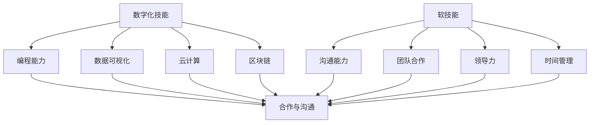

                 

在人工智能飞速发展的时代，就业市场的需求正在迅速演变，不仅要求从业者掌握传统的编程技能，还需要他们具备一系列数字化技能和软技能。本文将深入探讨这些技能的重要性，以及如何培养和提升它们，帮助读者更好地适应AI时代的就业挑战。

## 关键词
- AI时代
- 数字化技能
- 软技能
- 就业技能转型

## 摘要
本文将阐述AI时代就业技能转型的重要性，详细解析数字化技能和软技能的核心概念，提供培养这些技能的具体策略，并展望未来发展趋势与面临的挑战。通过本文的阅读，读者将了解到如何提升自身在AI时代的竞争力。

## 1. 背景介绍
### AI时代的变革

随着人工智能技术的不断成熟和普及，各行各业都开始经历深刻的变革。从自动驾驶到智能客服，从数据分析到自动化生产，AI技术的应用已经深入到我们的日常生活和工作中。这一趋势不仅改变了生产方式，也对就业市场产生了深远影响。

### 就业市场的需求变化

传统的就业模式正逐渐被颠覆，新的工作岗位不断涌现。一方面，一些传统职业面临失业风险，如工厂流水线工人、电话客服等；另一方面，新兴的数字职业需求剧增，如数据科学家、机器学习工程师、AI产品经理等。这种转变要求从业者具备更加多样化和复杂的技能。

## 2. 核心概念与联系
### 数字化技能
数字化技能是指能够有效地使用数字工具和技术解决问题的能力。这些技能包括编程、数据可视化、云计算、区块链等。数字化技能是AI时代就业的基石，它们不仅提升了工作效率，还极大地拓宽了工作范围。

### 软技能
软技能是指个人在人际交往和团队合作中表现出来的能力，如沟通能力、团队合作、领导力、时间管理等。在AI时代，软技能同样重要，甚至有时比技术技能更为关键。软技能有助于建立和谐的工作环境，提升团队效率和创造力。

### 数字化技能与软技能的联系
数字化技能和软技能并非孤立存在，它们相辅相成。例如，在团队项目中，编程能力强的人可能需要与设计师和产品经理密切合作，这就需要他们具备良好的沟通能力和团队合作精神。同样，一个具备领导力的人可以更好地协调团队成员，推动项目成功。

## 2.1 核心概念与联系的 Mermaid 流程图


## 3. 核心算法原理 & 具体操作步骤
### 3.1 算法原理概述
在AI时代，许多核心算法如深度学习、自然语言处理和计算机视觉等技术，成为了数字化技能的重要组成部分。这些算法通过复杂的数据分析和模式识别，实现了从数据中提取有价值的信息。

### 3.2 算法步骤详解
1. **数据收集**：从各种来源收集数据，如传感器数据、社交媒体数据、公开数据集等。
2. **数据处理**：清洗和预处理数据，使其适合算法训练。
3. **模型选择**：根据应用场景选择合适的模型，如神经网络、支持向量机等。
4. **模型训练**：使用数据集训练模型，使其学会识别模式和规律。
5. **模型评估**：通过测试集评估模型性能，调整参数以优化性能。
6. **模型部署**：将训练好的模型部署到实际应用场景中。

### 3.3 算法优缺点
- **优点**：提高了工作效率，实现了自动化和智能化，能够处理大规模数据。
- **缺点**：算法开发和部署成本高，对数据质量要求高，可能存在模型偏差。

### 3.4 算法应用领域
- **工业**：自动化生产线、智能工厂等。
- **医疗**：医学影像诊断、疾病预测等。
- **金融**：风险评估、欺诈检测等。
- **交通**：自动驾驶、智能交通管理。

## 4. 数学模型和公式 & 详细讲解 & 举例说明
### 4.1 数学模型构建
在AI时代，数学模型如概率论、统计学和线性代数等，是理解算法和进行模型训练的基础。

### 4.2 公式推导过程
例如，线性回归模型的目标是最小化预测值与实际值之间的误差平方和，其公式推导如下：

$$
\min \sum_{i=1}^{n} (y_i - \hat{y}_i)^2
$$

其中，$y_i$ 是实际值，$\hat{y}_i$ 是预测值。

### 4.3 案例分析与讲解
以一个简单的线性回归模型为例，假设我们想要预测房价，使用以下数据：

| 房价 | 房龄 |
|------|------|
| 200万 | 5年  |
| 250万 | 3年  |
| 300万 | 1年  |

我们可以通过线性回归模型建立房价与房龄之间的关系，具体步骤如下：

1. **数据预处理**：标准化房龄数据。
2. **模型训练**：使用训练集训练模型，得到参数。
3. **模型评估**：使用测试集评估模型性能。
4. **模型应用**：使用模型预测新房价。

## 5. 项目实践：代码实例和详细解释说明
### 5.1 开发环境搭建
使用Python作为编程语言，搭建适合开发的环境。

### 5.2 源代码详细实现
以下是一个简单的线性回归模型的实现：

```python
import numpy as np
from sklearn.linear_model import LinearRegression

# 数据准备
X = np.array([[5], [3], [1]])
y = np.array([2000000, 2500000, 3000000])

# 模型训练
model = LinearRegression()
model.fit(X, y)

# 模型评估
score = model.score(X, y)
print(f"Model score: {score}")

# 模型应用
new_house_age = np.array([[2]])
predicted_price = model.predict(new_house_age)
print(f"Predicted price: {predicted_price[0]}")
```

### 5.3 代码解读与分析
代码中，我们首先导入了必要的库，然后准备数据，接着使用`LinearRegression`类训练模型，评估模型性能，并使用模型进行预测。

### 5.4 运行结果展示
运行结果将显示模型的得分以及预测的新房价。

## 6. 实际应用场景
### 6.1 工业自动化
AI技术被广泛应用于工业自动化，如自动化生产线、智能工厂等，提高了生产效率，降低了成本。

### 6.2 医疗诊断
在医疗领域，AI技术可以帮助医生进行疾病诊断，如通过分析医学影像识别早期肿瘤。

### 6.3 风险管理
在金融领域，AI技术用于风险评估、欺诈检测等，提高了金融市场的安全性和效率。

### 6.4 未来应用展望
随着AI技术的不断发展，其在各个领域的应用前景将更加广阔，从智能家居到智能城市，AI将成为推动社会进步的重要力量。

## 7. 工具和资源推荐
### 7.1 学习资源推荐
- 《深度学习》 - Goodfellow, Bengio, Courville
- 《Python机器学习》 - Sebastian Raschka
- Coursera、edX等在线课程平台

### 7.2 开发工具推荐
- Jupyter Notebook：适合数据分析和编程实验。
- PyCharm：强大的Python集成开发环境。
- TensorFlow、PyTorch：深度学习框架。

### 7.3 相关论文推荐
- "Deep Learning" - Yann LeCun
- "The Unreasonable Effectiveness of Deep Learning" - Andrej Karpathy

## 8. 总结：未来发展趋势与挑战
### 8.1 研究成果总结
AI技术已经取得了显著的成果，但在实际应用中仍面临诸多挑战。

### 8.2 未来发展趋势
AI技术将继续快速发展，应用领域将更加广泛。

### 8.3 面临的挑战
- 数据隐私与安全
- 伦理与道德
- 技术普及与培训

### 8.4 研究展望
未来研究将更加注重算法的透明性、可解释性和公平性。

## 9. 附录：常见问题与解答
### Q: 数字化技能和软技能哪个更重要？
A: 数字化技能和软技能同等重要，它们共同构成了AI时代的就业竞争力。

### Q: 如何培养数字化技能和软技能？
A: 通过在线课程、实践项目和团队合作来培养。此外，参加相关研讨会和会议也有助于提升技能。

### Q: AI技术如何影响就业市场？
A: AI技术将创造新的就业机会，同时也会淘汰一些传统职业。从业者需要不断提升自身技能，以适应市场需求。

作者：禅与计算机程序设计艺术 / Zen and the Art of Computer Programming
----------------------------------------------------------------

以上就是按照您的要求撰写的完整文章，涵盖了文章标题、关键词、摘要以及详细的正文内容。希望对您有所帮助！


