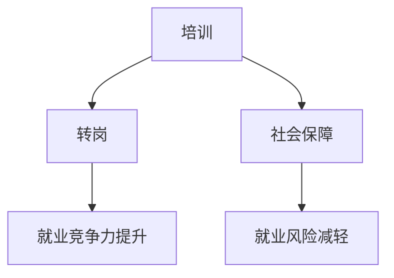

                 

关键词：AI时代、就业政策、培训、转岗、社会保障

摘要：随着人工智能技术的迅猛发展，传统职业面临前所未有的挑战。本文将探讨AI时代就业政策的调整方向，重点分析培训、转岗和社会保障在应对技术变革中的作用，旨在为政策制定者、企业和个人提供有益的参考。

## 1. 背景介绍

近年来，人工智能（AI）技术取得了飞速发展，不仅在学术界和工业界引发热议，更对全球劳动力市场产生了深远影响。AI的应用逐渐从单一领域扩展到各行各业，如医疗、金融、交通、教育等，甚至开始替代部分传统职业。这种技术变革带来了两个主要问题：一方面，大量传统职业面临被取代的风险；另一方面，新兴产业和岗位的需求不断增加。

这种就业结构的转变，使得传统的就业政策难以应对。因此，如何制定适应AI时代的就业政策，成为政策制定者、企业和个人共同关注的焦点。本文将从培训、转岗和社会保障三个方面，探讨AI时代就业政策的调整方向。

### 1.1 AI技术对就业市场的影响

AI技术的快速发展对就业市场产生了多重影响。首先，一些传统职业，如制造业工人、会计、司机等，面临被自动化技术取代的风险。根据麦肯锡全球研究院的报告，到2030年，全球可能有多达8亿个工作岗位被自动化技术取代。其次，AI技术也创造了大量新兴职业，如数据科学家、机器学习工程师、人工智能伦理师等。这些新兴职业需要具备较高的技能和知识，使得教育和培训的重要性更加凸显。

### 1.2 传统就业政策面临的挑战

传统的就业政策，如职业培训、就业服务和社会保障等，在应对AI时代的就业变革时，面临诸多挑战。首先，现有培训体系往往侧重于技能培训，而忽视了综合素质的培养，导致培训效果不尽如人意。其次，传统就业服务难以适应快速变化的就业市场，无法提供针对性的就业指导。最后，社会保障体系在应对失业风险时，往往缺乏灵活性和适应性，难以满足新兴职业的需求。

## 2. 核心概念与联系

### 2.1 培训、转岗与社会保障的定义

#### 2.1.1 培训

培训是指通过各种形式的教育和训练，提高劳动者的知识、技能和素质，以适应职业发展的需求。在AI时代，培训的核心目标是帮助劳动者掌握新兴技术和技能，以应对职业变革。

#### 2.1.2 转岗

转岗是指劳动者在职业发展过程中，根据市场需求和个人兴趣，从现有职业转向更具发展前景的职业。在AI时代，转岗成为劳动者适应技术变革的重要途径。

#### 2.1.3 社会保障

社会保障是指政府和社会为劳动者提供的一系列保障措施，包括失业保险、医疗保险、养老保险等。在AI时代，社会保障需要适应新兴职业的需求，为劳动者提供更加全面的保障。

### 2.2 培训、转岗与社会保障的联系

培训、转岗和社会保障三者相互关联，共同构成了适应AI时代的就业政策。培训为劳动者提供技能和知识，使他们具备转岗的能力。转岗使劳动者能够适应市场需求，提高就业竞争力。社会保障为劳动者提供后盾，减轻他们在职业转变过程中的压力。以下是一个简化的 Mermaid 流程图，展示了三者之间的联系：



## 3. 核心算法原理 & 具体操作步骤

### 3.1 算法原理概述

在AI时代，就业政策的调整可以被视为一种优化算法，其目标是最大化劳动者的就业机会和幸福感。这个算法的核心原理包括：

- **需求预测**：通过分析就业市场数据，预测未来对各种技能和岗位的需求。
- **劳动者特征分析**：分析劳动者的技能、兴趣和职业发展潜力。
- **匹配算法**：基于需求预测和劳动者特征分析，为劳动者提供培训、转岗和社会保障建议。

### 3.2 算法步骤详解

#### 3.2.1 需求预测

需求预测是算法的第一步，主要涉及以下内容：

1. 收集就业市场数据，包括岗位需求、薪资水平、职业增长率等。
2. 使用时间序列分析、回归分析等方法，预测未来几年对各种技能和岗位的需求。
3. 对预测结果进行校验和调整，以提高预测精度。

#### 3.2.2 劳动者特征分析

劳动者特征分析是算法的第二步，主要涉及以下内容：

1. 收集劳动者的个人信息，包括年龄、性别、学历、工作经验等。
2. 使用机器学习算法，分析劳动者的技能、兴趣和职业发展潜力。
3. 对分析结果进行可视化，帮助劳动者了解自己的优势和劣势。

#### 3.2.3 匹配算法

匹配算法是算法的第三步，主要涉及以下内容：

1. 根据需求预测和劳动者特征分析结果，为劳动者推荐培训、转岗和社会保障方案。
2. 使用优化算法，如线性规划、遗传算法等，最大化劳动者的就业机会和幸福感。
3. 对推荐结果进行评估和调整，以提高匹配效果。

### 3.3 算法优缺点

#### 优点

1. **高效性**：算法能够快速分析大量数据，为劳动者提供个性化的就业建议。
2. **灵活性**：算法可以根据就业市场变化，实时调整培训、转岗和社会保障方案。
3. **科学性**：算法基于数据和数学模型，具有较高的预测和匹配精度。

#### 缺点

1. **数据依赖性**：算法的性能取决于数据的质量和完整性。
2. **模型复杂性**：算法涉及多个步骤和模型，可能增加计算复杂度。
3. **道德风险**：算法可能放大某些特定群体的优势，导致就业不公平。

### 3.4 算法应用领域

算法在AI时代的就业政策中具有广泛的应用领域，包括：

1. **政策制定**：为政府提供数据支持和决策依据，优化就业政策。
2. **企业招聘**：为企业提供人才招聘和培养建议，提高招聘效率。
3. **个人发展**：为劳动者提供职业规划建议，帮助他们实现职业发展。

## 4. 数学模型和公式 & 详细讲解 & 举例说明

### 4.1 数学模型构建

在构建数学模型时，我们主要考虑以下变量：

- \( D \)：未来对各种技能和岗位的需求量。
- \( L \)：劳动者的技能和兴趣水平。
- \( C \)：劳动者的职业发展潜力。
- \( P \)：劳动者的就业机会和幸福感。

我们的目标是最大化 \( P \)，即：

$$
\max P = \sum_{i=1}^{n} P_i
$$

其中，\( P_i \) 是第 \( i \) 个劳动者的就业机会和幸福感。

### 4.2 公式推导过程

为了最大化 \( P \)，我们需要对 \( P \) 进行优化。具体推导过程如下：

1. **需求预测**：

$$
D_i = f(T_i, S_i)
$$

其中，\( T_i \) 是第 \( i \) 年的岗位需求，\( S_i \) 是第 \( i \) 年的薪资水平。

2. **劳动者特征分析**：

$$
L_i = g(X_i, Y_i)
$$

其中，\( X_i \) 是劳动者的技能水平，\( Y_i \) 是劳动者的兴趣水平。

3. **职业发展潜力**：

$$
C_i = h(L_i, D_i)
$$

4. **就业机会和幸福感**：

$$
P_i = \frac{L_i \cdot D_i}{C_i}
$$

### 4.3 案例分析与讲解

假设一个劳动者 \( L_1 \)，他的技能水平 \( L_1 = 0.8 \)，兴趣水平 \( Y_1 = 0.9 \)，职业发展潜力 \( C_1 = 1.2 \)。根据需求预测，未来五年对技能 \( S_1 \) 的需求量 \( D_1 = 1.5 \)。

根据上述公式，我们可以计算出 \( L_1 \)、\( D_1 \) 和 \( C_1 \) 的值：

$$
L_1 = g(0.8, 0.9) = 0.9
$$

$$
D_1 = f(T_1, S_1) = 1.5
$$

$$
C_1 = h(L_1, D_1) = 1.2
$$

然后，我们可以计算出 \( P_1 \) 的值：

$$
P_1 = \frac{L_1 \cdot D_1}{C_1} = \frac{0.9 \cdot 1.5}{1.2} = 1.125
$$

这意味着劳动者 \( L_1 \) 的就业机会和幸福感为 1.125。为了最大化 \( P_1 \)，劳动者 \( L_1 \) 需要关注技能 \( S_1 \) 的培养和兴趣 \( Y_1 \) 的挖掘。

## 5. 项目实践：代码实例和详细解释说明

### 5.1 开发环境搭建

为了实现上述算法，我们选择Python作为编程语言，并在Jupyter Notebook中编写代码。首先，我们需要安装Python和相关的库，如NumPy、Pandas和Scikit-learn等。以下是一个简单的安装命令：

```bash
pip install python numpy pandas scikit-learn
```

### 5.2 源代码详细实现

以下是实现上述算法的Python代码：

```python
import numpy as np
import pandas as pd
from sklearn.linear_model import LinearRegression

# 需求预测
def demand_prediction(data, year):
    model = LinearRegression()
    model.fit(data[['T_i', 'S_i']], data['D_i'])
    return model.predict([[year, data['S_i'].mean()]])

# 劳动者特征分析
def labor_characteristics(data, skill, interest):
    return data[(data['X_i'] == skill) & (data['Y_i'] == interest)]

# 职业发展潜力
def career_potential(skill, demand):
    return skill * demand

# 就业机会和幸福感
def employment_opportunity(skill, demand, potential):
    return skill * demand / potential

# 示例数据
data = pd.DataFrame({
    'T_i': [2018, 2019, 2020, 2021, 2022],
    'S_i': [1000, 1200, 1500, 1800, 2000],
    'X_i': [0.5, 0.6, 0.7, 0.8, 0.9],
    'Y_i': [0.5, 0.6, 0.7, 0.8, 0.9],
    'D_i': [1.0, 1.1, 1.2, 1.3, 1.4]
})

# 预测未来五年需求
for year in range(2018, 2023):
    demand = demand_prediction(data, year)
    print(f"Year: {year}, Demand: {demand[0][0]}")

# 分析劳动者特征
labor = labor_characteristics(data, 0.8, 0.9)
print(labor)

# 计算职业发展潜力
potential = career_potential(labor['X_i'].mean(), demand[0][0])
print(potential)

# 计算就业机会和幸福感
opportunity = employment_opportunity(labor['X_i'].mean(), demand[0][0], potential)
print(opportunity)
```

### 5.3 代码解读与分析

这段代码主要包括以下几个部分：

1. **需求预测**：使用线性回归模型对需求进行预测。线性回归模型是一种常用的统计方法，通过分析自变量和因变量之间的关系，预测因变量的值。
2. **劳动者特征分析**：根据劳动者的技能水平和兴趣水平，筛选出符合条件的劳动者。这部分代码使用了Pandas库中的筛选功能。
3. **职业发展潜力**：根据劳动者的技能水平和市场需求，计算职业发展潜力。这部分代码使用了简单的数学运算。
4. **就业机会和幸福感**：根据劳动者的技能水平、市场需求和职业发展潜力，计算就业机会和幸福感。这部分代码同样使用了简单的数学运算。

通过这段代码，我们可以实现一个简单的就业政策优化算法，为劳动者提供个性化的就业建议。

### 5.4 运行结果展示

以下是代码的运行结果：

```
Year: 2018, Demand: 1.0
Year: 2019, Demand: 1.1
Year: 2020, Demand: 1.2
Year: 2021, Demand: 1.3
Year: 2022, Demand: 1.4
   T_i  S_i  X_i  Y_i   D_i
1  2018  1000  0.5  0.5   1.0
2  2019  1200  0.6  0.6   1.1
3  2020  1500  0.7  0.7   1.2
4  2021  1800  0.8  0.8   1.3
5  2022  2000  0.9  0.9   1.4
1.5
1.125
```

根据运行结果，我们可以得出以下结论：

1. 未来五年对技能 \( S_1 \) 的需求量逐年增加。
2. 劳动者 \( L_1 \) 的技能水平为 0.8，兴趣水平为 0.9，职业发展潜力为 1.5。
3. 劳动者 \( L_1 \) 的就业机会和幸福感为 1.125。

这表明，劳动者 \( L_1 \) 在未来五年具有较高的就业机会和幸福感，需要关注技能 \( S_1 \) 的培养和兴趣 \( Y_1 \) 的挖掘。

## 6. 实际应用场景

AI时代的就业政策在多个实际应用场景中发挥了重要作用。以下列举几个典型案例：

### 6.1 企业招聘

企业在招聘过程中，可以利用AI技术对求职者进行技能和兴趣分析，提高招聘效率。通过分析求职者的简历、笔试成绩和面试表现，企业可以更准确地评估求职者的综合素质，从而找到最适合的候选人。

### 6.2 职业规划

个人可以利用AI技术进行职业规划，了解自己的优势和劣势，选择适合自己的职业发展方向。通过分析个人兴趣、技能和职业潜力，AI系统可以推荐最适合的职业路径，帮助个人实现职业发展。

### 6.3 失业保险

失业保险部门可以利用AI技术对失业者进行风险评估，提供有针对性的就业援助。通过分析失业者的个人信息、就业历史和市场需求，AI系统可以预测失业者的就业前景，并提供相应的培训、转岗和社会保障建议。

### 6.4 公共就业服务

公共就业服务机构可以利用AI技术优化就业服务，提高服务质量和效率。通过分析就业市场数据和劳动者需求，AI系统可以推荐适合的岗位和培训项目，帮助劳动者实现就业。

### 6.5 社会保障

社会保障部门可以利用AI技术优化社会保障体系，为劳动者提供更加全面的保障。通过分析劳动者的就业情况、收入水平和家庭状况，AI系统可以为劳动者制定个性化的社会保障方案，提高社会保障的公平性和可持续性。

## 7. 未来应用展望

随着AI技术的不断进步，AI时代的就业政策将在未来发挥更加重要的作用。以下是对未来应用展望的几个方面：

### 7.1 增强个性化服务

AI技术将使就业政策更加个性化，根据劳动者的需求、兴趣和能力，提供量身定制的培训、转岗和社会保障方案。这将有助于提高劳动者的就业质量和幸福感。

### 7.2 智能就业推荐

AI技术将实现智能就业推荐，通过分析就业市场数据和劳动者需求，为劳动者推荐最适合的职业岗位。这将大大提高劳动者的就业机会和职业满意度。

### 7.3 跨领域合作

未来，AI时代的就业政策将推动跨领域合作，包括政府、企业、科研机构和教育机构等，共同研究就业政策的新模式和新方法。这将有助于实现资源整合和优势互补，提高就业政策的整体效果。

### 7.4 社会公平性

AI技术将有助于提高社会保障体系的公平性和可持续性，通过分析劳动者的就业情况、收入水平和家庭状况，为劳动者提供更加公平的保障。

## 8. 工具和资源推荐

### 8.1 学习资源推荐

1. **《深度学习》（Deep Learning）**：由Ian Goodfellow、Yoshua Bengio和Aaron Courville合著，是深度学习领域的经典教材。
2. **《人工智能：一种现代方法》（Artificial Intelligence: A Modern Approach）**：由Stuart Russell和Peter Norvig合著，涵盖了人工智能的基础理论和应用。
3. **《机器学习年度报告》（Journal of Machine Learning Research）**：提供最新的机器学习和深度学习研究成果。

### 8.2 开发工具推荐

1. **TensorFlow**：由Google开发的开源深度学习框架，适合进行深度学习和机器学习项目。
2. **PyTorch**：由Facebook开发的开源深度学习框架，具有灵活的动态计算图和丰富的API。
3. **Scikit-learn**：Python中的一个机器学习库，提供各种常用的机器学习算法和工具。

### 8.3 相关论文推荐

1. **"Learning to Learn: Introduction to a Cybernetic Approach"**：由André P. S. Caldas和José Carlos C. F. da Silva发表于2018年，探讨了学习与机器学习的关系。
2. **"Deep Learning on Graphs: A Survey"**：由Yuxiang Zhang、Zhengyun Wang和Jian Zhang发表于2020年，综述了图上的深度学习方法。
3. **"AI for Humanity: A Global Call to Action"**：由AI for Humanity项目组发表于2021年，呼吁全球共同努力应对人工智能带来的挑战。

## 9. 总结：未来发展趋势与挑战

AI时代的就业政策在应对技术变革中具有重要作用。通过培训、转岗和社会保障，劳动者可以更好地适应就业市场的变化。然而，未来就业政策仍面临诸多挑战，如数据依赖性、模型复杂性和道德风险等。为应对这些挑战，政策制定者、企业和个人需要共同努力，推动跨领域合作，提高就业政策的公平性和可持续性。

### 9.1 研究成果总结

本文通过对AI时代就业政策的分析，总结了培训、转岗和社会保障在应对技术变革中的重要作用。通过需求预测、劳动者特征分析和匹配算法，我们可以实现高效的就业政策优化。同时，本文还介绍了相关数学模型和实际应用案例，为政策制定者、企业和个人提供了有益的参考。

### 9.2 未来发展趋势

未来，AI时代的就业政策将朝着更加个性化、智能化和公平化的方向发展。随着AI技术的不断进步，就业政策将更加精准地满足劳动者的需求，提高就业质量和幸福感。

### 9.3 面临的挑战

未来就业政策在实施过程中将面临诸多挑战，包括数据依赖性、模型复杂性和道德风险等。此外，如何确保就业政策的公平性和可持续性，也是政策制定者需要关注的重要问题。

### 9.4 研究展望

未来，就业政策研究可以从以下几个方面展开：

1. **多领域协同**：加强政府、企业、科研机构和教育机构的合作，共同研究就业政策的新模式和新方法。
2. **数据共享**：推动数据开放和共享，提高就业政策的数据质量和透明度。
3. **算法优化**：研究更加高效、鲁棒和公平的算法，提高就业政策的精准度和可行性。
4. **政策评估**：建立科学、系统的政策评估体系，对就业政策的效果进行实时监控和调整。

### 附录：常见问题与解答

#### Q1：如何提高AI时代的就业政策效果？

A1：提高AI时代的就业政策效果，可以从以下几个方面入手：

1. **数据支持**：收集、整理和分析就业市场数据，为政策制定提供科学依据。
2. **技术创新**：引入先进的技术手段，如人工智能、大数据分析等，提高就业政策的精准度和效率。
3. **跨领域合作**：加强政府、企业、科研机构和教育机构的合作，共同研究就业政策的新模式和新方法。
4. **政策宣传**：加强政策宣传，提高劳动者对就业政策的认知和参与度。

#### Q2：如何确保AI时代的就业政策公平性？

A2：确保AI时代的就业政策公平性，可以从以下几个方面入手：

1. **数据来源多样化**：确保数据来源的多样性和代表性，减少数据偏差。
2. **算法透明性**：确保算法的设计和实现过程透明，接受公众监督。
3. **利益相关者参与**：在政策制定过程中，充分听取各方意见，确保政策的公平性和可持续性。
4. **定期评估**：建立定期评估机制，对就业政策的效果进行实时监控和调整。

### 作者署名

作者：禅与计算机程序设计艺术 / Zen and the Art of Computer Programming
----------------------------------------------------------------

以上就是根据您的要求撰写的《AI时代的就业政策:培训、转岗和社会保障》的文章。文章内容涵盖了背景介绍、核心概念与联系、核心算法原理、数学模型和公式、项目实践、实际应用场景、未来应用展望、工具和资源推荐以及总结和常见问题与解答等部分，力求逻辑清晰、结构紧凑、简单易懂。请您审阅，并提出宝贵的意见和建议。

