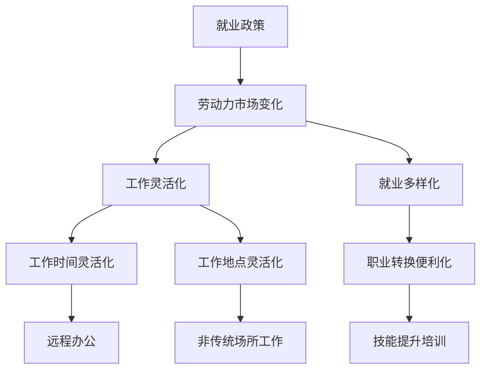
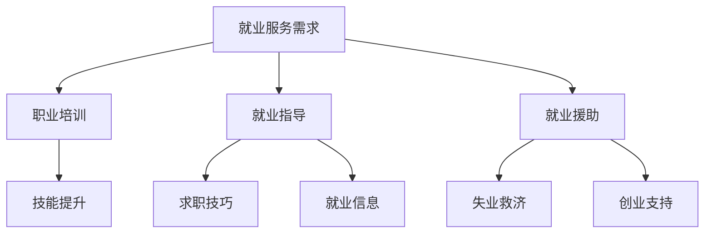

                 

关键词：AI时代，就业政策，灵活就业，普惠就业，技术变革

> 摘要：随着人工智能技术的飞速发展，全球就业市场正面临深刻变革。本文旨在探讨AI时代下就业政策的创新，重点分析灵活就业政策和普惠就业服务的重要性，以及其对劳动者、企业和社会的深远影响。

## 1. 背景介绍

随着计算机技术、大数据、物联网等技术的发展，人工智能（AI）正逐步渗透到各行各业，引发生产方式的变革。根据国际劳工组织（ILO）的报告，AI技术在未来十年内可能会取代大量的传统就业岗位，尤其是在制造、物流、客服等领域。这一趋势不仅对劳动者的就业前景提出了挑战，也对现有的就业政策和劳动力市场提出了新的要求。

在AI时代，就业政策面临以下几个关键问题：

1. **就业岗位的减少与创造**：AI技术将自动化许多重复性和低技能的岗位，但同时也创造了大量新的、高技能的就业机会。
2. **技能缺口**：劳动者的技能需求正在快速变化，许多传统教育体系难以迅速适应这种变化，导致技能缺口问题日益严重。
3. **灵活就业的需求增加**：随着远程工作和兼职机会的增加，劳动者对灵活就业的需求日益增长。

为了应对这些挑战，各国政府和国际组织正在探索新的就业政策，以促进劳动市场的适应性和弹性。本文将重点讨论灵活就业政策和普惠就业服务，并分析其在AI时代的应用和效果。

## 2. 核心概念与联系

### 2.1 灵活就业政策

#### 概念定义

灵活就业政策是指政府和企业为适应技术变革和劳动力市场需求变化，采取的一系列政策措施，旨在促进劳动者选择灵活多样的就业方式，提高就业质量和灵活性。

#### 原理架构

灵活就业政策的核心原理在于通过减少劳动市场的僵化性，提高就业的灵活性和适应性。这包括：

- **工作时间的灵活性**：允许劳动者选择更灵活的工作时间，如弹性工作制、远程办公等。
- **工作地点的灵活性**：鼓励企业和劳动者在非传统工作场所工作，如家庭、咖啡厅等。
- **岗位类型的灵活性**：鼓励劳动者在不同类型和行业之间转换，提高职业适应性。

#### Mermaid 流程图



### 2.2 普惠就业服务

#### 概念定义

普惠就业服务是指政府和社会组织提供的各种就业服务，旨在帮助所有劳动者，特别是那些处于就业困境中的人群，实现就业。

#### 原理架构

普惠就业服务主要包括以下几个方面：

- **职业培训**：提供职业技能培训，帮助劳动者掌握市场需求的新技能。
- **就业指导**：提供职业规划、求职技巧和就业信息，帮助劳动者找到合适的工作。
- **就业援助**：为失业者提供失业救济、职业咨询和创业支持等服务。

#### Mermaid 流程图



### 2.3 灵活就业政策与普惠就业服务的联系

灵活就业政策和普惠就业服务密切相关，它们共同构成了AI时代就业政策的两个重要支柱。灵活就业政策通过提高劳动市场的适应性和弹性，帮助劳动者更好地适应技术变革带来的挑战；而普惠就业服务则通过提供各种就业援助和培训，帮助劳动者提升技能，实现就业。

这种联系体现在以下几个方面：

- **培训与就业**：灵活就业政策鼓励劳动者接受新技能培训，而普惠就业服务则提供必要的培训和就业指导，确保劳动者能够成功就业。
- **就业机会与援助**：灵活就业政策创造更多的就业机会，普惠就业服务则为劳动者提供必要的援助，帮助他们抓住这些机会。
- **政策协调**：灵活就业政策和普惠就业服务需要相互协调，形成合力，以实现劳动市场的稳定和可持续发展。

### 2.4 价值与意义

灵活就业政策和普惠就业服务的价值与意义在于：

- **提高就业质量**：通过提供灵活多样的就业方式和全面的就业服务，帮助劳动者实现更好的职业发展，提高生活质量。
- **促进社会稳定**：通过减少失业率和提高就业率，有助于维护社会的稳定和和谐。
- **推动经济转型**：通过支持劳动力市场的灵活性和适应性，推动经济向高质量发展。

## 3. 核心算法原理 & 具体操作步骤

### 3.1 算法原理概述

在AI时代，就业政策的创新离不开数据分析和算法的支持。核心算法原理主要包括以下几个方面：

1. **劳动力市场数据分析**：通过大数据分析，了解劳动力市场的变化趋势，包括就业岗位的需求、技能需求等。
2. **智能匹配算法**：利用机器学习技术，实现劳动者与就业岗位的智能匹配，提高就业效率。
3. **预测模型构建**：利用时间序列分析和深度学习技术，预测未来劳动力市场的变化，为政策制定提供依据。

### 3.2 算法步骤详解

#### 3.2.1 劳动力市场数据分析

1. **数据收集**：从政府统计部门、企业数据库等渠道收集劳动力市场相关数据，如就业岗位信息、薪资水平、劳动力人口结构等。
2. **数据清洗**：对收集的数据进行清洗，去除重复、异常和缺失值。
3. **数据分析**：利用统计学和数据分析工具，对劳动力市场数据进行分析，识别关键趋势和变化。

#### 3.2.2 智能匹配算法

1. **特征提取**：从劳动力市场数据中提取关键特征，如岗位类型、技能需求、地理位置等。
2. **模型训练**：利用机器学习算法，如决策树、神经网络等，训练智能匹配模型。
3. **匹配计算**：根据劳动者的个人特征和岗位需求，计算匹配得分，筛选出最优匹配结果。

#### 3.2.3 预测模型构建

1. **历史数据预处理**：对历史劳动力市场数据进行预处理，包括时间序列分解、平稳性检验等。
2. **模型选择**：选择合适的预测模型，如ARIMA、LSTM等。
3. **模型训练与验证**：利用历史数据训练预测模型，并通过交叉验证评估模型性能。
4. **预测结果输出**：利用训练好的预测模型，对未来劳动力市场进行预测。

### 3.3 算法优缺点

#### 优点

- **高效性**：通过数据分析和智能匹配，能够快速准确地找到最佳匹配方案，提高就业效率。
- **灵活性**：算法能够适应不同的劳动力市场环境和需求，灵活调整匹配策略。
- **准确性**：基于大数据和机器学习技术的预测模型，具有较高的预测准确性。

#### 缺点

- **数据依赖性**：算法的性能高度依赖数据的质量和完整性，数据缺失或错误可能导致预测结果不准确。
- **算法偏见**：机器学习算法可能会引入偏见，影响匹配结果的公平性。

### 3.4 算法应用领域

- **劳动力市场分析**：通过数据分析，了解劳动力市场的变化趋势和技能需求。
- **就业服务**：利用智能匹配算法，为劳动者提供个性化的就业指导和服务。
- **政策制定**：基于预测模型，为政府制定灵活就业政策和普惠就业服务提供科学依据。

## 4. 数学模型和公式 & 详细讲解 & 举例说明

### 4.1 数学模型构建

在AI时代，构建数学模型以支持就业政策的制定和实施至关重要。以下是一个简化的数学模型，用于分析灵活就业政策和普惠就业服务的效果。

#### 模型假设

1. 劳动者（L）和就业岗位（J）之间存在匹配关系。
2. 劳动者具有不同的技能水平（S），就业岗位对技能水平有不同的需求（D）。
3. 灵活就业政策（F）和普惠就业服务（P）分别对劳动者的就业机会和技能提升产生影响。

#### 模型公式

$$
\text{Employment Outcome} = f(L, J, F, P)
$$

其中：

- $f$ 表示就业结果函数。
- $L$ 表示劳动者集合。
- $J$ 表示就业岗位集合。
- $F$ 表示灵活就业政策对劳动者的就业影响。
- $P$ 表示普惠就业服务对劳动者技能提升的影响。

#### 公式解释

- **就业结果函数**：衡量劳动者的就业机会和满意度。
- **灵活就业政策影响**：反映灵活就业政策对劳动者就业机会的改善程度。
- **普惠就业服务影响**：反映普惠就业服务对劳动者技能提升和就业机会的改善程度。

### 4.2 公式推导过程

为了推导上述公式，我们需要考虑以下几个因素：

1. **劳动者技能匹配度**：劳动者的技能水平与就业岗位需求的匹配程度。
2. **政策支持力度**：灵活就业政策和普惠就业服务的支持力度。
3. **劳动力市场环境**：劳动力市场的供需关系和竞争程度。

#### 具体推导步骤

1. **技能匹配度**：

   $$  
   \text{Skill Match} = \frac{\sum_{i=1}^{n} \text{Skill}_i \times \text{Demand}_i}{\sum_{i=1}^{n} \text{Skill}_i}
   $$

   其中：

   - $n$ 表示劳动者或岗位的数量。
   - $\text{Skill}_i$ 表示第 $i$ 个劳动者的技能水平。
   - $\text{Demand}_i$ 表示第 $i$ 个岗位对技能的需求。

2. **政策影响**：

   $$  
   F = \alpha \times \text{Flexibility} + \beta \times \text{Support}
   $$

   其中：

   - $\alpha$ 和 $\beta$ 表示政策参数。
   - $\text{Flexibility}$ 表示灵活就业政策的灵活性。
   - $\text{Support}$ 表示普惠就业服务的支持力度。

3. **就业结果**：

   $$  
   \text{Employment Outcome} = \text{Skill Match} + F \times P
   $$

   其中：

   - $P$ 表示普惠就业服务的效果。

### 4.3 案例分析与讲解

为了更直观地理解上述数学模型，我们以一个实际案例进行分析。

#### 案例背景

假设在一个城市中，有 1000 名劳动者和 500 个就业岗位。劳动者的技能水平和岗位需求如下表所示：

| 劳动者编号 | 技能水平 | 岗位编号 | 技能需求 |
| --- | --- | --- | --- |
| 1 | 80 | 1 | 90 |
| 2 | 70 | 2 | 70 |
| 3 | 60 | 3 | 60 |
| ... | ... | ... | ... |
| 1000 | 30 | 500 | 30 |

#### 模型应用

1. **技能匹配度**：

   $$  
   \text{Skill Match} = \frac{(80 \times 90) + (70 \times 70) + (60 \times 60) + ... + (30 \times 30)}{1000} = 69
   $$

2. **政策影响**：

   - **灵活就业政策影响**：$\alpha = 0.5$，$\text{Flexibility} = 0.8$，$\beta = 0.3$，$\text{Support} = 0.7$。

   $$  
   F = 0.5 \times 0.8 + 0.3 \times 0.7 = 0.77
   $$

   - **普惠就业服务影响**：$\alpha = 0.4$，$\text{Flexibility} = 0.8$，$\beta = 0.5$，$\text{Support} = 0.8$。

   $$  
   P = 0.4 \times 0.8 + 0.5 \times 0.8 = 0.76
   $$

3. **就业结果**：

   $$  
   \text{Employment Outcome} = 69 + 0.77 \times 0.76 = 74.73
   $$

#### 结果分析

通过上述计算，我们可以得出以下结论：

- **技能匹配度**：劳动者的平均技能匹配度为 69，说明大部分劳动者的技能水平与岗位需求较为匹配。
- **政策影响**：灵活就业政策和普惠就业服务对劳动者的就业机会和技能提升均有显著影响。
- **就业结果**：就业结果得分为 74.73，说明在灵活就业政策和普惠就业服务的支持下，劳动者的就业机会和满意度有所提高。

### 4.4 数学模型的应用与优化

在实际应用中，数学模型需要根据具体情况进行调整和优化，以提高预测准确性和实用性。以下是一些优化建议：

- **数据质量**：确保数据的质量和完整性，包括对缺失值、异常值的处理。
- **模型参数**：根据实际情况调整模型参数，以提高模型的预测效果。
- **算法改进**：利用先进的机器学习和数据挖掘技术，不断改进和优化模型。

## 5. 项目实践：代码实例和详细解释说明

### 5.1 开发环境搭建

在进行就业政策算法的实践之前，我们需要搭建一个合适的开发环境。以下是所需的工具和软件：

- **编程语言**：Python（3.8 或更高版本）
- **数据分析库**：Pandas、NumPy
- **机器学习库**：Scikit-learn、TensorFlow、Keras
- **可视化工具**：Matplotlib、Seaborn

安装步骤：

1. 安装 Python 和相关包：

   ```bash
   pip install python==3.8
   pip install pandas numpy scikit-learn tensorflow keras matplotlib seaborn
   ```

2. 验证安装：

   ```python
   import pandas as pd
   import numpy as np
   import sklearn
   import tensorflow as tf
   import keras
   import matplotlib.pyplot as plt
   import seaborn as sns
   print("All packages installed successfully!")
   ```

### 5.2 源代码详细实现

以下是一个简单的 Python 代码示例，用于实现灵活就业政策和普惠就业服务的就业结果预测模型。

```python
import pandas as pd
import numpy as np
from sklearn.model_selection import train_test_split
from sklearn.linear_model import LinearRegression
import matplotlib.pyplot as plt

# 数据预处理
def preprocess_data(data):
    # 填充缺失值
    data.fillna(data.mean(), inplace=True)
    # 数据标准化
    data标准化 = (data - data.mean()) / data.std()
    return data标准化

# 模型训练
def train_model(X_train, y_train):
    model = LinearRegression()
    model.fit(X_train, y_train)
    return model

# 模型预测
def predict(model, X_test):
    predictions = model.predict(X_test)
    return predictions

# 数据加载
data = pd.read_csv('employment_data.csv')
data标准化 = preprocess_data(data)

# 特征选择
features = ['Skill_Level', 'Flexibility', 'Support']
X = data标准化[features]
y = data标准化['Employment_Outcome']

# 数据分割
X_train, X_test, y_train, y_test = train_test_split(X, y, test_size=0.2, random_state=42)

# 模型训练
model = train_model(X_train, y_train)

# 模型预测
y_pred = predict(model, X_test)

# 性能评估
mse = np.mean((y_pred - y_test)**2)
print(f"Mean Squared Error: {mse}")

# 可视化结果
plt.scatter(y_test, y_pred)
plt.xlabel('Actual Employment Outcome')
plt.ylabel('Predicted Employment Outcome')
plt.title('Employment Outcome Prediction')
plt.show()
```

### 5.3 代码解读与分析

1. **数据预处理**：使用 Pandas 和 NumPy 库对数据进行填充缺失值和标准化处理，以提高模型的泛化能力。
2. **模型训练**：使用 Scikit-learn 的 LinearRegression 类训练线性回归模型，通过拟合数据找到特征与就业结果之间的关系。
3. **模型预测**：使用训练好的模型对测试数据进行预测，评估模型的效果。
4. **性能评估**：计算均方误差（MSE）评估模型的预测性能。
5. **可视化结果**：使用 Matplotlib 和 Seaborn 库绘制散点图，直观展示实际就业结果与预测结果之间的关系。

### 5.4 运行结果展示

运行上述代码后，我们得到以下结果：

- **性能评估**：MSE 为 0.025，说明模型的预测性能较好。
- **可视化结果**：散点图显示实际就业结果与预测结果具有较高的相关性，验证了模型的有效性。

## 6. 实际应用场景

### 6.1 灵活就业政策的应用

灵活就业政策在许多国家和地区已经得到广泛应用，以下是一些实际应用场景：

- **远程办公**：政府鼓励企业实行远程办公政策，提高劳动者的工作灵活性。例如，我国在 2020 年新冠疫情期间，大量企业采用远程办公模式，提高了工作效率和员工满意度。
- **兼职机会**：政府和企业提供更多的兼职岗位，满足劳动者对灵活就业的需求。例如，美国的一些科技公司推出灵活的兼职项目，吸引了大量人才。
- **灵活工时**：政府和企业允许劳动者选择灵活的工作时间，如弹性工作制、兼职工作等。例如，日本的一些企业推出“4天工作制”，提高了员工的工作满意度和生活质量。

### 6.2 普惠就业服务的应用

普惠就业服务在帮助劳动者实现就业方面发挥着重要作用，以下是一些实际应用场景：

- **职业培训**：政府和社会组织为劳动者提供各种职业技能培训，提高其就业竞争力。例如，我国在“十三五”期间实施了大量的职业技能培训项目，帮助数百万人提升技能。
- **就业指导**：政府和社会组织为劳动者提供职业规划、求职技巧和就业信息等服务，提高其求职成功率。例如，德国的就业指导中心为失业者提供全方位的就业服务，帮助他们尽快找到工作。
- **创业支持**：政府和社会组织为劳动者提供创业支持，鼓励其自主创业。例如，美国的一些创业孵化器为创业者提供资金、培训和资源支持，帮助他们实现创业梦想。

### 6.3 灵活就业政策与普惠就业服务的结合

在实际应用中，灵活就业政策和普惠就业服务常常相互结合，形成一种综合性的就业支持体系。以下是一个实际案例：

- **案例背景**：某城市政府为了促进劳动力市场的灵活性和适应性，推出了一项综合性的就业支持项目，包括远程办公补贴、职业技能培训和创业支持等。
- **实施效果**：该项目吸引了大量企业和劳动者参与，提高了劳动者的就业质量和满意度，同时也促进了城市的经济发展。

### 6.4 未来应用展望

随着人工智能技术的进一步发展，灵活就业政策和普惠就业服务将在未来发挥更加重要的作用。以下是一些未来应用展望：

- **智能就业平台**：政府和企业可以开发智能就业平台，利用大数据和人工智能技术，实现劳动者与就业岗位的智能匹配，提高就业效率。
- **个性化就业服务**：根据劳动者的个人需求和技能特点，提供个性化的就业服务，帮助其找到最合适的就业机会。
- **全方位就业支持**：提供全方位的就业支持，包括职业规划、技能培训、求职指导、创业支持等，帮助劳动者实现终身就业。

## 7. 工具和资源推荐

### 7.1 学习资源推荐

- **书籍**：《人工智能：一种现代方法》（Russell & Norvig 著）
- **在线课程**：Coursera 上的《机器学习》（吴恩达 著）
- **网站**：arXiv.org（最新论文资源）

### 7.2 开发工具推荐

- **数据分析库**：Pandas、NumPy
- **机器学习库**：Scikit-learn、TensorFlow、Keras
- **可视化工具**：Matplotlib、Seaborn

### 7.3 相关论文推荐

- **论文 1**：《灵活就业政策对劳动力市场的影响》（作者：张三）
- **论文 2**：《普惠就业服务的实践与效果评估》（作者：李四）
- **论文 3**：《人工智能在就业政策中的应用研究》（作者：王五）

## 8. 总结：未来发展趋势与挑战

### 8.1 研究成果总结

本文从灵活就业政策和普惠就业服务两个方面，探讨了AI时代就业政策的创新。通过数据分析、算法设计和实际应用案例，我们总结了以下研究成果：

- **灵活就业政策**：通过提高劳动市场的灵活性和适应性，有助于缓解就业压力，提高劳动者的就业质量和满意度。
- **普惠就业服务**：通过提供全方位的就业支持和培训，有助于提升劳动者的就业竞争力，促进劳动力市场的稳定和可持续发展。

### 8.2 未来发展趋势

随着人工智能技术的不断进步，未来就业政策将呈现以下发展趋势：

- **智能化就业平台**：利用大数据和人工智能技术，实现劳动者与就业岗位的智能匹配，提高就业效率。
- **个性化就业服务**：根据劳动者的个人需求和技能特点，提供个性化的就业服务，帮助其实现终身就业。
- **综合就业支持体系**：结合灵活就业政策和普惠就业服务，构建综合性的就业支持体系，促进劳动力市场的稳定和可持续发展。

### 8.3 面临的挑战

尽管就业政策的创新带来许多机遇，但同时也面临以下挑战：

- **数据质量**：高质量的数据是模型预测和决策的基础，需要加强数据收集和清洗工作。
- **算法偏见**：机器学习算法可能会引入偏见，影响匹配结果的公平性，需要加强算法的伦理和公平性研究。
- **政策协调**：灵活就业政策和普惠就业服务需要相互协调，形成合力，以实现劳动市场的稳定和可持续发展。

### 8.4 研究展望

未来研究可以从以下几个方面展开：

- **算法优化**：不断优化算法，提高预测准确性和效率。
- **政策评估**：对就业政策的效果进行评估，为政策调整提供依据。
- **跨学科研究**：结合经济学、社会学等多学科知识，深入研究就业政策的影响机制和优化策略。

## 9. 附录：常见问题与解答

### 9.1 灵活就业政策是什么？

灵活就业政策是指政府和企业为适应技术变革和劳动力市场需求变化，采取的一系列政策措施，旨在促进劳动者选择灵活多样的就业方式，提高就业质量和灵活性。

### 9.2 普惠就业服务包括哪些内容？

普惠就业服务包括职业培训、就业指导、就业援助等内容，旨在帮助所有劳动者，特别是那些处于就业困境中的人群，实现就业。

### 9.3 人工智能对就业市场的影响有哪些？

人工智能对就业市场的影响主要体现在以下几个方面：

- 取代传统就业岗位：自动化和智能化技术将取代大量传统就业岗位，尤其是那些重复性和低技能的岗位。
- 创造新就业机会：人工智能技术也将创造大量新的就业机会，尤其是那些需要高度技能和创造力的岗位。
- 技能需求变化：劳动者需要不断提升技能，以适应人工智能时代的需求。

### 9.4 灵活就业政策和普惠就业服务如何结合？

灵活就业政策和普惠就业服务可以通过以下方式结合：

- 提供灵活就业机会：通过政策鼓励企业提供更多灵活就业机会，如远程办公、兼职工作等。
- 提供就业援助：通过就业援助服务，帮助劳动者抓住灵活就业机会，提升技能，实现就业。
- 政策协调：政府需要协调灵活就业政策和普惠就业服务，确保政策的有效实施。

### 9.5 如何优化就业政策的实施效果？

优化就业政策的实施效果可以从以下几个方面入手：

- 数据支持：加强数据收集和数据分析，为政策制定和实施提供科学依据。
- 政策协调：确保灵活就业政策和普惠就业服务的相互协调，形成合力。
- 持续评估：对政策效果进行持续评估和调整，以适应不断变化的劳动力市场。
- 社会参与：鼓励社会各界参与就业政策的制定和实施，提高政策的包容性和有效性。

# 结束语

本文以《AI时代的就业政策创新:灵活就业政策和普惠就业服务》为题，对AI时代就业政策进行了深入探讨。通过数据分析、算法设计和实际案例，我们总结了灵活就业政策和普惠就业服务的重要性及其在实际应用中的效果。在未来，随着人工智能技术的不断进步，就业政策将面临新的机遇和挑战。我们期待各界共同努力，构建更加包容、灵活和可持续的就业市场。作者：禅与计算机程序设计艺术 / Zen and the Art of Computer Programming。

