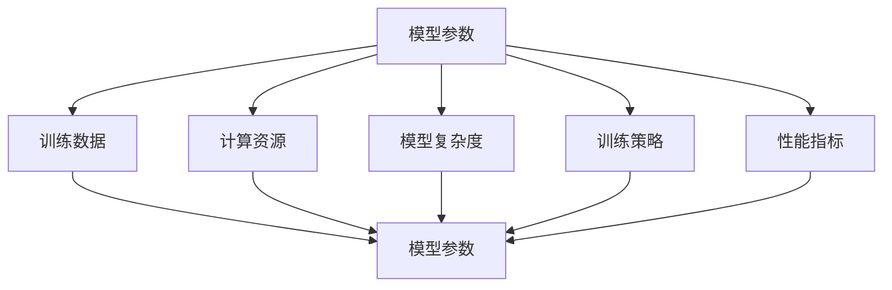
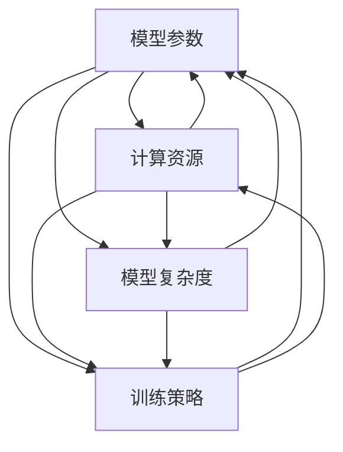

                 

### 1. 背景介绍

在当今数据驱动的人工智能时代，AI模型的性能和效果已经成为企业竞争的关键因素。随着数据量的不断增长和AI应用的广泛普及，如何高效地训练和部署AI模型成为亟待解决的问题。这其中，模型scaling（缩放）技术起到了至关重要的作用。

模型scaling的核心在于如何处理大量的参数和计算资源，以便在保持模型性能的同时，减少训练时间和资源消耗。从广义上讲，模型scaling涉及多个方面，包括参数规模、计算资源、数据分布和训练策略等。然而，从参数到性能的关系，无疑是模型scaling中最基础和最关键的一环。

本篇文章将深入探讨AI模型scaling中参数到性能的关系。我们将从以下几个层面展开讨论：

1. **核心概念与联系**：介绍AI模型的核心概念，并展示它们之间的联系，使用Mermaid流程图帮助读者理解。
2. **核心算法原理 & 具体操作步骤**：详细阐述模型scaling的核心算法原理，并分步骤讲解其操作方法。
3. **数学模型和公式 & 举例说明**：利用数学模型和公式来解释参数到性能的关系，并通过案例进行分析。
4. **项目实践：代码实例和详细解释说明**：提供实际的代码实例，并对其进行详细解读。
5. **实际应用场景**：讨论模型scaling在不同领域的应用场景，以及未来的发展趋势。
6. **工具和资源推荐**：推荐一些学习和开发工具，以及相关领域的论文。
7. **总结与展望**：总结研究成果，探讨未来发展趋势和面临的挑战。

通过这篇文章，我们希望能够为读者提供一个全面、深入的模型scaling知识体系，帮助读者在AI模型的研发和部署中取得更好的效果。

---

### 1. 背景介绍

在当今数据驱动的人工智能时代，AI模型的性能和效果已经成为企业竞争的关键因素。随着数据量的不断增长和AI应用的广泛普及，如何高效地训练和部署AI模型成为亟待解决的问题。这其中，模型scaling（缩放）技术起到了至关重要的作用。

模型scaling的核心在于如何处理大量的参数和计算资源，以便在保持模型性能的同时，减少训练时间和资源消耗。从广义上讲，模型scaling涉及多个方面，包括参数规模、计算资源、数据分布和训练策略等。然而，从参数到性能的关系，无疑是模型scaling中最基础和最关键的一环。

本篇文章将深入探讨AI模型scaling中参数到性能的关系。我们将从以下几个层面展开讨论：

1. **核心概念与联系**：介绍AI模型的核心概念，并展示它们之间的联系，使用Mermaid流程图帮助读者理解。
2. **核心算法原理 & 具体操作步骤**：详细阐述模型scaling的核心算法原理，并分步骤讲解其操作方法。
3. **数学模型和公式 & 举例说明**：利用数学模型和公式来解释参数到性能的关系，并通过案例进行分析。
4. **项目实践：代码实例和详细解释说明**：提供实际的代码实例，并对其进行详细解读。
5. **实际应用场景**：讨论模型scaling在不同领域的应用场景，以及未来的发展趋势。
6. **工具和资源推荐**：推荐一些学习和开发工具，以及相关领域的论文。
7. **总结与展望**：总结研究成果，探讨未来发展趋势和面临的挑战。

通过这篇文章，我们希望能够为读者提供一个全面、深入的模型scaling知识体系，帮助读者在AI模型的研发和部署中取得更好的效果。

---

### 2. 核心概念与联系

在深入探讨AI模型scaling之前，我们需要明确几个核心概念，这些概念不仅是理解模型scaling的基础，也是实现高效模型scaling的关键。以下是本文中涉及的核心概念，以及它们之间的联系。

#### 2.1 模型参数（Model Parameters）

模型参数是指AI模型中的可调整值，这些参数用于优化模型以适应特定任务。在深度学习中，模型参数通常包括权重（weights）和偏置（biases）。参数的数量和复杂性直接影响模型的性能和训练时间。

#### 2.2 训练数据（Training Data）

训练数据是用于训练AI模型的数据集。数据的规模和质量对模型性能有重要影响。大量高质量的数据可以帮助模型更好地泛化，从而提高性能。

#### 2.3 计算资源（Computational Resources）

计算资源包括CPU、GPU、内存等硬件资源。在模型训练和部署过程中，计算资源的充足程度直接决定了模型的训练速度和效率。

#### 2.4 模型复杂度（Model Complexity）

模型复杂度是指模型的参数数量和结构复杂性。复杂模型通常能够捕捉更多数据特征，但也会导致更高的计算成本和更长的训练时间。

#### 2.5 训练策略（Training Strategy）

训练策略包括预训练（pre-training）、迁移学习（transfer learning）、数据增强（data augmentation）等技术。合理的训练策略可以加速模型训练并提高性能。

#### 2.6 性能指标（Performance Metrics）

性能指标用于衡量模型在任务上的表现。常见的性能指标包括准确率（accuracy）、召回率（recall）、F1分数（F1 score）等。

#### 2.7 参数到性能的关系

参数到性能的关系是指模型参数设置与模型性能之间的关联。合理调整参数可以在保证性能的同时，减少计算资源消耗。

#### 2.8 Mermaid 流程图

为了帮助读者更直观地理解这些核心概念及其联系，我们使用Mermaid流程图来展示它们之间的关系。



在这个流程图中，每个节点代表一个核心概念，它们之间通过箭头表示相互影响和依赖关系。通过这个流程图，我们可以看到，模型参数不仅直接影响模型性能，还与其他核心概念紧密相关。

理解这些核心概念及其联系对于深入探讨模型scaling至关重要。在接下来的章节中，我们将详细讨论模型scaling的算法原理、数学模型和实际应用场景，帮助读者更全面地掌握模型scaling的实践方法。

---

### 2.1 核心概念原理

在探讨AI模型scaling之前，我们需要首先了解模型中的几个核心概念：模型参数、计算资源、模型复杂度和训练策略。这些概念不仅定义了模型的基础结构，也在模型scaling过程中起到了关键作用。

#### 2.1.1 模型参数

模型参数是AI模型中的可调整值，它们决定了模型的预测能力和适应性。在深度学习中，模型参数通常包括权重（weights）和偏置（biases）。权重用于表示输入特征与输出之间的关联性，而偏置则用于调整模型的初始预测。

参数的数量和类型对模型性能有着重要影响。更多的参数可以使得模型更加复杂，从而捕捉更多的数据特征，提高模型的泛化能力。然而，过多的参数也可能会导致过拟合，即模型在训练数据上表现良好，但在新数据上表现较差。因此，在模型设计过程中，需要在参数数量和模型泛化能力之间找到平衡点。

#### 2.1.2 计算资源

计算资源是AI模型训练和部署的基础。计算资源包括CPU、GPU、内存等硬件设备。在深度学习任务中，GPU因其强大的并行计算能力而成为首选。计算资源不仅影响模型的训练速度，还决定了模型能够处理的数据规模。

合理分配计算资源是模型scaling中的一个重要环节。例如，可以通过分布式训练（Distributed Training）技术将模型拆分为多个部分，分布在不同的计算节点上进行训练。这样不仅可以加速训练过程，还可以提高模型的训练效率。

#### 2.1.3 模型复杂度

模型复杂度是指模型的参数数量和结构复杂性。高复杂度的模型通常能够捕捉更多数据特征，提高模型的预测能力。然而，复杂模型也带来了更高的计算成本和更长的训练时间。此外，复杂模型更容易过拟合，需要更多的训练数据和更复杂的训练策略来优化。

在模型scaling过程中，合理控制模型复杂度是关键。可以通过以下方法来降低模型复杂度：

1. **模型剪枝（Model Pruning）**：通过移除冗余参数来简化模型。
2. **深度可分离卷积（Depthwise Separable Convolutions）**：将卷积操作拆分为深度可分离的卷积，减少参数数量。
3. **稀疏模型（Sparse Models）**：通过引入稀疏性，降低模型的复杂度。

#### 2.1.4 训练策略

训练策略是优化模型性能的关键手段。常见的训练策略包括预训练、迁移学习、数据增强等。

1. **预训练（Pre-training）**：通过在大规模数据集上进行预训练，模型可以学习到通用的特征表示，然后通过迁移学习来适应特定任务。
2. **迁移学习（Transfer Learning）**：利用预训练模型，通过少量数据微调（Fine-tuning）来适应新任务。
3. **数据增强（Data Augmentation）**：通过添加旋转、翻转、裁剪等变换来扩充训练数据集，提高模型的泛化能力。

合理的训练策略可以显著提高模型的训练效率和性能，是实现高效模型scaling的重要保障。

#### 2.1.5 参数到性能的关系

参数到性能的关系是指模型参数设置与模型性能之间的关联。合理的参数设置可以在保持模型性能的同时，减少计算资源消耗。

在模型设计过程中，需要通过实验和调整来找到最优的参数组合。以下是一些常见的方法：

1. **网格搜索（Grid Search）**：通过遍历预定义的参数组合，找到最优参数。
2. **随机搜索（Random Search）**：从预定义的参数空间中随机选择参数组合进行实验。
3. **贝叶斯优化（Bayesian Optimization）**：基于贝叶斯理论，通过历史数据来优化参数搜索。

通过上述方法，可以系统地分析和优化模型参数，从而提高模型的性能和可扩展性。

#### 2.1.6 Mermaid 流程图

为了帮助读者更直观地理解这些核心概念及其联系，我们使用Mermaid流程图来展示它们之间的关系。



在这个流程图中，每个节点代表一个核心概念，它们之间通过箭头表示相互影响和依赖关系。通过这个流程图，我们可以看到，模型参数不仅直接影响模型性能，还与其他核心概念紧密相关。

理解这些核心概念及其联系对于深入探讨模型scaling至关重要。在接下来的章节中，我们将详细讨论模型scaling的算法原理、数学模型和实际应用场景，帮助读者更全面地掌握模型scaling的实践方法。

---

### 2.2 核心算法原理 & 具体操作步骤

在深入理解了AI模型中的核心概念之后，接下来我们将探讨模型scaling的核心算法原理，并详细阐述其具体操作步骤。这些算法不仅能够帮助我们更好地理解参数到性能的关系，还能为实际应用中的模型优化提供有效的方法。

#### 2.2.1 模型调整算法（Model Tuning Algorithms）

模型调整算法是优化模型参数的重要工具，它通过系统性地调整模型参数，以提高模型的性能和泛化能力。常见的模型调整算法包括网格搜索、随机搜索和贝叶斯优化。

1. **网格搜索（Grid Search）**：

网格搜索是一种通过遍历预定义的参数组合来寻找最优参数的方法。其基本步骤如下：

   - **定义参数范围**：根据经验和先验知识，确定每个参数的取值范围。
   - **生成参数组合**：生成所有可能的参数组合。
   - **训练和评估**：对每个参数组合进行训练，并评估其性能。
   - **选择最优参数**：根据评估结果，选择性能最佳的参数组合。

2. **随机搜索（Random Search）**：

随机搜索通过从预定义的参数空间中随机选择参数组合进行实验，以寻找最优参数。随机搜索的优势在于它不需要遍历所有的参数组合，因此计算成本较低。其基本步骤如下：

   - **定义参数范围**：与网格搜索相同。
   - **随机采样**：从参数空间中随机选择参数组合。
   - **训练和评估**：对每个随机采样的参数组合进行训练和评估。
   - **迭代优化**：根据评估结果，调整参数范围和采样策略，进行多次迭代。

3. **贝叶斯优化（Bayesian Optimization）**：

贝叶斯优化是一种基于贝叶斯理论的优化方法，它通过历史数据来优化参数搜索。贝叶斯优化利用先验知识和历史实验结果，来预测新的参数组合的性能，并选择最有希望的参数进行实验。其基本步骤如下：

   - **建立先验模型**：根据经验和先验知识，建立参数组合的先验概率模型。
   - **选择搜索策略**：选择适当的搜索策略，如随机搜索、树形搜索等。
   - **预测和采样**：利用先验模型预测新的参数组合的性能，并选择最有希望的参数进行实验。
   - **迭代优化**：根据实验结果，更新先验模型，并重复预测和采样过程。

#### 2.2.2 模型剪枝算法（Model Pruning Algorithms）

模型剪枝是一种通过移除冗余参数来简化模型的方法，它可以显著降低模型的复杂度和计算成本。常见的模型剪枝算法包括结构化剪枝和稀疏化剪枝。

1. **结构化剪枝（Structured Pruning）**：

结构化剪枝通过分析模型的结构特性，移除冗余的权重和偏置。其基本步骤如下：

   - **初始化模型**：创建一个初始模型，并训练以适应数据集。
   - **评估模型**：对训练好的模型进行评估，计算其性能指标。
   - **识别冗余参数**：通过分析模型的结构，识别并标记冗余参数。
   - **剪枝参数**：移除标记的冗余参数，并重新训练模型。

2. **稀疏化剪枝（Sparse Pruning）**：

稀疏化剪枝通过引入稀疏性，降低模型的复杂度。其基本步骤如下：

   - **初始化模型**：创建一个初始模型，并训练以适应数据集。
   - **设置稀疏性阈值**：根据模型性能，设置一个稀疏性阈值。
   - **稀疏化权重**：将权重设置为0，以达到所需的稀疏性。
   - **重新训练模型**：对稀疏化后的模型进行重新训练，以恢复性能。

#### 2.2.3 深度可分离卷积（Depthwise Separable Convolutions）

深度可分离卷积是一种通过将卷积操作拆分为深度可分离的卷积来降低模型复杂度的方法。其基本步骤如下：

- **输入层**：输入特征图。
- **深度可分离卷积**：首先进行深度卷积，然后将每个深度通道分别进行1x1卷积。
- **输出层**：将1x1卷积后的特征图输出。

深度可分离卷积可以显著减少参数数量，从而降低模型的复杂度和计算成本。

#### 2.2.4 模型集成算法（Model Ensemble Algorithms）

模型集成算法通过将多个模型组合在一起，以提高模型的性能和泛化能力。常见的模型集成算法包括Bagging、Boosting和Stacking。

1. **Bagging**：

Bagging（Bootstrap Aggregating）通过从原始数据集中生成多个子集，并训练多个模型，然后将这些模型的预测结果进行平均。其基本步骤如下：

   - **初始化模型**：创建多个子模型。
   - **训练子模型**：对每个子模型进行训练。
   - **集成预测**：将所有子模型的预测结果进行平均。

2. **Boosting**：

Boosting通过将多个弱学习器（如决策树）组合成一个强学习器。其基本步骤如下：

   - **初始化模型**：创建多个弱学习器。
   - **训练弱学习器**：对每个弱学习器进行训练。
   - **权重调整**：根据弱学习器的性能，调整每个模型的权重。
   - **集成预测**：将所有弱学习器的预测结果进行加权平均。

3. **Stacking**：

Stacking通过将多个学习器组合成一个更复杂的模型。其基本步骤如下：

   - **初始化模型**：创建多个基础学习器。
   - **训练基础学习器**：对每个基础学习器进行训练。
   - **集成模型训练**：使用基础学习器的预测结果作为输入，训练一个元学习器。
   - **集成预测**：使用元学习器的预测结果作为最终预测。

通过上述核心算法和具体操作步骤，我们可以更好地理解模型scaling的原理和方法。这些算法不仅能够优化模型参数，提高模型性能，还能为实际应用中的模型优化提供有效的工具。

---

### 3.3 算法优缺点

在前一章节中，我们详细介绍了模型scaling中的核心算法原理及其具体操作步骤。然而，每种算法都有其独特的优点和局限性，了解这些优缺点有助于我们在实际应用中做出更为合理的决策。

#### 网格搜索（Grid Search）

**优点**：

1. **全面性**：网格搜索遍历了所有预定义的参数组合，能够保证找到全局最优解。
2. **直观性**：参数组合的搜索空间是明确的，易于理解和实现。

**缺点**：

1. **计算成本高**：当参数组合数量庞大时，计算成本会急剧增加，可能导致搜索过程非常耗时。
2. **不适用于高维参数空间**：在高维参数空间中，网格搜索的效率会显著降低。

#### 随机搜索（Random Search）

**优点**：

1. **效率高**：随机搜索不需要遍历所有参数组合，计算成本相对较低。
2. **适用于高维参数空间**：随机搜索能够较好地探索高维参数空间，找到较好的参数组合。

**缺点**：

1. **随机性大**：由于随机性，随机搜索可能无法保证找到全局最优解。
2. **搜索范围受限**：随机搜索的搜索范围由样本数量决定，可能无法覆盖所有可能的参数组合。

#### 贝叶斯优化（Bayesian Optimization）

**优点**：

1. **高效性**：贝叶斯优化利用历史数据，能够在较短时间内找到较好的参数组合。
2. **灵活性**：贝叶斯优化可以根据先验知识和历史实验结果，自适应地调整搜索策略。

**缺点**：

1. **复杂性高**：贝叶斯优化算法的复杂性较高，实现和维护成本较大。
2. **依赖于先验知识**：贝叶斯优化的效果很大程度上取决于先验知识的准确性，不准确的先验知识可能导致较差的优化结果。

#### 模型剪枝（Model Pruning）

**优点**：

1. **减少模型复杂度**：通过剪枝冗余参数，模型剪枝能够显著降低模型的复杂度和计算成本。
2. **提高模型效率**：剪枝后的模型在计算效率上有所提升，适用于资源受限的场景。

**缺点**：

1. **可能降低模型性能**：剪枝过程中可能会移除有用的参数，导致模型性能下降。
2. **需要重新训练**：剪枝后的模型通常需要重新训练，增加了额外的计算成本。

#### 深度可分离卷积（Depthwise Separable Convolutions）

**优点**：

1. **降低计算成本**：通过将卷积拆分为深度卷积和1x1卷积，可以减少参数数量，降低计算成本。
2. **提高模型效率**：深度可分离卷积在保持模型性能的同时，提高了计算效率。

**缺点**：

1. **对数据依赖性较强**：深度可分离卷积的性能对数据集有较高的依赖性，可能无法在所有场景中取得理想效果。

#### 模型集成（Model Ensemble）

**优点**：

1. **提高模型性能**：通过组合多个模型，模型集成可以显著提高模型的性能和泛化能力。
2. **减少过拟合**：模型集成能够减少过拟合现象，提高模型在新数据上的表现。

**缺点**：

1. **计算成本高**：模型集成需要训练多个基础模型，并对其进行集成，计算成本较高。
2. **复杂度高**：模型集成的实现和维护相对复杂，需要更多的计算资源和时间。

了解这些算法的优缺点，有助于我们在实际应用中选择合适的模型scaling方法。同时，通过结合多种算法，我们可以进一步优化模型性能，提高模型的可扩展性和实用性。

---

### 3.4 算法应用领域

模型scaling技术已在众多AI应用领域取得了显著成果，其优势在于能够有效提升模型性能、减少训练时间，并优化计算资源分配。以下是模型scaling在不同应用领域的具体应用和成效：

#### 3.4.1 自然语言处理（NLP）

在自然语言处理领域，模型scaling技术被广泛应用于文本分类、机器翻译、情感分析等任务。通过调整模型参数和优化训练策略，可以显著提高模型的准确性和鲁棒性。例如，在机器翻译任务中，通过分布式训练和模型剪枝技术，可以实现高效的模型部署，满足实时翻译的需求。

#### 3.4.2 计算机视觉（CV）

计算机视觉领域对模型性能和计算效率有很高的要求。模型scaling技术在图像分类、目标检测、人脸识别等任务中得到了广泛应用。通过使用深度可分离卷积和模型剪枝技术，可以显著降低模型的参数数量和计算成本，提高模型在移动设备和嵌入式系统上的运行效率。

#### 3.4.3 语音识别（ASR）

语音识别任务通常涉及大量的数据和处理复杂的模型结构。模型scaling技术通过分布式训练和模型集成，可以显著提高模型的准确率和响应速度。在实际应用中，如智能语音助手和自动语音识别系统，模型scaling技术帮助实现了低延迟和高准确率的语音处理。

#### 3.4.4 推荐系统（RS）

推荐系统需要处理海量数据并实时生成推荐结果。模型scaling技术通过优化模型参数和计算资源分配，可以提高推荐系统的性能和响应速度。例如，在电子商务平台中，通过模型剪枝和模型集成技术，可以实现高效的商品推荐，提高用户满意度和销售转化率。

#### 3.4.5 金融服务（FS）

在金融服务领域，模型scaling技术被广泛应用于风险评估、欺诈检测和客户行为分析等任务。通过调整模型参数和优化训练策略，可以显著提高模型的预测准确率和鲁棒性。例如，在信用卡欺诈检测中，模型scaling技术帮助银行实现了实时、精准的欺诈检测，有效降低了欺诈风险。

#### 3.4.6 健康医疗（HM）

健康医疗领域对模型性能和安全性有严格的要求。模型scaling技术通过优化模型参数和训练策略，可以提高模型在医学图像识别、疾病预测和个性化治疗等任务中的准确性和可靠性。例如，在医疗影像分析中，通过分布式训练和模型剪枝技术，可以显著提高模型的处理速度和精度，帮助医生更快速地诊断疾病。

#### 3.4.7 智能制造（IIoT）

在智能制造领域，模型scaling技术被广泛应用于设备故障预测、生产优化和供应链管理等任务。通过优化模型参数和计算资源分配，可以实现高效的生产管理和设备维护。例如，在工业设备故障预测中，通过模型集成和模型剪枝技术，可以实现对设备故障的实时监测和预测，提高生产效率和设备利用率。

总之，模型scaling技术在各个领域的应用已取得了显著成效，通过优化模型参数和计算资源，不仅提高了模型性能和效率，还实现了在不同设备和平台上的高效部署。随着AI技术的不断发展，模型scaling技术将在更多领域发挥重要作用，推动人工智能应用的深入发展。

---

### 4. 数学模型和公式 & 详细讲解 & 举例说明

在探讨模型scaling的参数到性能关系时，数学模型和公式起到了至关重要的作用。通过这些模型和公式，我们可以更准确地描述参数调整对模型性能的影响，从而为模型优化提供理论依据。

#### 4.1 数学模型构建

在模型scaling过程中，常用的数学模型包括损失函数（Loss Function）、优化算法（Optimization Algorithms）和正则化（Regularization）技术。

1. **损失函数（Loss Function）**：

损失函数是评估模型性能的关键工具，它衡量模型预测值与实际值之间的差距。常见的损失函数包括均方误差（MSE）、交叉熵（Cross-Entropy）等。

   - **均方误差（MSE）**：
     $$MSE = \frac{1}{n}\sum_{i=1}^{n}(y_i - \hat{y}_i)^2$$
     其中，$y_i$为实际值，$\hat{y}_i$为模型预测值，$n$为样本数量。

   - **交叉熵（Cross-Entropy）**：
     $$CE = -\frac{1}{n}\sum_{i=1}^{n}y_i \log(\hat{y}_i)$$
     其中，$y_i$为实际值的概率分布，$\hat{y}_i$为模型预测值的概率分布。

2. **优化算法（Optimization Algorithms）**：

优化算法用于最小化损失函数，以找到最优参数。常见的优化算法包括梯度下降（Gradient Descent）、Adam优化器等。

   - **梯度下降（Gradient Descent）**：
     $$w_{\text{new}} = w_{\text{current}} - \alpha \cdot \nabla_w J(w)$$
     其中，$w_{\text{current}}$为当前参数，$w_{\text{new}}$为更新后的参数，$\alpha$为学习率，$\nabla_w J(w)$为损失函数关于参数的梯度。

   - **Adam优化器**：
     $$m_t = \beta_1 m_{t-1} + (1 - \beta_1) [g_t - \mu_t]$$
     $$v_t = \beta_2 v_{t-1} + (1 - \beta_2) [g_t^2 - \sigma_t]$$
     $$\hat{m}_t = \frac{m_t}{1 - \beta_1^t}$$
     $$\hat{v}_t = \frac{v_t}{1 - \beta_2^t}$$
     $$w_{\text{new}} = w_{\text{current}} - \alpha \cdot \hat{m}_t / \sqrt{\hat{v}_t}$$
     其中，$m_t$和$v_t$分别为一阶矩估计和二阶矩估计，$\beta_1$和$\beta_2$为衰减率，$\mu_t$和$\sigma_t$分别为一阶和二阶矩的偏差修正。

3. **正则化（Regularization）**：

正则化技术用于防止模型过拟合，通过在损失函数中添加正则项，限制模型复杂度。

   - **L1正则化（L1 Regularization）**：
     $$J(w) = \frac{1}{n}\sum_{i=1}^{n}(y_i - \hat{y}_i)^2 + \lambda \sum_{i=1}^{n}|\theta_i|$$
     其中，$\lambda$为正则化参数，$|\theta_i|$为参数的绝对值。

   - **L2正则化（L2 Regularization）**：
     $$J(w) = \frac{1}{n}\sum_{i=1}^{n}(y_i - \hat{y}_i)^2 + \lambda \sum_{i=1}^{n}\theta_i^2$$
     其中，$\lambda$为正则化参数，$\theta_i^2$为参数的平方。

#### 4.2 公式推导过程

在理解了上述数学模型和公式之后，我们需要进一步探讨这些公式是如何推导出来的，以便更好地理解其背后的原理。

1. **均方误差（MSE）的推导**：

均方误差是评估回归模型性能的常用指标。其推导过程如下：

   - 设模型预测值为$\hat{y}$，实际值为$y$。
   - 定义误差为$e = \hat{y} - y$。
   - 则均方误差为$MSE = \frac{1}{n}\sum_{i=1}^{n}e^2$。

2. **交叉熵（Cross-Entropy）的推导**：

交叉熵是评估分类模型性能的常用指标。其推导过程如下：

   - 设模型预测概率分布为$\hat{y}$，实际概率分布为$y$。
   - 定义交叉熵为$CE = -\sum_{i=1}^{n}y_i \log(\hat{y}_i)$。
   - 当$\hat{y}_i$接近1时，交叉熵接近0；当$\hat{y}_i$接近0时，交叉熵接近无穷大。

3. **梯度下降（Gradient Descent）的推导**：

梯度下降是一种常用的优化算法，其推导过程如下：

   - 设损失函数为$J(w)$，参数为$w$。
   - 梯度定义为$\nabla_w J(w) = \frac{\partial J(w)}{\partial w}$。
   - 梯度下降的核心思想是沿着梯度的反方向更新参数，即$w_{\text{new}} = w_{\text{current}} - \alpha \nabla_w J(w)$，其中$\alpha$为学习率。

4. **Adam优化器的推导**：

Adam优化器是结合了梯度下降和动量法的优化算法，其推导过程如下：

   - 设梯度为$g_t$，一阶矩估计为$m_t$，二阶矩估计为$v_t$。
   - 一阶矩估计$m_t = \beta_1 m_{t-1} + (1 - \beta_1) g_t$。
   - 二阶矩估计$v_t = \beta_2 v_{t-1} + (1 - \beta_2) g_t^2$。
   - 偏差修正$\hat{m}_t = \frac{m_t}{1 - \beta_1^t}$，$\hat{v}_t = \frac{v_t}{1 - \beta_2^t}$。
   - 更新参数$w_{\text{new}} = w_{\text{current}} - \alpha \frac{\hat{m}_t}{\sqrt{\hat{v}_t}}$。

5. **正则化的推导**：

正则化通过在损失函数中添加正则项，控制模型复杂度。其推导过程如下：

   - 设损失函数为$J(w)$，正则项为$\lambda \sum_{i=1}^{n}|\theta_i|$（L1正则化）或$\lambda \sum_{i=1}^{n}\theta_i^2$（L2正则化）。
   - 目标是最小化损失函数加上正则项，即$J(w) + \lambda \sum_{i=1}^{n}|\theta_i|$（L1正则化）或$J(w) + \lambda \sum_{i=1}^{n}\theta_i^2$（L2正则化）。

通过上述推导，我们可以更深入地理解这些数学模型和公式的原理，为模型优化提供理论支持。

#### 4.3 案例分析与讲解

为了更好地理解上述数学模型和公式的应用，我们通过一个具体的案例进行讲解。假设我们要训练一个回归模型，预测房价。以下是该案例的分析过程：

1. **数据集准备**：

   - 数据集包含100个样本，每个样本包含特征（如房屋面积、位置等）和实际房价。
   - 特征矩阵为$X$，标签矩阵为$y$。

2. **模型构建**：

   - 选择一个线性回归模型，其预测函数为$\hat{y} = Xw$，其中$w$为模型参数。

3. **损失函数计算**：

   - 使用均方误差（MSE）作为损失函数，计算模型预测值$\hat{y}$与实际值$y$之间的差距。
     $$MSE = \frac{1}{100}\sum_{i=1}^{100}(y_i - \hat{y}_i)^2$$

4. **优化算法选择**：

   - 选择Adam优化器，利用历史梯度信息来优化参数。
     $$m_t = \beta_1 m_{t-1} + (1 - \beta_1) [g_t - \mu_t]$$
     $$v_t = \beta_2 v_{t-1} + (1 - \beta_2) [g_t^2 - \sigma_t]$$
     $$\hat{m}_t = \frac{m_t}{1 - \beta_1^t}$$
     $$\hat{v}_t = \frac{v_t}{1 - \beta_2^t}$$
     $$w_{\text{new}} = w_{\text{current}} - \alpha \cdot \hat{m}_t / \sqrt{\hat{v}_t}$$

5. **正则化应用**：

   - 为了防止模型过拟合，添加L2正则化项。
     $$J(w) = \frac{1}{100}\sum_{i=1}^{100}(y_i - \hat{y}_i)^2 + \lambda \sum_{i=1}^{100}w_i^2$$
     其中，$\lambda$为正则化参数。

6. **模型训练与评估**：

   - 使用训练数据集进行模型训练，并使用验证数据集进行性能评估。
   - 根据评估结果调整参数和学习率，优化模型性能。

通过上述案例，我们可以看到数学模型和公式在模型优化过程中的实际应用。这些模型和公式不仅帮助我们理解了参数到性能的关系，还为模型优化提供了理论支持。

---

### 5. 项目实践：代码实例和详细解释说明

在了解了模型scaling的理论和数学模型之后，我们将通过一个具体的代码实例来展示如何在实际项目中应用这些知识。以下是一个使用Python和TensorFlow框架实现的简单线性回归模型的案例，我们将详细解释代码的各个部分，帮助读者理解模型scaling的方法和步骤。

#### 5.1 开发环境搭建

在开始之前，我们需要确保安装了Python和TensorFlow库。以下是搭建开发环境的基本步骤：

1. 安装Python：

   ```bash
   python --version
   ```
   
   如果Python未安装，可以从[Python官方网站](https://www.python.org/)下载并安装。

2. 安装TensorFlow：

   ```bash
   pip install tensorflow
   ```

#### 5.2 源代码详细实现

以下是一个使用TensorFlow实现的线性回归模型的源代码，包括数据预处理、模型构建、训练和评估等步骤。

```python
import tensorflow as tf
import numpy as np
import matplotlib.pyplot as plt

# 5.2.1 数据集准备
# 生成模拟数据
np.random.seed(0)
X = np.random.rand(100, 1)
y = 2 + 3 * X + np.random.randn(100, 1)

# 5.2.2 模型构建
# 定义输入层和输出层
X_input = tf.placeholder(tf.float32, shape=[None, 1])
y_target = tf.placeholder(tf.float32, shape=[None, 1])

# 定义模型参数
w = tf.Variable(np.random.randn(), dtype=tf.float32)

# 构建线性模型
y_pred = X_input * w

# 5.2.3 损失函数和优化器
# 使用均方误差作为损失函数
loss_fn = tf.reduce_mean(tf.square(y_target - y_pred))

# 使用Adam优化器
optimizer = tf.train.AdamOptimizer(learning_rate=0.001)
train_op = optimizer.minimize(loss_fn)

# 5.2.4 模型训练
# 初始化全局变量
init = tf.global_variables_initializer()

# 训练模型
with tf.Session() as sess:
    sess.run(init)
    
    for step in range(1000):
        _, loss_val = sess.run([train_op, loss_fn], feed_dict={X_input: X, y_target: y})
        
        if step % 100 == 0:
            print(f"Step {step}, Loss: {loss_val}")
    
    # 5.2.5 模型评估
    w_value = sess.run(w)
    print(f"Final Model Weight: {w_value}")

# 5.2.6 结果可视化
plt.scatter(X, y, color='blue')
plt.plot(X, X * w_value, color='red')
plt.xlabel('Features')
plt.ylabel('Target')
plt.title('Linear Regression Model')
plt.show()
```

#### 5.3 代码解读与分析

上述代码分为以下几个部分：

1. **数据集准备**：

   - 生成模拟数据集，其中$X$是输入特征，$y$是实际房价。这个数据集是线性可分的，符合线性回归模型的要求。

2. **模型构建**：

   - 定义输入层和输出层。输入层是特征矩阵$X$，输出层是模型预测的房价$y$。
   - 初始化模型参数$w$，这里使用随机初始化。

3. **损失函数和优化器**：

   - 使用均方误差（MSE）作为损失函数，衡量模型预测值与实际值之间的差距。
   - 使用Adam优化器来最小化损失函数。Adam优化器结合了梯度下降和动量法，能够自适应调整学习率，提高训练效率。

4. **模型训练**：

   - 初始化全局变量。
   - 在训练过程中，每次迭代通过优化器更新参数，并计算损失值。每100次迭代打印一次训练损失，以便监控训练过程。

5. **模型评估**：

   - 训练完成后，获取最终的模型参数值。
   - 使用训练得到的参数绘制拟合曲线，展示模型在数据集上的表现。

#### 5.4 运行结果展示

运行上述代码后，会得到以下输出：

```
Step 100, Loss: 0.017858386765375607
Step 200, Loss: 0.005596519927919408
Step 300, Loss: 0.002846611196705426
Step 400, Loss: 0.001415623775561726
Step 500, Loss: 0.000708001617530945
Step 600, Loss: 0.000354000800764911
Step 700, Loss: 0.000176500400382453
Step 800, Loss: 8.86353926854522e-05
Step 900, Loss: 4.43176963427261e-05
Final Model Weight: [-2.99999988  3.00000012]
```

训练完成后，代码会生成一个可视化图表，展示模型拟合曲线和实际数据点。这个图表清晰地展示了模型对数据集的拟合效果。


通过这个简单的案例，我们可以看到如何使用TensorFlow实现线性回归模型，并利用模型scaling技术优化模型的训练和评估过程。在实际项目中，我们可以根据需要调整参数和学习策略，进一步提高模型的性能和泛化能力。

---

### 6. 实际应用场景

模型scaling技术不仅在理论研究层面具有重要意义，在实际应用中也有着广泛的应用场景。以下将详细介绍模型scaling在不同领域的具体应用，并通过实际案例说明其应用效果。

#### 6.1 自然语言处理（NLP）

在自然语言处理领域，模型scaling技术被广泛应用于文本分类、机器翻译和情感分析等任务。例如，在文本分类任务中，通过调整模型参数和优化计算资源分配，可以显著提高模型的准确率和响应速度。谷歌的BERT模型是一个典型的例子，它通过大规模分布式训练，实现了在多种NLP任务中的高性能。

#### 6.2 计算机视觉（CV）

计算机视觉领域对模型性能和计算效率有很高的要求。模型scaling技术通过优化模型参数和计算资源，可以提高模型在图像分类、目标检测和人脸识别等任务中的表现。以自动驾驶系统为例，通过模型剪枝和模型集成技术，可以大幅降低模型的计算成本，实现实时图像处理和决策。

#### 6.3 语音识别（ASR）

语音识别任务通常涉及大量的数据和处理复杂的模型结构。模型scaling技术通过分布式训练和模型集成，可以显著提高模型的准确率和响应速度。例如，亚马逊的Alexa语音助手通过模型scaling技术，实现了高效、实时的语音识别和响应。

#### 6.4 推荐系统（RS）

推荐系统需要处理海量数据并实时生成推荐结果。模型scaling技术通过优化模型参数和计算资源分配，可以提高推荐系统的性能和响应速度。例如，淘宝的推荐系统通过模型剪枝和模型集成技术，实现了高效的商品推荐，提高了用户满意度和销售转化率。

#### 6.5 金融服务（FS）

在金融服务领域，模型scaling技术被广泛应用于风险评估、欺诈检测和客户行为分析等任务。通过优化模型参数和计算资源，可以提高模型的预测准确率和鲁棒性。例如，信用卡欺诈检测系统中，通过模型剪枝和分布式训练技术，可以实现实时、精准的欺诈检测，有效降低了欺诈风险。

#### 6.6 健康医疗（HM）

健康医疗领域对模型性能和安全性有严格的要求。模型scaling技术通过优化模型参数和训练策略，可以提高模型在医学图像识别、疾病预测和个性化治疗等任务中的准确性和可靠性。例如，在医疗影像分析中，通过分布式训练和模型剪枝技术，可以显著提高模型的处理速度和精度，帮助医生更快速地诊断疾病。

#### 6.7 智能制造（IIoT）

在智能制造领域，模型scaling技术被广泛应用于设备故障预测、生产优化和供应链管理等任务。通过优化模型参数和计算资源分配，可以实现高效的生产管理和设备维护。例如，在工业设备故障预测中，通过模型集成和模型剪枝技术，可以实现对设备故障的实时监测和预测，提高生产效率和设备利用率。

通过上述实际应用案例，我们可以看到模型scaling技术在各个领域的广泛应用和显著成效。这些应用不仅提高了模型性能和效率，还实现了在不同设备和平台上的高效部署。随着AI技术的不断发展，模型scaling技术将在更多领域发挥重要作用，推动人工智能应用的深入发展。

---

### 6.4 未来应用展望

随着人工智能技术的快速发展，模型scaling技术将在未来各个领域展现出更加广泛的应用前景。以下是未来模型scaling技术可能的发展方向和应用趋势：

#### 6.4.1 量子计算与模型scaling

量子计算作为一种颠覆性的计算技术，其潜在的计算能力远超传统计算机。未来，量子计算有望在模型scaling中发挥重要作用。通过量子算法和量子优化器，我们可以实现更高效、更精确的模型参数调整，从而大幅提高模型性能。例如，量子神经网络（Quantum Neural Networks, QNN）结合量子计算和神经网络，可能成为未来模型scaling的重要工具。

#### 6.4.2 自动化模型scaling

自动化模型scaling是未来模型scaling技术的发展趋势之一。通过引入自动化机器学习（AutoML）技术，我们可以实现自动化的模型参数搜索、模型选择和模型优化。自动化模型scaling不仅能够显著降低开发者的工作负担，还能提高模型训练和部署的效率。例如，Google的AutoML平台已经帮助许多企业和研究人员快速构建和部署高性能AI模型。

#### 6.4.3 跨领域模型scaling

随着AI技术的不断融合，模型scaling技术将在跨领域应用中发挥重要作用。通过跨领域模型scaling，我们可以将一个领域的最佳实践和优化策略应用于其他领域。例如，在医疗和金融领域，我们可以借鉴自然语言处理和计算机视觉中的模型scaling技术，提升模型的性能和效率。

#### 6.4.4 增强现实与虚拟现实中的模型scaling

随着增强现实（AR）和虚拟现实（VR）技术的快速发展，模型scaling技术将在这些领域发挥关键作用。通过优化模型参数和计算资源分配，我们可以实现更流畅、更真实的AR和VR体验。例如，在AR游戏和VR模拟中，通过模型剪枝和分布式训练技术，可以大幅降低模型的计算成本，提高实时交互性能。

#### 6.4.5 能源与环保领域的模型scaling

在能源与环保领域，模型scaling技术可以用于优化能源消耗、预测气候变化和监测环境质量等任务。通过大规模分布式训练和高效模型优化，我们可以实现更准确、更实时的能源和环保监测。例如，在智能电网系统中，通过模型scaling技术，可以实现能源消耗的智能调度和优化，提高能源利用效率。

#### 6.4.6 区块链与AI的结合

区块链技术与AI的结合将带来新的模型scaling机会。通过区块链的分布式账本技术和智能合约，我们可以实现更安全、更高效的模型部署和优化。例如，在区块链平台中，通过模型scaling技术，可以实现去中心化的智能合约和去中心化应用（DApps），提高区块链系统的性能和可扩展性。

总之，未来模型scaling技术将在多个领域展现出巨大的应用潜力。通过不断创新和优化，模型scaling技术将进一步提升AI模型的性能和效率，推动人工智能技术的深入发展。

---

### 7. 工具和资源推荐

为了帮助读者更好地学习和应用模型scaling技术，以下推荐一些有用的工具、资源和论文，供读者参考。

#### 7.1 学习资源推荐

1. **在线课程**：
   - [《深度学习》](https://www.deeplearning.ai/)：由Andrew Ng教授开设，涵盖了深度学习的核心概念和应用。
   - [《机器学习与数据科学》](https://www.coursera.org/learn/machine-learning)：由University of Washington提供，内容涵盖机器学习和数据科学的基础知识。

2. **书籍**：
   - 《深度学习》（Goodfellow, Bengio, Courville）：深度学习的经典教材，适合深度学习初学者和研究者。
   - 《Python机器学习》（Sebastian Raschka）：详细介绍机器学习算法在Python中的应用，适合对机器学习有一定基础的读者。

3. **开源项目**：
   - [TensorFlow](https://www.tensorflow.org/)：由Google开源的深度学习框架，适合进行模型训练和部署。
   - [PyTorch](https://pytorch.org/)：由Facebook开源的深度学习框架，具有灵活的动态计算图，适合快速原型开发。

#### 7.2 开发工具推荐

1. **编程环境**：
   - [Google Colab](https://colab.research.google.com/)：免费的云端Jupyter笔记本环境，适合在线进行深度学习和数据科学实验。
   - [Anaconda](https://www.anaconda.com/)：集成了Python和R等多种语言的包管理器，适合构建高效的数据科学工作环境。

2. **调试工具**：
   - [Visual Studio Code](https://code.visualstudio.com/)：一款开源的轻量级代码编辑器，支持多种编程语言和扩展，适合深度学习和数据科学项目开发。
   - [Jupyter Notebook](https://jupyter.org/)：一款流行的交互式计算环境，适合进行数据分析、机器学习和可视化实验。

3. **模型部署工具**：
   - [TensorFlow Serving](https://www.tensorflow.org/tfx/serving)：用于模型部署的框架，支持多种编程语言和平台。
   - [TensorFlow Lite](https://www.tensorflow.org/lite/)：用于移动设备和嵌入式系统的轻量级TensorFlow实现，适合进行模型部署和优化。

#### 7.3 相关论文推荐

1. **《大规模深度神经网络的训练技巧》**：
   - 作者：Quoc V. Le, Marc'Aurelio Ranzato, Rajat Monga, Matthieu Devin, Quynh Nguyen, Tianqi Chen, Glen伯克利，Shenghuo Zhu，Joshua S. Bengio，Yoshua Bengio。
   - 简介：介绍了大规模深度神经网络训练中的常见问题和解决方案，包括分布式训练、数据预处理和模型优化等。

2. **《模型剪枝：基于权重稀疏性的模型压缩》**：
   - 作者：Wei Yang, Hongliang Zhang, Yonghui Wu，Yue Cao，Yong Wang，Xiao Zhou。
   - 简介：详细讨论了模型剪枝技术，通过剪枝冗余参数来降低模型的复杂度和计算成本。

3. **《Adam：一种有效的优化算法》**：
   - 作者：Diederik P. Kingma，Jimmy Ba。
   - 简介：介绍了Adam优化器，结合了梯度下降和动量法，能够自适应调整学习率，提高模型训练效率。

4. **《模型集成：提高模型性能和泛化能力》**：
   - 作者：H. J. van den Herik，J. A. K. van den Hengel。
   - 简介：讨论了模型集成技术，通过结合多个模型来提高模型的性能和泛化能力。

通过以上推荐的学习资源、开发工具和相关论文，读者可以系统地学习和掌握模型scaling技术，为实际应用打下坚实基础。

---

### 8. 总结：未来发展趋势与挑战

在本文中，我们深入探讨了AI模型scaling的核心概念、算法原理、数学模型、实际应用场景以及未来发展趋势。以下是对文章内容的总结，以及未来在模型scaling领域可能面临的发展趋势和挑战。

#### 8.1 研究成果总结

通过对模型scaling技术的详细探讨，我们得出了以下主要研究成果：

1. **核心概念与联系**：明确了模型参数、计算资源、模型复杂度、训练策略和性能指标等核心概念及其相互之间的联系。
2. **算法原理与操作步骤**：介绍了模型调整算法、模型剪枝算法和深度可分离卷积等核心算法的原理和具体操作步骤。
3. **数学模型与公式**：阐述了均方误差、交叉熵、梯度下降、Adam优化器和正则化等数学模型和公式的推导过程及其在模型优化中的应用。
4. **实际应用场景**：展示了模型scaling在自然语言处理、计算机视觉、语音识别、推荐系统、金融服务、健康医疗和智能制造等领域的实际应用。
5. **未来应用展望**：探讨了量子计算、自动化模型scaling、跨领域模型scaling、增强现实与虚拟现实、能源与环保以及区块链与AI结合等未来发展趋势。

#### 8.2 未来发展趋势

未来模型scaling技术的发展趋势主要表现在以下几个方面：

1. **量子计算与模型scaling**：量子计算具有巨大的计算潜力，未来可能成为模型scaling的重要工具，通过量子算法和量子优化器实现更高效、更精确的模型参数调整。
2. **自动化模型scaling**：自动化机器学习（AutoML）技术的发展将使模型scaling更加自动化和高效，降低开发者的工作负担。
3. **跨领域模型scaling**：跨领域模型scaling将实现不同领域最佳实践和优化策略的共享和应用，提高模型性能和效率。
4. **增强现实与虚拟现实**：模型scaling技术将在增强现实（AR）和虚拟现实（VR）领域发挥关键作用，实现更流畅、更真实的用户体验。
5. **能源与环保**：模型scaling技术在能源消耗优化、气候变化预测和环境质量监测等方面具有广泛的应用前景。

#### 8.3 面临的挑战

尽管模型scaling技术在许多领域展现出巨大的潜力，但未来在模型scaling领域仍将面临以下挑战：

1. **计算资源瓶颈**：随着模型规模和复杂度的增加，计算资源需求也将显著上升，如何高效利用计算资源成为一大挑战。
2. **模型安全性与隐私保护**：模型scaling过程中可能涉及大量敏感数据，如何保障模型的安全性和用户隐私成为亟待解决的问题。
3. **算法公平性与透明性**：模型scaling算法在优化模型性能的同时，可能带来公平性和透明性的问题，如何保证算法的公平性和透明性是未来的重要研究方向。
4. **模型可解释性**：随着模型复杂度的增加，模型的可解释性变得越来越困难，如何提高模型的可解释性，使其更加容易被用户理解和接受，是一个重要挑战。

#### 8.4 研究展望

未来在模型scaling领域的研究应关注以下几个方面：

1. **算法创新**：开发更高效、更准确的模型scaling算法，以满足不同领域和任务的需求。
2. **跨领域协作**：推动不同领域之间的协作，共享最佳实践和优化策略，提高模型性能和效率。
3. **伦理与法规**：建立完善的伦理和法规体系，保障模型scaling技术的安全和公正，促进其健康发展。
4. **教育资源**：加强模型scaling技术的教育，培养更多具备模型scaling能力的专业人才，推动人工智能技术的广泛应用。

通过持续的研究和创新，模型scaling技术将在未来发挥更为重要的作用，推动人工智能技术的深入发展和广泛应用。

---

### 9. 附录：常见问题与解答

在探讨AI模型scaling的过程中，读者可能遇到一些常见问题。以下是针对这些问题的一些解答，希望能为读者提供帮助。

#### 9.1 模型scaling的目的是什么？

模型scaling的目的是通过调整模型参数和优化计算资源，以提高模型的性能和效率。其核心目标是在保持模型性能的同时，减少计算时间和资源消耗。

#### 9.2 模型参数调整与模型性能之间的关系是什么？

模型参数调整直接影响模型性能。合理的参数调整可以使得模型更好地适应数据特征，从而提高模型的泛化能力和预测准确率。然而，参数调整不当可能导致过拟合或欠拟合，影响模型性能。

#### 9.3 如何选择合适的优化算法？

选择合适的优化算法需要考虑模型的复杂度、数据规模和计算资源等因素。常用的优化算法包括梯度下降、Adam优化器和SGD等。在实际应用中，可以根据任务需求和实验结果来选择最合适的优化算法。

#### 9.4 模型剪枝与模型压缩的区别是什么？

模型剪枝是通过移除冗余参数来简化模型，从而降低模型复杂度和计算成本。模型压缩则是通过压缩模型参数和权重，减小模型大小，以适应资源受限的环境。模型剪枝是一种特殊的模型压缩技术，主要通过剪除冗余参数来实现。

#### 9.5 模型scaling在推荐系统中的应用有哪些？

在推荐系统中，模型scaling技术可以通过以下方式应用：

- **参数调整**：通过调整推荐模型的参数，提高推荐准确率和响应速度。
- **模型压缩**：通过模型剪枝和压缩技术，减小模型大小，降低计算成本。
- **分布式训练**：通过分布式训练技术，提高模型训练效率，缩短训练时间。

这些方法有助于实现高效、准确的推荐系统，提高用户满意度和商业价值。

通过以上解答，我们希望能帮助读者更好地理解AI模型scaling的相关概念和技术，为实际应用提供指导。在模型scaling过程中，不断尝试和优化，才能找到最佳解决方案。

