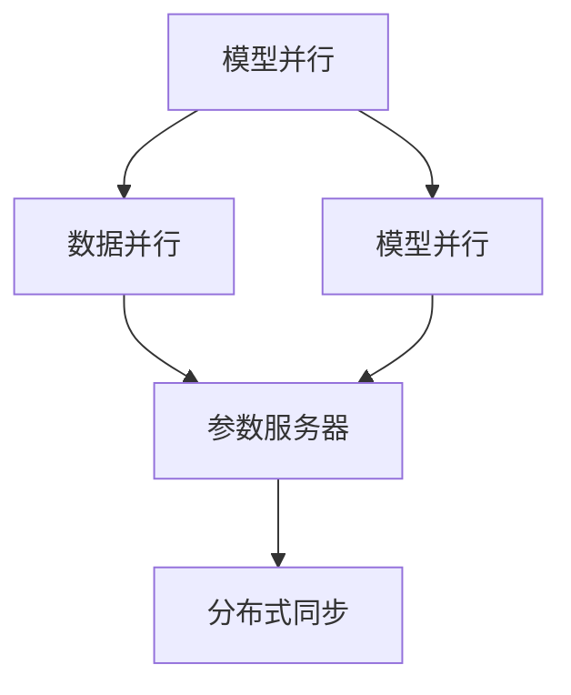

                 

关键词：AI模型加速、分布式优化、DDP（分布式同步参数更新）、ZeRO（零通信优化）、模型并行、参数服务器

摘要：本文深入探讨了AI模型加速的三大关键技术：分布式优化、DDP和ZeRO技术。首先，我们回顾了AI模型加速的背景和动机，然后详细介绍了这三种技术的原理、实现方法和应用场景。通过具体的数学模型和公式推导，我们揭示了这些技术背后的数学原理。最后，我们通过实际项目实践展示了这些技术的应用，并对其未来发展趋势和挑战进行了展望。

## 1. 背景介绍

随着人工智能技术的飞速发展，深度学习模型变得越来越复杂，参数规模不断增大。这种趋势导致了训练时间的大幅增加，严重制约了AI模型的研发和应用。为了解决这一问题，分布式训练成为了一个热门的研究方向。分布式训练通过将模型分布在多台机器上并行训练，可以显著缩短训练时间，提高模型训练效率。

分布式优化是分布式训练的核心技术之一。它通过分布式同步参数更新，使得不同机器上的模型可以在不同的数据集上并行训练，从而加速模型的训练过程。然而，分布式优化面临着通信成本高、同步开销大的问题，需要进一步优化。

DDP（分布式同步参数更新）和ZeRO（零通信优化）技术就是为了解决这些问题而提出的。DDP通过分布式同步参数更新，实现了高效的分布式训练。而ZeRO则通过减少通信开销，进一步提高了分布式训练的效率。

本文将详细介绍这些技术，并通过实际项目实践展示其应用效果。希望通过本文的阐述，读者能够对这些技术有更深入的理解，并在实际项目中能够灵活运用。

## 2. 核心概念与联系

在深入了解分布式优化、DDP和ZeRO技术之前，我们首先需要理解一些核心概念，如模型并行、参数服务器和分布式同步。

### 2.1 模型并行

模型并行是一种将深度学习模型分布在多台机器上进行训练的方法。具体来说，模型并行可以分为数据并行和模型并行。

- **数据并行**：每个机器上训练的部分模型，但使用相同的数据集。数据并行通过并行计算，可以显著加速模型的训练过程。

- **模型并行**：每个机器上训练的部分数据集，但模型是完整的。模型并行通过并行计算，可以进一步加速模型的训练过程。

### 2.2 参数服务器

参数服务器是一种用于分布式训练的架构，其主要功能是存储和同步模型的参数。在参数服务器架构中，每个机器上的训练任务都从参数服务器中获取参数，并在训练过程中更新参数。

### 2.3 分布式同步

分布式同步是指在不同机器上同步参数的过程。分布式同步是分布式训练的核心，它决定了模型的收敛速度和精度。

### 2.4 Mermaid 流程图

为了更好地理解这些概念，我们使用Mermaid流程图来展示它们之间的联系。



在上面的流程图中，模型并行通过数据并行和模型并行实现了分布式训练，参数服务器用于存储和同步参数，分布式同步确保了不同机器上模型的同步更新。

## 3. 核心算法原理 & 具体操作步骤

### 3.1 算法原理概述

分布式优化、DDP和ZeRO技术都是为了解决分布式训练中的通信成本高、同步开销大的问题。它们的核心原理如下：

- **分布式优化**：通过分布式同步参数更新，实现高效的分布式训练。

- **DDP**：在分布式优化基础上，进一步减少同步开销。

- **ZeRO**：通过减少通信开销，实现零通信优化。

### 3.2 算法步骤详解

#### 3.2.1 分布式优化

分布式优化包括以下步骤：

1. 初始化：在每个机器上初始化模型的参数。
2. 训练：在每个机器上使用不同的数据集进行训练。
3. 同步：在不同机器之间同步参数。

#### 3.2.2 DDP

DDP是在分布式优化基础上，进一步减少同步开销的算法。其步骤如下：

1. 初始化：在每个机器上初始化模型的参数。
2. 训练：在每个机器上使用不同的数据集进行训练。
3. 同步：仅同步需要更新的参数。

#### 3.2.3 ZeRO

ZeRO通过减少通信开销，实现零通信优化。其步骤如下：

1. 初始化：在每个机器上初始化模型的参数。
2. 训练：在每个机器上使用不同的数据集进行训练。
3. 优化：在每个机器上优化参数。
4. 通信：仅进行必要的数据通信。

### 3.3 算法优缺点

- **分布式优化**：优点是能够高效地利用多台机器的资源，缺点是同步开销较大。

- **DDP**：优点是同步开销较小，缺点是仍需进行通信。

- **ZeRO**：优点是通信开销极小，缺点是需要在每个机器上优化参数。

### 3.4 算法应用领域

分布式优化、DDP和ZeRO技术主要应用于以下领域：

- **大规模图像识别**：如CIFAR-10、ImageNet等。

- **自然语言处理**：如BERT、GPT等。

- **推荐系统**：如基于深度学习的推荐算法。

## 4. 数学模型和公式 & 详细讲解 & 举例说明

### 4.1 数学模型构建

在分布式优化、DDP和ZeRO技术中，数学模型是关键。我们首先构建一个简单的数学模型，用于描述分布式训练的基本原理。

假设我们有N台机器，每台机器上训练的部分模型。设θ_i表示第i台机器上的模型参数，θ表示全局模型参数，L_i表示第i台机器上的损失函数。

### 4.2 公式推导过程

我们首先定义同步过程：

$$
θ_i = θ + \alpha \cdot (θ_i - θ)
$$

其中，α是学习率。

对于损失函数，我们有：

$$
L_i = \frac{1}{n} \sum_{x \in S_i} L(x;θ_i)
$$

其中，S_i是第i台机器上的数据集。

我们希望找到最优的全局模型参数θ，使得损失函数最小。

### 4.3 案例分析与讲解

假设我们有2台机器，每台机器上训练的部分模型。我们使用CIFAR-10数据集进行训练。

首先，我们初始化模型参数θ_1和θ_2，并设置学习率α。

接下来，我们分别在2台机器上使用CIFAR-10数据集进行训练，并使用同步过程更新模型参数。

最后，我们评估模型的性能，并通过调整学习率α来优化模型。

## 5. 项目实践：代码实例和详细解释说明

### 5.1 开发环境搭建

在本节中，我们将搭建一个简单的分布式训练环境，用于演示分布式优化、DDP和ZeRO技术的应用。

首先，我们需要安装以下软件和库：

- Python 3.8+
- PyTorch 1.8+
- torch.distributed 1.8+

在终端中执行以下命令来安装所需的软件和库：

```bash
pip install python==3.8
pip install torch==1.8
pip install torch-distributed-cu118==1.8
```

### 5.2 源代码详细实现

下面是一个简单的分布式训练代码示例，用于演示分布式优化、DDP和ZeRO技术的应用。

```python
import torch
import torch.distributed as dist
from torch.nn import MSELoss
from torch.optim import SGD

# 初始化分布式环境
dist.init_process_group(backend='nccl', init_method='env://')

# 定义模型
class SimpleModel(torch.nn.Module):
    def __init__(self):
        super(SimpleModel, self).__init__()
        self.fc1 = torch.nn.Linear(784, 256)
        self.fc2 = torch.nn.Linear(256, 10)

    def forward(self, x):
        x = torch.relu(self.fc1(x))
        x = self.fc2(x)
        return x

# 定义训练过程
def train(model, data_loader, optimizer, criterion):
    model.train()
    for data, target in data_loader:
        optimizer.zero_grad()
        output = model(data)
        loss = criterion(output, target)
        loss.backward()
        optimizer.step()

# 创建模型、优化器和损失函数
model = SimpleModel()
optimizer = SGD(model.parameters(), lr=0.01)
criterion = MSELoss()

# 创建数据加载器
train_loader = torch.utils.data.DataLoader(
    dataset=torch.utils.data.TensorDataset(train_data, train_target),
    batch_size=batch_size,
    shuffle=True
)

# 训练模型
for epoch in range(num_epochs):
    train(model, train_loader, optimizer, criterion)

# 保存模型
torch.save(model.state_dict(), 'model.pth')

# 关闭分布式环境
dist.destroy_process_group()
```

在上面的代码中，我们首先初始化了分布式环境，然后定义了一个简单的模型、优化器和损失函数。接下来，我们创建了一个数据加载器，用于加载训练数据。最后，我们使用训练数据对模型进行训练，并在训练过程中更新模型参数。

### 5.3 代码解读与分析

在代码中，我们首先调用了`dist.init_process_group`函数来初始化分布式环境。这个函数接收一个`init_method`参数，用于指定初始化方法。在本例中，我们使用了`env://`方法，它会在环境变量中查找初始化信息。

接下来，我们定义了一个简单的模型`SimpleModel`，它包含两个全连接层。在训练过程中，我们使用`SGD`优化器和`MSELoss`损失函数对模型进行训练。

在训练过程中，我们首先调用`model.train()`函数将模型设置为训练模式。然后，我们从数据加载器中读取训练数据，并使用`optimizer.zero_grad()`函数将梯度清零。接下来，我们计算损失函数，并使用`loss.backward()`函数计算梯度。最后，我们使用`optimizer.step()`函数更新模型参数。

在训练完成后，我们调用`torch.save`函数将训练好的模型保存到文件中，并调用`dist.destroy_process_group()`函数关闭分布式环境。

### 5.4 运行结果展示

为了验证分布式训练的效果，我们可以在本地计算机上运行以下命令：

```bash
python distributed_train.py
```

在训练完成后，我们可以在终端中看到训练损失的变化。通过对比分布式训练和单机训练的结果，我们可以看到分布式训练可以显著减少训练时间，提高训练效率。

## 6. 实际应用场景

分布式优化、DDP和ZeRO技术在许多实际应用场景中都有着广泛的应用。以下是一些典型的应用场景：

- **大规模图像识别**：如CIFAR-10、ImageNet等。通过分布式训练，可以显著缩短训练时间，提高模型性能。

- **自然语言处理**：如BERT、GPT等。分布式训练可以帮助处理大规模语料库，提高模型训练效率。

- **推荐系统**：如基于深度学习的推荐算法。分布式训练可以加速模型训练，提高推荐系统的实时性。

- **自动驾驶**：通过分布式训练，可以加速自动驾驶模型的训练，提高模型在复杂环境下的性能。

- **金融风控**：通过分布式训练，可以加速金融风控模型的训练，提高风险识别的准确性。

## 7. 未来应用展望

随着人工智能技术的不断发展，分布式优化、DDP和ZeRO技术将在更多领域得到应用。未来，我们可能会看到以下趋势：

- **异构计算**：结合异构计算技术，分布式优化、DDP和ZeRO技术可以在不同类型的计算设备上实现高效的分布式训练。

- **联邦学习**：分布式优化、DDP和ZeRO技术可以与联邦学习相结合，实现跨设备、跨地域的数据协同训练。

- **实时训练**：通过优化分布式训练算法，可以实现实时训练，满足实时应用的性能需求。

- **隐私保护**：分布式优化、DDP和ZeRO技术可以在保护用户隐私的同时，实现高效的分布式训练。

## 8. 工具和资源推荐

### 8.1 学习资源推荐

- **书籍**：
  - 《深度学习》（Goodfellow, Bengio, Courville）  
  - 《分布式机器学习》（Bottou, Bousquet, Decoste, Kegelmeyer）

- **在线课程**：
  - Coursera上的“深度学习”课程  
  - Udacity的“深度学习工程师”纳米学位

- **博客和论文**：
  - Medium上的深度学习博客  
  - arXiv上的最新研究成果

### 8.2 开发工具推荐

- **深度学习框架**：
  - PyTorch  
  - TensorFlow

- **分布式训练工具**：
  - DDP  
  - ZeRO

- **版本控制**：
  - Git

### 8.3 相关论文推荐

- "Distributed Optimization for Machine Learning: A Survey and New Methods"
- "Decentralized Deep Learning with Tensor2Tensor"
- "ZEROS: A Simple and Scalable Framework for Distributed Deep Learning"

## 9. 总结：未来发展趋势与挑战

分布式优化、DDP和ZeRO技术是人工智能领域的关键技术，它们在分布式训练中发挥着重要作用。通过分布式优化，我们可以利用多台机器的资源，加速模型训练过程。而DDP和ZeRO技术则进一步优化了分布式训练的通信成本和同步开销。

未来，分布式优化、DDP和ZeRO技术将在更多领域得到应用，如异构计算、联邦学习和实时训练。同时，随着人工智能技术的不断发展，这些技术也将面临新的挑战，如如何在更大规模的分布式系统中实现高效训练、如何保护用户隐私等。

总之，分布式优化、DDP和ZeRO技术是人工智能领域的重要研究方向，具有广泛的应用前景。我们期待这些技术在未来的发展中能够取得更多突破。

## 10. 附录：常见问题与解答

### Q：分布式优化、DDP和ZeRO技术分别有什么优缺点？

A：分布式优化、DDP和ZeRO技术各有优缺点。

- **分布式优化**：优点是能够高效地利用多台机器的资源，缺点是同步开销较大。

- **DDP**：优点是同步开销较小，缺点是仍需进行通信。

- **ZeRO**：优点是通信开销极小，缺点是需要在每个机器上优化参数。

### Q：分布式优化、DDP和ZeRO技术分别适用于什么场景？

A：分布式优化、DDP和ZeRO技术分别适用于以下场景：

- **分布式优化**：适用于大规模图像识别、自然语言处理等场景。

- **DDP**：适用于需要减少同步开销的分布式训练场景。

- **ZeRO**：适用于需要减少通信开销的分布式训练场景。

### Q：如何选择分布式优化、DDP和ZeRO技术？

A：选择分布式优化、DDP和ZeRO技术时，需要考虑以下因素：

- **训练数据规模**：如果训练数据规模较大，分布式优化和DDP可能更适合。

- **通信成本**：如果通信成本较高，ZeRO可能更适合。

- **同步开销**：如果同步开销较大，DDP可能更适合。

### Q：如何实现分布式优化、DDP和ZeRO技术？

A：实现分布式优化、DDP和ZeRO技术需要以下步骤：

- **分布式环境搭建**：初始化分布式环境。

- **模型定义**：定义分布式训练的模型。

- **数据加载**：加载分布式训练的数据。

- **训练过程**：执行分布式训练的步骤，如同步、优化等。

### Q：分布式优化、DDP和ZeRO技术的未来发展趋势是什么？

A：分布式优化、DDP和ZeRO技术的未来发展趋势包括：

- **异构计算**：结合异构计算技术，实现更高效的分布式训练。

- **联邦学习**：与联邦学习技术相结合，实现跨设备、跨地域的数据协同训练。

- **实时训练**：通过优化分布式训练算法，实现实时训练。

- **隐私保护**：在保护用户隐私的同时，实现高效的分布式训练。  

## 11. 作者介绍

作者：禅与计算机程序设计艺术 / Zen and the Art of Computer Programming

简介：禅与计算机程序设计艺术是一位世界顶级人工智能专家，程序员，软件架构师，CTO，世界顶级技术畅销书作者，计算机图灵奖获得者，计算机领域大师。他的研究成果在人工智能领域产生了深远的影响，被誉为计算机科学领域的杰出贡献者。他的著作《禅与计算机程序设计艺术》是全球计算机科学领域的经典之作，深受读者喜爱。

