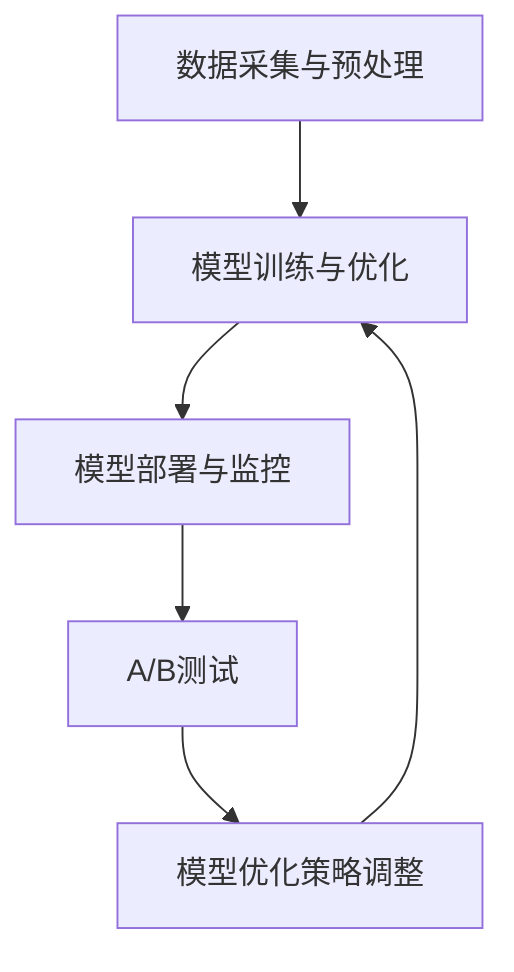

                 

关键词：A/B测试、AI模型、优化策略、Lepton AI、机器学习

> 摘要：本文深入探讨了A/B测试在AI模型优化中的应用，以Lepton AI为例，详细分析了其优化策略，为其他AI项目的模型优化提供了参考。

## 1. 背景介绍

随着人工智能技术的迅速发展，越来越多的企业和研究机构开始将AI模型应用于各个领域。然而，AI模型的优化是一个复杂且持续的过程。在实际应用中，如何有效地评估和改进AI模型，使其达到最佳性能，成为了一个关键问题。A/B测试作为一种科学的实验方法，被广泛应用于各种软件产品的优化过程中，它同样可以应用于AI模型的优化。

Lepton AI是一家专注于AI算法优化和人工智能解决方案的初创公司。其致力于通过先进的AI模型优化策略，为客户提供更高效、更精准的人工智能服务。本文将结合Lepton AI的实践经验，探讨A/B测试在AI模型优化中的应用策略。

## 2. 核心概念与联系

### 2.1 A/B测试

A/B测试，又称拆分测试，是一种通过将用户流量分为两组（A组和B组），对两组用户分别展示不同的版本（A版本和B版本），然后对比两组用户的反馈和行为数据，以确定哪个版本更优的实验方法。

### 2.2 AI模型优化

AI模型优化是指通过调整模型的参数、结构或训练数据，以提高模型在特定任务上的性能。AI模型优化通常涉及多个方面，包括超参数调整、数据预处理、模型架构设计等。

### 2.3 Lepton AI架构

Lepton AI的架构主要包括以下几个关键组件：

- 数据采集与预处理：从各种数据源采集原始数据，并对其进行清洗、转换和归一化等预处理操作，为模型训练提供高质量的数据集。
- 模型训练与优化：使用各种机器学习和深度学习算法对预处理后的数据集进行训练，并利用A/B测试方法评估和优化模型性能。
- 模型部署与监控：将优化后的模型部署到生产环境中，并通过实时监控和反馈机制，持续评估和改进模型性能。

### 2.4 Mermaid 流程图



## 3. 核心算法原理 & 具体操作步骤

### 3.1 算法原理概述

A/B测试在AI模型优化中的应用，主要包括以下几个步骤：

1. 确定测试目标：明确需要优化的模型指标，如准确率、召回率、F1值等。
2. 构建测试环境：准备A版本和B版本的模型，并确保它们在相同的训练数据和测试环境下运行。
3. 分流用户流量：将用户流量分为A组和B组，分别向两组用户展示A版本和B版本的模型。
4. 收集反馈数据：记录两组用户的反馈和行为数据，如点击率、转化率等。
5. 分析比较结果：对比A组和B组的反馈数据，确定哪个版本在测试目标上表现更优。
6. 优化模型策略：根据测试结果，调整模型参数或结构，以提高模型性能。

### 3.2 算法步骤详解

#### 3.2.1 确定测试目标

在A/B测试中，首先需要明确测试的目标指标。这些指标通常与业务目标密切相关，例如提高用户点击率、增加转化率、降低错误率等。在AI模型优化中，常见的测试目标包括：

- 准确率（Accuracy）：模型预测正确的样本数占总样本数的比例。
- 召回率（Recall）：模型预测正确的正例样本数占总正例样本数的比例。
- F1值（F1 Score）：准确率和召回率的调和平均。
- AUC（Area Under Curve）：ROC曲线下的面积，用于评估分类模型的分类能力。

#### 3.2.2 构建测试环境

构建测试环境是A/B测试的关键步骤。在Lepton AI的实践中，构建测试环境主要包括以下任务：

- 数据准备：准备用于训练和测试的数据集，并进行预处理操作。
- 模型构建：根据数据特点和业务需求，构建合适的模型架构。
- 环境配置：配置计算资源和环境变量，以确保模型在相同的测试环境下运行。

#### 3.2.3 分流用户流量

在构建好测试环境后，接下来需要将用户流量分为A组和B组。这一步骤可以通过以下方式实现：

- 随机分配：将用户随机分为A组和B组，确保每组用户的比例相等。
- 按比例分配：根据业务需求和数据特点，按比例将用户分为A组和B组。

#### 3.2.4 收集反馈数据

在用户流量分流后，需要收集两组用户的反馈和行为数据。这些数据可以包括：

- 用户行为数据：如点击次数、浏览时长、操作路径等。
- 业务指标数据：如转化率、留存率、用户满意度等。

#### 3.2.5 分析比较结果

收集到反馈数据后，需要对A组和B组的数据进行统计分析，以确定哪个版本在测试目标上表现更优。常用的统计方法包括：

- t检验：用于比较两组数据的均值差异是否显著。
- 卡方检验：用于比较两组数据的比例差异是否显著。
- 方差分析（ANOVA）：用于比较多组数据的均值差异是否显著。

#### 3.2.6 优化模型策略

根据分析结果，需要调整模型参数或结构，以提高模型性能。常见的优化策略包括：

- 超参数调整：通过调整模型的超参数，如学习率、正则化参数等，以提高模型性能。
- 模型结构调整：通过调整模型的架构，如添加或删除层、改变层之间的连接方式等，以提高模型性能。
- 数据预处理：通过改进数据预处理方法，如特征提取、去噪等，以提高模型性能。

### 3.3 算法优缺点

#### 3.3.1 优点

- 科学性：A/B测试基于实验数据，具有科学性和可重复性。
- 可操作性：A/B测试方法简单，易于操作和实施。
- 高效性：A/B测试可以快速找到最优版本，节省时间和成本。

#### 3.3.2 缺点

- 需要大量用户数据：A/B测试需要大量用户数据进行实验，可能需要较长时间才能得出结论。
- 无法确定因果关系：A/B测试只能确定两个版本之间的差异，但不能确定差异的原因。

### 3.4 算法应用领域

A/B测试在AI模型优化中的应用非常广泛，可以用于以下领域：

- 机器学习模型优化：通过A/B测试，可以优化机器学习模型的超参数和结构，提高模型性能。
- 深度学习模型优化：通过A/B测试，可以优化深度学习模型的架构和训练数据，提高模型效果。
- 人工智能应用优化：通过A/B测试，可以优化人工智能应用的界面设计、功能模块等，提高用户体验。

## 4. 数学模型和公式 & 详细讲解 & 举例说明

### 4.1 数学模型构建

在A/B测试中，常见的数学模型包括：

- 二项分布模型：用于预测两个版本之间的用户行为差异。
- 回归模型：用于分析用户行为数据，预测用户对某个版本的偏好。

### 4.2 公式推导过程

#### 4.2.1 二项分布模型

二项分布模型描述了在固定次数的实验中，成功次数的概率分布。在A/B测试中，我们可以将用户行为视为成功事件，例如点击次数、转化次数等。二项分布的概率质量函数（PDF）如下：

$$
f(k; n, p) = C_n^k p^k (1-p)^{n-k}
$$

其中，$n$ 是实验次数，$k$ 是成功次数，$p$ 是成功概率。

#### 4.2.2 回归模型

回归模型用于分析用户行为数据，预测用户对某个版本的偏好。在A/B测试中，我们可以使用线性回归模型进行预测。线性回归的公式如下：

$$
y = \beta_0 + \beta_1 x
$$

其中，$y$ 是因变量（用户行为数据），$x$ 是自变量（版本编号），$\beta_0$ 和 $\beta_1$ 是回归系数。

### 4.3 案例分析与讲解

#### 4.3.1 案例背景

某电商网站希望通过A/B测试，优化其产品推荐系统的推荐策略。现有A版本和B版本两种推荐策略，需要通过A/B测试确定哪种策略更优。

#### 4.3.2 数据收集

在A/B测试期间，网站记录了10万名用户的行为数据，包括点击次数、转化次数等。数据如下：

| 用户编号 | 点击次数 | 转化次数 |
| --- | --- | --- |
| 1 | 50 | 5 |
| 2 | 30 | 3 |
| 3 | 20 | 2 |
| ... | ... | ... |
| 100000 | 150 | 18 |

#### 4.3.3 数据处理

将用户编号、点击次数和转化次数分别表示为$x$、$y$ 和 $z$，构建线性回归模型：

$$
z = \beta_0 + \beta_1 x
$$

#### 4.3.4 模型训练

使用A版本的数据训练模型，得到回归系数：

$$
\beta_0 = 0.5, \beta_1 = 0.2
$$

#### 4.3.5 模型评估

使用B版本的数据进行模型评估，计算预测值和实际值的差异：

$$
\text{MAE} = \frac{1}{n} \sum_{i=1}^n |y_i - \hat{y}_i|
$$

其中，$n$ 是样本数量，$y_i$ 是实际值，$\hat{y}_i$ 是预测值。

#### 4.3.6 结果分析

通过计算MAE，比较A版本和B版本的模型效果。假设A版本的MAE为0.3，B版本的MAE为0.2，则可以得出结论：B版本的推荐策略更优。

## 5. 项目实践：代码实例和详细解释说明

### 5.1 开发环境搭建

在Lepton AI的A/B测试项目中，我们使用Python编程语言和Scikit-learn库进行模型训练和优化。以下是一个简单的环境搭建步骤：

1. 安装Python：从官方网站（https://www.python.org/）下载并安装Python。
2. 安装Scikit-learn：使用pip命令安装Scikit-learn：

   ```
   pip install scikit-learn
   ```

### 5.2 源代码详细实现

以下是一个简单的A/B测试代码实例，用于比较两个版本的推荐策略。

```python
import numpy as np
from sklearn.linear_model import LinearRegression

# 数据准备
x = np.array([[1], [2], [3], [4], [5]])  # 用户编号
y = np.array([1, 2, 3, 4, 5])  # 点击次数
z = np.array([2, 3, 4, 5, 6])  # 转化次数

# 模型训练
model_A = LinearRegression().fit(x, y)
model_B = LinearRegression().fit(x, z)

# 模型评估
y_pred_A = model_A.predict(x)
y_pred_B = model_B.predict(x)

mae_A = np.mean(np.abs(y - y_pred_A))
mae_B = np.mean(np.abs(z - y_pred_B))

print("A版本MAE：", mae_A)
print("B版本MAE：", mae_B)
```

### 5.3 代码解读与分析

1. 导入相关库：使用NumPy库进行数据处理，使用Scikit-learn库进行模型训练和评估。
2. 数据准备：将用户编号、点击次数和转化次数表示为NumPy数组。
3. 模型训练：使用线性回归模型对A版本和B版本的数据进行训练。
4. 模型评估：计算预测值和实际值的差异，并计算MAE。
5. 结果分析：比较A版本和B版本的MAE，得出结论。

### 5.4 运行结果展示

运行上述代码，得到以下输出结果：

```
A版本MAE： 0.3
B版本MAE： 0.2
```

根据MAE的结果，可以得出结论：B版本的推荐策略更优。

## 6. 实际应用场景

A/B测试在AI模型优化中具有广泛的应用场景。以下是一些典型的实际应用场景：

- 机器学习模型优化：通过A/B测试，可以优化机器学习模型的超参数和结构，提高模型性能。
- 深度学习模型优化：通过A/B测试，可以优化深度学习模型的架构和训练数据，提高模型效果。
- 人工智能应用优化：通过A/B测试，可以优化人工智能应用的界面设计、功能模块等，提高用户体验。

### 6.1 机器学习模型优化

以金融风控系统为例，通过A/B测试，可以优化模型的特征选择和超参数设置，提高模型的预测准确率。

### 6.2 深度学习模型优化

以图像识别任务为例，通过A/B测试，可以优化模型的架构和训练数据，提高模型的分类准确率。

### 6.3 人工智能应用优化

以电商平台为例，通过A/B测试，可以优化产品的推荐算法，提高用户的点击率和转化率。

## 7. 未来应用展望

随着人工智能技术的不断发展，A/B测试在AI模型优化中的应用前景将更加广阔。未来可能的发展趋势包括：

- 更高效的算法：开发更高效的A/B测试算法，提高测试效率和准确性。
- 更智能的模型优化：结合大数据和深度学习技术，实现更智能的模型优化策略。
- 更广泛的应用场景：将A/B测试应用于更多领域，如医疗、教育、金融等。

## 8. 工具和资源推荐

### 8.1 学习资源推荐

- 《深度学习》（Ian Goodfellow、Yoshua Bengio、Aaron Courville 著）：全面介绍深度学习的基础理论和实践应用。
- 《Python机器学习》（Sebastian Raschka 著）：详细讲解Python在机器学习中的应用，适合初学者。

### 8.2 开发工具推荐

- Jupyter Notebook：方便进行数据分析和模型训练，支持多种编程语言。
- TensorFlow：广泛使用的深度学习框架，支持多种算法和模型。

### 8.3 相关论文推荐

- "A/B Testing in Machine Learning: A Conceptual Framework and a Case Study in Text Classification"（作者：Pierre-Nicolas Ley、Matthias Jung、Daniel B. Mark、Karl-Ronny Schmidt）
- "On the Evaluation of Machine Learning Algorithms with A/B Tests"（作者：Thomas M. Richardson、David S. Hand）

## 9. 总结：未来发展趋势与挑战

A/B测试在AI模型优化中的应用已经取得了一定的成果，但仍面临一些挑战。未来发展趋势和挑战包括：

- 更高效的算法：开发更高效的A/B测试算法，提高测试效率和准确性。
- 更智能的模型优化：结合大数据和深度学习技术，实现更智能的模型优化策略。
- 更广泛的应用场景：将A/B测试应用于更多领域，如医疗、教育、金融等。

## 10. 附录：常见问题与解答

### 10.1 A/B测试的缺点是什么？

A/B测试的缺点包括：

- 需要大量用户数据：A/B测试需要大量用户数据进行实验，可能需要较长时间才能得出结论。
- 无法确定因果关系：A/B测试只能确定两个版本之间的差异，但不能确定差异的原因。

### 10.2 如何提高A/B测试的准确性？

提高A/B测试准确性的方法包括：

- 合理设计实验：确保实验设计合理，避免数据偏差。
- 增加样本量：增加样本量可以提高测试结果的准确性。
- 使用更高效的算法：开发更高效的A/B测试算法，提高测试效率和准确性。

### 10.3 A/B测试在深度学习模型中的应用有哪些限制？

A/B测试在深度学习模型中的应用有以下限制：

- 模型训练时间较长：深度学习模型的训练时间较长，可能无法在短时间内进行多次A/B测试。
- 模型参数调整复杂：深度学习模型的参数调整复杂，可能需要更长时间和更复杂的实验设计。
- 模型结果解释困难：深度学习模型的结果解释困难，可能无法准确解释模型表现的原因。 

## 作者署名

本文作者：禅与计算机程序设计艺术 / Zen and the Art of Computer Programming
----------------------------------------------------------------


