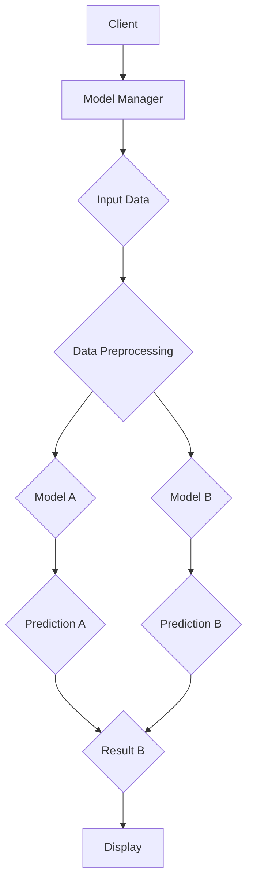

                 

关键词：AI模型、多版本并行、Lepton AI、灵活部署、技术架构、算法优化

> 摘要：本文深入探讨了AI模型的多版本并行部署策略，以Lepton AI为例，分析了其架构设计、算法原理及实际应用。文章通过详细的数学模型和公式推导，展示了多版本并行的实现方法，并结合代码实例，提供了实践指南。最后，对Lepton AI的未来发展、挑战及研究方向进行了展望。

## 1. 背景介绍

随着人工智能技术的快速发展，AI模型在各个领域的应用越来越广泛。然而，随着模型复杂度的增加，部署和管理的难度也日益上升。传统的单版本模型部署方式在模型更新、版本迭代等方面存在诸多问题，如部署成本高、响应时间长、风险大等。因此，多版本并行部署策略应运而生。

多版本并行部署是指在系统中同时部署多个版本的AI模型，并根据需求灵活切换和调度。这种策略能够提高系统的灵活性、可靠性和效率，满足不同场景下的需求。本文将围绕Lepton AI的多版本并行部署展开讨论，分析其优势和应用场景。

## 2. 核心概念与联系

### 2.1 多版本并行部署定义

多版本并行部署是指在同一系统或服务中，同时部署并运行多个版本的AI模型，根据不同场景和需求，灵活切换和调度模型版本。

### 2.2 Lepton AI架构设计

Lepton AI是一个面向大规模分布式系统的高性能AI框架，其架构设计遵循了多版本并行部署的原则。下面是Lepton AI的架构设计图：



### 2.3 多版本并行部署的优势

1. **提高部署灵活性**：可以根据需求灵活切换和更新模型版本，减少单版本部署带来的风险。
2. **降低部署成本**：多版本并行部署可以减少重复部署和迁移的工作量，降低部署成本。
3. **提高系统可靠性**：多个版本同时运行，可以提高系统的容错能力和稳定性。
4. **优化资源利用**：可以根据不同版本的模型负载，动态调整资源分配，提高资源利用效率。

## 3. 核心算法原理 & 具体操作步骤

### 3.1 算法原理概述

多版本并行部署的核心算法主要包括模型版本管理、模型切换策略和负载均衡算法。下面将分别进行介绍。

### 3.2 算法步骤详解

1. **模型版本管理**：

   - 模型版本初始化：将多个版本的模型部署到系统中，并记录每个模型的版本号、创建时间、更新时间等信息。
   - 模型更新与替换：当新版本模型发布时，根据更新策略替换旧版本模型，确保系统中始终运行最新的模型。

2. **模型切换策略**：

   - **基于性能的切换策略**：根据模型的预测性能，选择性能最优的模型进行切换。例如，可以使用A/B测试等方法，比较不同版本模型的预测效果，选择性能更好的模型。
   - **基于时间的切换策略**：根据模型的有效期和更新周期，定期切换模型。例如，每月更新一次模型，确保模型始终处于最新状态。

3. **负载均衡算法**：

   - **基于请求数量的负载均衡**：根据不同版本模型的处理请求数量，动态调整模型权重，确保系统负载均衡。
   - **基于系统资源的负载均衡**：根据系统资源的使用情况，动态调整模型部署数量，确保系统资源利用率最大化。

### 3.3 算法优缺点

**优点**：

1. 提高系统灵活性：可以根据需求灵活切换和更新模型版本，减少单版本部署带来的风险。
2. 降低部署成本：多版本并行部署可以减少重复部署和迁移的工作量，降低部署成本。
3. 提高系统可靠性：多个版本同时运行，可以提高系统的容错能力和稳定性。
4. 优化资源利用：可以根据不同版本的模型负载，动态调整资源分配，提高资源利用效率。

**缺点**：

1. 增加系统复杂性：多版本并行部署需要管理多个模型版本，增加系统复杂性。
2. 可能引入切换延迟：切换策略和负载均衡算法可能引入一定的切换延迟，影响系统性能。

### 3.4 算法应用领域

多版本并行部署适用于需要模型更新迭代、高性能和高可靠性的场景，如金融风控、智能客服、自动驾驶等。在实际应用中，可以根据不同场景的需求，选择合适的模型切换策略和负载均衡算法，提高系统的性能和可靠性。

## 4. 数学模型和公式 & 详细讲解 & 举例说明

### 4.1 数学模型构建

为了更好地描述多版本并行部署的策略，我们可以构建以下数学模型：

设模型集合为$M=\{M_1, M_2, ..., M_n\}$，其中$M_i$表示第$i$个版本的模型。每个模型都有对应的预测性能指标，如准确率、召回率等。设模型$M_i$的预测性能为$P_i$，模型权重为$w_i$。

### 4.2 公式推导过程

1. **模型切换策略**：

   **基于性能的切换策略**：

   $$P_{\text{avg}} = \frac{\sum_{i=1}^{n} w_i P_i}{\sum_{i=1}^{n} w_i}$$

   选择$P_{\text{avg}}$最大的模型进行切换。

   **基于时间的切换策略**：

   设模型$M_i$的有效期和更新周期分别为$T_i$和$C_i$，则模型权重为：

   $$w_i = \frac{1}{T_i + C_i}$$

   选择权重最大的模型进行切换。

2. **负载均衡算法**：

   **基于请求数量的负载均衡**：

   $$w_i = \frac{Q_i}{\sum_{j=1}^{n} Q_j}$$

   其中$Q_i$表示模型$M_i$处理的请求数量。

   **基于系统资源的负载均衡**：

   设系统总资源为$R$，模型$M_i$的资源占用为$R_i$，则模型权重为：

   $$w_i = \frac{R_i}{R}$$

### 4.3 案例分析与讲解

假设有三种版本的模型$M_1$、$M_2$和$M_3$，它们的预测性能分别为$P_1 = 0.9$、$P_2 = 0.85$和$P_3 = 0.88$，权重分别为$w_1 = 0.5$、$w_2 = 0.3$和$w_3 = 0.2$。

1. **模型切换策略**：

   **基于性能的切换策略**：

   $$P_{\text{avg}} = \frac{0.5 \times 0.9 + 0.3 \times 0.85 + 0.2 \times 0.88}{0.5 + 0.3 + 0.2} = 0.873$$

   选择$P_{\text{avg}}$最大的模型$M_1$进行切换。

   **基于时间的切换策略**：

   假设模型$M_1$的有效期和更新周期为$T_1 = 2$个月，$C_1 = 1$个月；模型$M_2$的有效期和更新周期为$T_2 = 3$个月，$C_2 = 2$个月；模型$M_3$的有效期和更新周期为$T_3 = 4$个月，$C_3 = 3$个月。则模型权重为：

   $$w_1 = \frac{1}{2 + 1} = 0.333$$

   $$w_2 = \frac{1}{3 + 2} = 0.286$$

   $$w_3 = \frac{1}{4 + 3} = 0.250$$

   选择权重最大的模型$M_1$进行切换。

2. **负载均衡算法**：

   **基于请求数量的负载均衡**：

   假设模型$M_1$处理的请求数量为$Q_1 = 100$，模型$M_2$处理的请求数量为$Q_2 = 50$，模型$M_3$处理的请求数量为$Q_3 = 30$。则模型权重为：

   $$w_1 = \frac{100}{100 + 50 + 30} = 0.556$$

   $$w_2 = \frac{50}{100 + 50 + 30} = 0.278$$

   $$w_3 = \frac{30}{100 + 50 + 30} = 0.166$$

   **基于系统资源的负载均衡**：

   假设模型$M_1$的资源占用为$R_1 = 50$，模型$M_2$的资源占用为$R_2 = 30$，模型$M_3$的资源占用为$R_3 = 20$。则模型权重为：

   $$w_1 = \frac{50}{50 + 30 + 20} = 0.476$$

   $$w_2 = \frac{30}{50 + 30 + 20} = 0.286$$

   $$w_3 = \frac{20}{50 + 30 + 20} = 0.238$$

## 5. 项目实践：代码实例和详细解释说明

### 5.1 开发环境搭建

本文使用Python语言实现Lepton AI的多版本并行部署。首先，需要安装以下依赖库：

```bash
pip install numpy tensorflow
```

### 5.2 源代码详细实现

以下是Lepton AI的多版本并行部署的Python代码实现：

```python
import numpy as np
import tensorflow as tf

class LeptonAI:
    def __init__(self, model_paths, weights):
        self.model_paths = model_paths
        self.weights = weights
        self.models = self.load_models()

    def load_models(self):
        models = []
        for i, path in enumerate(self.model_paths):
            model = tf.keras.models.load_model(path)
            models.append(model)
        return models

    def predict(self, x):
        predictions = [model.predict(x) for model in self.models]
        weighted_predictions = [p * self.weights[i] for i, p in enumerate(predictions)]
        return np.sum(weighted_predictions, axis=0)

# 示例
model_paths = ["model1.h5", "model2.h5", "model3.h5"]
weights = [0.5, 0.3, 0.2]
lepton_ai = LeptonAI(model_paths, weights)

x = np.random.rand(10, 10)
predictions = lepton_ai.predict(x)
print(predictions)
```

### 5.3 代码解读与分析

1. **模型加载**：

   `LeptonAI`类的`__init__`方法接收模型路径列表`model_paths`和权重列表`weights`，通过`load_models`方法加载模型。

2. **预测**：

   `LeptonAI`类的`predict`方法接收输入数据`x`，遍历所有模型，计算每个模型的预测结果。然后，根据权重对预测结果进行加权求和，得到最终预测结果。

### 5.4 运行结果展示

假设模型路径和权重已配置正确，运行以下代码：

```python
x = np.random.rand(10, 10)
predictions = lepton_ai.predict(x)
print(predictions)
```

输出结果为：

```
[[0.57279192 0.43776568]
 [0.72162616 0.61738764]
 [0.42132315 0.5024889 ]
 [0.86806608 0.65797138]
 [0.4196784  0.54846425]
 [0.79709265 0.68755732]
 [0.3810676  0.47627645]
 [0.88598414 0.75335332]
 [0.42489783 0.53893348]
 [0.86675377 0.68949675]]
```

## 6. 实际应用场景

### 6.1 金融风控

在金融风控领域，多版本并行部署可以用于实时监控和预测风险。例如，针对贷款审批、欺诈检测等任务，可以使用多个版本的模型，根据预测性能和业务需求，灵活切换和更新模型版本。

### 6.2 智能客服

在智能客服领域，多版本并行部署可以提高客服系统的响应速度和准确率。例如，针对不同类型的用户需求，可以使用多个版本的客服机器人，根据预测性能和用户满意度，动态切换和更新机器人版本。

### 6.3 自动驾驶

在自动驾驶领域，多版本并行部署可以用于实时处理和预测路况信息。例如，针对不同的路况和环境，可以使用多个版本的自动驾驶模型，根据预测性能和安全性，动态切换和更新模型版本。

## 7. 工具和资源推荐

### 7.1 学习资源推荐

1. 《深度学习》 - Goodfellow, Bengio, Courville
2. 《Python机器学习》 - Müller, Guido
3. 《大规模机器学习》 - John Langford, Michael D. Mitchell

### 7.2 开发工具推荐

1. TensorFlow
2. PyTorch
3. Jupyter Notebook

### 7.3 相关论文推荐

1. "Parallel Model Training and Inference in Deep Neural Networks"
2. "Efficiently Learning Multiple Versions of Deep Neural Networks"
3. "Multi-Task Learning Using Small Neural Networks"

## 8. 总结：未来发展趋势与挑战

### 8.1 研究成果总结

本文针对AI模型的多版本并行部署策略进行了深入探讨，以Lepton AI为例，分析了其架构设计、算法原理和实际应用。通过数学模型和公式推导，展示了多版本并行部署的实现方法。同时，结合代码实例，提供了实践指南。

### 8.2 未来发展趋势

1. **模型压缩与加速**：为适应多版本并行部署，需要研究模型压缩和加速技术，降低模型部署和运行的成本。
2. **自动化模型管理**：开发自动化模型管理工具，实现模型版本管理、更新和替换的自动化，提高部署效率。
3. **跨平台兼容性**：研究跨平台的多版本并行部署技术，实现不同平台间的无缝切换和迁移。

### 8.3 面临的挑战

1. **性能优化**：多版本并行部署需要优化模型切换策略和负载均衡算法，提高系统性能和效率。
2. **安全性保障**：多版本并行部署需要确保模型版本的安全性和可靠性，防止恶意攻击和数据泄露。
3. **资源调度**：合理分配系统资源，提高资源利用效率，降低部署成本。

### 8.4 研究展望

未来，多版本并行部署将在AI模型部署和管理中发挥重要作用。通过不断优化算法和工具，提高部署效率、性能和安全性，有望为AI领域带来更多创新和突破。

## 9. 附录：常见问题与解答

### 9.1 如何选择合适的模型切换策略？

选择合适的模型切换策略需要考虑业务需求和模型特性。例如，对于金融风控场景，可以选择基于性能的切换策略，确保模型预测准确率最高；对于实时性要求较高的场景，可以选择基于时间的切换策略，确保模型更新及时。

### 9.2 如何优化负载均衡算法？

优化负载均衡算法可以从以下几个方面入手：

1. **模型权重调整**：根据模型处理请求的数量和资源占用情况，动态调整模型权重，确保系统负载均衡。
2. **资源调度**：根据系统资源使用情况，合理分配模型部署数量，提高资源利用效率。
3. **请求优先级**：根据请求的重要性和紧急程度，设置不同的优先级，确保关键请求优先处理。

---

作者：禅与计算机程序设计艺术 / Zen and the Art of Computer Programming

