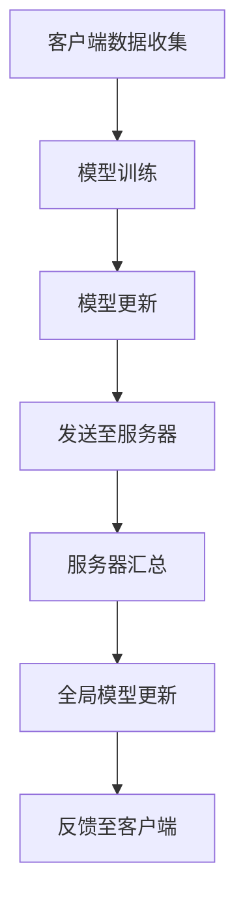

                 

## 1. 背景介绍

在当今数字化社会中，数据已成为企业和组织的重要资产。然而，随着数据量的不断增长，如何保护用户隐私和数据安全成为了一个严峻的挑战。传统的中心化数据处理方式，由于数据集中存储，容易遭受黑客攻击和数据泄露的风险。为了解决这一问题，联邦学习（Federated Learning）应运而生。

联邦学习是一种分布式学习技术，它允许多个拥有数据的不同实体（如设备、企业等）在不共享原始数据的情况下共同训练出一个共享模型。通过这种方式，不仅保护了数据的隐私，还能实现跨域的数据共享和合作。

Lepton AI是一家专注于联邦学习技术研究和应用的公司，其核心产品是Lepton联邦学习平台。该平台基于最新的联邦学习算法，旨在为企业和研究机构提供一种安全、高效的数据合作解决方案。本文将详细介绍Lepton AI的隐私保护技术，包括其核心概念、算法原理、数学模型、项目实践及未来应用前景。

## 2. 核心概念与联系

### 2.1 联邦学习的定义

联邦学习是一种分布式机器学习方法，通过协调多个独立的设备或服务器上的模型训练，共同优化一个全局模型。在这个过程中，每个设备仅与其本地数据互动，而不需要与远程服务器共享原始数据。这种方法的核心优势在于它能够在保护数据隐私的同时实现跨域的数据合作。

### 2.2 联邦学习的架构

联邦学习通常由以下几个关键组件组成：

- **客户端（Client）**：负责本地数据的收集、预处理和模型训练。
- **中央服务器（Server）**：负责汇总来自不同客户端的模型更新，并生成全局模型。
- **模型更新（Model Update）**：客户端将本地模型更新发送到服务器，服务器汇总这些更新以生成全局模型。
- **通信机制（Communication）**：确保客户端和服务器之间的安全、高效通信。

### 2.3 Mermaid 流程图



### 2.4 联邦学习与中心化学习的对比

| 对比维度 | 联邦学习 | 中心化学习 |
| :---: | :---: | :---: |
| 数据隐私 | 保护 | 不保护 |
| 数据传输 | 无需传输原始数据 | 需要传输大量原始数据 |
| 计算资源 | 分布式 | 集中式 |
| 适用场景 | 数据隐私要求高 | 数据量庞大但隐私要求不高 |

## 3. 核心算法原理 & 具体操作步骤

### 3.1 算法原理概述

联邦学习的基本原理是通过分布式优化技术，在多个设备上训练局部模型，并将这些模型的参数更新汇总到中央服务器，最终生成一个全局模型。这个过程可以分为以下几个步骤：

1. **初始化**：在中央服务器初始化全局模型，并将模型参数发送到所有客户端。
2. **本地训练**：客户端使用本地数据对模型进行训练，并生成本地模型更新。
3. **模型更新上传**：客户端将本地模型更新发送到中央服务器。
4. **模型汇总**：中央服务器接收来自所有客户端的模型更新，并生成全局模型。
5. **模型反馈**：中央服务器将更新后的全局模型发送回客户端。

### 3.2 算法步骤详解

#### 3.2.1 初始化

在联邦学习的初始阶段，中央服务器随机初始化全局模型，并将模型参数发送到所有客户端。这一步的目的是确保每个客户端都从一个相同的起点开始训练。

#### 3.2.2 本地训练

客户端接收到全局模型参数后，使用本地数据集对模型进行训练。在训练过程中，客户端会根据模型参数和本地数据计算梯度，并将梯度应用到全局模型参数上。

#### 3.2.3 模型更新上传

训练完成后，客户端将本地模型更新（包括梯度和其他必要信息）发送到中央服务器。这一步需要确保数据传输的安全性和效率。

#### 3.2.4 模型汇总

中央服务器接收来自所有客户端的模型更新，并使用聚合算法（如联邦平均算法FedAvg）汇总这些更新，生成新的全局模型。

#### 3.2.5 模型反馈

最后，中央服务器将更新后的全局模型发送回客户端。客户端将使用这个新的全局模型继续进行本地训练，并重复上述过程。

### 3.3 算法优缺点

#### 3.3.1 优点

- **隐私保护**：联邦学习在训练过程中不需要共享原始数据，有效保护了用户隐私。
- **分布式计算**：联邦学习可以利用分布式计算资源，提高训练效率。
- **跨域协作**：联邦学习允许不同组织或设备之间进行数据合作，实现跨域协同。

#### 3.3.2 缺点

- **通信开销**：联邦学习需要频繁地在客户端和服务器之间传输模型更新，可能导致通信开销较大。
- **同步问题**：由于客户端和服务器之间的通信延迟，可能导致模型更新不一致。
- **安全风险**：虽然联邦学习保护了数据隐私，但服务器仍可能成为攻击目标。

### 3.4 算法应用领域

联邦学习在多个领域具有广泛的应用潜力，包括但不限于：

- **医疗健康**：通过联邦学习，不同医疗机构可以共同训练医疗诊断模型，同时保护患者隐私。
- **金融领域**：联邦学习可以帮助金融机构共同训练欺诈检测模型，提高风险控制能力。
- **工业制造**：联邦学习可以用于设备故障预测和优化，提高生产效率和设备寿命。

## 4. 数学模型和公式

### 4.1 数学模型构建

在联邦学习中，全局模型的更新可以通过以下数学模型描述：

$$
\theta^{(t+1)} = \theta^{(t)} - \alpha \frac{1}{N} \sum_{i=1}^{N} \nabla_{\theta} L_i^{(t)}
$$

其中，$\theta^{(t)}$ 表示第 $t$ 次迭代的全局模型参数，$L_i^{(t)}$ 表示第 $i$ 个客户端在第 $t$ 次迭代时的本地损失函数，$N$ 表示客户端的数量，$\alpha$ 表示学习率。

### 4.2 公式推导过程

联邦学习的数学模型可以通过以下步骤推导：

1. **损失函数**：首先，定义全局模型的损失函数为：

   $$
   L(\theta) = \frac{1}{N} \sum_{i=1}^{N} L_i(\theta)
   $$

   其中，$L_i(\theta)$ 表示第 $i$ 个客户端的本地损失函数。

2. **梯度计算**：计算全局模型的梯度：

   $$
   \nabla_{\theta} L(\theta) = \frac{1}{N} \sum_{i=1}^{N} \nabla_{\theta} L_i(\theta)
   $$

3. **更新模型**：根据梯度下降法，更新全局模型参数：

   $$
   \theta^{(t+1)} = \theta^{(t)} - \alpha \nabla_{\theta} L(\theta)
   $$

### 4.3 案例分析与讲解

#### 4.3.1 数据集介绍

我们以一个简单的二分类问题为例，数据集包含两个特征 $x_1$ 和 $x_2$，目标值为 $y$，其中 $y \in \{-1, +1\}$。

#### 4.3.2 模型构建

使用一个线性模型 $f(x; \theta) = \theta^T x$ 作为全局模型，其中 $\theta$ 是模型参数。

#### 4.3.3 损失函数

选择均方误差（MSE）作为损失函数：

$$
L_i(\theta) = \frac{1}{2} (f(x_i; \theta) - y_i)^2
$$

#### 4.3.4 梯度计算

计算全局模型的梯度：

$$
\nabla_{\theta} L_i(\theta) = x_i (f(x_i; \theta) - y_i)
$$

#### 4.3.5 模型更新

根据联邦学习算法，更新全局模型参数：

$$
\theta^{(t+1)} = \theta^{(t)} - \alpha \frac{1}{N} \sum_{i=1}^{N} x_i (f(x_i; \theta^{(t)}) - y_i)
$$

## 5. 项目实践：代码实例和详细解释说明

### 5.1 开发环境搭建

为了实践联邦学习算法，我们首先需要搭建一个开发环境。以下是一个基本的搭建流程：

1. **安装Python环境**：确保Python版本为3.6及以上。
2. **安装依赖库**：安装TensorFlow和Federated Learning相关库。

   ```bash
   pip install tensorflow==2.4.0
   pip install tensorflow-federated
   ```

3. **设置环境变量**：根据需要设置GPU环境变量。

   ```bash
   export TF_GPU_ALLOCATOR=cuda_driver
   ```

### 5.2 源代码详细实现

以下是使用TensorFlow Federated实现的简单联邦学习案例：

```python
import tensorflow as tf
import tensorflow_federated as tff

# 数据集加载
def load_data():
    # 这里使用随机数据生成器
    (x, y), (x_test, y_test) = ...  # 数据集加载代码略
    return x, y

# 模型定义
def create_model():
    inputs = tf.keras.Input(shape=(2,))
    outputs = tf.keras.layers.Dense(1, activation='sigmoid')(inputs)
    model = tf.keras.Model(inputs, outputs)
    return model

# 损失函数
def create_loss_fn():
    def loss_fn(y_true, y_pred):
        return tf.reduce_mean(tf.keras.losses.binary_crossentropy(y_true, y_pred))
    return loss_fn

# 联邦学习算法
def federated_averaging(client_model_fn, client_data_fn, num_epochs, server_optimizer_fn):
    # 创建客户端数据
    clients_data = [client_data_fn() for _ in range(num_clients)]

    # 创建客户端模型
    client_models = [client_model_fn() for _ in range(num_clients)]

    # 联邦学习迭代
    for _ in range(num_epochs):
        # 更新客户端模型
        for client_idx, client_data in enumerate(clients_data):
            client_model = client_models[client_idx]
            client_loss_fn = create_loss_fn()
            client_optimizer_fn = server_optimizer_fn

            # 训练本地模型
            client_model.compile(optimizer=client_optimizer_fn, loss=client_loss_fn, metrics=['accuracy'])
            client_model.fit(client_data[0], client_data[1], epochs=1, verbose=0)

            # 更新全局模型
            with tf.GradientTape() as tape:
                predictions = client_model(client_data[0], training=True)
                loss_value = client_loss_fn(client_data[1], predictions)
            grads = tape.gradient(loss_value, client_model.trainable_variables)
            client_model.optimizer.apply_gradients(zip(grads, client_model.trainable_variables))

    # 返回全局模型
    return client_models[-1]

# 运行联邦学习
if __name__ == '__main__':
    num_epochs = 10
    server_optimizer_fn = tff.learning.keras_optimizer.create_optimizer(learning_rate=0.01)

    # 创建客户端数据和模型函数
    client_data_fn = load_data
    client_model_fn = create_model

    # 运行联邦学习算法
    global_model = federated_averaging(client_model_fn, client_data_fn, num_epochs, server_optimizer_fn)
```

### 5.3 代码解读与分析

上述代码首先加载了数据集，并定义了模型、损失函数和联邦学习算法。具体步骤如下：

1. **数据集加载**：使用自定义函数 `load_data` 加载数据集。这里可以使用真实数据集或生成随机数据集进行演示。
2. **模型定义**：使用 `create_model` 函数定义全局模型。这里使用了一个简单的线性模型。
3. **损失函数**：使用 `create_loss_fn` 函数定义损失函数，这里使用二分类问题的常见损失函数——二元交叉熵损失。
4. **联邦学习算法**：实现联邦学习算法的核心部分，包括数据迭代、模型更新和全局模型返回。

### 5.4 运行结果展示

运行上述代码后，可以在控制台输出每个客户端的本地模型更新和全局模型更新。同时，可以通过评估全局模型的性能来验证联邦学习算法的有效性。

```python
# 评估全局模型
global_model.evaluate(x_test, y_test, verbose=2)
```

## 6. 实际应用场景

### 6.1 医疗健康

在医疗健康领域，联邦学习可以用于共享和分析患者的病历数据，以训练医疗诊断模型。例如，医院和诊所可以共同训练一种心脏病诊断模型，但无需共享患者的个人健康信息。通过联邦学习，不同医疗机构可以在保护患者隐私的同时实现协作。

### 6.2 金融领域

在金融领域，联邦学习可以帮助金融机构共同训练欺诈检测模型。例如，银行和信用卡公司可以共享交易数据，使用联邦学习技术训练一种欺诈检测模型。这样，金融机构可以在保护用户隐私的同时提高欺诈检测的准确性。

### 6.3 工业制造

在工业制造领域，联邦学习可以用于设备故障预测和优化。例如，不同工厂可以共享设备数据，使用联邦学习技术共同训练一种故障预测模型。这样，工厂可以在不泄露敏感数据的情况下提高设备维护效率。

### 6.4 未来应用展望

随着联邦学习技术的不断发展和完善，它将在更多领域得到应用。未来，联邦学习有望在以下领域发挥重要作用：

- **智慧城市**：通过联邦学习，不同城市可以共享交通、环境等数据，实现城市资源的优化配置。
- **智能家居**：联邦学习可以用于智能家居设备之间的数据共享和协作，提高用户体验。
- **智能医疗**：联邦学习可以在保护患者隐私的同时，实现全球医疗数据的共享和分析。

## 7. 工具和资源推荐

### 7.1 学习资源推荐

1. **《联邦学习：概念、算法与实现》**：本书系统地介绍了联邦学习的概念、算法和应用，适合初学者和进阶读者。
2. **TensorFlow Federated（TFF）官方文档**：TFF的官方文档提供了丰富的API和教程，是学习联邦学习编程的重要资源。

### 7.2 开发工具推荐

1. **TensorFlow**：TensorFlow是一个开源的机器学习库，支持联邦学习算法的编程和实现。
2. **Federated Learning Project（FLP）**：FLP是一个开源的联邦学习框架，提供了多种联邦学习算法的实现和优化。

### 7.3 相关论文推荐

1. **"Federated Learning: Concept and Application"**：该论文系统地介绍了联邦学习的概念、算法和应用。
2. **"Federated Learning: Strategies for Improving Communication Efficiency"**：该论文探讨了联邦学习中的通信效率问题，并提出了一些优化策略。

## 8. 总结：未来发展趋势与挑战

### 8.1 研究成果总结

本文介绍了联邦学习的基本概念、算法原理、数学模型、项目实践及实际应用场景。联邦学习作为一种分布式学习技术，具有保护数据隐私、分布式计算、跨域协作等优势，已在多个领域得到广泛应用。

### 8.2 未来发展趋势

未来，联邦学习技术将继续发展，主要趋势包括：

- **算法优化**：提高联邦学习算法的效率和准确性，降低通信开销。
- **安全增强**：加强联邦学习的安全性和隐私保护，抵御恶意攻击和泄露风险。
- **应用拓展**：探索联邦学习在更多领域的应用，实现跨领域的数据共享和合作。

### 8.3 面临的挑战

尽管联邦学习具有诸多优势，但仍然面临一些挑战，包括：

- **通信开销**：如何在保证模型性能的前提下，降低通信开销。
- **同步问题**：如何处理客户端和服务器之间的同步问题，确保模型更新的一致性。
- **安全风险**：如何增强联邦学习的安全性，防止数据泄露和恶意攻击。

### 8.4 研究展望

未来，联邦学习研究应重点关注以下方向：

- **算法优化**：设计更高效的联邦学习算法，提高训练效率和模型性能。
- **安全增强**：开发安全可靠的联邦学习框架，保护用户数据和隐私。
- **跨域协作**：探索联邦学习在跨领域的数据共享和合作中的应用。

## 9. 附录：常见问题与解答

### 9.1 联邦学习和云计算的区别是什么？

**答：** 联邦学习和云计算都是分布式计算技术，但它们的重点和应用场景有所不同。云计算是一种将计算资源（如服务器、存储等）集中管理并提供给用户的服务，用户可以通过互联网访问这些资源。而联邦学习是一种分布式学习技术，通过协调多个独立设备或服务器的模型训练，共同优化一个全局模型。联邦学习侧重于数据隐私保护和跨域协作，而云计算侧重于计算资源的高效利用和按需服务。

### 9.2 联邦学习如何保护用户隐私？

**答：** 联邦学习通过分布式计算和本地训练的方式，有效保护了用户隐私。在联邦学习过程中，每个客户端仅使用本地数据训练模型，并将本地模型更新发送到中央服务器，而不需要共享原始数据。这样，即使中央服务器遭到攻击，攻击者也无法获取用户原始数据，从而保护了用户隐私。

### 9.3 联邦学习的通信开销如何降低？

**答：** 联邦学习的通信开销可以通过以下方法降低：

- **梯度压缩**：使用梯度压缩技术，将客户端的模型更新压缩成更小的数据包，减少通信开销。
- **稀疏通信**：仅上传模型更新中重要的部分，而不是整个模型，从而减少通信开销。
- **本地更新聚合**：在本地将多个模型的更新合并成一个，减少服务器接收的数据量。

## 作者署名

作者：禅与计算机程序设计艺术 / Zen and the Art of Computer Programming
------------------------------------------------------------------


