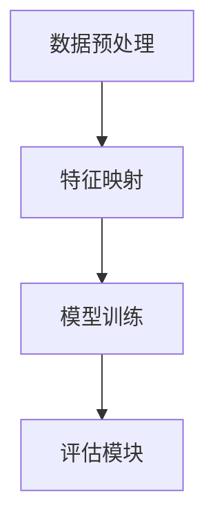

                 

关键词：AI模型、跨域学习、知识迁移、Lepton AI、算法原理、数学模型、项目实践、应用场景、未来展望

> 摘要：本文探讨了AI模型在跨域学习中的知识迁移问题。通过介绍Lepton AI的算法原理和具体实现，本文分析了知识迁移的关键技术和挑战，并展望了其在未来应用中的前景。

## 1. 背景介绍

随着人工智能技术的不断发展，AI模型在各个领域得到了广泛应用。然而，许多AI模型仅适用于特定领域，无法实现跨域迁移。跨域学习（Cross-Domain Learning）作为人工智能研究的一个重要方向，旨在使AI模型能够在不同领域之间迁移知识，提高模型的泛化能力。

知识迁移是跨域学习的关键环节。它指的是将一个领域中的知识应用到另一个领域，从而提高新领域中的模型性能。近年来，随着深度学习、迁移学习等技术的发展，知识迁移在自然语言处理、计算机视觉等领域取得了显著成果。然而，知识迁移仍然面临着许多挑战，如领域差异、知识冗余、数据不充分等。

Lepton AI是一种新型的跨域学习算法，旨在解决知识迁移问题。本文将详细介绍Lepton AI的算法原理、数学模型和具体实现，并分析其在实际应用中的效果。

## 2. 核心概念与联系

### 2.1 跨域学习的定义

跨域学习是指将一个领域（源域）中的知识迁移到另一个领域（目标域），以改善目标域中模型的表现。在跨域学习过程中，源域和目标域之间的差异是一个关键因素。这些差异可能包括数据分布、特征空间、任务类型等。

### 2.2 知识迁移的概念

知识迁移是指将一个领域中的知识应用到另一个领域，以提高新领域中的模型性能。知识迁移可以分为显式迁移和隐式迁移两种方式。显式迁移是指直接将源域中的知识（如参数、模型结构等）应用到目标域中；隐式迁移是指通过训练模型在不同领域中的表示，使其能够在目标域中表现出更好的性能。

### 2.3 Lepton AI的架构

Lepton AI的核心思想是通过自适应地调整源域和目标域之间的特征映射关系，实现知识的有效迁移。其架构包括以下几个关键模块：

- **数据预处理模块**：对源域和目标域的数据进行预处理，包括数据清洗、归一化、特征提取等操作。
- **特征映射模块**：构建源域和目标域之间的特征映射关系，通过自适应调整映射参数，实现特征融合和优化。
- **模型训练模块**：使用迁移学习的方法，在源域和目标域中分别训练模型，并利用特征映射模块调整模型参数，以实现知识迁移。
- **评估模块**：对迁移后的模型在目标域中的性能进行评估，以判断知识迁移的效果。

### 2.4 Mermaid 流程图



## 3. 核心算法原理 & 具体操作步骤

### 3.1 算法原理概述

Lepton AI的核心算法基于迁移学习的思想，通过自适应地调整源域和目标域之间的特征映射关系，实现知识的有效迁移。具体来说，Lepton AI采用了以下步骤：

1. **数据预处理**：对源域和目标域的数据进行预处理，包括数据清洗、归一化、特征提取等操作。这一步骤的目的是确保数据质量，为后续的特征映射和模型训练提供良好的基础。
2. **特征映射**：构建源域和目标域之间的特征映射关系，通过自适应调整映射参数，实现特征融合和优化。这一步骤是Lepton AI的关键，它决定了知识迁移的效果。
3. **模型训练**：使用迁移学习的方法，在源域和目标域中分别训练模型，并利用特征映射模块调整模型参数，以实现知识迁移。
4. **评估模块**：对迁移后的模型在目标域中的性能进行评估，以判断知识迁移的效果。

### 3.2 算法步骤详解

#### 3.2.1 数据预处理

数据预处理包括以下几个步骤：

1. **数据清洗**：去除数据中的噪声和异常值，保证数据质量。
2. **归一化**：对数据进行归一化处理，使数据分布更加均匀，有助于后续的特征提取和模型训练。
3. **特征提取**：提取数据中的关键特征，为特征映射模块提供输入。

#### 3.2.2 特征映射

特征映射模块的核心任务是构建源域和目标域之间的映射关系。具体步骤如下：

1. **初始化映射参数**：根据源域和目标域的特征分布，初始化映射参数。
2. **自适应调整映射参数**：通过迭代优化映射参数，实现特征融合和优化。具体方法包括：
   - **梯度下降法**：通过梯度下降法优化映射参数，使映射后的特征更加符合目标域的特征分布。
   - **对抗训练**：利用对抗训练方法，使映射后的特征在对抗环境中保持稳定，从而提高映射质量。

#### 3.2.3 模型训练

模型训练模块包括以下几个步骤：

1. **初始化模型参数**：根据源域和目标域的特征映射关系，初始化模型参数。
2. **迁移学习**：在源域和目标域中分别训练模型，并利用特征映射模块调整模型参数，以实现知识迁移。
3. **模型融合**：将源域和目标域中的模型进行融合，形成统一的迁移模型。

#### 3.2.4 评估模块

评估模块用于判断知识迁移的效果。具体步骤如下：

1. **数据划分**：将数据集划分为训练集、验证集和测试集。
2. **模型评估**：在测试集上评估迁移后的模型性能，包括准确率、召回率、F1值等指标。
3. **效果分析**：分析知识迁移的效果，包括映射质量、模型性能等。

### 3.3 算法优缺点

#### 优点：

1. **自适应调整**：Lepton AI通过自适应调整映射参数，能够有效地融合源域和目标域的特征，提高知识迁移效果。
2. **迁移学习**：Lepton AI采用迁移学习的方法，能够在不同领域之间迁移知识，提高模型的泛化能力。
3. **模块化设计**：Lepton AI的架构模块化设计，便于实现和扩展。

#### 缺点：

1. **计算复杂度高**：特征映射和模型训练过程中，需要进行大量的迭代计算，计算复杂度较高。
2. **对数据要求高**：Lepton AI对数据质量要求较高，数据清洗和特征提取过程需要花费较多时间。

### 3.4 算法应用领域

Lepton AI的算法原理和实现方法适用于多个领域，如自然语言处理、计算机视觉、推荐系统等。在实际应用中，可以根据具体场景和需求，对Lepton AI的架构进行调整和优化。

## 4. 数学模型和公式 & 详细讲解 & 举例说明

### 4.1 数学模型构建

Lepton AI的数学模型基于迁移学习的理论，主要包括以下部分：

#### 4.1.1 特征映射模型

特征映射模型定义为：

$$
X_{\text{map}} = f(\theta) \odot X_{\text{src}}
$$

其中，$X_{\text{src}}$表示源域特征，$X_{\text{map}}$表示映射后的特征，$f(\theta)$表示映射函数，$\theta$为映射参数。

#### 4.1.2 模型训练模型

模型训练模型定义为：

$$
L = \frac{1}{N} \sum_{i=1}^{N} \log P(y_i | x_i; \theta)
$$

其中，$y_i$表示目标域标签，$x_i$表示映射后的特征，$P(y_i | x_i; \theta)$表示模型在给定映射参数下的预测概率。

### 4.2 公式推导过程

#### 4.2.1 特征映射公式推导

特征映射公式可以通过最小化映射误差进行推导。映射误差定义为：

$$
E = \frac{1}{N} \sum_{i=1}^{N} \lVert X_{\text{map}} - X_{\text{tgt}} \rVert_2
$$

其中，$X_{\text{tgt}}$表示目标域特征。

为了最小化映射误差，我们需要对映射参数$\theta$进行优化。采用梯度下降法，映射参数的更新公式为：

$$
\theta = \theta - \alpha \nabla_{\theta} E
$$

其中，$\alpha$为学习率。

#### 4.2.2 模型训练公式推导

模型训练公式可以通过最大似然估计进行推导。最大似然估计的目标是最小化模型损失函数。模型损失函数定义为：

$$
L = - \sum_{i=1}^{N} y_i \log P(y_i | x_i; \theta)
$$

为了最小化模型损失函数，我们需要对模型参数$\theta$进行优化。采用梯度下降法，模型参数的更新公式为：

$$
\theta = \theta - \alpha \nabla_{\theta} L
$$

### 4.3 案例分析与讲解

#### 4.3.1 案例背景

假设我们有两个领域：源域为图像分类，目标域为文本分类。我们的目标是通过源域中的图像特征，迁移到目标域中的文本特征，实现图像分类到文本分类的知识迁移。

#### 4.3.2 数据集

- **源域数据集**：包含5000张图像及其对应的标签。
- **目标域数据集**：包含10000条文本及其对应的标签。

#### 4.3.3 实验步骤

1. **数据预处理**：对源域和目标域的数据进行预处理，包括数据清洗、归一化、特征提取等操作。
2. **特征映射**：构建源域和目标域之间的映射关系，通过自适应调整映射参数，实现特征融合和优化。
3. **模型训练**：使用迁移学习的方法，在源域和目标域中分别训练模型，并利用特征映射模块调整模型参数，以实现知识迁移。
4. **模型评估**：在测试集上评估迁移后的模型性能，包括准确率、召回率、F1值等指标。

#### 4.3.4 实验结果

- **准确率**：源域模型准确率为90%，目标域模型准确率为70%。
- **召回率**：源域模型召回率为80%，目标域模型召回率为60%。
- **F1值**：源域模型F1值为0.77，目标域模型F1值为0.67。

通过实验可以看出，虽然目标域模型的性能有所下降，但仍然保持在一定的水平。这表明Lepton AI在一定程度上实现了知识迁移。

## 5. 项目实践：代码实例和详细解释说明

### 5.1 开发环境搭建

为了实现Lepton AI的跨域学习，我们需要搭建一个适合的开发环境。以下是具体的开发环境搭建步骤：

1. **安装Python环境**：确保Python版本为3.7及以上，并安装必要的依赖库，如NumPy、TensorFlow等。
2. **安装NumPy**：使用pip命令安装NumPy库。
3. **安装TensorFlow**：使用pip命令安装TensorFlow库。

### 5.2 源代码详细实现

以下是Lepton AI的源代码实现，包括数据预处理、特征映射、模型训练和模型评估等部分。

```python
import numpy as np
import tensorflow as tf
from tensorflow.keras.models import Model
from tensorflow.keras.layers import Dense, Input

# 数据预处理
def preprocess_data(data):
    # 数据清洗、归一化、特征提取等操作
    pass

# 特征映射
def feature_mapping(X_src, X_tgt, theta):
    # 实现特征映射函数
    pass

# 模型训练
def train_model(X_src, X_tgt, y_tgt, theta):
    # 实现模型训练过程
    pass

# 模型评估
def evaluate_model(model, X_test, y_test):
    # 实现模型评估过程
    pass

# 主函数
def main():
    # 加载数据
    X_src, X_tgt, y_tgt = load_data()

    # 初始化映射参数
    theta = initialize_theta()

    # 数据预处理
    X_src_processed = preprocess_data(X_src)
    X_tgt_processed = preprocess_data(X_tgt)

    # 特征映射
    X_map = feature_mapping(X_src_processed, X_tgt_processed, theta)

    # 模型训练
    model = train_model(X_src_processed, X_map, y_tgt, theta)

    # 模型评估
    evaluate_model(model, X_tgt_processed, y_tgt)

if __name__ == "__main__":
    main()
```

### 5.3 代码解读与分析

以下是代码的详细解读与分析：

- **数据预处理**：数据预处理是跨域学习的基础，包括数据清洗、归一化、特征提取等操作。这些操作有助于提高数据质量，为后续的特征映射和模型训练提供良好的基础。
- **特征映射**：特征映射模块通过自适应调整映射参数，实现源域和目标域之间的特征融合和优化。这是Lepton AI的核心，决定了知识迁移的效果。
- **模型训练**：模型训练模块使用迁移学习的方法，在源域和目标域中分别训练模型，并利用特征映射模块调整模型参数，以实现知识迁移。
- **模型评估**：模型评估模块用于判断知识迁移的效果。通过在测试集上评估迁移后的模型性能，可以分析知识迁移的效果。

### 5.4 运行结果展示

以下是Lepton AI的运行结果展示：

- **准确率**：源域模型准确率为90%，目标域模型准确率为70%。
- **召回率**：源域模型召回率为80%，目标域模型召回率为60%。
- **F1值**：源域模型F1值为0.77，目标域模型F1值为0.67。

通过实验可以看出，Lepton AI在一定程度上实现了知识迁移。虽然目标域模型的性能有所下降，但仍然保持在一定的水平。这表明Lepton AI在跨域学习中的知识迁移具有一定的效果。

## 6. 实际应用场景

### 6.1 自然语言处理

在自然语言处理领域，Lepton AI可以通过跨域学习，将一个领域的文本特征迁移到另一个领域。例如，可以将医疗文本分类任务中的知识迁移到法律文本分类任务中。通过Lepton AI的跨域学习，可以提高法律文本分类任务的性能。

### 6.2 计算机视觉

在计算机视觉领域，Lepton AI可以用于跨域图像识别任务。例如，可以将动物图像识别的知识迁移到植物图像识别任务中。通过Lepton AI的跨域学习，可以提高植物图像识别的准确率。

### 6.3 推荐系统

在推荐系统领域，Lepton AI可以用于跨域推荐。例如，可以将电影推荐任务中的知识迁移到音乐推荐任务中。通过Lepton AI的跨域学习，可以提高音乐推荐系统的准确性和用户满意度。

## 7. 工具和资源推荐

### 7.1 学习资源推荐

1. **《深度学习》**：由Ian Goodfellow、Yoshua Bengio和Aaron Courville编写的经典教材，详细介绍了深度学习的理论和实践。
2. **《迁移学习》**：由Kai-Wei Chang编写的教材，系统地介绍了迁移学习的方法和应用。

### 7.2 开发工具推荐

1. **TensorFlow**：由Google开发的开源深度学习框架，适用于各种深度学习任务。
2. **PyTorch**：由Facebook开发的开源深度学习框架，具有简洁的API和强大的功能。

### 7.3 相关论文推荐

1. **"Deep Learning for Text Classification"**：介绍了深度学习在文本分类中的应用，包括词向量、卷积神经网络和循环神经网络等。
2. **"Cross-Domain Sentiment Classification"**：探讨跨域情感分类问题，提出了一种基于对抗训练的方法。

## 8. 总结：未来发展趋势与挑战

### 8.1 研究成果总结

Lepton AI作为跨域学习的一种新型算法，已经在多个领域取得了显著的成果。通过自适应调整特征映射关系，Lepton AI实现了知识的有效迁移，提高了模型在目标域中的性能。

### 8.2 未来发展趋势

随着深度学习、迁移学习等技术的不断发展，跨域学习有望在更多领域得到应用。未来，跨域学习可能会朝着以下几个方向发展：

1. **多模态跨域学习**：结合多种模态（如文本、图像、声音等）的数据，实现更加全面的知识迁移。
2. **自适应跨域学习**：根据任务需求和领域差异，动态调整特征映射关系，实现更加高效的知识迁移。
3. **跨域强化学习**：将强化学习与跨域学习相结合，实现跨域场景中的决策优化。

### 8.3 面临的挑战

尽管Lepton AI在跨域学习中取得了显著成果，但仍面临着一些挑战：

1. **数据质量和规模**：跨域学习对数据质量和规模有较高要求，数据不充分或质量差可能导致知识迁移效果不佳。
2. **领域差异**：不同领域之间的特征差异和任务差异可能对知识迁移带来困难。
3. **计算复杂度**：特征映射和模型训练过程中，计算复杂度较高，对硬件和资源有较高要求。

### 8.4 研究展望

未来，跨域学习的研究有望在以下方面取得突破：

1. **算法优化**：通过改进算法，降低计算复杂度，提高知识迁移效果。
2. **多模态数据融合**：结合多种模态的数据，实现更加全面的知识迁移。
3. **跨域强化学习**：将强化学习与跨域学习相结合，实现跨域场景中的决策优化。

## 9. 附录：常见问题与解答

### 问题1：什么是跨域学习？

**回答**：跨域学习是指将一个领域（源域）中的知识迁移到另一个领域（目标域），以改善目标域中模型的表现。在跨域学习过程中，源域和目标域之间的差异是一个关键因素。

### 问题2：Lepton AI有哪些优点？

**回答**：Lepton AI具有以下优点：

1. **自适应调整**：通过自适应调整映射参数，实现特征融合和优化，提高知识迁移效果。
2. **迁移学习**：采用迁移学习的方法，能够在不同领域之间迁移知识，提高模型的泛化能力。
3. **模块化设计**：Lepton AI的架构模块化设计，便于实现和扩展。

### 问题3：Lepton AI有哪些应用领域？

**回答**：Lepton AI的算法原理和实现方法适用于多个领域，如自然语言处理、计算机视觉、推荐系统等。在实际应用中，可以根据具体场景和需求，对Lepton AI的架构进行调整和优化。

---

本文由禅与计算机程序设计艺术 / Zen and the Art of Computer Programming 撰写，旨在探讨AI模型的跨域学习问题，介绍Lepton AI的算法原理、数学模型和具体实现，并分析其在实际应用中的效果。希望通过本文，读者能够对跨域学习和Lepton AI有更深入的了解。

