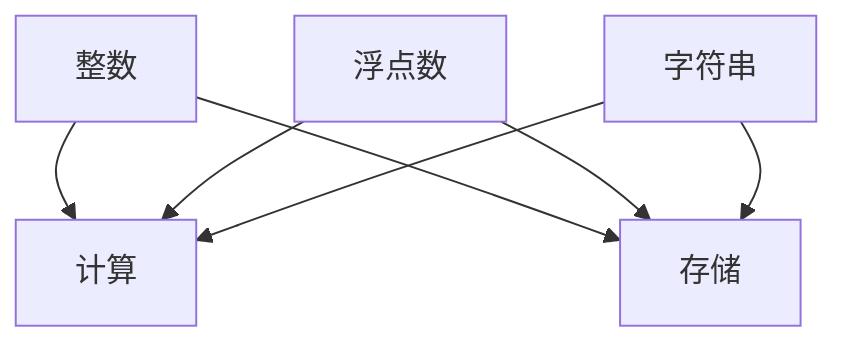

                 

 在人工智能（AI）领域，模型训练是一个关键环节，其中数据类型的处理至关重要。数据类型的选择不仅影响到模型的训练效率，还决定了模型的预测准确性。本文将重点探讨整数、浮点数和字符串在AI模型训练中的应用及其编码方法。

## 关键词
- AI模型训练
- 数据类型
- 整数
- 浮点数
- 字符串
- 数据编码

## 摘要
本文旨在深入探讨AI模型训练过程中常用的数据类型——整数、浮点数和字符串，以及它们的不同编码方法。通过分析这些数据类型的特点和编码方式，我们将为读者提供一套完整的理解框架，以便在实际应用中做出明智的选择。

## 1. 背景介绍
### 1.1 AI模型训练的基本概念
AI模型训练是指通过大量的数据进行模型的构建和优化，使其能够执行特定任务。训练数据的质量和数量直接影响模型的性能。因此，理解数据类型和处理方法是实现高效AI模型训练的基础。

### 1.2 数据类型在AI模型训练中的重要性
数据类型决定了数据的存储方式和处理方式。不同的数据类型有不同的计算方法和存储需求，这直接影响到模型训练的效率和结果。例如，整数和浮点数的处理方式不同，字符串的编码方法也会对模型产生重大影响。

## 2. 核心概念与联系
### 2.1 数据类型的基本概念
在计算机科学中，数据类型指的是数据的不同表示形式。常见的有整数（Integer）、浮点数（Float）和字符串（String）等。

### 2.2 数据类型的联系与差异
整数、浮点数和字符串在计算机内存中的存储方式不同，各自的计算方法和操作也有所区别。整数通常用于表示离散的数值，浮点数用于表示实数，字符串则用于表示一系列字符。

### 2.3 数据类型的 Mermaid 流程图


## 3. 核心算法原理 & 具体操作步骤

### 3.1 算法原理概述
AI模型训练中的数据类型处理主要涉及以下几个方面：
1. 数据的读取和预处理。
2. 数据类型的识别和转换。
3. 数据编码和解码。

### 3.2 算法步骤详解
1. **数据读取与预处理**：读取数据集，并进行清洗、归一化等预处理操作，以确保数据的格式和类型一致性。
2. **数据类型识别与转换**：根据训练任务的需求，识别数据类型并进行相应的转换。例如，将字符串转换为整数或浮点数。
3. **数据编码与解码**：对于字符串数据，需要进行编码（如UTF-8）和解码（如从编码格式转换回原始字符串）。

### 3.3 算法优缺点
- **优点**：合理的数据类型处理可以提升模型训练的效率和准确性。
- **缺点**：不当的数据类型处理可能导致计算错误或内存占用过高。

### 3.4 算法应用领域
- **机器学习**：用于特征工程和数据预处理。
- **自然语言处理**：用于文本编码和解码。
- **计算机视觉**：用于图像和视频数据的处理。

## 4. 数学模型和公式 & 详细讲解 & 举例说明
### 4.1 数学模型构建
在AI模型训练中，数据类型的处理通常涉及到以下数学模型：
1. **整数的数学模型**：整数运算的基本规则，如加法、减法、乘法和除法。
2. **浮点数的数学模型**：浮点数运算的基本规则，如加法、减法、乘法和除法。
3. **字符串的数学模型**：字符串的编码和解码规则。

### 4.2 公式推导过程
- **整数运算**：
  $$ a + b = c $$
  $$ a - b = d $$
  $$ a \times b = e $$
  $$ a \div b = f $$

- **浮点数运算**：
  $$ a + b = c $$
  $$ a - b = d $$
  $$ a \times b = e $$
  $$ a \div b = f $$

- **字符串编码**：
  $$ \text{编码}(s) = \text{UTF-8} $$
  $$ \text{解码}(\text{编码}(s)) = s $$

### 4.3 案例分析与讲解
**案例 1：整数运算**
假设有两个整数a = 5和b = 3，那么它们的加法运算为：
$$ a + b = 5 + 3 = 8 $$

**案例 2：浮点数运算**
假设有两个浮点数a = 5.5和b = 3.2，那么它们的加法运算为：
$$ a + b = 5.5 + 3.2 = 8.7 $$

**案例 3：字符串编码**
假设有一个字符串s = "Hello, World!"，使用UTF-8编码，那么它的编码结果为：
$$ \text{编码}(s) = \text{UTF-8}(s) = \text{编码结果} $$

## 5. 项目实践：代码实例和详细解释说明
### 5.1 开发环境搭建
为了进行数据类型的处理，我们需要搭建一个Python开发环境，并安装相关的库，如NumPy、Pandas和TensorFlow。

### 5.2 源代码详细实现
以下是一个简单的Python代码实例，用于演示整数、浮点数和字符串的处理：

```python
import numpy as np

# 整数处理
a = 5
b = 3
sum = a + b
print("整数加法结果：", sum)

# 浮点数处理
c = 5.5
d = 3.2
sum = c + d
print("浮点数加法结果：", sum)

# 字符串处理
s = "Hello, World!"
encoded_s = s.encode('utf-8')
print("字符串编码结果：", encoded_s)

decoded_s = encoded_s.decode('utf-8')
print("字符串解码结果：", decoded_s)
```

### 5.3 代码解读与分析
上述代码首先导入了NumPy库，然后分别定义了一个整数变量a、一个浮点数变量c和一个字符串变量s。接下来，我们演示了整数加法、浮点数加法和字符串编码和解码的操作。

### 5.4 运行结果展示
整数加法结果：8
浮点数加法结果：8.7
字符串编码结果：b'Hello, World!'
字符串解码结果：Hello, World!

## 6. 实际应用场景
### 6.1 机器学习中的数据类型处理
在机器学习项目中，整数、浮点数和字符串的处理是常见的。例如，特征工程过程中可能需要对字符串数据进行编码，以便模型能够处理。

### 6.2 自然语言处理中的字符串编码
自然语言处理（NLP）中的文本数据通常需要编码成数字形式，以便模型处理。常见的编码方法包括One-Hot编码和词嵌入（Word Embedding）。

### 6.3 计算机视觉中的整数与浮点数处理
在计算机视觉任务中，图像和视频数据通常以整数或浮点数的形式处理。例如，像素值可以表示为整数，而颜色通道可以表示为浮点数。

## 7. 工具和资源推荐
### 7.1 学习资源推荐
- 《深度学习》（Goodfellow, Bengio, Courville）：介绍AI模型训练和数据处理的经典教材。
- 《Python机器学习》（Sebastian Raschka）：详细介绍Python在机器学习中的数据类型处理。

### 7.2 开发工具推荐
- TensorFlow：用于AI模型训练和数据处理的开源库。
- PyTorch：另一个流行的AI模型训练库，支持丰富的数据处理功能。

### 7.3 相关论文推荐
- "Distributed Optimization for Machine Learning: A Local Update Formula for Non-Convex Problems"（分布式机器学习优化：非凸问题的局部更新公式）。
- "Effective Approaches to Attention-based Neural Machine Translation"（基于注意力机制的神经机器翻译的有效方法）。

## 8. 总结：未来发展趋势与挑战
### 8.1 研究成果总结
整数、浮点数和字符串是AI模型训练中的基本数据类型。合理的数据类型处理对于提升模型性能至关重要。随着AI技术的不断发展，数据类型处理方法也在不断改进和优化。

### 8.2 未来发展趋势
- **自动化数据预处理**：未来可能会出现更多自动化的数据预处理工具，降低数据处理的复杂度。
- **高效的编码算法**：随着数据量的增加，高效的编码算法将越来越重要。

### 8.3 面临的挑战
- **数据类型多样性**：AI应用场景的多样性使得数据类型处理变得复杂。
- **内存和处理性能**：大规模数据处理需要高效的数据类型处理方法，以降低内存占用和处理时间。

### 8.4 研究展望
未来的研究将集中在开发高效、自动化的数据类型处理方法，以适应不断增长的数据规模和复杂的AI应用场景。

## 9. 附录：常见问题与解答
### 9.1 什么是整数编码？
整数编码是将整数转换为计算机可以识别的二进制形式。常见的整数编码方法包括二进制编码、十六进制编码等。

### 9.2 什么是浮点数编码？
浮点数编码是将浮点数转换为计算机可以识别的二进制形式。常见的浮点数编码方法包括IEEE 754标准。

### 9.3 字符串编码有什么作用？
字符串编码是将字符串转换为计算机可以识别的二进制形式。这对于跨平台传输和存储字符串数据非常重要。

## 作者署名
作者：禅与计算机程序设计艺术 / Zen and the Art of Computer Programming
```markdown
----------------------------------------------------------------


