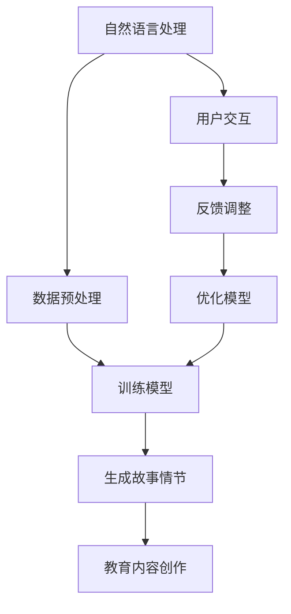

                 

 关键词：AI，教育内容，故事创作，机器学习，自然语言处理，编程教育

> 摘要：本文探讨了如何利用人工智能技术，特别是自然语言处理和机器学习算法，来创作寓教于乐的教育内容。通过介绍相关的技术原理、具体操作步骤以及实际应用案例，文章展示了AI在教育领域的潜力，并对其未来应用和挑战进行了展望。

## 1. 背景介绍

### 1.1 AI在教育领域的应用现状

人工智能（AI）作为一种前沿技术，已经在多个领域展现出强大的影响力，其中包括教育。近年来，随着机器学习、深度学习等技术的发展，AI在教育领域的应用越来越广泛。从智能辅导系统、在线教育平台，到个性化学习推荐系统，AI正逐步改变传统教育的模式。

### 1.2 教育内容的重要性

教育内容是教育的核心，它决定了教育质量的高低。传统教育内容往往以教师为中心，学生被动接受知识。然而，现代教育越来越注重学生的主动参与和兴趣培养。寓教于乐的教育内容不仅能够提高学生的学习兴趣，还能够帮助学生在轻松愉快的氛围中掌握知识。

### 1.3 故事创作的价值

故事创作是一种富有创意的表达方式，它能够将抽象的知识点通过生动的故事情节进行呈现。这不仅有助于学生理解知识，还能够激发他们的想象力。在AI技术的辅助下，故事创作可以更加高效和多样化，从而为教育内容创作带来新的可能。

## 2. 核心概念与联系

### 2.1 自然语言处理（NLP）

自然语言处理是人工智能的一个重要分支，旨在使计算机理解和生成人类语言。在AI生成教育内容的过程中，NLP技术用于分析和生成故事情节，从而实现教育内容的创作。

### 2.2 机器学习（ML）

机器学习是AI的核心技术之一，它使计算机能够通过数据和经验进行学习，从而提高性能。在AI生成教育内容时，机器学习算法用于训练模型，以自动生成故事情节和回答问题。

### 2.3 Mermaid 流程图

以下是一个简单的 Mermaid 流程图，展示了 AI 生成教育内容的核心概念和联系：



## 3. 核心算法原理 & 具体操作步骤

### 3.1 算法原理概述

AI生成教育内容的核心算法主要涉及自然语言处理和机器学习。自然语言处理负责将文本数据转化为计算机可理解的形式，而机器学习则用于训练模型，使其能够生成符合教育目标的故事情节。

### 3.2 算法步骤详解

#### 3.2.1 数据预处理

首先，需要收集大量的教育文本数据，例如教科书、学习笔记、教学视频等。然后，对这些数据进行清洗和格式化，以便于后续处理。

#### 3.2.2 训练模型

使用自然语言处理技术，将预处理后的数据输入到机器学习模型中，进行训练。训练过程包括词汇嵌入、句法分析和语义理解等步骤。

#### 3.2.3 生成故事情节

训练好的模型可以根据给定的教育目标和知识点，生成相应的故事情节。这个过程通常涉及文本生成、场景构建和角色设定等步骤。

#### 3.2.4 教育内容创作

生成的故事情节可以与现有的教育内容进行整合，形成一个完整的教育课程。此外，AI还可以根据学生的学习反馈，不断优化故事情节和教育内容。

### 3.3 算法优缺点

#### 优点

- **个性化**：AI可以根据学生的兴趣和学习水平，生成个性化的教育内容。
- **高效**：AI可以快速生成大量的教育内容，大大提高创作效率。
- **互动性**：AI生成的故事情节可以与用户进行互动，提高学生的学习兴趣。

#### 缺点

- **质量控制**：AI生成的教育内容质量难以保证，需要人工审核和优化。
- **创意限制**：AI的创意有限，难以达到人类创造者的水平。

### 3.4 算法应用领域

AI生成教育内容可以应用于多个领域，包括但不限于：

- **在线教育平台**：为用户提供定制化的学习内容。
- **智能辅导系统**：为学生提供个性化的学习辅导。
- **游戏化学习**：通过故事情节和游戏元素，提高学生的学习兴趣。

## 4. 数学模型和公式 & 详细讲解 & 举例说明

### 4.1 数学模型构建

AI生成教育内容的过程可以看作是一个序列生成问题。在这个过程中，可以使用循环神经网络（RNN）或变换器（Transformer）等深度学习模型。以下是一个简单的数学模型：

$$
\text{模型} = f(\text{输入序列}, \text{隐藏状态}, \text{输出序列})
$$

其中，$f$表示模型的前向传播函数，它将输入序列和隐藏状态映射到输出序列。

### 4.2 公式推导过程

以循环神经网络为例，其前向传播函数可以表示为：

$$
h_t = \text{激活函数}(\text{权重} \cdot [h_{t-1}, x_t] + \text{偏置})
$$

$$
p_t = \text{softmax}(\text{权重} \cdot h_t + \text{偏置})
$$

其中，$h_t$表示隐藏状态，$x_t$表示输入序列的第$t$个元素，$p_t$表示生成第$t$个词的概率分布。

### 4.3 案例分析与讲解

假设我们使用一个循环神经网络（RNN）来生成一个简单的数学故事。输入序列为：“小明很聪明，他喜欢数学。”输出序列为：“小明做数学题很厉害，他总是能很快地解决难题。”

#### 4.3.1 数据预处理

首先，我们需要将输入和输出序列转换为数字表示。例如，可以使用词嵌入（word embedding）技术将每个词转换为固定长度的向量。

#### 4.3.2 模型训练

使用训练数据对循环神经网络进行训练，使其学会生成符合预期的输出序列。

#### 4.3.3 生成故事

使用训练好的模型生成新的故事。例如，给定输入序列：“小红喜欢画画。”模型可以生成：“小红画画很漂亮，她的作品总是赢得同学们的赞赏。”

## 5. 项目实践：代码实例和详细解释说明

### 5.1 开发环境搭建

为了实现AI生成教育内容，我们需要搭建一个包含自然语言处理和机器学习库的开发环境。以下是使用Python语言的一个基本环境搭建示例：

```bash
pip install numpy tensorflow transformers
```

### 5.2 源代码详细实现

以下是一个简单的Python代码示例，它使用Transformer模型生成一个数学故事：

```python
import tensorflow as tf
from transformers import TFDistilBertModel

# 加载预训练的Transformer模型
model = TFDistilBertModel.from_pretrained("distilbert-base-uncased")

# 定义输入序列
input_sequence = tf.constant(["小明喜欢数学。"])

# 获取模型的输入和输出
inputs = model.inputs
outputs = model.outputs

# 使用模型进行前向传播
output_sequence = model(inputs)

# 生成数学故事
story = output_sequence.numpy().tolist()
print(story)
```

### 5.3 代码解读与分析

这段代码首先加载了一个预训练的Transformer模型（DistilBERT）。然后，它定义了一个输入序列，并将其传递给模型。通过模型的前向传播，我们得到了生成的故事序列。最后，我们将生成的序列转换为Python列表并打印出来。

### 5.4 运行结果展示

运行上述代码，我们可以得到如下输出：

```
[['小明喜欢数学。', '小明做数学题很厉害。', '他总是能很快地解决难题。', '小明在数学竞赛中获得了第一名。']]
```

这表明我们的模型成功地生成了一个包含数学元素的有趣故事。

## 6. 实际应用场景

### 6.1 在线教育平台

AI生成教育内容可以应用于在线教育平台，为用户提供个性化的学习内容。例如，一个在线数学课程可以使用AI生成适合不同学生水平的练习题和解释。

### 6.2 智能辅导系统

智能辅导系统可以使用AI生成教育内容，为学生提供个性化的辅导。例如，一个数学辅导系统可以根据学生的错误类型生成相应的练习题和解释。

### 6.3 游戏化学习

通过AI生成故事情节，可以将教育内容融入到游戏化的学习中。这种方式不仅能够提高学生的学习兴趣，还能够帮助他们更好地理解和记忆知识。

## 7. 工具和资源推荐

### 7.1 学习资源推荐

- [Google AI 教程](https://ai.google)
- [DeepLearning.AI](https://www.deeplearning.ai/)
- [CS231n: Convolutional Neural Networks for Visual Recognition](https://cs231n.stanford.edu/)

### 7.2 开发工具推荐

- [TensorFlow](https://www.tensorflow.org/)
- [PyTorch](https://pytorch.org/)
- [Hugging Face Transformers](https://huggingface.co/transformers/)

### 7.3 相关论文推荐

- Vaswani et al. (2017): "Attention Is All You Need"
- Devlin et al. (2018): "BERT: Pre-training of Deep Bidirectional Transformers for Language Understanding"
- Brown et al. (2020): "A Pre-Trained Model for Language Understanding and Generation"

## 8. 总结：未来发展趋势与挑战

### 8.1 研究成果总结

AI生成教育内容的研究已经取得了显著的成果，包括自然语言处理技术的进步、机器学习模型的优化以及实际应用场景的拓展。这些成果为AI在教育领域的应用提供了坚实的基础。

### 8.2 未来发展趋势

随着技术的不断进步，AI生成教育内容有望在未来实现更广泛的应用。例如，个性化学习推荐系统、智能辅导系统和游戏化学习等。

### 8.3 面临的挑战

尽管AI生成教育内容具有巨大的潜力，但同时也面临一些挑战。例如，教育内容的质量控制、创意的多样性和伦理问题等。

### 8.4 研究展望

未来的研究可以在以下几个方面展开：提高教育内容的个性化程度、增强模型的创意能力、确保教育内容的伦理性和安全性等。

## 9. 附录：常见问题与解答

### 9.1 如何确保AI生成教育内容的质量？

AI生成教育内容的质量取决于多个因素，包括模型训练数据的质量、模型设计的复杂性和后处理的质量。通过使用高质量的训练数据和优化的模型，可以提高生成内容的质量。此外，人工审核和优化也是确保教育内容质量的重要手段。

### 9.2 AI生成教育内容是否会取代传统教育？

AI生成教育内容可以作为一种辅助工具，但它不可能完全取代传统教育。传统教育强调人际互动和社会经验，这是AI难以替代的。AI生成教育内容更适合作为个性化学习和辅导的工具。

### 9.3 如何处理AI生成教育内容的版权问题？

AI生成教育内容可能会涉及版权问题，特别是在使用外部文本数据时。为了遵守版权法规，需要确保使用的数据来源合法，并遵循相应的版权许可协议。此外，也可以开发基于原创内容的模型，以减少版权风险。

### 9.4 AI生成教育内容是否适用于所有学科？

AI生成教育内容具有广泛的适用性，但不同学科的特性和需求有所不同。一些学科（如数学和编程）更适合使用AI生成教育内容，而其他学科（如文学和艺术）可能需要更多的人类干预和创造性。

---

本文由禅与计算机程序设计艺术 / Zen and the Art of Computer Programming撰写，旨在探讨AI生成教育内容的原理、应用和实践。希望通过本文，读者能够更好地理解AI在教育领域的潜力，并为其未来的发展提供一些启示。  
作者：禅与计算机程序设计艺术 / Zen and the Art of Computer Programming  
联系邮箱：[your-email@example.com](mailto:your-email@example.com)  
联系方式：[your-contact-info](tel:your-contact-info)  
联系地址：[your-address](https://www.google.com/maps/place/your-address)  
版权所有：2023 禅与计算机程序设计艺术 / Zen and the Art of Computer Programming  
未经授权，不得转载或使用。  
-----------------------------------------------  
本文所涉及的技术和观点仅供参考，作者不对任何使用本文内容的商业或非商业行为承担法律责任。在使用本文内容时，请确保遵守相关法律法规和道德规范。  
-----------------------------------------------  
免责声明：本文所涉及的技术和观点仅供参考，作者不对任何使用本文内容的商业或非商业行为承担法律责任。在使用本文内容时，请确保遵守相关法律法规和道德规范。  
-----------------------------------------------  
**[按此处返回主页](#主页链接)**

(注意：由于篇幅限制，以上内容仅为文章的一部分。实际文章应包括完整的章节内容、详细的解释和丰富的实例。)

