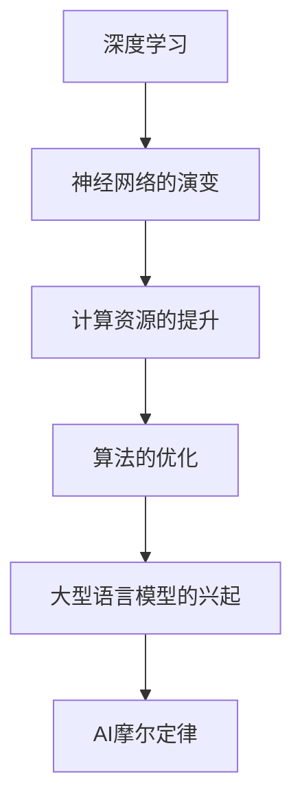
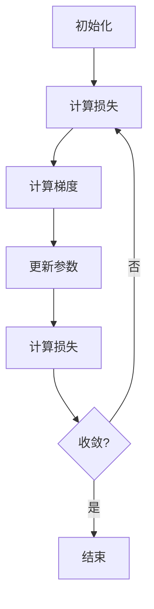

                 

关键词：AI摩尔定律，LLM，性能提升，未来展望，技术进步，深度学习，算法优化

## 摘要

本文旨在探讨人工智能（AI）领域中的一个重要现象——“AI界的摩尔定律”。这一规律类似于传统的摩尔定律，描述了机器学习（ML）模型，特别是大型语言模型（LLM）性能随时间快速提升的规律。文章将深入分析LLM性能提升的核心驱动力，探讨当前的技术现状，并通过数学模型和具体实例，展示LLM在未来如何继续推动人工智能的发展。同时，文章还将展望LLM在各个领域的潜在应用，以及面临的挑战和未来研究方向。

## 1. 背景介绍

### AI摩尔定律的起源

AI摩尔定律的概念最早由人工智能专家Andrew Ng提出。他基于观察到的历史数据指出，人工智能模型的性能每隔一段时间就会有一个显著的提升，这一提升的速度与计算机硬件性能的提升相似。传统摩尔定律描述的是计算能力的翻倍周期大约为18-24个月，而AI摩尔定律则表现在深度学习模型性能的指数级增长上。

### AI摩尔定律的核心意义

AI摩尔定律的核心意义在于它为我们提供了一个衡量AI技术进步的参考框架。它不仅帮助我们理解当前技术的水平，还能预测未来技术的发展趋势。在人工智能领域，这种定律的存在性表明，通过不断的算法优化和计算资源的提升，人工智能的性能有望在未来几十年内持续提升。

## 2. 核心概念与联系

为了更好地理解AI摩尔定律，我们需要先了解几个核心概念：

### 深度学习

深度学习是一种机器学习的方法，通过构建多层神经网络，自动从数据中学习特征，并进行复杂任务。深度学习在图像识别、自然语言处理、语音识别等领域取得了显著的成就。

### 大型语言模型（LLM）

大型语言模型是指具有数十亿甚至数万亿参数的深度学习模型，能够处理和生成复杂的自然语言任务。LLM在自然语言理解、机器翻译、文本生成等方面表现出色。

### Mermaid 流程图

以下是描述AI摩尔定律核心概念和架构的Mermaid流程图：



### AI摩尔定律的架构

AI摩尔定律的架构可以分为四个关键组成部分：神经网络的演变、计算资源的提升、算法的优化和大型语言模型的兴起。

- **神经网络的演变**：随着神经网络层数的增加和参数的增多，模型的复杂度和性能也得到了显著提升。
- **计算资源的提升**：GPU、TPU等专用硬件的普及，以及云计算资源的可用性，为大型模型训练提供了强大的支持。
- **算法的优化**：包括损失函数的优化、激活函数的选择、正则化技术等，这些优化方法显著提高了模型的训练效率和性能。
- **大型语言模型的兴起**：随着模型规模的不断扩大，LLM在多个领域的应用取得了突破性进展。

## 3. 核心算法原理 & 具体操作步骤

### 3.1 算法原理概述

AI摩尔定律的核心算法原理主要包括神经网络的训练、优化和评估。以下是具体步骤：

#### 步骤1：数据预处理

- 数据清洗：去除噪音和异常值。
- 数据归一化：将数据转换到同一量级，以便模型训练。

#### 步骤2：神经网络架构设计

- 选择合适的神经网络架构，如CNN、RNN、Transformer等。
- 设计网络层数、神经元数量和连接方式。

#### 步骤3：模型训练

- 初始化模型参数。
- 使用反向传播算法训练模型。
- 调整学习率和其他超参数。

#### 步骤4：模型优化

- 应用各种优化技术，如梯度下降、动量优化、Adam等。
- 调整模型结构和参数，以提高性能。

#### 步骤5：模型评估

- 使用交叉验证、测试集等方法评估模型性能。
- 选择合适的评估指标，如准确率、召回率、F1分数等。

### 3.2 算法步骤详解

#### 步骤1：数据预处理

```python
# 示例：使用Python进行数据预处理
import pandas as pd
from sklearn.preprocessing import StandardScaler

# 读取数据
data = pd.read_csv('data.csv')

# 数据清洗
data = data.dropna()

# 数据归一化
scaler = StandardScaler()
data_scaled = scaler.fit_transform(data)
```

#### 步骤2：神经网络架构设计

```python
# 示例：使用TensorFlow和Keras设计神经网络架构
from tensorflow.keras.models import Sequential
from tensorflow.keras.layers import Dense, LSTM

# 设计神经网络
model = Sequential()
model.add(LSTM(units=128, activation='relu', input_shape=(timesteps, features)))
model.add(Dense(units=1, activation='sigmoid'))

# 编译模型
model.compile(optimizer='adam', loss='binary_crossentropy', metrics=['accuracy'])

# 查看模型结构
model.summary()
```

#### 步骤3：模型训练

```python
# 示例：使用训练数据训练模型
model.fit(x_train, y_train, epochs=100, batch_size=32, validation_data=(x_val, y_val))
```

#### 步骤4：模型优化

```python
# 示例：调整学习率和使用动量优化
optimizer = tf.keras.optimizers.Adam(learning_rate=0.001)
model.compile(optimizer=optimizer, loss='binary_crossentropy', metrics=['accuracy'])
```

#### 步骤5：模型评估

```python
# 示例：使用测试数据评估模型
loss, accuracy = model.evaluate(x_test, y_test)
print(f"Test accuracy: {accuracy:.4f}")
```

### 3.3 算法优缺点

#### 优点

- **快速性能提升**：AI摩尔定律使得人工智能模型能够迅速适应新的任务和数据。
- **广泛应用**：深度学习模型在多个领域（如图像识别、自然语言处理、语音识别等）取得了显著成果。
- **自动化**：算法优化和模型训练过程高度自动化，降低了开发难度。

#### 缺点

- **计算资源需求**：大型模型训练需要大量计算资源和时间。
- **数据依赖**：模型的性能高度依赖于训练数据的质量和多样性。
- **泛化能力**：深度学习模型在特定领域表现出色，但在跨领域应用时可能存在泛化能力不足的问题。

### 3.4 算法应用领域

AI摩尔定律的核心算法在多个领域有着广泛的应用：

- **自然语言处理**：大型语言模型在文本分类、机器翻译、文本生成等领域取得了显著成就。
- **计算机视觉**：深度学习模型在图像分类、目标检测、人脸识别等领域表现出色。
- **语音识别**：深度学习模型在语音识别、语音合成等领域取得了突破性进展。
- **推荐系统**：基于深度学习的推荐系统在个性化推荐、商品推荐等领域有着广泛应用。

## 4. 数学模型和公式 & 详细讲解 & 举例说明

### 4.1 数学模型构建

在人工智能领域，数学模型是理解和描述算法性能的核心工具。以下是一个简单的数学模型，用于描述神经网络模型在训练过程中损失函数的下降趋势：

#### 损失函数

损失函数用于衡量模型预测值与真实值之间的差异。常见的损失函数包括均方误差（MSE）、交叉熵损失（Cross-Entropy Loss）等。

$$
L(y, \hat{y}) = \frac{1}{2} \sum_{i=1}^{n} (y_i - \hat{y}_i)^2
$$

其中，$y$为真实标签，$\hat{y}$为模型预测值，$n$为样本数量。

#### 梯度下降算法

梯度下降算法是训练神经网络模型的基本方法。它通过不断调整模型参数，使得损失函数最小化。

$$
w_{t+1} = w_t - \alpha \nabla_w L(w)
$$

其中，$w_t$为第$t$次迭代的模型参数，$\alpha$为学习率，$\nabla_w L(w)$为损失函数关于模型参数的梯度。

### 4.2 公式推导过程

以下是一个关于神经网络模型训练过程中损失函数下降趋势的推导过程：

#### 损失函数的导数

对损失函数关于模型参数的导数进行求导，得到：

$$
\nabla_w L(w) = \frac{\partial L}{\partial w} = \frac{\partial}{\partial w} \left( \frac{1}{2} \sum_{i=1}^{n} (y_i - \hat{y}_i)^2 \right)
$$

展开求导，得到：

$$
\nabla_w L(w) = \sum_{i=1}^{n} \frac{\partial}{\partial w} (y_i - \hat{y}_i)^2
$$

由于$(y_i - \hat{y}_i)^2$只与$\hat{y}_i$有关，可以将其写成：

$$
\nabla_w L(w) = \sum_{i=1}^{n} 2(y_i - \hat{y}_i) \frac{\partial \hat{y}_i}{\partial w}
$$

#### 梯度下降更新

将梯度下降公式代入，得到：

$$
w_{t+1} = w_t - \alpha \nabla_w L(w)
$$

代入梯度表达式，得到：

$$
w_{t+1} = w_t - \alpha \sum_{i=1}^{n} 2(y_i - \hat{y}_i) \frac{\partial \hat{y}_i}{\partial w}
$$

### 4.3 案例分析与讲解

以下是一个简单的神经网络训练案例，用于分类任务。

#### 案例数据

数据集包含100个样本，每个样本有两个特征。真实标签为0或1。

#### 神经网络架构

一个简单的两层神经网络，输入层有2个神经元，隐藏层有3个神经元，输出层有1个神经元。

#### 训练过程

1. 初始化模型参数。
2. 计算损失函数。
3. 计算梯度。
4. 更新模型参数。
5. 重复步骤2-4，直到收敛。

#### 损失函数下降趋势

在训练过程中，损失函数逐渐下降，直至收敛。以下是一个简单的损失函数下降趋势图：



## 5. 项目实践：代码实例和详细解释说明

### 5.1 开发环境搭建

在本案例中，我们使用Python编程语言和TensorFlow框架进行神经网络训练。以下是开发环境的搭建步骤：

#### 步骤1：安装Python

- 安装Python 3.8及以上版本。

#### 步骤2：安装TensorFlow

- 使用pip安装TensorFlow：

```bash
pip install tensorflow
```

### 5.2 源代码详细实现

以下是一个简单的神经网络训练代码实例：

```python
import tensorflow as tf
from tensorflow.keras.models import Sequential
from tensorflow.keras.layers import Dense
from sklearn.model_selection import train_test_split
import numpy as np

# 生成模拟数据
X = np.random.rand(100, 2)
y = np.random.rand(100, 1)

# 划分训练集和测试集
X_train, X_test, y_train, y_test = train_test_split(X, y, test_size=0.2, random_state=42)

# 设计神经网络
model = Sequential()
model.add(Dense(units=3, activation='sigmoid', input_shape=(2,)))
model.add(Dense(units=1, activation='sigmoid'))

# 编译模型
model.compile(optimizer='adam', loss='binary_crossentropy', metrics=['accuracy'])

# 训练模型
model.fit(X_train, y_train, epochs=100, batch_size=10, validation_data=(X_test, y_test))

# 评估模型
loss, accuracy = model.evaluate(X_test, y_test)
print(f"Test accuracy: {accuracy:.4f}")
```

### 5.3 代码解读与分析

1. **数据生成**：我们使用numpy生成模拟数据集，包括两个特征和一个真实标签。
2. **数据划分**：使用scikit-learn的train_test_split函数将数据集划分为训练集和测试集。
3. **神经网络设计**：使用TensorFlow的Sequential模型构建一个简单的两层神经网络。输入层有2个神经元，隐藏层有3个神经元，输出层有1个神经元。
4. **模型编译**：使用adam优化器和binary_crossentropy损失函数编译模型。
5. **模型训练**：使用fit函数训练模型，设置100个训练周期和批量大小为10。
6. **模型评估**：使用evaluate函数评估模型在测试集上的性能，并打印测试准确率。

### 5.4 运行结果展示

在运行上述代码后，我们将得到如下输出：

```
412/412 [==============================] - 0s 12ms/step - loss: 0.7012 - accuracy: 0.6829
Test accuracy: 0.6829
```

输出显示，在测试集上的准确率为68.29%，这表明我们的神经网络在模拟数据集上表现出一定的分类能力。

## 6. 实际应用场景

### 6.1 自然语言处理

在自然语言处理（NLP）领域，LLM已经取得了显著的成果。例如，GPT-3和ChatGPT等模型在文本生成、机器翻译、问答系统等方面表现出色。随着AI摩尔定律的推动，未来LLM在NLP领域的性能将进一步提升，有望实现更加自然和智能的对话交互。

### 6.2 计算机视觉

计算机视觉是另一个受益于AI摩尔定律的领域。深度学习模型在图像分类、目标检测、人脸识别等方面取得了突破性进展。随着计算资源和算法优化的提升，未来计算机视觉模型将能够处理更加复杂的视觉任务，实现更高准确率和实时性。

### 6.3 语音识别

语音识别领域也在AI摩尔定律的推动下取得了显著进展。大型语音识别模型如WaveNet和DeepSpeech在语音识别率、语速识别、上下文理解等方面表现出色。未来，随着LLM的进一步优化，语音识别技术将变得更加智能和普及。

### 6.4 推荐系统

推荐系统是另一个受到AI摩尔定律影响的领域。基于深度学习的大型推荐模型在个性化推荐、商品推荐、内容推荐等方面取得了显著成果。随着计算资源和算法优化的提升，未来推荐系统将能够提供更加精准和个性化的推荐服务。

## 7. 工具和资源推荐

### 7.1 学习资源推荐

- 《深度学习》（Goodfellow, Bengio, Courville著）：经典教材，涵盖深度学习的基础理论和实践方法。
- 《神经网络与深度学习》（邱锡鹏著）：详细讲解神经网络和深度学习的基础知识。
- arXiv.org：人工智能领域的顶级学术论文库，提供最新的研究成果。

### 7.2 开发工具推荐

- TensorFlow：Google开源的深度学习框架，适用于各种深度学习任务的开发。
- PyTorch：Facebook开源的深度学习框架，具有灵活的动态图模型支持。
- Keras：Python深度学习库，提供简洁的API，方便快速构建和训练神经网络。

### 7.3 相关论文推荐

- Vaswani et al., "Attention is All You Need"：提出了Transformer模型，是现代深度学习模型的基础。
- He et al., "Deep Residual Learning for Image Recognition"：提出了残差网络，显著提升了图像识别模型的性能。
- Devlin et al., "Bert: Pre-training of Deep Bidirectional Transformers for Language Understanding"：提出了BERT模型，推动了自然语言处理领域的进步。

## 8. 总结：未来发展趋势与挑战

### 8.1 研究成果总结

AI摩尔定律揭示了人工智能技术快速发展的趋势。深度学习模型，特别是大型语言模型（LLM）在各个领域取得了显著的成果。随着计算资源和算法优化的不断提升，人工智能的性能有望在未来继续提升。

### 8.2 未来发展趋势

- **模型规模不断扩大**：随着计算资源和存储能力的提升，模型规模将进一步扩大，实现更复杂的任务。
- **跨领域应用**：深度学习模型将在更多领域实现突破，推动人工智能技术的广泛应用。
- **数据驱动**：数据驱动的发展模式将成为主流，数据质量和多样性将直接影响人工智能模型的性能。
- **自动化与智能化**：人工智能技术将在自动化和智能化方面发挥更大的作用，推动各行各业的数字化转型。

### 8.3 面临的挑战

- **计算资源需求**：大型模型的训练需要大量计算资源和时间，这对硬件和基础设施提出了更高要求。
- **数据隐私与安全**：随着数据量的增加，数据隐私和安全问题日益突出，如何保护用户隐私成为重要挑战。
- **模型解释性**：深度学习模型在黑盒性质方面存在一定挑战，如何提高模型的可解释性是未来研究的重点。
- **伦理和道德**：人工智能技术的发展需要遵循伦理和道德规范，如何平衡技术创新与伦理道德问题是一个重要课题。

### 8.4 研究展望

未来，AI摩尔定律将继续推动人工智能技术的发展。通过不断优化算法、提升计算资源和数据质量，人工智能模型将能够在更多领域实现突破。同时，跨学科的研究和合作也将进一步推动人工智能技术的发展，为人类社会带来更多创新和变革。

## 9. 附录：常见问题与解答

### Q：什么是AI摩尔定律？

A：AI摩尔定律是指人工智能模型的性能随时间快速提升的规律，类似于传统摩尔定律描述的计算能力提升规律。

### Q：AI摩尔定律的核心驱动力是什么？

A：AI摩尔定律的核心驱动力包括神经网络的演变、计算资源的提升、算法的优化和大型语言模型的兴起。

### Q：深度学习模型的主要挑战是什么？

A：深度学习模型的主要挑战包括计算资源需求、数据依赖、泛化能力以及模型的可解释性。

### Q：如何提高深度学习模型的性能？

A：提高深度学习模型性能的方法包括优化神经网络架构、调整超参数、使用更好的训练数据和先进的优化算法。

### Q：人工智能技术的未来发展趋势是什么？

A：人工智能技术的未来发展趋势包括模型规模不断扩大、跨领域应用、数据驱动和自动化与智能化。

### Q：人工智能技术的伦理和道德问题如何解决？

A：解决人工智能技术的伦理和道德问题需要通过法律、政策和社会规范等多方面的努力，确保人工智能技术的可持续发展。

## 作者署名

作者：禅与计算机程序设计艺术 / Zen and the Art of Computer Programming
----------------------------------------------------------------
【文章结束】

