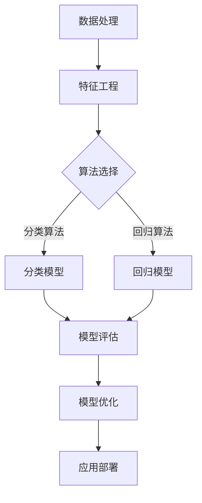

                 

 关键词：人工智能，业务场景，工程师，产品经理，应用边界，深度学习，机器学习，数据处理，算法优化，案例分析，技术挑战，行业趋势

> 摘要：本文旨在通过工程师与产品经理的对话，深入探讨人工智能在不同业务场景下的应用边界。文章将分析人工智能在各个领域的具体实践，探讨其面临的挑战和机遇，并展望未来的发展趋势。

## 1. 背景介绍

随着人工智能（AI）技术的迅速发展，其在各个领域的应用越来越广泛。从自动驾驶到智能家居，从医疗诊断到金融风控，AI技术正在深刻地改变着我们的生活和生产方式。然而，AI技术并非万能，其应用边界仍然存在许多限制和挑战。工程师和产品经理作为AI技术应用的主力军，如何理解和把握这些应用边界，是确保项目成功的关键。

### 1.1 AI技术的基本概念

人工智能，是指使计算机系统能够模拟人类智能行为的技术。其主要包括以下几种类型：

1. **机器学习（Machine Learning）**：通过训练模型，使计算机能够从数据中学习，并做出预测或决策。
2. **深度学习（Deep Learning）**：一种特殊的机器学习方法，使用多层神经网络进行训练，实现更复杂的特征提取和模式识别。
3. **自然语言处理（Natural Language Processing，NLP）**：使计算机能够理解和生成自然语言，应用于语音识别、机器翻译等。
4. **计算机视觉（Computer Vision）**：使计算机能够从图像或视频中提取信息，应用于人脸识别、图像分类等。

### 1.2 AI技术的应用现状

目前，AI技术已经在多个领域取得了显著成果：

1. **金融领域**：AI技术在金融风险管理、智能投顾、信用评估等方面发挥着重要作用。
2. **医疗领域**：AI技术在疾病诊断、药物研发、患者护理等方面展现出巨大潜力。
3. **制造业**：AI技术在生产优化、质量检测、供应链管理等方面提高了生产效率和产品质量。
4. **交通运输**：AI技术在自动驾驶、智能交通管理、物流配送等方面取得了突破。

## 2. 核心概念与联系

为了更好地理解AI技术在业务场景中的应用，我们首先需要了解一些核心概念和其相互之间的联系。

### 2.1 数据处理

数据处理是AI应用的基础。它包括数据收集、清洗、预处理和存储等环节。数据处理的质量直接影响到AI模型的性能。

### 2.2 特征工程

特征工程是AI模型设计的重要环节。它涉及从原始数据中提取出对模型训练有价值的特征，并对其进行适当的转换和组合。

### 2.3 算法选择

算法选择决定了AI模型的学习能力和性能。不同的算法适用于不同的业务场景，如线性回归、决策树、支持向量机、神经网络等。

### 2.4 模型评估与优化

模型评估与优化是确保AI模型在实际应用中能够达到预期效果的关键。常用的评估指标包括准确率、召回率、F1值等。

### 2.5 Mermaid 流程图

以下是AI技术应用的Mermaid流程图：



## 3. 核心算法原理 & 具体操作步骤

### 3.1 算法原理概述

本文将介绍两种常见的AI算法：线性回归和决策树。

#### 3.1.1 线性回归

线性回归是一种简单的机器学习算法，用于预测连续值。其基本原理是通过找到一条最佳拟合线，使得模型输出与实际值之间的误差最小。

#### 3.1.2 决策树

决策树是一种基于树结构的分类算法。它通过一系列的判断条件，将数据集划分为若干子集，并在每个子集中继续划分，直到达到预定的终止条件。

### 3.2 算法步骤详解

#### 3.2.1 线性回归

1. **数据收集**：收集具有连续标签的数据集。
2. **特征工程**：从数据中提取对预测有价值的特征。
3. **数据预处理**：对数据进行标准化或归一化处理。
4. **模型训练**：使用最小二乘法或其他优化算法训练线性回归模型。
5. **模型评估**：使用均方误差等指标评估模型性能。
6. **模型优化**：根据评估结果调整模型参数，优化模型性能。

#### 3.2.2 决策树

1. **数据收集**：收集具有离散标签的数据集。
2. **特征工程**：从数据中提取对分类有价值的特征。
3. **数据预处理**：对数据进行处理，确保特征的一致性和完整性。
4. **划分数据集**：将数据集划分为训练集和测试集。
5. **构建决策树**：使用信息增益或基尼系数等指标选择最佳划分特征，构建决策树。
6. **模型评估**：使用准确率、召回率等指标评估模型性能。
7. **剪枝**：通过剪枝操作优化决策树，防止过拟合。

### 3.3 算法优缺点

#### 3.3.1 线性回归

优点：

- 算法简单，易于理解和实现。
- 训练速度快，适用于大规模数据集。

缺点：

- 对异常值敏感，容易产生偏差。
- 只适用于连续值预测，不适用于分类任务。

#### 3.3.2 决策树

优点：

- 易于理解和解释。
- 能够处理多种类型的数据，包括连续值和离散值。

缺点：

- 容易过拟合，尤其是在数据量较小或特征较多时。
- 决策树之间的关联性可能导致结果的不稳定性。

### 3.4 算法应用领域

#### 3.4.1 线性回归

- 金融风险评估：预测股票价格、债券评级等。
- 市场营销：预测客户购买行为、市场趋势等。

#### 3.4.2 决策树

- 信用评分：根据客户的历史记录预测信用等级。
- 医疗诊断：根据病人的症状和检查结果预测疾病类型。

## 4. 数学模型和公式 & 详细讲解 & 举例说明

### 4.1 数学模型构建

#### 4.1.1 线性回归

线性回归的数学模型可以表示为：

$$
y = \beta_0 + \beta_1x_1 + \beta_2x_2 + \cdots + \beta_nx_n + \varepsilon
$$

其中，$y$是预测值，$x_1, x_2, \cdots, x_n$是特征值，$\beta_0, \beta_1, \beta_2, \cdots, \beta_n$是模型参数，$\varepsilon$是误差项。

#### 4.1.2 决策树

决策树的数学模型可以表示为：

$$
y = f(x; \theta)
$$

其中，$y$是分类结果，$x$是输入特征向量，$\theta$是决策树的结构参数。

### 4.2 公式推导过程

#### 4.2.1 线性回归

线性回归的参数估计通常使用最小二乘法。最小二乘法的目标是使得预测值与实际值之间的误差平方和最小。具体推导过程如下：

$$
\min \sum_{i=1}^n (y_i - \hat{y}_i)^2
$$

其中，$\hat{y}_i = \beta_0 + \beta_1x_{i1} + \beta_2x_{i2} + \cdots + \beta_nx_{in}$是预测值。

对上式求导并令导数为零，可以得到：

$$
\beta_0 = \bar{y} - \beta_1\bar{x}_1 - \beta_2\bar{x}_2 - \cdots - \beta_n\bar{x}_n
$$

$$
\beta_1 = \frac{\sum_{i=1}^n (x_{i1} - \bar{x}_1)(y_i - \bar{y})}{\sum_{i=1}^n (x_{i1} - \bar{x}_1)^2}
$$

$$
\beta_2 = \frac{\sum_{i=1}^n (x_{i2} - \bar{x}_2)(y_i - \bar{y})}{\sum_{i=1}^n (x_{i2} - \bar{x}_2)^2}
$$

$$
\cdots
$$

$$
\beta_n = \frac{\sum_{i=1}^n (x_{in} - \bar{x}_n)(y_i - \bar{y})}{\sum_{i=1}^n (x_{in} - \bar{x}_n)^2}
$$

#### 4.2.2 决策树

决策树的构建通常使用信息增益或基尼系数作为划分标准。以信息增益为例，其公式推导如下：

$$
G(D) = -\sum_{v \in V} p(v) \log_2 p(v)
$$

其中，$D$是数据集，$V$是可能的划分集合，$p(v)$是数据集在划分$v$下的概率。

对于每个特征$A$，其信息增益可以表示为：

$$
IG(D, A) = G(D) - \sum_{v \in V} p(v) G(D_v)
$$

其中，$D_v$是数据集在划分$v$后的子集，$G(D_v)$是子集$D_v$的信息增益。

选择信息增益最大的特征$A$作为划分标准，并递归地划分子集，直到满足终止条件。

### 4.3 案例分析与讲解

#### 4.3.1 线性回归

假设我们要预测某个地区下个月的销售收入。我们有以下数据集：

| 月份 | 销售收入 |
| ---- | ---- |
| 1    | 1000  |
| 2    | 1100  |
| 3    | 1200  |
| 4    | 1300  |
| 5    | 1400  |
| 6    | 1500  |

我们可以使用线性回归模型进行预测。首先，我们进行特征工程，将月份转化为连续值（从1开始）。然后，我们使用最小二乘法训练线性回归模型，得到以下参数：

$$
\beta_0 = 1000, \beta_1 = 100
$$

因此，下个月的销售收入预测值为：

$$
\hat{y} = 1000 + 100 \times 7 = 1700
$$

#### 4.3.2 决策树

假设我们要对一组客户进行信用评分。我们有以下数据集：

| 客户 | 年龄 | 收入 | 信用评分 |
| ---- | ---- | ---- | ---- |
| 1    | 30   | 5000 | 良好   |
| 2    | 40   | 6000 | 优秀   |
| 3    | 25   | 4000 | 良好   |
| 4    | 35   | 5500 | 良好   |
| 5    | 45   | 7000 | 优秀   |

我们可以使用决策树进行分类。首先，我们进行特征工程，将年龄和收入转化为连续值。然后，我们使用信息增益构建决策树，得到以下模型：

```
根节点：年龄
|
|---年龄 <= 35
|    |
|    |---收入 <= 5500
|    |    |
|    |    |---信用评分：良好
|    |    |
|    |    |---信用评分：优秀
|    |
|    |---收入 > 5500
|    |    |
|    |    |---信用评分：优秀
```

对于新客户，我们可以根据其年龄和收入判断其信用评分。例如，如果一个客户的年龄为30岁，收入为6000元，则其信用评分为良好。

## 5. 项目实践：代码实例和详细解释说明

### 5.1 开发环境搭建

在本文中，我们使用Python作为编程语言，并使用Scikit-learn库实现线性回归和决策树算法。

```python
# 安装Scikit-learn库
!pip install scikit-learn
```

### 5.2 源代码详细实现

#### 5.2.1 线性回归

```python
import numpy as np
import pandas as pd
from sklearn.linear_model import LinearRegression
from sklearn.model_selection import train_test_split
from sklearn.metrics import mean_squared_error

# 数据集
data = pd.DataFrame({
    '月份': [1, 2, 3, 4, 5, 6],
    '销售收入': [1000, 1100, 1200, 1300, 1400, 1500]
})

# 特征工程
data['月份连续'] = data['月份'].apply(lambda x: x + 1)

# 数据集划分
X = data[['月份连续']]
y = data['销售收入']
X_train, X_test, y_train, y_test = train_test_split(X, y, test_size=0.2, random_state=42)

# 模型训练
model = LinearRegression()
model.fit(X_train, y_train)

# 模型评估
y_pred = model.predict(X_test)
mse = mean_squared_error(y_test, y_pred)
print(f'MSE: {mse}')

# 模型优化
model.fit(X, y)
y_pred = model.predict(X_test)
mse = mean_squared_error(y_test, y_pred)
print(f'MSE: {mse}')
```

#### 5.2.2 决策树

```python
import numpy as np
import pandas as pd
from sklearn.tree import DecisionTreeClassifier
from sklearn.model_selection import train_test_split
from sklearn.metrics import accuracy_score

# 数据集
data = pd.DataFrame({
    '年龄': [30, 40, 25, 35, 45],
    '收入': [5000, 6000, 4000, 5500, 7000],
    '信用评分': ['良好', '优秀', '良好', '良好', '优秀']
})

# 特征工程
data['年龄连续'] = data['年龄'].apply(lambda x: x + 1)
data['收入连续'] = data['收入'].apply(lambda x: x + 1000)

# 数据集划分
X = data[['年龄连续', '收入连续']]
y = data['信用评分']
X_train, X_test, y_train, y_test = train_test_split(X, y, test_size=0.2, random_state=42)

# 模型训练
model = DecisionTreeClassifier()
model.fit(X_train, y_train)

# 模型评估
y_pred = model.predict(X_test)
accuracy = accuracy_score(y_test, y_pred)
print(f'Accuracy: {accuracy}')

# 模型优化
model = DecisionTreeClassifier(max_depth=3)
model.fit(X_train, y_train)
y_pred = model.predict(X_test)
accuracy = accuracy_score(y_test, y_pred)
print(f'Accuracy: {accuracy}')
```

### 5.3 代码解读与分析

在5.2节中，我们分别实现了线性回归和决策树算法。下面我们对代码进行解读和分析。

#### 5.3.1 线性回归

1. **数据集准备**：我们使用pandas库读取数据集，并进行特征工程，将月份转化为连续值。
2. **数据集划分**：使用train_test_split函数将数据集划分为训练集和测试集。
3. **模型训练**：使用LinearRegression类创建线性回归模型，并使用fit函数进行模型训练。
4. **模型评估**：使用mean_squared_error函数计算测试集的均方误差，评估模型性能。
5. **模型优化**：根据评估结果，重新训练模型，优化模型参数。

#### 5.3.2 决策树

1. **数据集准备**：我们使用pandas库读取数据集，并进行特征工程，将年龄和收入转化为连续值。
2. **数据集划分**：使用train_test_split函数将数据集划分为训练集和测试集。
3. **模型训练**：使用DecisionTreeClassifier类创建决策树模型，并使用fit函数进行模型训练。
4. **模型评估**：使用accuracy_score函数计算测试集的准确率，评估模型性能。
5. **模型优化**：根据评估结果，调整决策树的参数，优化模型性能。

## 6. 实际应用场景

### 6.1 金融领域

在金融领域，AI技术被广泛应用于风险控制、投资决策、欺诈检测等方面。例如，通过分析客户的交易行为和信用记录，AI模型可以预测客户的风险等级，帮助金融机构制定更有效的风险控制策略。此外，AI技术还可以用于股票市场预测，通过分析大量历史数据，找出潜在的投资机会。

### 6.2 医疗领域

在医疗领域，AI技术被广泛应用于疾病诊断、药物研发、患者护理等方面。例如，通过分析患者的医疗记录和检查结果，AI模型可以辅助医生进行疾病诊断，提高诊断的准确性和效率。此外，AI技术还可以用于新药的发现和研发，通过分析大量化合物和生物信息，找出具有潜力的药物。

### 6.3 制造业

在制造业，AI技术被广泛应用于生产优化、质量检测、供应链管理等方面。例如，通过分析生产数据和设备状态，AI模型可以预测设备故障，提前进行维护，减少停机时间。此外，AI技术还可以用于生产线的自动化控制，提高生产效率和产品质量。

### 6.4 交通运输

在交通运输领域，AI技术被广泛应用于自动驾驶、智能交通管理、物流配送等方面。例如，通过分析交通数据和路况信息，AI模型可以优化交通信号控制，提高道路通行效率。此外，AI技术还可以用于自动驾驶汽车，通过实时感知环境信息，实现车辆的自主驾驶。

## 7. 未来应用展望

随着AI技术的不断进步，其应用边界将不断扩展。在未来，AI技术将在更多领域得到广泛应用，如教育、能源、环境等。同时，随着大数据、云计算等技术的发展，AI技术将具备更强大的计算能力和数据支持，进一步推动行业变革。

然而，AI技术的应用也面临一些挑战，如数据隐私保护、算法透明性、伦理道德等。为了应对这些挑战，我们需要制定相应的政策和法规，确保AI技术的可持续发展。

## 8. 工具和资源推荐

### 8.1 学习资源推荐

1. **《Python机器学习》（Michael Bowles）**：系统地介绍了Python在机器学习领域的应用，适合初学者阅读。
2. **《深度学习》（Ian Goodfellow, Yoshua Bengio, Aaron Courville）**：深度学习的经典教材，适合有一定基础的学习者。
3. **《机器学习实战》（Peter Harrington）**：通过实际案例，讲解了机器学习的基本原理和算法实现。

### 8.2 开发工具推荐

1. **Jupyter Notebook**：强大的交互式开发环境，适合进行机器学习和数据科学项目。
2. **Scikit-learn**：Python机器学习库，提供了丰富的算法实现和工具函数。
3. **TensorFlow**：Google开发的深度学习框架，适合进行大规模深度学习项目。

### 8.3 相关论文推荐

1. **"Deep Learning for NLP: A Review of Current Techniques and Applications"**：对深度学习在自然语言处理领域的应用进行了全面的综述。
2. **"Convolutional Neural Networks for Sentence Classification"**：介绍了卷积神经网络在文本分类任务中的应用。
3. **"Recurrent Neural Networks for Language Modeling"**：介绍了循环神经网络在语言建模任务中的应用。

## 9. 总结：未来发展趋势与挑战

人工智能技术在不断发展的同时，也面临着诸多挑战。未来，AI技术将在更多领域得到广泛应用，为人类带来巨大的便利和效益。然而，我们还需要关注AI技术的伦理道德问题，确保其可持续发展。同时，随着计算能力的提升和大数据的支持，AI技术将具备更强大的能力和更广泛的应用前景。

## 10. 附录：常见问题与解答

### 10.1 机器学习算法有哪些？

机器学习算法主要包括监督学习、无监督学习和强化学习。监督学习包括线性回归、决策树、支持向量机等；无监督学习包括聚类、降维等；强化学习包括深度强化学习、策略梯度等。

### 10.2 什么是特征工程？

特征工程是指从原始数据中提取对模型训练有价值的特征，并对其进行适当的转换和组合。特征工程是机器学习模型设计的重要环节，直接影响模型的性能。

### 10.3 如何评估机器学习模型？

常用的评估指标包括准确率、召回率、F1值、ROC曲线等。根据业务需求和数据特点，可以选择不同的评估指标来评估模型的性能。

### 10.4 机器学习项目的流程是什么？

机器学习项目的流程包括数据收集、数据预处理、特征工程、模型选择、模型训练、模型评估和模型部署。每个环节都需要精心设计，确保项目的成功实施。

## 作者署名

作者：禅与计算机程序设计艺术 / Zen and the Art of Computer Programming
----------------------------------------------------------------

文章结束。

