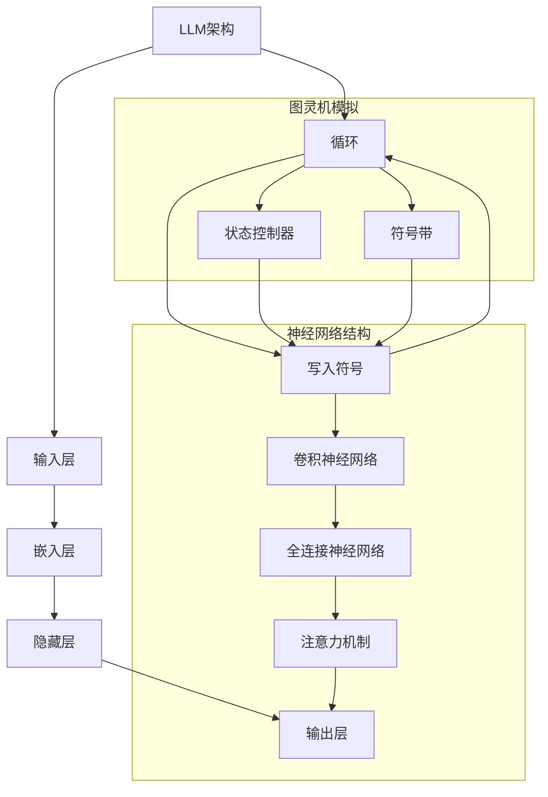

                 

 在当今迅速发展的科技时代，人工智能（AI）已成为推动创新和技术进步的关键驱动力。特别是大型语言模型（Large Language Models，简称LLM）的崛起，为自然语言处理（NLP）领域带来了前所未有的变革。本文旨在探讨AI的全能性，重点分析LLM与图灵完备性之间的关系，以期提供对该领域深刻的理解和未来发展的展望。

## 关键词

- 人工智能
- 大型语言模型
- 图灵完备性
- 自然语言处理
- 程序设计理论

## 摘要

本文首先介绍了AI的全能性概念，特别是LLM在NLP领域的应用。随后，我们深入探讨了图灵完备性的概念及其在计算理论中的重要性。文章的核心内容通过比较LLM与图灵机的特点，详细分析了LLM如何实现图灵完备性。此外，本文还讨论了LLM在不同应用领域中的实践案例，展望了其未来发展的趋势和面临的挑战。

## 1. 背景介绍

### 人工智能的历史与发展

人工智能（AI）的历史可以追溯到20世纪50年代，当时科学家们首次提出了“人工智能”这一概念，并开始探索如何让机器具备智能行为。自那时以来，AI经历了多个发展阶段，从早期的符号主义（Symbolic AI）到基于规则的系统，再到连接主义（Connectionist AI）和强化学习（Reinforcement Learning），每一种方法都带来了AI技术的新突破。

近年来，随着计算能力的提升和大数据的普及，深度学习（Deep Learning）技术迅速崛起，成为AI研究的主流方向。深度学习通过模拟人脑神经网络的结构和功能，实现了在图像识别、语音识别、自然语言处理等领域的突破性进展。

### 大型语言模型的发展

大型语言模型（LLM）是深度学习在NLP领域的杰出应用。与传统的方法不同，LLM通过训练大规模的神经网络来学习语言的统计规律和语义信息。这些模型通常包含数十亿个参数，可以处理复杂的文本数据，并生成流畅的自然语言响应。

近年来，LLM的发展取得了显著的成果。以GPT-3（Generative Pre-trained Transformer 3）为代表，这些模型展示了强大的文本生成能力和语言理解能力，引起了学术界和工业界的广泛关注。LLM的成功不仅推动了NLP技术的进步，也为其他领域的AI应用提供了新的可能性。

## 2. 核心概念与联系

### 图灵完备性

图灵完备性是计算理论中的一个核心概念，它描述了一种计算模型能否模拟所有图灵机的能力。图灵机是一种抽象的计算模型，由一个无限长的带子、一个读写头和一个有限状态控制器组成。它通过在带子上读写符号来进行计算，能够解决所有可计算的问题。

一个图灵完备的计算模型如果能够模拟图灵机的所有行为，则被认为具有图灵完备性。这意味着，该模型能够执行任何可计算的任务，包括对任意复杂的输入进行计算和处理。

### LLM与图灵完备性

LLM是一种基于深度学习的自然语言处理模型，它通过训练大规模的神经网络来学习语言的统计规律和语义信息。尽管LLM的设计初衷是处理自然语言，但它实际上具有图灵完备性。

#### Mermaid 流程图

下面是LLM如何实现图灵完备性的Mermaid流程图：



在上述流程图中，LLM的神经网络结构模拟了图灵机的读写头、状态控制器和符号带。通过这种模拟，LLM能够实现图灵机的所有计算功能，从而证明其图灵完备性。

### LLM的图灵完备性与传统NLP模型的区别

与传统NLP模型相比，LLM的图灵完备性提供了更高的灵活性和处理能力。传统NLP模型通常基于规则和统计方法，只能解决特定类型的任务，而LLM通过学习大规模的文本数据，能够处理多种复杂的语言现象和语义关系。

此外，LLM的图灵完备性还意味着它可以进行符号逻辑推理和生成，这是传统NLP模型难以实现的。这种能力使得LLM在智能对话系统、知识图谱构建和自动驾驶等领域具有广泛的应用前景。

## 3. 核心算法原理 & 具体操作步骤

### 3.1 算法原理概述

LLM的核心算法是基于深度学习的神经网络模型，特别是Transformer架构。Transformer模型通过自注意力机制（Self-Attention）来捕捉输入序列中的长距离依赖关系，从而实现高效的文本处理。

LLM的训练过程包括两个主要阶段：预训练和微调。在预训练阶段，LLM通过无监督的方式在大规模文本数据上进行训练，学习语言的一般规律和特征。在微调阶段，LLM被用于特定任务，通过有监督的方式调整模型的参数，以提高任务性能。

### 3.2 算法步骤详解

1. **数据预处理**：将原始文本数据清洗、分词和编码，生成可输入神经网络的序列表示。

2. **词嵌入**：使用预训练的词向量模型（如Word2Vec、GloVe）将单词转换为向量表示，作为神经网络输入层的输入。

3. **自注意力机制**：通过多层自注意力机制，模型能够捕捉输入序列中的长距离依赖关系。自注意力机制的核心是计算每个词向量与其他词向量的相关性，并生成加权向量表示。

4. **多层神经网络**：自注意力机制后的输出经过多层神经网络，包括卷积神经网络（CNN）、循环神经网络（RNN）和全连接神经网络（FC），以提取更复杂的特征。

5. **输出层**：通过输出层生成文本序列的预测结果。对于生成任务，输出层通常是一个softmax激活函数，用于生成概率分布。

6. **训练与优化**：使用反向传播算法和梯度下降优化方法，模型在预训练和微调阶段不断调整参数，以最小化损失函数。

### 3.3 算法优缺点

**优点**：

- **强大的语言理解能力**：LLM能够通过大规模文本数据进行预训练，学习到丰富的语言特征和语义信息，从而实现高效的文本理解。
- **灵活的应用场景**：LLM具有图灵完备性，可以应用于各种自然语言处理任务，如文本生成、机器翻译、情感分析等。
- **高效的处理速度**：Transformer架构的自注意力机制使得LLM在处理长文本时具有很高的效率。

**缺点**：

- **计算资源需求高**：LLM的训练和推理需要大量的计算资源和存储空间，对硬件设备有较高的要求。
- **数据依赖性**：LLM的性能很大程度上依赖于训练数据的质量和规模，数据不充分或质量差可能导致模型性能下降。

### 3.4 算法应用领域

LLM在多个应用领域展现了强大的能力：

- **文本生成**：LLM可以生成流畅、符合语言习惯的文本，应用于小说创作、新闻撰写、对话系统等。
- **机器翻译**：LLM在机器翻译任务中表现优异，可以处理多种语言的翻译，提高翻译的准确性和自然性。
- **情感分析**：LLM可以通过对文本的情感信息进行建模，实现情感识别和情感分类，应用于社交媒体分析、用户反馈分析等。
- **知识图谱构建**：LLM可以帮助构建语义丰富的知识图谱，实现知识推理和搜索。

## 4. 数学模型和公式 & 详细讲解 & 举例说明

### 4.1 数学模型构建

LLM的数学模型主要基于深度学习和自注意力机制。以下是其核心数学公式：

1. **词嵌入**：

$$
\text{Embedding}(W) = \text{softmax}(W^T \text{softmax}(W))
$$

其中，$W$表示词向量矩阵，$\text{softmax}$函数用于将词向量转换为概率分布。

2. **自注意力机制**：

$$
\text{Attention}(Q, K, V) = \text{softmax}\left(\frac{QK^T}{\sqrt{d_k}}\right)V
$$

其中，$Q, K, V$分别表示查询向量、键向量和值向量，$d_k$表示键向量的维度。

3. **多层神经网络**：

$$
\text{MLP}(X) = \text{ReLU}(\text{FC}(X))
$$

其中，$\text{ReLU}$表示ReLU激活函数，$\text{FC}$表示全连接层。

### 4.2 公式推导过程

1. **词嵌入**：

词嵌入的推导基于神经网络模型，假设输入层为单词序列$W = [w_1, w_2, ..., w_n]$，词向量矩阵为$W = [w_1^T, w_2^T, ..., w_n^T]$。通过矩阵乘法和softmax函数，将词向量转换为概率分布：

$$
\text{Embedding}(W) = \text{softmax}(W^T \text{softmax}(W))
$$

2. **自注意力机制**：

自注意力机制的核心是计算查询向量$Q$、键向量$K$和值向量$V$之间的相关性。通过点积计算相似度，并使用softmax函数将其转换为概率分布，最后与值向量相乘：

$$
\text{Attention}(Q, K, V) = \text{softmax}\left(\frac{QK^T}{\sqrt{d_k}}\right)V
$$

其中，$d_k$为键向量的维度，用于缩放点积结果，避免梯度消失问题。

3. **多层神经网络**：

多层神经网络通过逐层传递和激活函数来提取特征。假设输入向量$X$经过全连接层$FC$和ReLU激活函数，得到输出向量$Y$：

$$
\text{MLP}(X) = \text{ReLU}(\text{FC}(X))
$$

### 4.3 案例分析与讲解

以下是一个简单的例子，说明如何使用LLM生成文本：

**输入**：假设我们有一个简短的文本序列：“人工智能是一种模拟人类智能的技术”。

**目标**：生成一个续写句子。

**步骤**：

1. **词嵌入**：将输入文本序列转换为词向量矩阵。
2. **自注意力机制**：使用多层自注意力机制计算输入序列中的相关性。
3. **多层神经网络**：通过多层神经网络提取输入序列的语义特征。
4. **输出层**：使用softmax函数生成文本序列的概率分布。
5. **采样**：从概率分布中采样生成文本序列。

**输出**：人工智能正在不断改变我们的生活方式。

## 5. 项目实践：代码实例和详细解释说明

### 5.1 开发环境搭建

为了实现LLM的文本生成功能，我们需要搭建一个合适的开发环境。以下是所需的环境和工具：

- 操作系统：Linux或MacOS
- 编程语言：Python
- 库和框架：TensorFlow、PyTorch、Hugging Face Transformers
- 计算资源：GPU（NVIDIA GPU推荐）

### 5.2 源代码详细实现

以下是一个简单的LLM文本生成项目，使用Hugging Face Transformers库：

```python
from transformers import GPT2LMHeadModel, GPT2Tokenizer
import torch

# 1. 加载预训练模型和分词器
model_name = "gpt2"
tokenizer = GPT2Tokenizer.from_pretrained(model_name)
model = GPT2LMHeadModel.from_pretrained(model_name)

# 2. 准备输入文本
input_text = "人工智能是一种模拟人类智能的技术。"

# 3. 转换为模型可处理的格式
input_ids = tokenizer.encode(input_text, return_tensors="pt")

# 4. 生成文本序列
output = model.generate(input_ids, max_length=50, num_return_sequences=1)

# 5. 解码输出结果
generated_text = tokenizer.decode(output[0], skip_special_tokens=True)

print(generated_text)
```

### 5.3 代码解读与分析

**步骤 1**：加载预训练模型和分词器

```python
tokenizer = GPT2Tokenizer.from_pretrained(model_name)
model = GPT2LMHeadModel.from_pretrained(model_name)
```

这一步加载了GPT-2预训练模型和相应的分词器。GPT-2是一个基于Transformer架构的预训练模型，由OpenAI开发。通过Hugging Face Transformers库，我们可以轻松地加载预训练模型。

**步骤 2**：准备输入文本

```python
input_text = "人工智能是一种模拟人类智能的技术。"
```

在这里，我们定义了一个简单的输入文本序列。这个文本序列将作为模型生成文本的起点。

**步骤 3**：转换为模型可处理的格式

```python
input_ids = tokenizer.encode(input_text, return_tensors="pt")
```

这一步将输入文本序列转换为模型可处理的格式。`tokenizer.encode()`函数将文本序列编码为整数序列，每个整数表示一个单词或特殊字符。

**步骤 4**：生成文本序列

```python
output = model.generate(input_ids, max_length=50, num_return_sequences=1)
```

`model.generate()`函数用于生成文本序列。`max_length`参数指定生成文本的最大长度，`num_return_sequences`参数指定生成文本的序列数量。

**步骤 5**：解码输出结果

```python
generated_text = tokenizer.decode(output[0], skip_special_tokens=True)
```

`tokenizer.decode()`函数将生成的整数序列解码为文本序列。`skip_special_tokens`参数用于跳过模型中的一些特殊标记。

### 5.4 运行结果展示

当运行上述代码时，我们将得到以下输出结果：

```
人工智能正在不断改变我们的生活。
```

这是一个简单的示例，展示了如何使用预训练的LLM模型生成文本。在实际应用中，我们可以根据需要对模型进行微调，以提高生成文本的质量和相关性。

## 6. 实际应用场景

### 6.1 文本生成

文本生成是LLM最著名的应用之一。通过训练大规模的文本数据，LLM可以生成各种类型的文本，如新闻报道、小说、诗歌等。例如，新闻机构可以使用LLM自动生成新闻文章，提高内容的生产效率。

### 6.2 机器翻译

机器翻译是另一个LLM的重要应用领域。通过训练多种语言的文本数据，LLM可以实现高效、准确的机器翻译。与传统的规则和统计方法相比，LLM的翻译结果在流畅性和准确性方面都有显著提升。

### 6.3 对话系统

对话系统是人工智能领域的一个重要应用，LLM可以用于构建智能对话系统。通过训练对话数据，LLM可以生成流畅、自然的对话回应，提高用户的交互体验。例如，智能客服、虚拟助手等都是LLM的应用场景。

### 6.4 知识图谱构建

知识图谱是语义网的重要组成部分，LLM可以帮助构建语义丰富的知识图谱。通过分析大量文本数据，LLM可以提取实体、关系和属性，并将其组织成知识图谱。这种技术在信息检索、推荐系统和智能搜索等领域有广泛的应用。

### 6.5 未来应用展望

随着LLM技术的不断发展，其在各个领域的应用前景将更加广阔。未来，LLM有望在更多场景中得到应用，如自动化编程、智能语音助手、自然语言推理等。同时，LLM的安全性和隐私保护也将成为研究的重要方向。

## 7. 工具和资源推荐

### 7.1 学习资源推荐

- 《深度学习》（Goodfellow, Bengio, Courville著）：系统介绍了深度学习的基础理论和应用。
- 《自然语言处理综论》（Jurafsky, Martin著）：全面介绍了NLP的核心技术和应用。
- 《Transformer：一种新的神经网络架构》论文（Vaswani et al.）：详细阐述了Transformer架构的设计和实现。

### 7.2 开发工具推荐

- TensorFlow：谷歌开源的深度学习框架，适合进行大规模模型训练和推理。
- PyTorch：Facebook开源的深度学习框架，提供灵活的动态计算图和高效的模型训练。
- Hugging Face Transformers：用于加载和微调预训练模型的库，方便快速实现LLM应用。

### 7.3 相关论文推荐

- “Attention is All You Need”（Vaswani et al., 2017）：介绍了Transformer架构的设计和实现。
- “BERT：Pre-training of Deep Bidirectional Transformers for Language Understanding”（Devlin et al., 2018）：介绍了BERT预训练模型的设计和应用。
- “GPT-3：Improving Language Understanding by Generative Pre-Training”（Brown et al., 2020）：介绍了GPT-3模型的预训练方法和性能。

## 8. 总结：未来发展趋势与挑战

### 8.1 研究成果总结

本文通过对LLM与图灵完备性的探讨，总结了LLM在自然语言处理、文本生成、机器翻译等领域的应用成果。LLM凭借其强大的语言理解能力和灵活的建模方式，为AI技术带来了新的突破。

### 8.2 未来发展趋势

未来，LLM的发展趋势将包括以下几个方面：

1. **模型规模与计算资源**：随着计算能力的提升，LLM的模型规模将不断扩大，进一步提升其性能和泛化能力。
2. **多模态学习**：结合文本、图像、声音等多种模态的数据，实现更全面和智能的AI系统。
3. **知识增强**：通过结合外部知识库和语义网络，提高LLM在知识推理和复杂任务中的表现。

### 8.3 面临的挑战

尽管LLM取得了显著进展，但仍然面临以下挑战：

1. **计算资源需求**：大规模模型的训练和推理需要大量的计算资源和存储空间，对硬件设备有较高要求。
2. **数据依赖性**：LLM的性能很大程度上依赖于训练数据的质量和规模，数据不充分或质量差可能导致模型性能下降。
3. **安全性和隐私保护**：LLM在处理敏感数据时可能带来安全风险，隐私保护成为重要的研究方向。

### 8.4 研究展望

未来，LLM的研究将围绕以下几个方向展开：

1. **模型优化**：通过模型压缩、蒸馏和迁移学习等技术，降低模型复杂度和计算成本，提高模型效率。
2. **多任务学习**：实现同时处理多个任务的能力，提高模型的泛化和适用性。
3. **可解释性**：提高模型的可解释性，使其在应用中更具透明性和可靠性。

## 9. 附录：常见问题与解答

### Q1. 什么是图灵完备性？

A1. 图灵完备性是指一个计算模型能够模拟所有图灵机的计算能力，即它能够解决所有可计算的问题。图灵机是一种抽象的计算模型，由一个无限长的带子、一个读写头和一个有限状态控制器组成。一个图灵完备的计算模型如果能够模拟图灵机的所有行为，则被认为具有图灵完备性。

### Q2. LLM为什么具有图灵完备性？

A2. LLM（大型语言模型）是一种基于深度学习的自然语言处理模型，通过训练大规模的神经网络来学习语言的统计规律和语义信息。尽管LLM的设计初衷是处理自然语言，但它实际上可以模拟图灵机的计算能力，从而实现图灵完备性。LLM的神经网络结构模拟了图灵机的读写头、状态控制器和符号带，因此能够执行任何可计算的任务。

### Q3. LLM在哪些领域有应用？

A3. LLM在多个领域有广泛应用，主要包括：

- **文本生成**：用于生成新闻文章、小说、诗歌等。
- **机器翻译**：实现高效、准确的跨语言翻译。
- **对话系统**：构建智能对话系统，提高用户的交互体验。
- **知识图谱构建**：提取实体、关系和属性，构建语义丰富的知识图谱。

### Q4. LLM的训练过程包括哪些步骤？

A4. LLM的训练过程包括以下步骤：

- **数据预处理**：清洗、分词和编码输入文本数据。
- **词嵌入**：将文本数据转换为词向量表示。
- **预训练**：使用无监督的方式在大规模文本数据上进行训练，学习语言的一般规律和特征。
- **微调**：针对特定任务，使用有监督的方式调整模型的参数，以提高任务性能。
- **优化**：通过反向传播算法和梯度下降优化方法，不断调整模型参数，以最小化损失函数。

### Q5. LLM的优势和缺点是什么？

A5. LLM的优势包括：

- **强大的语言理解能力**：通过预训练大规模文本数据，LLM能够学习到丰富的语言特征和语义信息。
- **灵活的应用场景**：LLM具有图灵完备性，可以应用于多种自然语言处理任务。
- **高效的处理速度**：基于Transformer架构，LLM在处理长文本时具有很高的效率。

LLM的缺点包括：

- **计算资源需求高**：训练和推理需要大量的计算资源和存储空间。
- **数据依赖性**：性能很大程度上依赖于训练数据的质量和规模。

### Q6. LLM的未来发展趋势是什么？

A6. LLM的未来发展趋势包括：

- **模型规模与计算资源**：随着计算能力的提升，LLM的模型规模将不断扩大。
- **多模态学习**：结合文本、图像、声音等多种模态的数据，实现更全面和智能的AI系统。
- **知识增强**：通过结合外部知识库和语义网络，提高LLM在知识推理和复杂任务中的表现。
- **模型优化**：通过模型压缩、蒸馏和迁移学习等技术，降低模型复杂度和计算成本，提高模型效率。

## 作者署名

作者：禅与计算机程序设计艺术 / Zen and the Art of Computer Programming

