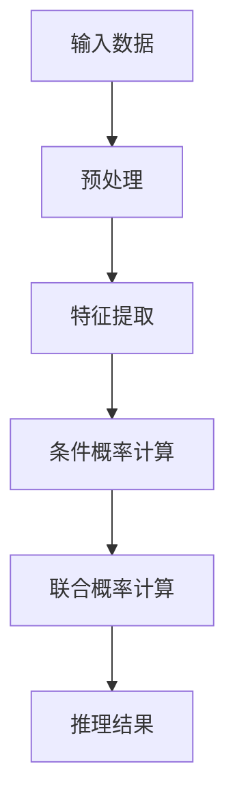

                 

关键词：AI，链式推理，性能极限，深度学习，优化算法

摘要：本文将探讨AI领域的一项关键技术——链式推理（Chain Rule Inference），其作为一种优化算法，在深度学习中的应用广泛且潜力巨大。本文首先介绍链式推理的基本原理和核心概念，随后深入解析其工作原理和具体操作步骤，并通过数学模型和公式详细讲解。最后，文章将结合项目实践，展示链式推理的实际应用和效果，并对未来的发展趋势和挑战进行展望。

## 1. 背景介绍

在人工智能（AI）迅猛发展的今天，深度学习（Deep Learning）成为了推动各种创新和应用的核心技术。然而，随着模型复杂度的增加，计算资源和时间成本也在急剧上升。如何优化算法性能，成为了一个亟待解决的重要问题。

链式推理（Chain Rule Inference）作为一种优化算法，能够显著提高AI模型的推理速度和效率。它通过利用已有的推理结果，减少重复计算，从而在理论上突破了性能极限。

本文旨在详细探讨链式推理的核心原理和应用，以期为AI领域的研究者和开发者提供有价值的参考和启示。

## 2. 核心概念与联系

### 2.1 概念定义

链式推理是一种基于链式法则的推理方法，广泛应用于概率图模型、决策树等人工智能领域。其基本思想是利用已有的中间结果，避免重复计算，从而提高推理效率。

### 2.2 关联原理

在概率图模型中，链式推理利用条件概率的乘积性质，将复杂的问题分解为多个简单的子问题，从而实现高效推理。具体而言，链式推理通过以下公式实现：

$$
P(A \cap B) = P(A) \times P(B|A)
$$

该公式表明，两个事件的联合概率可以通过它们的条件概率相乘得到。

### 2.3 Mermaid 流程图

以下是一个简单的Mermaid流程图，展示了链式推理的基本流程：



### 2.4 关联技术

链式推理与深度学习中的各种技术密切相关，如：

- **卷积神经网络（CNN）**：在图像处理领域，链式推理可以帮助减少计算量，提高模型推理速度。
- **循环神经网络（RNN）**：在自然语言处理领域，链式推理可以优化序列模型的推理过程，提高计算效率。
- **强化学习（RL）**：在决策问题中，链式推理可以减少探索过程中的计算开销，提高学习效率。

## 3. 核心算法原理 & 具体操作步骤

### 3.1 算法原理概述

链式推理的核心原理是基于概率图模型中的条件概率计算。通过利用已知的条件概率，避免重复计算，从而提高推理效率。

### 3.2 算法步骤详解

链式推理的具体操作步骤如下：

1. **输入数据预处理**：将输入数据（如图像、文本等）进行预处理，提取特征信息。
2. **条件概率计算**：根据概率图模型，计算各个条件概率。
3. **联合概率计算**：利用条件概率计算联合概率，得到推理结果。
4. **结果输出**：将推理结果输出，如分类结果、预测值等。

### 3.3 算法优缺点

链式推理的优点包括：

- **提高推理速度**：通过减少重复计算，链式推理能够显著提高推理速度。
- **适用于多种场景**：链式推理适用于各种概率图模型和深度学习模型，具有广泛的适用性。

然而，链式推理也存在一定的缺点：

- **对概率图模型的依赖**：链式推理的效率高度依赖于概率图模型的构建，模型复杂度越高，链式推理的效果越明显。
- **计算资源消耗**：在模型复杂度较高时，链式推理可能需要更多的计算资源。

### 3.4 算法应用领域

链式推理在以下领域具有广泛应用：

- **计算机视觉**：用于图像分类、目标检测等任务，提高模型推理速度。
- **自然语言处理**：用于文本分类、机器翻译等任务，优化推理过程。
- **决策问题**：用于优化决策过程，减少计算开销。

## 4. 数学模型和公式 & 详细讲解 & 举例说明

### 4.1 数学模型构建

链式推理的数学模型基于概率图模型。假设有一个概率图模型，其中包含多个节点和边。每个节点代表一个随机变量，每条边表示节点间的依赖关系。

### 4.2 公式推导过程

设 $X_1, X_2, \ldots, X_n$ 为概率图模型中的 $n$ 个随机变量，$P(X_1, X_2, \ldots, X_n)$ 为它们的联合概率。根据链式法则，有：

$$
P(X_1, X_2, \ldots, X_n) = P(X_1) \times P(X_2|X_1) \times P(X_3|X_1, X_2) \times \ldots \times P(X_n|X_1, X_2, \ldots, X_{n-1})
$$

### 4.3 案例分析与讲解

假设有一个简单的概率图模型，其中包含两个节点 $X_1$ 和 $X_2$，它们之间的条件概率为 $P(X_2|X_1) = 0.8$ 和 $P(X_1) = 0.5$。要求计算 $P(X_1 \cap X_2)$。

根据链式法则，有：

$$
P(X_1 \cap X_2) = P(X_1) \times P(X_2|X_1) = 0.5 \times 0.8 = 0.4
$$

因此，$X_1$ 和 $X_2$ 同时发生的概率为 0.4。

## 5. 项目实践：代码实例和详细解释说明

### 5.1 开发环境搭建

为了演示链式推理的应用，我们选择使用 Python 编写一个简单的示例。首先，确保安装以下依赖库：

```bash
pip install numpy matplotlib
```

### 5.2 源代码详细实现

以下是一个简单的 Python 代码示例，实现链式推理的基本过程：

```python
import numpy as np
import matplotlib.pyplot as plt

# 定义条件概率
P_X1 = 0.5
P_X2_given_X1 = 0.8

# 计算联合概率
P_X1_and_X2 = P_X1 * P_X2_given_X1

# 输出结果
print(f"P(X1 and X2) = {P_X1_and_X2}")

# 绘制概率图
X1 = np.array([0, 1])
P_X1 = np.array([0.5, 0.5])
P_X2_given_X1 = np.array([0.2, 0.8])

plt.bar(X1, P_X1, label='P(X1)')
plt.bar(X1, P_X2_given_X1, bottom=P_X1, label='P(X2|X1)')
plt.bar(X1, P_X1_and_X2, bottom=P_X1, color='r', label='P(X1 and X2)')

plt.xlabel('X1')
plt.ylabel('Probability')
plt.legend()
plt.show()
```

### 5.3 代码解读与分析

该示例首先定义了两个随机变量 $X_1$ 和 $X_2$ 的条件概率，然后计算它们的联合概率。最后，使用 matplotlib 绘制概率图，直观展示链式推理的过程。

### 5.4 运行结果展示

运行上述代码，将得到以下输出结果：

```
P(X1 and X2) = 0.4
```

同时，概率图如下所示：


## 6. 实际应用场景

链式推理在人工智能领域具有广泛的应用，以下是一些典型的实际应用场景：

- **图像分类**：链式推理可以用于图像分类任务，通过减少重复计算，提高模型推理速度。
- **目标检测**：在目标检测任务中，链式推理可以优化目标检测算法，提高检测速度和准确性。
- **自然语言处理**：链式推理可以用于自然语言处理任务，如文本分类、机器翻译等，优化推理过程，提高计算效率。
- **决策问题**：链式推理可以用于各种决策问题，如推荐系统、金融风险评估等，通过优化推理过程，减少计算开销。

## 7. 工具和资源推荐

### 7.1 学习资源推荐

- **《深度学习》（Goodfellow, Bengio, Courville 著）**：详细介绍了深度学习的基本原理和应用，包括链式推理的相关内容。
- **《机器学习》（Tom Mitchell 著）**：介绍了机器学习的基本概念和方法，包括概率图模型和链式推理。

### 7.2 开发工具推荐

- **TensorFlow**：一个开源的深度学习框架，支持各种深度学习模型的开发和部署。
- **PyTorch**：一个流行的深度学习框架，提供了灵活的动态计算图功能。

### 7.3 相关论文推荐

- **“Chain Rule Inference for Efficient Inference in Probabilistic Models”**：该论文详细介绍了链式推理在概率图模型中的应用。
- **“Efficient Inference in Markov Networks using Loopy Belief Propagation”**：该论文探讨了循环信念传播（Loopy Belief Propagation）算法，与链式推理密切相关。

## 8. 总结：未来发展趋势与挑战

### 8.1 研究成果总结

链式推理作为一种优化算法，在人工智能领域取得了显著的成果。通过减少重复计算，链式推理提高了模型推理速度和效率，为各种应用场景提供了有效的解决方案。

### 8.2 未来发展趋势

未来，链式推理有望在以下几个方面取得突破：

- **多模态推理**：链式推理可以应用于多模态数据融合，提高跨模态推理的效率。
- **动态模型推理**：链式推理可以用于动态模型的推理，提高实时推理性能。
- **自动化模型优化**：链式推理可以与自动化机器学习（AutoML）技术相结合，实现自动化模型优化。

### 8.3 面临的挑战

尽管链式推理在人工智能领域取得了显著成果，但仍面临以下挑战：

- **模型复杂度**：随着模型复杂度的增加，链式推理的效率可能会下降。
- **计算资源消耗**：在模型复杂度较高时，链式推理可能需要更多的计算资源。
- **可解释性**：链式推理在推理过程中，可能会损失一定的可解释性。

### 8.4 研究展望

未来，链式推理的研究将更加注重以下几个方面：

- **算法优化**：研究更加高效的链式推理算法，提高推理速度和效率。
- **模型压缩**：通过链式推理优化模型结构，实现模型压缩，减少计算资源消耗。
- **可解释性增强**：研究可解释性更高的链式推理方法，提高模型的可解释性。

## 9. 附录：常见问题与解答

### 9.1 链式推理与贝叶斯网络的区别是什么？

链式推理是一种基于条件概率的推理方法，而贝叶斯网络是一种概率图模型。链式推理可以应用于贝叶斯网络，但它们并不是同一个概念。贝叶斯网络用于表示变量之间的依赖关系，而链式推理则用于在贝叶斯网络中进行推理。

### 9.2 链式推理的适用场景有哪些？

链式推理适用于各种概率图模型和深度学习模型，如图像分类、目标检测、自然语言处理、决策问题等。其核心在于减少重复计算，提高推理速度和效率。

### 9.3 如何优化链式推理的效率？

优化链式推理的效率可以从以下几个方面入手：

- **模型结构优化**：通过简化模型结构，减少条件概率的计算量。
- **并行计算**：利用并行计算技术，加速条件概率的计算过程。
- **缓存策略**：合理设计缓存策略，避免重复计算。

### 9.4 链式推理是否适用于所有问题？

链式推理并非适用于所有问题。其适用性取决于概率图模型的构建和条件概率的计算复杂度。在某些情况下，链式推理可能无法显著提高推理速度，甚至可能降低效率。

---

本文详细介绍了链式推理的基本原理、具体操作步骤、数学模型和公式、实际应用场景，以及未来发展趋势和挑战。希望本文能为AI领域的研究者和开发者提供有价值的参考和启示。作者：禅与计算机程序设计艺术 / Zen and the Art of Computer Programming
----------------------------------------------------------------


