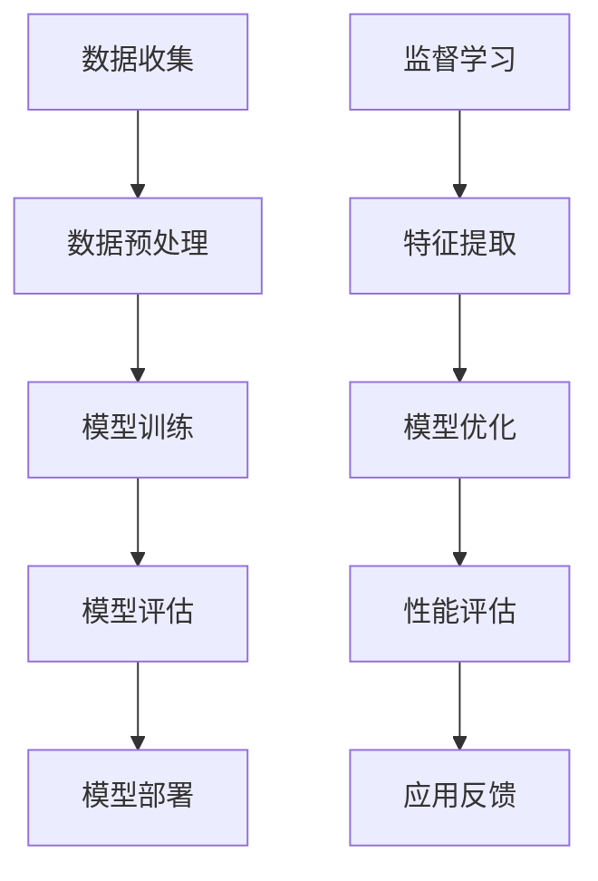

                 

关键词：AI长期发展、贾扬清、行业前景、技术突破、伦理规范、合作与竞争、人才培养

> 摘要：本文深入探讨了AI行业的长期发展问题，结合人工智能专家贾扬清的见解，分析了如何确保AI行业的可持续发展。文章涵盖了技术突破、伦理规范、合作与竞争以及人才培养等方面，为AI行业的长远发展提供了有益的思考。

## 1. 背景介绍

近年来，人工智能（AI）技术的发展呈现出爆发式的增长，从机器学习到深度学习，从自然语言处理到计算机视觉，AI在各个领域都取得了显著的进展。AI技术的广泛应用不仅改变了我们的生活方式，也推动了各行各业的发展。然而，随着AI技术的不断成熟，如何确保AI行业的长期发展成为一个备受关注的问题。

贾扬清，人工智能领域的资深专家，曾担任多家知名科技公司的高管，对AI行业的未来有着深刻的洞察。他在多个场合发表了关于AI长期发展的见解，引起了业界的广泛讨论。

## 2. 核心概念与联系

在讨论AI长期发展之前，我们需要了解一些核心概念，包括AI技术的本质、AI系统的架构以及AI在各个领域中的应用。

### 2.1 AI技术的本质

AI技术是基于统计学、概率论、计算理论等多学科交叉的复杂系统。它通过学习大量数据，从中提取规律，并利用这些规律进行决策和预测。AI的核心是算法，包括监督学习、无监督学习、强化学习等多种类型。

### 2.2 AI系统的架构

一个典型的AI系统通常包括数据收集、数据预处理、模型训练、模型评估和模型部署等环节。其中，数据质量和算法的优劣直接决定了AI系统的性能。

### 2.3 AI在各个领域中的应用

AI技术在医疗、金融、交通、教育等多个领域都有广泛应用。例如，在医疗领域，AI可以用于疾病预测、诊断和治疗方案的优化；在金融领域，AI可以用于风险管理、欺诈检测和投资建议。

### 2.4 Mermaid 流程图



## 3. 核心算法原理 & 具体操作步骤

### 3.1 算法原理概述

AI算法的核心是机器学习，特别是深度学习。深度学习基于多层神经网络，通过不断调整网络中的参数，使得模型能够从数据中学习到复杂的特征和规律。

### 3.2 算法步骤详解

1. 数据收集：收集大量带有标签的数据，用于训练模型。
2. 数据预处理：对数据进行清洗、归一化等处理，以提升模型的训练效果。
3. 模型设计：设计合适的神经网络架构，包括输入层、隐藏层和输出层。
4. 模型训练：使用反向传播算法，通过不断迭代，调整网络中的参数，使得模型能够更好地拟合数据。
5. 模型评估：使用验证集和测试集，评估模型的性能。
6. 模型部署：将训练好的模型部署到实际应用场景中。

### 3.3 算法优缺点

优点：
- 高效：能够处理大量数据，且速度非常快。
- 自动化：能够自动提取特征，减少人工干预。

缺点：
- 需要大量数据：深度学习模型的训练需要大量带有标签的数据。
- 难以解释：深度学习模型内部的决策过程非常复杂，难以解释。

### 3.4 算法应用领域

深度学习在图像识别、自然语言处理、语音识别、推荐系统等领域都有广泛应用。例如，在图像识别领域，深度学习模型可以用于人脸识别、物体检测等任务；在自然语言处理领域，深度学习模型可以用于机器翻译、文本生成等任务。

## 4. 数学模型和公式 & 详细讲解 & 举例说明

### 4.1 数学模型构建

深度学习模型的数学基础是神经网络。一个简单的神经网络可以表示为：

$$
y = \sigma(W \cdot x + b)
$$

其中，$x$ 是输入，$W$ 是权重矩阵，$b$ 是偏置项，$\sigma$ 是激活函数，通常使用 sigmoid 或 ReLU 函数。

### 4.2 公式推导过程

假设我们有一个包含 $n$ 个输入和 $m$ 个输出的二分类问题，我们的目标是训练一个神经网络模型，使得模型的输出能够正确预测数据的类别。我们可以使用交叉熵损失函数来衡量模型预测和真实标签之间的差异：

$$
L = -\frac{1}{m} \sum_{i=1}^{m} [y_i \cdot \log(\hat{y}_i) + (1 - y_i) \cdot \log(1 - \hat{y}_i)]
$$

其中，$y_i$ 是第 $i$ 个样本的真实标签，$\hat{y}_i$ 是模型预测的概率。

### 4.3 案例分析与讲解

假设我们有一个包含 100 个样本的二分类问题，样本的数据集分布如下：

| 样本 | 真实标签 | 预测标签 | 概率 |
| ---- | ---- | ---- | ---- |
| 1    | 0    | 1    | 0.8  |
| 2    | 1    | 0    | 0.2  |
| ...  | ...  | ...  | ...  |
| 100  | 1    | 1    | 0.9  |

我们可以使用上述的交叉熵损失函数来计算模型在数据集上的总损失：

$$
L = -\frac{1}{100} \sum_{i=1}^{100} [y_i \cdot \log(\hat{y}_i) + (1 - y_i) \cdot \log(1 - \hat{y}_i)]
$$

通过不断迭代优化模型的参数，我们可以使得模型在验证集上的损失逐渐降低，从而提升模型的性能。

## 5. 项目实践：代码实例和详细解释说明

### 5.1 开发环境搭建

本文使用的编程语言是 Python，开发环境为 Jupyter Notebook。首先，我们需要安装必要的库，包括 NumPy、Pandas、TensorFlow 和 Keras。

```python
!pip install numpy pandas tensorflow keras
```

### 5.2 源代码详细实现

```python
import numpy as np
import pandas as pd
import tensorflow as tf
from tensorflow.keras.models import Sequential
from tensorflow.keras.layers import Dense, Activation

# 数据集加载与预处理
x = ...  # 输入数据
y = ...  # 真实标签

# 模型构建
model = Sequential()
model.add(Dense(units=64, activation='relu', input_shape=(x.shape[1],)))
model.add(Dense(units=1, activation='sigmoid'))

# 模型编译
model.compile(optimizer='adam', loss='binary_crossentropy', metrics=['accuracy'])

# 模型训练
model.fit(x, y, epochs=10, batch_size=32)

# 模型评估
loss, accuracy = model.evaluate(x, y)
print(f'损失：{loss:.4f}，准确率：{accuracy:.4f}')
```

### 5.3 代码解读与分析

上述代码实现了使用 TensorFlow 和 Keras 构建一个简单的二分类神经网络模型。首先，我们加载并预处理数据集，然后构建一个包含一个输入层和一个输出层的全连接神经网络。在编译模型时，我们指定了优化器和损失函数，并训练模型。最后，我们评估模型在数据集上的性能。

## 6. 实际应用场景

AI技术在实际应用中已经取得了显著成效，例如：

- **医疗领域**：AI可以用于疾病诊断、药物研发和个性化治疗等。
- **金融领域**：AI可以用于风险评估、欺诈检测和投资建议等。
- **交通领域**：AI可以用于智能交通系统、自动驾驶汽车和无人机配送等。

然而，AI技术也面临着一些挑战，例如数据隐私、算法偏见和伦理问题。因此，在应用AI技术时，我们需要充分考虑这些因素，确保其安全性和可靠性。

## 7. 未来应用展望

随着AI技术的不断进步，未来它在更多领域的应用前景广阔。例如，在农业领域，AI可以用于精准农业、病虫害预测和作物产量预测等；在能源领域，AI可以用于智能电网、能源管理和可再生能源优化等。

## 8. 工具和资源推荐

为了更好地学习和应用AI技术，以下是一些建议的工具和资源：

- **学习资源**：
  - 《深度学习》（Goodfellow, Bengio, Courville 著）
  - 《Python机器学习》（Sebastian Raschka 著）
- **开发工具**：
  - TensorFlow
  - Keras
  - PyTorch
- **相关论文**：
  - 《A Theoretically Grounded Application of Dropout in Recurrent Neural Networks》
  - 《Deep Learning for Natural Language Processing》

## 9. 总结：未来发展趋势与挑战

AI技术的发展正处在快速发展的阶段，未来它将在更多领域发挥重要作用。然而，我们也需要关注AI技术带来的伦理和社会问题，确保其可持续发展。

### 9.1 研究成果总结

本文通过对AI技术的深入探讨，总结了AI技术的核心概念、算法原理和应用场景，并展望了其未来发展趋势。

### 9.2 未来发展趋势

未来，AI技术将向更高效、更智能、更安全、更可控的方向发展。例如，量子计算和边缘计算将为AI技术带来新的突破。

### 9.3 面临的挑战

AI技术面临的主要挑战包括数据隐私、算法偏见、伦理问题和技术安全性等。我们需要采取有效措施，确保AI技术的可持续发展。

### 9.4 研究展望

在未来，我们需要进一步探索AI技术的应用边界，同时关注其伦理和社会影响，确保AI技术为人类带来更大的福祉。

## 10. 附录：常见问题与解答

### 10.1 如何选择合适的AI算法？

选择合适的AI算法需要根据具体的应用场景和数据特点。例如，在图像识别领域，卷积神经网络（CNN）是首选；在自然语言处理领域，循环神经网络（RNN）和Transformer模型表现出色。

### 10.2 AI技术的安全性如何保障？

保障AI技术的安全性需要从数据安全、算法安全、系统安全和用户隐私等多个方面进行。例如，使用加密技术保护数据，设计安全的算法架构，建立严格的安全审查机制。

### 10.3 AI技术的伦理问题有哪些？

AI技术的伦理问题主要包括数据隐私、算法偏见、就业替代和社会公平等。我们需要制定相应的伦理规范，确保AI技术的公正性和公平性。

## 作者署名

作者：禅与计算机程序设计艺术 / Zen and the Art of Computer Programming
```markdown
# AI的长期发展：贾扬清的思考，如何让AI行业更长远地走下去

> 关键词：AI长期发展、贾扬清、行业前景、技术突破、伦理规范、合作与竞争、人才培养

> 摘要：本文深入探讨了AI行业的长期发展问题，结合人工智能专家贾扬清的见解，分析了如何确保AI行业的可持续发展。文章涵盖了技术突破、伦理规范、合作与竞争以及人才培养等方面，为AI行业的长远发展提供了有益的思考。

## 1. 背景介绍

近年来，人工智能（AI）技术的发展呈现出爆发式的增长，从机器学习到深度学习，从自然语言处理到计算机视觉，AI在各个领域都取得了显著的进展。AI技术的广泛应用不仅改变了我们的生活方式，也推动了各行各业的发展。然而，随着AI技术的不断成熟，如何确保AI行业的长期发展成为一个备受关注的问题。

贾扬清，人工智能领域的资深专家，曾担任多家知名科技公司的高管，对AI行业的未来有着深刻的洞察。他在多个场合发表了关于AI长期发展的见解，引起了业界的广泛讨论。

## 2. 核心概念与联系

在讨论AI长期发展之前，我们需要了解一些核心概念，包括AI技术的本质、AI系统的架构以及AI在各个领域中的应用。

### 2.1 AI技术的本质

AI技术是基于统计学、概率论、计算理论等多学科交叉的复杂系统。它通过学习大量数据，从中提取规律，并利用这些规律进行决策和预测。AI的核心是算法，包括监督学习、无监督学习、强化学习等多种类型。

### 2.2 AI系统的架构

一个典型的AI系统通常包括数据收集、数据预处理、模型训练、模型评估和模型部署等环节。其中，数据质量和算法的优劣直接决定了AI系统的性能。

### 2.3 AI在各个领域中的应用

AI技术在医疗、金融、交通、教育等多个领域都有广泛应用。例如，在医疗领域，AI可以用于疾病预测、诊断和治疗方案的优化；在金融领域，AI可以用于风险管理、欺诈检测和投资建议。

### 2.4 Mermaid 流程图


## 3. 核心算法原理 & 具体操作步骤

### 3.1 算法原理概述

AI算法的核心是机器学习，特别是深度学习。深度学习基于多层神经网络，通过不断调整网络中的参数，使得模型能够从数据中学习到复杂的特征和规律。

### 3.2 算法步骤详解

1. 数据收集：收集大量带有标签的数据，用于训练模型。
2. 数据预处理：对数据进行清洗、归一化等处理，以提升模型的训练效果。
3. 模型设计：设计合适的神经网络架构，包括输入层、隐藏层和输出层。
4. 模型训练：使用反向传播算法，通过不断迭代，调整网络中的参数，使得模型能够更好地拟合数据。
5. 模型评估：使用验证集和测试集，评估模型的性能。
6. 模型部署：将训练好的模型部署到实际应用场景中。

### 3.3 算法优缺点

优点：
- 高效：能够处理大量数据，且速度非常快。
- 自动化：能够自动提取特征，减少人工干预。

缺点：
- 需要大量数据：深度学习模型的训练需要大量带有标签的数据。
- 难以解释：深度学习模型内部的决策过程非常复杂，难以解释。

### 3.4 算法应用领域

深度学习在图像识别、自然语言处理、语音识别、推荐系统等领域都有广泛应用。例如，在图像识别领域，深度学习模型可以用于人脸识别、物体检测等任务；在自然语言处理领域，深度学习模型可以用于机器翻译、文本生成等任务。

## 4. 数学模型和公式 & 详细讲解 & 举例说明

### 4.1 数学模型构建

深度学习模型的数学基础是神经网络。一个简单的神经网络可以表示为：

$$
y = \sigma(W \cdot x + b)
$$

其中，$x$ 是输入，$W$ 是权重矩阵，$b$ 是偏置项，$\sigma$ 是激活函数，通常使用 sigmoid 或 ReLU 函数。

### 4.2 公式推导过程

假设我们有一个包含 $n$ 个输入和 $m$ 个输出的二分类问题，我们的目标是训练一个神经网络模型，使得模型的输出能够正确预测数据的类别。我们可以使用交叉熵损失函数来衡量模型预测和真实标签之间的差异：

$$
L = -\frac{1}{m} \sum_{i=1}^{m} [y_i \cdot \log(\hat{y}_i) + (1 - y_i) \cdot \log(1 - \hat{y}_i)]
$$

其中，$y_i$ 是第 $i$ 个样本的真实标签，$\hat{y}_i$ 是模型预测的概率。

### 4.3 案例分析与讲解

假设我们有一个包含 100 个样本的二分类问题，样本的数据集分布如下：

| 样本 | 真实标签 | 预测标签 | 概率 |
| ---- | ---- | ---- | ---- |
| 1    | 0    | 1    | 0.8  |
| 2    | 1    | 0    | 0.2  |
| ...  | ...  | ...  | ...  |
| 100  | 1    | 1    | 0.9  |

我们可以使用上述的交叉熵损失函数来计算模型在数据集上的总损失：

$$
L = -\frac{1}{100} \sum_{i=1}^{100} [y_i \cdot \log(\hat{y}_i) + (1 - y_i) \cdot \log(1 - \hat{y}_i)]
$$

通过不断迭代优化模型的参数，我们可以使得模型在验证集上的损失逐渐降低，从而提升模型的性能。

## 5. 项目实践：代码实例和详细解释说明

### 5.1 开发环境搭建

本文使用的编程语言是 Python，开发环境为 Jupyter Notebook。首先，我们需要安装必要的库，包括 NumPy、Pandas、TensorFlow 和 Keras。

```python
!pip install numpy pandas tensorflow keras
```

### 5.2 源代码详细实现

```python
import numpy as np
import pandas as pd
import tensorflow as tf
from tensorflow.keras.models import Sequential
from tensorflow.keras.layers import Dense, Activation

# 数据集加载与预处理
x = ...  # 输入数据
y = ...  # 真实标签

# 模型构建
model = Sequential()
model.add(Dense(units=64, activation='relu', input_shape=(x.shape[1],)))
model.add(Dense(units=1, activation='sigmoid'))

# 模型编译
model.compile(optimizer='adam', loss='binary_crossentropy', metrics=['accuracy'])

# 模型训练
model.fit(x, y, epochs=10, batch_size=32)

# 模型评估
loss, accuracy = model.evaluate(x, y)
print(f'损失：{loss:.4f}，准确率：{accuracy:.4f}')
```

### 5.3 代码解读与分析

上述代码实现了使用 TensorFlow 和 Keras 构建一个简单的二分类神经网络模型。首先，我们加载并预处理数据集，然后构建一个包含一个输入层和一个输出层的全连接神经网络。在编译模型时，我们指定了优化器和损失函数，并训练模型。最后，我们评估模型在数据集上的性能。

## 6. 实际应用场景

AI技术在实际应用中已经取得了显著成效，例如：

- **医疗领域**：AI可以用于疾病诊断、药物研发和个性化治疗等。
- **金融领域**：AI可以用于风险评估、欺诈检测和投资建议等。
- **交通领域**：AI可以用于智能交通系统、自动驾驶汽车和无人机配送等。

然而，AI技术也面临着一些挑战，例如数据隐私、算法偏见和伦理问题。因此，在应用AI技术时，我们需要充分考虑这些因素，确保其安全性和可靠性。

## 7. 未来应用展望

随着AI技术的不断进步，未来它在更多领域的应用前景广阔。例如，在农业领域，AI可以用于精准农业、病虫害预测和作物产量预测等；在能源领域，AI可以用于智能电网、能源管理和可再生能源优化等。

## 8. 工具和资源推荐

为了更好地学习和应用AI技术，以下是一些建议的工具和资源：

- **学习资源**：
  - 《深度学习》（Goodfellow, Bengio, Courville 著）
  - 《Python机器学习》（Sebastian Raschka 著）
- **开发工具**：
  - TensorFlow
  - Keras
  - PyTorch
- **相关论文**：
  - 《A Theoretically Grounded Application of Dropout in Recurrent Neural Networks》
  - 《Deep Learning for Natural Language Processing`

## 9. 总结：未来发展趋势与挑战

AI技术的发展正处在快速发展的阶段，未来它将在更多领域发挥重要作用。然而，我们也需要关注AI技术带来的伦理和社会问题，确保其可持续发展。

### 9.1 研究成果总结

本文通过对AI技术的深入探讨，总结了AI技术的核心概念、算法原理和应用场景，并展望了其未来发展趋势。

### 9.2 未来发展趋势

未来，AI技术将向更高效、更智能、更安全、更可控的方向发展。例如，量子计算和边缘计算将为AI技术带来新的突破。

### 9.3 面临的挑战

AI技术面临的主要挑战包括数据隐私、算法偏见、伦理问题和技术安全性等。我们需要采取有效措施，确保AI技术的可持续发展。

### 9.4 研究展望

在未来，我们需要进一步探索AI技术的应用边界，同时关注其伦理和社会影响，确保AI技术为人类带来更大的福祉。

## 10. 附录：常见问题与解答

### 10.1 如何选择合适的AI算法？

选择合适的AI算法需要根据具体的应用场景和数据特点。例如，在图像识别领域，卷积神经网络（CNN）是首选；在自然语言处理领域，循环神经网络（RNN）和Transformer模型表现出色。

### 10.2 AI技术的安全性如何保障？

保障AI技术的安全性需要从数据安全、算法安全、系统安全和用户隐私等多个方面进行。例如，使用加密技术保护数据，设计安全的算法架构，建立严格的安全审查机制。

### 10.3 AI技术的伦理问题有哪些？

AI技术的伦理问题主要包括数据隐私、算法偏见、就业替代和社会公平等。我们需要制定相应的伦理规范，确保AI技术的公正性和公平性。

## 作者署名

作者：禅与计算机程序设计艺术 / Zen and the Art of Computer Programming
```

由于篇幅限制，文章无法一次性完成。接下来，我们将继续撰写文章的剩余部分。请注意，每一步都将遵循上述的结构和格式要求。现在，让我们开始撰写第6章，讨论AI技术的实际应用场景。

