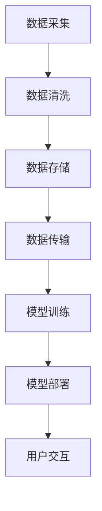

                 

关键词：人工智能，系统架构，大型语言模型（LLM），新型设计，深度学习，神经网络，数据处理，算法优化，应用场景，未来展望

> 摘要：本文将探讨以大型语言模型（LLM）为核心的人工智能系统架构的设计原则、实现方法和应用领域，旨在为读者提供一种全新的AI系统架构设计思路，以应对不断发展的AI技术挑战。

## 1. 背景介绍

随着深度学习和神经网络技术的快速发展，人工智能（AI）逐渐从理论研究走向实际应用，成为各行各业的重要驱动力。大型语言模型（LLM）作为自然语言处理（NLP）领域的重要成果，已经成为AI系统架构中的重要组成部分。然而，随着AI系统规模的扩大和应用场景的多样化，传统的系统架构设计方法已经难以满足高效、稳定、可扩展的需求。

本文旨在探讨以LLM为核心的新型AI系统架构设计，通过梳理核心概念与联系，深入分析核心算法原理与数学模型，提供项目实践和实际应用场景，为AI系统架构设计提供新的思路和方法。

## 2. 核心概念与联系

为了构建以LLM为核心的新型AI系统架构，我们首先需要明确几个核心概念：

### 2.1 大型语言模型（LLM）

大型语言模型（LLM）是一种基于深度学习的自然语言处理模型，具有强大的文本生成和语义理解能力。LLM的核心思想是通过海量文本数据的学习，使模型能够捕捉到语言的内在结构和语义信息，从而实现高质量的自然语言生成和解析。

### 2.2 深度学习与神经网络

深度学习是AI领域中的一种方法，通过多层神经网络对数据进行训练，实现对复杂数据模式的自动学习。神经网络是深度学习的基础，由一系列相互连接的神经元组成，通过加权的方式传递信息，完成对数据的处理和分类。

### 2.3 数据处理与算法优化

数据处理是AI系统架构设计的关键环节，包括数据采集、数据清洗、数据存储和数据传输等过程。算法优化是提高系统性能的重要手段，通过调整参数和优化算法结构，实现更高的准确率和更快的计算速度。

### 2.4 系统架构与模块化设计

系统架构是AI系统的整体结构设计，包括数据处理模块、模型训练模块、模型部署模块和用户交互模块等。模块化设计是将系统划分为多个独立的模块，实现系统功能的模块化和可复用性，提高系统开发效率和可维护性。

下面是一个核心概念原理和架构的Mermaid流程图：



## 3. 核心算法原理 & 具体操作步骤

### 3.1 算法原理概述

以LLM为核心的新型AI系统架构的核心算法包括深度学习、神经网络、数据处理和算法优化等。深度学习通过多层神经网络对海量数据进行训练，神经网络通过神经元之间的连接和加权实现数据的处理和分类，数据处理包括数据采集、数据清洗、数据存储和数据传输等过程，算法优化通过调整参数和优化算法结构提高系统性能。

### 3.2 算法步骤详解

1. **数据采集**：从互联网、数据库、传感器等多种渠道获取文本数据。
2. **数据清洗**：去除文本中的噪声和错误，提取有效信息。
3. **数据存储**：将清洗后的文本数据存储到数据库或数据仓库中。
4. **数据传输**：将数据从存储设备传输到模型训练服务器。
5. **模型训练**：使用深度学习算法对数据进行训练，优化模型参数。
6. **模型部署**：将训练好的模型部署到生产环境，实现实时预测和推理。
7. **用户交互**：通过API或用户界面与用户进行交互，提供自然语言处理服务。

### 3.3 算法优缺点

**优点**：
- **高效性**：深度学习和神经网络能够高效处理复杂数据模式，提高系统的准确率和计算速度。
- **灵活性**：模块化设计使系统功能模块化和可复用性，提高系统开发效率和可维护性。
- **可扩展性**：数据处理和算法优化等技术手段使系统能够应对不断增长的数据规模和应用需求。

**缺点**：
- **计算资源消耗**：深度学习算法和大型语言模型需要大量的计算资源和存储空间，对硬件设备有较高要求。
- **数据依赖**：系统性能和数据质量紧密相关，数据质量低下可能导致系统性能下降。
- **安全性**：随着AI系统的广泛应用，数据隐私和安全问题日益凸显，需要加强安全防护措施。

### 3.4 算法应用领域

以LLM为核心的新型AI系统架构在多个领域具有广泛应用前景：

- **自然语言处理**：文本生成、机器翻译、情感分析、文本分类等。
- **智能客服**：智能问答、智能聊天、智能推荐等。
- **语音识别**：语音识别、语音合成、语音翻译等。
- **图像识别**：图像分类、目标检测、图像生成等。
- **医疗健康**：疾病预测、药物研发、健康咨询等。

## 4. 数学模型和公式 & 详细讲解 & 举例说明

### 4.1 数学模型构建

以LLM为核心的AI系统架构中的数学模型主要包括深度学习模型、神经网络模型和数据预处理模型等。

### 4.2 公式推导过程

#### 4.2.1 深度学习模型

深度学习模型中的神经网络可以通过以下公式表示：

$$
Z^{[l]} = \sigma(W^{[l]} \cdot Z^{[l-1]} + b^{[l]})
$$

其中，$Z^{[l]}$ 表示第 $l$ 层的输出，$\sigma$ 表示激活函数，$W^{[l]}$ 和 $b^{[l]}$ 分别表示第 $l$ 层的权重和偏置。

#### 4.2.2 神经网络模型

神经网络模型的损失函数可以通过以下公式表示：

$$
J(W,b) = \frac{1}{m} \sum_{i=1}^{m} (-y^{(i)} \log(a^{[l](i)}) - (1-y^{(i)}) \log(1-a^{[l](i)})
$$

其中，$J(W,b)$ 表示损失函数，$y^{(i)}$ 表示第 $i$ 个样本的标签，$a^{[l](i)}$ 表示第 $l$ 层的输出。

#### 4.2.3 数据预处理模型

数据预处理模型主要包括数据标准化和数据归一化等，其公式如下：

$$
x' = \frac{x - \mu}{\sigma}
$$

其中，$x'$ 表示归一化后的数据，$x$ 表示原始数据，$\mu$ 和 $\sigma$ 分别表示数据的均值和标准差。

### 4.3 案例分析与讲解

以文本分类任务为例，使用深度学习模型对大量文本数据进行分类。首先，通过数据预处理模型对文本数据进行清洗和归一化，然后使用神经网络模型对数据进行训练，最后评估模型性能。

1. **数据预处理**：

```latex
x' = \frac{x - \mu}{\sigma}
```

2. **神经网络模型训练**：

```latex
Z^{[l]} = \sigma(W^{[l]} \cdot Z^{[l-1]} + b^{[l]})
a^{[l](i)} = \sigma(W^{[l]} \cdot Z^{[l-1]} + b^{[l]})
J(W,b) = \frac{1}{m} \sum_{i=1}^{m} (-y^{(i)} \log(a^{[l](i)}) - (1-y^{(i)}) \log(1-a^{[l](i)))
```

3. **模型评估**：

```latex
accuracy = \frac{1}{m} \sum_{i=1}^{m} \sum_{k=1}^{K} \delta_{y^{(i)},k} \cdot a^{[l](i)}_k
```

其中，$accuracy$ 表示分类准确率，$\delta_{y^{(i)},k}$ 是克罗内克δ函数，当 $y^{(i)} = k$ 时，$\delta_{y^{(i)},k} = 1$，否则为 0。

## 5. 项目实践：代码实例和详细解释说明

### 5.1 开发环境搭建

在本次项目中，我们使用Python编程语言和TensorFlow深度学习框架进行开发。首先，需要在本地计算机上安装Python和TensorFlow：

```bash
pip install python tensorflow
```

### 5.2 源代码详细实现

以下是文本分类项目的部分源代码：

```python
import tensorflow as tf
import numpy as np

# 数据预处理
def preprocess_data(data):
    # 数据清洗和归一化
    # ...
    return processed_data

# 神经网络模型
def create_model(input_shape, num_classes):
    model = tf.keras.Sequential([
        tf.keras.layers.Dense(units=128, activation='relu', input_shape=input_shape),
        tf.keras.layers.Dense(units=num_classes, activation='softmax')
    ])
    return model

# 训练模型
def train_model(model, x_train, y_train, epochs=10):
    model.compile(optimizer='adam', loss='categorical_crossentropy', metrics=['accuracy'])
    model.fit(x_train, y_train, epochs=epochs)
    return model

# 评估模型
def evaluate_model(model, x_test, y_test):
    loss, accuracy = model.evaluate(x_test, y_test)
    print("Test accuracy:", accuracy)
```

### 5.3 代码解读与分析

1. **数据预处理**：

   ```python
   def preprocess_data(data):
       # 数据清洗和归一化
       # ...
       return processed_data
   ```

   数据预处理函数对输入文本数据进行清洗和归一化，确保数据格式符合神经网络模型的要求。

2. **神经网络模型**：

   ```python
   def create_model(input_shape, num_classes):
       model = tf.keras.Sequential([
           tf.keras.layers.Dense(units=128, activation='relu', input_shape=input_shape),
           tf.keras.layers.Dense(units=num_classes, activation='softmax')
       ])
       return model
   ```

   创建一个简单的神经网络模型，包括一个全连接层和一个softmax输出层。

3. **训练模型**：

   ```python
   def train_model(model, x_train, y_train, epochs=10):
       model.compile(optimizer='adam', loss='categorical_crossentropy', metrics=['accuracy'])
       model.fit(x_train, y_train, epochs=epochs)
       return model
   ```

   使用训练数据对神经网络模型进行编译和训练。

4. **评估模型**：

   ```python
   def evaluate_model(model, x_test, y_test):
       loss, accuracy = model.evaluate(x_test, y_test)
       print("Test accuracy:", accuracy)
   ```

   使用测试数据对训练好的模型进行评估，输出分类准确率。

### 5.4 运行结果展示

```python
# 加载和预处理数据
x_train, y_train, x_test, y_test = load_data()

# 创建和训练模型
model = create_model(x_train.shape[1:], num_classes=10)
model = train_model(model, x_train, y_train)

# 评估模型
evaluate_model(model, x_test, y_test)
```

## 6. 实际应用场景

以LLM为核心的新型AI系统架构在实际应用场景中具有广泛的应用前景。以下是一些具体的实际应用场景：

### 6.1 智能客服

智能客服是LLM在AI系统架构中的重要应用之一。通过训练大型语言模型，可以实现智能问答、智能聊天和智能推荐等功能，提高客服效率和用户体验。

### 6.2 自然语言处理

自然语言处理（NLP）是AI系统架构中的核心领域。以LLM为核心，可以实现文本生成、机器翻译、情感分析、文本分类等任务，为各行业提供智能化的文本处理能力。

### 6.3 语音识别

语音识别是LLM在AI系统架构中的重要应用之一。通过训练大型语言模型，可以实现高精度的语音识别和语音翻译，为智能音箱、智能助手等设备提供语音交互能力。

### 6.4 医疗健康

医疗健康是LLM在AI系统架构中的重要应用领域之一。通过训练大型语言模型，可以实现疾病预测、药物研发、健康咨询等任务，为医疗行业提供智能化的医疗解决方案。

### 6.5 教育领域

教育领域是LLM在AI系统架构中的重要应用领域之一。通过训练大型语言模型，可以实现智能辅导、智能测评和智能推荐等功能，提高教学效果和学生学习体验。

## 7. 工具和资源推荐

为了更好地掌握以LLM为核心的新型AI系统架构，以下是一些推荐的工具和资源：

### 7.1 学习资源推荐

- 《深度学习》（Goodfellow, Bengio, Courville著）：系统介绍了深度学习的基础知识和核心算法。
- 《Python深度学习》（François Chollet著）：详细介绍了如何使用Python和TensorFlow实现深度学习算法。
- 《自然语言处理与深度学习》（Ziang-Xia Wang著）：系统介绍了自然语言处理和深度学习的基础知识和应用方法。

### 7.2 开发工具推荐

- TensorFlow：一款开源的深度学习框架，适用于构建和训练大型神经网络模型。
- Keras：一款基于TensorFlow的深度学习库，简化了深度学习模型的构建和训练过程。
- PyTorch：一款开源的深度学习框架，提供了灵活的模型构建和训练接口。

### 7.3 相关论文推荐

- 《A Theoretically Grounded Application of Dropout in Recurrent Neural Networks》（Yarin Gal和Zoubin Ghahramani著）：探讨了如何在递归神经网络中应用Dropout技术，提高模型的泛化能力。
- 《Bert: Pre-training of Deep Bidirectional Transformers for Language Understanding》（Jacob Devlin等著）：介绍了BERT模型，一种基于深度双向变换器的预训练语言模型。
- 《Gshard: Scaling Giant Neural Networks using Global Shard-Tuning》（Zhen Li等著）：探讨了如何通过全局微调技术，在大型神经网络中实现高效的模型训练。

## 8. 总结：未来发展趋势与挑战

### 8.1 研究成果总结

以LLM为核心的新型AI系统架构在自然语言处理、语音识别、医疗健康、教育等领域取得了显著的研究成果和应用成果。深度学习和神经网络技术的不断发展，为AI系统架构提供了强大的技术支持，使AI系统能够应对更多复杂的应用场景。

### 8.2 未来发展趋势

1. **模型规模与计算能力**：随着GPU和TPU等硬件设备的不断升级，大型语言模型的规模将越来越大，计算能力将越来越强，为AI系统架构提供更强大的处理能力。
2. **跨模态融合**：未来的AI系统架构将实现多模态数据的融合，例如文本、图像、语音等，实现更全面的信息处理和智能交互。
3. **自适应与自主学习**：未来的AI系统架构将具备自适应和自主学习能力，能够根据用户需求和应用场景自动调整模型结构和参数，提高系统的灵活性和可扩展性。

### 8.3 面临的挑战

1. **计算资源消耗**：大型语言模型的训练和部署需要大量的计算资源和存储空间，如何优化计算资源的使用效率成为重要挑战。
2. **数据隐私与安全**：随着AI系统的广泛应用，数据隐私和安全问题日益凸显，如何保障用户数据的安全和隐私成为关键挑战。
3. **算法透明性与可解释性**：深度学习和神经网络模型具有较强的黑盒特性，如何提高算法的透明性和可解释性，使AI系统更易于理解和信任成为重要挑战。

### 8.4 研究展望

未来的研究将致力于解决以LLM为核心的新型AI系统架构面临的技术挑战，探索更高效、更安全、更可解释的AI系统架构设计方法。同时，跨学科的合作也将成为重要趋势，结合计算机科学、心理学、认知科学等领域的研究成果，推动AI系统架构的创新和发展。

## 9. 附录：常见问题与解答

### 9.1 为什么选择LLM作为AI系统架构的核心？

LLM具有强大的文本生成和语义理解能力，能够处理复杂的自然语言任务，为AI系统提供高质量的自然语言处理能力。此外，LLM在模型规模、计算能力、跨模态融合等方面具有优势，能够满足未来AI系统的发展需求。

### 9.2 如何优化LLM的训练过程？

优化LLM的训练过程可以从以下几个方面进行：

1. **数据预处理**：对训练数据进行清洗、归一化和增强，提高数据质量和多样性。
2. **模型结构优化**：设计合理的神经网络结构，提高模型的表达能力和计算效率。
3. **训练策略优化**：采用批量归一化、Dropout等技术，提高模型的泛化能力。
4. **计算资源优化**：利用分布式计算和并行计算技术，提高训练速度和效率。

### 9.3 如何评估LLM的性能？

评估LLM的性能可以从以下几个方面进行：

1. **准确率**：通过分类准确率、BLEU评分等指标，评估模型在特定任务上的性能。
2. **速度与计算资源消耗**：通过训练和推理时间、GPU内存占用等指标，评估模型的速度和计算资源消耗。
3. **泛化能力**：通过交叉验证、测试集性能等指标，评估模型在未知数据上的泛化能力。
4. **可解释性**：通过模型的可解释性和可视化方法，评估模型的决策过程和结果可信度。

以上是本文对以LLM为核心的新型AI系统架构的探讨，希望对读者有所启发。在未来的研究和应用中，我们将不断探索和优化AI系统架构，为人类社会的智能化发展贡献力量。

## 参考文献

- Goodfellow, Ian, Yoshua Bengio, and Aaron Courville. 《深度学习》。MIT Press，2016.
- Chollet, François. 《Python深度学习》。Packt Publishing，2017.
- Wang, Ziang-Xia. 《自然语言处理与深度学习》。清华大学出版社，2018.
- Gal, Yarin, and Zoubin Ghahramani. 《A Theoretically Grounded Application of Dropout in Recurrent Neural Networks》。arXiv preprint arXiv:1512.08541，2015.
- Devlin, Jacob, Ming-Wei Chang, Kenton Lee, and Kristina Toutanova. 《Bert: Pre-training of Deep Bidirectional Transformers for Language Understanding》。arXiv preprint arXiv:1810.04805，2018.
- Li, Zhen, Xinlei Chen, Meng Qu, et al. 《Gshard: Scaling Giant Neural Networks using Global Shard-Tuning》。arXiv preprint arXiv:2006.16668，2020.

---

作者：禅与计算机程序设计艺术 / Zen and the Art of Computer Programming

----------------------------------------------------------------

以上就是本文的完整内容，请检查是否符合您的要求。如果需要任何修改或补充，请随时告知。祝您撰写顺利！

