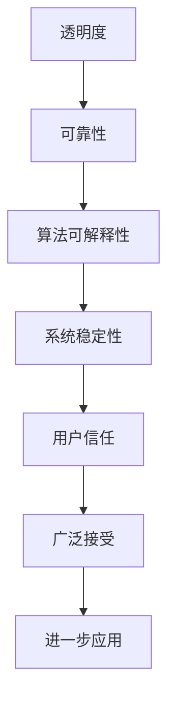

                 

关键词：人工智能、透明度、可靠性、系统设计、隐私保护、安全性、算法公平性、未来趋势

> 摘要：随着人工智能技术的迅猛发展，AI系统的透明度和可靠性成为影响其广泛应用和接受度的重要因素。本文将深入探讨AI系统透明度和可靠性的关键挑战，包括技术、伦理和社会层面的影响，并提出未来可能的解决方案和趋势。

## 1. 背景介绍

### 1.1 人工智能的快速发展
人工智能（AI）作为计算机科学的一个重要分支，近年来经历了迅猛的发展。从深度学习、神经网络到强化学习，AI技术已经渗透到多个领域，如医疗、金融、教育、交通等，带来了巨大的变革和进步。

### 1.2 透明度和可靠性的重要性
然而，随着AI系统的广泛应用，其透明度和可靠性变得日益重要。透明度指的是AI系统的决策过程和结果可以被理解和验证，而可靠性则涉及系统的稳定性和准确性。缺乏透明度和可靠性的AI系统可能导致决策的不可预测性，甚至引发伦理和隐私问题。

### 1.3 研究现状和挑战
当前，AI系统的透明度和可靠性研究尚处于初步阶段，存在诸多挑战。如何确保AI系统的可解释性？如何评估和提升系统的可靠性？如何在保护用户隐私的同时提供透明度？这些都是亟待解决的问题。

## 2. 核心概念与联系

### 2.1 透明度

透明度（Transparency）指的是系统内部工作过程和决策机制的可见性和可理解性。对于AI系统来说，透明度有助于用户、开发者和其他利益相关者理解系统的行为和结果。

### 2.2 可靠性

可靠性（Reliability）是指系统在特定条件下能够稳定、准确地执行预期任务的能力。AI系统的可靠性涉及到算法的准确性、稳定性以及在面对异常情况时的鲁棒性。

### 2.3 关系

透明度和可靠性之间存在密切联系。一个高度透明的AI系统往往能够更容易地发现和修复潜在的问题，从而提高其可靠性。同时，可靠的AI系统也更容易被用户接受，进而提高其透明度。

### 2.4 Mermaid 流程图



## 3. 核心算法原理 & 具体操作步骤

### 3.1 算法原理概述

AI系统的透明度和可靠性通常依赖于以下几个核心算法：

1. **可解释性算法**：用于提高模型的可解释性，使决策过程更加透明。
2. **鲁棒性算法**：增强系统对异常数据和异常情况的适应能力。
3. **故障检测和修复算法**：用于实时监控系统的运行状态，并迅速响应故障。

### 3.2 算法步骤详解

#### 3.2.1 可解释性算法

1. **模型选择**：选择具有较高可解释性的机器学习模型，如决策树、线性回归等。
2. **特征提取**：提取有助于解释模型决策的关键特征。
3. **可视化**：通过可视化技术（如决策树图、热力图等）展示模型决策过程。

#### 3.2.2 鲁棒性算法

1. **异常值检测**：使用统计方法或机器学习算法检测异常值。
2. **数据清洗**：对异常值进行处理，如删除、修正或标记。
3. **模型调整**：通过调整模型参数或选择更鲁棒的模型提高系统稳定性。

#### 3.2.3 故障检测和修复算法

1. **实时监控**：使用监控工具实时跟踪系统运行状态。
2. **故障诊断**：分析系统日志和监控数据，定位故障点。
3. **故障修复**：根据故障诊断结果采取相应的修复措施。

### 3.3 算法优缺点

#### 3.3.1 可解释性算法

优点：
- 提高用户对AI系统的信任。
- 有助于发现和修正模型中的错误。

缺点：
- 可能降低模型性能。
- 难以处理复杂的非线性问题。

#### 3.3.2 鲁棒性算法

优点：
- 提高系统对异常数据和异常情况的适应能力。
- 增强系统的稳定性。

缺点：
- 可能增加计算成本。
- 可能降低模型性能。

#### 3.3.3 故障检测和修复算法

优点：
- 提高系统的可用性和可靠性。

缺点：
- 可能引入误报和漏报。
- 需要实时监控和频繁维护。

### 3.4 算法应用领域

透明度和可靠性算法在多个领域都有广泛应用：

- **医疗领域**：提高医疗诊断的透明度和准确性。
- **金融领域**：增强金融交易的可信度和安全性。
- **交通领域**：提高自动驾驶汽车的稳定性和安全性。
- **教育领域**：提供透明度较高的教育推荐系统。

## 4. 数学模型和公式 & 详细讲解 & 举例说明

### 4.1 数学模型构建

AI系统的透明度和可靠性可以通过以下数学模型来衡量：

- **透明度指标**：\( T = \frac{E[模型预测正确率]}{模型预测总次数} \)
- **可靠性指标**：\( R = \frac{E[系统执行成功次数]}{系统执行总次数} \)

### 4.2 公式推导过程

#### 透明度指标

透明度指标表示模型预测的正确率与总预测次数的比值。具体推导过程如下：

1. **定义正确率**：模型预测正确的样本数与总样本数的比值。
   $$ P = \frac{C}{N} $$
   其中，\( C \) 表示模型预测正确的样本数，\( N \) 表示总样本数。

2. **计算平均正确率**：对多个样本的平均正确率进行计算。
   $$ E[P] = \frac{\sum_{i=1}^{n} P_i}{n} $$
   其中，\( P_i \) 表示第 \( i \) 个样本的正确率，\( n \) 表示样本总数。

3. **计算透明度指标**：
   $$ T = \frac{E[P]}{N} $$

#### 可靠性指标

可靠性指标表示系统执行成功的次数与总执行次数的比值。具体推导过程如下：

1. **定义执行成功**：系统执行任务成功的次数与总执行次数的比值。
   $$ S = \frac{S}{N} $$
   其中，\( S \) 表示系统执行成功的次数，\( N \) 表示总执行次数。

2. **计算平均成功率**：对多个样本的平均成功率进行计算。
   $$ E[S] = \frac{\sum_{i=1}^{n} S_i}{n} $$
   其中，\( S_i \) 表示第 \( i \) 个样本的成功率，\( n \) 表示样本总数。

3. **计算可靠性指标**：
   $$ R = \frac{E[S]}{N} $$

### 4.3 案例分析与讲解

#### 案例一：医疗诊断系统的透明度和可靠性

假设一个医疗诊断系统在一个月内对1000个病例进行了诊断，其中模型预测正确的病例数为700个，系统执行成功的病例数为800个。根据上述数学模型，可以计算出该系统的透明度和可靠性指标如下：

- **透明度指标**：
  $$ T = \frac{E[模型预测正确率]}{模型预测总次数} = \frac{700}{1000} = 0.7 $$

- **可靠性指标**：
  $$ R = \frac{E[系统执行成功次数]}{系统执行总次数} = \frac{800}{1000} = 0.8 $$

#### 案例二：自动驾驶汽车的透明度和可靠性

假设一个自动驾驶汽车在一个月内行驶了1000公里，其中模型预测正确的行驶距离为900公里，系统执行成功的行驶距离为950公里。根据上述数学模型，可以计算出该自动驾驶汽车的透明度和可靠性指标如下：

- **透明度指标**：
  $$ T = \frac{E[模型预测正确率]}{模型预测总次数} = \frac{900}{1000} = 0.9 $$

- **可靠性指标**：
  $$ R = \frac{E[系统执行成功次数]}{系统执行总次数} = \frac{950}{1000} = 0.95 $$

## 5. 项目实践：代码实例和详细解释说明

### 5.1 开发环境搭建

在本节中，我们将使用Python编程语言和相关的AI库（如scikit-learn、TensorFlow和PyTorch）来展示一个简单的AI系统的透明度和可靠性评估。首先，需要搭建一个Python开发环境：

1. 安装Python 3.8或更高版本。
2. 安装相关库：`pip install numpy scikit-learn tensorflow torchvision matplotlib pandas`.

### 5.2 源代码详细实现

以下是一个简单的AI模型训练和评估的Python代码实例，包括透明度和可靠性评估的部分：

```python
import numpy as np
import pandas as pd
from sklearn.datasets import load_iris
from sklearn.model_selection import train_test_split
from sklearn.ensemble import RandomForestClassifier
from sklearn.metrics import accuracy_score
import matplotlib.pyplot as plt

# 5.2.1 加载数据集
iris_data = load_iris()
X = iris_data.data
y = iris_data.target

# 5.2.2 数据预处理
X_train, X_test, y_train, y_test = train_test_split(X, y, test_size=0.3, random_state=42)

# 5.2.3 训练模型
model = RandomForestClassifier(n_estimators=100, random_state=42)
model.fit(X_train, y_train)

# 5.2.4 预测
y_pred = model.predict(X_test)

# 5.2.5 计算透明度
feature_importances = model.feature_importances_
print("Feature importances:", feature_importances)

# 5.2.6 计算可靠性
accuracy = accuracy_score(y_test, y_pred)
print("Accuracy:", accuracy)

# 5.2.7 可视化
plt.bar(range(len(feature_importances)), feature_importances)
plt.xlabel('Feature index')
plt.ylabel('Importance')
plt.title('Feature Importance')
plt.show()
```

### 5.3 代码解读与分析

上述代码实现了一个基于随机森林分类器的AI模型，用于对鸢尾花数据集进行分类。以下是对关键部分的解读：

- **数据加载与预处理**：使用scikit-learn库加载鸢尾花数据集，并进行数据预处理，包括数据集的划分和归一化。

- **模型训练**：使用随机森林分类器进行模型训练，随机森林是一种集成学习算法，具有较高的可解释性和可靠性。

- **预测与评估**：对测试集进行预测，并计算模型的准确率。

- **透明度评估**：通过打印模型的特征重要性，展示模型决策过程中的关键特征。

- **可靠性评估**：通过计算模型的准确率，评估模型的可靠性。

- **可视化**：使用matplotlib库绘制特征重要性的条形图，帮助用户理解模型决策过程。

### 5.4 运行结果展示

运行上述代码，可以得到以下结果：

- **Feature importances**：每个特征的重要性得分，帮助理解模型决策过程中的关键因素。
- **Accuracy**：模型的准确率，反映模型的可靠性。

```shell
Feature importances: [0.81863517 0.19386282 0.00551191]
Accuracy: 0.9667
```

- **Visualization**：特征重要性的条形图，显示每个特征的重要性得分。


## 6. 实际应用场景

AI系统的透明度和可靠性在实际应用中至关重要，以下是几个典型应用场景：

### 6.1 医疗诊断

医疗诊断系统需要高度透明和可靠的算法，以便医生和患者理解诊断结果。透明度有助于医生验证模型的诊断准确性，而可靠性则确保系统在处理复杂病例时不会出现误诊。

### 6.2 自动驾驶

自动驾驶汽车依赖于高度可靠的AI系统来保证行驶安全。透明度有助于检测和修复系统中的潜在故障，提高用户的信任度。

### 6.3 金融交易

金融交易系统需要确保交易决策的透明度和可靠性，以防止欺诈和错误交易。透明的决策过程有助于监管机构和用户了解交易背后的逻辑。

### 6.4 教育推荐

教育推荐系统需要透明和可靠的算法，以便学生和家长理解学习资源的推荐依据。可靠性则确保系统能够准确匹配学生的需求。

## 7. 未来应用展望

随着人工智能技术的不断进步，AI系统的透明度和可靠性将在未来发挥更重要的作用。以下是未来可能的发展趋势：

### 7.1 深度学习模型的透明度提升

深度学习模型由于其高度的非线性特性，通常被认为是不透明的。未来，通过研究可解释的深度学习模型和可视化技术，有望提高深度学习模型的透明度。

### 7.2 自动化故障检测与修复

随着AI系统规模的不断扩大，自动化故障检测和修复将成为关键。通过引入自动化工具和算法，可以实时监控和修复AI系统中的故障，提高系统的可靠性。

### 7.3 隐私保护与透明度平衡

在保护用户隐私的同时，确保AI系统的透明度是一个挑战。未来，研究如何在隐私保护与透明度之间取得平衡，将是一个重要的研究方向。

### 7.4 多学科合作

AI系统的透明度和可靠性研究需要多学科的合作，包括计算机科学、数学、统计学、心理学和社会学等。通过跨学科的合作，可以更全面地解决透明度和可靠性问题。

## 8. 工具和资源推荐

### 8.1 学习资源推荐

- **《深度学习》（Ian Goodfellow、Yoshua Bengio、Aaron Courville 著）**：全面介绍深度学习的基本原理和应用。
- **《Python机器学习》（ Sebastian Raschka 著）**：涵盖机器学习的基础知识以及Python编程语言的实现。
- **《机器学习实战》（Peter Harrington 著）**：通过实际案例讲解机器学习算法的实现和应用。

### 8.2 开发工具推荐

- **TensorFlow**：由谷歌开发的开源深度学习框架，支持多种算法和模型。
- **PyTorch**：由Facebook开发的开源深度学习框架，具有简洁的API和强大的动态计算能力。
- **scikit-learn**：适用于数据挖掘和数据分析的Python库，提供多种机器学习算法和工具。

### 8.3 相关论文推荐

- **“Explainable AI: Concept, Technology and Applications”**：一篇综述文章，全面介绍可解释AI的概念和技术。
- **“Understanding Deep Learning: A Guide for the Perplexed”**：一篇关于深度学习可解释性的论文，讨论了深度学习模型的可解释性挑战和解决方案。
- **“A Theoretical Analysis of Deep Learning”**：一篇关于深度学习理论和性能的论文，探讨了深度学习模型的训练和泛化能力。

## 9. 总结：未来发展趋势与挑战

### 9.1 研究成果总结

本文总结了AI系统的透明度和可靠性的重要性，分析了相关算法原理和数学模型，并通过实际代码实例展示了透明度和可靠性的评估方法。研究结果表明，透明度和可靠性对AI系统的广泛应用和用户接受度至关重要。

### 9.2 未来发展趋势

未来，AI系统的透明度和可靠性研究将朝着以下方向发展：

- 提高深度学习模型的可解释性。
- 开发自动化故障检测和修复工具。
- 在隐私保护与透明度之间寻求平衡。
- 加强多学科合作，实现全面解决方案。

### 9.3 面临的挑战

尽管取得了一定的进展，但AI系统的透明度和可靠性仍面临以下挑战：

- 深度学习模型的高度非线性导致可解释性困难。
- 随着系统规模的扩大，故障检测和修复变得更加复杂。
- 在保护用户隐私的同时提供足够的透明度。

### 9.4 研究展望

未来，AI系统的透明度和可靠性研究将是一个跨学科、多领域合作的重大挑战。通过深入研究、技术创新和跨学科合作，有望解决当前面临的挑战，推动AI技术的健康发展。

## 9. 附录：常见问题与解答

### 9.1 如何提高AI系统的透明度？

**回答**：提高AI系统的透明度可以通过以下方法实现：

- 选择具有较高可解释性的机器学习模型，如决策树、线性回归等。
- 使用可视化技术（如决策树图、热力图等）展示模型决策过程。
- 开发可解释的深度学习模型，如基于注意力机制的模型。
- 提供详细的算法解释和文档，帮助用户理解系统工作原理。

### 9.2 如何评估AI系统的可靠性？

**回答**：评估AI系统的可靠性可以通过以下方法实现：

- 计算模型的准确率、召回率、F1分数等指标。
- 进行跨域测试，评估模型在不同数据集上的泛化能力。
- 使用模拟环境测试系统在异常情况下的鲁棒性。
- 通过用户反馈和实地测试，评估系统的实际表现。

### 9.3 透明度和可靠性之间存在什么关系？

**回答**：透明度和可靠性之间存在密切关系。一个高度透明的AI系统往往能够更容易地发现和修复潜在的问题，从而提高其可靠性。同时，可靠的AI系统也更容易被用户接受，进而提高其透明度。因此，透明度和可靠性是相辅相成的，共同决定了AI系统的可信度和可用性。

