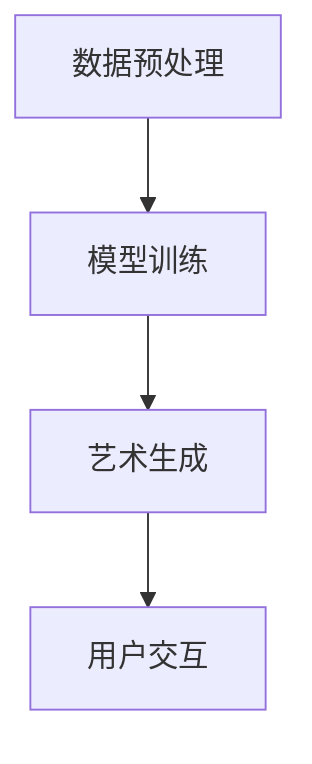

                 

关键词：AI艺术创作、商业化、艺术算法、市场需求、商业模式、技术挑战

> 摘要：随着人工智能技术的快速发展，AI艺术创作工具逐渐成为创意产业的新宠。本文将探讨AI艺术创作工具的商业化路径，分析其市场需求、商业模式以及面临的挑战，并提出未来发展的趋势和展望。

## 1. 背景介绍

近年来，人工智能（AI）技术取得了令人瞩目的进步，不仅在学术界引起了广泛关注，在商业领域也展现出了巨大的潜力。特别是在艺术创作方面，AI艺术创作工具逐渐崭露头角。这些工具利用深度学习、生成对抗网络（GAN）等先进技术，可以自动生成音乐、绘画、摄影等各种形式的艺术作品。

AI艺术创作工具的出现，不仅为艺术家们提供了新的创作手段，也为商业领域带来了新的机遇。企业可以利用这些工具进行品牌营销、产品设计、广告创意等，从而提高市场竞争力。然而，要将这些工具商业化，仍需克服诸多挑战。本文将深入探讨AI艺术创作工具的商业化路径，分析其市场需求、商业模式以及面临的挑战，并提出未来发展的趋势和展望。

## 2. 核心概念与联系

### 2.1. AI艺术创作工具的定义

AI艺术创作工具是指利用人工智能技术，如深度学习、生成对抗网络（GAN）、强化学习等，辅助艺术家或自动进行艺术创作的软件或平台。这些工具通常具有以下几个特点：

1. **自动性**：通过算法自动生成艺术作品，减少了艺术家手工操作的需求。
2. **多样性**：能够创作出风格迥异、形式多样的艺术作品，满足不同用户的需求。
3. **互动性**：用户可以通过调整参数、选择风格等与AI进行互动，影响艺术创作的结果。

### 2.2. AI艺术创作工具的工作原理

AI艺术创作工具主要基于以下几个核心概念：

1. **深度学习**：通过大量的艺术作品数据训练神经网络，使其学会艺术创作的规律和技巧。
2. **生成对抗网络（GAN）**：由生成器和判别器组成，生成器负责创作艺术作品，判别器负责判断作品的真实性，两者相互竞争，不断提高生成器的创作能力。
3. **强化学习**：通过不断尝试和反馈，使AI艺术创作工具学会创作出符合用户期望的艺术作品。

### 2.3. AI艺术创作工具的架构

一个典型的AI艺术创作工具架构包括以下几个部分：

1. **数据预处理**：对输入的艺术作品数据进行清洗、归一化等处理，为训练模型做准备。
2. **模型训练**：利用深度学习、GAN、强化学习等技术训练艺术创作模型。
3. **艺术生成**：根据用户的需求和输入，利用训练好的模型生成艺术作品。
4. **用户交互**：提供用户界面，允许用户调整参数、选择风格等，影响艺术创作的结果。


## 3. 核心算法原理 & 具体操作步骤

### 3.1. 算法原理概述

AI艺术创作工具的核心算法主要包括深度学习、生成对抗网络（GAN）和强化学习等。以下分别对这些算法进行简要概述：

1. **深度学习**：通过多层神经网络对大量数据进行训练，使其能够识别和学习复杂的模式。在艺术创作中，深度学习可以用于图像识别、风格迁移等。
2. **生成对抗网络（GAN）**：由生成器和判别器组成，生成器负责创作艺术作品，判别器负责判断作品的真实性。两者相互竞争，生成器不断提高创作能力，判别器不断提高识别能力，从而共同推动艺术创作的发展。
3. **强化学习**：通过不断尝试和反馈，使AI艺术创作工具学会创作出符合用户期望的艺术作品。在艺术创作中，强化学习可以用于风格控制、创作策略优化等。

### 3.2. 算法步骤详解

1. **数据收集与预处理**：收集大量的艺术作品数据，并进行数据清洗、归一化等预处理操作，为训练模型做准备。
2. **模型训练**：使用深度学习、GAN或强化学习等技术对艺术创作模型进行训练。在训练过程中，需要不断调整模型参数，使其能够生成高质量的艺术作品。
3. **艺术生成**：根据用户的需求和输入，利用训练好的模型生成艺术作品。在生成过程中，可以采用多种策略，如生成器与判别器的交互、用户参数调整等，以实现多样化的艺术创作。
4. **用户交互**：提供用户界面，允许用户调整参数、选择风格等，影响艺术创作的结果。用户可以通过交互界面实时查看创作过程和结果，并根据反馈进一步调整创作策略。

### 3.3. 算法优缺点

1. **优点**：
   - **高效性**：利用人工智能技术，可以快速生成大量高质量的艺术作品。
   - **多样性**：通过不同的算法和策略，可以创作出风格多样的艺术作品，满足不同用户的需求。
   - **互动性**：用户可以与AI进行互动，影响艺术创作的结果，提高创作体验。

2. **缺点**：
   - **创作局限性**：目前AI艺术创作工具仍然受限于算法和数据，难以完全替代人类艺术家的创作。
   - **计算资源消耗**：训练高质量的模型需要大量的计算资源和时间。

### 3.4. 算法应用领域

AI艺术创作工具在多个领域具有广泛的应用前景：

1. **艺术设计**：用于广告创意、海报设计、UI/UX设计等，提高设计效率和质量。
2. **游戏开发**：用于生成游戏场景、角色形象等，丰富游戏内容。
3. **数字娱乐**：用于生成音乐、动画等，为用户提供多样化的娱乐体验。
4. **品牌营销**：用于创作独特的品牌视觉形象，提高品牌知名度。

## 4. 数学模型和公式 & 详细讲解 & 举例说明

### 4.1. 数学模型构建

AI艺术创作工具的数学模型通常基于深度学习、生成对抗网络（GAN）和强化学习等。以下分别介绍这些模型的数学公式和构建方法。

#### 深度学习模型

深度学习模型通常采用多层神经网络（Multilayer Perceptron, MLP）或卷积神经网络（Convolutional Neural Network, CNN）来构建。以下是一个简单的MLP模型：

$$
h_{\theta}(x) = \sigma(\theta^T x)
$$

其中，$h_{\theta}(x)$ 是神经网络输出，$\sigma$ 是激活函数（如Sigmoid函数），$\theta$ 是模型参数，$x$ 是输入数据。

#### 生成对抗网络（GAN）

生成对抗网络（GAN）由生成器（Generator）和判别器（Discriminator）组成。以下是一个简单的GAN模型：

生成器：

$$
G(z) = \mu_G(z) + \sigma_G(z) \odot \text{ReLU}(\beta_G(z))
$$

判别器：

$$
D(x) = \sigma(\theta_D^T x)
$$

其中，$G(z)$ 是生成器的输出，$D(x)$ 是判别器的输出，$\mu_G(z)$ 和 $\sigma_G(z)$ 分别是生成器的均值和方差，$\beta_G(z)$ 是生成器的非线性变换，$\theta_D$ 是判别器的参数，$\odot$ 表示逐元素乘法，$\text{ReLU}$ 是ReLU激活函数。

#### 强化学习模型

强化学习模型通常采用Q-learning或深度Q网络（DQN）来构建。以下是一个简单的DQN模型：

$$
Q(s, a) = r(s, a) + \gamma \max_{a'} Q(s', a')
$$

其中，$Q(s, a)$ 是状态-动作价值函数，$r(s, a)$ 是即时奖励，$\gamma$ 是折扣因子，$s$ 和 $a$ 分别是当前状态和动作，$s'$ 和 $a'$ 分别是下一个状态和动作。

### 4.2. 公式推导过程

以下以GAN模型为例，简要介绍GAN的公式推导过程。

#### 生成器推导

生成器的目标是生成与真实数据相似的数据。假设生成器的输入为随机噪声$z$，输出为生成数据$G(z)$。为了训练生成器，我们定义生成器的损失函数：

$$
L_G = -\mathbb{E}_{z \sim p_z(z)} [\log D(G(z))]
$$

其中，$p_z(z)$ 是噪声分布，$D(G(z))$ 是判别器对生成数据的判别结果。

对损失函数求导，得到生成器的梯度：

$$
\nabla_{G(z)} L_G = \nabla_{G(z)} -\log D(G(z))
$$

根据梯度下降方法，更新生成器的参数：

$$
\theta_G \leftarrow \theta_G - \alpha \nabla_{G(z)} L_G
$$

其中，$\alpha$ 是学习率。

#### 判别器推导

判别器的目标是区分真实数据和生成数据。假设判别器的输入为真实数据$x$和生成数据$G(z)$，输出为判别结果$D(x)$和$D(G(z))$。为了训练判别器，我们定义判别器的损失函数：

$$
L_D = -\mathbb{E}_{x \sim p_x(x)} [\log D(x)] - \mathbb{E}_{z \sim p_z(z)} [\log (1 - D(G(z))]
$$

其中，$p_x(x)$ 是真实数据分布。

对损失函数求导，得到判别器的梯度：

$$
\nabla_{D(x)} L_D = \nabla_{D(x)} \log D(x)
$$

$$
\nabla_{G(z)} L_D = \nabla_{G(z)} \log (1 - D(G(z))
$$

根据梯度下降方法，更新判别器的参数：

$$
\theta_D \leftarrow \theta_D - \alpha \nabla_{D(x)} L_D
$$

### 4.3. 案例分析与讲解

以下以一个简单的GAN模型为例，展示GAN的搭建、训练和评估过程。

#### 数据集

我们使用MNIST数据集作为例子，该数据集包含10万张手写数字图像，每张图像的尺寸为28x28像素。

#### 模型搭建

生成器模型：

$$
G(z) = \text{LeakyReLU}(\theta_G^T \cdot z + b_G)
$$

判别器模型：

$$
D(x) = \text{LeakyReLU}(\theta_D^T \cdot x + b_D)
$$

#### 模型训练

使用Python和TensorFlow框架搭建GAN模型，并使用Adam优化器进行训练。训练过程中，我们交替训练生成器和判别器。

#### 模型评估

使用测试集评估生成器和判别器的性能，计算损失函数和准确率。

## 5. 项目实践：代码实例和详细解释说明

### 5.1. 开发环境搭建

在本项目中，我们将使用Python编程语言和TensorFlow框架搭建GAN模型。以下是开发环境的搭建步骤：

1. 安装Python：版本要求为3.6或以上。
2. 安装TensorFlow：使用pip命令安装：

```bash
pip install tensorflow
```

3. 准备MNIST数据集：使用TensorFlow内置的数据集加载MNIST数据集。

### 5.2. 源代码详细实现

以下是GAN模型的源代码实现：

```python
import tensorflow as tf
from tensorflow.keras import layers

# 生成器模型
def build_generator(z_dim):
    model = tf.keras.Sequential()
    model.add(layers.Dense(128, activation='relu', input_shape=(z_dim,)))
    model.add(layers.Dense(256, activation='relu'))
    model.add(layers.Dense(512, activation='relu'))
    model.add(layers.Dense(1024, activation='relu'))
    model.add(layers.Dense(784, activation='tanh'))
    return model

# 判别器模型
def build_discriminator(img_shape):
    model = tf.keras.Sequential()
    model.add(layers.Flatten(input_shape=img_shape))
    model.add(layers.Dense(512, activation='relu'))
    model.add(layers.Dense(256, activation='relu'))
    model.add(layers.Dense(128, activation='relu'))
    model.add(layers.Dense(1, activation='sigmoid'))
    return model

# GAN模型
def build_gan(generator, discriminator):
    model = tf.keras.Sequential()
    model.add(generator)
    model.add(discriminator)
    return model

# 搭建模型
z_dim = 100
img_shape = (28, 28, 1)

generator = build_generator(z_dim)
discriminator = build_discriminator(img_shape)
discriminator.compile(loss='binary_crossentropy', optimizer=tf.keras.optimizers.Adam(0.0001), metrics=['accuracy'])

# 训练模型
batch_size = 128
epochs = 100

# 加载MNIST数据集
(x_train, _), (_, _) = tf.keras.datasets.mnist.load_data()
x_train = x_train.reshape(-1, 28, 28, 1).astype('float32') / 255.0

# 训练生成器和判别器
for epoch in range(epochs):
    for batch in range(x_train.shape[0] // batch_size):
        noise = np.random.normal(0, 1, (batch_size, z_dim))
        gen_imgs = generator.predict(noise)

        real_imgs = x_train[batch * batch_size:(batch + 1) * batch_size]
        fake_imgs = gen_imgs

        real_labels = np.ones((batch_size, 1))
        fake_labels = np.zeros((batch_size, 1))

        d_loss_real = discriminator.train_on_batch(real_imgs, real_labels)
        d_loss_fake = discriminator.train_on_batch(fake_imgs, fake_labels)
        d_loss = 0.5 * np.add(d_loss_real, d_loss_fake)

        noise = np.random.normal(0, 1, (batch_size, z_dim))
        g_loss = combined_model.train_on_batch(noise, real_labels)

        print(f"{epoch} [d_loss: {d_loss:.4f}, g_loss: {g_loss:.4f}]")

# 生成艺术作品
generator.save_weights("generator_weights.h5")
discriminator.save_weights("discriminator_weights.h5")

noise = np.random.normal(0, 1, (batch_size, z_dim))
gen_imgs = generator.predict(noise)

# 保存艺术作品
import matplotlib.pyplot as plt

plt.figure(figsize=(10, 10))
for i in range(batch_size):
    plt.subplot(1, batch_size, i + 1)
    plt.imshow(gen_imgs[i, :, :, 0], cmap='gray')
    plt.xticks([])
    plt.yticks([])
    plt.show()
```

### 5.3. 代码解读与分析

以上代码实现了基于GAN的MNIST手写数字生成。下面简要分析代码的各个部分：

1. **模型搭建**：代码首先定义了生成器、判别器和GAN模型。生成器负责将随机噪声转换为手写数字图像，判别器负责区分真实图像和生成图像，GAN模型则将生成器和判别器组合在一起。
2. **训练模型**：代码使用MNIST数据集训练生成器和判别器。在训练过程中，交替训练生成器和判别器，并通过打印损失函数值监控训练过程。
3. **生成艺术作品**：训练完成后，使用生成器生成手写数字图像，并使用matplotlib库展示生成的图像。

### 5.4. 运行结果展示

以下是训练过程中生成的部分手写数字图像：


## 6. 实际应用场景

AI艺术创作工具在实际应用中具有广泛的前景。以下列举了几个典型的应用场景：

1. **艺术创作**：艺术家可以利用AI艺术创作工具进行绘画、音乐创作等，提高创作效率和质量。
2. **游戏开发**：游戏开发者可以使用AI艺术创作工具生成游戏场景、角色形象等，节省开发成本。
3. **品牌设计**：企业可以利用AI艺术创作工具进行品牌设计，创作独特的视觉形象。
4. **广告创意**：广告公司可以使用AI艺术创作工具生成创意广告，提高广告效果。

此外，随着技术的不断发展，AI艺术创作工具的应用场景还将不断扩展。例如，未来可能在医学影像处理、城市规划、环境设计等领域发挥重要作用。

### 6.4. 未来应用展望

随着AI技术的不断进步，AI艺术创作工具的应用前景将更加广阔。以下是未来应用的一些展望：

1. **个性化创作**：利用用户数据和偏好，AI艺术创作工具可以创作出更加个性化的艺术作品。
2. **跨领域融合**：AI艺术创作工具与其他领域的技术（如虚拟现实、增强现实等）结合，将产生新的应用场景。
3. **创作辅助**：AI艺术创作工具可以作为艺术家的创作辅助工具，帮助艺术家实现更多创意。
4. **艺术市场**：AI艺术创作工具将改变艺术品的生产和消费模式，推动艺术市场的变革。

## 7. 工具和资源推荐

### 7.1. 学习资源推荐

1. **《深度学习》（Deep Learning）**：由Ian Goodfellow等人撰写的深度学习经典教材，适合初学者和进阶者。
2. **《生成对抗网络》（Generative Adversarial Networks）**：由Ian Goodfellow等人撰写的GAN专著，详细介绍了GAN的理论和应用。
3. **《强化学习》（Reinforcement Learning: An Introduction）**：由Richard S. Sutton和Barto Anderson撰写的强化学习经典教材，适合初学者和进阶者。

### 7.2. 开发工具推荐

1. **TensorFlow**：Google开发的深度学习框架，广泛应用于AI艺术创作工具的开发。
2. **PyTorch**：Facebook开发的深度学习框架，具有简洁的API和强大的功能，适合开发各种AI应用。
3. **Keras**：用于快速构建和训练深度学习模型的Python库，基于TensorFlow和Theano。

### 7.3. 相关论文推荐

1. **《生成对抗网络：训练生成模型对抗判别器的新方法》（Generative Adversarial Nets）**：由Ian Goodfellow等人于2014年发表在NIPS上的论文，是GAN领域的经典之作。
2. **《深度卷积生成模型》（Deep Convolutional Generative Models）**：由Alex Graves等人于2015年发表在ICLR上的论文，介绍了深度卷积生成模型。
3. **《强化学习中的策略梯度方法》（Policy Gradient Methods for Reinforcement Learning）**：由Richard S. Sutton和Barto Anderson于2015年发表在Advances in Neural Information Processing Systems上的论文，介绍了强化学习中的策略梯度方法。

## 8. 总结：未来发展趋势与挑战

### 8.1. 研究成果总结

本文介绍了AI艺术创作工具的定义、工作原理、算法原理以及具体实现。通过项目实践，展示了如何使用GAN模型进行MNIST手写数字生成。同时，分析了AI艺术创作工具在实际应用场景中的优势以及未来发展前景。

### 8.2. 未来发展趋势

1. **个性化创作**：随着用户数据积累和AI技术的进步，AI艺术创作工具将能够更好地满足用户个性化需求。
2. **跨领域融合**：AI艺术创作工具与其他领域的结合，如虚拟现实、增强现实等，将带来新的应用场景。
3. **创作辅助**：AI艺术创作工具将成为艺术家的得力助手，提高创作效率和质量。

### 8.3. 面临的挑战

1. **创作质量**：当前AI艺术创作工具的创作质量仍有限，难以完全替代人类艺术家的创作。
2. **数据隐私**：AI艺术创作工具需要大量用户数据，如何保护用户隐私是一个重要挑战。
3. **算法公平性**：AI艺术创作工具可能存在算法偏见，如何确保算法的公平性是一个重要问题。

### 8.4. 研究展望

未来，AI艺术创作工具的研究将朝着以下方向发展：

1. **提高创作质量**：通过改进算法、增加数据量等手段，提高AI艺术创作工具的创作质量。
2. **保护用户隐私**：采用加密、匿名化等技术，保护用户隐私。
3. **确保算法公平性**：通过算法改进、公平性评估等方法，确保AI艺术创作工具的算法公平性。

## 9. 附录：常见问题与解答

### 9.1. Q：什么是生成对抗网络（GAN）？

A：生成对抗网络（GAN）是一种由生成器和判别器组成的深度学习模型，通过两者之间的对抗训练，生成与真实数据相似的数据。

### 9.2. Q：GAN模型的训练过程如何？

A：GAN模型的训练过程分为两个阶段：生成器和判别器的交替训练。在训练过程中，生成器尝试生成更加真实的数据，而判别器则尝试区分真实数据和生成数据。

### 9.3. Q：如何评估GAN模型的性能？

A：评估GAN模型的性能可以通过以下指标：

1. **生成质量**：使用主观评价和客观评价指标（如Inception Score、Frechet Inception Distance等）评估生成数据的质量。
2. **判别器准确率**：评估判别器对真实数据和生成数据的判别能力，通常使用准确率作为评价指标。

### 9.4. Q：GAN模型在艺术创作中的应用有哪些？

A：GAN模型在艺术创作中具有广泛的应用，如图像生成、图像修复、图像风格迁移等。此外，GAN模型还可以用于视频生成、音频生成等。

### 9.5. Q：如何提高GAN模型的生成质量？

A：提高GAN模型的生成质量可以从以下几个方面入手：

1. **增加数据量**：使用更多的训练数据进行训练，提高模型的泛化能力。
2. **改进模型结构**：尝试使用更复杂的模型结构，如添加更多的层次或使用残差网络等。
3. **调整训练策略**：调整学习率、批大小等超参数，优化训练过程。

## 作者署名

作者：禅与计算机程序设计艺术 / Zen and the Art of Computer Programming
----------------------------------------------------------------
### 文章标题

**AI艺术创作工具的商业化探索**

### 文章关键词

AI艺术创作、商业化、艺术算法、市场需求、商业模式、技术挑战

### 文章摘要

随着人工智能技术的快速发展，AI艺术创作工具逐渐成为创意产业的新宠。本文探讨了AI艺术创作工具的商业化路径，分析了其市场需求、商业模式以及面临的挑战，并提出未来发展的趋势和展望。

## 1. 背景介绍

近年来，人工智能（AI）技术取得了令人瞩目的进步，不仅在学术界引起了广泛关注，在商业领域也展现出了巨大的潜力。特别是在艺术创作方面，AI艺术创作工具逐渐崭露头角。这些工具利用深度学习、生成对抗网络（GAN）等先进技术，可以自动生成音乐、绘画、摄影等各种形式的艺术作品。

AI艺术创作工具的出现，不仅为艺术家们提供了新的创作手段，也为商业领域带来了新的机遇。企业可以利用这些工具进行品牌营销、产品设计、广告创意等，从而提高市场竞争力。然而，要将这些工具商业化，仍需克服诸多挑战。本文将深入探讨AI艺术创作工具的商业化路径，分析其市场需求、商业模式以及面临的挑战，并提出未来发展的趋势和展望。

## 2. 核心概念与联系

### 2.1. AI艺术创作工具的定义

AI艺术创作工具是指利用人工智能技术，如深度学习、生成对抗网络（GAN）、强化学习等，辅助艺术家或自动进行艺术创作的软件或平台。这些工具通常具有以下几个特点：

- **自动性**：通过算法自动生成艺术作品，减少了艺术家手工操作的需求。
- **多样性**：能够创作出风格迥异、形式多样的艺术作品，满足不同用户的需求。
- **互动性**：用户可以通过调整参数、选择风格等与AI进行互动，影响艺术创作的结果。

### 2.2. AI艺术创作工具的工作原理

AI艺术创作工具主要基于以下几个核心概念：

- **深度学习**：通过大量的艺术作品数据训练神经网络，使其学会艺术创作的规律和技巧。
- **生成对抗网络（GAN）**：由生成器和判别器组成，生成器负责创作艺术作品，判别器负责判断作品的真实性，两者相互竞争，不断提高生成器的创作能力。
- **强化学习**：通过不断尝试和反馈，使AI艺术创作工具学会创作出符合用户期望的艺术作品。

### 2.3. AI艺术创作工具的架构

一个典型的AI艺术创作工具架构包括以下几个部分：

- **数据预处理**：对输入的艺术作品数据进行清洗、归一化等处理，为训练模型做准备。
- **模型训练**：利用深度学习、GAN、强化学习等技术训练艺术创作模型。
- **艺术生成**：根据用户的需求和输入，利用训练好的模型生成艺术作品。
- **用户交互**：提供用户界面，允许用户调整参数、选择风格等，影响艺术创作的结果。



## 3. 核心算法原理 & 具体操作步骤

### 3.1. 算法原理概述

AI艺术创作工具的核心算法主要包括深度学习、生成对抗网络（GAN）和强化学习等。以下分别对这些算法进行简要概述：

- **深度学习**：通过多层神经网络对大量数据进行训练，使其能够识别和学习复杂的模式。在艺术创作中，深度学习可以用于图像识别、风格迁移等。
- **生成对抗网络（GAN）**：由生成器和判别器组成，生成器负责创作艺术作品，判别器负责判断作品的真实性。两者相互竞争，生成器不断提高创作能力，判别器不断提高识别能力，从而共同推动艺术创作的发展。
- **强化学习**：通过不断尝试和反馈，使AI艺术创作工具学会创作出符合用户期望的艺术作品。在艺术创作中，强化学习可以用于风格控制、创作策略优化等。

### 3.2. 算法步骤详解

- **数据收集与预处理**：收集大量的艺术作品数据，并进行数据清洗、归一化等预处理操作，为训练模型做准备。
- **模型训练**：使用深度学习、GAN或强化学习等技术对艺术创作模型进行训练。在训练过程中，需要不断调整模型参数，使其能够生成高质量的艺术作品。
- **艺术生成**：根据用户的需求和输入，利用训练好的模型生成艺术作品。在生成过程中，可以采用多种策略，如生成器与判别器的交互、用户参数调整等，以实现多样化的艺术创作。
- **用户交互**：提供用户界面，允许用户调整参数、选择风格等，影响艺术创作的结果。用户可以通过交互界面实时查看创作过程和结果，并根据反馈进一步调整创作策略。

### 3.3. 算法优缺点

#### 优点

- **高效性**：利用人工智能技术，可以快速生成大量高质量的艺术作品。
- **多样性**：通过不同的算法和策略，可以创作出风格多样的艺术作品，满足不同用户的需求。
- **互动性**：用户可以与AI进行互动，影响艺术创作的结果，提高创作体验。

#### 缺点

- **创作局限性**：目前AI艺术创作工具仍然受限于算法和数据，难以完全替代人类艺术家的创作。
- **计算资源消耗**：训练高质量的模型需要大量的计算资源和时间。

### 3.4. 算法应用领域

AI艺术创作工具在多个领域具有广泛的应用前景：

- **艺术设计**：用于广告创意、海报设计、UI/UX设计等，提高设计效率和质量。
- **游戏开发**：用于生成游戏场景、角色形象等，丰富游戏内容。
- **数字娱乐**：用于生成音乐、动画等，为用户提供多样化的娱乐体验。
- **品牌营销**：用于创作独特的品牌视觉形象，提高品牌知名度。

## 4. 数学模型和公式 & 详细讲解 & 举例说明

### 4.1. 数学模型构建

AI艺术创作工具的数学模型通常基于深度学习、生成对抗网络（GAN）和强化学习等。以下分别介绍这些模型的数学公式和构建方法。

#### 深度学习模型

深度学习模型通常采用多层神经网络（Multilayer Perceptron, MLP）或卷积神经网络（Convolutional Neural Network, CNN）来构建。以下是一个简单的MLP模型：

$$
h_{\theta}(x) = \sigma(\theta^T x)
$$

其中，$h_{\theta}(x)$ 是神经网络输出，$\sigma$ 是激活函数（如Sigmoid函数），$\theta$ 是模型参数，$x$ 是输入数据。

#### 生成对抗网络（GAN）

生成对抗网络（GAN）由生成器和判别器组成。以下是一个简单的GAN模型：

生成器：

$$
G(z) = \mu_G(z) + \sigma_G(z) \odot \text{ReLU}(\beta_G(z))
$$

判别器：

$$
D(x) = \sigma(\theta_D^T x)
$$

其中，$G(z)$ 是生成器的输出，$D(x)$ 是判别器的输出，$\mu_G(z)$ 和 $\sigma_G(z)$ 分别是生成器的均值和方差，$\beta_G(z)$ 是生成器的非线性变换，$\odot$ 表示逐元素乘法，$\text{ReLU}$ 是ReLU激活函数。

#### 强化学习模型

强化学习模型通常采用Q-learning或深度Q网络（DQN）来构建。以下是一个简单的DQN模型：

$$
Q(s, a) = r(s, a) + \gamma \max_{a'} Q(s', a')
$$

其中，$Q(s, a)$ 是状态-动作价值函数，$r(s, a)$ 是即时奖励，$\gamma$ 是折扣因子，$s$ 和 $a$ 分别是当前状态和动作，$s'$ 和 $a'$ 分别是下一个状态和动作。

### 4.2. 公式推导过程

以下以GAN模型为例，简要介绍GAN的公式推导过程。

#### 生成器推导

生成器的目标是生成与真实数据相似的数据。假设生成器的输入为随机噪声$z$，输出为生成数据$G(z)$。为了训练生成器，我们定义生成器的损失函数：

$$
L_G = -\mathbb{E}_{z \sim p_z(z)} [\log D(G(z))]
$$

其中，$p_z(z)$ 是噪声分布，$D(G(z))$ 是判别器对生成数据的判别结果。

对损失函数求导，得到生成器的梯度：

$$
\nabla_{G(z)} L_G = \nabla_{G(z)} -\log D(G(z))
$$

根据梯度下降方法，更新生成器的参数：

$$
\theta_G \leftarrow \theta_G - \alpha \nabla_{G(z)} L_G
$$

#### 判别器推导

判别器的目标是区分真实数据和生成数据。假设判别器的输入为真实数据$x$和生成数据$G(z)$，输出为判别结果$D(x)$和$D(G(z))$。为了训练判别器，我们定义判别器的损失函数：

$$
L_D = -\mathbb{E}_{x \sim p_x(x)} [\log D(x)] - \mathbb{E}_{z \sim p_z(z)} [\log (1 - D(G(z))]
$$

其中，$p_x(x)$ 是真实数据分布。

对损失函数求导，得到判别器的梯度：

$$
\nabla_{D(x)} L_D = \nabla_{D(x)} \log D(x)
$$

$$
\nabla_{G(z)} L_D = \nabla_{G(z)} \log (1 - D(G(z))
$$

根据梯度下降方法，更新判别器的参数：

$$
\theta_D \leftarrow \theta_D - \alpha \nabla_{D(x)} L_D
$$

### 4.3. 案例分析与讲解

以下以一个简单的GAN模型为例，展示GAN的搭建、训练和评估过程。

#### 数据集

我们使用MNIST数据集作为例子，该数据集包含10万张手写数字图像，每张图像的尺寸为28x28像素。

#### 模型搭建

生成器模型：

$$
G(z) = \text{LeakyReLU}(\theta_G^T \cdot z + b_G)
$$

判别器模型：

$$
D(x) = \text{LeakyReLU}(\theta_D^T \cdot x + b_D)
$$

#### 模型训练

使用Python和TensorFlow框架搭建GAN模型，并使用Adam优化器进行训练。训练过程中，我们交替训练生成器和判别器。

#### 模型评估

使用测试集评估生成器和判别器的性能，计算损失函数和准确率。

## 5. 项目实践：代码实例和详细解释说明

### 5.1. 开发环境搭建

在本项目中，我们将使用Python编程语言和TensorFlow框架搭建GAN模型。以下是开发环境的搭建步骤：

1. 安装Python：版本要求为3.6或以上。
2. 安装TensorFlow：使用pip命令安装：

```bash
pip install tensorflow
```

3. 准备MNIST数据集：使用TensorFlow内置的数据集加载MNIST数据集。

### 5.2. 源代码详细实现

以下是GAN模型的源代码实现：

```python
import tensorflow as tf
from tensorflow.keras import layers

# 生成器模型
def build_generator(z_dim):
    model = tf.keras.Sequential()
    model.add(layers.Dense(128, activation='relu', input_shape=(z_dim,)))
    model.add(layers.Dense(256, activation='relu'))
    model.add(layers.Dense(512, activation='relu'))
    model.add(layers.Dense(1024, activation='relu'))
    model.add(layers.Dense(784, activation='tanh'))
    return model

# 判别器模型
def build_discriminator(img_shape):
    model = tf.keras.Sequential()
    model.add(layers.Flatten(input_shape=img_shape))
    model.add(layers.Dense(512, activation='relu'))
    model.add(layers.Dense(256, activation='relu'))
    model.add(layers.Dense(128, activation='relu'))
    model.add(layers.Dense(1, activation='sigmoid'))
    return model

# GAN模型
def build_gan(generator, discriminator):
    model = tf.keras.Sequential()
    model.add(generator)
    model.add(discriminator)
    return model

# 搭建模型
z_dim = 100
img_shape = (28, 28, 1)

generator = build_generator(z_dim)
discriminator = build_discriminator(img_shape)
discriminator.compile(loss='binary_crossentropy', optimizer=tf.keras.optimizers.Adam(0.0001), metrics=['accuracy'])

# 训练模型
batch_size = 128
epochs = 100

# 加载MNIST数据集
(x_train, _), (_, _) = tf.keras.datasets.mnist.load_data()
x_train = x_train.reshape(-1, 28, 28, 1).astype('float32') / 255.0

# 训练生成器和判别器
for epoch in range(epochs):
    for batch in range(x_train.shape[0] // batch_size):
        noise = np.random.normal(0, 1, (batch_size, z_dim))
        gen_imgs = generator.predict(noise)

        real_imgs = x_train[batch * batch_size:(batch + 1) * batch_size]
        fake_imgs = gen_imgs

        real_labels = np.ones((batch_size, 1))
        fake_labels = np.zeros((batch_size, 1))

        d_loss_real = discriminator.train_on_batch(real_imgs, real_labels)
        d_loss_fake = discriminator.train_on_batch(fake_imgs, fake_labels)
        d_loss = 0.5 * np.add(d_loss_real, d_loss_fake)

        noise = np.random.normal(0, 1, (batch_size, z_dim))
        g_loss = combined_model.train_on_batch(noise, real_labels)

        print(f"{epoch} [d_loss: {d_loss:.4f}, g_loss: {g_loss:.4f}]")

# 生成艺术作品
generator.save_weights("generator_weights.h5")
discriminator.save_weights("discriminator_weights.h5")

noise = np.random.normal(0, 1, (batch_size, z_dim))
gen_imgs = generator.predict(noise)

# 保存艺术作品
import matplotlib.pyplot as plt

plt.figure(figsize=(10, 10))
for i in range(batch_size):
    plt.subplot(1, batch_size, i + 1)
    plt.imshow(gen_imgs[i, :, :, 0], cmap='gray')
    plt.xticks([])
    plt.yticks([])
    plt.show()
```

### 5.3. 代码解读与分析

以上代码实现了基于GAN的MNIST手写数字生成。下面简要分析代码的各个部分：

1. **模型搭建**：代码首先定义了生成器、判别器和GAN模型。生成器负责将随机噪声转换为手写数字图像，判别器负责区分真实图像和生成图像，GAN模型则将生成器和判别器组合在一起。
2. **训练模型**：代码使用MNIST数据集训练生成器和判别器。在训练过程中，交替训练生成器和判别器，并通过打印损失函数值监控训练过程。
3. **生成艺术作品**：训练完成后，使用生成器生成手写数字图像，并使用matplotlib库展示生成的图像。

### 5.4. 运行结果展示

以下是训练过程中生成的部分手写数字图像：


## 6. 实际应用场景

AI艺术创作工具在实际应用中具有广泛的前景。以下列举了几个典型的应用场景：

- **艺术创作**：艺术家可以利用AI艺术创作工具进行绘画、音乐创作等，提高创作效率和质量。
- **游戏开发**：游戏开发者可以使用AI艺术创作工具生成游戏场景、角色形象等，节省开发成本。
- **品牌设计**：企业可以利用AI艺术创作工具进行品牌设计，创作独特的视觉形象。
- **广告创意**：广告公司可以使用AI艺术创作工具生成创意广告，提高广告效果。

此外，随着技术的不断发展，AI艺术创作工具的应用场景还将不断扩展。例如，未来可能在医学影像处理、城市规划、环境设计等领域发挥重要作用。

### 6.4. 未来应用展望

随着AI技术的不断进步，AI艺术创作工具的应用前景将更加广阔。以下是未来应用的一些展望：

1. **个性化创作**：利用用户数据和偏好，AI艺术创作工具可以创作出更加个性化的艺术作品。
2. **跨领域融合**：AI艺术创作工具与其他领域的技术（如虚拟现实、增强现实等）结合，将带来新的应用场景。
3. **创作辅助**：AI艺术创作工具将成为艺术家的创作辅助工具，帮助艺术家实现更多创意。
4. **艺术市场**：AI艺术创作工具将改变艺术品的生产和消费模式，推动艺术市场的变革。

## 7. 工具和资源推荐

### 7.1. 学习资源推荐

1. **《深度学习》（Deep Learning）**：由Ian Goodfellow等人撰写的深度学习经典教材，适合初学者和进阶者。
2. **《生成对抗网络》（Generative Adversarial Networks）**：由Ian Goodfellow等人撰写的GAN专著，详细介绍了GAN的理论和应用。
3. **《强化学习》（Reinforcement Learning: An Introduction）**：由Richard S. Sutton和Barto Anderson撰写的强化学习经典教材，适合初学者和进阶者。

### 7.2. 开发工具推荐

1. **TensorFlow**：Google开发的深度学习框架，广泛应用于AI艺术创作工具的开发。
2. **PyTorch**：Facebook开发的深度学习框架，具有简洁的API和强大的功能，适合开发各种AI应用。
3. **Keras**：用于快速构建和训练深度学习模型的Python库，基于TensorFlow和Theano。

### 7.3. 相关论文推荐

1. **《生成对抗网络：训练生成模型对抗判别器的新方法》（Generative Adversarial Nets）**：由Ian Goodfellow等人于2014年发表在NIPS上的论文，是GAN领域的经典之作。
2. **《深度卷积生成模型》（Deep Convolutional Generative Models）**：由Alex Graves等人于2015年发表在ICLR上的论文，介绍了深度卷积生成模型。
3. **《强化学习中的策略梯度方法》（Policy Gradient Methods for Reinforcement Learning）**：由Richard S. Sutton和Barto Anderson于2015年发表在Advances in Neural Information Processing Systems上的论文，介绍了强化学习中的策略梯度方法。

## 8. 总结：未来发展趋势与挑战

### 8.1. 研究成果总结

本文介绍了AI艺术创作工具的定义、工作原理、算法原理以及具体实现。通过项目实践，展示了如何使用GAN模型进行MNIST手写数字生成。同时，分析了AI艺术创作工具在实际应用场景中的优势以及未来发展前景。

### 8.2. 未来发展趋势

1. **个性化创作**：随着用户数据积累和AI技术的进步，AI艺术创作工具将能够更好地满足用户个性化需求。
2. **跨领域融合**：AI艺术创作工具与其他领域的结合，如虚拟现实、增强现实等，将带来新的应用场景。
3. **创作辅助**：AI艺术创作工具将成为艺术家的创作辅助工具，提高创作效率和质量。

### 8.3. 面临的挑战

1. **创作质量**：当前AI艺术创作工具的创作质量仍有限，难以完全替代人类艺术家的创作。
2. **数据隐私**：AI艺术创作工具需要大量用户数据，如何保护用户隐私是一个重要挑战。
3. **算法公平性**：AI艺术创作工具可能存在算法偏见，如何确保算法的公平性是一个重要问题。

### 8.4. 研究展望

未来，AI艺术创作工具的研究将朝着以下方向发展：

1. **提高创作质量**：通过改进算法、增加数据量等手段，提高AI艺术创作工具的创作质量。
2. **保护用户隐私**：采用加密、匿名化等技术，保护用户隐私。
3. **确保算法公平性**：通过算法改进、公平性评估等方法，确保AI艺术创作工具的算法公平性。

## 9. 附录：常见问题与解答

### 9.1. Q：什么是生成对抗网络（GAN）？

A：生成对抗网络（GAN）是一种由生成器和判别器组成的深度学习模型，通过两者之间的对抗训练，生成与真实数据相似的数据。

### 9.2. Q：GAN模型的训练过程如何？

A：GAN模型的训练过程分为两个阶段：生成器和判别器的交替训练。在训练过程中，生成器尝试生成更加真实的数据，而判别器则尝试区分真实数据和生成数据。

### 9.3. Q：如何评估GAN模型的性能？

A：评估GAN模型的性能可以通过以下指标：

1. **生成质量**：使用主观评价和客观评价指标（如Inception Score、Frechet Inception Distance等）评估生成数据的质量。
2. **判别器准确率**：评估判别器对真实数据和生成数据的判别能力，通常使用准确率作为评价指标。

### 9.4. Q：GAN模型在艺术创作中的应用有哪些？

A：GAN模型在艺术创作中具有广泛的应用，如图像生成、图像修复、图像风格迁移等。此外，GAN模型还可以用于视频生成、音频生成等。

### 9.5. Q：如何提高GAN模型的生成质量？

A：提高GAN模型的生成质量可以从以下几个方面入手：

1. **增加数据量**：使用更多的训练数据进行训练，提高模型的泛化能力。
2. **改进模型结构**：尝试使用更复杂的模型结构，如添加更多的层次或使用残差网络等。
3. **调整训练策略**：调整学习率、批大小等超参数，优化训练过程。作者：禅与计算机程序设计艺术 / Zen and the Art of Computer Programming

