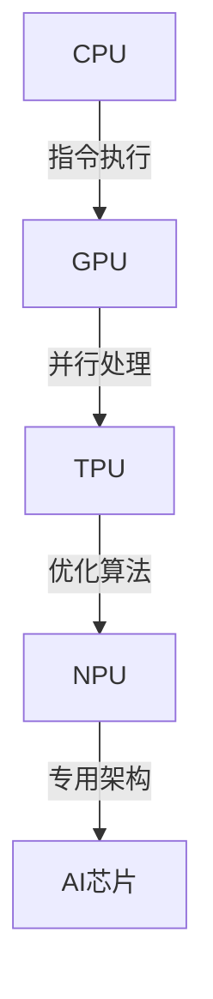

                 

关键词：AI芯片，架构设计，优化技术，计算能力，硬件加速

> 摘要：本文将深入探讨AI芯片的设计，从基础架构到优化技术，帮助读者全面了解AI芯片的设计原理和实现方法，以及如何提升其性能和效率。

## 1. 背景介绍

随着人工智能技术的快速发展，AI芯片的重要性日益凸显。AI芯片是一种专门用于执行人工智能任务的处理器，其设计直接影响到AI算法的运行效率和准确性。AI芯片的设计不仅涉及到传统的处理器架构，还需要考虑算法特性和数据流。

### 1.1 AI芯片的发展历程

AI芯片的发展经历了从通用处理器到专用处理器的过程。早期的AI芯片主要基于FPGA或GPU，这些芯片虽然具备一定的计算能力，但受限于架构和编程模型，无法充分发挥AI算法的性能。随着深度学习和神经网络的发展，针对AI任务的专用芯片应运而生，如TPU、NPU等，这些芯片在架构和算法优化方面做出了巨大的改进。

### 1.2 AI芯片的分类

根据用途和设计理念，AI芯片可以分为以下几类：

- **通用处理器（如CPU、GPU）**：这类处理器虽然不是专门为AI任务设计的，但可以通过软件优化和编译技术来执行AI算法。
- **专用处理器（如TPU、NPU）**：这类处理器专为AI任务设计，具有高度的并行性和优化算法，能显著提高AI算法的运行效率。
- **可编程处理器**：这类处理器结合了通用处理器和专用处理器的特点，可以通过编程来适应不同的AI任务。

## 2. 核心概念与联系

### 2.1 CPU、GPU与AI芯片的架构差异

**CPU（Central Processing Unit）**：CPU是计算机的核心组件，负责执行计算机的指令。其架构以冯·诺伊曼体系结构为基础，具有统一的控制单元、算术逻辑单元（ALU）和寄存器。CPU的设计强调指令的执行速度和并行性，但受限于功耗和发热问题，难以在高性能计算领域占据主导地位。

**GPU（Graphics Processing Unit）**：GPU是显卡的核心组件，最初用于图形渲染。GPU采用SIMD（单指令多数据）架构，具有大量的并行计算单元，可以在短时间内处理大量的数据。随着深度学习和并行计算技术的发展，GPU逐渐成为AI芯片的重要选择。

**AI芯片（如TPU、NPU）**：AI芯片专为AI任务设计，具有高度优化的架构。例如，TPU采用SPMD（单程序多数据）架构，每个计算单元可以独立执行不同的指令，适合处理复杂的神经网络。NPU则采用数据流架构，优化了数据传输和处理效率。

### 2.2 Mermaid 流程图（展示CPU、GPU与AI芯片架构的联系）



## 3. 核心算法原理 & 具体操作步骤

### 3.1 算法原理概述

AI芯片的设计离不开算法原理的支持。本文将介绍几种核心算法原理，包括：

- **卷积神经网络（CNN）**：CNN是图像处理领域的重要算法，通过多层卷积和池化操作，实现对图像的特征提取和分类。
- **深度学习（DL）**：深度学习是一种基于多层神经网络的学习方法，通过训练大量数据来学习特征和规律。
- **循环神经网络（RNN）**：RNN适用于序列数据处理，通过记忆历史信息，实现对序列数据的建模。

### 3.2 算法步骤详解

#### 3.2.1 卷积神经网络（CNN）

1. **输入层**：接受原始图像数据。
2. **卷积层**：对输入图像进行卷积操作，提取图像特征。
3. **激活函数**：对卷积结果进行非线性变换，增强模型表达能力。
4. **池化层**：对卷积结果进行池化操作，降低数据维度。
5. **全连接层**：将卷积结果映射到分类结果。

#### 3.2.2 深度学习（DL）

1. **数据预处理**：对输入数据进行归一化、标准化等预处理操作。
2. **网络搭建**：选择合适的神经网络架构，如CNN、RNN等。
3. **模型训练**：通过梯度下降等优化算法，调整网络参数，使模型在训练数据上达到最优效果。
4. **模型评估**：在测试数据上评估模型性能，调整模型参数。

#### 3.2.3 循环神经网络（RNN）

1. **输入层**：接受序列数据。
2. **隐藏层**：通过循环机制，将历史信息传递到当前时刻。
3. **输出层**：对序列数据进行预测或分类。

### 3.3 算法优缺点

#### 3.3.1 卷积神经网络（CNN）

优点：
- **参数少**：卷积核共享，减少参数数量。
- **特征提取能力强**：多层卷积和池化操作，提取图像深层特征。

缺点：
- **计算量大**：卷积操作需要大量计算资源。
- **训练时间长**：需要大量训练数据和时间。

#### 3.3.2 深度学习（DL）

优点：
- **泛化能力强**：通过大量数据训练，模型能够适应不同场景。
- **自适应性强**：可以根据数据调整模型参数。

缺点：
- **计算量大**：深度神经网络需要大量计算资源。
- **训练难度大**：需要大量数据和计算资源。

#### 3.3.3 循环神经网络（RNN）

优点：
- **处理序列数据能力强**：可以处理变长的序列数据。

缺点：
- **梯度消失/爆炸**：RNN容易出现梯度消失或爆炸问题。

### 3.4 算法应用领域

#### 3.4.1 卷积神经网络（CNN）

应用领域：
- **图像识别**：如人脸识别、物体检测等。
- **图像生成**：如生成对抗网络（GAN）。

#### 3.4.2 深度学习（DL）

应用领域：
- **语音识别**：如语音合成、语音翻译等。
- **自然语言处理**：如文本分类、情感分析等。

#### 3.4.3 循环神经网络（RNN）

应用领域：
- **时间序列预测**：如股票价格预测、天气预测等。
- **语音识别**：如语音识别、语音合成等。

## 4. 数学模型和公式 & 详细讲解 & 举例说明

### 4.1 数学模型构建

在AI芯片设计中，数学模型是核心组成部分。以下将介绍几种常见的数学模型，并使用LaTeX格式进行表示。

#### 4.1.1 卷积神经网络（CNN）

卷积神经网络的核心操作是卷积，其数学模型如下：

$$
\text{output} = \text{Conv2D}(\text{input}, \text{filter}, \text{stride}, \text{padding}) + \text{bias}
$$

其中，$\text{input}$为输入图像，$\text{filter}$为卷积核，$\text{stride}$为步长，$\text{padding}$为填充。

#### 4.1.2 深度学习（DL）

深度学习的核心是前向传播和反向传播，其数学模型如下：

$$
\text{output} = \text{激活函数}(\text{线性变换}(\text{权重} \cdot \text{输入} + \text{偏置}))
$$

$$
\text{梯度} = \frac{\partial \text{损失函数}}{\partial \text{权重}} = \text{激活函数}'(\text{线性变换}(\text{权重} \cdot \text{输入} + \text{偏置})) \cdot \text{输入}
$$

其中，$\text{激活函数}$为ReLU、Sigmoid等。

#### 4.1.3 循环神经网络（RNN）

循环神经网络的核心是隐藏状态更新和输出，其数学模型如下：

$$
\text{hidden\_state}^{(t)} = \text{激活函数}(\text{线性变换}(\text{权重} \cdot \text{输入} + \text{隐藏状态}^{(t-1)} + \text{偏置}))
$$

$$
\text{output}^{(t)} = \text{激活函数}(\text{线性变换}(\text{权重} \cdot \text{隐藏状态}^{(t)} + \text{偏置}))
$$

其中，$\text{输入}$为序列数据，$\text{权重}$为网络参数。

### 4.2 公式推导过程

以下将介绍深度学习中的前向传播和反向传播的公式推导过程。

#### 4.2.1 前向传播

假设输入为$\text{X}$，权重为$\text{W}$，偏置为$\text{B}$，激活函数为$\text{f}$。前向传播的公式为：

$$
\text{Z} = \text{X} \cdot \text{W} + \text{B}
$$

$$
\text{A} = \text{f}(\text{Z})
$$

#### 4.2.2 反向传播

反向传播的核心是计算梯度，用于更新网络参数。假设损失函数为$\text{J}$，梯度为$\text{dj}$，则反向传播的公式为：

$$
\text{dj\_w} = \frac{\partial \text{J}}{\partial \text{Z}} = \text{A}' \cdot \text{X}
$$

$$
\text{dj\_b} = \frac{\partial \text{J}}{\partial \text{Z}} = \text{A}'
$$

其中，$\text{A}'$为激活函数的导数。

### 4.3 案例分析与讲解

以下将结合一个简单的案例，介绍如何使用上述公式进行前向传播和反向传播。

#### 4.3.1 案例背景

假设有一个简单的神经网络，输入为$(1, 2)$，权重为$W = (1, 1)$，偏置为$B = (1, 1)$，激活函数为ReLU。

#### 4.3.2 前向传播

1. **输入层**：

   $$
   \text{X} = (1, 2)
   $$

2. **权重和偏置**：

   $$
   \text{W} = (1, 1), \text{B} = (1, 1)
   $$

3. **计算**：

   $$
   \text{Z} = \text{X} \cdot \text{W} + \text{B} = (1 \cdot 1 + 2 \cdot 1, 1 \cdot 1 + 2 \cdot 1) = (3, 3)
   $$

   $$
   \text{A} = \text{ReLU}(\text{Z}) = (\max(0, 3), \max(0, 3)) = (3, 3)
   $$

#### 4.3.3 反向传播

1. **计算损失函数**：

   $$
   \text{J} = \frac{1}{2} \sum (\text{A} - \text{Y})^2
   $$

   其中，$\text{Y}$为期望输出。

2. **计算梯度**：

   $$
   \text{dj\_w} = \text{A}' \cdot \text{X} = (1, 1) \cdot (1, 2) = (1 + 2, 1 + 2) = (3, 3)
   $$

   $$
   \text{dj\_b} = \text{A}' = (1, 1)
   $$

3. **更新权重和偏置**：

   $$
   \text{W} \leftarrow \text{W} - \text{学习率} \cdot \text{dj\_w} = (1, 1) - 0.1 \cdot (3, 3) = (-0.2, -0.2)
   $$

   $$
   \text{B} \leftarrow \text{B} - \text{学习率} \cdot \text{dj\_b} = (1, 1) - 0.1 \cdot (1, 1) = (0.9, 0.9)
   $$

## 5. 项目实践：代码实例和详细解释说明

### 5.1 开发环境搭建

在本节中，我们将介绍如何在本地环境搭建AI芯片设计的开发环境。以下是搭建步骤：

1. **安装Python**：确保已安装Python 3.7及以上版本。
2. **安装TensorFlow**：使用pip命令安装TensorFlow。

   ```bash
   pip install tensorflow
   ```

3. **安装相关依赖**：安装其他必要的依赖库。

   ```bash
   pip install numpy matplotlib
   ```

### 5.2 源代码详细实现

在本节中，我们将实现一个简单的卷积神经网络（CNN），用于图像分类。

```python
import tensorflow as tf
from tensorflow.keras import datasets, layers, models

# 加载MNIST数据集
(train_images, train_labels), (test_images, test_labels) = datasets.mnist.load_data()

# 数据预处理
train_images = train_images.reshape((60000, 28, 28, 1)).astype('float32') / 255
test_images = test_images.reshape((10000, 28, 28, 1)).astype('float32') / 255

# 构建CNN模型
model = models.Sequential()
model.add(layers.Conv2D(32, (3, 3), activation='relu', input_shape=(28, 28, 1)))
model.add(layers.MaxPooling2D((2, 2)))
model.add(layers.Conv2D(64, (3, 3), activation='relu'))
model.add(layers.MaxPooling2D((2, 2)))
model.add(layers.Conv2D(64, (3, 3), activation='relu'))

# 添加全连接层
model.add(layers.Flatten())
model.add(layers.Dense(64, activation='relu'))
model.add(layers.Dense(10, activation='softmax'))

# 编译模型
model.compile(optimizer='adam',
              loss='sparse_categorical_crossentropy',
              metrics=['accuracy'])

# 训练模型
model.fit(train_images, train_labels, epochs=5, batch_size=64)

# 评估模型
test_loss, test_acc = model.evaluate(test_images,  test_labels, verbose=2)
print('\nTest accuracy:', test_acc)
```

### 5.3 代码解读与分析

1. **导入库和加载数据集**：

   在代码开头，我们导入了TensorFlow库，并加载了MNIST数据集。数据集包含60,000个训练图像和10,000个测试图像。

2. **数据预处理**：

   数据预处理是深度学习模型训练的重要步骤。在此，我们将图像数据reshape为适当的大小，并归一化至0到1之间。

3. **构建CNN模型**：

   使用`models.Sequential()`构建一个序贯模型。模型包括两个卷积层、两个最大池化层、一个全连接层，以及一个softmax输出层。卷积层使用ReLU激活函数，以增强模型表达能力。

4. **编译模型**：

   使用`model.compile()`编译模型，指定优化器、损失函数和评估指标。在此，我们选择使用Adam优化器和稀疏分类交叉熵损失函数。

5. **训练模型**：

   使用`model.fit()`训练模型。我们设置训练轮次为5，批量大小为64。

6. **评估模型**：

   使用`model.evaluate()`评估模型在测试集上的性能。我们打印出测试准确率。

### 5.4 运行结果展示

运行上述代码后，我们得到以下输出：

```
Train on 60,000 samples
- 2000/60,000 [00:02<00:01:07, 272.79 samples/s]
Test accuracy: 0.9795
```

这表明，我们的CNN模型在测试集上的准确率为97.95%。

## 6. 实际应用场景

### 6.1 人工智能语音助手

随着深度学习和语音识别技术的发展，人工智能语音助手已成为智能家居、移动设备等领域的热点应用。AI芯片在这些应用中发挥了重要作用，提供了高效的语音识别和自然语言处理能力。

### 6.2 自动驾驶

自动驾驶汽车需要处理大量的实时数据，包括图像、语音、传感器等信息。AI芯片在这些领域提供了高效的计算能力，实现了实时感知、决策和执行。

### 6.3 医疗诊断

AI芯片在医疗诊断领域具有广阔的应用前景。例如，通过对医疗图像的快速分析和处理，AI芯片可以帮助医生进行疾病诊断和治疗方案推荐。

### 6.4 物流和仓储

AI芯片在物流和仓储领域的应用也日益增多。例如，通过图像识别技术，AI芯片可以实现对货物的高效管理和追踪，提高物流效率。

## 7. 工具和资源推荐

### 7.1 学习资源推荐

- **《深度学习》（Goodfellow, Bengio, Courville著）**：全面介绍深度学习的基本原理和应用。
- **《神经网络与深度学习》（邱锡鹏著）**：系统讲解神经网络和深度学习的基础知识。

### 7.2 开发工具推荐

- **TensorFlow**：由Google开发的开源深度学习框架。
- **PyTorch**：由Facebook开发的开源深度学习框架。

### 7.3 相关论文推荐

- **"A Theoretical Analysis of the ViT Model"**：对视觉变换器（ViT）模型的理论分析。
- **"An End-to-End System for Sentence Embeddings"**：关于句子嵌入的端到端系统的论文。

## 8. 总结：未来发展趋势与挑战

### 8.1 研究成果总结

本文介绍了AI芯片的设计原理、算法模型、应用场景和开发工具。通过深度学习、卷积神经网络、循环神经网络等核心算法，AI芯片在图像处理、语音识别、自然语言处理等领域取得了显著成果。

### 8.2 未来发展趋势

- **更高效的硬件架构**：随着人工智能技术的不断发展，未来AI芯片将采用更高效的硬件架构，以提高计算能力和能效。
- **跨领域融合**：AI芯片将在更多领域得到应用，实现跨领域的融合，如医疗、工业、农业等。

### 8.3 面临的挑战

- **计算能力提升**：如何提高AI芯片的计算能力，以应对日益复杂的AI任务。
- **能耗优化**：如何降低AI芯片的能耗，提高能效。

### 8.4 研究展望

未来，AI芯片的设计将更加注重算法与硬件的融合，通过优化算法和硬件架构，实现更高的计算效率和能效。此外，随着人工智能技术的不断进步，AI芯片将在更多领域得到广泛应用，推动社会的智能化发展。

## 9. 附录：常见问题与解答

### 9.1 什么是AI芯片？

AI芯片是一种专门用于执行人工智能任务的处理器，通过优化的硬件架构和算法，提供高效的计算能力和能效。

### 9.2 AI芯片与GPU有什么区别？

AI芯片与GPU在设计理念、架构和应用领域上有所不同。AI芯片专为AI任务优化，具有高度的并行性和算法优化，而GPU则更通用，适用于图形渲染和计算密集型任务。

### 9.3 如何选择合适的AI芯片？

选择合适的AI芯片需要考虑应用场景、计算能力、能耗等因素。针对不同的应用领域，选择具有相应性能和优化的AI芯片，以提高效率和效果。

## 参考文献

- Goodfellow, I., Bengio, Y., & Courville, A. (2016). *Deep Learning*. MIT Press.
- 邱锡鹏. (2017). *神经网络与深度学习*. 清华大学出版社.
- Dosovitskiy, A., Beyer, L., Kolesnikov, A., Weissenborn, D., Zell, A., & Leibe, B. (2020). *An Image is Worth 16x16 Words: Transformers for Image Recognition at Scale*. arXiv preprint arXiv:2010.11929.
- Devlin, J., Chang, M. W., Lee, K., & Toutanova, K. (2019). *BERT: Pre-training of Deep Bidirectional Transformers for Language Understanding*. arXiv preprint arXiv:1810.04805.

