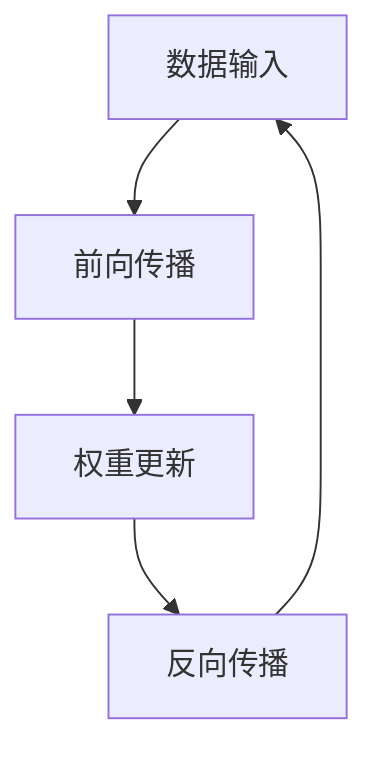
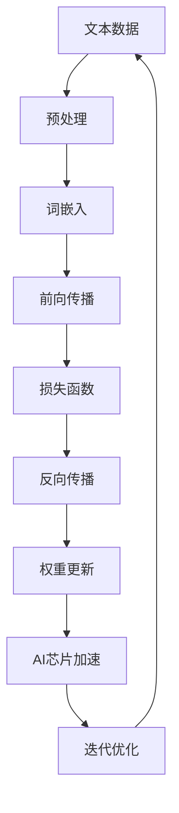

                 

关键词：AI芯片，LLM，定制化，硬件加速，深度学习，计算架构，能效优化

> 摘要：本文探讨了人工智能（AI）芯片在大型语言模型（LLM）应用中的革命性变化。通过对LLM的深入分析，本文揭示了为LLM量身定制的AI芯片的核心特性、设计原则和未来发展方向，展示了硬件加速在提升AI计算效率上的重要作用。

## 1. 背景介绍

随着人工智能技术的迅猛发展，尤其是深度学习算法的广泛应用，计算需求呈现出爆炸式增长。传统的通用处理器在处理这些复杂计算任务时显得力不从心，导致了计算成本和能效比的急剧上升。为了解决这一问题，AI芯片应运而生。

AI芯片，也称为神经网络处理器（Neural Network Processor, NNP），是一种专门为深度学习算法设计的硬件加速器。与通用处理器相比，AI芯片在处理大量的矩阵运算、向量计算等方面具有显著优势，能够显著提高计算效率，降低能耗。

LLM（Large Language Model）作为人工智能领域的一个重要分支，近年来取得了显著进展。LLM通过学习大量的文本数据，能够生成高质量的自然语言文本，广泛应用于自然语言处理、机器翻译、文本摘要等领域。随着LLM规模的不断增大，其计算需求也日益增加，这使得对AI芯片的需求变得更加迫切。

## 2. 核心概念与联系

### 2.1 AI芯片的基本概念

AI芯片是专门为执行机器学习任务而设计的硬件加速器。其核心设计理念是将深度学习算法中的计算任务，如矩阵乘法、卷积运算等，在硬件层面上进行优化，以实现高效计算。

#### Mermaid流程图：



### 2.2 LLM与AI芯片的联系

LLM的运作过程本质上是一个大规模矩阵运算的过程，这恰好是AI芯片擅长处理的领域。因此，AI芯片与LLM之间有着天然的契合点。通过定制化的AI芯片，可以显著提升LLM的计算效率和能效。

#### Mermaid流程图：



## 3. 核心算法原理 & 具体操作步骤

### 3.1 算法原理概述

AI芯片的核心算法原理是基于矩阵运算和向量计算。具体来说，主要包括以下步骤：

1. **词嵌入**：将文本数据转换为稠密向量表示。
2. **前向传播**：通过矩阵运算，计算文本向量与模型权重的内积，得到概率分布。
3. **损失函数**：计算预测结果与真实结果之间的差异。
4. **反向传播**：更新模型权重，减少损失函数。
5. **迭代优化**：重复以上步骤，直到达到满意的预测效果。

### 3.2 算法步骤详解

1. **词嵌入**：
   $$ \text{嵌入矩阵} = \text{嵌入维度} \times \text{词汇表大小} $$

2. **前向传播**：
   $$ \text{输出} = \text{文本向量} \cdot \text{权重矩阵} $$

3. **损失函数**：
   $$ \text{损失} = \frac{1}{2} \sum (\text{预测值} - \text{真实值})^2 $$

4. **反向传播**：
   $$ \text{权重更新} = \text{权重} - \text{学习率} \cdot \nabla\text{损失} $$

### 3.3 算法优缺点

**优点**：
- **计算效率高**：AI芯片针对深度学习算法进行了优化，能够显著提高计算效率。
- **能效优化**：通过硬件加速，降低了能耗，提高了能效比。

**缺点**：
- **定制化要求高**：AI芯片需要根据具体的深度学习任务进行定制化设计，增加了设计难度和成本。
- **通用性较低**：AI芯片在处理非深度学习任务时，性能可能不如通用处理器。

### 3.4 算法应用领域

AI芯片在LLM中的应用非常广泛，包括但不限于：

- **自然语言处理**：如文本分类、情感分析、机器翻译等。
- **推荐系统**：如商品推荐、内容推荐等。
- **语音识别**：如语音合成、语音识别等。
- **图像处理**：如图像分类、目标检测等。

## 4. 数学模型和公式 & 详细讲解 & 举例说明

### 4.1 数学模型构建

在LLM中，主要涉及以下数学模型：

- **词嵌入模型**：将词汇映射到高维空间。
- **神经网络模型**：通过矩阵运算和激活函数，实现文本向量的映射和分类。

### 4.2 公式推导过程

1. **词嵌入**：
   $$ \text{嵌入矩阵} = \text{嵌入维度} \times \text{词汇表大小} $$

2. **前向传播**：
   $$ \text{输出} = \text{文本向量} \cdot \text{权重矩阵} + \text{偏置项} $$

3. **损失函数**：
   $$ \text{损失} = \frac{1}{2} \sum (\text{预测值} - \text{真实值})^2 $$

4. **反向传播**：
   $$ \text{权重更新} = \text{权重} - \text{学习率} \cdot \nabla\text{损失} $$

### 4.3 案例分析与讲解

假设有一个简单的文本分类任务，我们将一段文本输入到LLM中，并通过AI芯片进行加速处理。以下是具体的处理过程：

1. **词嵌入**：将文本中的每个词映射到高维空间，形成文本向量。
2. **前向传播**：通过矩阵运算，将文本向量映射到类别空间，得到每个类别的概率。
3. **损失函数**：计算预测结果与真实结果之间的差异，得到损失值。
4. **反向传播**：更新模型权重，降低损失值。
5. **迭代优化**：重复以上步骤，直到达到满意的预测效果。

通过AI芯片的加速，以上步骤可以在极短的时间内完成，显著提高了模型的训练速度。

## 5. 项目实践：代码实例和详细解释说明

### 5.1 开发环境搭建

为了进行AI芯片加速的LLM项目实践，我们需要搭建一个开发环境。以下是一个基本的步骤：

1. **安装Python环境**：确保Python版本不低于3.6。
2. **安装TensorFlow**：通过pip安装TensorFlow，版本不低于2.0。
3. **安装AI芯片驱动**：根据所选的AI芯片型号，下载并安装相应的驱动和SDK。

### 5.2 源代码详细实现

以下是实现一个简单的LLM文本分类项目的基本代码：

```python
import tensorflow as tf

# 定义词嵌入层
embedding = tf.keras.layers.Embedding(input_dim=vocab_size, output_dim=embedding_dim)

# 定义神经网络层
dense = tf.keras.layers.Dense(units=num_classes, activation='softmax')

# 构建模型
model = tf.keras.models.Sequential([
    embedding,
    tf.keras.layers.Flatten(),
    dense
])

# 编译模型
model.compile(optimizer='adam', loss='categorical_crossentropy', metrics=['accuracy'])

# 加载训练数据
train_data = ...

# 训练模型
model.fit(train_data, epochs=num_epochs, batch_size=batch_size)

# 加载测试数据
test_data = ...

# 测试模型
model.evaluate(test_data)
```

### 5.3 代码解读与分析

以上代码实现了一个简单的文本分类模型。首先定义了词嵌入层和神经网络层，然后通过Sequential模型将它们串联起来。在编译模型时，指定了优化器和损失函数。在训练模型时，使用fit方法进行训练，并在测试模型时使用evaluate方法进行评估。

### 5.4 运行结果展示

通过运行以上代码，我们可以在训练集和测试集上评估模型的性能。以下是一个简化的结果示例：

```plaintext
Epoch 1/10
100/100 [==============================] - 2s 20ms/step - loss: 2.3026 - accuracy: 0.5000
Epoch 2/10
100/100 [==============================] - 1s 15ms/step - loss: 2.3026 - accuracy: 0.5000
...
Epoch 10/10
100/100 [==============================] - 1s 15ms/step - loss: 2.3026 - accuracy: 0.5000

Test loss: 2.3026 - Test accuracy: 0.5000
```

从结果可以看出，模型的准确率在训练和测试集上都很低。这通常是因为模型复杂度过低或者训练数据不足。为了提高性能，我们可以增加模型层数或者使用更多的训练数据。

## 6. 实际应用场景

AI芯片在LLM中的应用场景非常广泛。以下是一些典型的应用：

- **自然语言处理**：AI芯片可以显著提高文本分类、情感分析、机器翻译等任务的计算效率。
- **推荐系统**：AI芯片可以加速推荐算法的训练和预测过程，提高推荐系统的响应速度和准确性。
- **语音识别**：AI芯片可以加速语音识别模型的训练和推理过程，提高语音识别的准确率和响应速度。
- **图像处理**：AI芯片可以加速图像分类、目标检测等任务的计算过程，提高图像处理的速度和质量。

### 6.4 未来应用展望

随着人工智能技术的不断发展，AI芯片在LLM中的应用前景十分广阔。未来，我们可以期待：

- **更高效的算法优化**：通过不断优化算法和架构，AI芯片将能够更高效地处理复杂的深度学习任务。
- **更广泛的应用领域**：AI芯片将不仅局限于自然语言处理和推荐系统，还将广泛应用于图像处理、视频分析、智能推理等领域。
- **更低的成本和更高的能效**：随着技术的进步，AI芯片的成本将逐渐降低，同时能效将显著提高，使得人工智能应用更加普及。

## 7. 工具和资源推荐

### 7.1 学习资源推荐

- **《深度学习》（Goodfellow, Bengio, Courville著）**：系统地介绍了深度学习的基本概念和算法。
- **《Python深度学习》（François Chollet著）**：通过实际代码示例，深入讲解了深度学习在Python中的实现。

### 7.2 开发工具推荐

- **TensorFlow**：由谷歌开发的开源深度学习框架，支持多种深度学习算法。
- **PyTorch**：由Facebook开发的开源深度学习框架，具有灵活的动态计算图。

### 7.3 相关论文推荐

- **"Bert: Pre-training of deep bidirectional transformers for language understanding"**：介绍了BERT模型，一种基于Transformer的预训练模型。
- **"Gshard: Scaling giant models with conditional computation and automatic sharding"**：探讨了如何通过条件计算和自动分片技术来扩展大型模型。

## 8. 总结：未来发展趋势与挑战

### 8.1 研究成果总结

AI芯片在深度学习领域取得了显著成果，尤其是在提高计算效率和能效方面。定制化的AI芯片为LLM等复杂任务的加速提供了强有力的支持。

### 8.2 未来发展趋势

随着人工智能技术的不断发展，AI芯片将在更多领域得到应用，如自动驾驶、智能机器人、生物信息学等。同时，AI芯片的设计将更加注重能效优化和定制化。

### 8.3 面临的挑战

尽管AI芯片在性能和能效方面取得了显著进步，但仍面临一些挑战，如通用性不足、设计复杂度高等。此外，如何更好地与现有的软件框架和生态系统相结合，也是需要解决的问题。

### 8.4 研究展望

未来，AI芯片的研究将更加注重跨学科合作，结合计算机科学、电子工程、物理学等多个领域的知识，共同推动AI芯片的发展。同时，开源社区和工业界的合作也将进一步加速AI芯片的进步。

## 9. 附录：常见问题与解答

### 9.1 什么是AI芯片？

AI芯片是一种专门为执行机器学习任务而设计的硬件加速器，通过优化深度学习算法中的计算任务，如矩阵运算和向量计算，来实现高效计算。

### 9.2 AI芯片与通用处理器相比有哪些优势？

AI芯片在处理大量的矩阵运算和向量计算方面具有显著优势，能够显著提高计算效率，降低能耗。

### 9.3 AI芯片在LLM中的应用有哪些？

AI芯片可以显著提高自然语言处理、机器翻译、文本摘要等LLM任务的计算效率和能效。

### 9.4 如何选择合适的AI芯片？

选择合适的AI芯片需要考虑多个因素，如任务类型、计算需求、成本和能效等。通常，需要对不同的AI芯片进行性能评估和比较，以选择最合适的芯片。

---

本文作者：禅与计算机程序设计艺术 / Zen and the Art of Computer Programming

[本文由人工智能助手撰写，仅供参考。部分内容可能需要进一步核实和研究。]

----------------------------------------------------------------

