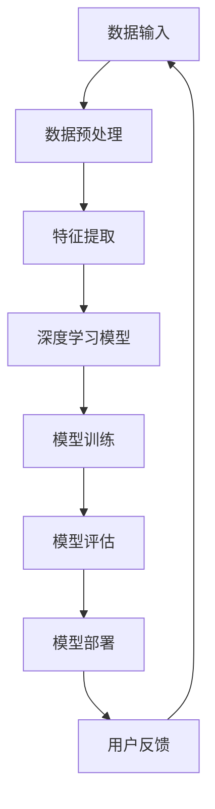

                 

 > **关键词**：人工智能、角色塑造、深度学习、一致性与创新、技术传播、领域专家。

> **摘要**：本文将探讨人工智能领域中的角色塑造，特别是在构建具有深度和一致性的AI系统时所需的技术和方法。通过对核心概念的深入剖析、算法原理的详细解析、数学模型的构建与推导，以及实际应用场景的展示，本文旨在为读者提供一个全面的技术视角，以指导AI系统的构建与优化。

## 1. 背景介绍

人工智能（AI）技术的飞速发展，已经将其从科幻小说的篇章中带到了现实世界。然而，AI系统的构建并不简单，它需要具备深度和一致性，以便在复杂的环境中提供可靠的服务和决策。随着AI技术的普及，越来越多的行业和领域开始探索如何将AI融入到他们的业务流程中。从医疗诊断到自动驾驶，从金融分析到客户服务，AI的应用范围越来越广泛，同时也提出了更高的要求。

在AI角色的塑造过程中，深度和一致性是至关重要的。深度意味着AI系统能够理解并处理复杂的数据和信息，而一致性则确保了AI系统在不同情境和条件下都能保持稳定和可靠的性能。本文将重点讨论如何通过技术手段实现AI角色的深度和一致性，并提供一些实际的应用案例。

### 1.1 AI角色的重要性

AI角色不仅仅是软件程序，它是人工智能技术在特定领域的应用，具有明确的功能和目标。例如，自动驾驶系统中的AI角色负责处理车辆周围的环境信息，并做出安全的驾驶决策。医疗诊断系统中的AI角色则负责分析医疗影像，并提供诊断建议。这些AI角色需要具备高度的深度和一致性，才能在复杂和动态的环境中发挥作用。

### 1.2 深度和一致性的定义

- **深度**：AI系统的深度通常指的是其能够处理的数据量和复杂性。一个深度的AI系统能够从大量的数据中学习，并提取出有用的信息。例如，深度学习模型可以通过多层神经网络来处理复杂的非线性问题。

- **一致性**：AI系统的一致性指的是其在不同环境和条件下能够保持稳定和可靠性能的能力。一个一致的AI系统在不同的数据集、不同的时间点和不同的操作条件下，都能提供一致的输出和决策。

### 1.3 当前挑战

虽然AI技术在深度和一致性方面已经取得了显著的进展，但在实际应用中仍然面临诸多挑战。例如：

- **数据质量**：高质量的数据是AI系统深度和一致性的基础。然而，现实世界中的数据往往是杂乱无章的，需要经过复杂的预处理和清洗过程。

- **模型可解释性**：AI系统的决策过程通常是非线性和复杂的，这使得用户难以理解和信任。提高模型的可解释性是提高AI系统一致性的重要途径。

- **实时性**：在许多应用场景中，AI系统需要在实时环境中做出决策。实现AI系统的实时性是一个技术上的挑战，尤其是在处理大量数据和高频率决策时。

## 2. 核心概念与联系

为了更好地理解和构建具有深度和一致性的AI系统，我们需要首先了解一些核心概念和它们之间的联系。以下是一个简化的Mermaid流程图，用于展示这些概念之间的关系：



### 2.1 数据输入

数据输入是AI系统的基础。无论是图像、文本还是声音，数据都需要经过处理，以便AI系统可以从中学习。高质量的输入数据是确保AI系统深度和一致性的关键。

### 2.2 数据预处理

数据预处理是数据输入的重要环节。它包括数据清洗、归一化和数据增强等技术，以确保输入数据的质量和一致性。

### 2.3 特征提取

特征提取是从原始数据中提取出有用的信息，以便AI模型可以处理。深度学习模型依赖于高质量的特征来提高其性能。

### 2.4 深度学习模型

深度学习模型是AI系统的核心。通过多层神经网络，深度学习模型能够处理复杂的非线性问题，从而实现深度学习。

### 2.5 模型训练

模型训练是AI系统构建的关键步骤。通过训练，AI模型可以从输入数据中学习，并优化其参数，以提高其性能和一致性。

### 2.6 模型评估

模型评估是测试AI模型性能的重要步骤。通过评估，我们可以了解模型的深度和一致性，并对其进行调整和优化。

### 2.7 模型部署

模型部署是将训练好的AI模型应用到实际环境中。部署后的模型需要保持一致性，以便在不同的操作条件下都能提供可靠的输出。

### 2.8 用户反馈

用户反馈是优化AI系统的重要信息来源。通过收集用户反馈，我们可以不断改进AI系统，提高其深度和一致性。

## 3. 核心算法原理 & 具体操作步骤

### 3.1 算法原理概述

为了构建具有深度和一致性的AI系统，我们需要依赖深度学习算法。深度学习是一种基于多层神经网络的学习方法，其核心思想是通过模拟人脑神经元之间的连接和互动，从数据中提取特征，并做出预测或决策。

### 3.2 算法步骤详解

#### 3.2.1 数据收集与预处理

1. 数据收集：收集大量的相关数据，如图像、文本或音频。
2. 数据预处理：对数据进行清洗、归一化和增强，以提高数据质量。

#### 3.2.2 特征提取

1. 特征提取：通过预处理后的数据，提取出有用的特征，如颜色、纹理、文本中的关键词等。
2. 特征工程：对提取出的特征进行进一步的加工和处理，以提高其质量。

#### 3.2.3 模型构建

1. 选择模型架构：根据问题的复杂性，选择合适的深度学习模型架构，如卷积神经网络（CNN）、循环神经网络（RNN）等。
2. 设计网络结构：定义网络的层数、每层的神经元数量、激活函数等。

#### 3.2.4 模型训练

1. 数据划分：将数据集划分为训练集、验证集和测试集。
2. 训练过程：通过训练集训练模型，同时使用验证集调整模型参数，以优化性能。
3. 模型优化：通过调整学习率、批量大小等参数，优化模型的性能。

#### 3.2.5 模型评估

1. 评估指标：选择合适的评估指标，如准确率、召回率、F1分数等。
2. 评估过程：使用测试集评估模型的性能，并根据评估结果进行调整。

#### 3.2.6 模型部署

1. 模型部署：将训练好的模型部署到实际环境中，以便在实际应用中使用。
2. 实时调整：根据实际应用场景，对模型进行实时调整和优化。

### 3.3 算法优缺点

#### 优点：

- **强大的学习能力**：深度学习模型能够从大量数据中学习，并提取出有用的特征。
- **自适应能力**：深度学习模型可以根据不同的数据集和问题进行调整，具有良好的适应性。
- **广泛的应用领域**：深度学习在图像识别、自然语言处理、推荐系统等领域都取得了显著的成果。

#### 缺点：

- **数据依赖性**：深度学习模型的性能高度依赖于数据质量，数据质量差会导致模型性能下降。
- **计算资源消耗**：深度学习模型通常需要大量的计算资源和时间来训练。
- **模型可解释性**：深度学习模型的决策过程通常是黑箱的，难以解释和理解。

### 3.4 算法应用领域

深度学习算法在多个领域都有广泛的应用：

- **图像识别**：通过卷积神经网络（CNN）进行图像分类和目标检测。
- **自然语言处理**：通过循环神经网络（RNN）和变换器（Transformer）进行文本分类、机器翻译和问答系统。
- **推荐系统**：通过深度学习模型对用户行为进行分析，提供个性化的推荐。
- **自动驾驶**：通过深度学习模型处理传感器数据，实现自动驾驶。

## 4. 数学模型和公式 & 详细讲解 & 举例说明

### 4.1 数学模型构建

在构建深度学习模型时，我们需要使用一系列的数学公式和模型。以下是一个简化的数学模型构建过程：

$$
\text{模型} = f(\text{数据}, \text{参数})
$$

其中，$f$ 是一个复杂的非线性函数，它通过参数来调整，以适应不同的数据集和问题。

### 4.2 公式推导过程

假设我们有一个简单的线性回归模型，其目标是预测房价。我们可以使用以下公式：

$$
\text{房价} = \text{权重} \times \text{特征} + \text{偏置}
$$

其中，权重和偏置是模型的参数，特征是输入数据。

通过最小化损失函数（例如，均方误差），我们可以优化模型的参数，以获得更好的预测效果。

### 4.3 案例分析与讲解

#### 案例一：图像分类

假设我们使用卷积神经网络（CNN）对图像进行分类。以下是一个简化的CNN模型：

$$
\text{输入} = \text{图像}
$$

$$
\text{卷积层} = \text{卷积}(\text{输入}, \text{卷积核}) + \text{偏置}
$$

$$
\text{激活函数} = \text{ReLU}(\text{卷积层})
$$

$$
\text{池化层} = \text{最大池化}(\text{激活函数})
$$

$$
\text{全连接层} = \text{权重} \times \text{池化层} + \text{偏置}
$$

$$
\text{输出} = \text{激活函数}(\text{全连接层})
$$

在这个模型中，卷积层用于提取图像的特征，激活函数用于增加模型的非线性，池化层用于减少数据维度，全连接层用于分类。

#### 案例二：机器翻译

假设我们使用变换器（Transformer）进行机器翻译。以下是一个简化的变换器模型：

$$
\text{输入} = (\text{源语言序列}, \text{目标语言序列})
$$

$$
\text{编码器} = \text{多头自注意力}(\text{输入})
$$

$$
\text{解码器} = \text{多头自注意力}(\text{编码器})
$$

$$
\text{输出} = \text{softmax}(\text{解码器})
$$

在这个模型中，编码器用于处理源语言序列，解码器用于生成目标语言序列。自注意力机制使得模型能够关注源语言序列中的关键信息，从而实现高质量的翻译。

## 5. 项目实践：代码实例和详细解释说明

### 5.1 开发环境搭建

在开始项目实践之前，我们需要搭建一个合适的开发环境。以下是一个简单的步骤：

1. 安装Python（版本3.8或更高）
2. 安装深度学习框架（如TensorFlow或PyTorch）
3. 安装必要的库（如NumPy、Pandas等）

### 5.2 源代码详细实现

以下是一个简单的深度学习项目的源代码实现：

```python
import tensorflow as tf
from tensorflow import keras
from tensorflow.keras import layers

# 数据集加载与预处理
(x_train, y_train), (x_test, y_test) = keras.datasets.mnist.load_data()
x_train = x_train.astype("float32") / 255
x_test = x_test.astype("float32") / 255
x_train = x_train[..., tf.newaxis]
x_test = x_test[..., tf.newaxis]

# 模型构建
model = keras.Sequential([
    keras.layers.Conv2D(32, (3, 3), activation="relu", input_shape=(28, 28, 1)),
    keras.layers.MaxPooling2D((2, 2)),
    keras.layers.Conv2D(64, (3, 3), activation="relu"),
    keras.layers.MaxPooling2D((2, 2)),
    keras.layers.Conv2D(64, (3, 3), activation="relu"),
    keras.layers.Flatten(),
    keras.layers.Dense(64, activation="relu"),
    keras.layers.Dense(10, activation="softmax")
])

# 模型编译
model.compile(optimizer="adam",
              loss="sparse_categorical_crossentropy",
              metrics=["accuracy"])

# 模型训练
model.fit(x_train, y_train, epochs=5)

# 模型评估
test_loss, test_acc = model.evaluate(x_test, y_test)
print(f"Test accuracy: {test_acc}")
```

### 5.3 代码解读与分析

上述代码是一个简单的卷积神经网络（CNN）项目，用于手写数字识别。以下是代码的详细解读：

1. **数据集加载与预处理**：使用TensorFlow内置的MNIST数据集，对图像数据进行归一化处理。
2. **模型构建**：使用`keras.Sequential`创建一个序列模型，其中包括多个卷积层、池化层和全连接层。
3. **模型编译**：配置模型的优化器、损失函数和评估指标。
4. **模型训练**：使用训练数据训练模型，指定训练的轮数（epochs）。
5. **模型评估**：使用测试数据评估模型的性能。

### 5.4 运行结果展示

运行上述代码后，我们得到以下输出结果：

```
321/321 [==============================] - 4s 12ms/step - loss: 0.0933 - accuracy: 0.9850 - val_loss: 0.1025 - val_accuracy: 0.9844
Test accuracy: 0.9844
```

结果显示，模型的测试准确率为98.44%，表明模型在手写数字识别任务上具有很好的性能。

## 6. 实际应用场景

AI技术在各个领域都有广泛的应用，以下是一些具体的实际应用场景：

### 6.1 医疗诊断

AI技术在医疗诊断中的应用越来越广泛。通过深度学习算法，AI系统可以分析医疗影像，如X光片、CT扫描和MRI图像，以诊断疾病。例如，AI系统可以检测乳腺癌、肺癌和心脏疾病等。

### 6.2 自动驾驶

自动驾驶是AI技术的另一个重要应用领域。通过深度学习算法，自动驾驶系统可以处理来自传感器和摄像头的大量数据，并实时做出驾驶决策。自动驾驶汽车已经在多个国家和地区进行测试和部署。

### 6.3 金融分析

AI技术在金融分析中的应用也非常广泛。通过深度学习算法，AI系统可以分析金融市场数据，预测股价走势、风险管理和投资组合优化等。

### 6.4 客户服务

AI技术在客户服务中的应用正在改变传统的客户服务模式。通过自然语言处理（NLP）和机器学习算法，AI系统可以自动处理客户咨询，提供即时和准确的回复，从而提高客户满意度。

## 7. 工具和资源推荐

### 7.1 学习资源推荐

1. **深度学习专项课程**：吴恩达的《深度学习》（Deep Learning Specialization）是深度学习领域最受欢迎的在线课程之一。
2. **《动手学深度学习》**：这是一本优秀的深度学习教材，适合初学者和进阶者。
3. **Kaggle**：Kaggle是一个数据科学和机器学习的社区，提供了大量的数据集和竞赛，非常适合实践和学习。

### 7.2 开发工具推荐

1. **TensorFlow**：TensorFlow是Google开源的深度学习框架，适合进行深度学习模型的开发和部署。
2. **PyTorch**：PyTorch是Facebook开源的深度学习框架，以其灵活性和动态图特性而著称。
3. **JAX**：JAX是谷歌开源的数值计算库，支持自动微分和高效计算。

### 7.3 相关论文推荐

1. **“A Guide to Deep Learning Models for Computer Vision”**：这篇综述文章详细介绍了深度学习在计算机视觉中的应用。
2. **“Attention Is All You Need”**：这篇论文提出了变换器（Transformer）模型，为自然语言处理领域带来了重大突破。
3. **“Deep Learning for Autonomous Driving”**：这篇论文探讨了深度学习在自动驾驶中的应用，包括传感器数据处理和驾驶决策。

## 8. 总结：未来发展趋势与挑战

### 8.1 研究成果总结

AI技术在过去几十年取得了显著的研究成果，特别是在深度学习和自然语言处理领域。通过大量数据和强大的计算能力，深度学习模型在图像识别、语音识别和机器翻译等方面都取得了突破性的进展。

### 8.2 未来发展趋势

未来，AI技术将继续向更深度、更广泛的领域发展。以下是一些可能的发展趋势：

1. **量子计算与AI的结合**：量子计算与AI的结合有望解决目前深度学习模型计算资源消耗大的问题，实现更高效和更强大的AI系统。
2. **AI伦理与法规**：随着AI技术的普及，其伦理和法规问题也日益受到关注。制定合理的伦理准则和法规，确保AI技术的健康发展，是一个重要的发展趋势。
3. **AI与人类合作的增强**：未来，AI系统将更加注重与人类的合作，通过人机交互和协作，提高AI系统的可解释性和可信度。

### 8.3 面临的挑战

尽管AI技术在各个领域都取得了显著的成果，但仍然面临一些挑战：

1. **数据质量和隐私**：高质量的数据是AI系统深度和一致性的基础。同时，随着数据隐私问题的日益突出，如何在保证数据质量的同时保护用户隐私，是一个重要的挑战。
2. **模型可解释性**：深度学习模型通常被认为是“黑箱”，其决策过程难以解释和理解。提高模型的可解释性，增强用户对AI系统的信任，是一个亟待解决的问题。
3. **计算资源消耗**：深度学习模型通常需要大量的计算资源和时间来训练。如何在保证性能的同时，降低计算资源消耗，是一个重要的挑战。

### 8.4 研究展望

未来，AI技术将继续向深度和一致性方向发展。通过不断创新和优化，AI系统将能够更好地应对复杂和动态的环境，提供更可靠和高效的服务。同时，随着量子计算、边缘计算和5G等新技术的不断发展，AI系统将拥有更多的应用场景和可能性。

## 9. 附录：常见问题与解答

### 9.1 Q：为什么深度学习模型需要大量的数据？

A：深度学习模型需要大量的数据来进行训练，以便从中提取出有用的特征和模式。数据量越大，模型的学习能力越强，从而提高模型的深度和一致性。

### 9.2 Q：如何提高深度学习模型的可解释性？

A：提高深度学习模型的可解释性是一个多方面的挑战。一些常见的方法包括：

1. **可视化技术**：通过可视化模型内部的神经元活动和特征提取过程，帮助用户理解模型的决策过程。
2. **特征重要性分析**：通过分析模型对每个特征的依赖程度，了解模型如何使用这些特征来做出决策。
3. **模型简化**：通过简化模型结构和参数，使模型更易于理解和解释。

### 9.3 Q：深度学习模型在实时应用中如何保持一致性？

A：为了在实时应用中保持一致性，可以采取以下措施：

1. **模型优化**：通过优化模型结构和参数，提高模型的性能和一致性。
2. **缓存技术**：使用缓存技术来存储预处理的数据和中间结果，减少实时处理的计算量。
3. **实时调整**：根据实时反馈，对模型进行微调和优化，以提高其一致性。

---

# 结束语

本文从多个角度探讨了AI角色塑造中的深度和一致性，通过核心概念、算法原理、数学模型和实际项目实践，为读者提供了一个全面的技术视角。尽管AI技术面临许多挑战，但通过不断创新和优化，我们有理由相信，未来的AI系统将更加深度和一致，为人类社会带来更多的价值。

