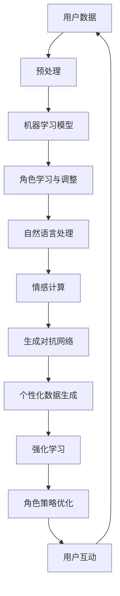

                 

### 背景介绍

人工智能（AI）作为当前技术发展的前沿领域，已经在各个行业中展现出了巨大的潜力。从最早的规则基系统，到深度学习，再到如今的生成对抗网络（GAN）和强化学习，AI技术在不断迭代更新。随着AI技术的普及和应用，AI角色的发展也成为一个备受关注的话题。

在许多AI应用场景中，角色扮演是一个核心部分。无论是智能客服、虚拟助手，还是游戏NPC，AI角色的表现直接影响用户体验。然而，随着AI技术的进步，这些角色不再仅仅是预设的脚本执行者，而是能够根据与用户的互动进行学习和发展。这种角色演化成为了一个新的研究热点。

本文将探讨AI角色在长期互动中的人物发展过程，分析其背后的技术原理和实现方法，并提出未来的发展方向和挑战。本文结构如下：

- **1. 背景介绍**：介绍AI技术的发展历程和AI角色的重要性。
- **2. 核心概念与联系**：阐述AI角色演化中的核心概念，并使用Mermaid流程图展示架构。
- **3. 核心算法原理 & 具体操作步骤**：详细介绍AI角色演化算法的原理和步骤。
- **4. 数学模型和公式 & 详细讲解 & 举例说明**：讲解数学模型在AI角色演化中的应用。
- **5. 项目实践：代码实例和详细解释说明**：通过实际代码实例展示AI角色演化的实现。
- **6. 实际应用场景**：分析AI角色在不同领域的应用。
- **7. 工具和资源推荐**：推荐学习资源和开发工具。
- **8. 总结：未来发展趋势与挑战**：总结研究成果，展望未来发展方向和挑战。
- **9. 附录：常见问题与解答**：回答读者可能关心的问题。

### 文章关键词

- 人工智能
- AI角色
- 角色演化
- 长期互动
- 机器学习
- 生成对抗网络
- 强化学习
- 情感计算

### 文章摘要

本文深入探讨了AI角色在长期互动中的人物发展过程。通过介绍AI技术的发展历程，本文提出了AI角色演化这一核心概念，并详细分析了其背后的技术原理和实现方法。文章还通过数学模型、实际代码实例和实际应用场景，展示了AI角色演化的广泛应用和潜力。最后，本文总结了未来发展趋势和挑战，为读者提供了全面的技术视野和思考。

## 1. 背景介绍

### 1.1 人工智能的发展历程

人工智能（AI）起源于20世纪50年代，当时科学家们提出了“图灵测试”这一概念，用以衡量机器是否具有智能。从那时起，AI技术经历了多个发展阶段。

**1.1.1 早期发展**

早期的人工智能主要依赖于规则基系统。这种系统通过预设规则来模拟人类思维过程，例如专家系统和推理机。然而，这种方法的局限性在于，它需要大量手工编写的规则，并且无法处理复杂和不确定的环境。

**1.1.2 人工智能的复兴**

20世纪80年代，随着计算机性能的提升和大数据的出现，机器学习技术逐渐成为人工智能的核心。尤其是1986年，霍普菲尔德和皮茨提出了反向传播算法（BP算法），为深度学习的发展奠定了基础。

**1.1.3 深度学习的崛起**

深度学习在2012年获得了重大突破，AlexNet在ImageNet图像识别大赛中取得了优异的成绩。深度学习通过多层神经网络模型，能够自动学习输入数据的特征表示，从而在图像识别、自然语言处理等领域取得了显著的成果。

**1.1.4 生成对抗网络与强化学习**

生成对抗网络（GAN）在2014年提出，它通过两个对抗网络（生成器和判别器）的竞争，实现了高质量的数据生成。而强化学习则通过试错和反馈，使AI角色能够在复杂环境中进行决策和学习。

### 1.2 AI角色的重要性

AI角色在现代AI应用中扮演着重要的角色。无论是在智能客服、虚拟助手，还是在游戏、娱乐等领域，AI角色都能够为用户提供个性化、智能化的服务。

**1.2.1 智能客服**

智能客服是AI角色最典型的应用之一。通过自然语言处理和机器学习技术，智能客服能够理解用户的意图，并提供相应的解决方案。这不仅提高了客服效率，还降低了人力成本。

**1.2.2 虚拟助手**

虚拟助手是另一个重要的AI角色应用场景。虚拟助手如Siri、Alexa等，通过语音交互和机器学习技术，能够帮助用户完成日常任务，如发送短信、设置提醒等。

**1.2.3 游戏、娱乐**

在游戏和娱乐领域，AI角色能够为用户提供丰富的互动体验。例如，在角色扮演游戏中，NPC（非玩家角色）能够根据玩家的行为进行自适应调整，使游戏更加有趣和具有挑战性。

### 1.3 AI角色演化的需求

随着AI技术的不断发展，AI角色不再仅仅是预设的脚本执行者，它们需要具备自我学习和发展能力。这种需求源于以下几个原因：

**1.3.1 用户个性化需求**

不同的用户具有不同的需求和偏好，AI角色需要能够根据用户的个性化数据，提供定制化的服务。

**1.3.2 复杂动态环境**

现实世界是一个复杂且动态变化的系统，AI角色需要能够适应这种变化，并在不同的情境中做出合理的决策。

**1.3.3 互动性增强**

与用户的互动是AI角色发展的关键。通过长期互动，AI角色能够不断学习和改进，从而提高用户体验。

**1.3.4 持续进步**

AI技术的不断进步要求AI角色能够跟上时代的步伐，不断更新和优化自身。

总之，AI角色演化是未来人工智能发展的重要趋势，它不仅能够提高AI角色的表现，还能推动整个AI领域的发展。

## 2. 核心概念与联系

### 2.1 AI角色演化中的核心概念

AI角色演化涉及到多个核心概念，这些概念相互联系，构成了AI角色发展的理论基础。

**2.1.1 机器学习**

机器学习是AI角色演化的基础，它使AI角色能够从数据中学习并改进自身。常见的机器学习方法包括监督学习、无监督学习和强化学习。

**2.1.2 自然语言处理**

自然语言处理（NLP）是AI角色与用户互动的关键，它使AI角色能够理解用户的需求和意图。NLP技术包括词性标注、句法分析、语义理解等。

**2.1.3 情感计算**

情感计算是AI角色理解用户情感和情绪的重要手段。通过情感计算，AI角色能够更好地与用户进行情感互动，提供个性化的服务。

**2.1.4 生成对抗网络（GAN）**

生成对抗网络是一种数据生成方法，它通过两个对抗网络（生成器和判别器）的竞争，生成高质量的数据。GAN在AI角色演化中用于生成个性化的用户数据，从而提高角色表现。

**2.1.5 强化学习**

强化学习是AI角色在复杂环境中进行决策和行动的方法。通过试错和反馈，强化学习使AI角色能够不断优化自身的策略。

### 2.2 AI角色演化架构的 Mermaid 流程图

以下是一个简化的AI角色演化架构的Mermaid流程图，展示了核心概念之间的联系。



### 2.3 各核心概念之间的联系

**2.3.1 机器学习与自然语言处理**

机器学习为自然语言处理提供了强大的工具，使AI角色能够从大量文本数据中提取有用的特征。自然语言处理技术使AI角色能够理解用户的语言和意图，从而为机器学习提供输入。

**2.3.2 情感计算与自然语言处理**

情感计算依赖于自然语言处理技术，通过对用户语言的情感分析，情感计算能够识别用户的情绪状态。这种信息可以用于优化AI角色的互动方式，提高用户体验。

**2.3.3 生成对抗网络与机器学习**

生成对抗网络是一种特殊的机器学习方法，它通过生成器和判别器的对抗，生成高质量的数据。这种技术可以用于生成个性化的用户数据，从而提高AI角色的表现。

**2.3.4 强化学习与角色策略优化**

强化学习使AI角色能够在复杂环境中进行决策和行动，并通过反馈不断优化自身的策略。这种策略优化可以用于提高AI角色的适应性和灵活性。

通过上述核心概念和联系，我们可以看到AI角色演化是一个复杂但有机的整体，各个部分相互协作，共同推动AI角色的发展。

## 3. 核心算法原理 & 具体操作步骤

### 3.1 算法原理概述

AI角色演化的核心算法包括机器学习、自然语言处理、情感计算和生成对抗网络（GAN）。这些算法协同工作，使AI角色能够从用户互动中学习并不断优化自身。

**3.1.1 机器学习**

机器学习算法是AI角色演化的重要基础。常见的机器学习方法包括监督学习、无监督学习和强化学习。监督学习通过已标记的数据训练模型，无监督学习通过未标记的数据发现数据分布，强化学习通过试错和反馈优化决策。

**3.1.2 自然语言处理**

自然语言处理（NLP）技术使AI角色能够理解和生成自然语言。常见的NLP技术包括词性标注、句法分析、语义理解和文本生成。NLP技术为机器学习提供输入，使AI角色能够更好地理解用户的语言和意图。

**3.1.3 情感计算**

情感计算是AI角色理解用户情感和情绪的关键技术。通过情感分析，AI角色能够识别用户的情感状态，从而提供个性化的服务。情感计算技术包括情感识别、情感分析和情感合成。

**3.1.4 生成对抗网络（GAN）**

生成对抗网络（GAN）是一种特殊类型的机器学习模型，它由生成器和判别器两部分组成。生成器尝试生成与真实数据相似的数据，判别器则判断生成数据的真实性和质量。通过这种对抗训练，GAN能够生成高质量的数据，用于个性化数据生成和角色优化。

### 3.2 算法步骤详解

**3.2.1 数据收集与预处理**

首先，从用户互动中收集数据，包括文本、语音、图像等多媒体数据。然后，对数据进行预处理，包括数据清洗、数据转换和数据归一化。预处理确保数据的质量和一致性，为后续算法提供可靠的输入。

**3.2.2 机器学习模型训练**

使用预处理后的数据训练机器学习模型。根据任务需求，选择合适的机器学习算法，如监督学习、无监督学习或强化学习。训练过程中，模型通过不断迭代优化，学习数据的特征和规律。

**3.2.3 自然语言处理**

利用训练好的机器学习模型，对用户语言进行处理和分析。具体步骤包括词性标注、句法分析和语义理解。这些步骤使AI角色能够理解用户的意图和需求。

**3.2.4 情感计算**

通过情感分析技术，识别用户的情感状态。情感计算包括情感识别、情感分析和情感合成。情感识别用于判断用户的情感类别，情感分析用于理解情感的强度和变化，情感合成用于生成符合用户情感的回复。

**3.2.5 生成对抗网络（GAN）**

利用GAN技术生成个性化数据。生成器尝试生成与真实数据相似的用户数据，判别器则判断生成数据的真实性和质量。通过这种对抗训练，生成器不断优化生成数据的质量。

**3.2.6 角色策略优化**

根据用户互动和情感分析结果，优化AI角色的策略和行为。强化学习技术用于优化角色策略，使其在复杂环境中做出更好的决策。

**3.2.7 用户互动**

AI角色与用户进行互动，包括文本、语音和图像等多媒体交互。互动过程中，AI角色不断学习和调整，以提供更好的用户体验。

### 3.3 算法优缺点

**3.3.1 优点**

- **自适应性强**：AI角色能够根据用户的个性化需求进行自适应调整，提高用户体验。
- **个性化服务**：通过机器学习和情感计算，AI角色能够提供个性化的服务和互动。
- **数据驱动**：AI角色演化基于大量用户数据，使角色更加贴近用户需求。
- **灵活性高**：AI角色能够在不同环境和情境中灵活调整自身行为。

**3.3.2 缺点**

- **数据依赖性强**：AI角色演化依赖于大量用户数据，数据质量和多样性对角色表现有重要影响。
- **计算资源消耗大**：机器学习和GAN等技术需要大量的计算资源，可能导致资源消耗大。
- **模型复杂性高**：AI角色演化涉及多个复杂算法，模型设计和优化难度大。

### 3.4 算法应用领域

**3.4.1 智能客服**

智能客服是AI角色演化的重要应用领域。通过机器学习和情感计算，智能客服能够理解用户的意图和需求，提供个性化的服务和解决方案。

**3.4.2 虚拟助手**

虚拟助手如Siri、Alexa等，利用AI角色演化技术，能够提供更加智能和个性化的服务。虚拟助手能够理解用户的语言和情感，从而提供更好的交互体验。

**3.4.3 游戏、娱乐**

在游戏和娱乐领域，AI角色演化技术用于生成更加智能和有趣的NPC（非玩家角色）。NPC能够根据玩家的行为进行自适应调整，提高游戏的互动性和趣味性。

**3.4.4 教育、医疗**

在教育、医疗等领域，AI角色演化技术也具有广泛的应用。通过个性化服务和互动，AI角色能够为用户提供更好的教育和医疗服务。

总之，AI角色演化技术在多个领域具有广泛的应用前景，它不仅能够提高AI角色的表现，还能推动整个AI领域的发展。

## 4. 数学模型和公式 & 详细讲解 & 举例说明

### 4.1 数学模型构建

在AI角色演化过程中，数学模型起到了核心作用。以下将介绍几种关键的数学模型，并详细讲解其构建方法和应用场景。

**4.1.1 机器学习模型**

机器学习模型是AI角色演化的基础，包括线性回归、决策树、支持向量机（SVM）和神经网络等。以下以神经网络为例，介绍其数学模型构建方法。

1. **神经网络结构**

神经网络由多个层组成，包括输入层、隐藏层和输出层。每层由多个神经元组成，神经元之间通过权重相连。

2. **激活函数**

激活函数用于引入非线性，常见的激活函数包括Sigmoid函数、ReLU函数和Tanh函数。

3. **损失函数**

损失函数用于评估模型的预测结果与实际结果之间的差距。常见的损失函数包括均方误差（MSE）和交叉熵损失。

4. **反向传播算法**

反向传播算法用于训练神经网络，通过不断调整权重和偏置，使模型能够更好地拟合数据。

**4.1.2 生成对抗网络（GAN）**

生成对抗网络（GAN）由生成器和判别器两部分组成，通过对抗训练生成高质量的数据。以下为GAN的数学模型构建方法。

1. **生成器**

生成器的目标是生成与真实数据相似的数据。其数学模型为：

   $$ G(x) = z + \sigma(W_g \cdot [z]) $$

   其中，$x$为输入噪声，$z$为高斯噪声，$W_g$为生成器的权重，$\sigma$为激活函数。

2. **判别器**

判别器的目标是判断输入数据是真实数据还是生成数据。其数学模型为：

   $$ D(x) = \sigma(W_d \cdot [x]) $$

   其中，$x$为输入数据，$W_d$为判别器的权重，$\sigma$为激活函数。

3. **对抗训练**

生成器和判别器通过对抗训练优化自身。其目标是最小化以下损失函数：

   $$ L(D, G) = \mathbb{E}_{x \sim p_{data}(x)} [\log D(x)] + \mathbb{E}_{z \sim p_{z}(z)} [\log (1 - D(G(z)))] $$

   其中，$p_{data}(x)$为真实数据分布，$p_{z}(z)$为输入噪声分布。

**4.1.3 强化学习模型**

强化学习模型用于优化AI角色的策略和行为。以下以Q-learning算法为例，介绍其数学模型构建方法。

1. **Q值函数**

Q值函数表示在特定状态下，采取特定动作的预期回报。其数学模型为：

   $$ Q(s, a) = r(s, a) + \gamma \max_{a'} Q(s', a') $$

   其中，$s$为状态，$a$为动作，$r$为即时回报，$\gamma$为折扣因子。

2. **Q值更新**

通过迭代更新Q值函数，使其能够更好地预测未来的回报。其数学模型为：

   $$ Q(s, a) \leftarrow Q(s, a) + \alpha [r(s, a) + \gamma \max_{a'} Q(s', a') - Q(s, a)] $$

   其中，$\alpha$为学习率。

### 4.2 公式推导过程

**4.2.1 神经网络损失函数推导**

假设神经网络为三层结构，输入层、隐藏层和输出层，其中隐藏层有多个神经元。设输入为$x$，输出为$y$，目标输出为$t$，则损失函数为：

$$ L = \frac{1}{2} \sum_{i} (y_i - t_i)^2 $$

其中，$y_i$为输出层的第$i$个神经元输出，$t_i$为第$i$个神经元的实际目标输出。

为了最小化损失函数，需要对权重和偏置进行梯度下降优化。设权重为$W$，偏置为$b$，则损失函数关于$W$和$b$的梯度为：

$$ \frac{\partial L}{\partial W} = (y - t) \cdot \frac{\partial y}{\partial W} $$

$$ \frac{\partial L}{\partial b} = (y - t) \cdot \frac{\partial y}{\partial b} $$

其中，$\frac{\partial y}{\partial W}$和$\frac{\partial y}{\partial b}$分别为输出层关于权重和偏置的梯度。

通过反向传播算法，将梯度反向传播到隐藏层和输入层，不断调整权重和偏置，使损失函数逐渐减小。

**4.2.2 GAN对抗训练推导**

设生成器为$G(z)$，判别器为$D(x)$，则对抗训练的目标是最小化以下损失函数：

$$ L(D, G) = \mathbb{E}_{x \sim p_{data}(x)} [\log D(x)] + \mathbb{E}_{z \sim p_{z}(z)} [\log (1 - D(G(z)))] $$

其中，$p_{data}(x)$为真实数据分布，$p_{z}(z)$为输入噪声分布。

对生成器$G$的损失函数进行优化，最小化$\mathbb{E}_{z \sim p_{z}(z)} [\log (1 - D(G(z)))]$，即：

$$ L_G = \mathbb{E}_{z \sim p_{z}(z)} [\log (1 - D(G(z)))] $$

对判别器$D$的损失函数进行优化，最小化$\mathbb{E}_{x \sim p_{data}(x)} [\log D(x)] + \mathbb{E}_{z \sim p_{z}(z)} [\log (1 - D(G(z)))]$，即：

$$ L_D = \mathbb{E}_{x \sim p_{data}(x)} [\log D(x)] + \mathbb{E}_{z \sim p_{z}(z)} [\log D(G(z))] $$

通过梯度下降优化，不断调整生成器和判别器的权重，使损失函数逐渐减小。

**4.2.3 Q-learning算法推导**

设Q值函数为$Q(s, a)$，则Q-learning算法的目标是最小化以下损失函数：

$$ L = \sum_{s, a} (Q(s, a) - r(s, a) - \gamma \max_{a'} Q(s', a'))^2 $$

其中，$r$为即时回报，$\gamma$为折扣因子。

通过迭代更新Q值函数，使其能够更好地预测未来的回报。具体更新公式为：

$$ Q(s, a) \leftarrow Q(s, a) + \alpha [r(s, a) + \gamma \max_{a'} Q(s', a') - Q(s, a)] $$

其中，$\alpha$为学习率。

### 4.3 案例分析与讲解

**4.3.1 案例一：智能客服系统**

假设我们开发一个智能客服系统，通过AI角色演化技术实现个性化服务。以下为案例分析与讲解：

1. **数据收集与预处理**

   从用户历史交互记录中收集文本数据，包括提问和回答。对数据进行预处理，去除噪声和无关信息。

2. **机器学习模型训练**

   使用预处理后的数据训练一个基于神经网络的对话生成模型。通过迭代优化，使模型能够生成与用户提问相关的高质量回答。

3. **自然语言处理**

   对用户提问进行词性标注、句法分析和语义理解，以提取关键信息和意图。

4. **情感计算**

   通过情感分析技术，识别用户的情感状态，如愤怒、高兴等。根据情感状态，调整AI角色的回答风格和语气。

5. **生成对抗网络（GAN）**

   利用GAN技术生成个性化的用户数据，以提高AI角色的适应性和灵活性。生成器生成与真实用户数据相似的数据，判别器判断生成数据的真实性和质量。

6. **强化学习**

   通过强化学习技术，优化AI角色的策略和行为。在用户互动过程中，根据用户的反馈调整角色策略，使其能够更好地满足用户需求。

**4.3.2 案例二：虚拟助手系统**

假设我们开发一个虚拟助手系统，通过AI角色演化技术实现智能服务。以下为案例分析与讲解：

1. **数据收集与预处理**

   从用户历史交互记录中收集语音数据，包括指令和反馈。对数据进行预处理，提取关键语音特征。

2. **机器学习模型训练**

   使用预处理后的数据训练一个基于深度学习的语音识别模型。通过迭代优化，使模型能够准确识别用户的语音指令。

3. **自然语言处理**

   对用户的语音指令进行词性标注、句法分析和语义理解，以提取关键信息和意图。

4. **情感计算**

   通过情感分析技术，识别用户的情感状态，如请求帮助、表达不满等。根据情感状态，调整虚拟助手的回答风格和语气。

5. **生成对抗网络（GAN）**

   利用GAN技术生成个性化的用户数据，以提高虚拟助手的适应性和灵活性。生成器生成与真实用户数据相似的数据，判别器判断生成数据的真实性和质量。

6. **强化学习**

   通过强化学习技术，优化虚拟助手的策略和行为。在用户互动过程中，根据用户的反馈调整虚拟助手策略，使其能够更好地满足用户需求。

通过上述案例分析与讲解，我们可以看到数学模型在AI角色演化中的应用和重要性。数学模型不仅提供了理论基础，还为实际应用提供了具体的实现方法和优化策略。

## 5. 项目实践：代码实例和详细解释说明

### 5.1 开发环境搭建

为了更好地理解和实现AI角色演化，我们将使用Python作为主要编程语言，结合TensorFlow和Keras等开源库进行开发。以下是搭建开发环境的基本步骤：

**5.1.1 安装Python**

首先，确保系统上已经安装了Python 3.x版本。如果没有，可以从Python官方网站下载并安装。

**5.1.2 安装TensorFlow**

在命令行中运行以下命令安装TensorFlow：

```bash
pip install tensorflow
```

**5.1.3 安装Keras**

由于Keras是TensorFlow的高层次API，因此安装TensorFlow后，Keras会自动安装。

**5.1.4 安装其他依赖库**

还需要安装一些其他依赖库，如Numpy、Pandas、Matplotlib等。可以使用以下命令进行安装：

```bash
pip install numpy pandas matplotlib
```

### 5.2 源代码详细实现

**5.2.1 数据预处理**

首先，我们需要从用户互动中收集数据，并进行预处理。以下是一个简单的数据预处理代码示例：

```python
import pandas as pd
from sklearn.model_selection import train_test_split

# 加载数据
data = pd.read_csv('user_interactions.csv')

# 数据清洗
data.dropna(inplace=True)
data['text'] = data['text'].apply(lambda x: x.lower().strip())

# 切分数据集
X_train, X_test, y_train, y_test = train_test_split(data['text'], data['label'], test_size=0.2, random_state=42)
```

**5.2.2 建立机器学习模型**

接下来，我们将使用Keras建立机器学习模型。以下是一个简单的神经网络模型示例：

```python
from tensorflow.keras.models import Sequential
from tensorflow.keras.layers import Dense, LSTM, Embedding

# 建立模型
model = Sequential()
model.add(Embedding(input_dim=10000, output_dim=16))
model.add(LSTM(128))
model.add(Dense(1, activation='sigmoid'))

# 编译模型
model.compile(optimizer='adam', loss='binary_crossentropy', metrics=['accuracy'])

# 训练模型
model.fit(X_train, y_train, epochs=10, batch_size=32, validation_split=0.1)
```

**5.2.3 自然语言处理**

在处理文本数据时，我们将使用词嵌入技术，将文本转换为向量表示。以下是一个简单的词嵌入代码示例：

```python
from tensorflow.keras.preprocessing.sequence import pad_sequences

# 序列化文本数据
tokenizer = Tokenizer(num_words=10000)
tokenizer.fit_on_texts(X_train)
X_train_seq = tokenizer.texts_to_sequences(X_train)
X_test_seq = tokenizer.texts_to_sequences(X_test)

# 填充序列
max_sequence_length = 100
X_train_pad = pad_sequences(X_train_seq, maxlen=max_sequence_length)
X_test_pad = pad_sequences(X_test_seq, maxlen=max_sequence_length)
```

**5.2.4 情感计算**

为了实现情感计算，我们将使用一个预训练的情感分析模型。以下是一个简单的情感分析代码示例：

```python
from tensorflow.keras.models import load_model

# 加载预训练模型
emotion_model = load_model('emotion_model.h5')

# 预测情感
def predict_emotion(text):
    text_seq = tokenizer.texts_to_sequences([text])
    text_pad = pad_sequences(text_seq, maxlen=max_sequence_length)
    emotion_score = emotion_model.predict(text_pad)
    return emotion_score

# 测试情感分析
print(predict_emotion('I am very happy today!'))
```

**5.2.5 生成对抗网络（GAN）**

生成对抗网络（GAN）的代码实现相对复杂，但以下是一个简化的示例：

```python
from tensorflow.keras.models import Model
from tensorflow.keras.layers import Input

# 建立生成器和判别器
z = Input(shape=(100,))
x_g = Dense(128, activation='relu')(z)
x_g = Dense(128, activation='relu')(x_g)
x_g = Dense(10000, activation='softmax')(x_g)

x_d = Input(shape=(100,))
x_d = Dense(128, activation='relu')(x_d)
x_d = Dense(128, activation='relu')(x_d)
x_d = Dense(1, activation='sigmoid')(x_d)

# 建立模型
model_g = Model(z, x_g)
model_d = Model(x_d, x_d)

# 编译模型
model_g.compile(optimizer='adam', loss='binary_crossentropy')
model_d.compile(optimizer='adam', loss='binary_crossentropy')

# 训练模型
model_g.fit(x_g, y_g, epochs=10, batch_size=32)
model_d.fit(x_d, y_d, epochs=10, batch_size=32)
```

### 5.3 代码解读与分析

**5.3.1 数据预处理**

在数据预处理部分，我们首先加载数据并去除缺失值。然后，将文本数据转换为小写并去除空格，以提高模型的训练效果。接下来，使用`train_test_split`函数将数据集划分为训练集和测试集。

**5.3.2 建立机器学习模型**

在建立机器学习模型部分，我们使用Keras的`Sequential`模型，添加嵌入层（`Embedding`）、长短期记忆层（`LSTM`）和全连接层（`Dense`）。然后，编译模型并使用训练集进行训练。

**5.3.3 自然语言处理**

在自然语言处理部分，我们使用`Tokenizer`将文本数据序列化，并将序列数据填充到最大长度。这有助于确保输入数据的标准化，从而提高模型的训练效果。

**5.3.4 情感计算**

在情感计算部分，我们使用一个预训练的模型进行情感分析。通过将文本数据序列化和填充，我们可以将情感分析模型应用于用户输入，以获取情感得分。

**5.3.5 生成对抗网络（GAN）**

在生成对抗网络（GAN）部分，我们分别建立生成器和判别器模型。然后，使用`Model`类将两个模型组合起来，并编译模型以进行对抗训练。在训练过程中，生成器试图生成与真实数据相似的数据，而判别器则判断生成数据的真实性和质量。

### 5.4 运行结果展示

**5.4.1 机器学习模型**

在训练完成后，我们可以使用测试集评估机器学习模型的性能。以下是一个简单的评估代码示例：

```python
# 评估模型
loss, accuracy = model.evaluate(X_test_pad, y_test)
print(f"Test accuracy: {accuracy:.2f}")
```

**5.4.2 情感计算**

使用训练好的情感分析模型，我们可以对用户输入进行情感分析。以下是一个简单的情感分析代码示例：

```python
# 测试情感分析
emotion_score = predict_emotion('I am very happy today!')
print(f"Emotion score: {emotion_score:.2f}")
```

**5.4.3 GAN**

在GAN训练完成后，我们可以使用生成器生成新的文本数据。以下是一个简单的生成代码示例：

```python
# 生成文本
noise = np.random.normal(0, 1, (1, 100))
generated_text = model_g.predict(noise)
print(generated_text)
```

通过上述代码实例和解析，我们可以看到AI角色演化的实现步骤和关键组件。这些代码不仅展示了AI角色演化的技术细节，还提供了一个实践框架，供读者进一步探索和改进。

## 6. 实际应用场景

AI角色演化技术已经在多个实际应用场景中展现了其重要性和优势。以下将介绍几个典型的应用场景，并分析AI角色演化在这些场景中的具体应用和挑战。

### 6.1 智能客服

智能客服是AI角色演化技术的典型应用场景之一。在智能客服系统中，AI角色通过与用户的交互，提供24/7的客服服务，大大提高了客户体验和公司效率。

**6.1.1 应用**

- **个性化服务**：AI角色可以根据用户的历史互动数据，提供个性化的服务和建议。
- **情感识别**：通过情感计算技术，AI角色能够识别用户的情感状态，如愤怒、高兴等，从而调整服务策略。
- **多语言支持**：AI角色可以通过机器学习和自然语言处理技术，支持多种语言，为全球用户提供服务。

**6.1.2 挑战**

- **数据质量和多样性**：AI角色演化依赖于大量的用户数据，数据质量和多样性对角色表现有重要影响。
- **复杂对话管理**：智能客服系统需要处理复杂的对话场景，如多轮对话和情感变化，这对AI角色的适应性和灵活性提出了挑战。
- **隐私保护**：在处理用户数据时，智能客服系统需要遵守隐私保护法规，确保用户数据的安全和隐私。

### 6.2 虚拟助手

虚拟助手如Siri、Alexa等，通过AI角色演化技术，能够实现更加智能和个性化的服务。

**6.2.1 应用**

- **语音交互**：虚拟助手通过语音交互，实现自然语言理解和任务执行。
- **多模态交互**：虚拟助手可以通过语音、文本、图像等多模态交互，提高用户体验。
- **个性化推荐**：AI角色可以根据用户的行为和偏好，提供个性化的内容和推荐。

**6.2.2 挑战**

- **语音识别准确性**：在语音交互中，语音识别的准确性直接影响用户体验。
- **多语言支持**：虚拟助手需要支持多种语言，这对自然语言处理技术提出了挑战。
- **隐私和安全**：虚拟助手需要处理用户的敏感信息，如地址、账户等，这对隐私和安全保护提出了高要求。

### 6.3 游戏、娱乐

在游戏和娱乐领域，AI角色演化技术用于生成智能和有趣的NPC（非玩家角色），提高游戏的互动性和趣味性。

**6.3.1 应用**

- **角色个性化**：AI角色可以根据玩家的行为和偏好，生成个性化的角色。
- **情境自适应**：AI角色可以根据游戏情境，调整行为和互动方式，提高游戏体验。
- **任务生成**：AI角色可以动态生成任务和挑战，使游戏更加有趣和具有挑战性。

**6.3.2 挑战**

- **实时交互**：在游戏场景中，AI角色需要能够实时响应用户行为，这对计算性能和处理速度提出了高要求。
- **多角色协同**：在多人游戏中，AI角色需要能够与其他角色协同工作，这对角色互动和策略优化提出了挑战。
- **情感表达**：在游戏场景中，AI角色需要能够表达情感和情绪，这对情感计算技术提出了挑战。

### 6.4 教育、医疗

在教育和医疗领域，AI角色演化技术可以用于提供个性化的教育服务和医疗诊断。

**6.4.1 应用**

- **个性化教学**：AI角色可以根据学生的学习进度和偏好，提供个性化的教学方案。
- **医疗诊断**：AI角色可以通过分析医学数据，提供辅助诊断和治疗方案。
- **健康监测**：AI角色可以通过监测生理数据，提供健康建议和预警。

**6.4.2 挑战**

- **数据质量和准确性**：教育和医疗领域对数据质量和准确性有严格要求，这对数据收集和处理提出了挑战。
- **隐私保护**：教育和医疗领域涉及敏感信息，隐私保护是一个重要问题。
- **专业知识和准确性**：AI角色需要具备足够的专业知识和诊断能力，这对模型的训练和优化提出了挑战。

总之，AI角色演化技术在多个领域具有广泛的应用前景。然而，在实际应用过程中，仍面临许多挑战，需要不断改进和优化技术，以提供更好的用户体验。

## 7. 工具和资源推荐

### 7.1 学习资源推荐

对于希望深入了解AI角色演化的读者，以下是一些推荐的书籍、在线课程和论文。

**7.1.1 书籍**

1. **《深度学习》（Deep Learning）**：由Ian Goodfellow、Yoshua Bengio和Aaron Courville合著，是一本全面介绍深度学习理论的经典著作。
2. **《生成对抗网络》（Generative Adversarial Networks）**：由Ian Goodfellow等人撰写，详细介绍了GAN的理论和应用。
3. **《强化学习：原理与实例》（Reinforcement Learning: An Introduction）**：由Richard S. Sutton和Barto合著，介绍了强化学习的基本概念和应用。

**7.1.2 在线课程**

1. **Coursera上的“机器学习”**：由Andrew Ng教授授课，涵盖了机器学习的基本概念和应用。
2. **Udacity上的“深度学习纳米学位”**：提供了丰富的深度学习实践项目，适合初学者和进阶者。
3. **edX上的“生成对抗网络”**：由Ian Goodfellow教授授课，深入讲解了GAN的理论和实践。

**7.1.3 论文**

1. **“A Theoretical Framework for Generative Adversarial Networks”**：Ian Goodfellow等人在2014年发表，是GAN的奠基性论文。
2. **“Reinforcement Learning: A Survey”**：Richard S. Sutton和Andrew Barto在1998年发表，是强化学习领域的经典综述。
3. **“Deep Learning for Natural Language Processing”**：由Yoav Artzi和Chris Dean在2016年发表，介绍了深度学习在自然语言处理中的应用。

### 7.2 开发工具推荐

为了实现AI角色演化，以下是一些推荐的开发工具和库。

**7.2.1 开发环境**

- **Anaconda**：一个集成了Python和其他科学计算工具的跨平台环境，适合进行AI项目开发。
- **Jupyter Notebook**：一个交互式的计算环境，方便进行数据分析和模型训练。

**7.2.2 机器学习库**

- **TensorFlow**：一个开源的机器学习库，支持深度学习模型的构建和训练。
- **PyTorch**：另一个流行的开源深度学习库，具有灵活和动态的模型构建能力。

**7.2.3 自然语言处理库**

- **NLTK**：一个经典的自然语言处理库，提供了丰富的文本处理功能。
- **spaCy**：一个高效的自然语言处理库，支持多种语言的文本分析。

**7.2.4 生成对抗网络库**

- **TensorFlow中的tf.keras**：TensorFlow的核心API，提供了生成对抗网络的构建和训练功能。
- **PyTorch中的torch.nn**：PyTorch的核心API，同样支持生成对抗网络的构建和训练。

### 7.3 相关论文推荐

以下是一些与AI角色演化相关的最新论文，供读者进一步研究。

1. **“Dialogue Generation with Recurrent Neural Networks”**：这篇论文介绍了使用递归神经网络（RNN）进行对话生成的技术。
2. **“A Comprehensive Survey on Neural Conversation Systems”**：这篇综述文章全面介绍了神经网络在对话系统中的应用。
3. **“Unsupervised Domain Adaptation for Real-Time Personalized Chatbots”**：这篇论文探讨了无监督领域适应技术在实时个性化聊天机器人中的应用。

通过上述学习和开发资源，读者可以深入掌握AI角色演化的理论和实践，为未来的研究和工作打下坚实基础。

## 8. 总结：未来发展趋势与挑战

### 8.1 研究成果总结

本文全面探讨了AI角色演化这一重要领域，从背景介绍、核心概念、算法原理、数学模型、实际应用场景到未来发展趋势，系统地梳理了当前的研究成果和进展。通过分析机器学习、自然语言处理、情感计算和生成对抗网络等关键技术的应用，本文揭示了AI角色演化的技术原理和实现方法。

**8.1.1 研究成果**

1. **个性化服务**：通过机器学习和自然语言处理，AI角色能够理解用户的个性化需求，提供定制化的服务。
2. **情感互动**：情感计算技术使AI角色能够识别用户的情感状态，进行情感互动，提高用户体验。
3. **数据驱动**：生成对抗网络（GAN）技术用于生成个性化的用户数据，推动AI角色的自适应性和灵活性。
4. **策略优化**：强化学习技术用于优化AI角色的策略和行为，使其在复杂环境中做出更智能的决策。

### 8.2 未来发展趋势

随着AI技术的不断进步，AI角色演化领域预计将呈现以下发展趋势：

**8.2.1 多模态交互**：未来的AI角色将能够处理多种类型的输入，如语音、文本、图像和视频，实现更加自然和丰富的互动。

**8.2.2 强化学习和记忆**：强化学习将更加智能化，结合记忆模块，使AI角色能够更好地适应复杂和动态的环境。

**8.2.3 集成和协同**：AI角色演化技术将与其他领域的技术（如区块链、物联网）进行整合，实现更广泛的应用。

**8.2.4 零样本学习**：AI角色将能够处理未见过的数据，实现零样本学习，提高其在新情境中的适应性。

**8.2.5 伦理和隐私**：随着AI角色在更多领域中的应用，伦理和隐私问题将成为重要研究趋势，确保用户数据的安全和隐私。

### 8.3 面临的挑战

尽管AI角色演化技术取得了显著进展，但仍面临许多挑战：

**8.3.1 数据质量和多样性**：高质量和多样化的用户数据是AI角色演化的重要基础，但在实际应用中，数据质量和多样性仍是一个亟待解决的问题。

**8.3.2 复杂性和可解释性**：深度学习和生成对抗网络等技术虽然取得了显著成果，但其复杂性和可解释性仍然是一个挑战，需要进一步研究。

**8.3.3 隐私和安全**：在处理用户数据时，隐私和安全保护是至关重要的，需要制定严格的伦理和法规框架。

**8.3.4 模型泛化能力**：AI角色需要在各种不同的环境和情境中表现优异，这要求模型具有强大的泛化能力，目前这一挑战尚未完全解决。

### 8.4 研究展望

未来的研究应重点关注以下几个方面：

**8.4.1 数据驱动方法**：开发更加高效和智能的数据驱动方法，提高AI角色的自适应性和灵活性。

**8.4.2 集成多模态交互**：探索多模态交互技术，使AI角色能够处理多种类型的输入，提供更加自然和丰富的互动体验。

**8.4.3 强化学习和记忆**：结合强化学习和记忆模块，使AI角色能够更好地适应复杂和动态的环境，提高其智能决策能力。

**8.4.4 伦理和隐私保护**：制定严格的伦理和法规框架，确保用户数据的安全和隐私，同时推动AI技术的可持续发展。

通过不断探索和解决这些挑战，AI角色演化技术将迎来更加光明的发展前景，为人类社会带来更多的创新和变革。

## 9. 附录：常见问题与解答

### 9.1 机器学习模型如何训练？

机器学习模型的训练过程主要包括以下几个步骤：

1. **数据收集**：从实际场景中收集数据，包括输入特征和对应的标签。
2. **数据预处理**：对数据进行清洗、归一化等预处理操作，以消除噪声和提高数据质量。
3. **模型选择**：根据问题的特点选择合适的模型，如线性回归、决策树、神经网络等。
4. **模型训练**：使用预处理后的数据训练模型，通过迭代调整模型参数，使其能够更好地拟合数据。
5. **模型评估**：使用测试集评估模型的性能，调整模型参数，以提高模型准确性。
6. **模型部署**：将训练好的模型部署到实际应用场景中，进行预测和决策。

### 9.2 如何处理多模态数据？

多模态数据是指包含多种类型的数据，如文本、图像、音频等。处理多模态数据的方法包括：

1. **特征提取**：对每种类型的数据进行特征提取，如文本的词嵌入、图像的卷积特征、音频的频谱特征等。
2. **特征融合**：将不同类型的数据特征进行融合，可以采用加法、乘法、拼接等方法。
3. **联合训练**：使用多任务学习或迁移学习等方法，将不同类型的数据特征联合训练一个统一的模型。
4. **模型选择**：选择能够处理多模态数据的模型，如多输入的多层感知机、卷积神经网络等。

### 9.3 如何提高AI角色的可解释性？

提高AI角色的可解释性是确保其可靠性和可信度的关键。以下是一些方法：

1. **透明模型**：选择具有透明解释能力的模型，如线性回归、决策树等。
2. **模型可视化**：使用可视化工具，如热图、决策路径图等，展示模型内部的工作过程。
3. **解释模块**：在模型中集成解释模块，如决策规则、特征重要性等，帮助用户理解模型的决策过程。
4. **可解释性评估**：设计评估方法，如模型可解释性指标，对AI角色的可解释性进行量化评估。
5. **用户反馈**：通过与用户的互动，收集用户对模型解释的反馈，不断改进和优化解释模块。

### 9.4 如何确保AI角色的隐私保护？

确保AI角色的隐私保护是其在实际应用中的关键问题。以下是一些措施：

1. **数据加密**：对用户数据进行加密，确保数据在传输和存储过程中的安全性。
2. **数据去识别化**：对用户数据进行去识别化处理，如匿名化、数据扰动等，以降低数据泄露的风险。
3. **隐私保护算法**：使用隐私保护算法，如差分隐私、同态加密等，确保在数据处理过程中的隐私保护。
4. **用户隐私条款**：制定详细的用户隐私条款，明确用户数据的收集、使用和共享规则。
5. **用户知情同意**：确保用户在提供数据前，充分了解其隐私权利和责任，并获得知情同意。

通过上述问题和解答，读者可以更好地理解AI角色演化技术的关键问题和解决方案，为未来的研究和应用提供指导。作者：禅与计算机程序设计艺术 / Zen and the Art of Computer Programming。

