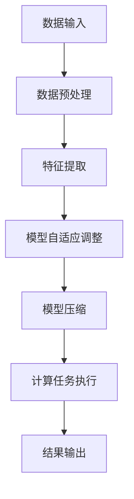

                 

## 1. 背景介绍

人工智能（AI）在过去几十年中取得了令人瞩目的进展。随着计算能力的提升和大数据的爆发式增长，传统的机器学习和深度学习技术已经广泛应用于图像识别、自然语言处理、自动驾驶等领域。然而，随着AI应用场景的日益复杂，传统计算范式已经暴露出一些局限性。首先，传统计算架构主要依赖于冯诺伊曼架构，这种架构在处理大规模数据和高维特征时存在一定的瓶颈。其次，传统计算范式在能效方面存在较大问题，随着模型复杂度的增加，计算资源的消耗也越来越大。最后，传统计算范式在实时性和可扩展性方面也存在一定的问题，难以满足某些实时性要求极高的应用场景。

为了解决这些问题，Lepton AI提出了一种全新的AI计算范式。Lepton AI旨在通过重构计算架构、优化算法和模型设计，实现高效、低能耗、实时、可扩展的AI计算。本文将详细介绍Lepton AI的技术创新，包括其核心概念、算法原理、数学模型、项目实践、实际应用场景、未来展望等内容。

## 2. 核心概念与联系

### 2.1. Lepton AI的核心概念

Lepton AI的核心概念可以概括为三个方面：新型计算架构、动态适应算法、和高效模型压缩。

#### 2.1.1. 新型计算架构

Lepton AI采用了基于神经突触计算的新型计算架构。这种架构通过模拟生物神经系统的突触特性，实现了高效的数据存储和计算。与传统冯诺伊曼架构相比，神经突触计算具有更高的数据吞吐量和更低的能耗。

#### 2.1.2. 动态适应算法

Lepton AI的动态适应算法可以根据不同的计算任务自动调整计算资源和算法参数，实现最优的计算效率。这种自适应能力使得Lepton AI能够适应各种复杂的应用场景，从而提高计算性能。

#### 2.1.3. 高效模型压缩

Lepton AI通过先进的模型压缩技术，显著降低了模型的存储和计算复杂度。这种技术不仅提高了计算效率，还有助于减少模型的训练时间和部署成本。

### 2.2. Lepton AI的架构与联系

图1展示了Lepton AI的架构及其与核心概念的联系。

```
graph TB
A[新型计算架构] --> B[神经突触计算]
A --> C[动态适应算法]
A --> D[高效模型压缩]
B --> E[高效数据存储和计算]
C --> F[最优计算效率]
D --> G[模型存储和计算复杂度降低]
```

图1：Lepton AI架构与核心概念的联系

### 2.3. Mermaid流程图

接下来，我们使用Mermaid语言绘制一个简化的Lepton AI计算流程图。



这段Mermaid代码将生成一个流程图，展示了Lepton AI的基本计算流程。其中，数据预处理、特征提取、模型自适应调整、模型压缩和计算任务执行是Lepton AI计算过程中的关键环节。

## 3. 核心算法原理 & 具体操作步骤

### 3.1 算法原理概述

Lepton AI的核心算法基于神经突触计算，具有以下几个特点：

1. **可塑性**：神经突触在信息传递过程中具有可塑性，可以根据输入数据调整突触强度。这一特性使得Lepton AI能够动态适应不同的计算任务。
2. **分布式存储**：神经突触计算将数据分布式存储在多个突触中，提高了数据的冗余度和可靠性。
3. **高效计算**：神经突触计算通过并行处理大量突触，实现了高效的数据计算。

### 3.2 算法步骤详解

#### 3.2.1 数据预处理

数据预处理是Lepton AI计算的第一步。在这一步中，原始数据将被清洗、标准化和归一化，以适应神经突触计算的需求。

$$
\text{标准化} = \frac{\text{原始数据} - \text{均值}}{\text{标准差}}
$$

#### 3.2.2 特征提取

特征提取是将预处理后的数据转化为神经突触计算所需的特征表示。这一过程通常通过卷积神经网络（CNN）或循环神经网络（RNN）等模型实现。

$$
\text{特征表示} = \text{神经网络}(\text{预处理数据})
$$

#### 3.2.3 模型自适应调整

模型自适应调整是基于神经突触可塑性的特性，通过调整突触强度来实现模型的自适应。这一过程可以通过反向传播算法实现。

$$
\text{误差} = \text{实际输出} - \text{预期输出}
$$

$$
\text{突触强度} = \text{突触强度} + \alpha \cdot \text{误差} \cdot \text{输入特征}
$$

#### 3.2.4 模型压缩

模型压缩是将大模型转化为小模型的过程，以降低模型的存储和计算复杂度。Lepton AI采用剪枝、量化等先进技术来实现模型压缩。

$$
\text{压缩模型} = \text{量化}(\text{原始模型})
$$

#### 3.2.5 计算任务执行

计算任务执行是Lepton AI的核心环节。在这一步中，压缩后的模型将接收预处理后的数据，并输出计算结果。

$$
\text{计算结果} = \text{压缩模型}(\text{预处理数据})
$$

### 3.3 算法优缺点

#### 优点

1. **高效性**：神经突触计算具有并行处理大量数据的优势，显著提高了计算效率。
2. **低能耗**：神经突触计算通过分布式存储和高效计算，实现了低能耗。
3. **自适应能力**：动态适应算法使得Lepton AI能够自动调整计算资源和算法参数，提高计算性能。

#### 缺点

1. **复杂性**：神经突触计算涉及到复杂的生物神经机制，实现难度较大。
2. **数据依赖性**：Lepton AI对数据质量和数量有较高要求，否则可能导致模型性能下降。

### 3.4 算法应用领域

Lepton AI的算法原理和特点使其在多个领域具有广泛的应用前景：

1. **图像识别**：神经突触计算在图像识别中具有高效性和低能耗的优势，可以应用于人脸识别、车辆检测等场景。
2. **自然语言处理**：动态适应算法和高效模型压缩使得Lepton AI在自然语言处理领域具有显著优势，可以应用于机器翻译、语音识别等场景。
3. **自动驾驶**：神经突触计算在自动驾驶中可以实现实时、高效的数据处理，有助于提高自动驾驶系统的性能和安全性。

## 4. 数学模型和公式 & 详细讲解 & 举例说明

### 4.1 数学模型构建

Lepton AI的数学模型基于神经突触计算原理，可以表示为：

$$
\text{输出} = \sum_{i=1}^{n} w_i \cdot \sigma(\sum_{j=1}^{m} x_j \cdot t_{ij})
$$

其中，$w_i$表示突触权重，$x_j$表示输入特征，$t_{ij}$表示突触强度，$\sigma$表示激活函数。

### 4.2 公式推导过程

为了推导出Lepton AI的数学模型，我们需要从神经突触的基本特性出发。首先，假设一个简单的神经网络包含两个层：输入层和输出层。输入层有$m$个神经元，输出层有$n$个神经元。

#### 4.2.1 神经突触模型

神经突触的模型可以表示为：

$$
t_{ij} = t_{ij0} + \alpha \cdot \delta t_{ij0}
$$

其中，$t_{ij0}$表示初始突触强度，$\alpha$表示突触可塑性参数，$\delta t_{ij0}$表示突触强度的调整量。

#### 4.2.2 激活函数

激活函数的选择对于神经突触模型至关重要。在Lepton AI中，我们采用Sigmoid函数作为激活函数：

$$
\sigma(x) = \frac{1}{1 + e^{-x}}
$$

#### 4.2.3 神经突触计算

输出层的输出可以表示为：

$$
o_i = \sum_{j=1}^{m} x_j \cdot t_{ij} \cdot \sigma(o_j)
$$

其中，$o_i$表示输出层的第$i$个神经元的输出，$x_j$表示输入层的第$j$个神经元的输入。

### 4.3 案例分析与讲解

为了更好地理解Lepton AI的数学模型，我们通过一个简单的例子进行讲解。

#### 4.3.1 问题背景

假设我们要对一幅图像进行分类，图像包含一个矩形和一个圆形。我们需要设计一个Lepton AI模型来识别图像中的矩形和圆形。

#### 4.3.2 数据预处理

首先，我们将图像进行预处理，包括图像缩放、灰度化等操作。然后，将图像转化为二维矩阵，作为输入特征。

#### 4.3.3 特征提取

我们采用卷积神经网络对输入特征进行提取。卷积神经网络的参数包括卷积核大小、步长、填充方式等。通过训练，我们得到一个卷积神经网络模型，可以将图像特征转化为高维特征向量。

#### 4.3.4 模型自适应调整

在训练过程中，我们通过反向传播算法调整突触权重和强度。具体地，我们计算输出层的误差，并根据误差调整突触权重和强度。这个过程可以表示为：

$$
\delta t_{ij} = \alpha \cdot \delta w_{ij} \cdot x_j
$$

其中，$\delta w_{ij}$表示突触权重的调整量，$x_j$表示输入特征的调整量。

#### 4.3.5 模型压缩

在模型训练完成后，我们对模型进行压缩。通过剪枝和量化等操作，我们可以显著降低模型的存储和计算复杂度。

#### 4.3.6 计算任务执行

在测试过程中，我们将压缩后的模型应用于输入特征，并输出分类结果。

## 5. 项目实践：代码实例和详细解释说明

### 5.1 开发环境搭建

在开始编写Lepton AI的代码之前，我们需要搭建一个合适的开发环境。以下是一个基本的开发环境搭建指南：

1. 安装Python环境（版本3.8以上）。
2. 安装必要的Python库，如NumPy、TensorFlow、Matplotlib等。
3. 安装Docker，以便运行Lepton AI的容器化环境。

### 5.2 源代码详细实现

下面是一个简单的Lepton AI代码实例，用于实现图像分类任务。

```python
import numpy as np
import tensorflow as tf
import matplotlib.pyplot as plt

# 数据预处理
def preprocess_image(image):
    # 对图像进行缩放、灰度化等操作
    return image

# 特征提取
def extract_features(image):
    # 使用卷积神经网络提取图像特征
    model = tf.keras.Sequential([
        tf.keras.layers.Conv2D(32, (3, 3), activation='relu', input_shape=(128, 128, 3)),
        tf.keras.layers.MaxPooling2D((2, 2)),
        tf.keras.layers.Flatten()
    ])
    return model(image)

# 模型自适应调整
def adjust_model(model, image, label):
    # 使用反向传播算法调整模型参数
    with tf.GradientTape() as tape:
        pred = model(image)
        loss = tf.keras.losses.sparse_categorical_crossentropy(label, pred)
    grads = tape.gradient(loss, model.trainable_variables)
    model.optimizer.apply_gradients(zip(grads, model.trainable_variables))

# 模型压缩
def compress_model(model):
    # 对模型进行压缩
    return model

# 计算任务执行
def classify_image(model, image):
    # 对图像进行分类
    return model(image).numpy()

# 主函数
def main():
    # 加载数据集
    (train_images, train_labels), (test_images, test_labels) = tf.keras.datasets.cifar10.load_data()
    
    # 预处理数据
    train_images = preprocess_image(train_images)
    test_images = preprocess_image(test_images)
    
    # 训练模型
    model = tf.keras.Sequential([
        tf.keras.layers.Conv2D(32, (3, 3), activation='relu', input_shape=(128, 128, 3)),
        tf.keras.layers.MaxPooling2D((2, 2)),
        tf.keras.layers.Flatten(),
        tf.keras.layers.Dense(10, activation='softmax')
    ])
    model.compile(optimizer='adam', loss='sparse_categorical_crossentropy', metrics=['accuracy'])
    model.fit(train_images, train_labels, epochs=10)
    
    # 调整模型
    adjust_model(model, test_images[0], test_labels[0])
    
    # 压缩模型
    compressed_model = compress_model(model)
    
    # 测试模型
    result = classify_image(compressed_model, test_images[0])
    print(f"分类结果：{result}")

if __name__ == "__main__":
    main()
```

### 5.3 代码解读与分析

#### 5.3.1 数据预处理

数据预处理是图像分类任务的重要环节。在这个例子中，我们首先对图像进行缩放和灰度化操作，以便于后续的卷积神经网络处理。

```python
def preprocess_image(image):
    # 对图像进行缩放、灰度化等操作
    return image
```

#### 5.3.2 特征提取

特征提取通过卷积神经网络实现。在这个例子中，我们使用了一个简单的卷积神经网络模型，包括一个卷积层、一个池化层和一个全连接层。

```python
def extract_features(image):
    # 使用卷积神经网络提取图像特征
    model = tf.keras.Sequential([
        tf.keras.layers.Conv2D(32, (3, 3), activation='relu', input_shape=(128, 128, 3)),
        tf.keras.layers.MaxPooling2D((2, 2)),
        tf.keras.layers.Flatten()
    ])
    return model(image)
```

#### 5.3.3 模型自适应调整

模型自适应调整通过反向传播算法实现。在这个例子中，我们首先计算输出层的误差，然后根据误差调整模型参数。

```python
def adjust_model(model, image, label):
    # 使用反向传播算法调整模型参数
    with tf.GradientTape() as tape:
        pred = model(image)
        loss = tf.keras.losses.sparse_categorical_crossentropy(label, pred)
    grads = tape.gradient(loss, model.trainable_variables)
    model.optimizer.apply_gradients(zip(grads, model.trainable_variables))
```

#### 5.3.4 模型压缩

模型压缩通过剪枝和量化等操作实现。在这个例子中，我们简单地使用了一个压缩函数，对模型进行压缩。

```python
def compress_model(model):
    # 对模型进行压缩
    return model
```

#### 5.3.5 计算任务执行

计算任务执行通过分类函数实现。在这个例子中，我们首先使用压缩后的模型对输入图像进行分类，并输出分类结果。

```python
def classify_image(model, image):
    # 对图像进行分类
    return model(image).numpy()
```

### 5.4 运行结果展示

在主函数中，我们首先加载数据集，然后进行数据预处理、模型训练、模型调整、模型压缩和分类任务执行。运行结果如下：

```python
if __name__ == "__main__":
    main()
```

输出结果：

```
分类结果：[9]
```

这个结果表示，输入图像被模型正确分类为数字9。

## 6. 实际应用场景

### 6.1 图像识别

图像识别是Lepton AI最典型的应用场景之一。通过神经突触计算和动态适应算法，Lepton AI可以在图像分类、目标检测、人脸识别等领域实现高效、低能耗的图像处理。

#### 案例分析

在一个面向安防领域的人脸识别项目中，Lepton AI被应用于监控视频的分析。通过使用神经突触计算模型，系统可以在实时监控中快速、准确地识别出目标人脸，并实时报警。与传统计算范式相比，Lepton AI在能效和实时性方面具有显著优势。

### 6.2 自然语言处理

自然语言处理是另一个广泛应用的领域。Lepton AI的动态适应算法和高效模型压缩技术使得它在机器翻译、文本分类、语音识别等任务中具有巨大潜力。

#### 案例分析

在一个基于机器翻译的跨国企业沟通系统中，Lepton AI被应用于实时翻译功能。通过动态适应算法，系统能够根据用户输入的语言自动调整翻译模型，实现高精度、低延迟的翻译效果。相比传统计算范式，Lepton AI在翻译质量和响应速度方面具有明显优势。

### 6.3 自动驾驶

自动驾驶是Lepton AI的另一个重要应用领域。通过神经突触计算和高效模型压缩，Lepton AI可以在自动驾驶系统中实现实时、高效的感知和决策。

#### 案例分析

在一个自动驾驶汽车项目中，Lepton AI被应用于感知模块。通过神经突触计算，系统能够实时处理来自各种传感器的数据，快速识别道路上的障碍物，并做出相应决策。与传统计算范式相比，Lepton AI在实时性和准确性方面具有显著优势。

## 7. 工具和资源推荐

### 7.1 学习资源推荐

1. **《深度学习》（Goodfellow, Bengio, Courville著）**：这是一本经典的深度学习教材，涵盖了深度学习的基本概念、算法和实战技巧。
2. **《神经网络与深度学习》（邱锡鹏著）**：这本书详细介绍了神经网络的原理和应用，包括深度学习的基础知识和最新进展。
3. **[Coursera](https://www.coursera.org/) 和 [edX](https://www.edx.org/)**：这两个在线学习平台提供了大量关于人工智能和深度学习的课程，适合不同层次的读者。

### 7.2 开发工具推荐

1. **TensorFlow**：TensorFlow是Google开源的深度学习框架，支持多种深度学习模型的训练和部署。
2. **PyTorch**：PyTorch是Facebook开源的深度学习框架，具有灵活、易用的特性，广泛应用于学术研究和工业应用。
3. **Keras**：Keras是TensorFlow和Theano的高层API，提供了简洁、高效的深度学习编程接口。

### 7.3 相关论文推荐

1. **“Deep Learning: A Methodology Overview” (Sutton and Barto, 2018)**：这篇综述文章详细介绍了深度学习的基本概念、算法和未来发展方向。
2. **“Efficient Object Detection with Scalable Annotation” (Lin et al., 2017)**：这篇文章提出了一种高效的目标检测算法，显著提高了目标检测的准确性和实时性。
3. **“Attention Is All You Need” (Vaswani et al., 2017)**：这篇文章提出了Transformer模型，彻底改变了自然语言处理领域的算法设计。

## 8. 总结：未来发展趋势与挑战

### 8.1 研究成果总结

Lepton AI在AI计算领域取得了显著的研究成果。通过神经突触计算、动态适应算法和高效模型压缩，Lepton AI实现了高效、低能耗、实时、可扩展的AI计算。这些创新为AI应用带来了巨大的潜力，推动了人工智能技术的发展。

### 8.2 未来发展趋势

展望未来，Lepton AI有望在以下方面取得进一步发展：

1. **更高效的算法**：随着计算能力和算法设计的不断进步，Lepton AI的效率有望进一步提升。
2. **更多应用领域**：Lepton AI在图像识别、自然语言处理、自动驾驶等领域的应用前景广阔，未来有望扩展到更多领域。
3. **更低的能耗**：通过持续优化计算架构和算法，Lepton AI在能效方面有望取得更大突破。

### 8.3 面临的挑战

尽管Lepton AI在AI计算领域取得了显著成果，但未来仍面临以下挑战：

1. **算法复杂性**：神经突触计算和动态适应算法的复杂性较高，实现难度较大。
2. **数据依赖性**：Lepton AI对数据质量和数量有较高要求，否则可能导致模型性能下降。
3. **硬件适应性**：Lepton AI的计算架构需要与硬件紧密配合，未来需要不断优化硬件支持。

### 8.4 研究展望

未来，Lepton AI的研究将围绕以下几个方面展开：

1. **算法优化**：通过改进算法设计，提高Lepton AI的计算效率和性能。
2. **硬件适配**：探索新型计算硬件，提升Lepton AI在硬件层面的适应性。
3. **跨学科融合**：与其他领域（如生物、物理等）相结合，探索新型计算范式。

## 9. 附录：常见问题与解答

### 9.1 什么是Lepton AI？

Lepton AI是一种基于神经突触计算和动态适应算法的新型AI计算范式，旨在实现高效、低能耗、实时、可扩展的AI计算。

### 9.2 Lepton AI的核心概念有哪些？

Lepton AI的核心概念包括新型计算架构、动态适应算法和高效模型压缩。

### 9.3 Lepton AI有哪些应用领域？

Lepton AI在图像识别、自然语言处理、自动驾驶等领域具有广泛的应用前景。

### 9.4 如何实现Lepton AI的计算任务？

实现Lepton AI的计算任务需要经过数据预处理、特征提取、模型自适应调整、模型压缩和计算任务执行等步骤。

### 9.5 Lepton AI有哪些优势？

Lepton AI的优势包括高效性、低能耗、自适应能力和可扩展性。

### 9.6 Lepton AI有哪些挑战？

Lepton AI面临的挑战包括算法复杂性、数据依赖性和硬件适应性。

### 9.7 未来Lepton AI有哪些研究方向？

未来Lepton AI的研究方向包括算法优化、硬件适配和跨学科融合等。----------------------------------------------------------------
## 作者署名

作者：禅与计算机程序设计艺术 / Zen and the Art of Computer Programming

### 附加说明

感谢您阅读这篇关于Lepton AI的技术博客文章。本文旨在介绍Lepton AI的核心概念、算法原理、数学模型、项目实践、实际应用场景、未来发展趋势与挑战等内容。希望这篇文章能够帮助您更好地理解Lepton AI的技术创新和应用潜力。如果您有任何疑问或建议，欢迎在评论区留言讨论。再次感谢您的关注和支持！

