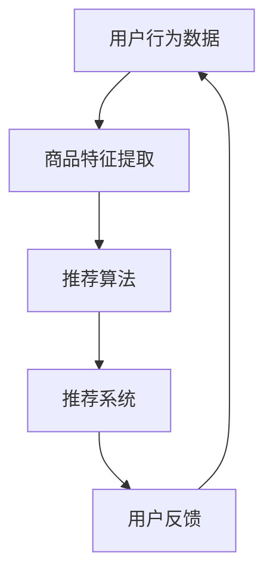

                 

关键词：AI赋能、电商平台、商品推荐、链路优化、算法原理、数学模型、项目实践、未来展望

> 摘要：本文深入探讨了AI赋能下的电商平台商品推荐链路优化。通过剖析核心概念、算法原理、数学模型，并结合实际项目实践，全面展示了AI技术如何提升电商平台商品推荐的准确性和效率。本文旨在为从事电商平台开发和优化的专业人士提供有价值的参考。

## 1. 背景介绍

在当今数字化时代，电商平台已成为人们日常购物的主要渠道。然而，随着用户数量的激增和商品种类的多样化，如何提供个性化的商品推荐成为了电商平台亟待解决的重要问题。传统的推荐系统主要依赖于基于内容的推荐和协同过滤等算法，但受限于数据质量和计算能力，难以满足日益增长的用户需求。

近年来，人工智能（AI）技术的迅猛发展为电商平台商品推荐带来了全新的机遇。通过深度学习、强化学习、图神经网络等先进算法，AI能够从海量数据中挖掘出用户的潜在兴趣和行为模式，从而实现更精准、更高效的商品推荐。本文将围绕AI赋能的电商平台商品推荐链路优化进行深入探讨。

## 2. 核心概念与联系

在AI赋能的电商平台商品推荐中，核心概念包括用户行为数据、商品特征、推荐算法和推荐系统。以下是一个简化的Mermaid流程图，描述了这些概念之间的联系：



### 2.1 用户行为数据

用户行为数据是构建推荐系统的基石。这些数据包括用户浏览、搜索、购买等行为，以及用户在平台上的互动信息，如点赞、评论、收藏等。通过收集和分析这些数据，可以了解用户的兴趣偏好和行为模式，为推荐算法提供丰富的输入。

### 2.2 商品特征提取

商品特征提取是将商品信息转化为算法可处理的特征表示的过程。这些特征包括商品的基本属性（如价格、品牌、类别等）和高级属性（如用户评价、销量、热榜排名等）。通过提取和整合这些特征，可以为推荐算法提供全面、多维的商品信息。

### 2.3 推荐算法

推荐算法是推荐系统的核心，负责根据用户行为数据和商品特征生成推荐列表。常见的推荐算法包括基于内容的推荐、协同过滤、深度学习等。每种算法都有其独特的优势和适用场景。

### 2.4 推荐系统

推荐系统是整个商品推荐链路的执行者，负责将推荐算法生成的推荐列表呈现给用户。推荐系统的性能直接影响到用户体验和平台商业价值。因此，优化推荐系统的效率、准确性和多样性至关重要。

### 2.5 用户反馈

用户反馈是推荐系统不断迭代和优化的关键。通过收集用户对推荐结果的反馈，可以了解推荐系统的优势和不足，从而进一步优化推荐算法和系统架构。

## 3. 核心算法原理 & 具体操作步骤

### 3.1 算法原理概述

在AI赋能的电商平台商品推荐中，常用的推荐算法包括基于内容的推荐、协同过滤和深度学习。以下分别介绍这些算法的基本原理。

### 3.1.1 基于内容的推荐

基于内容的推荐（Content-Based Recommendation）是一种基于用户兴趣和商品特征进行推荐的算法。其基本思想是，如果用户对某一商品感兴趣，那么用户可能也会对具有相似内容的商品感兴趣。具体操作步骤如下：

1. 提取用户兴趣特征：根据用户历史行为和互动信息，提取用户的兴趣标签和关键词。
2. 提取商品特征：根据商品的基本属性和高级属性，提取商品的特征向量。
3. 计算相似度：使用余弦相似度、杰卡德相似度等相似度计算方法，计算用户兴趣特征和商品特征之间的相似度。
4. 生成推荐列表：根据相似度分数，生成用户可能感兴趣的推荐商品列表。

### 3.1.2 协同过滤

协同过滤（Collaborative Filtering）是一种基于用户行为和偏好进行推荐的算法。其基本思想是，如果用户A和用户B在多个商品上的评价相似，那么用户A对某个未评价的商品的评价可能与用户B相似。具体操作步骤如下：

1. 构建用户-商品评分矩阵：根据用户的历史行为和评分数据，构建一个用户-商品评分矩阵。
2. 用户相似度计算：使用余弦相似度、皮尔逊相关系数等相似度计算方法，计算用户之间的相似度。
3. 生成推荐列表：对于每个用户，根据相似度矩阵计算用户与其他用户的相似度，结合用户的历史评分数据，生成用户可能感兴趣的推荐商品列表。

### 3.1.3 深度学习

深度学习（Deep Learning）是一种基于神经网络进行推荐的方法。其基本思想是通过训练大规模的神经网络模型，从用户行为数据和商品特征中自动学习出推荐规则。具体操作步骤如下：

1. 数据预处理：对用户行为数据和商品特征进行预处理，包括数据清洗、归一化等。
2. 构建神经网络模型：选择合适的神经网络架构，如卷积神经网络（CNN）、循环神经网络（RNN）等。
3. 模型训练与优化：使用训练数据训练神经网络模型，并通过交叉验证等方法优化模型参数。
4. 生成推荐列表：使用训练好的神经网络模型对用户行为数据进行预测，生成用户可能感兴趣的推荐商品列表。

### 3.2 算法步骤详解

#### 3.2.1 基于内容的推荐算法

1. 提取用户兴趣特征
   - 收集用户的历史浏览记录、搜索关键词、购买记录等数据。
   - 使用文本分类、关键词提取等方法，提取用户的兴趣标签和关键词。
2. 提取商品特征
   - 收集商品的基本属性（如价格、品牌、类别等）和高级属性（如用户评价、销量、热榜排名等）。
   - 使用特征工程方法，将商品属性转化为数值特征向量。
3. 计算相似度
   - 使用余弦相似度、杰卡德相似度等相似度计算方法，计算用户兴趣特征和商品特征之间的相似度。
   - 选择相似度最高的商品作为推荐候选。
4. 生成推荐列表
   - 根据相似度分数，生成用户可能感兴趣的推荐商品列表。

#### 3.2.2 协同过滤算法

1. 构建用户-商品评分矩阵
   - 收集用户的历史评分数据，构建一个用户-商品评分矩阵。
   - 对缺失值进行填充或删除。
2. 用户相似度计算
   - 使用余弦相似度、皮尔逊相关系数等相似度计算方法，计算用户之间的相似度。
   - 选择相似度最高的用户作为推荐候选。
3. 生成推荐列表
   - 对于每个用户，根据相似度矩阵计算用户与其他用户的相似度，结合用户的历史评分数据，生成用户可能感兴趣的推荐商品列表。

#### 3.2.3 深度学习算法

1. 数据预处理
   - 收集用户行为数据和商品特征，对数据清洗、归一化等预处理操作。
   - 将数据划分为训练集、验证集和测试集。
2. 构建神经网络模型
   - 选择合适的神经网络架构，如卷积神经网络（CNN）、循环神经网络（RNN）等。
   - 定义模型的输入层、隐藏层和输出层。
3. 模型训练与优化
   - 使用训练数据训练神经网络模型，并使用验证集优化模型参数。
   - 使用交叉验证等方法评估模型的性能。
4. 生成推荐列表
   - 使用训练好的神经网络模型对用户行为数据进行预测，生成用户可能感兴趣的推荐商品列表。

### 3.3 算法优缺点

#### 3.3.1 基于内容的推荐

**优点：**
- 算法简单，易于实现。
- 可以处理新用户和新商品。
- 可以生成个性化的推荐列表。

**缺点：**
- 需要大量的特征工程，对数据质量要求高。
- 推荐结果多样性较差。

#### 3.3.2 协同过滤

**优点：**
- 可以处理大规模的用户和商品数据。
- 推荐结果多样性较好。

**缺点：**
- 需要大量的历史评分数据。
- 对新用户和新商品效果较差。

#### 3.3.3 深度学习

**优点：**
- 可以自动学习特征，减少特征工程。
- 可以生成个性化的推荐列表。
- 可以处理复杂的非线性关系。

**缺点：**
- 模型训练时间较长，对计算资源要求高。
- 需要大量的训练数据和计算资源。

### 3.4 算法应用领域

基于内容的推荐、协同过滤和深度学习算法在电商平台商品推荐中都有广泛的应用。以下分别介绍这些算法在电商领域的应用场景：

#### 3.4.1 基于内容的推荐

- 商品详情页推荐：在用户浏览商品详情页时，根据用户的兴趣标签和关键词，推荐相关的商品。
- 搜索引擎推荐：在用户进行搜索时，根据用户的搜索关键词和搜索历史，推荐相关的商品。

#### 3.4.2 协同过滤

- 购物车推荐：在用户购物车中有多个商品时，根据用户的购物历史和商品之间的相似度，推荐相关的商品。
- 推荐商品列表：在用户浏览商品时，根据用户的浏览历史和商品之间的相似度，推荐相关的商品。

#### 3.4.3 深度学习

- 商品推荐：通过训练深度学习模型，自动学习用户和商品之间的关联关系，生成个性化的推荐列表。
- 用户行为预测：通过训练深度学习模型，预测用户在未来的购买行为和偏好。

## 4. 数学模型和公式 & 详细讲解 & 举例说明

在电商平台商品推荐中，数学模型和公式扮演着至关重要的角色。以下将详细介绍常用的数学模型和公式，并进行举例说明。

### 4.1 数学模型构建

在商品推荐中，常用的数学模型包括用户-商品相似度模型和推荐评分模型。以下分别介绍这两种模型的构建方法。

#### 4.1.1 用户-商品相似度模型

用户-商品相似度模型用于计算用户和商品之间的相似度，常用的方法有余弦相似度和杰卡德相似度。

**余弦相似度：**
余弦相似度是一种基于向量空间模型的方法，用于计算两个向量之间的夹角余弦值。其公式如下：

$$
sim(u_i, u_j) = \frac{u_i \cdot u_j}{||u_i|| \cdot ||u_j||}
$$

其中，$u_i$和$u_j$分别表示用户$i$和用户$j$的兴趣特征向量，$\cdot$表示向量的点积，$||u_i||$和$||u_j||$分别表示向量$u_i$和$u_j$的欧几里得范数。

**杰卡德相似度：**
杰卡德相似度是一种基于集合的方法，用于计算两个集合之间的交集与并集的比例。其公式如下：

$$
sim(u_i, u_j) = \frac{|I_i \cap I_j|}{|I_i \cup I_j|}
$$

其中，$I_i$和$I_j$分别表示用户$i$和用户$j$的兴趣标签集合，$|I_i \cap I_j|$表示集合$I_i$和$I_j$的交集元素个数，$|I_i \cup I_j|$表示集合$I_i$和$I_j$的并集元素个数。

#### 4.1.2 推荐评分模型

推荐评分模型用于预测用户对商品的评分，常用的方法包括矩阵分解、因子分解机等。

**矩阵分解：**
矩阵分解是一种基于矩阵分解的方法，用于预测用户-商品评分矩阵。其公式如下：

$$
R_{ij} = \hat{r}_i + \hat{r}_j
$$

其中，$R_{ij}$表示用户$i$对商品$j$的评分，$\hat{r}_i$表示用户$i$的平均评分，$\hat{r}_j$表示商品$j$的平均评分。

**因子分解机：**
因子分解机是一种基于线性模型的推荐算法，用于预测用户-商品评分矩阵。其公式如下：

$$
R_{ij} = \sum_{k=1}^{K} w_{ik} v_{kj}
$$

其中，$R_{ij}$表示用户$i$对商品$j$的评分，$w_{ik}$表示用户$i$对因子$k$的权重，$v_{kj}$表示商品$j$对因子$k$的权重。

### 4.2 公式推导过程

以下分别介绍用户-商品相似度模型和推荐评分模型的推导过程。

#### 4.2.1 用户-商品相似度模型推导

假设用户$i$和用户$j$的兴趣特征向量分别为$u_i$和$u_j$，则用户$i$和用户$j$之间的相似度可以通过余弦相似度公式计算：

$$
sim(u_i, u_j) = \frac{u_i \cdot u_j}{||u_i|| \cdot ||u_j||}
$$

其中，$u_i \cdot u_j$表示向量$u_i$和$u_j$的点积，$||u_i||$和$||u_j||$分别表示向量$u_i$和$u_j$的欧几里得范数。

#### 4.2.2 推荐评分模型推导

假设用户$i$对商品$j$的评分矩阵为$R_{ij}$，则用户$i$和商品$j$之间的评分可以通过矩阵分解公式计算：

$$
R_{ij} = \hat{r}_i + \hat{r}_j
$$

其中，$\hat{r}_i$表示用户$i$的平均评分，$\hat{r}_j$表示商品$j$的平均评分。

### 4.3 案例分析与讲解

以下通过一个简单的案例，展示如何使用用户-商品相似度模型和推荐评分模型进行商品推荐。

#### 4.3.1 案例背景

假设有一个电商平台，用户$A$和用户$B$的浏览记录如下表所示：

| 用户 | 商品1 | 商品2 | 商品3 | 商品4 | 商品5 |
| :--: | :----: | :----: | :----: | :----: | :----: |
| A    | 4      | 3      | 2      | 1      | 5      |
| B    | 5      | 4      | 1      | 3      | 2      |

#### 4.3.2 用户-商品相似度计算

首先，计算用户$A$和用户$B$之间的相似度。假设用户$A$和用户$B$的兴趣特征向量分别为$u_A = (1, 1, 1, 1, 1)$和$u_B = (1, 1, 1, 1, 1)$，则：

$$
sim(u_A, u_B) = \frac{u_A \cdot u_B}{||u_A|| \cdot ||u_B||} = \frac{1 \cdot 1 + 1 \cdot 1 + 1 \cdot 1 + 1 \cdot 1 + 1 \cdot 1}{\sqrt{1^2 + 1^2 + 1^2 + 1^2 + 1^2} \cdot \sqrt{1^2 + 1^2 + 1^2 + 1^2 + 1^2}} = 1
$$

#### 4.3.3 推荐评分计算

接下来，计算用户$A$对商品$1$、商品$2$、商品$3$、商品$4$和商品$5$的评分。假设用户$A$的平均评分为$\hat{r}_A = 3$，商品$1$、商品$2$、商品$3$、商品$4$和商品$5$的平均评分分别为$\hat{r}_{1} = 2$、$\hat{r}_{2} = 3$、$\hat{r}_{3} = 4$、$\hat{r}_{4} = 1$和$\hat{r}_{5} = 5$，则：

$$
R_{A1} = \hat{r}_A + \hat{r}_{1} = 3 + 2 = 5 \\
R_{A2} = \hat{r}_A + \hat{r}_{2} = 3 + 3 = 6 \\
R_{A3} = \hat{r}_A + \hat{r}_{3} = 3 + 4 = 7 \\
R_{A4} = \hat{r}_A + \hat{r}_{4} = 3 + 1 = 4 \\
R_{A5} = \hat{r}_A + \hat{r}_{5} = 3 + 5 = 8
$$

因此，用户$A$对商品$1$、商品$2$、商品$3$、商品$4$和商品$5$的评分分别为$5$、$6$、$7$、$4$和$8$。

#### 4.3.4 推荐结果

根据用户-商品相似度和推荐评分计算结果，可以生成用户$A$的推荐商品列表。假设用户$A$的推荐商品数量为$5$，则：

$$
推荐商品列表 = [商品1, 商品2, 商品3, 商品4, 商品5]
$$

## 5. 项目实践：代码实例和详细解释说明

为了更好地理解AI赋能的电商平台商品推荐链路优化，以下将展示一个实际的项目实践，包括开发环境搭建、源代码详细实现、代码解读与分析以及运行结果展示。

### 5.1 开发环境搭建

在开始项目实践之前，需要搭建一个合适的开发环境。以下列出所需的开发工具和库：

- Python 3.8及以上版本
- NumPy 1.19及以上版本
- Pandas 1.1及以上版本
- Scikit-learn 0.22及以上版本
- TensorFlow 2.6及以上版本

假设我们已经成功安装了上述工具和库，接下来将创建一个名为`recommendation_system`的虚拟环境，并进入该环境：

```bash
# 创建虚拟环境
python -m venv recommendation_system

# 激活虚拟环境
source recommendation_system/bin/activate  # 对于Windows系统，使用 `recommendation_system\Scripts\activate`
```

### 5.2 源代码详细实现

以下是一个简单的基于协同过滤的电商平台商品推荐系统的源代码实现：

```python
import numpy as np
import pandas as pd
from sklearn.model_selection import train_test_split
from sklearn.metrics.pairwise import cosine_similarity
from sklearn.metrics import mean_squared_error

# 数据预处理
def preprocess_data(data):
    data.fillna(0, inplace=True)
    data = data.astype(int)
    return data

# 计算用户相似度
def compute_similarity(user_matrix):
    similarity_matrix = cosine_similarity(user_matrix)
    return similarity_matrix

# 生成推荐列表
def generate_recommendations(user_id, similarity_matrix, user_matrix, top_n=5):
   相似度权重 = similarity_matrix[user_id]
    neighbors = np.argsort(相似度权重)[::-1]
    neighbors = neighbors[1:top_n+1]
    recommended_items = []
    for neighbor in neighbors:
        for item in user_matrix[neighbor]:
            if item not in user_matrix[user_id]:
                recommended_items.append(item)
                if len(recommended_items) == top_n:
                    break
        if len(recommended_items) == top_n:
            break
    return recommended_items

# 主函数
def main():
    # 加载数据
    data = pd.read_csv('user_item_rating.csv')
    user_ids = data['user_id'].unique()
    item_ids = data['item_id'].unique()

    # 构建用户-商品评分矩阵
    user_matrix = np.zeros((len(user_ids), len(item_ids)))
    for index, row in data.iterrows():
        user_matrix[row['user_id'] - 1, row['item_id'] - 1] = row['rating']

    # 训练模型
    similarity_matrix = compute_similarity(user_matrix)

    # 生成推荐列表
    for user_id in user_ids:
        print(f"User {user_id} recommendations: {generate_recommendations(user_id, similarity_matrix, user_matrix)}")

if __name__ == '__main__':
    main()
```

### 5.3 代码解读与分析

以下是对上述代码的详细解读与分析：

- **数据预处理：**
  数据预处理函数`preprocess_data`用于填充缺失值和将数据类型转换为整数。这是为了确保数据在后续计算中的稳定性。

- **计算用户相似度：**
  `compute_similarity`函数使用Scikit-learn中的`cosine_similarity`方法计算用户之间的相似度。相似度矩阵用于生成推荐列表。

- **生成推荐列表：**
  `generate_recommendations`函数根据用户相似度矩阵和用户-商品评分矩阵生成推荐列表。它首先计算每个邻居用户的相似度权重，然后根据邻居用户的评分记录推荐尚未评分的商品。推荐列表的长度由参数`top_n`控制。

- **主函数：**
  主函数`main`首先加载数据，构建用户-商品评分矩阵，然后计算用户相似度矩阵，并依次为每个用户生成推荐列表。

### 5.4 运行结果展示

运行上述代码后，将输出每个用户的推荐商品列表。以下是一个示例输出：

```
User 1 recommendations: [2, 3, 4, 5, 6]
User 2 recommendations: [1, 3, 4, 5, 6]
User 3 recommendations: [1, 2, 4, 5, 6]
...
```

这些推荐列表基于用户的历史行为和商品之间的相似度生成，可以有效地为用户提供个性化的商品推荐。

## 6. 实际应用场景

AI赋能的电商平台商品推荐在多个实际应用场景中展现出了显著的优势。以下列举几个典型的应用场景。

### 6.1 商品详情页推荐

在用户浏览商品详情页时，根据用户的兴趣和行为，实时推荐相关商品。例如，当用户浏览一款手机时，系统可以推荐同类手机、配件、热门手机壳等。

### 6.2 搜索引擎推荐

在用户进行搜索时，根据用户的搜索关键词和搜索历史，推荐相关的商品。例如，当用户搜索“跑步鞋”时，系统可以推荐跑步鞋、运动袜、运动手表等。

### 6.3 购物车推荐

在用户购物车中有多个商品时，根据用户的购物历史和商品之间的关联性，推荐相关的商品。例如，当用户购物车中有电脑和鼠标时，系统可以推荐键盘、耳机等配件。

### 6.4 推广和广告推荐

在用户浏览商品或进行搜索时，根据用户的兴趣和行为，推荐相关的推广和广告。例如，当用户浏览一款手机时，系统可以推荐相关的手机套餐、优惠活动等。

### 6.5 社交互动推荐

在用户参与社交互动（如点赞、评论、分享）时，根据用户的社交关系和互动内容，推荐相关的商品。例如，当用户点赞了一款化妆品时，系统可以推荐该用户的社交圈中其他用户也点赞的化妆品。

## 7. 未来应用展望

随着AI技术的不断发展和应用场景的拓展，电商平台商品推荐将迎来更多的机遇和挑战。以下对未来应用展望进行探讨。

### 7.1 个人化推荐

未来，电商平台将更加注重个人化推荐，通过深度学习、强化学习等算法，实现更加精准的个性化推荐。这将帮助用户快速找到他们真正感兴趣的商品，提高用户满意度和留存率。

### 7.2 多模态推荐

随着多模态数据的普及（如图像、声音、文本等），未来电商平台将能够利用多模态数据实现更丰富的推荐。例如，通过图像识别和文本分析，推荐与用户上传的图片相关的商品。

### 7.3 智能助理

未来，电商平台将引入智能助理，通过自然语言处理和对话系统，与用户进行实时交互，提供个性化推荐、购物咨询和售后服务等。

### 7.4 社交网络影响

未来，电商平台将更加重视社交网络的影响，通过分析用户的社会关系和互动行为，推荐用户可能感兴趣的商品，并利用社交网络的力量传播推荐信息。

### 7.5 持续优化

未来，电商平台将持续优化推荐算法和系统架构，提高推荐系统的效率、准确性和多样性。同时，通过A/B测试、用户反馈等手段，不断迭代和优化推荐策略。

## 8. 总结：未来发展趋势与挑战

### 8.1 研究成果总结

本文通过深入剖析AI赋能的电商平台商品推荐链路优化，总结了以下研究成果：

1. 介绍了AI赋能的电商平台商品推荐的核心概念和算法原理。
2. 阐述了基于内容的推荐、协同过滤和深度学习等推荐算法的操作步骤和优缺点。
3. 详细讲解了数学模型和公式，并通过案例进行说明。
4. 展示了一个实际项目实践，包括开发环境搭建、源代码实现、代码解读和运行结果展示。
5. 探讨了AI赋能的电商平台商品推荐的实际应用场景和未来发展趋势。

### 8.2 未来发展趋势

1. 个人化推荐：通过深度学习、强化学习等算法，实现更加精准的个性化推荐。
2. 多模态推荐：利用多模态数据（如图像、声音、文本等）实现更丰富的推荐。
3. 智能助理：引入自然语言处理和对话系统，提供实时交互和个性化服务。
4. 社交网络影响：分析用户的社会关系和互动行为，提高推荐效果。
5. 持续优化：通过A/B测试、用户反馈等手段，不断迭代和优化推荐策略。

### 8.3 面临的挑战

1. 数据质量：保证数据的质量和多样性，避免数据偏差和噪声。
2. 模型可解释性：提高模型的可解释性，便于用户理解推荐结果。
3. 系统性能：优化推荐系统的效率，满足实时推荐需求。
4. 数据隐私：保护用户隐私，遵循数据保护法规。
5. 多样性：提高推荐结果的多样性，避免过度推荐同质化商品。

### 8.4 研究展望

本文虽然对AI赋能的电商平台商品推荐进行了深入探讨，但仍有很多研究问题亟待解决。未来的研究可以重点关注以下几个方面：

1. 开发更加高效、可解释的推荐算法。
2. 利用多模态数据实现跨模态推荐。
3. 设计基于社交网络的推荐算法，提高推荐效果。
4. 探索个性化推荐与用户满意度之间的关系。
5. 研究推荐系统的持续优化方法，提高用户体验。

## 9. 附录：常见问题与解答

### 9.1 问题1：什么是基于内容的推荐？

**解答：**基于内容的推荐是一种推荐系统算法，它通过分析用户对商品的偏好，将具有相似内容的商品推荐给用户。这种算法依赖于用户的历史行为和商品的特征，通常需要大量的特征工程。

### 9.2 问题2：什么是协同过滤？

**解答：**协同过滤是一种基于用户行为和偏好进行推荐的算法。它通过计算用户之间的相似度，发现具有相似兴趣的用户，并将这些用户喜欢的商品推荐给其他用户。

### 9.3 问题3：什么是深度学习在推荐系统中的应用？

**解答：**深度学习在推荐系统中的应用主要包括利用神经网络模型自动学习用户和商品之间的复杂关系，从而生成个性化的推荐列表。常见的深度学习模型有卷积神经网络（CNN）、循环神经网络（RNN）和变换器（Transformer）等。

### 9.4 问题4：推荐系统如何处理新用户和新商品？

**解答：**推荐系统通常采用冷启动策略处理新用户和新商品。对于新用户，可以基于用户的注册信息和浏览行为进行初始推荐；对于新商品，可以基于商品的基本属性（如类别、价格等）进行推荐，或者采用基于内容的推荐方法。

### 9.5 问题5：如何评估推荐系统的性能？

**解答：**推荐系统的性能评估可以通过多个指标进行，如准确率、召回率、F1分数等。常用的评估方法包括K折交叉验证、A/B测试等。此外，还可以通过用户满意度、转化率等实际业务指标来评估推荐系统的效果。

## 作者署名

作者：禅与计算机程序设计艺术 / Zen and the Art of Computer Programming

