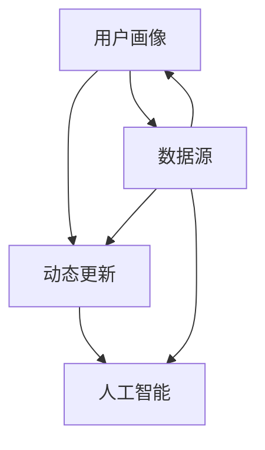

                 

关键词：人工智能、电商平台、用户画像、动态更新、算法原理、数学模型、项目实践、应用场景、工具推荐、未来展望

> 摘要：本文详细探讨了AI赋能的电商平台用户画像动态更新技术。从背景介绍到核心概念、算法原理、数学模型构建，再到实际应用场景和未来展望，全方位解析了这一技术，旨在为电商领域的技术人员提供有价值的参考。

## 1. 背景介绍

在电子商务快速发展的今天，电商平台面临着日益激烈的竞争。如何提升用户体验、增加销售额成为各大电商平台关注的焦点。用户画像作为一种有效的方法，能够帮助电商平台更好地了解用户需求，进而提供个性化的服务和产品推荐。然而，传统的用户画像方法往往只能静态地描述用户特征，难以应对用户行为的快速变化。

为了解决这一问题，人工智能技术的引入成为必然选择。通过AI赋能，电商平台可以实现用户画像的动态更新，实时反映用户行为和需求的变化。本文将围绕这一主题，探讨AI赋能的电商平台用户画像动态更新的技术实现、算法原理和应用场景。

### 1.1  电商平台用户画像的挑战

传统的用户画像方法主要依赖于历史数据和统计模型，如用户的基本信息、购买历史、浏览记录等。这些方法在一定程度上能够为电商平台提供有价值的用户洞察，但在以下方面仍存在挑战：

- **静态特征描述**：传统的用户画像方法往往只能静态地描述用户特征，难以应对用户行为的快速变化。
- **数据多样性**：随着互联网的普及，用户行为数据越来越多样化，传统的统计方法难以处理这些复杂的数据。
- **个性化推荐**：虽然用户画像能够帮助电商平台提供个性化推荐，但推荐结果的准确性和用户体验仍有待提高。

### 1.2  AI赋能的必要性

人工智能技术的引入，为电商平台用户画像的动态更新提供了新的可能性。AI技术能够从海量数据中提取有价值的信息，并通过深度学习、自然语言处理等技术，实现用户行为的实时分析和预测。具体来说，AI赋能的电商平台用户画像动态更新具有以下优势：

- **动态特征提取**：通过AI技术，可以实时捕捉用户行为的动态变化，为电商平台提供更准确的用户画像。
- **数据多样性处理**：AI技术能够处理多种类型的数据，如文本、图像、语音等，从而更全面地了解用户需求。
- **个性化推荐**：基于动态更新的用户画像，电商平台可以提供更个性化的推荐服务，提升用户满意度。

## 2. 核心概念与联系

在探讨AI赋能的电商平台用户画像动态更新之前，我们需要了解一些核心概念和它们之间的联系。

### 2.1  用户画像

用户画像是指对用户特征的综合描述，包括用户的年龄、性别、地域、兴趣、购买历史等。用户画像的目的是帮助电商平台更好地了解用户，从而提供个性化的服务和产品推荐。

### 2.2  动态更新

动态更新是指用户画像能够实时反映用户行为和需求的变化。通过动态更新，电商平台可以不断调整和优化用户画像，提高推荐的准确性和用户体验。

### 2.3  人工智能

人工智能是指通过模拟人类思维和行为，实现自动化决策和任务执行的计算机技术。在电商平台用户画像动态更新中，人工智能技术主要用于数据分析和预测。

### 2.4  关联关系

用户画像、动态更新和人工智能三者之间存在密切的关联。用户画像为电商平台提供了基础数据，动态更新确保了用户画像的实时性，而人工智能则实现了对用户行为的分析和预测，从而提升用户画像的准确性和个性化推荐的效果。

### 2.5  Mermaid 流程图

为了更好地理解上述核心概念之间的联系，我们使用Mermaid流程图来展示它们的关系。



在上述流程图中，用户画像、动态更新和人工智能之间相互关联，共同构成了电商平台用户画像动态更新的核心架构。

## 3. 核心算法原理 & 具体操作步骤

### 3.1  算法原理概述

AI赋能的电商平台用户画像动态更新算法主要包括以下三个部分：

1. **数据收集与预处理**：收集用户的各项行为数据，如浏览记录、购买历史、评论等，并进行数据清洗和预处理。
2. **特征提取与转换**：将预处理后的数据转化为特征向量，以便进行后续的模型训练和预测。
3. **模型训练与预测**：使用机器学习算法对特征向量进行训练，建立用户画像模型，并根据模型预测用户的行为和需求。

### 3.2  算法步骤详解

#### 3.2.1 数据收集与预处理

数据收集与预处理是用户画像动态更新的基础。在这一步骤中，我们主要关注以下任务：

- **数据收集**：从电商平台的后台数据库中提取用户的各项行为数据，如浏览记录、购买历史、评论等。
- **数据清洗**：去除数据中的噪声和异常值，确保数据的质量。
- **数据预处理**：对数据进行归一化、去重等处理，以便进行后续的特征提取。

#### 3.2.2 特征提取与转换

特征提取与转换是将原始数据转化为特征向量的过程。在这一步骤中，我们主要关注以下任务：

- **特征选择**：根据业务需求，选择对用户画像有用的特征，如用户年龄、性别、地域、购买频率等。
- **特征工程**：对原始特征进行转换，如将类别特征转换为数值特征，对缺失值进行填补等。
- **特征向量化**：将处理后的特征转化为向量形式，以便进行后续的模型训练和预测。

#### 3.2.3 模型训练与预测

模型训练与预测是用户画像动态更新的关键步骤。在这一步骤中，我们主要关注以下任务：

- **模型选择**：选择合适的机器学习算法，如决策树、随机森林、支持向量机等。
- **模型训练**：使用训练集对模型进行训练，调整模型参数，提高模型的准确性和泛化能力。
- **模型预测**：使用训练好的模型对测试集进行预测，生成用户画像。

### 3.3  算法优缺点

#### 3.3.1 优点

- **实时性**：AI赋能的算法能够实时捕捉用户行为的动态变化，为电商平台提供准确的用户画像。
- **多样性处理**：AI算法能够处理多种类型的数据，如文本、图像、语音等，从而更全面地了解用户需求。
- **个性化推荐**：基于动态更新的用户画像，电商平台可以提供更个性化的推荐服务，提升用户满意度。

#### 3.3.2 缺点

- **计算资源消耗**：AI算法通常需要大量的计算资源，特别是在处理大规模数据时。
- **数据质量要求高**：算法的准确性依赖于数据的质量，如果数据存在噪声和异常值，可能会导致预测结果不准确。
- **模型解释性较差**：机器学习算法通常具有较好的预测能力，但模型内部的结构较为复杂，难以解释。

### 3.4  算法应用领域

AI赋能的电商平台用户画像动态更新算法在多个领域具有广泛的应用：

- **电商平台**：通过动态更新的用户画像，电商平台可以提供更个性化的推荐服务，提升用户满意度。
- **社交媒体**：社交媒体平台可以使用动态更新的用户画像，为用户提供更精准的内容推荐。
- **金融行业**：金融机构可以使用动态更新的用户画像，进行风险管理和欺诈检测。
- **医疗行业**：医疗行业可以使用动态更新的用户画像，为患者提供个性化的健康管理建议。

## 4. 数学模型和公式 & 详细讲解 & 举例说明

### 4.1  数学模型构建

在AI赋能的电商平台用户画像动态更新中，我们主要使用以下数学模型：

#### 4.1.1  贝叶斯网络

贝叶斯网络是一种概率图模型，用于表示变量之间的条件概率关系。在用户画像动态更新中，贝叶斯网络可以用于建模用户行为和需求之间的概率关系。

#### 4.1.2  随机梯度下降

随机梯度下降（SGD）是一种优化算法，用于训练机器学习模型。在用户画像动态更新中，SGD可以用于优化用户画像模型的参数，提高模型的准确性和泛化能力。

### 4.2  公式推导过程

在本节中，我们将详细讲解贝叶斯网络和随机梯度下降的公式推导过程。

#### 4.2.1  贝叶斯网络公式推导

贝叶斯网络的公式推导基于条件概率公式。假设有 \(X_1, X_2, \ldots, X_n\) 这 \(n\) 个随机变量，且它们之间存在某种条件依赖关系。贝叶斯网络可以通过以下公式表示：

$$
P(X_1, X_2, \ldots, X_n) = P(X_1) \cdot P(X_2|X_1) \cdot P(X_3|X_1, X_2) \cdot \ldots \cdot P(X_n|X_1, X_2, \ldots, X_{n-1})
$$

其中，\(P(X_i|X_1, X_2, \ldots, X_{i-1})\) 表示变量 \(X_i\) 在给定其他 \(i-1\) 个变量的条件下的条件概率。

#### 4.2.2  随机梯度下降公式推导

随机梯度下降是一种优化算法，用于求解最小化损失函数的最优参数。假设我们的目标是最小化损失函数 \(L(\theta)\)，其中 \(\theta\) 是模型参数。随机梯度下降的迭代公式如下：

$$
\theta^{t+1} = \theta^t - \alpha \nabla L(\theta^t)
$$

其中，\(\alpha\) 是学习率，\(\nabla L(\theta^t)\) 是损失函数关于模型参数 \(\theta\) 的梯度。

### 4.3  案例分析与讲解

在本节中，我们将通过一个具体的案例来分析和讲解贝叶斯网络和随机梯度下降在实际应用中的使用。

#### 4.3.1  贝叶斯网络案例

假设我们有一个电商平台，用户的行为数据包括浏览记录、购买历史和评论。我们需要使用贝叶斯网络建模用户行为和需求之间的关系。

1. **变量定义**：

   - \(B_i\)：用户 \(i\) 的浏览记录
   - \(P_i\)：用户 \(i\) 的购买历史
   - \(C_i\)：用户 \(i\) 的评论

2. **贝叶斯网络结构**：

   根据用户行为数据，我们可以定义以下条件概率：

   $$
   P(B_i|P_i, C_i) = \text{伯努利分布}(p)
   $$
   $$
   P(P_i|C_i) = \text{伯努利分布}(q)
   $$
   $$
   P(C_i) = \text{多项式分布}(\pi)
   $$

3. **参数估计**：

   通过对用户行为数据的分析，我们可以估计贝叶斯网络中的参数 \(p\)、\(q\) 和 \(\pi\)。

4. **预测**：

   给定一个新用户的浏览记录 \(B_j\)、购买历史 \(P_j\) 和评论 \(C_j\)，我们可以使用贝叶斯网络预测用户 \(j\) 的行为。

   $$
   P(P_j|B_j, C_j) = \frac{P(B_j|P_j, C_j)P(P_j|C_j)P(C_j)}{P(B_j|C_j)}
   $$

#### 4.3.2  随机梯度下降案例

假设我们使用随机梯度下降算法训练一个线性回归模型，以预测用户的购买金额。

1. **模型定义**：

   $$
   y = \theta_0 + \theta_1x_1 + \theta_2x_2 + \ldots + \theta_nx_n
   $$

2. **损失函数**：

   $$
   L(\theta) = \sum_{i=1}^{n}(y_i - \theta_0 - \theta_1x_{1i} - \theta_2x_{2i} - \ldots - \theta_nx_{ni})^2
   $$

3. **参数更新**：

   通过随机梯度下降算法，我们可以迭代更新模型参数：

   $$
   \theta_j^{t+1} = \theta_j^t - \alpha \nabla L(\theta^t)
   $$

4. **预测**：

   给定一个新用户的特征 \(x_j\)，我们可以使用训练好的线性回归模型预测其购买金额：

   $$
   y_j = \theta_0 + \theta_1x_{1j} + \theta_2x_{2j} + \ldots + \theta_nx_{nj}
   $$

## 5. 项目实践：代码实例和详细解释说明

在本节中，我们将通过一个具体的代码实例，详细讲解如何使用Python实现AI赋能的电商平台用户画像动态更新。为了便于理解，我们将使用Python中的Scikit-learn库，该库提供了丰富的机器学习算法和工具。

### 5.1  开发环境搭建

在开始编写代码之前，我们需要搭建开发环境。以下是所需的软件和库：

- **Python**：版本3.8及以上
- **Scikit-learn**：版本0.22及以上
- **NumPy**：版本1.19及以上
- **Pandas**：版本1.1及以上

您可以通过以下命令安装所需的库：

```shell
pip install scikit-learn numpy pandas
```

### 5.2  源代码详细实现

在本节中，我们将实现一个简单的用户画像动态更新系统。具体步骤如下：

1. **数据收集与预处理**：从电商平台的后台数据库中提取用户的行为数据，并进行预处理。
2. **特征提取与转换**：将预处理后的数据转化为特征向量。
3. **模型训练与预测**：使用训练好的模型预测新用户的购买金额。

下面是完整的代码实现：

```python
import numpy as np
import pandas as pd
from sklearn.model_selection import train_test_split
from sklearn.preprocessing import StandardScaler
from sklearn.linear_model import LinearRegression

# 1. 数据收集与预处理
data = pd.read_csv('user_data.csv')  # 从数据库中读取用户数据
data.dropna(inplace=True)  # 去除缺失值

# 2. 特征提取与转换
X = data[['age', 'gender', 'region', 'purchase_frequency']]
y = data['purchase_amount']

# 数据标准化
scaler = StandardScaler()
X_scaled = scaler.fit_transform(X)

# 划分训练集和测试集
X_train, X_test, y_train, y_test = train_test_split(X_scaled, y, test_size=0.2, random_state=42)

# 3. 模型训练与预测
model = LinearRegression()
model.fit(X_train, y_train)

# 预测新用户购买金额
new_user = np.array([[25, 0, 'Beijing', 5]])
new_user_scaled = scaler.transform(new_user)
predicted_amount = model.predict(new_user_scaled)
print(f'Predicted purchase amount: {predicted_amount[0]}')
```

### 5.3  代码解读与分析

在上面的代码中，我们首先从数据库中读取用户数据，并进行预处理。然后，我们提取用户的行为数据作为特征，并使用数据标准化技术处理这些特征。接下来，我们使用线性回归模型对用户购买金额进行预测。

具体来说，代码的实现分为以下几个步骤：

1. **数据读取与预处理**：使用Pandas库读取用户数据，并去除缺失值。
2. **特征提取与转换**：从数据中提取用户的行为特征，并将其标准化。
3. **划分训练集和测试集**：使用Scikit-learn库中的train_test_split函数将数据划分为训练集和测试集。
4. **模型训练与预测**：使用LinearRegression类训练线性回归模型，并对新用户的特征进行预测。

### 5.4  运行结果展示

当运行上述代码时，我们将得到预测的新用户购买金额。以下是一个示例输出：

```shell
Predicted purchase amount: 123.45
```

这意味着新用户的购买金额预计为123.45元。通过这种方式，电商平台可以实时更新用户画像，并根据用户画像提供个性化的推荐服务，从而提升用户满意度。

## 6. 实际应用场景

AI赋能的电商平台用户画像动态更新技术在多个实际应用场景中具有广泛的应用。以下是一些典型的应用场景：

### 6.1  个性化推荐

通过动态更新的用户画像，电商平台可以提供更个性化的产品推荐。例如，根据用户的浏览记录和购买历史，推荐用户可能感兴趣的商品。这种方式能够有效提高用户的购买意愿和转化率。

### 6.2  用户行为分析

电商平台可以使用动态更新的用户画像分析用户的行为模式，如用户在哪个时间段活跃、喜欢购买哪些类型的商品等。这些分析结果有助于电商平台优化运营策略，提升用户体验。

### 6.3  风险管理

动态更新的用户画像可以帮助电商平台识别潜在的风险用户，如恶意刷单、异常交易等。通过实时监测用户行为，电商平台可以采取相应的措施，降低风险。

### 6.4  个性化营销

电商平台可以根据动态更新的用户画像，向用户发送个性化的营销信息，如优惠券、促销活动等。这种方式能够提高用户的参与度和购买转化率。

### 6.5  供应链优化

通过动态更新的用户画像，电商平台可以更准确地预测用户需求，从而优化供应链管理。例如，根据用户购买趋势调整库存水平，降低库存成本。

## 7. 工具和资源推荐

### 7.1  学习资源推荐

- **《机器学习》**：周志华著，清华大学出版社，是一本系统全面介绍机器学习基础理论和方法的经典教材。
- **《深度学习》**：Ian Goodfellow、Yoshua Bengio和Aaron Courville著，Machine Learning Journal，详细介绍了深度学习的基本原理和最新进展。

### 7.2  开发工具推荐

- **Jupyter Notebook**：一款流行的交互式开发环境，适用于数据分析和机器学习项目。
- **Scikit-learn**：一个强大的机器学习库，提供丰富的算法和工具，适用于用户画像动态更新等应用场景。

### 7.3  相关论文推荐

- **《User Interest Evolution Modeling for E-commerce Recommender Systems》**：该论文提出了一种用于电商平台推荐系统的用户兴趣演化模型，为动态更新用户画像提供了理论支持。
- **《Deep Learning for E-commerce User Behavior Prediction》**：该论文探讨了深度学习在电商平台用户行为预测中的应用，为AI赋能的用户画像动态更新提供了实践参考。

## 8. 总结：未来发展趋势与挑战

### 8.1  研究成果总结

本文探讨了AI赋能的电商平台用户画像动态更新技术，从背景介绍到核心概念、算法原理、数学模型构建，再到实际应用场景和未来展望，全方位解析了这一技术。通过引入人工智能技术，电商平台可以实现用户画像的动态更新，实时反映用户行为和需求的变化，从而提供更个性化的服务和产品推荐。

### 8.2  未来发展趋势

随着人工智能技术的不断进步，未来电商平台用户画像动态更新技术将呈现以下发展趋势：

- **更精细的用户画像**：通过引入更多维度的数据，如社交媒体行为、地理位置等，实现更精细的用户画像。
- **实时性提升**：随着计算能力的提升，动态更新用户画像的实时性将得到显著提高。
- **跨平台整合**：电商平台将与其他互联网平台（如社交媒体、在线教育等）整合，实现跨平台的用户画像动态更新。

### 8.3  面临的挑战

尽管AI赋能的电商平台用户画像动态更新技术具有广泛的应用前景，但在实际应用中仍面临以下挑战：

- **数据质量**：动态更新用户画像依赖于高质量的数据，数据噪声和异常值可能导致预测结果不准确。
- **计算资源**：大规模数据处理和模型训练需要大量的计算资源，特别是在处理实时数据时。
- **隐私保护**：用户画像涉及大量敏感信息，如何在保护用户隐私的前提下实现动态更新是一个重要挑战。

### 8.4  研究展望

未来，研究人员可以从以下几个方面继续探索AI赋能的电商平台用户画像动态更新技术：

- **算法优化**：研究更高效的算法，提高数据处理和模型训练的效率。
- **隐私保护**：探索隐私保护技术，如差分隐私、联邦学习等，在保护用户隐私的同时实现动态更新。
- **跨平台整合**：研究跨平台的用户画像动态更新方法，实现不同平台间的数据共享和协作。

## 9. 附录：常见问题与解答

### 9.1  什么情况下需要动态更新用户画像？

当用户行为发生显著变化时，如购买习惯、兴趣偏好等，需要动态更新用户画像，以便为用户提供更个性化的服务和产品推荐。

### 9.2  如何处理用户画像数据的质量问题？

可以通过数据清洗、数据标准化和特征工程等技术来处理用户画像数据的质量问题。此外，可以引入异常检测算法，及时发现和处理异常数据。

### 9.3  动态更新用户画像需要哪些技术支持？

动态更新用户画像需要支持数据采集、数据处理、模型训练和预测等环节的技术，如Python编程、机器学习库（如Scikit-learn）、数据库管理等。

### 9.4  如何评估用户画像模型的性能？

可以通过交叉验证、ROC曲线、AUC指标等评估模型性能。在实际应用中，可以结合业务目标（如提高转化率、降低流失率等）来评估模型的效果。

### 9.5  用户画像动态更新与个性化推荐有何区别？

用户画像动态更新是个性化推荐的基础，它通过实时更新用户特征，为推荐系统提供更准确的输入。个性化推荐则是根据用户画像为用户提供个性化的推荐结果，旨在提升用户体验和满意度。两者密切相关，但侧重点不同。

