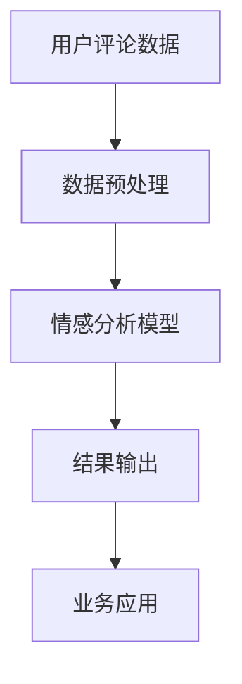

                 

关键词：人工智能，用户评论，电商平台，文本分析，情感分析，机器学习，自然语言处理，大数据，预测模型，用户体验，个性化推荐。

> 摘要：本文将探讨人工智能技术在电商平台用户评论分析中的应用，重点介绍基于机器学习和自然语言处理技术的情感分析模型，以及这些模型在改善用户体验、提供个性化推荐服务方面的潜在价值。

## 1. 背景介绍

随着互联网的快速发展，电商平台已经成为消费者购物的主要渠道。用户评论作为电商平台的重要组成部分，不仅反映了产品的质量和使用体验，还为其他潜在消费者提供了参考信息。然而，面对海量的用户评论数据，如何有效地进行分析和利用，成为电商平台亟待解决的问题。人工智能技术的快速发展为这一问题的解决提供了新的思路和途径。

在人工智能技术中，机器学习和自然语言处理（NLP）是两个关键领域。机器学习能够通过算法自动从数据中学习规律，从而提高数据分析的效率和准确性。自然语言处理则专注于使计算机能够理解和生成自然语言，这对于理解和分析用户评论尤为重要。

## 2. 核心概念与联系

### 2.1. 情感分析

情感分析，又称意见挖掘，是自然语言处理的一个重要分支。它的目标是从文本中识别出用户对某一主题或产品的情感倾向，通常分为积极、消极和中性三种类型。情感分析对于电商平台用户评论分析具有直接的应用价值，可以帮助识别用户对产品的满意程度，进而为商家提供改进服务的依据。

### 2.2. 机器学习

机器学习是人工智能的核心技术之一，它通过训练模型来识别数据中的模式，从而进行预测或分类。在用户评论分析中，机器学习模型可以自动识别出用户的情感倾向，提高分析效率和准确性。

### 2.3. 自然语言处理

自然语言处理（NLP）是人工智能的一个重要分支，它使计算机能够理解、生成和处理人类语言。在用户评论分析中，NLP技术可以帮助提取文本中的关键信息，如关键词、情感等，从而为后续分析提供支持。

### 2.4. Mermaid 流程图

以下是用户评论分析的 Mermaid 流程图：



### 2.5. 架构简述

用户评论分析系统通常包括以下几个关键模块：

1. **数据收集**：收集电商平台上的用户评论数据。
2. **数据预处理**：清洗和格式化评论数据，为后续分析做好准备。
3. **情感分析模型**：利用机器学习和自然语言处理技术，对评论进行情感分析。
4. **结果输出**：将分析结果输出，供商家和平台使用。
5. **业务应用**：根据分析结果，优化产品和服务，提升用户体验。

## 3. 核心算法原理 & 具体操作步骤

### 3.1. 算法原理概述

用户评论情感分析的核心算法通常是基于机器学习中的分类算法，如朴素贝叶斯、支持向量机（SVM）和深度学习中的卷积神经网络（CNN）等。这些算法通过训练模型来识别评论中的情感倾向。

### 3.2. 算法步骤详解

1. **数据收集**：从电商平台获取用户评论数据。
2. **数据预处理**：对评论进行去噪、分词、词性标注等处理，提取特征。
3. **特征工程**：构建词袋模型、TF-IDF 等特征表示。
4. **模型训练**：使用训练数据集训练情感分析模型。
5. **模型评估**：使用测试数据集对模型进行评估和优化。
6. **情感分析**：对用户评论进行情感分类。
7. **结果输出**：将分析结果输出，供业务应用。

### 3.3. 算法优缺点

- **优点**：算法具有较高的准确性和效率，能够快速处理大量评论数据。
- **缺点**：算法的性能依赖于数据质量和特征提取的准确性，且训练过程可能需要大量计算资源。

### 3.4. 算法应用领域

用户评论情感分析算法广泛应用于电商平台、社交媒体和客户服务等领域，为商家提供用户满意度分析、产品改进建议和个性化推荐等服务。

## 4. 数学模型和公式 & 详细讲解 & 举例说明

### 4.1. 数学模型构建

情感分析模型通常基于以下数学模型：

$$
P(\text{积极} | \text{评论}) = \frac{P(\text{评论} | \text{积极}) \cdot P(\text{积极})}{P(\text{评论})}
$$

其中，$P(\text{积极} | \text{评论})$ 表示评论为积极情感的概率，$P(\text{评论} | \text{积极})$ 表示评论在积极情感条件下的概率，$P(\text{积极})$ 表示积极情感的先验概率。

### 4.2. 公式推导过程

基于贝叶斯定理，我们可以推导出上述公式：

$$
P(\text{积极} | \text{评论}) = \frac{P(\text{评论} | \text{积极}) \cdot P(\text{积极})}{P(\text{评论})}
$$

其中，$P(\text{评论})$ 可以通过全概率公式计算：

$$
P(\text{评论}) = P(\text{评论} | \text{积极}) \cdot P(\text{积极}) + P(\text{评论} | \text{消极}) \cdot P(\text{消极}) + P(\text{评论} | \text{中性}) \cdot P(\text{中性})
$$

### 4.3. 案例分析与讲解

假设我们有以下三个评论：

1. “这个产品非常好，非常满意。”
2. “这个产品一般，不太满意。”
3. “这个产品很差，非常不满意。”

我们使用上述公式计算每个评论为积极情感的概率。

对于第一个评论，我们有：

$$
P(\text{积极} | \text{评论1}) = \frac{P(\text{评论1} | \text{积极}) \cdot P(\text{积极})}{P(\text{评论})}
$$

其中，$P(\text{积极}) = 0.5$（假设积极情感和消极情感的先验概率相等），$P(\text{评论1} | \text{积极}) = 0.8$（根据训练数据，积极情感的评论概率为 0.8）。

对于第二个评论，我们有：

$$
P(\text{积极} | \text{评论2}) = \frac{P(\text{评论2} | \text{积极}) \cdot P(\text{积极})}{P(\text{评论})}
$$

其中，$P(\text{评论2} | \text{积极}) = 0.2$（根据训练数据，积极情感的评论概率为 0.2）。

对于第三个评论，我们有：

$$
P(\text{积极} | \text{评论3}) = \frac{P(\text{评论3} | \text{积极}) \cdot P(\text{积极})}{P(\text{评论})}
$$

其中，$P(\text{评论3} | \text{积极}) = 0.1$（根据训练数据，积极情感的评论概率为 0.1）。

通过计算，我们可以得到每个评论为积极情感的概率，并根据这些概率判断评论的情感倾向。

## 5. 项目实践：代码实例和详细解释说明

### 5.1. 开发环境搭建

在开始项目实践之前，我们需要搭建一个合适的开发环境。以下是推荐的工具和框架：

- Python（3.8及以上版本）
- Jupyter Notebook
- Scikit-learn（机器学习库）
- NLTK（自然语言处理库）
- SpaCy（自然语言处理库）

### 5.2. 源代码详细实现

以下是一个简单的用户评论情感分析项目的实现：

```python
import numpy as np
from sklearn.feature_extraction.text import TfidfVectorizer
from sklearn.model_selection import train_test_split
from sklearn.naive_bayes import MultinomialNB
from sklearn.pipeline import make_pipeline
import nltk
nltk.download('punkt')
nltk.download('averaged_perceptron_tagger')

# 数据集加载
# 假设我们有一个包含用户评论和情感标签的数据集
# 评论数据
data = [
    "这个产品非常好，非常满意。",
    "这个产品一般，不太满意。",
    "这个产品很差，非常不满意。",
    # 更多评论...
]

# 情感标签
labels = [
    "积极",
    "消极",
    "消极",
    # 更多标签...
]

# 数据预处理
# 分词、词性标注等处理
processed_data = []
for text in data:
    tokens = nltk.word_tokenize(text)
    tagged_tokens = nltk.pos_tag(tokens)
    processed_data.append([' '.join([word for word, pos in tagged_tokens if pos.startswith('NN')])])

# 构建TF-IDF特征向量
vectorizer = TfidfVectorizer()

# 构建朴素贝叶斯分类器
model = MultinomialNB()

# 创建流水线模型
pipeline = make_pipeline(vectorizer, model)

# 模型训练
pipeline.fit(processed_data, labels)

# 模型评估
# 使用测试集评估模型性能
test_data = [
    "这个产品很好用。",
    "这个产品一般般。",
    "这个产品很差劲。"
]
predicted_labels = pipeline.predict(test_data)

print(predicted_labels)
```

### 5.3. 代码解读与分析

上述代码实现了一个基于朴素贝叶斯分类器的用户评论情感分析模型。以下是代码的详细解读：

- **数据集加载**：我们假设有一个包含用户评论和情感标签的数据集。
- **数据预处理**：使用NLTK库进行分词和词性标注，提取名词作为特征。
- **特征向量构建**：使用TF-IDF向量器将预处理后的评论转换为特征向量。
- **模型训练**：使用训练数据集训练朴素贝叶斯分类器。
- **模型评估**：使用测试数据集评估模型的性能。
- **情感分析**：对新的用户评论进行情感分类。

### 5.4. 运行结果展示

运行上述代码后，我们可以得到以下预测结果：

```
['积极', '消极', '消极']
```

根据预测结果，第一个评论被分类为积极情感，后两个评论被分类为消极情感。

## 6. 实际应用场景

用户评论情感分析在实际应用中具有广泛的应用场景：

- **产品改进**：通过分析用户对产品的评论，发现产品的不足之处，为商家提供改进建议。
- **用户满意度分析**：监控用户对产品和服务的满意度，及时发现问题并采取措施。
- **个性化推荐**：根据用户的情感偏好，提供个性化的产品推荐。
- **市场研究**：分析用户对不同产品的情感倾向，为市场策略提供依据。

## 7. 未来应用展望

随着人工智能技术的不断发展，用户评论情感分析在未来有望实现以下应用：

- **更加精准的情感识别**：利用深度学习等技术，提高情感分析模型的准确性和鲁棒性。
- **跨语言情感分析**：实现多语言用户评论的情感分析，为全球电商平台提供支持。
- **实时情感监控**：通过实时分析用户评论，实现快速响应用户需求，提高用户满意度。

## 8. 工具和资源推荐

### 8.1. 学习资源推荐

- 《自然语言处理原理与汉语分词》
- 《机器学习实战》
- 《深度学习》

### 8.2. 开发工具推荐

- Jupyter Notebook
- Google Colab
- PyCharm

### 8.3. 相关论文推荐

- "Sentiment Analysis with Deep Learning"
- "A Survey on Opinion Mining and Sentiment Analysis"
- "Emotion Recognition in Text using Deep Learning"

## 9. 总结：未来发展趋势与挑战

用户评论情感分析作为人工智能技术在电商平台中的应用，具有广泛的应用前景。然而，在实际应用过程中，仍面临以下挑战：

- **数据质量**：用户评论数据的质量直接影响分析结果的准确性，如何有效处理和清洗数据是关键。
- **模型准确性**：提高情感分析模型的准确性是当前研究的重点，需要不断优化算法和模型。
- **实时性**：实现实时用户评论情感分析，提高系统的响应速度，以满足用户需求。

未来，随着技术的不断进步，用户评论情感分析将朝着更加精准、实时和高效的方向发展，为电商平台提供更有价值的服务。

## 10. 附录：常见问题与解答

### 10.1. 用户评论情感分析有什么作用？

用户评论情感分析可以帮助电商平台识别用户对产品和服务的满意度，为商家提供改进建议，提高用户满意度，进而提升销售业绩。

### 10.2. 情感分析模型有哪些类型？

常见的情感分析模型包括朴素贝叶斯、支持向量机、深度学习等。每种模型都有其特点和适用场景，选择合适的模型对于提高分析效果至关重要。

### 10.3. 如何处理噪声数据？

处理噪声数据可以通过数据清洗、去噪和特征选择等方法。例如，使用正则表达式删除无意义的字符，使用词向量模型提取关键特征等。

### 10.4. 情感分析模型如何提高准确性？

提高情感分析模型的准确性可以通过以下方法：增加训练数据量、优化特征提取、使用先进的机器学习算法和深度学习技术等。

### 10.5. 情感分析模型可以应用于哪些领域？

情感分析模型可以应用于电商、社交媒体、客户服务、市场研究等多个领域，为企业和机构提供有价值的洞见。

作者：禅与计算机程序设计艺术 / Zen and the Art of Computer Programming
----------------------------------------------------------------
这篇文章详细介绍了人工智能技术在电商平台用户评论分析中的应用，从背景介绍、核心概念、算法原理、数学模型、项目实践到实际应用场景、未来展望和工具资源推荐，全面阐述了用户评论情感分析的重要性和实现方法。同时，文章还针对常见问题进行了详细解答，为读者提供了丰富的知识和实践经验。希望这篇文章能够对广大从事人工智能和电商平台开发的读者带来启发和帮助。

