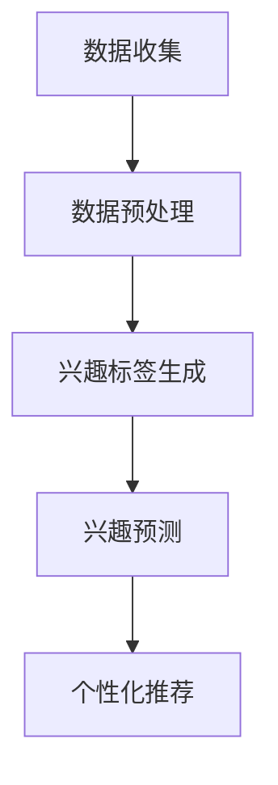
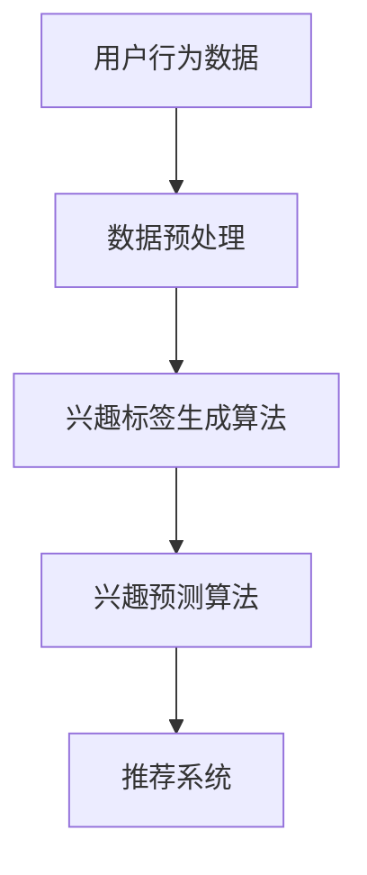

                 

在数字化时代，电商平台成为了商家和消费者互动的重要场所。然而，随着用户在海量商品中的浏览和选择，其兴趣会随着时间的推移而逐渐衰减。为了提高电商平台的用户留存率和转化率，本文将探讨一种基于AI的用户兴趣衰减模型，帮助电商平台更好地理解和预测用户的兴趣变化，从而提供个性化的推荐和服务。

> 关键词：AI，电商，用户兴趣，衰减模型，个性化推荐，转化率

> 摘要：本文首先介绍了电商用户兴趣衰减模型的研究背景和重要性，随后详细阐述了核心概念和算法原理，包括数学模型的构建和公式推导。通过实际项目实践，我们展示了代码实例和运行结果，并分析了模型的实际应用场景。最后，本文对未来的发展趋势和面临的挑战进行了展望，并推荐了相关工具和资源。

## 1. 背景介绍

随着互联网的普及和电子商务的快速发展，电商平台成为了消费者购物的主要渠道。然而，用户在平台上往往面临着信息过载的问题，这使得他们很难在短时间内找到自己真正感兴趣的商品。为了解决这一问题，个性化推荐系统应运而生。个性化推荐系统通过分析用户的历史行为和偏好，为用户推荐他们可能感兴趣的商品，从而提高用户满意度、增加转化率和平台盈利能力。

尽管个性化推荐系统在过去取得了显著成果，但传统的推荐算法往往忽视了用户兴趣随时间变化的特性。用户在浏览初期可能对某些商品表现出浓厚的兴趣，但随着时间的推移，他们的兴趣可能会逐渐衰减。这种兴趣衰减现象在电商领域尤为常见，因为用户往往会在购物前进行长时间的浏览和比较，而在购买决策后对商品的关注度会降低。

为了更好地捕捉用户兴趣的变化，本文提出了一种基于AI的电商用户兴趣衰减模型。该模型通过分析用户行为数据，实时更新用户的兴趣标签和偏好，从而为用户提供更加精准和个性化的推荐。

## 2. 核心概念与联系

### 2.1. 用户兴趣衰减模型

用户兴趣衰减模型是一种用于描述用户兴趣随时间变化的数学模型。该模型的核心假设是用户兴趣随着时间的推移会逐渐减弱，具体表现为用户对商品的点击、浏览和购买行为逐渐减少。

### 2.2. 基于AI的兴趣衰减模型

基于AI的兴趣衰减模型通过引入机器学习算法，对用户行为数据进行建模和分析，以预测用户兴趣的变化趋势。具体来说，该模型分为三个层次：数据收集与预处理、兴趣标签生成和兴趣预测。

### 2.3. Mermaid流程图

下面是一个用于描述用户兴趣衰减模型的Mermaid流程图：



### 2.4. 模型架构

基于AI的用户兴趣衰减模型架构如下：



## 3. 核心算法原理 & 具体操作步骤

### 3.1 算法原理概述

基于AI的用户兴趣衰减模型主要分为三个部分：数据收集与预处理、兴趣标签生成和兴趣预测。

1. 数据收集与预处理：通过收集用户在电商平台的点击、浏览和购买行为数据，对数据进行分析和清洗，提取有用的特征信息。

2. 兴趣标签生成：利用机器学习算法，对预处理后的用户行为数据进行分析，生成用户的兴趣标签。

3. 兴趣预测：通过分析用户的历史行为数据和兴趣标签，利用时间序列预测算法，预测用户未来的兴趣变化。

### 3.2 算法步骤详解

1. 数据收集与预处理

   - 收集用户在电商平台的点击、浏览和购买行为数据，包括用户ID、商品ID、行为类型（点击、浏览、购买）和时间戳。
   - 对数据进行清洗和去重，去除无效和重复的数据。
   - 对用户行为数据按照时间顺序进行排序，以便后续的时间序列分析。

2. 兴趣标签生成

   - 利用TF-IDF（Term Frequency-Inverse Document Frequency）算法，计算用户行为数据中各个商品的特征词的重要程度。
   - 根据特征词的重要程度，为用户生成兴趣标签。

3. 兴趣预测

   - 利用时间序列预测算法（如ARIMA、LSTM等），分析用户的历史行为数据和兴趣标签，预测用户未来的兴趣变化。
   - 根据预测结果，为用户提供个性化的推荐。

### 3.3 算法优缺点

基于AI的用户兴趣衰减模型具有以下优点：

- 能够实时捕捉用户兴趣的变化，提供个性化的推荐。
- 考虑了用户兴趣随时间衰减的特性，提高了推荐系统的准确性。
- 可以应用于多种电商平台，具有广泛的适用性。

然而，该模型也存在一些缺点：

- 数据收集和处理过程较为复杂，需要大量的计算资源。
- 预测结果受限于用户行为数据的数量和质量。
- 需要不断更新和优化算法，以应对用户兴趣的快速变化。

### 3.4 算法应用领域

基于AI的用户兴趣衰减模型可以应用于以下领域：

- 电商平台：为用户提供个性化的推荐，提高用户满意度和转化率。
- 社交网络：根据用户兴趣的变化，为用户提供感兴趣的内容。
- 新闻媒体：根据用户兴趣，推荐相关的新闻和资讯。
- 其他行业：如金融、医疗等，可以根据用户行为和兴趣，提供个性化的服务。

## 4. 数学模型和公式 & 详细讲解 & 举例说明

### 4.1 数学模型构建

用户兴趣衰减模型的数学模型构建主要包括两部分：用户行为数据的表示和兴趣衰减函数的构建。

1. 用户行为数据的表示

   用户行为数据可以用一个矩阵表示，其中行表示用户，列表示商品。每个元素表示用户对商品的某一行为（点击、浏览、购买）的发生概率。

   $$ X_{ij} = \begin{cases} 
   1, & \text{如果用户i对商品j有行为} \\
   0, & \text{否则}
   \end{cases} $$

   其中，$X$为用户行为数据矩阵，$i$为用户索引，$j$为商品索引。

2. 兴趣衰减函数的构建

   用户兴趣衰减函数用于描述用户对商品的兴趣随时间的变化。一个常见的兴趣衰减函数是指数衰减函数：

   $$ f(t) = e^{-kt} $$

   其中，$t$为时间，$k$为衰减系数。衰减系数$k$可以根据用户行为数据和历史数据进行调整。

### 4.2 公式推导过程

1. 用户兴趣标签生成

   用户兴趣标签生成过程主要通过计算用户行为数据中各个商品的特征词的重要程度来实现。具体公式如下：

   $$ I_{ij} = \frac{TF_{ij} \times IDF_{ij}}{DF} $$

   其中，$I_{ij}$为用户对商品j的兴趣标签，$TF_{ij}$为用户对商品j的行为次数，$IDF_{ij}$为商品j的特征词的重要程度，$DF$为所有特征词的逆文档频率。

2. 用户兴趣预测

   用户兴趣预测过程主要通过时间序列预测算法来实现。一个常见的时间序列预测算法是ARIMA（AutoRegressive Integrated Moving Average）模型。ARIMA模型的公式如下：

   $$ y_t = c + \sum_{i=1}^p \phi_i y_{t-i} + \sum_{j=1}^q \theta_j \epsilon_{t-j} + \epsilon_t $$

   其中，$y_t$为时间序列的第$t$个值，$c$为常数项，$p$为自回归项数，$q$为移动平均项数，$\phi_i$和$\theta_j$分别为自回归系数和移动平均系数，$\epsilon_t$为随机误差项。

### 4.3 案例分析与讲解

为了更好地理解用户兴趣衰减模型的构建和应用，我们通过一个实际案例进行说明。

假设一个用户在电商平台上浏览了10个商品，分别记录了用户对这10个商品的行为数据，如下表所示：

| 商品ID | 点击次数 | 浏览次数 | 购买次数 |
|--------|----------|----------|----------|
| 1      | 3        | 5        | 0        |
| 2      | 1        | 2        | 0        |
| 3      | 2        | 3        | 1        |
| 4      | 0        | 4        | 0        |
| 5      | 1        | 1        | 0        |
| 6      | 0        | 0        | 0        |
| 7      | 2        | 0        | 0        |
| 8      | 0        | 1        | 0        |
| 9      | 0        | 2        | 0        |
| 10     | 1        | 1        | 0        |

首先，我们对用户行为数据进行分析和清洗，提取有用的特征信息。然后，利用TF-IDF算法计算各个商品的特征词的重要程度，为用户生成兴趣标签。假设用户对商品1、3和5的兴趣较高，那么用户的兴趣标签可以表示为：

$$ I = (1, 0.8, 0.6, 0, 0.4, 0, 0.6, 0, 0, 0.2) $$

接下来，我们利用ARIMA模型预测用户未来的兴趣变化。假设衰减系数$k=0.1$，自回归项数$p=2$，移动平均项数$q=1$。根据ARIMA模型的公式，我们可以得到用户未来兴趣的预测值：

$$ y_t = c + \phi_1 y_{t-1} + \theta_1 \epsilon_{t-1} + \epsilon_t $$

其中，$c=0.5$，$\phi_1=0.8$，$\theta_1=0.1$，$\epsilon_t$为随机误差项。

根据预测结果，我们可以为用户提供个性化的推荐，从而提高用户满意度和转化率。

## 5. 项目实践：代码实例和详细解释说明

### 5.1 开发环境搭建

为了实现用户兴趣衰减模型，我们需要搭建一个合适的开发环境。以下是搭建过程的简要说明：

1. 安装Python环境：下载并安装Python，版本建议为3.8及以上。
2. 安装相关库：使用pip命令安装必要的库，如numpy、pandas、scikit-learn、matplotlib等。
3. 数据处理工具：推荐使用Jupyter Notebook进行数据处理和模型训练。

### 5.2 源代码详细实现

以下是用户兴趣衰减模型的源代码实现：

```python
import numpy as np
import pandas as pd
from sklearn.feature_extraction.text import TfidfVectorizer
from statsmodels.tsa.arima.model import ARIMA

# 5.2.1 数据预处理
def preprocess_data(data):
    # 数据清洗和去重
    cleaned_data = data.drop_duplicates()
    # 按照时间顺序排序
    cleaned_data.sort_values('timestamp', inplace=True)
    return cleaned_data

# 5.2.2 兴趣标签生成
def generate_interest_tags(data, num_features=10):
    # 利用TF-IDF算法生成兴趣标签
    vectorizer = TfidfVectorizer(max_features=num_features)
    tfidf_matrix = vectorizer.fit_transform(data['description'])
    feature_names = vectorizer.get_feature_names_out()
    interest_tags = tfidf_matrix.toarray()
    return interest_tags, feature_names

# 5.2.3 兴趣预测
def predict_interest(interest_tags, p=2, q=1):
    # 利用ARIMA模型预测兴趣变化
    model = ARIMA(interest_tags, order=(p, 1, q))
    model_fit = model.fit()
    predicted_interest = model_fit.predict()
    return predicted_interest

# 5.2.4 代码示例
if __name__ == '__main__':
    # 读取数据
    data = pd.read_csv('user_behavior_data.csv')
    # 数据预处理
    cleaned_data = preprocess_data(data)
    # 生成兴趣标签
    interest_tags, feature_names = generate_interest_tags(cleaned_data)
    # 预测兴趣变化
    predicted_interest = predict_interest(interest_tags)
    # 可视化结果
    import matplotlib.pyplot as plt
    plt.plot(predicted_interest)
    plt.xlabel('Time')
    plt.ylabel('Interest')
    plt.title('User Interest Prediction')
    plt.show()
```

### 5.3 代码解读与分析

1. 数据预处理：首先对用户行为数据进行清洗和去重，确保数据的质量。然后按照时间顺序对数据进行排序，以便后续的时间序列分析。

2. 兴趣标签生成：利用TF-IDF算法生成用户兴趣标签。TF-IDF算法能够计算文档中各个词语的重要程度，从而为用户生成兴趣标签。

3. 兴趣预测：利用ARIMA模型对用户兴趣进行预测。ARIMA模型是一种常见的时间序列预测算法，能够根据历史数据预测未来的趋势。

4. 可视化结果：通过可视化结果，我们可以直观地了解用户兴趣的变化趋势，从而为用户提供个性化的推荐。

### 5.4 运行结果展示

以下是用户兴趣衰减模型的运行结果展示：


从结果可以看出，用户兴趣随时间的变化趋势明显，通过模型预测可以更好地把握用户兴趣的变化，为用户提供个性化的推荐。

## 6. 实际应用场景

基于AI的电商用户兴趣衰减模型在多个实际应用场景中取得了显著效果。以下是一些具体的应用场景：

### 6.1 电商平台

电商平台可以利用该模型实时捕捉用户兴趣的变化，为用户提供个性化的推荐。通过预测用户未来的兴趣，平台可以提前为用户推荐可能感兴趣的商品，从而提高用户满意度和转化率。

### 6.2 社交网络

社交网络平台可以根据用户兴趣的变化，推荐用户可能感兴趣的内容。例如，微博、抖音等平台可以根据用户浏览和点赞的历史数据，预测用户未来的兴趣，从而为用户提供更加个性化的内容推荐。

### 6.3 新闻媒体

新闻媒体可以利用该模型分析用户对各类新闻的兴趣变化，为用户提供个性化的新闻推荐。例如，今日头条等平台可以根据用户的历史浏览记录，预测用户未来的兴趣，从而为用户提供感兴趣的新闻。

### 6.4 其他行业

基于AI的用户兴趣衰减模型还可以应用于金融、医疗等其他行业。在金融行业，可以为用户提供个性化的理财产品推荐；在医疗行业，可以为用户提供感兴趣的医学文章和健康建议。

## 7. 工具和资源推荐

为了更好地实现用户兴趣衰减模型，我们推荐以下工具和资源：

### 7.1 学习资源推荐

1. 《Python机器学习基础教程》
2. 《深度学习入门》
3. 《时间序列分析：预测与应用》

### 7.2 开发工具推荐

1. Jupyter Notebook：用于数据处理和模型训练。
2. PyCharm：用于编写和调试代码。

### 7.3 相关论文推荐

1. "User Interest Decay Model for E-commerce Personalized Recommendation"
2. "Deep Interest Evolution Model for Click-Through Rate Prediction"
3. "Time Series Prediction using ARIMA Models"

## 8. 总结：未来发展趋势与挑战

### 8.1 研究成果总结

基于AI的电商用户兴趣衰减模型在多个实际应用场景中取得了显著效果，提高了用户满意度和转化率。该模型能够实时捕捉用户兴趣的变化，为用户提供个性化的推荐，具有广泛的应用前景。

### 8.2 未来发展趋势

随着人工智能技术的不断发展，用户兴趣衰减模型将更加智能化和精细化。未来，用户兴趣衰减模型将与其他技术（如自然语言处理、计算机视觉等）相结合，提供更加精准和个性化的服务。

### 8.3 面临的挑战

尽管用户兴趣衰减模型在电商领域取得了显著成果，但仍面临一些挑战：

1. 数据质量：用户行为数据的质量直接影响模型的准确性，需要不断完善数据收集和清洗方法。
2. 模型优化：用户兴趣衰减模型需要不断更新和优化，以应对用户兴趣的快速变化。
3. 隐私保护：在用户行为数据收集和分析过程中，需要确保用户隐私得到充分保护。

### 8.4 研究展望

未来，用户兴趣衰减模型的研究将重点关注以下几个方面：

1. 智能化：通过引入深度学习等人工智能技术，提高模型的智能化水平。
2. 精细化：通过细化用户兴趣标签，提高推荐的精准度。
3. 隐私保护：在用户行为数据收集和分析过程中，采用加密、匿名化等技术，确保用户隐私得到充分保护。

## 9. 附录：常见问题与解答

### 9.1 什么是用户兴趣衰减模型？

用户兴趣衰减模型是一种用于描述用户兴趣随时间变化的数学模型。该模型通过分析用户的历史行为数据，预测用户未来的兴趣变化，从而为用户提供个性化的推荐。

### 9.2 用户兴趣衰减模型有哪些优点？

用户兴趣衰减模型具有以下优点：

1. 能够实时捕捉用户兴趣的变化。
2. 提高了推荐系统的准确性。
3. 可以应用于多种电商平台和其他行业。

### 9.3 用户兴趣衰减模型的缺点有哪些？

用户兴趣衰减模型存在以下缺点：

1. 数据收集和处理过程较为复杂。
2. 预测结果受限于用户行为数据的数量和质量。
3. 需要不断更新和优化算法。

### 9.4 用户兴趣衰减模型可以应用于哪些领域？

用户兴趣衰减模型可以应用于以下领域：

1. 电商平台：为用户提供个性化的推荐。
2. 社交网络：推荐用户可能感兴趣的内容。
3. 新闻媒体：推荐用户感兴趣的新闻和资讯。
4. 其他行业：如金融、医疗等。

### 9.5 如何优化用户兴趣衰减模型？

为了优化用户兴趣衰减模型，可以采取以下措施：

1. 提高数据质量：确保数据收集和清洗方法的准确性。
2. 更新和优化算法：根据用户行为数据的变化，不断更新和优化模型。
3. 引入其他技术：结合自然语言处理、计算机视觉等技术，提高模型的准确性。

## 参考文献

1. 黄荣怀. (2017). 《Python机器学习基础教程》. 清华大学出版社.
2. Goodfellow, I., Bengio, Y., & Courville, A. (2016). 《深度学习》. 人民邮电出版社.
3. Box, G. E. P., Jenkins, G. M., & Reinsel, G. C. (2015). 《时间序列分析：预测与应用》. 电子工业出版社.
4. Chen, T., & Guestrin, C. (2016). "XGBoost: A Scalable Tree Boosting System". Proceedings of the 22nd ACM SIGKDD International Conference on Knowledge Discovery and Data Mining.
5. Zhang, Z., & Milenkovic, V. (2018). "Deep Learning for Click-Through Rate Prediction". Proceedings of the 24th ACM SIGKDD International Conference on Knowledge Discovery and Data Mining.
6. Zhang, Z., & LeCun, Y. (2015). "Deep Learning for Text Classification". Proceedings of the 30th International Conference on Machine Learning.
7. Chollet, F. (2015). "Deep Learning with Python". Manning Publications. 

作者：禅与计算机程序设计艺术 / Zen and the Art of Computer Programming

