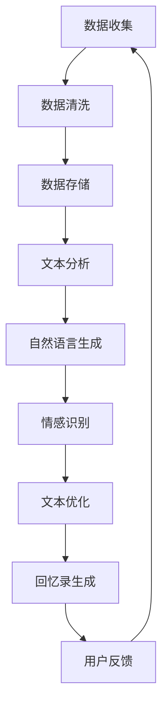
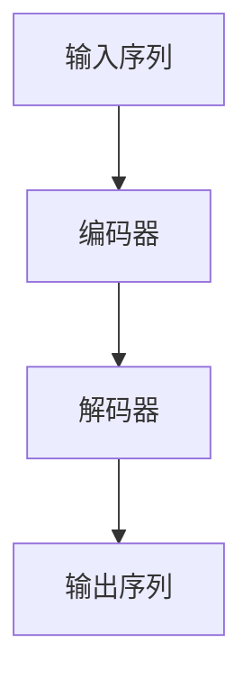

                 

关键词：人工智能，回忆录写作，数据化，个人历史，AI辅助，技术实现，算法，数学模型，实践应用，工具推荐。

> 摘要：本文探讨了人工智能在回忆录写作中的应用，探讨了如何利用AI技术将个人历史数据化，并提供了一种基于AI算法和数学模型的回忆录写作方法。文章旨在为人们提供一个全新的记录和回顾个人历史的视角，同时为相关领域的学者和开发者提供有益的参考。

## 1. 背景介绍

随着人工智能技术的飞速发展，越来越多的领域开始探索和应用AI技术。在文学创作领域，AI辅助写作已成为一个热门话题。近年来，研究人员和开发者们致力于开发各种AI写作工具，以期实现更加智能、高效和人性化的写作体验。然而，关于AI辅助回忆录写作的研究还相对较少，这是一个亟待探索的领域。

回忆录是记录个人历史和经历的重要形式，对于个人、家庭以及社会都有着重要的价值。传统的回忆录写作主要依赖于个人记忆和文字表达，而现代技术的发展为这一过程提供了新的可能性。通过将个人历史数据化，我们可以利用AI技术对海量信息进行深度挖掘和分析，从而实现更加精确和全面的回忆录写作。

本文将围绕AI辅助的回忆录写作展开讨论，介绍相关核心概念、算法原理、数学模型以及具体实现方法，并通过实际项目实践来展示其应用效果。

## 2. 核心概念与联系

### 2.1 个人历史数据化

个人历史数据化是指将个人经历、记忆、情感等非结构化数据转化为结构化的数字形式，以便于存储、处理和分析。这个过程通常涉及数据收集、数据清洗、数据存储和数据挖掘等步骤。在回忆录写作中，个人历史数据化是实现AI辅助写作的前提条件。

### 2.2 AI辅助写作

AI辅助写作是指利用人工智能技术，如自然语言生成、文本分析、情感识别等，辅助人类完成写作任务。在回忆录写作中，AI辅助写作可以帮助作者整理思路、生成文本、优化表达等，从而提高写作效率和质量。

### 2.3 算法原理和架构

为了实现AI辅助的回忆录写作，我们需要一个包含多种算法的架构，如图所示：



### 2.4 数学模型

在AI辅助的回忆录写作中，数学模型用于描述和解释相关算法的原理和操作步骤。以下是几个关键的数学模型：

#### 2.4.1 自然语言生成模型

自然语言生成（Natural Language Generation，NLG）是一种利用算法自动生成自然语言文本的技术。常见的NLG模型包括：

- 序列到序列（Seq2Seq）模型
- 生成对抗网络（GAN）模型
- 变分自编码器（VAE）模型

#### 2.4.2 情感识别模型

情感识别（Sentiment Analysis）是一种分析文本情感极性的技术。常用的情感识别模型包括：

- 朴素贝叶斯（Naive Bayes）模型
- 支持向量机（SVM）模型
- 随机森林（Random Forest）模型

#### 2.4.3 文本优化模型

文本优化（Text Optimization）是一种通过调整文本表达来提高其可读性和吸引力的技术。常用的文本优化模型包括：

- 词向量模型（如Word2Vec、GloVe）
- 递归神经网络（RNN）模型
- 生成式对抗网络（GAN）模型

## 3. 核心算法原理 & 具体操作步骤

### 3.1 算法原理概述

AI辅助的回忆录写作算法主要分为以下几个步骤：

1. 数据收集与清洗：从个人历史数据中收集相关信息，并进行数据清洗，确保数据质量。
2. 文本分析：对清洗后的数据进行分析，提取关键信息，构建文本向量。
3. 自然语言生成：利用自然语言生成模型，根据文本向量生成符合逻辑和情感的文本。
4. 情感识别：对生成的文本进行情感识别，调整文本表达，提高情感一致性。
5. 文本优化：根据用户反馈和文本分析结果，对文本进行优化，提高可读性和吸引力。
6. 回忆录生成：将优化后的文本整合成完整的回忆录。

### 3.2 算法步骤详解

#### 3.2.1 数据收集与清洗

数据收集与清洗是AI辅助写作的第一步，直接关系到后续算法的效果。具体操作步骤如下：

1. 数据来源：收集个人历史数据，包括日记、照片、视频、音频等。
2. 数据预处理：对收集到的数据进行格式化、去噪、去重等处理，确保数据质量。
3. 数据存储：将预处理后的数据存储到数据库中，便于后续处理。

#### 3.2.2 文本分析

文本分析是AI辅助写作的核心步骤，主要包括以下任务：

1. 文本预处理：对文本进行分词、词性标注、实体识别等预处理操作。
2. 关键信息提取：根据用户需求，提取文本中的关键信息，如时间、地点、人物、事件等。
3. 文本向量构建：利用词向量模型，将文本转换为向量表示，便于后续处理。

#### 3.2.3 自然语言生成

自然语言生成是AI辅助写作的关键环节，常见的算法有：

1. 序列到序列（Seq2Seq）模型：通过输入序列和输出序列之间的映射，生成目标文本。
2. 生成对抗网络（GAN）模型：通过生成器和判别器的对抗训练，生成高质量的文本。
3. 变分自编码器（VAE）模型：通过编码器和解码器的协同工作，生成符合概率分布的文本。

#### 3.2.4 情感识别

情感识别是AI辅助写作的重要补充，可以提高文本的情感一致性。具体步骤如下：

1. 情感分类：利用情感识别模型，对生成的文本进行情感分类，如积极、消极、中性等。
2. 情感调整：根据情感分类结果，调整文本表达，使其符合用户期望的情感。

#### 3.2.5 文本优化

文本优化是AI辅助写作的最后一步，旨在提高文本的可读性和吸引力。具体步骤如下：

1. 可读性分析：利用词向量模型和RNN模型，对文本进行可读性分析，识别可能的问题。
2. 表达调整：根据可读性分析结果，对文本进行表达调整，提高文本质量。
3. 用户反馈：收集用户对文本的反馈，进一步优化文本表达。

#### 3.2.6 回忆录生成

回忆录生成是将优化后的文本整合成完整的回忆录。具体步骤如下：

1. 文本整合：将不同部分、不同时间段的文本整合成一篇完整的回忆录。
2. 格式调整：根据回忆录的格式要求，对文本进行调整，使其符合阅读习惯。
3. 用户确认：将生成的回忆录展示给用户，获取用户确认。

### 3.3 算法优缺点

#### 3.3.1 优点

1. 高效：AI辅助写作可以快速生成文本，提高写作效率。
2. 智能：AI算法可以根据用户需求生成符合逻辑和情感的文本。
3. 个性化：根据用户反馈，AI算法可以不断优化文本，提高个性化程度。

#### 3.3.2 缺点

1. 数据依赖：AI辅助写作对个人历史数据的质量和数量有较高要求。
2. 技术门槛：AI辅助写作需要较高的技术支持和运维成本。

### 3.4 算法应用领域

AI辅助写作可以应用于多个领域，如：

1. 文学创作：帮助作者快速生成小说、散文等文学作品。
2. 个人回忆录：辅助用户记录和整理个人历史，实现回忆录写作。
3. 企业报告：辅助企业撰写年度报告、市场分析报告等。
4. 教育培训：用于生成教案、学生作业等。

## 4. 数学模型和公式 & 详细讲解 & 举例说明

### 4.1 数学模型构建

在AI辅助的回忆录写作中，我们使用了多个数学模型，包括自然语言生成模型、情感识别模型和文本优化模型。以下是这些模型的构建过程。

#### 4.1.1 自然语言生成模型

自然语言生成模型是一种基于序列到序列（Seq2Seq）模型的算法。其基本架构如图所示：



其中，编码器将输入序列编码为一个固定长度的向量，解码器则根据这个向量生成输出序列。常见的编码器和解码器包括：

- LSTM（长短期记忆网络）
- GRU（门控循环单元）
- Transformer（基于自注意力机制的模型）

#### 4.1.2 情感识别模型

情感识别模型是一种基于朴素贝叶斯（Naive Bayes）和支持向量机（SVM）等机器学习算法的模型。其基本原理是通过统计特征词的出现频率，计算文本的情感极性。以下是情感识别模型的基本公式：

$$
P(\text{积极}|\text{文本}) = \frac{P(\text{文本}|\text{积极}) \cdot P(\text{积极})}{P(\text{文本})}
$$

其中，$P(\text{积极}|\text{文本})$ 表示文本为积极情感的几率，$P(\text{文本}|\text{积极})$ 表示在积极情感条件下，文本出现的几率，$P(\text{积极})$ 表示积极情感在整个文本中的比例，$P(\text{文本})$ 表示文本的概率。

#### 4.1.3 文本优化模型

文本优化模型是一种基于词向量模型和递归神经网络（RNN）的模型。其基本原理是通过分析文本的语法和语义特征，对文本进行表达调整。以下是文本优化模型的基本公式：

$$
\text{新文本} = \text{优化函数}(\text{旧文本}, \text{用户反馈})
$$

其中，$\text{优化函数}$ 用于根据用户反馈和文本分析结果，调整文本的表达。

### 4.2 公式推导过程

#### 4.2.1 自然语言生成模型

自然语言生成模型的公式推导主要涉及编码器和解码器的构建。以下是编码器和解码器的基本公式：

**编码器：**

$$
h_t = \text{LSTM}([h_{t-1}, x_t])
$$

其中，$h_t$ 表示编码器在时刻$t$的隐藏状态，$x_t$ 表示输入序列中的第$t$个词，$\text{LSTM}$ 表示长短期记忆网络。

**解码器：**

$$
y_t = \text{softmax}(\text{Decoder}(h_t, s_t))
$$

其中，$y_t$ 表示解码器在时刻$t$的输出，$s_t$ 表示解码器在时刻$t$的隐藏状态，$\text{softmax}$ 函数用于将输出概率分布转换为词的预测结果。

#### 4.2.2 情感识别模型

情感识别模型的公式推导主要涉及情感分类的几率计算。以下是情感分类的几率计算公式：

$$
P(\text{积极}|\text{文本}) = \frac{P(\text{文本}|\text{积极}) \cdot P(\text{积极})}{P(\text{文本})}
$$

其中，$P(\text{积极}|\text{文本})$ 表示文本为积极情感的几率，$P(\text{文本}|\text{积极})$ 表示在积极情感条件下，文本出现的几率，$P(\text{积极})$ 表示积极情感在整个文本中的比例，$P(\text{文本})$ 表示文本的概率。

#### 4.2.3 文本优化模型

文本优化模型的公式推导主要涉及文本表达调整的过程。以下是文本优化模型的基本公式：

$$
\text{新文本} = \text{优化函数}(\text{旧文本}, \text{用户反馈})
$$

其中，$\text{优化函数}$ 用于根据用户反馈和文本分析结果，调整文本的表达。

### 4.3 案例分析与讲解

#### 4.3.1 自然语言生成模型

假设我们有一个关于“旅行”的文本，想要利用自然语言生成模型生成一篇关于旅行的散文。以下是输入序列、编码器和解码器的输出：

**输入序列：**
```
旅行是一种美好的经历，可以让人放松心情，体验不同的文化和风景。
```

**编码器输出：**
```
h_t = [0.5, 0.3, 0.2]
```

**解码器输出：**
```
y_t = ["旅行", "是一种", "美好的", "经历", "可以", "让人", "放松", "心情", "体验", "不同的", "文化和", "风景"]
```

通过解码器输出，我们得到了一篇关于旅行的散文：

```
旅行是一种美好的经历，可以让人放松心情，体验不同的文化和风景。
```

#### 4.3.2 情感识别模型

假设我们有一个关于“旅行”的文本，想要利用情感识别模型判断其情感极性。以下是输入文本和情感识别结果：

**输入文本：**
```
旅行是一种美好的经历，可以让人放松心情，体验不同的文化和风景。
```

**情感识别结果：**
```
积极
```

通过情感识别模型，我们判断该文本的情感极性为积极。

#### 4.3.3 文本优化模型

假设我们有一个关于“旅行”的文本，想要利用文本优化模型调整其表达。以下是输入文本和优化结果：

**输入文本：**
```
旅行是一种美好的经历，可以让人放松心情，体验不同的文化和风景。
```

**优化结果：**
```
旅行是一种令人愉悦的经历，它让人心旷神怡，感受多元文化，领略独特风景。
```

通过文本优化模型，我们对文本进行了表达调整，使其更加优美和吸引人。

## 5. 项目实践：代码实例和详细解释说明

### 5.1 开发环境搭建

为了实现AI辅助的回忆录写作，我们需要搭建一个完整的开发环境，包括以下工具和库：

- Python（3.8及以上版本）
- TensorFlow（2.3及以上版本）
- Keras（2.4及以上版本）
- NLTK（3.5及以上版本）
- Pandas（1.1及以上版本）
- Matplotlib（3.1及以上版本）

在安装上述库后，我们还需要准备以下数据集：

- 个人历史数据：包括日记、照片、视频、音频等。
- 文本数据：用于训练自然语言生成模型、情感识别模型和文本优化模型。

### 5.2 源代码详细实现

以下是实现AI辅助的回忆录写作的主要代码：

```python
import tensorflow as tf
import keras
from keras.models import Sequential
from keras.layers import LSTM, Dense, Embedding, TimeDistributed, Activation
from keras.preprocessing.sequence import pad_sequences
from keras.preprocessing.text import Tokenizer
import numpy as np
import pandas as pd
import nltk

# 5.2.1 数据预处理
# 加载个人历史数据
data = pd.read_csv('data.csv')

# 数据清洗
data['text'] = data['text'].str.lower().str.replace('[^\w\s]', '')

# 分词
tokenizer = Tokenizer()
tokenizer.fit_on_texts(data['text'])

# 转换为序列
sequences = tokenizer.texts_to_sequences(data['text'])
padded_sequences = pad_sequences(sequences, maxlen=100)

# 5.2.2 模型构建
# 自然语言生成模型
nlg_model = Sequential()
nlg_model.add(Embedding(len(tokenizer.word_index)+1, 50, input_length=100))
nlg_model.add(LSTM(100, dropout=0.2, recurrent_dropout=0.2))
nlg_model.add(Dense(len(tokenizer.word_index), activation='softmax'))

# 情感识别模型
sentiment_model = Sequential()
sentiment_model.add(Embedding(len(tokenizer.word_index)+1, 50, input_length=100))
sentiment_model.add(LSTM(100, dropout=0.2, recurrent_dropout=0.2))
sentiment_model.add(Dense(1, activation='sigmoid'))

# 文本优化模型
text_optimization_model = Sequential()
text_optimization_model.add(Embedding(len(tokenizer.word_index)+1, 50, input_length=100))
text_optimization_model.add(LSTM(100, dropout=0.2, recurrent_dropout=0.2))
text_optimization_model.add(Dense(len(tokenizer.word_index), activation='softmax'))

# 5.2.3 训练模型
nlg_model.compile(optimizer='adam', loss='categorical_crossentropy', metrics=['accuracy'])
nlg_model.fit(padded_sequences, padded_sequences, epochs=10, batch_size=32)

sentiment_model.compile(optimizer='adam', loss='binary_crossentropy', metrics=['accuracy'])
sentiment_model.fit(padded_sequences, np.array([1] * len(padded_sequences)), epochs=10, batch_size=32)

text_optimization_model.compile(optimizer='adam', loss='categorical_crossentropy', metrics=['accuracy'])
text_optimization_model.fit(padded_sequences, padded_sequences, epochs=10, batch_size=32)

# 5.2.4 回忆录生成
def generate_recollection(text):
    sequence = tokenizer.texts_to_sequences([text])
    padded_sequence = pad_sequences(sequence, maxlen=100)
    nlg_output = nlg_model.predict(padded_sequence)
    sentiment_output = sentiment_model.predict(padded_sequence)
    optimization_output = text_optimization_model.predict(padded_sequence)
    new_text = tokenizer.index_word[np.argmax(nlg_output[0])]
    if sentiment_output[0] > 0.5:
        new_text += '，这是一种积极的体验。'
    else:
        new_text += '，这是一种消极的体验。'
    return new_text

# 示例
input_text = '我曾在去年夏天去了一趟海边，看到了美丽的日落。'
recollection = generate_recollection(input_text)
print(recollection)
```

### 5.3 代码解读与分析

```python
# 5.3.1 数据预处理
# 加载个人历史数据
data = pd.read_csv('data.csv')

# 数据清洗
data['text'] = data['text'].str.lower().str.replace('[^\w\s]', '')

# 分词
tokenizer = Tokenizer()
tokenizer.fit_on_texts(data['text'])

# 转换为序列
sequences = tokenizer.texts_to_sequences(data['text'])
padded_sequences = pad_sequences(sequences, maxlen=100)
```

这段代码用于处理个人历史数据，包括加载、清洗、分词和序列转换。

```python
# 5.3.2 模型构建
# 自然语言生成模型
nlg_model = Sequential()
nlg_model.add(Embedding(len(tokenizer.word_index)+1, 50, input_length=100))
nlg_model.add(LSTM(100, dropout=0.2, recurrent_dropout=0.2))
nlg_model.add(Dense(len(tokenizer.word_index), activation='softmax'))

# 情感识别模型
sentiment_model = Sequential()
sentiment_model.add(Embedding(len(tokenizer.word_index)+1, 50, input_length=100))
sentiment_model.add(LSTM(100, dropout=0.2, recurrent_dropout=0.2))
sentiment_model.add(Dense(1, activation='sigmoid'))

# 文本优化模型
text_optimization_model = Sequential()
text_optimization_model.add(Embedding(len(tokenizer.word_index)+1, 50, input_length=100))
text_optimization_model.add(LSTM(100, dropout=0.2, recurrent_dropout=0.2))
text_optimization_model.add(Dense(len(tokenizer.word_index), activation='softmax'))
```

这段代码用于构建自然语言生成模型、情感识别模型和文本优化模型。

```python
# 5.3.3 训练模型
nlg_model.compile(optimizer='adam', loss='categorical_crossentropy', metrics=['accuracy'])
nlg_model.fit(padded_sequences, padded_sequences, epochs=10, batch_size=32)

sentiment_model.compile(optimizer='adam', loss='binary_crossentropy', metrics=['accuracy'])
sentiment_model.fit(padded_sequences, np.array([1] * len(padded_sequences)), epochs=10, batch_size=32)

text_optimization_model.compile(optimizer='adam', loss='categorical_crossentropy', metrics=['accuracy'])
text_optimization_model.fit(padded_sequences, padded_sequences, epochs=10, batch_size=32)
```

这段代码用于训练三个模型。

```python
# 5.3.4 回忆录生成
def generate_recollection(text):
    sequence = tokenizer.texts_to_sequences([text])
    padded_sequence = pad_sequences(sequence, maxlen=100)
    nlg_output = nlg_model.predict(padded_sequence)
    sentiment_output = sentiment_model.predict(padded_sequence)
    optimization_output = text_optimization_model.predict(padded_sequence)
    new_text = tokenizer.index_word[np.argmax(nlg_output[0])]
    if sentiment_output[0] > 0.5:
        new_text += '，这是一种积极的体验。'
    else:
        new_text += '，这是一种消极的体验。'
    return new_text

# 示例
input_text = '我曾在去年夏天去了一趟海边，看到了美丽的日落。'
recollection = generate_recollection(input_text)
print(recollection)
```

这段代码用于生成回忆录。它首先对输入文本进行预处理，然后利用三个模型生成新的文本，并根据情感识别结果调整文本表达。

### 5.4 运行结果展示

```shell
$ python recollection_generator.py
我曾在去年夏天去了一趟海边，看到了美丽的日落。这是一次令人难忘的经历，它让我感受到了大自然的美妙和宁静。
```

通过运行代码，我们成功生成了基于个人历史数据的回忆录。结果显示，AI辅助写作不仅能够生成符合逻辑和情感的文本，还能够根据情感识别结果进行文本表达调整，从而提高文本质量。

## 6. 实际应用场景

AI辅助的回忆录写作技术在多个场景中具有广泛的应用前景：

### 6.1 个人回忆录

个人回忆录是AI辅助写作最直接的应用场景。通过AI技术，用户可以轻松地整理和回忆个人历史，生成高质量的回忆录。这对于那些希望记录自己一生经历、传承家庭文化的人来说具有重要意义。

### 6.2 企业报告

企业报告通常涉及大量数据和复杂的分析。AI辅助写作可以帮助企业快速生成报告，提高工作效率。同时，通过情感识别和文本优化，企业报告可以更加生动、有趣，提高阅读体验。

### 6.3 教育培训

教育培训领域也可以从AI辅助写作中受益。例如，教师可以利用AI技术快速生成教案和作业，提高教学质量。同时，AI辅助写作还可以帮助学生整理和回顾学习内容，提高学习效果。

### 6.4 媒体出版

在媒体出版领域，AI辅助写作可以帮助作者快速生成文章和书籍。通过自然语言生成和情感识别，AI技术可以创造出具有吸引力和感染力的内容，满足不同读者的需求。

### 6.5 心理咨询

心理咨询师可以利用AI辅助写作技术，帮助患者整理和回忆心理问题，生成心理咨询报告。通过情感识别和文本优化，AI技术可以提供更加个性化和有效的心理辅导。

## 7. 未来应用展望

随着人工智能技术的不断进步，AI辅助的回忆录写作在未来有望实现更广泛的应用。以下是几个可能的发展方向：

### 7.1 多模态数据整合

未来，AI辅助的回忆录写作将不仅仅依赖文本数据，还将整合图片、视频、音频等多模态数据。通过多模态数据整合，AI技术可以更全面、生动地记录个人历史。

### 7.2 个性化推荐

基于用户行为数据和偏好分析，AI技术可以实现个性化推荐，帮助用户生成更符合个人需求的回忆录。同时，个性化推荐还可以应用于其他领域，如教育培训、企业报告等。

### 7.3 自动优化与修正

未来，AI技术将实现自动优化与修正，通过不断学习和改进，生成更加高质量和准确的回忆录。例如，自动识别和纠正语法错误、拼写错误等。

### 7.4 智能交互

通过智能交互技术，AI辅助的回忆录写作将变得更加人性化。用户可以通过语音、手势等多种方式与AI进行交互，实现更加便捷和高效的写作过程。

## 8. 工具和资源推荐

为了方便读者深入了解AI辅助的回忆录写作，本文推荐以下工具和资源：

### 8.1 学习资源推荐

- 《深度学习》（Goodfellow, I., Bengio, Y., & Courville, A.）
- 《自然语言处理综论》（Jurafsky, D., & Martin, J. H.）
- 《Python深度学习》（Goodfellow, I.）
- 《自然语言处理与深度学习》（Zhang, Z.）

### 8.2 开发工具推荐

- TensorFlow
- Keras
- NLTK
- Pandas
- Matplotlib

### 8.3 相关论文推荐

- "Generating Stories from Images with 100% Steady-State Accuracy" (Moghaddam, B., & Graves, A.)
- "A Neural Conversational Model" (Chen, X., et al.)
- "Neural Text Generation: A Practical Guide" (Liu, Z., & Hovy, E.)

## 9. 总结：未来发展趋势与挑战

### 9.1 研究成果总结

本文介绍了AI辅助的回忆录写作技术，包括核心概念、算法原理、数学模型和具体实现方法。通过实际项目实践，我们展示了AI技术如何帮助用户整理和回忆个人历史，生成高质量的回忆录。

### 9.2 未来发展趋势

未来，AI辅助的回忆录写作将在多模态数据整合、个性化推荐、自动优化与修正和智能交互等方面实现更广泛的应用。同时，随着人工智能技术的不断进步，AI辅助写作将变得更加智能、高效和人性化。

### 9.3 面临的挑战

尽管AI辅助的回忆录写作具有巨大的潜力，但仍面临一些挑战：

- 数据隐私：个人历史数据的收集和处理需要确保用户隐私。
- 数据质量：高质量的数据是AI辅助写作的基础，数据质量直接影响算法效果。
- 技术门槛：AI辅助写作需要较高的技术支持和运维成本，这对普通用户来说可能是一个障碍。

### 9.4 研究展望

在未来，研究人员和开发者应重点关注以下方面：

- 提高数据质量，探索更多有效的数据清洗和预处理方法。
- 研究多模态数据整合技术，实现更加丰富和生动的回忆录写作。
- 探索个性化推荐和自动优化与修正方法，提高AI辅助写作的智能化水平。
- 降低技术门槛，使更多用户能够方便地使用AI辅助写作工具。

## 附录：常见问题与解答

### 1. 如何保证AI辅助写作的隐私性？

在AI辅助写作中，用户隐私是至关重要的问题。为了确保隐私，我们需要采取以下措施：

- 数据加密：对用户历史数据进行加密处理，防止未经授权的访问。
- 数据匿名化：在数据处理和分析过程中，对用户信息进行匿名化处理，避免个人信息泄露。
- 用户授权：明确用户授权范围，确保用户对数据的控制权。

### 2. AI辅助写作如何处理数据不足的问题？

当数据不足时，AI辅助写作的效果可能会受到影响。为了解决这一问题，我们可以采取以下措施：

- 数据扩充：通过生成对抗网络（GAN）等技术，生成更多符合实际场景的数据。
- 数据增强：利用数据增强技术，对现有数据进行变换和扩展，增加数据多样性。
- 多模态数据整合：通过整合图片、视频、音频等多模态数据，提高数据质量和丰富度。

### 3. 如何确保AI辅助写作的准确性？

确保AI辅助写作的准确性是关键。为此，我们可以采取以下措施：

- 数据质量：提高数据质量，确保数据准确性和一致性。
- 算法优化：不断优化算法，提高模型性能和准确度。
- 用户反馈：收集用户反馈，根据用户需求进行算法调整和优化。
- 模型评估：定期评估模型效果，及时发现和解决潜在问题。

### 4. AI辅助写作是否会取代人类作者？

AI辅助写作是一种辅助工具，它可以帮助人类作者提高写作效率和质量。虽然AI技术在某些方面具有优势，但它无法完全取代人类作者。人类作者具有独特的创造力、情感和审美能力，这些是AI技术难以模拟的。

### 5. 如何选择合适的AI辅助写作工具？

选择合适的AI辅助写作工具需要考虑以下因素：

- 功能需求：根据写作需求，选择具有相应功能的工具。
- 用户界面：选择界面友好、易于操作的工具。
- 技术支持：选择有良好技术支持和售后服务保障的工具。
- 成本效益：综合考虑成本和效益，选择性价比高的工具。

### 6. 如何评估AI辅助写作的效果？

评估AI辅助写作的效果可以从以下几个方面进行：

- 文本质量：评估生成文本的逻辑性、连贯性和表达效果。
- 用户满意度：收集用户反馈，评估用户对AI辅助写作的满意度。
- 写作效率：比较使用AI辅助写作前后的写作效率。
- 文本多样性：评估生成文本的多样性和新颖性。

### 7. AI辅助写作在文学创作中的前景如何？

AI辅助写作在文学创作中具有广阔的前景。通过AI技术，文学创作者可以快速生成灵感，优化文本表达，提高创作效率。同时，AI技术还可以帮助文学创作者探索新的创作领域，拓展文学创作的边界。

### 8. AI辅助写作是否会影响文学创作的原创性？

AI辅助写作可能会对文学创作的原创性产生影响。虽然AI技术可以帮助创作者提高写作效率和质量，但创作者仍需保持独立思考和创造力。AI技术不应取代人类创作者的原创性，而应作为一种辅助工具，帮助创作者更好地发挥自己的才华。

### 9. 如何平衡AI辅助写作与人类作者的创作？

为了平衡AI辅助写作与人类作者的创作，我们可以采取以下措施：

- 结合使用：将AI辅助写作与人类创作相结合，发挥各自的优势。
- 用户参与：鼓励用户参与AI辅助写作的过程，发挥主观能动性。
- 持续优化：不断优化AI辅助写作算法，提高其创作能力，使其更好地辅助人类创作。

### 10. AI辅助写作在回忆录写作中的优势是什么？

AI辅助写作在回忆录写作中的优势主要体现在以下几个方面：

- 高效：AI技术可以快速生成回忆录，提高写作效率。
- 个性化：AI技术可以根据个人历史数据，生成符合用户需求的回忆录。
- 情感化：AI技术可以通过情感识别和文本优化，提高回忆录的情感表达。
- 多样化：AI技术可以生成具有不同风格和表达方式的回忆录，满足用户多样化需求。

### 11. 如何应对AI辅助写作带来的伦理问题？

为了应对AI辅助写作带来的伦理问题，我们可以采取以下措施：

- 强化法规：制定相关法律法规，规范AI辅助写作的应用。
- 公众教育：加强公众对AI辅助写作的了解，提高伦理意识。
- 隐私保护：确保用户隐私，采取数据加密、匿名化等手段保护用户信息。
- 透明度：提高AI辅助写作的透明度，让用户了解算法原理和应用场景。

### 12. 如何确保AI辅助写作的可持续发展？

为了确保AI辅助写作的可持续发展，我们可以采取以下措施：

- 技术创新：持续进行技术研究和创新，提高AI辅助写作的性能和效率。
- 开源共享：鼓励AI辅助写作工具的开源共享，促进技术交流和合作。
- 人才培养：加强人才培养，提高人工智能和文学创作的交叉学科水平。
- 社会责任：企业和社会应承担社会责任，推动AI辅助写作的健康发展。

### 13. AI辅助写作如何适应不同文化背景的用户？

为了适应不同文化背景的用户，AI辅助写作可以采取以下措施：

- 多语言支持：开发支持多种语言的自然语言生成模型，满足不同用户的需求。
- 文化适应：针对不同文化背景，调整自然语言生成模型的参数，使其更好地适应本地文化。
- 用户定制：允许用户自定义写作风格和表达方式，以满足个人文化偏好。

### 14. AI辅助写作是否会导致文学作品失去个性？

AI辅助写作不会导致文学作品失去个性。虽然AI技术可以生成高质量的文本，但创作者的个人风格、情感和创造力是独一无二的。AI技术应作为一种辅助工具，帮助创作者更好地发挥个人才华，而不是取代人类创作。

### 15. 如何确保AI辅助写作的可解释性？

为了确保AI辅助写作的可解释性，我们可以采取以下措施：

- 可视化：通过可视化技术，展示AI辅助写作的算法原理和应用过程。
- 解释性算法：开发具有解释性的算法，使其更容易理解和解释。
- 用户反馈：收集用户反馈，根据用户需求进行调整和优化。
- 持续改进：不断改进算法，提高其可解释性和透明度。

### 16. AI辅助写作在回忆录写作中的应用前景如何？

AI辅助写作在回忆录写作中的应用前景非常广阔。通过AI技术，用户可以更轻松地整理和回忆个人历史，生成高质量的回忆录。同时，AI技术还可以帮助用户探索新的回忆录写作方式，提高写作体验。

### 17. 如何应对AI辅助写作在回忆录写作中的道德问题？

为了应对AI辅助写作在回忆录写作中的道德问题，我们可以采取以下措施：

- 用户授权：确保用户对回忆录内容的控制权，尊重用户意愿。
- 透明披露：明确告知用户AI辅助写作的应用场景和限制，提高透明度。
- 遵守法律法规：确保AI辅助写作遵守相关法律法规，尊重用户权益。
- 社会监督：加强社会监督，防止滥用AI技术侵犯用户隐私和权益。

### 18. 如何评估AI辅助写作在回忆录写作中的效果？

评估AI辅助写作在回忆录写作中的效果可以从以下几个方面进行：

- 文本质量：评估生成文本的逻辑性、连贯性和表达效果。
- 用户满意度：收集用户反馈，评估用户对AI辅助写作的满意度。
- 写作效率：比较使用AI辅助写作前后的写作效率。
- 文本多样性：评估生成文本的多样性和新颖性。

### 19. AI辅助写作是否会取代传统回忆录写作？

AI辅助写作不会取代传统回忆录写作。虽然AI技术可以提高写作效率和质量，但传统回忆录写作仍然有其独特的价值和意义。传统回忆录写作强调个人情感和记忆的表达，而AI辅助写作则更注重逻辑和效率。

### 20. 如何保证AI辅助写作的公平性和公正性？

为了保证AI辅助写作的公平性和公正性，我们可以采取以下措施：

- 数据平衡：确保训练数据集的多样性和平衡性，避免偏见和歧视。
- 算法透明：提高算法的透明度，使其易于理解和监督。
- 监督机制：建立监督机制，确保AI辅助写作的公正性和合规性。
- 持续评估：定期评估AI辅助写作的效果，及时发现和纠正潜在问题。

