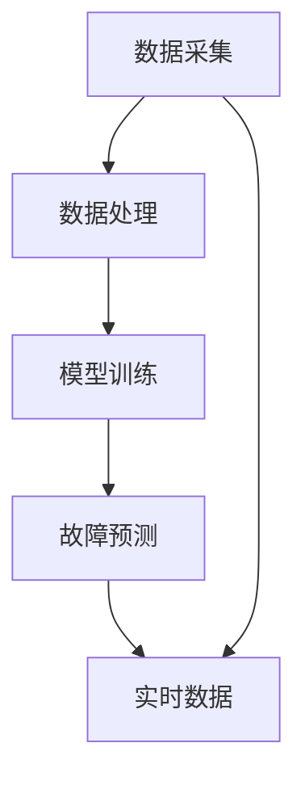

                 

关键词：AI预测性维护、商业模式、数据分析、物联网、智能维护

> 摘要：本文旨在探讨人工智能在预测性维护服务中的商业模式，分析其核心概念、算法原理、应用场景以及未来发展趋势。本文将结合实际案例，展示如何利用人工智能技术提升维护服务效率，降低成本，并展望未来面临的挑战和机遇。

## 1. 背景介绍

随着物联网（IoT）技术的迅速发展和大数据时代的来临，企业对于设备维护的需求逐渐转向更高效、更智能的方式。传统的定期维护已经无法满足日益复杂的设备运行环境和变化多端的维护需求。预测性维护通过分析设备运行数据，预测设备可能发生的故障，从而实现提前干预，避免设备非计划性停机，降低维护成本。

### 1.1 预测性维护的定义

预测性维护（Predictive Maintenance）是一种基于设备实时运行数据，通过数据分析预测设备故障，从而在故障发生前采取维护措施的维护方式。它利用物联网、大数据、人工智能等先进技术，实现了设备状态的实时监控和故障预测。

### 1.2 预测性维护与传统维护的差异

- **时间维度**：传统维护基于定期检查，而预测性维护基于实时数据分析。
- **效率**：预测性维护能够提前发现潜在问题，减少突发性故障，提高维护效率。
- **成本**：预测性维护可以优化维护资源，降低不必要的维护成本。

## 2. 核心概念与联系

### 2.1 数据采集

数据采集是预测性维护的基础。通过安装在设备上的传感器，实时收集温度、振动、压力等运行参数。

### 2.2 数据处理

数据处理包括数据清洗、数据分析和数据可视化。清洗数据去除噪声，分析数据提取特征，可视化帮助理解数据趋势。

### 2.3 模型训练

模型训练是预测性维护的核心。利用机器学习算法，从历史数据中训练出故障预测模型。

### 2.4 故障预测

故障预测通过运行实时数据，对设备未来可能发生的故障进行预测。

### 2.5 维护决策

维护决策基于故障预测结果，制定相应的维护计划和措施。

### 2.6 Mermaid 流程图



## 3. 核心算法原理 & 具体操作步骤

### 3.1 算法原理概述

预测性维护的核心算法主要基于机器学习，特别是监督学习和无监督学习。监督学习用于从历史数据中训练故障预测模型，无监督学习用于发现新的数据特征。

### 3.2 算法步骤详解

1. **数据收集**：从传感器收集温度、振动、压力等数据。
2. **数据预处理**：清洗数据，去除噪声，标准化数据。
3. **特征提取**：通过数据预处理后的数据，提取关键特征。
4. **模型选择**：选择合适的机器学习模型，如决策树、随机森林、神经网络等。
5. **模型训练**：利用历史数据对模型进行训练。
6. **模型评估**：通过交叉验证等方法评估模型性能。
7. **实时预测**：利用训练好的模型对实时数据进行分析，预测设备故障。
8. **维护决策**：根据故障预测结果，制定维护计划。

### 3.3 算法优缺点

- **优点**：
  - 提高维护效率，减少突发性故障。
  - 降低维护成本，优化资源利用。
  - 提前发现问题，减少停机时间。

- **缺点**：
  - 需要大量历史数据支持，数据质量对算法性能影响大。
  - 算法训练和优化需要大量计算资源。

### 3.4 算法应用领域

- **制造业**：提高设备利用率，降低维护成本。
- **能源行业**：优化设备运行状态，提高能源效率。
- **交通运输**：预测设备故障，保障安全运行。

## 4. 数学模型和公式 & 详细讲解 & 举例说明

### 4.1 数学模型构建

预测性维护的数学模型通常基于时间序列分析。一个基本的数学模型可以表示为：

$$y(t) = \sum_{i=1}^{n} w_i * f_i(t) + \epsilon(t)$$

其中，$y(t)$ 表示设备在时间 $t$ 的状态，$w_i$ 表示特征权重，$f_i(t)$ 表示第 $i$ 个特征在时间 $t$ 的值，$\epsilon(t)$ 表示随机误差。

### 4.2 公式推导过程

时间序列分析的常用方法包括 ARIMA（自回归积分滑动平均模型）和 LSTM（长短期记忆网络）。ARIMA 模型的公式推导如下：

$$y(t) = c + \sum_{i=1}^{p} \phi_i * y(t-i) + \theta_i * e(t-i) + \varepsilon_t$$

其中，$c$ 是常数项，$\phi_i$ 和 $\theta_i$ 分别是自回归项和移动平均项的系数，$e(t-i)$ 是误差项。

### 4.3 案例分析与讲解

以一个制造行业的设备为例，我们使用 ARIMA 模型进行故障预测。首先，我们需要对数据进行预处理，包括数据清洗、去除异常值、时间序列转换等。然后，使用 ACF（自相关函数）和 PACF（部分自相关函数）来确定 ARIMA 模型的参数 $p$ 和 $q$。最后，使用训练好的模型对实时数据进行分析，预测设备故障。

## 5. 项目实践：代码实例和详细解释说明

### 5.1 开发环境搭建

在 Python 环境中，我们需要安装以下库：pandas、numpy、scikit-learn、matplotlib。

```bash
pip install pandas numpy scikit-learn matplotlib
```

### 5.2 源代码详细实现

以下是使用 ARIMA 模型进行预测性维护的 Python 代码示例。

```python
import pandas as pd
import numpy as np
from statsmodels.tsa.arima.model import ARIMA
import matplotlib.pyplot as plt

# 读取数据
data = pd.read_csv('data.csv')
data['timestamp'] = pd.to_datetime(data['timestamp'])
data.set_index('timestamp', inplace=True)

# 数据预处理
data = data.asfreq('H').fillna(0)

# 特征提取
data['temp_diff'] = data['temperature'].diff().dropna()

# 模型训练
model = ARIMA(data['temp_diff'], order=(1, 1, 1))
model_fit = model.fit()

# 实时预测
forecast = model_fit.forecast(steps=24)[0]

# 结果可视化
plt.plot(data.index, data['temp_diff'], label='Actual')
plt.plot(pd.date_range(data.index[-1], periods=24, freq='H'), forecast, label='Forecast')
plt.legend()
plt.show()
```

### 5.3 代码解读与分析

这段代码首先读取数据，并进行预处理，提取温度变化率作为特征。然后使用 ARIMA 模型进行训练，并对未来 24 小时内的温度变化进行预测。最后，使用 matplotlib 绘制实际数据和预测数据。

## 6. 实际应用场景

### 6.1 制造业

在制造业中，预测性维护可以用于预测设备故障，提高设备利用率，降低维护成本。

### 6.2 能源行业

在能源行业，预测性维护可以用于优化设备运行状态，提高能源效率。

### 6.3 交通运输

在交通运输领域，预测性维护可以用于预测车辆故障，保障安全运行。

## 7. 未来应用展望

随着人工智能技术的不断发展，预测性维护将在更多领域得到应用。未来的发展方向包括：

- **更加智能的算法**：利用深度学习等技术，提高故障预测的准确性和效率。
- **边缘计算**：将数据处理和分析推向边缘设备，减少中心服务器的负担。
- **实时决策**：结合物联网技术，实现设备状态的实时监控和决策。

## 8. 总结：未来发展趋势与挑战

### 8.1 研究成果总结

预测性维护通过人工智能技术，实现了设备状态的实时监控和故障预测，提高了维护效率，降低了维护成本。

### 8.2 未来发展趋势

未来，预测性维护将向更加智能化、实时化、边缘化发展。深度学习、边缘计算等新技术将为预测性维护带来更多可能性。

### 8.3 面临的挑战

预测性维护面临的挑战包括数据质量、算法复杂度、实时性等。

### 8.4 研究展望

未来，我们需要在数据挖掘、算法优化、边缘计算等方面进行深入研究，以推动预测性维护技术的进一步发展。

## 9. 附录：常见问题与解答

### 9.1 预测性维护与传统维护的区别是什么？

预测性维护基于实时数据分析，而传统维护基于定期检查。预测性维护可以提前发现潜在问题，减少突发性故障，降低维护成本。

### 9.2 预测性维护需要哪些技术支持？

预测性维护需要物联网技术、大数据分析、机器学习等技术支持。

### 9.3 预测性维护适用于哪些行业？

预测性维护适用于制造业、能源行业、交通运输等行业，任何需要设备维护的行业都可以应用预测性维护技术。

---

**作者：禅与计算机程序设计艺术 / Zen and the Art of Computer Programming**

