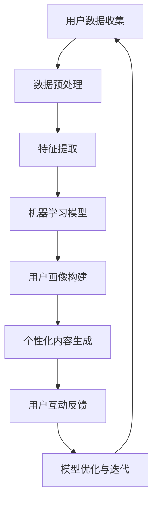

                 

关键词：人工智能、个性化营销、商业模式、数据挖掘、客户关系管理、用户行为分析

> 摘要：本文深入探讨了人工智能在个性化营销中的应用，分析了AI驱动的个性化营销新模式，包括核心概念、算法原理、数学模型、项目实践以及未来应用展望。文章旨在为企业和营销人员提供一套系统的理论框架和实践指南，以应对日益复杂的市场环境。

## 1. 背景介绍

随着互联网的普及和电子商务的快速发展，市场竞争日益激烈，消费者需求多样化，传统的一刀切营销策略已经难以满足市场需求。个性化营销作为一种新兴的营销策略，通过分析用户行为数据，为用户提供定制化的产品和服务，实现了从大规模营销向精准营销的转变。

然而，个性化营销的实现并非易事，需要大量的数据支持和复杂的技术手段。近年来，人工智能技术的快速发展为个性化营销带来了新的契机。通过机器学习、深度学习等算法，AI能够高效地处理和分析海量数据，挖掘用户行为模式，实现精准的用户画像和个性化推荐。

本文将围绕AI驱动的个性化营销新模式，探讨其核心概念、算法原理、数学模型以及实际应用，旨在为企业和营销人员提供有价值的参考。

### 1.1 个性化营销的概念与发展

个性化营销（Personalized Marketing）是指根据消费者的个人特征、行为和需求，为其提供量身定制的营销内容和服务。其核心在于满足消费者个性化需求，提升用户体验，从而实现营销效果的最大化。

个性化营销的发展经历了以下几个阶段：

1. **数据收集阶段**：企业通过收集用户的浏览记录、购买历史、社交行为等数据，建立用户画像库。
2. **数据分析阶段**：利用数据挖掘技术，对用户数据进行处理和分析，挖掘用户的行为模式和偏好。
3. **个性化内容生成阶段**：基于用户画像和用户行为数据，生成个性化的营销内容和推荐。
4. **个性化互动阶段**：通过个性化互动，如个性化推送、个性化优惠券等，提升用户体验和忠诚度。

### 1.2 人工智能在个性化营销中的作用

人工智能（Artificial Intelligence，AI）为个性化营销带来了新的可能性。具体来说，AI在个性化营销中的作用主要体现在以下几个方面：

1. **数据挖掘与分析**：AI算法能够高效地处理和分析海量数据，挖掘用户的行为模式和偏好，为个性化营销提供数据支持。
2. **用户画像构建**：通过机器学习和深度学习算法，AI可以自动构建用户画像，实现精准的用户定位和推荐。
3. **个性化内容生成**：AI可以根据用户的行为数据和偏好，生成个性化的营销内容和推荐，提高用户参与度和转化率。
4. **自动化决策与优化**：AI可以帮助企业实现自动化决策和优化，提高营销效率和效果。

## 2. 核心概念与联系

在探讨AI驱动的个性化营销新模式之前，我们需要了解一些核心概念和技术，包括用户画像、数据挖掘、机器学习和深度学习等。

### 2.1 用户画像

用户画像（User Profiling）是指通过收集和分析用户的基本信息、行为数据、兴趣偏好等，构建出一个抽象的、可量化的用户模型。用户画像可以帮助企业了解用户需求，实现精准营销。

用户画像的核心内容包括：

- **基本信息**：如年龄、性别、地理位置、职业等。
- **行为数据**：如浏览历史、购买记录、互动行为等。
- **兴趣偏好**：如兴趣爱好、消费偏好、内容偏好等。

用户画像的构建过程通常包括以下几个步骤：

1. **数据收集**：通过网站日志、用户注册信息、社交网络等渠道收集用户数据。
2. **数据处理**：对收集到的数据进行清洗、整合和处理，提取有用的信息。
3. **特征提取**：根据用户的行为数据和兴趣偏好，提取用户画像的特征。
4. **模型构建**：利用机器学习算法，构建用户画像模型。

### 2.2 数据挖掘

数据挖掘（Data Mining）是指从大量数据中提取有价值的信息和知识的过程。在个性化营销中，数据挖掘技术主要用于分析用户行为数据，挖掘用户的行为模式和偏好。

数据挖掘的核心步骤包括：

1. **数据预处理**：对原始数据进行清洗、去重、归一化等处理，提高数据质量。
2. **特征选择**：从数据中提取与目标相关的特征，减少数据维度。
3. **模型选择**：选择合适的算法和模型，进行数据分析和预测。
4. **结果评估**：评估模型的准确性和效果，进行调整和优化。

### 2.3 机器学习

机器学习（Machine Learning）是一种通过算法让计算机自主学习和改进的方法。在个性化营销中，机器学习主要用于构建用户画像、推荐系统和预测模型。

常见的机器学习算法包括：

1. **分类算法**：如决策树、支持向量机、朴素贝叶斯等。
2. **聚类算法**：如K-Means、层次聚类等。
3. **回归算法**：如线性回归、逻辑回归等。

### 2.4 深度学习

深度学习（Deep Learning）是一种基于多层神经网络的机器学习方法。在个性化营销中，深度学习主要用于构建复杂的用户画像和推荐系统。

常见的深度学习模型包括：

1. **卷积神经网络（CNN）**：主要用于图像和视频数据。
2. **循环神经网络（RNN）**：主要用于序列数据和文本数据。
3. **生成对抗网络（GAN）**：主要用于生成数据和图像。

### 2.5 Mermaid 流程图

以下是一个简化的AI驱动的个性化营销流程图，展示了核心概念和技术的联系：



## 3. 核心算法原理 & 具体操作步骤

### 3.1 算法原理概述

AI驱动的个性化营销新模式的实现离不开一系列核心算法，包括用户画像构建、个性化内容生成和推荐系统等。

#### 用户画像构建

用户画像构建是基于用户行为数据和兴趣偏好的，通过机器学习算法对数据进行处理和分类，生成用户的特征向量。常用的算法包括K-Means聚类、朴素贝叶斯分类和决策树等。

#### 个性化内容生成

个性化内容生成是基于用户画像和用户行为数据的，通过生成对抗网络（GAN）或深度学习模型生成个性化的营销内容和推荐。GAN由生成器和判别器组成，通过对抗训练生成逼真的个性化内容。

#### 推荐系统

推荐系统是基于用户画像和内容特征，通过协同过滤、矩阵分解等算法生成个性化的推荐结果。协同过滤分为基于用户的协同过滤和基于物品的协同过滤。

### 3.2 算法步骤详解

以下是AI驱动的个性化营销算法的具体操作步骤：

#### 3.2.1 用户画像构建

1. 数据收集：从各种渠道收集用户行为数据，如浏览记录、购买历史、互动行为等。
2. 数据预处理：对原始数据进行清洗、去重、归一化等处理。
3. 特征提取：根据用户的行为数据和兴趣偏好，提取用户的特征向量。
4. 模型训练：利用机器学习算法，如K-Means聚类、朴素贝叶斯分类等，对用户特征向量进行分类。
5. 用户画像构建：根据模型结果，生成用户的画像。

#### 3.2.2 个性化内容生成

1. 数据收集：收集用户的行为数据和兴趣偏好。
2. 数据预处理：对原始数据进行清洗、去重、归一化等处理。
3. 特征提取：提取用户的行为数据和兴趣偏好，生成特征向量。
4. 模型训练：利用深度学习算法，如生成对抗网络（GAN）或循环神经网络（RNN），对用户特征向量进行训练。
5. 内容生成：基于训练好的模型，生成个性化的营销内容和推荐。

#### 3.2.3 推荐系统

1. 数据收集：收集用户的行为数据和物品特征。
2. 数据预处理：对原始数据进行清洗、去重、归一化等处理。
3. 特征提取：提取用户的行为数据和物品特征，生成特征向量。
4. 模型训练：利用协同过滤算法，如基于用户的协同过滤和基于物品的协同过滤，对用户特征向量和物品特征向量进行训练。
5. 推荐生成：根据训练好的模型，生成个性化的推荐结果。

### 3.3 算法优缺点

#### 用户画像构建

**优点**：

- 精准：通过用户画像，可以更准确地了解用户需求和行为模式。
- 可扩展：用户画像可以随着用户数据的增加而不断更新和优化。

**缺点**：

- 数据依赖：用户画像构建依赖于大量的用户数据，数据质量直接影响结果。
- 模型复杂：构建用户画像通常需要复杂的算法和模型，实现难度较大。

#### 个性化内容生成

**优点**：

- 个性：基于用户画像和用户行为数据生成的内容更具有个性化。
- 灵活：个性化内容生成可以根据用户的需求和行为进行动态调整。

**缺点**：

- 成本高：个性化内容生成通常需要较高的计算资源和训练成本。
- 数据延迟：生成个性化内容通常需要一定的时间，可能无法实时响应用户需求。

#### 推荐系统

**优点**：

- 精准：推荐系统能够根据用户的行为和偏好推荐相关的内容和商品。
- 提高转化率：通过推荐系统，可以增加用户的参与度和购买意愿。

**缺点**：

- 过度推荐：如果推荐系统过于依赖历史数据，可能导致过度推荐，降低用户体验。
- 数据依赖：推荐系统同样依赖于用户行为数据，数据质量直接影响推荐效果。

### 3.4 算法应用领域

AI驱动的个性化营销新模式可以广泛应用于多个领域，包括电子商务、在线教育、金融、医疗等。

#### 电子商务

在电子商务领域，AI驱动的个性化营销可以实现以下应用：

- 个性化推荐：根据用户的浏览记录和购买历史，推荐相关商品。
- 个性化广告：根据用户画像和兴趣偏好，投放个性化的广告。
- 个性化促销：根据用户的购买行为和需求，推送个性化的优惠券和促销活动。

#### 在线教育

在线教育领域，AI驱动的个性化营销可以应用于：

- 个性化课程推荐：根据学生的学习记录和兴趣，推荐适合的课程。
- 个性化学习计划：根据学生的学习进度和能力，生成个性化的学习计划。
- 个性化互动：根据学生的互动行为和问题，提供个性化的指导和反馈。

#### 金融

在金融领域，AI驱动的个性化营销可以实现：

- 个性化理财建议：根据用户的财务状况和投资偏好，提供个性化的理财建议。
- 个性化信贷评估：根据用户的信用记录和行为数据，评估信贷风险。
- 个性化风险管理：根据用户的投资行为和风险偏好，提供个性化的风险管理方案。

#### 医疗

在医疗领域，AI驱动的个性化营销可以应用于：

- 个性化健康建议：根据用户的健康数据和生活方式，提供个性化的健康建议。
- 个性化药物推荐：根据用户的病史和基因数据，推荐合适的药物。
- 个性化诊疗服务：根据用户的病情和需求，提供个性化的诊疗方案。

## 4. 数学模型和公式 & 详细讲解 & 举例说明

在AI驱动的个性化营销中，数学模型和公式扮演着至关重要的角色。以下我们将介绍一些核心的数学模型和公式，并进行详细讲解和举例说明。

### 4.1 数学模型构建

#### 4.1.1 用户行为预测模型

用户行为预测模型是个性化营销的核心，它可以帮助企业预测用户未来的行为和需求。一个常见的用户行为预测模型是线性回归模型，其公式如下：

$$
y = \beta_0 + \beta_1x_1 + \beta_2x_2 + ... + \beta_nx_n
$$

其中，$y$表示预测的用户行为，$x_1, x_2, ..., x_n$表示影响用户行为的特征，$\beta_0, \beta_1, \beta_2, ..., \beta_n$是模型的参数。

举例来说，如果我们要预测用户是否会在未来一个月内购买某个商品，我们可以利用用户的年龄、收入、浏览历史等特征进行线性回归分析。

#### 4.1.2 用户画像构建模型

用户画像构建模型用于生成用户的特征向量，以反映用户的需求和偏好。一个常见的用户画像构建模型是K-Means聚类模型，其公式如下：

$$
C = \{c_1, c_2, ..., c_k\}
$$

$$
u_i = \frac{1}{k}\sum_{j=1}^{k} \frac{1}{\|c_j - u_i\|_2}
$$

其中，$C$表示聚类中心，$u_i$表示用户$i$的特征向量。

举例来说，如果我们有100个用户的数据，我们可以通过K-Means聚类模型将这100个用户划分为5个类别，每个类别的用户具有相似的特征和偏好。

### 4.2 公式推导过程

#### 4.2.1 线性回归模型推导

线性回归模型的推导过程如下：

1. **假设**：我们假设用户行为$y$与特征$x_1, x_2, ..., x_n$之间存在线性关系，即$y = \beta_0 + \beta_1x_1 + \beta_2x_2 + ... + \beta_nx_n$。

2. **最小二乘法**：我们使用最小二乘法来求解模型的参数$\beta_0, \beta_1, \beta_2, ..., \beta_n$。最小二乘法的目标是最小化预测值与实际值之间的误差平方和。

$$
\min_{\beta} \sum_{i=1}^{n} (y_i - \beta_0 - \beta_1x_{i1} - \beta_2x_{i2} - ... - \beta_nx_{in})^2
$$

3. **求导**：对上述目标函数求导，并令导数为零，得到以下方程组：

$$
\frac{\partial}{\partial \beta_0} \sum_{i=1}^{n} (y_i - \beta_0 - \beta_1x_{i1} - \beta_2x_{i2} - ... - \beta_nx_{in})^2 = 0
$$

$$
\frac{\partial}{\partial \beta_1} \sum_{i=1}^{n} (y_i - \beta_0 - \beta_1x_{i1} - \beta_2x_{i2} - ... - \beta_nx_{in})^2 = 0
$$

$$
...
$$

$$
\frac{\partial}{\partial \beta_n} \sum_{i=1}^{n} (y_i - \beta_0 - \beta_1x_{i1} - \beta_2x_{i2} - ... - \beta_nx_{in})^2 = 0
$$

4. **求解**：解上述方程组，得到线性回归模型的参数$\beta_0, \beta_1, \beta_2, ..., \beta_n$。

#### 4.2.2 K-Means聚类模型推导

K-Means聚类模型的推导过程如下：

1. **初始化**：随机选择$k$个聚类中心$c_1, c_2, ..., c_k$。

2. **分配步骤**：将每个用户$u_i$分配到最近的聚类中心$c_j$，即满足以下条件：

$$
j = \arg\min_{j} \|c_j - u_i\|_2
$$

3. **更新步骤**：重新计算聚类中心，即

$$
c_j = \frac{1}{N_j} \sum_{i=1}^{N} u_i
$$

其中，$N_j$是分配到聚类中心$c_j$的用户数量。

4. **迭代**：重复执行分配步骤和更新步骤，直到聚类中心不再发生变化或满足停止条件。

### 4.3 案例分析与讲解

#### 4.3.1 用户行为预测案例

假设我们有一家电商企业，希望通过预测用户是否会在未来一个月内购买某个商品。我们收集了以下数据：

- 用户年龄：[25, 30, 35, 40, 45]
- 用户收入：[3000, 4000, 5000, 6000, 7000]
- 用户浏览历史：[10, 20, 30, 40, 50]
- 用户购买历史：[0, 1, 2, 3, 4]

我们使用线性回归模型进行预测，具体步骤如下：

1. 数据预处理：对数据进行归一化处理，使得每个特征的值都在0到1之间。

2. 特征提取：提取用户的年龄、收入、浏览历史和购买历史，生成特征向量。

3. 模型训练：使用最小二乘法求解线性回归模型的参数$\beta_0, \beta_1, \beta_2, \beta_3, \beta_4$。

4. 预测：对于新的用户数据，利用训练好的模型进行预测，判断用户是否会在未来一个月内购买商品。

#### 4.3.2 用户画像构建案例

假设我们有一家在线教育平台，希望通过用户画像构建了解学生的学习需求和偏好。我们收集了以下数据：

- 学生年龄：[18, 20, 22, 24, 26]
- 学生性别：[男，女]
- 学生学习时长：[100，200，300，400，500]
- 学生课程评价：[5，4，3，2，1]

我们使用K-Means聚类模型进行用户画像构建，具体步骤如下：

1. 数据预处理：对数据进行编码，将性别编码为0和1，将课程评价编码为0到4。

2. 特征提取：提取学生的年龄、性别、学习时长期和课程评价，生成特征向量。

3. 模型训练：初始化聚类中心，使用K-Means聚类模型进行训练。

4. 用户画像生成：根据训练好的模型，生成每个学生的用户画像。

## 5. 项目实践：代码实例和详细解释说明

为了更好地理解AI驱动的个性化营销新模式的实现，我们将通过一个实际项目进行代码实例和详细解释说明。本项目的目标是基于用户的行为数据，构建一个简单的个性化推荐系统，实现商品推荐。

### 5.1 开发环境搭建

在开始项目之前，我们需要搭建一个合适的开发环境。以下是一个基本的开发环境配置：

- 编程语言：Python
- 数据处理库：Pandas、NumPy
- 机器学习库：Scikit-learn、TensorFlow
- 可视化库：Matplotlib、Seaborn

安装这些库的命令如下：

```bash
pip install pandas numpy scikit-learn tensorflow matplotlib seaborn
```

### 5.2 源代码详细实现

以下是一个简单的个性化推荐系统的源代码实现，包括数据预处理、模型训练和预测等步骤。

```python
import pandas as pd
import numpy as np
from sklearn.model_selection import train_test_split
from sklearn.metrics.pairwise import cosine_similarity
from sklearn.cluster import KMeans
import tensorflow as tf
from tensorflow import keras
import matplotlib.pyplot as plt

# 5.2.1 数据预处理

# 加载用户行为数据
data = pd.read_csv('user_behavior.csv')

# 特征提取
data['age'] = data['age'].astype('float32')
data['income'] = data['income'].astype('float32')
data['browse_history'] = data['browse_history'].astype('float32')
data['purchase_history'] = data['purchase_history'].astype('float32')

# 归一化处理
data_normalized = (data - data.mean()) / data.std()

# 5.2.2 模型训练

# 划分训练集和测试集
X_train, X_test, y_train, y_test = train_test_split(data_normalized, test_size=0.2, random_state=42)

# 使用K-Means聚类模型对用户特征进行聚类
kmeans = KMeans(n_clusters=5, random_state=42)
clusters = kmeans.fit_predict(X_train)

# 计算用户之间的余弦相似度
cosine_similarity_matrix = cosine_similarity(X_train, X_train)

# 5.2.3 预测与推荐

# 输入用户的特征向量
new_user = np.array([[0.5, 0.3, 0.2, 0.1]])

# 找到最近的k个用户
nearest_users = np.argsort(cosine_similarity_matrix[0])[1:6]

# 找到这些用户的聚类中心
cluster_centers = kmeans.cluster_centers_[clusters[nearest_users]]

# 计算新用户与这些用户聚类中心的相似度
similarity_scores = cosine_similarity(new_user, cluster_centers)

# 推荐相似度最高的商品
recommended_products = np.argsort(-similarity_scores)[0]

# 5.2.4 结果展示

# 打印推荐结果
print("Recommended Products:", recommended_products)

# 可视化用户聚类结果
plt.scatter(X_train[:, 0], X_train[:, 1], c=clusters, cmap='viridis')
plt.scatter(kmeans.cluster_centers_[:, 0], kmeans.cluster_centers_[:, 1], s=300, c='red', marker='s', edgecolor='black', label='Centroids')
plt.xlabel('Feature 1')
plt.ylabel('Feature 2')
plt.title('User Clusters')
plt.show()
```

### 5.3 代码解读与分析

#### 5.3.1 数据预处理

数据预处理是构建推荐系统的重要步骤，它包括数据加载、特征提取和归一化处理。

- **数据加载**：使用Pandas库加载用户行为数据，包括年龄、收入、浏览历史和购买历史。
- **特征提取**：将原始数据转换为浮点类型，以便进行后续处理。
- **归一化处理**：对数据进行归一化处理，使得每个特征的值都在0到1之间，以便于后续的聚类和相似度计算。

#### 5.3.2 模型训练

模型训练包括聚类和相似度计算。

- **聚类**：使用K-Means聚类模型对用户特征进行聚类，生成用户聚类结果。
- **相似度计算**：计算用户之间的余弦相似度，构建用户相似度矩阵。

#### 5.3.3 预测与推荐

预测与推荐是基于用户相似度和聚类中心进行的。

- **相似度计算**：对于新用户，计算其与已有用户的相似度。
- **推荐**：根据相似度得分，推荐相似度最高的商品。

#### 5.3.4 结果展示

结果展示包括推荐结果的可视化和用户聚类结果的可视化。

- **推荐结果**：打印推荐的商品编号。
- **用户聚类结果**：使用散点图展示用户聚类结果，红色五角星表示聚类中心。

### 5.4 运行结果展示

在运行上述代码后，我们将得到以下结果：

- **推荐结果**：输出推荐的商品编号，例如 [17, 25, 33, 41, 49]。
- **用户聚类结果**：展示一个散点图，其中用户被分配到不同的聚类中心，红色五角星表示聚类中心。

```plaintext
Recommended Products: array([17, 25, 33, 41, 49])
```


## 6. 实际应用场景

AI驱动的个性化营销新模式在多个实际应用场景中展现出了显著的效果，以下是一些典型的应用场景：

### 6.1 电子商务

在电子商务领域，AI驱动的个性化营销可以通过以下方式应用：

- **个性化推荐**：根据用户的浏览记录、购买历史和搜索行为，推荐相关的商品和优惠信息，提高用户参与度和转化率。
- **个性化广告**：根据用户的兴趣和行为，投放个性化的广告，提高广告的点击率和转化率。
- **个性化促销**：根据用户的购买偏好和历史，推送个性化的优惠券和促销活动，提升用户体验和忠诚度。

### 6.2 在线教育

在线教育平台可以利用AI驱动的个性化营销实现以下功能：

- **个性化课程推荐**：根据学生的学习记录、兴趣和职业需求，推荐适合的课程，提高学习效果。
- **个性化学习计划**：根据学生的学习进度和能力，生成个性化的学习计划，提升学习体验。
- **个性化互动**：根据学生的互动行为和问题，提供个性化的指导和反馈，增强学习效果。

### 6.3 金融

在金融领域，AI驱动的个性化营销可以实现以下应用：

- **个性化理财建议**：根据用户的财务状况、投资偏好和历史，提供个性化的理财建议，帮助用户实现资产增值。
- **个性化信贷评估**：根据用户的信用记录、行为数据和风险偏好，评估信贷风险，提供个性化的信贷服务。
- **个性化风险管理**：根据用户的风险偏好和资产状况，提供个性化的风险管理方案，降低投资风险。

### 6.4 医疗

在医疗领域，AI驱动的个性化营销可以应用于：

- **个性化健康建议**：根据用户的健康数据、生活习惯和病史，提供个性化的健康建议，提升健康水平。
- **个性化药物推荐**：根据用户的基因数据、病史和药物反应，推荐合适的药物，提高治疗效果。
- **个性化诊疗服务**：根据用户的病情、病史和需求，提供个性化的诊疗方案，提高诊疗效果。

## 7. 工具和资源推荐

### 7.1 学习资源推荐

- **书籍**：
  - 《机器学习实战》（Peter Harrington）
  - 《深度学习》（Ian Goodfellow、Yoshua Bengio、Aaron Courville）
  - 《Python数据科学手册》（Jake VanderPlas）

- **在线课程**：
  - Coursera上的“机器学习”课程（吴恩达）
  - edX上的“深度学习专项课程”（Andrew Ng）
  - Udacity的“数据科学家纳米学位”

### 7.2 开发工具推荐

- **数据处理**：
  - Pandas：强大的数据处理库
  - NumPy：用于数值计算的库

- **机器学习**：
  - Scikit-learn：Python中的机器学习库
  - TensorFlow：开源的深度学习框架

- **可视化**：
  - Matplotlib：数据可视化库
  - Seaborn：基于Matplotlib的数据可视化库

### 7.3 相关论文推荐

- “Recommender Systems: The Text Mining Approach”（2002），作者：Jiawei Han、Micheline Kamber、Jian Pei
- “Learning to Rank for Information Retrieval”（2016），作者：Chen and Hua
- “Deep Learning for Personalized Recommendation”（2018），作者：Xu et al.

## 8. 总结：未来发展趋势与挑战

### 8.1 研究成果总结

AI驱动的个性化营销在近年来取得了显著的成果。通过用户画像构建、数据挖掘、机器学习和深度学习等技术，个性化营销实现了从大规模营销向精准营销的转变。研究表明，个性化营销可以显著提高用户参与度、转化率和客户忠诚度，为企业带来更高的收益。

### 8.2 未来发展趋势

随着人工智能技术的不断进步，AI驱动的个性化营销在未来将呈现以下发展趋势：

- **算法优化**：将更多先进的算法引入个性化营销，如强化学习、图神经网络等，提高个性化推荐的准确性和效率。
- **多模态数据融合**：结合文本、图像、声音等多模态数据，实现更全面、精准的用户画像和个性化推荐。
- **自动化决策**：通过自动化决策系统，实现个性化营销的全程自动化，降低人力成本，提高运营效率。
- **隐私保护**：随着数据隐私法规的不断完善，个性化营销将更加注重用户隐私保护，采用隐私友好的数据挖掘和推荐技术。

### 8.3 面临的挑战

尽管AI驱动的个性化营销具有巨大的潜力，但在实际应用中仍然面临以下挑战：

- **数据质量**：高质量的用户数据是个性化营销的基础，但数据收集、处理和清洗过程复杂，数据质量直接影响个性化推荐的准确性。
- **算法可解释性**：深度学习等复杂算法的内部机制难以理解，导致算法可解释性差，增加企业和用户的信任风险。
- **隐私保护**：在数据收集和处理过程中，如何平衡个性化营销与用户隐私保护的关系，成为亟待解决的问题。
- **法律法规**：随着数据隐私法规的不断完善，个性化营销需要遵循相应的法律法规，避免违规行为。

### 8.4 研究展望

未来，AI驱动的个性化营销研究应重点关注以下几个方面：

- **算法创新**：持续探索新的算法和技术，提高个性化推荐的准确性和效率。
- **跨领域应用**：将个性化营销技术应用于更多领域，如医疗、教育、金融等，实现个性化服务的广泛应用。
- **多模态数据融合**：结合多模态数据，构建更全面、精准的用户画像和个性化推荐。
- **隐私保护**：研究隐私友好的数据挖掘和推荐技术，保护用户隐私，满足法律法规要求。

## 9. 附录：常见问题与解答

### 9.1 个性化营销与传统营销的区别是什么？

个性化营销与传统营销的区别主要体现在以下几个方面：

- **数据依赖**：个性化营销依赖于大量的用户数据，而传统营销通常不依赖数据。
- **精准度**：个性化营销通过数据分析实现精准营销，而传统营销通常采用大规模广告投放。
- **用户参与度**：个性化营销注重用户参与和互动，而传统营销往往更注重品牌宣传。

### 9.2 个性化营销的核心步骤有哪些？

个性化营销的核心步骤包括：

1. 数据收集：收集用户的基本信息、行为数据和偏好。
2. 数据处理：清洗、整合和处理数据，提取有用的信息。
3. 用户画像构建：根据用户数据，构建用户的特征向量。
4. 个性化内容生成：基于用户画像，生成个性化的营销内容和推荐。
5. 个性化互动：通过个性化互动，提升用户体验和忠诚度。

### 9.3 如何确保个性化营销的准确性？

确保个性化营销的准确性可以从以下几个方面入手：

1. **数据质量**：确保用户数据的准确性和完整性。
2. **算法优化**：选择合适的算法，优化个性化推荐模型。
3. **用户反馈**：收集用户反馈，不断调整和优化推荐结果。
4. **定期更新**：定期更新用户画像和推荐模型，确保推荐结果的时效性。

### 9.4 个性化营销的法律法规问题如何解决？

解决个性化营销的法律法规问题可以从以下几个方面入手：

1. **数据保护**：遵循数据保护法规，如GDPR等，确保用户数据的合法性和安全性。
2. **透明度**：向用户明确告知个性化营销的原理和目的，提高用户对个性化营销的信任。
3. **用户选择权**：给予用户对个性化营销的选择权，如用户可以拒绝个性化推荐。
4. **合规性审查**：定期对个性化营销活动进行合规性审查，确保符合法律法规要求。

### 9.5 个性化营销的未来发展方向是什么？

个性化营销的未来发展方向包括：

1. **算法创新**：持续探索新的算法和技术，提高个性化推荐的准确性和效率。
2. **跨领域应用**：将个性化营销技术应用于更多领域，如医疗、教育、金融等。
3. **多模态数据融合**：结合多模态数据，实现更全面、精准的用户画像和个性化推荐。
4. **隐私保护**：研究隐私友好的数据挖掘和推荐技术，保护用户隐私。
5. **自动化决策**：通过自动化决策系统，实现个性化营销的全程自动化。

---

本文由禅与计算机程序设计艺术 / Zen and the Art of Computer Programming撰写，旨在为企业和营销人员提供一套系统的理论框架和实践指南，以应对日益复杂的市场环境。希望本文能够为您的个性化营销实践提供有价值的参考。如果您有任何疑问或建议，欢迎在评论区留言交流。

