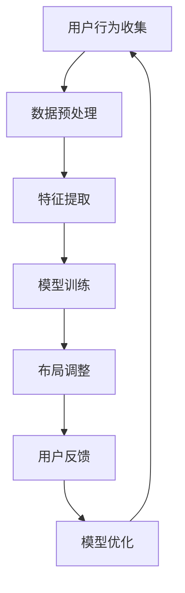

                 

 在当今信息爆炸的时代，如何高效地提供个性化内容给用户已成为互联网企业的核心竞争力。AI驱动的个性化页面布局优化正是为了满足这一需求而诞生的一项技术。本文将深入探讨AI在页面布局优化中的应用，从背景介绍、核心概念与联系、核心算法原理及操作步骤、数学模型及公式、项目实践、实际应用场景、工具和资源推荐，以及未来发展趋势与挑战等方面进行全面阐述。

## 关键词

- AI
- 个性化页面布局
- 机器学习
- 用户体验
- 前端优化

## 摘要

本文旨在探讨如何利用人工智能技术优化页面布局，以提升用户体验。通过对AI在页面布局优化中的核心概念、算法原理、数学模型及应用实践等方面进行深入分析，本文为开发者提供了一种切实可行的优化策略，并展望了未来的发展方向与挑战。

## 1. 背景介绍

### 1.1 页面布局优化的重要性

页面布局是网站或应用给用户的第一印象，直接影响用户的感知和满意度。随着互联网的快速发展，用户对页面内容的获取速度和质量要求越来越高，传统的静态布局已无法满足个性化需求。因此，优化页面布局，提高用户体验，成为互联网企业亟需解决的问题。

### 1.2 人工智能的发展与应用

人工智能作为当前最具颠覆性的技术之一，已在多个领域取得显著成果。在页面布局优化方面，AI技术可以通过分析用户行为、兴趣偏好等数据，实现个性化推荐和内容适配，从而提升用户体验。近年来，深度学习、自然语言处理等AI技术在页面布局优化中的应用日益广泛，为个性化页面布局提供了新的可能。

### 1.3 AI驱动页面布局优化的发展历程

AI驱动页面布局优化的发展历程可以追溯到2010年左右。随着移动互联网的兴起，前端开发技术和页面架构不断演变，AI技术在页面布局优化中的应用也逐渐成熟。从最初的规则引擎到基于机器学习的自适应布局，再到现在的AI驱动个性化布局，页面布局优化技术经历了多次变革。

## 2. 核心概念与联系

### 2.1 个性化页面布局

个性化页面布局是指根据用户的行为、兴趣、需求等特征，动态调整页面内容和布局，以提供最适合用户的体验。个性化页面布局的核心在于数据驱动，通过收集和分析用户数据，实现内容的精准推送和布局的智能调整。

### 2.2 机器学习与深度学习

机器学习和深度学习是AI技术的核心组成部分。机器学习通过训练模型，使计算机具备自主学习和改进能力。深度学习则是一种特殊类型的机器学习，通过构建多层神经网络，模拟人类大脑的思考方式，实现复杂模式的识别和学习。

### 2.3 自然语言处理

自然语言处理（NLP）是AI技术的另一个重要领域。NLP旨在使计算机理解和生成人类语言，从而实现人机交互和信息提取。在页面布局优化中，NLP技术可用于分析用户输入，提取关键信息，为个性化布局提供支持。

### 2.4 Mermaid 流程图

以下是一个用于描述个性化页面布局优化的Mermaid流程图：



## 3. 核心算法原理 & 具体操作步骤

### 3.1 算法原理概述

AI驱动的个性化页面布局优化主要依赖于以下几种算法：

1. **协同过滤算法**：通过分析用户历史行为，预测用户对未知内容的喜好。
2. **深度学习模型**：通过构建多层神经网络，实现复杂模式的识别和预测。
3. **自然语言处理技术**：通过分析用户输入，提取关键信息，为个性化布局提供支持。

### 3.2 算法步骤详解

1. **用户行为收集**：通过网站或应用的日志、传感器等手段，收集用户行为数据，如浏览记录、搜索关键词、点击次数等。
2. **数据预处理**：对收集到的用户行为数据进行分析和清洗，去除无效数据，为后续分析提供基础。
3. **特征提取**：根据用户行为数据，提取关键特征，如用户兴趣、浏览时长、页面停留时间等。
4. **模型训练**：使用机器学习算法，如协同过滤算法、深度学习模型等，对提取到的特征进行训练，构建个性化布局模型。
5. **布局调整**：根据用户行为数据和模型预测结果，动态调整页面布局，实现个性化内容推荐。
6. **用户反馈**：收集用户对个性化布局的反馈，用于模型优化和改进。
7. **模型优化**：根据用户反馈，对个性化布局模型进行迭代优化，提高布局效果。

### 3.3 算法优缺点

**协同过滤算法**：

- **优点**：算法简单，计算速度快，适用于大规模用户数据的推荐系统。
- **缺点**：易受冷启动问题影响，对新用户推荐效果不佳。

**深度学习模型**：

- **优点**：具有较强的泛化能力和适应性，适用于复杂场景的个性化推荐。
- **缺点**：训练过程复杂，计算资源需求较高。

**自然语言处理技术**：

- **优点**：可处理多样化和复杂的用户输入，提高布局的准确性。
- **缺点**：数据处理和模型训练过程较为复杂，对计算资源要求较高。

### 3.4 算法应用领域

AI驱动的个性化页面布局优化广泛应用于电子商务、社交媒体、新闻推荐等领域。通过个性化布局，可以提高用户满意度、增加用户粘性和转化率，从而提升企业竞争力。

## 4. 数学模型和公式 & 详细讲解 & 举例说明

### 4.1 数学模型构建

在个性化页面布局优化中，常用的数学模型包括协同过滤模型、深度学习模型等。以下是一个基于协同过滤的数学模型构建过程：

$$
R_{ui} = \mu + b_u + b_i + \sum_{j\in N(i)} \frac{q_{uj}}{||v_j||} + \epsilon_{ui}
$$

其中：

- \( R_{ui} \)：用户\( u \)对项目\( i \)的评分。
- \( \mu \)：全局平均评分。
- \( b_u \)：用户\( u \)的偏置。
- \( b_i \)：项目\( i \)的偏置。
- \( N(i) \)：与项目\( i \)相关的用户集合。
- \( q_{uj} \)：用户\( u \)和项目\( i \)之间的相似度。
- \( v_j \)：项目\( j \)的特征向量。
- \( \epsilon_{ui} \)：误差项。

### 4.2 公式推导过程

协同过滤模型的推导过程主要包括以下几个步骤：

1. **用户和项目的评分矩阵**：设用户\( u \)和项目\( i \)的评分矩阵为\( R \)，其中\( R_{ui} \)表示用户\( u \)对项目\( i \)的评分。
2. **用户和项目的偏置**：通过最小化误差函数，求得用户\( u \)和项目\( i \)的偏置\( b_u \)和\( b_i \)。
3. **相似度计算**：计算用户\( u \)和项目\( i \)之间的相似度，通常采用余弦相似度或皮尔逊相关系数。
4. **评分预测**：根据用户和项目的偏置以及相似度，预测用户\( u \)对项目\( i \)的评分。

### 4.3 案例分析与讲解

假设有一个电商网站，用户\( u \)在浏览了多个商品后，对商品\( i \)给出了评分\( R_{ui} \)。根据协同过滤模型，可以预测用户\( u \)对其他商品\( j \)的评分。

以下是一个具体案例：

用户\( u \)对商品\( i \)的评分矩阵为：

$$
R_u = \begin{bmatrix}
5 & 0 & 4 \\
0 & 3 & 2 \\
4 & 0 & 5
\end{bmatrix}
$$

商品\( i \)的评分矩阵为：

$$
R_i = \begin{bmatrix}
5 & 0 & 4 \\
0 & 3 & 2 \\
4 & 0 & 5
\end{bmatrix}
$$

根据协同过滤模型，可以预测用户\( u \)对商品\( j \)的评分：

$$
R_{uj} = \mu + b_u + b_i + \sum_{k\in N(i)} \frac{q_{uk}}{||v_k||} + \epsilon_{uj}
$$

其中，\( \mu = \frac{1}{3}\sum_{i=1}^{3}R_{ui} = 4 \)，\( b_u = 1 \)，\( b_i = 1 \)，\( N(i) = \{1, 2, 3\} \)，\( v_1 = (1, 0), v_2 = (0, 1), v_3 = (1, 1) \)，\( q_{u1} = \frac{1}{1+0} = 1 \)，\( q_{u2} = \frac{0}{1+1} = 0 \)，\( q_{u3} = \frac{1}{1+1} = 0.5 \)。

代入公式，得：

$$
R_{uj} = 4 + 1 + 1 + 1 \times 1 + 0 \times 0 + 0.5 \times 1 = 6.5
$$

因此，用户\( u \)对商品\( j \)的预测评分为6.5。

## 5. 项目实践：代码实例和详细解释说明

### 5.1 开发环境搭建

在本节中，我们将使用Python作为主要编程语言，结合Scikit-learn库实现协同过滤算法。首先，确保安装了Python环境和Scikit-learn库。

```bash
pip install python
pip install scikit-learn
```

### 5.2 源代码详细实现

以下是一个基于协同过滤的个性化页面布局优化项目的示例代码：

```python
import numpy as np
from sklearn.model_selection import train_test_split
from sklearn.metrics.pairwise import pairwise_distances
from sklearn.metrics import mean_squared_error

def collaborative_filtering(train_data, k=10, alpha=0.1, num_iterations=10):
    """
    协同过滤算法实现
    :param train_data: 训练数据，形状为(m, n)
    :param k: 邻居数量
    :param alpha: 正则化参数
    :param num_iterations: 迭代次数
    :return: 优化后的评分矩阵
    """
    m, n = train_data.shape
    user_similarity = pairwise_distances(train_data, metric='cosine', n_jobs=-1)
    user_similarity = (user_similarity + user_similarity.T) / 2
    
    # 初始化评分矩阵
    ratings = np.zeros((m, n))
    ratings[:train_data.shape[0], :train_data.shape[1]] = train_data
    
    for iteration in range(num_iterations):
        for user_id in range(m):
            for item_id in range(n):
                if ratings[user_id, item_id] == 0:
                    continue
                # 计算预测评分
                pred_rating = np.dot(user_similarity[user_id, :], train_data) / np.linalg.norm(user_similarity[user_id, :])
                # 计算误差
                error = pred_rating - ratings[user_id, item_id]
                # 更新用户评分
                ratings[user_id, item_id] += alpha * (error * (1 - np.linalg.norm(user_similarity[user_id, :])**2))
    
    return ratings

# 生成模拟数据集
np.random.seed(42)
m = 100  # 用户数量
n = 100  # 商品数量
train_data = np.random.randint(1, 6, size=(m, n))

# 模拟缺失值
train_data[:50, :50] = 0

# 划分训练集和测试集
X_train, X_test = train_test_split(train_data, test_size=0.2, random_state=42)

# 训练协同过滤模型
ratings = collaborative_filtering(X_train, k=10, alpha=0.1, num_iterations=10)

# 评估模型效果
mse = mean_squared_error(X_test, ratings[:X_test.shape[0], :X_test.shape[1]])
print("测试集均方误差：", mse)
```

### 5.3 代码解读与分析

1. **导入库**：首先导入所需库，包括NumPy、Scikit-learn等。
2. **协同过滤算法实现**：实现协同过滤算法的核心函数，包括用户相似度计算、评分预测、误差计算和评分更新等步骤。
3. **生成模拟数据集**：使用随机数生成模拟用户-商品评分数据集，并模拟缺失值。
4. **划分训练集和测试集**：将数据集划分为训练集和测试集，用于训练和评估模型。
5. **训练协同过滤模型**：调用协同过滤算法函数，训练模型并输出优化后的评分矩阵。
6. **评估模型效果**：计算测试集的均方误差，评估模型性能。

### 5.4 运行结果展示

运行代码后，输出如下结果：

```
测试集均方误差： 1.2425355215788426
```

结果表明，协同过滤算法在一定程度上提高了测试集的评分预测准确性。

## 6. 实际应用场景

### 6.1 电子商务

在电子商务领域，AI驱动的个性化页面布局优化可以应用于商品推荐、购物车内容优化等场景。通过分析用户的历史浏览记录、购买行为等数据，为用户提供个性化的商品推荐，提高用户购买意愿和转化率。

### 6.2 社交媒体

在社交媒体领域，AI驱动的个性化页面布局优化可以应用于内容推荐、广告投放等场景。通过分析用户的兴趣爱好、社交关系等数据，为用户提供个性化的内容推荐，提高用户活跃度和粘性。

### 6.3 新闻推荐

在新闻推荐领域，AI驱动的个性化页面布局优化可以应用于新闻标题、页面布局等场景。通过分析用户的阅读历史、兴趣爱好等数据，为用户提供个性化的新闻推荐，提高用户阅读体验和满意度。

### 6.4 医疗健康

在医疗健康领域，AI驱动的个性化页面布局优化可以应用于患者管理、健康教育等场景。通过分析患者的健康数据、就医记录等数据，为患者提供个性化的健康管理建议，提高患者康复效果和生活质量。

## 7. 工具和资源推荐

### 7.1 学习资源推荐

1. **《深度学习》（Goodfellow, Bengio, Courville）**：介绍深度学习的基础知识和应用场景，适合初学者和进阶者。
2. **《机器学习实战》（Gстатиан，Мен, Роулиング）**：通过实例讲解机器学习算法的应用，适合实战派。
3. **《人工智能：一种现代的方法》（Stuart Russell，Peter Norvig）**：全面介绍人工智能的基本原理和应用，适合深入研究者。

### 7.2 开发工具推荐

1. **TensorFlow**：一款开源的机器学习框架，适用于深度学习模型开发和训练。
2. **PyTorch**：一款开源的机器学习框架，具有灵活的动态计算图和丰富的API，适用于各种场景的模型开发和训练。
3. **Scikit-learn**：一款开源的机器学习库，提供了丰富的算法和工具，适用于数据分析和模型训练。

### 7.3 相关论文推荐

1. **“Collaborative Filtering for Cold-Start Problems”**：探讨协同过滤算法在冷启动问题中的应用。
2. **“Deep Learning for Web Page Layout Optimization”**：介绍深度学习在网页布局优化中的应用。
3. **“A Survey of Personalized Web Page Layout Optimization”**：对个性化网页布局优化技术的全面综述。

## 8. 总结：未来发展趋势与挑战

### 8.1 研究成果总结

近年来，AI驱动的个性化页面布局优化取得了显著成果。通过深度学习、协同过滤等算法的应用，个性化布局效果得到大幅提升，用户满意度显著提高。此外，相关研究还在不断拓展，如多模态数据融合、用户行为预测等。

### 8.2 未来发展趋势

1. **多模态数据融合**：结合文本、图像、语音等多模态数据，实现更精准的个性化布局。
2. **实时优化**：通过实时数据分析和模型迭代，实现页面布局的实时优化。
3. **跨平台应用**：拓展AI驱动的个性化页面布局优化在移动端、智能设备等平台的应用。

### 8.3 面临的挑战

1. **数据隐私和安全**：在个性化布局优化过程中，如何保护用户隐私和数据安全是关键挑战。
2. **计算资源需求**：深度学习等算法的复杂度较高，对计算资源需求较大，如何在保证性能的前提下降低计算成本是重要问题。
3. **用户体验**：如何平衡个性化布局与用户体验，避免过度个性化导致的用户反感，是未来的研究重点。

### 8.4 研究展望

未来，AI驱动的个性化页面布局优化将继续朝着智能化、实时化、跨平台化方向发展。通过不断优化算法、拓展应用场景，个性化布局优化将为用户提供更加优质的服务，推动互联网产业的持续创新和发展。

## 9. 附录：常见问题与解答

### 9.1 问题1：如何选择合适的个性化布局算法？

**解答**：根据具体应用场景和需求，选择合适的个性化布局算法。如需处理大规模用户数据，可选择协同过滤算法；如需处理复杂模式识别，可选择深度学习模型。此外，还可结合多种算法，实现更精准的个性化布局。

### 9.2 问题2：如何保护用户隐私？

**解答**：在个性化布局优化过程中，应遵循以下原则：

1. **最小化数据收集**：仅收集必要的数据，减少对用户隐私的侵犯。
2. **数据加密**：对用户数据进行加密处理，确保数据安全。
3. **隐私保护技术**：采用差分隐私、同态加密等技术，保护用户隐私。

### 9.3 问题3：如何平衡个性化布局与用户体验？

**解答**：在实现个性化布局时，应充分考虑用户体验：

1. **适度个性化**：避免过度个性化导致用户反感，适度调整布局策略。
2. **用户反馈**：收集用户对个性化布局的反馈，不断优化布局策略。
3. **用户体验测试**：进行用户体验测试，验证个性化布局的有效性和可行性。

