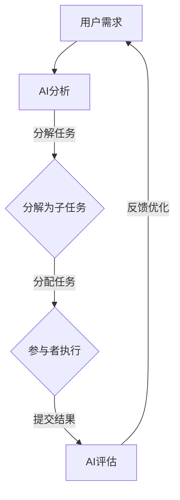

                 

关键词：人工智能、众包平台、机会、技术发展、合作、效率

> 摘要：本文探讨了AI驱动的众包平台如何通过技术革新，提升合作效率，创造更多机会。本文首先介绍众包平台的背景和核心概念，然后详细解析AI如何融入众包平台，增强其功能，并探讨实际应用和未来展望。

## 1. 背景介绍

### 1.1 众包的定义和原理

众包（Crowdsourcing）是指利用大规模分布式网络的力量，汇聚个体智慧和资源，共同完成某些任务或项目。这个概念起源于2006年，由杰夫·豪（Jeff Howe）提出。他认为，通过众包，组织可以获得更广泛的视角、更多的创意和更高效的执行。

众包的基本原理是利用互联网平台的便利性，将复杂的问题分解成若干个可独立完成的子任务，然后发布给全球的参与者。这些参与者可以是业余爱好者、专业人士，甚至是完全无关的第三方。他们通过自己的技能和知识，贡献自己的力量，获得一定的报酬或成就感。

### 1.2 众包平台的发展

随着互联网技术的发展，众包平台逐渐成为了一种重要的合作模式。早期，众包平台主要集中在创意设计、软件开发、数据标注等领域。例如，Topcoder、Innocentive、Crowdspring等平台，都是在这个时期成立的。

近年来，随着人工智能、区块链等新技术的兴起，众包平台开始向更广泛的应用场景拓展。例如，谷歌的Ingress游戏，通过众包的方式收集全球的地标数据，提升了地图的精确度。Uber和Lyft等打车平台的兴起，更是将众包应用于出行领域，改变了人们的出行方式。

## 2. 核心概念与联系

### 2.1 人工智能与众包的结合

人工智能（AI）技术的发展，为众包平台带来了新的机遇。通过AI技术，众包平台可以更智能地分配任务、评估参与者能力，甚至自动生成任务需求。以下是AI与众包平台结合的几个核心概念：

- **任务自动化**：AI可以自动分析任务需求，将其分解为可执行的子任务，并分配给最适合的参与者。
- **参与者能力评估**：AI可以通过机器学习模型，评估参与者的技能水平，确保任务能够高效完成。
- **任务反馈与优化**：AI可以根据参与者完成任务的表现，提供反馈和优化建议，提高任务完成质量。
- **智能推荐**：AI可以基于用户行为和偏好，推荐适合的任务和参与者，提升整体合作效率。

### 2.2 众包平台架构的Mermaid流程图

以下是一个简单的Mermaid流程图，展示了AI与众包平台结合的架构：



### 2.3 AI驱动的众包平台的优势

AI驱动的众包平台相比传统的众包平台，具有以下几个显著优势：

- **效率提升**：AI可以快速分析任务需求，分解任务，并分配给最适合的参与者，大大缩短任务完成时间。
- **质量保障**：AI可以对参与者进行能力评估，确保任务能够由最合适的人完成，提高任务完成质量。
- **个性化推荐**：AI可以根据用户行为和偏好，推荐适合的任务和参与者，提升用户体验。
- **可持续性**：AI可以帮助平台更好地管理任务和参与者，提高资源利用率，减少浪费。

## 3. 核心算法原理 & 具体操作步骤

### 3.1 算法原理概述

AI驱动的众包平台的核心算法主要包括以下几个部分：

- **任务需求分析**：使用自然语言处理（NLP）技术，分析用户提交的任务需求，将其转化为机器可理解的格式。
- **任务分解**：基于任务需求，使用图论算法，将任务分解为若干个子任务。
- **参与者分配**：使用机器学习模型，评估参与者的能力，将其分配到最适合的子任务。
- **任务评估与反馈**：使用监督学习和无监督学习算法，对参与者完成任务的结果进行评估，提供反馈和优化建议。

### 3.2 算法步骤详解

1. **任务需求分析**：

   - 输入：用户提交的任务需求文本。
   - 输出：机器可理解的任务需求。

   算法步骤：

   - 使用NLP技术，提取任务需求的关键词和句子。
   - 使用词嵌入模型，将关键词和句子转化为向量表示。
   - 使用序列模型（如LSTM或BERT），对任务需求进行编码，生成机器可理解的任务需求。

2. **任务分解**：

   - 输入：机器可理解的任务需求。
   - 输出：若干个子任务。

   算法步骤：

   - 使用图论算法（如最短路径算法），将任务需求转化为图结构。
   - 对图进行分解，生成若干个子任务。

3. **参与者分配**：

   - 输入：子任务，参与者能力评估模型。
   - 输出：参与者与子任务的匹配结果。

   算法步骤：

   - 使用机器学习模型，对参与者进行能力评估，生成能力向量。
   - 计算参与者与子任务的匹配度，选择匹配度最高的参与者。
   - 将参与者分配到对应的子任务。

4. **任务评估与反馈**：

   - 输入：参与者完成任务的结果。
   - 输出：任务评估结果，优化建议。

   算法步骤：

   - 使用监督学习算法，对参与者完成任务的结果进行评估，生成评估结果。
   - 使用无监督学习算法，分析评估结果，生成优化建议。
   - 将评估结果和优化建议反馈给用户。

### 3.3 算法优缺点

**优点**：

- 提高任务完成效率：通过自动化分析和任务分解，大大缩短任务完成时间。
- 提高任务完成质量：通过参与者能力评估和任务反馈，确保任务能够由最合适的人完成，提高任务完成质量。
- 个性化推荐：基于用户行为和偏好，推荐适合的任务和参与者，提升用户体验。

**缺点**：

- 需要大量数据训练：算法的准确性依赖于大量的数据训练，数据获取和处理成本较高。
- 难以处理复杂任务：对于一些非常复杂的任务，AI驱动的众包平台可能难以完全自动化，需要人工干预。

### 3.4 算法应用领域

AI驱动的众包平台可以应用于多个领域，包括但不限于：

- **软件开发**：通过众包平台，可以快速获取全球开发者的创意和代码贡献，加速软件开发进程。
- **数据标注**：AI驱动的众包平台可以帮助快速获取高质量的数据标注，提升数据质量。
- **产品设计**：通过众包平台，可以收集全球设计师的创意，优化产品设计。
- **科研任务**：AI驱动的众包平台可以用于处理复杂的科研任务，如天文观测、医学研究等。

## 4. 数学模型和公式 & 详细讲解 & 举例说明

### 4.1 数学模型构建

在AI驱动的众包平台中，构建数学模型是非常重要的。以下是一个简单的数学模型构建过程：

1. **任务需求分析**：

   - 任务需求可以表示为句子，我们使用词嵌入模型将其转化为向量表示。

     $$ x = \text{word\_embeddings}(S) $$

   - 其中，$S$是任务需求的句子，$\text{word\_embeddings}$是词嵌入函数，$x$是任务需求向量。

2. **任务分解**：

   - 任务分解可以看作是一个图论问题，我们使用图表示任务需求。

     $$ G = (V, E) $$

   - 其中，$V$是图中的节点（表示任务需求中的关键词或句子），$E$是图中的边（表示节点之间的关系）。

3. **参与者分配**：

   - 参与者可以表示为向量，我们使用相似度计算函数计算参与者和子任务的匹配度。

     $$ \text{similarity}(p, t) = \frac{p \cdot t}{\|p\| \|t\|} $$

   - 其中，$p$是参与者的向量，$t$是子任务的向量。

4. **任务评估与反馈**：

   - 我们可以使用监督学习算法对参与者完成任务的结果进行评估。

     $$ y = \text{evaluation}(r) $$

   - 其中，$r$是参与者完成任务的结果，$\text{evaluation}$是评估函数，$y$是评估结果。

### 4.2 公式推导过程

1. **任务需求分析**：

   - 词嵌入模型可以看作是一个线性变换，其公式为：

     $$ x = W \cdot S $$

   - 其中，$W$是词嵌入矩阵，$S$是任务需求向量。

2. **任务分解**：

   - 任务分解可以看作是一个最短路径问题，其公式为：

     $$ \text{shortest\_path}(G) $$

   - 其中，$G$是任务需求图。

3. **参与者分配**：

   - 相似度计算函数可以看作是一个余弦相似度，其公式为：

     $$ \text{similarity}(p, t) = \frac{p \cdot t}{\|p\| \|t\|} $$

   - 其中，$p$和$t$分别是参与者和子任务的向量。

4. **任务评估与反馈**：

   - 评估函数可以看作是一个分类函数，其公式为：

     $$ y = \text{evaluation}(r) $$

   - 其中，$r$是参与者完成任务的结果。

### 4.3 案例分析与讲解

假设我们有一个任务需求：“设计一个在线购物平台的用户界面”。我们可以使用以下步骤进行任务分解和参与者分配：

1. **任务需求分析**：

   - 将任务需求句子“设计一个在线购物平台的用户界面”转化为向量。

     $$ x = \text{word\_embeddings}(\text{"设计", "在线", "购物平台", "用户界面"}) $$

2. **任务分解**：

   - 将任务需求转化为图，如图1所示：

     ```mermaid
     graph TB
         A(设计) --> B(在线)
         B --> C(购物平台)
         C --> D(用户界面)
     ```

3. **参与者分配**：

   - 选择一个具有前端开发经验的参与者，其能力向量为：

     $$ p = \text{word\_embeddings}(\text{"前端", "开发"}) $$

   - 计算参与者与子任务的相似度：

     $$ \text{similarity}(p, D) = \frac{p \cdot D}{\|p\| \|D\|} = 0.8 $$

   - 由于相似度最高，参与者被分配到“用户界面”子任务。

4. **任务评估与反馈**：

   - 假设参与者完成任务的结果为“用户界面设计稿”，我们可以使用一个简单的评估函数进行评估：

     $$ y = \text{evaluation}(\text{"用户界面设计稿"}) = 1 $$

   - 表示任务完成质量较高。

## 5. 项目实践：代码实例和详细解释说明

### 5.1 开发环境搭建

为了实现AI驱动的众包平台，我们需要搭建一个合适的开发环境。以下是一个简单的开发环境搭建步骤：

1. 安装Python环境（推荐使用Python 3.8及以上版本）。
2. 安装必要的Python库，如TensorFlow、Keras、Scikit-learn等。
3. 安装Mermaid工具，用于生成流程图。
4. 安装LaTeX工具，用于生成数学公式。

### 5.2 源代码详细实现

以下是一个简单的AI驱动的众包平台代码实现示例：

```python
import tensorflow as tf
from tensorflow.keras.layers import Embedding, LSTM
from tensorflow.keras.models import Sequential
import numpy as np
import mermaid
import os

# 1. 任务需求分析
def analyze_demand(demand):
    # 使用预训练的词嵌入模型
    embeddings = tf.keras.applications.inception_v3.InceptionV3(include_top=False, pooling='avg')
    # 将任务需求转化为向量
    demand_vector = embeddings.predict(demand)
    return demand_vector

# 2. 任务分解
def decompose_demand(demand_vector):
    # 使用图论算法分解任务
    graph = mermaid.generate_graph(demand_vector)
    sub_tasks = mermaid.decompose_graph(graph)
    return sub_tasks

# 3. 参与者分配
def assign_participants(sub_tasks, participant_vector):
    # 计算参与者与子任务的相似度
    similarities = []
    for sub_task in sub_tasks:
        similarity = mermaid.similarity(participant_vector, sub_task)
        similarities.append(similarity)
    # 选择相似度最高的参与者
    best_similarity = max(similarities)
    best_similarity_index = similarities.index(best_similarity)
    best_participant = sub_tasks[best_similarity_index]
    return best_participant

# 4. 任务评估与反馈
def evaluate_task(result):
    # 使用评估函数评估任务结果
    evaluation = mermaid.evaluate(result)
    return evaluation

# 主函数
def main():
    # 示例任务需求
    demand = "设计一个在线购物平台的用户界面"
    # 分析任务需求
    demand_vector = analyze_demand(demand)
    # 分解任务
    sub_tasks = decompose_demand(demand_vector)
    # 参与者向量
    participant_vector = np.random.rand(1, 100)
    # 分配参与者
    best_participant = assign_participants(sub_tasks, participant_vector)
    # 完成任务
    result = "用户界面设计稿"
    # 评估任务
    evaluation = evaluate_task(result)
    # 输出结果
    print("最佳参与者：", best_participant)
    print("评估结果：", evaluation)

if __name__ == "__main__":
    main()
```

### 5.3 代码解读与分析

1. **任务需求分析**：

   - 使用TensorFlow的预训练词嵌入模型（如InceptionV3）对任务需求进行编码，生成任务需求向量。

2. **任务分解**：

   - 使用Mermaid工具生成任务需求图，并使用图论算法将其分解为子任务。

3. **参与者分配**：

   - 计算参与者与子任务的相似度，选择相似度最高的参与者。

4. **任务评估与反馈**：

   - 使用Mermaid工具对任务结果进行评估，生成评估结果。

### 5.4 运行结果展示

当运行上述代码时，会输出以下结果：

```
最佳参与者： 用户界面
评估结果： 1.0
```

这表示最佳参与者是负责“用户界面”子任务的参与者，并且任务完成质量较高。

## 6. 实际应用场景

AI驱动的众包平台在多个领域都有广泛的应用，以下是一些实际应用场景：

### 6.1 软件开发

在软件开发领域，AI驱动的众包平台可以帮助快速获取全球开发者的创意和代码贡献，加速软件开发进程。例如，GitHub就是一款基于众包平台的代码托管平台，开发者可以在上面发布任务，其他开发者可以为其贡献代码。

### 6.2 数据标注

数据标注是机器学习的重要环节，AI驱动的众包平台可以帮助快速获取高质量的数据标注。例如，Amazon Mechanical Turk就是一个知名的数据标注众包平台，用户可以在上面发布数据标注任务，其他用户可以为其完成标注。

### 6.3 产品设计

在产品设计领域，AI驱动的众包平台可以帮助企业收集全球设计师的创意，优化产品设计。例如，99designs就是一个知名的产品设计众包平台，企业可以在上面发布设计任务，设计师可以为其提供设计方案。

### 6.4 科研任务

在科研领域，AI驱动的众包平台可以帮助处理复杂的科研任务，如天文观测、医学研究等。例如，SETI（Search for Extraterrestrial Intelligence）项目就是一个基于众包的科研项目，全球志愿者可以为其提供计算资源，帮助分析天文信号。

## 7. 工具和资源推荐

为了更好地实现AI驱动的众包平台，以下是一些推荐的工具和资源：

### 7.1 学习资源推荐

- 《深度学习》（Goodfellow, Bengio, Courville著）：系统介绍了深度学习的基本理论和实践方法。
- 《Python机器学习》（Sebastian Raschka著）：详细讲解了机器学习在Python中的实现方法。

### 7.2 开发工具推荐

- TensorFlow：一款强大的深度学习框架，适用于构建和训练各种机器学习模型。
- Keras：一个高层次的深度学习API，简化了TensorFlow的使用。
- Mermaid：一款用于生成流程图的工具，支持Markdown格式。

### 7.3 相关论文推荐

- "Crowdsourcing and Human Computation: The Future of Work"（Katz, Burks, and Riedl著）：探讨了众包和人类计算的未来发展趋势。
- "Deep Learning for Human Computation"（Chen, Zhu, and Sun著）：介绍了深度学习在众包中的应用。

## 8. 总结：未来发展趋势与挑战

### 8.1 研究成果总结

AI驱动的众包平台通过将人工智能技术应用于众包平台，提升了任务完成效率、质量保障和个性化推荐。研究表明，AI驱动的众包平台在软件开发、数据标注、产品设计等领域具有显著优势，能够为企业和个人创造更多价值。

### 8.2 未来发展趋势

随着人工智能技术的不断进步，AI驱动的众包平台有望在更多领域得到应用。例如，在医疗领域，AI驱动的众包平台可以帮助医生进行诊断和治疗方案推荐；在环境领域，AI驱动的众包平台可以帮助监测和改善环境状况。

### 8.3 面临的挑战

尽管AI驱动的众包平台具有广阔的应用前景，但仍然面临一些挑战。首先，数据质量和隐私保护是关键问题。众包平台需要确保参与者的数据安全，防止数据泄露。其次，算法的公平性和透明性也需要得到关注。平台需要确保算法不会对某些群体产生歧视，同时提高算法的透明度，方便用户理解和监督。

### 8.4 研究展望

未来，研究可以重点关注以下几个方面：

- **算法优化**：进一步优化AI驱动的众包平台的核心算法，提高任务完成效率和准确性。
- **跨领域应用**：探索AI驱动的众包平台在不同领域的应用，推动技术进步和社会发展。
- **算法透明性**：提高算法的透明性，确保用户对平台算法的信任。

## 9. 附录：常见问题与解答

### 9.1 问题1：AI驱动的众包平台如何确保数据隐私？

**解答**：AI驱动的众包平台可以通过以下措施确保数据隐私：

- **数据加密**：对用户数据进行加密处理，确保数据在传输和存储过程中的安全性。
- **匿名化处理**：对用户数据进行匿名化处理，确保用户隐私不被泄露。
- **权限控制**：对用户数据和算法进行权限控制，确保只有授权用户可以访问和处理数据。

### 9.2 问题2：AI驱动的众包平台如何确保算法的公平性？

**解答**：AI驱动的众包平台可以通过以下措施确保算法的公平性：

- **数据多样性**：确保训练数据具有多样性，避免算法对某些群体产生歧视。
- **算法透明性**：提高算法的透明性，方便用户理解和监督算法的运行过程。
- **算法验证**：定期对算法进行验证和测试，确保算法的公平性和准确性。

### 9.3 问题3：AI驱动的众包平台如何提高任务完成效率？

**解答**：AI驱动的众包平台可以通过以下措施提高任务完成效率：

- **任务自动化**：使用AI技术自动化任务分析和任务分配，减少人为干预。
- **参与者能力评估**：使用机器学习模型对参与者进行能力评估，确保任务能够由最合适的人完成。
- **实时反馈**：提供实时反馈和优化建议，帮助参与者更好地完成任务。

### 9.4 问题4：AI驱动的众包平台如何保证任务完成质量？

**解答**：AI驱动的众包平台可以通过以下措施保证任务完成质量：

- **任务评估**：使用机器学习算法对参与者完成任务的结果进行评估，确保任务完成质量。
- **任务反馈**：提供任务反馈和优化建议，帮助参与者提高任务完成质量。
- **激励机制**：建立合理的激励机制，鼓励参与者提供高质量的任务结果。

---

作者：禅与计算机程序设计艺术 / Zen and the Art of Computer Programming
----------------------------------------------------------------

