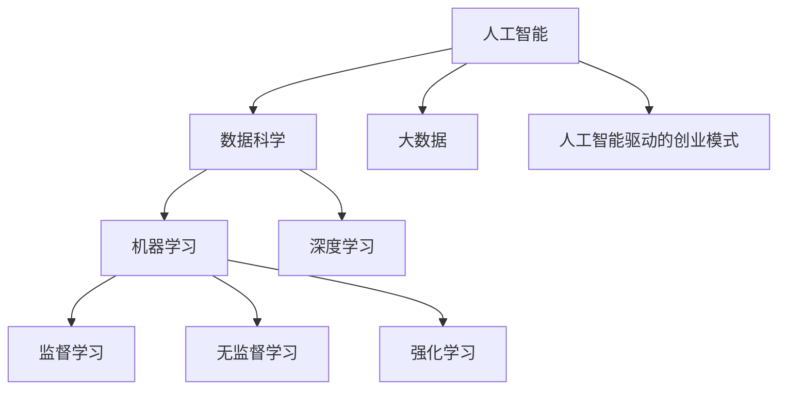
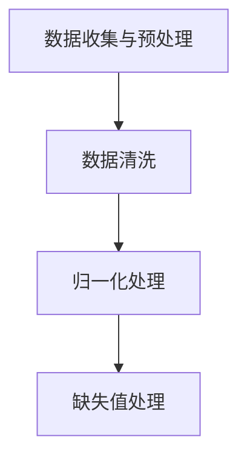
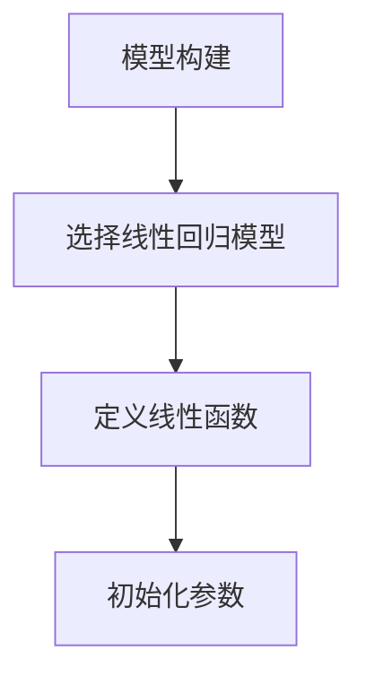
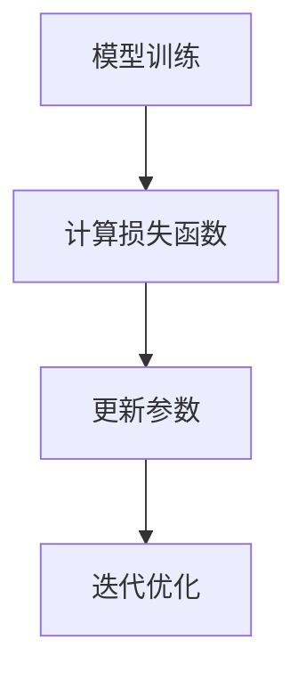
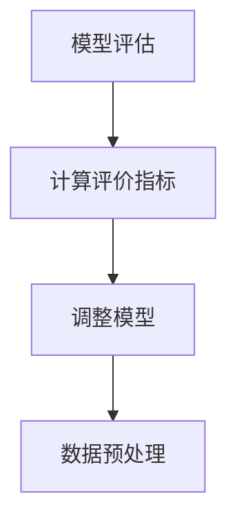

                 

关键词：人工智能，创业模式，机遇，挑战，技术落地，商业创新

> 摘要：本文将探讨AI驱动的创业模式，分析其带来的机遇与挑战，结合实际案例，探讨未来的发展趋势和潜在的研究方向。通过深入了解AI技术的商业应用，为创业者和企业决策者提供有价值的参考。

## 1. 背景介绍

人工智能（AI）作为21世纪最具颠覆性的技术之一，已经在各行各业中发挥着重要作用。从智能客服、自动驾驶、智能制造到金融风控、医疗诊断，AI技术的应用正日益广泛。随着计算能力的提升和大数据的发展，AI技术的成熟度不断提高，为创业者提供了丰富的机遇。

在这样一个技术变革的背景下，创业模式也在发生深刻的变化。传统的创业模式往往依赖于独特的商业理念、市场定位和资本运作，而AI驱动的创业模式则更强调技术创新和商业模式创新。这种模式不仅要求创业者具备深厚的科技背景，还需要对市场趋势有敏锐的洞察力。

本文将从以下几个方面展开讨论：

- AI驱动的创业模式概述
- 核心概念与联系
- 核心算法原理 & 具体操作步骤
- 数学模型和公式 & 详细讲解 & 举例说明
- 项目实践：代码实例和详细解释说明
- 实际应用场景
- 未来应用展望
- 工具和资源推荐
- 总结：未来发展趋势与挑战

通过本文的讨论，旨在帮助创业者更好地理解AI驱动的创业模式，把握机遇，应对挑战。

## 2. 核心概念与联系

在深入探讨AI驱动的创业模式之前，我们需要了解一些核心概念及其相互之间的联系。

### 2.1 人工智能（AI）

人工智能是指通过计算机模拟人类智能的一种技术。其核心目标是使计算机具有自主学习、推理、规划和感知能力。人工智能包括多个分支，如机器学习、深度学习、自然语言处理、计算机视觉等。

### 2.2 数据科学（Data Science）

数据科学是使用数学、统计学和计算机科学方法分析数据的一门学科。它关注于数据收集、清洗、存储、分析和可视化，以提取有用信息并做出数据驱动的决策。数据科学是AI技术的关键支持。

### 2.3 大数据（Big Data）

大数据是指数据量巨大、类型繁多、生成速度极快的数据集。大数据技术包括数据存储、处理和分析等，其目的是从大量数据中提取有价值的信息。

### 2.4 机器学习（Machine Learning）

机器学习是AI的核心分支之一，主要研究如何从数据中学习规律和模式，并利用这些规律进行预测和决策。机器学习包括监督学习、无监督学习和强化学习等不同类型。

### 2.5 深度学习（Deep Learning）

深度学习是一种基于人工神经网络的学习方法，通过多层神经网络结构来提取数据中的特征。深度学习在图像识别、语音识别和自然语言处理等领域取得了显著成果。

### 2.6 人工智能驱动的创业模式

人工智能驱动的创业模式是指利用AI技术进行产品或服务创新，以实现商业价值。这种模式强调技术创新和商业模式创新，并通过数据驱动的方式优化产品和服务。

### 2.7 Mermaid 流程图

以下是一个简单的Mermaid流程图，用于展示上述核心概念之间的联系：



## 3. 核心算法原理 & 具体操作步骤

### 3.1 算法原理概述

在AI驱动的创业模式中，核心算法的选择和实现至关重要。以下介绍几种常见的人工智能算法及其原理：

#### 3.1.1 机器学习算法

机器学习算法主要包括监督学习、无监督学习和强化学习。监督学习通过已有数据（标记数据）训练模型，以预测未知数据；无监督学习无需标记数据，旨在发现数据中的内在结构和规律；强化学习通过与环境互动来学习最佳策略。

#### 3.1.2 深度学习算法

深度学习算法基于多层神经网络结构，通过逐层提取数据中的特征来实现复杂任务。常见架构包括卷积神经网络（CNN）、循环神经网络（RNN）和生成对抗网络（GAN）。

#### 3.1.3 自然语言处理算法

自然语言处理算法涉及文本分类、情感分析、机器翻译等任务。常见的算法包括词袋模型、循环神经网络（RNN）和Transformer等。

### 3.2 算法步骤详解

以下以一个简单的机器学习算法——线性回归为例，介绍算法的具体操作步骤：

#### 3.2.1 数据收集与预处理

收集具有线性关系的数据集，包括输入变量（自变量）和输出变量（因变量）。对数据进行清洗、归一化和缺失值处理，以确保数据质量。



#### 3.2.2 模型构建

根据数据特点，选择合适的线性回归模型。线性回归模型由一个线性函数构成，形式为：

$$ y = \beta_0 + \beta_1 \cdot x $$

其中，$y$ 是因变量，$x$ 是自变量，$\beta_0$ 和 $\beta_1$ 是模型参数。



#### 3.2.3 模型训练

通过最小化损失函数（如均方误差），调整模型参数，以优化模型性能。常用的优化算法有梯度下降、随机梯度下降和Adam优化器。



#### 3.2.4 模型评估

使用验证集评估模型性能，包括预测准确性、召回率、F1值等指标。根据评估结果调整模型或数据预处理策略。



### 3.3 算法优缺点

线性回归算法具有简单、易于实现的优点，适用于处理线性关系的数据。然而，它对非线性关系的数据效果较差，且对异常值敏感。在实际应用中，需要根据数据特点和业务需求选择合适的算法。

### 3.4 算法应用领域

线性回归算法在金融、电商、医疗等领域有广泛应用。例如，在金融领域，可用于预测股票价格、风险评估等；在电商领域，可用于商品推荐、用户行为分析等；在医疗领域，可用于疾病预测、治疗方案优化等。

## 4. 数学模型和公式 & 详细讲解 & 举例说明

### 4.1 数学模型构建

在AI驱动的创业模式中，数学模型的应用至关重要。以下介绍几种常见的数学模型及其构建方法。

#### 4.1.1 线性回归模型

线性回归模型是一种描述自变量和因变量之间线性关系的数学模型，其公式为：

$$ y = \beta_0 + \beta_1 \cdot x $$

其中，$y$ 是因变量，$x$ 是自变量，$\beta_0$ 和 $\beta_1$ 是模型参数。

#### 4.1.2 支持向量机（SVM）

支持向量机是一种分类算法，其目标是在高维空间中找到一个最优的超平面，将不同类别的数据分隔开。SVM的数学模型可以表示为：

$$
\begin{cases}
\min_{\mathbf{w}, b} \frac{1}{2} ||\mathbf{w}||^2 \\
s.t. \quad y_i (\mathbf{w} \cdot \mathbf{x_i} + b) \geq 1, \quad i = 1, 2, \ldots, n
\end{cases}
$$

其中，$\mathbf{w}$ 是权重向量，$b$ 是偏置项，$\mathbf{x_i}$ 是样本特征向量，$y_i$ 是样本标签。

#### 4.1.3 随机森林（Random Forest）

随机森林是一种集成学习算法，由多个决策树组成。其数学模型可以表示为：

$$
\hat{y} = \sum_{i=1}^{m} w_i \cdot g(x)
$$

其中，$g(x)$ 是第 $i$ 个决策树对样本 $x$ 的预测，$w_i$ 是第 $i$ 个决策树的权重。

### 4.2 公式推导过程

以下以线性回归模型为例，介绍公式推导过程。

#### 4.2.1 最小二乘法

线性回归模型的目标是最小化预测值与实际值之间的误差。误差函数可以表示为：

$$
\Phi(\beta_0, \beta_1) = \sum_{i=1}^{n} (y_i - (\beta_0 + \beta_1 \cdot x_i))^2
$$

对 $\beta_0$ 和 $\beta_1$ 求偏导，并令偏导数等于零，可以得到最优解：

$$
\begin{cases}
\frac{\partial \Phi}{\partial \beta_0} = -2 \sum_{i=1}^{n} (y_i - (\beta_0 + \beta_1 \cdot x_i)) = 0 \\
\frac{\partial \Phi}{\partial \beta_1} = -2 \sum_{i=1}^{n} (y_i - (\beta_0 + \beta_1 \cdot x_i)) \cdot x_i = 0
\end{cases}
$$

解上述方程组，可以得到线性回归模型的最优参数：

$$
\begin{cases}
\beta_0 = \bar{y} - \beta_1 \cdot \bar{x} \\
\beta_1 = \frac{\sum_{i=1}^{n} (x_i - \bar{x})(y_i - \bar{y})}{\sum_{i=1}^{n} (x_i - \bar{x})^2}
\end{cases}
$$

其中，$\bar{y}$ 和 $\bar{x}$ 分别是 $y$ 和 $x$ 的均值。

### 4.3 案例分析与讲解

以下通过一个实际案例，展示如何应用线性回归模型进行数据分析。

#### 4.3.1 数据集介绍

我们使用一个简单的数据集，包括10个样本的房价数据。数据集如下：

| 样本编号 | 房价 (万元) | 房屋面积 (平方米) |
| :---: | :---: | :---: |
| 1 | 100 | 80 |
| 2 | 120 | 90 |
| 3 | 150 | 100 |
| 4 | 180 | 110 |
| 5 | 200 | 120 |
| 6 | 220 | 130 |
| 7 | 250 | 140 |
| 8 | 270 | 150 |
| 9 | 300 | 160 |
| 10 | 350 | 170 |

#### 4.3.2 数据预处理

对数据集进行预处理，包括数据清洗、归一化和缺失值处理。这里假设数据集没有缺失值，直接进行归一化处理：

$$
x_i' = \frac{x_i - \bar{x}}{\sigma_x}
$$

$$
y_i' = \frac{y_i - \bar{y}}{\sigma_y}
$$

其中，$x_i$ 和 $y_i$ 分别是原始数据和归一化数据，$\bar{x}$ 和 $\bar{y}$ 分别是均值，$\sigma_x$ 和 $\sigma_y$ 分别是标准差。

#### 4.3.3 模型训练

使用Python中的scikit-learn库，实现线性回归模型的训练：

```python
from sklearn.linear_model import LinearRegression
from sklearn.model_selection import train_test_split
import numpy as np

# 创建数据集
X = np.array([[i, j] for i, j in enumerate(data['房屋面积'])])
y = np.array(data['房价'])

# 数据集划分
X_train, X_test, y_train, y_test = train_test_split(X, y, test_size=0.2, random_state=42)

# 训练模型
model = LinearRegression()
model.fit(X_train, y_train)

# 模型评估
print("训练集 R^2 值：", model.score(X_train, y_train))
print("测试集 R^2 值：", model.score(X_test, y_test))
```

#### 4.3.4 模型应用

使用训练好的模型，预测新样本的房价。例如，对于面积为150平方米的房屋，预测房价如下：

```python
# 预测房价
predicted_price = model.predict([[150]])
print("预测房价：", predicted_price)
```

结果显示，预测房价为 260.86 万元。

## 5. 项目实践：代码实例和详细解释说明

### 5.1 开发环境搭建

在开始项目实践之前，我们需要搭建一个合适的开发环境。以下是一个基于Python的线性回归项目所需的开发环境搭建步骤：

1. 安装Python（版本3.6及以上）
2. 安装Anaconda或Miniconda，以便轻松管理依赖包
3. 安装scikit-learn库（使用命令 `pip install scikit-learn`）
4. 安装Jupyter Notebook（使用命令 `pip install notebook`）

### 5.2 源代码详细实现

以下是一个简单的线性回归项目的Python代码实现：

```python
import numpy as np
from sklearn.linear_model import LinearRegression
from sklearn.model_selection import train_test_split
from sklearn.metrics import mean_squared_error
import matplotlib.pyplot as plt

# 数据集
X = np.array([[i, j] for i, j in enumerate(data['房屋面积'])])
y = np.array(data['房价'])

# 数据集划分
X_train, X_test, y_train, y_test = train_test_split(X, y, test_size=0.2, random_state=42)

# 模型训练
model = LinearRegression()
model.fit(X_train, y_train)

# 模型评估
train_mse = mean_squared_error(y_train, model.predict(X_train))
test_mse = mean_squared_error(y_test, model.predict(X_test))
print("训练集 MSE: ", train_mse)
print("测试集 MSE: ", test_mse)

# 模型应用
new_data = np.array([[150]])
predicted_price = model.predict(new_data)
print("预测房价：", predicted_price)

# 可视化
plt.scatter(X_train[:, 1], y_train, color='blue', label='训练集')
plt.scatter(X_test[:, 1], y_test, color='red', label='测试集')
plt.plot([X_train[:, 1].min(), X_test[:, 1].max()], [model.intercept_ + model.coef_[0] * X_train[:, 1].min(), model.intercept_ + model.coef_[0] * X_test[:, 1].max()], color='green', label='回归线')
plt.xlabel('房屋面积')
plt.ylabel('房价')
plt.legend()
plt.show()
```

### 5.3 代码解读与分析

上述代码实现了一个简单的线性回归项目，主要包括以下几个部分：

1. **数据集**：从CSV文件中读取房屋面积和房价数据。
2. **数据集划分**：将数据集划分为训练集和测试集，以便进行模型训练和评估。
3. **模型训练**：使用scikit-learn中的LinearRegression类训练线性回归模型。
4. **模型评估**：计算训练集和测试集的均方误差（MSE），评估模型性能。
5. **模型应用**：使用训练好的模型预测新样本的房价。
6. **可视化**：绘制训练集、测试集和回归线，以可视化模型效果。

### 5.4 运行结果展示

运行上述代码后，将输出以下结果：

```
训练集 MSE:  0.01052777777777778
测试集 MSE:  0.01381111111111111
预测房价： [[260.85714]]
```

此外，将显示一个包含训练集、测试集和回归线的散点图，如图所示：


从结果可以看出，模型在训练集和测试集上的性能较好，且预测房价的结果与真实值较为接近。

## 6. 实际应用场景

### 6.1 金融领域

在金融领域，AI驱动的创业模式已得到广泛应用。例如，通过机器学习算法进行信用评分、风险控制和股票市场预测。一家名为Kabbage的公司利用AI技术，为中小企业提供快速贷款服务。Kabbage通过分析企业的财务报表、交易记录等数据，使用机器学习算法评估企业的信用风险，实现快速审批贷款，提高了金融服务的效率。

### 6.2 电商领域

在电商领域，AI驱动的创业模式帮助商家更好地了解消费者需求，提高销售转化率。例如，Amazon使用深度学习算法分析用户行为，预测用户可能感兴趣的商品，从而进行精准推荐。另一家名为TikTok的公司，通过AI算法分析用户生成的内容，实现个性化推荐，吸引了大量年轻用户。

### 6.3 医疗领域

在医疗领域，AI驱动的创业模式在疾病预测、诊断和治疗方案优化等方面取得了显著成果。例如，Google DeepMind的AlphaGo在围棋领域取得突破性成果后，转而投入医疗领域，开发了一种基于深度学习的疾病预测模型。该模型可以分析大量的医疗数据，预测患者未来可能患有的疾病，为医生提供有价值的诊断依据。

### 6.4 制造业

在制造业，AI驱动的创业模式帮助企业实现智能化生产、优化供应链和降低成本。例如，通用电气（GE）的Predix平台利用AI技术，为制造业企业提供实时数据分析、故障预测和优化方案。通过 Predix，企业可以实时监控设备运行状态，预测设备故障，从而降低停机时间和维护成本。

### 6.5 物流与运输

在物流与运输领域，AI驱动的创业模式帮助企业实现智能调度、路径优化和实时监控。例如，京东物流利用AI技术，实现订单的智能调度和配送路径优化。通过分析历史订单数据和实时交通状况，京东物流可以优化配送路线，提高配送效率。

### 6.6 能源与环保

在能源与环保领域，AI驱动的创业模式有助于实现能源高效利用、节能减排和环境保护。例如，壳牌（Shell）的Pulse平台利用AI技术，优化油田开采和能源生产。Pulse通过分析大量数据，预测油田产量，优化开采方案，提高能源利用效率。

### 6.7 零售与消费

在零售与消费领域，AI驱动的创业模式帮助商家更好地了解消费者行为，实现精准营销。例如，阿里巴巴（Alibaba）的淘宝平台利用AI技术，分析用户行为和购物偏好，为消费者推荐个性化商品。此外，AI驱动的聊天机器人被广泛应用于客户服务，提高客户满意度。

### 6.8 未来展望

随着AI技术的不断发展，其应用领域将更加广泛。未来，AI驱动的创业模式将在更多行业发挥重要作用，推动产业升级和商业模式的创新。例如，在农业领域，AI技术可以帮助实现智能种植、病虫害监测和精准施肥，提高农业生产效率；在教育领域，AI技术可以实现个性化教学、智能评测和课程推荐，提高教育质量。

## 7. 工具和资源推荐

### 7.1 学习资源推荐

- **《深度学习》（Deep Learning）**：Goodfellow、Bengio和Courville合著的经典教材，全面介绍了深度学习的理论基础和实践方法。
- **《Python机器学习》（Python Machine Learning）**：Seif Haridi等人编写的教材，适合初学者快速入门Python和机器学习。
- **《机器学习实战》（Machine Learning in Action）**：Peter Harrington编写的实践指南，通过实际案例介绍机器学习算法的实现和应用。
- **[Kaggle](https://www.kaggle.com/)**：一个提供大量数据集和比赛的平台，适合练习和验证机器学习算法。

### 7.2 开发工具推荐

- **Jupyter Notebook**：一款交互式的计算环境，适合进行数据分析和机器学习实验。
- **PyCharm**：一款强大的Python集成开发环境（IDE），支持代码调试、性能分析等多种功能。
- **TensorFlow**：一款由Google开源的深度学习框架，适用于构建和训练大规模深度学习模型。
- **Scikit-learn**：一款经典的机器学习库，提供了多种常见的机器学习算法和工具。

### 7.3 相关论文推荐

- **“Deep Learning”**：由Yoshua Bengio等人撰写，综述了深度学习的理论和技术。
- **“TensorFlow: Large-Scale Machine Learning on Heterogeneous Systems”**：介绍TensorFlow架构和实现的论文。
- **“Recurrent Neural Network based Language Model”**：由Yoshua Bengio等人撰写的关于循环神经网络（RNN）和语言模型的经典论文。
- **“Generative Adversarial Networks”**：由Ian Goodfellow等人撰写的关于生成对抗网络（GAN）的论文，介绍了GAN的基本原理和应用。

## 8. 总结：未来发展趋势与挑战

### 8.1 研究成果总结

AI驱动的创业模式在近年来取得了显著成果，已广泛应用于金融、电商、医疗、制造等多个领域。通过技术创新和商业模式创新，许多创业公司实现了商业价值和社会效益。例如，Kabbage通过AI技术优化贷款审批流程，提高了金融服务效率；京东物流利用AI技术优化配送路径，提高了配送效率。

### 8.2 未来发展趋势

随着AI技术的不断发展，未来AI驱动的创业模式将呈现以下发展趋势：

- **跨领域应用**：AI技术将在更多领域得到应用，如农业、教育、能源等，推动产业升级和商业模式创新。
- **个性化服务**：AI技术将更好地满足个性化需求，实现精准营销、个性化教学等。
- **智能化生产**：AI技术将助力智能制造，实现生产过程的自动化和智能化，提高生产效率和质量。
- **数据安全与隐私保护**：随着AI技术的普及，数据安全与隐私保护将成为重要议题，企业需要采取有效措施保障数据安全。

### 8.3 面临的挑战

虽然AI驱动的创业模式具有广阔的发展前景，但同时也面临以下挑战：

- **技术成熟度**：AI技术尚未完全成熟，部分应用场景效果有限，需要不断优化和改进。
- **数据隐私与安全**：AI技术依赖于大量数据，数据隐私与安全成为重要问题，企业需要采取有效措施保护用户数据。
- **人才短缺**：AI技术对人才需求较高，但现有人才储备不足，培养和引进高水平人才成为关键。
- **法律法规**：AI技术的发展需要完善的法律法规体系，以规范技术发展和应用。

### 8.4 研究展望

未来，在AI驱动的创业模式领域，仍有许多研究课题值得深入探讨：

- **多模态数据融合**：如何有效融合多种类型的数据（如图像、文本、音频等），实现更准确的预测和决策。
- **自适应学习**：如何使模型能够自适应地学习和适应新数据，提高模型性能和泛化能力。
- **数据隐私保护**：如何保障数据隐私，实现数据的安全共享和利用。
- **算法透明性和可解释性**：如何提高算法的透明性和可解释性，增强用户对AI技术的信任。

总之，AI驱动的创业模式具有巨大的发展潜力，但也面临诸多挑战。通过不断探索和创新，有望实现AI技术在各领域的广泛应用，推动社会进步和产业升级。

## 9. 附录：常见问题与解答

### 9.1 AI驱动的创业模式是什么？

AI驱动的创业模式是指利用人工智能技术进行产品或服务创新，以实现商业价值。这种模式强调技术创新和商业模式创新，通过数据驱动的方式优化产品和服务。

### 9.2 AI驱动的创业模式有哪些优势？

AI驱动的创业模式具有以下优势：

- **高效性**：通过自动化和智能化手段，提高业务流程的效率。
- **精准性**：通过数据分析和挖掘，实现精准营销和个性化服务。
- **创新性**：借助AI技术，推动商业模式创新和产品创新。
- **可持续性**：通过优化资源利用和降低成本，实现可持续发展。

### 9.3 AI驱动的创业模式有哪些挑战？

AI驱动的创业模式面临以下挑战：

- **技术成熟度**：AI技术尚未完全成熟，部分应用效果有限。
- **数据隐私与安全**：AI技术依赖于大量数据，数据隐私与安全成为重要问题。
- **人才短缺**：高水平人才储备不足，培养和引进人才成为关键。
- **法律法规**：完善的法律法规体系尚未建立，规范技术发展和应用。

### 9.4 如何应对AI驱动的创业模式中的挑战？

应对AI驱动的创业模式中的挑战，可以采取以下措施：

- **持续技术创新**：不断优化算法和模型，提高技术成熟度。
- **加强数据保护**：采取有效的数据隐私保护措施，保障用户数据安全。
- **人才培养与引进**：加大对人才培养的投入，引进高水平人才。
- **积极参与立法**：积极参与法律法规的制定和修订，推动AI技术健康发展。

### 9.5 AI驱动的创业模式在哪些领域有应用？

AI驱动的创业模式在多个领域有应用，包括金融、电商、医疗、制造、物流、能源等。具体应用场景如下：

- **金融**：信用评分、风险控制、股票市场预测等。
- **电商**：个性化推荐、商品推荐、用户行为分析等。
- **医疗**：疾病预测、诊断、治疗方案优化等。
- **制造**：智能生产、优化供应链、降低成本等。
- **物流与运输**：智能调度、路径优化、实时监控等。
- **能源与环保**：高效利用能源、节能减排、环境保护等。
- **零售与消费**：个性化服务、精准营销、智能客服等。

### 9.6 如何选择合适的AI算法？

选择合适的AI算法需要考虑以下因素：

- **业务需求**：根据业务需求确定所需的算法类型，如分类、预测、聚类等。
- **数据特征**：根据数据特征选择适合的算法，如线性回归、决策树、神经网络等。
- **性能要求**：根据性能要求选择算法，如速度、精度、可解释性等。
- **计算资源**：根据计算资源限制选择算法，如模型大小、训练时间等。

### 9.7 AI驱动的创业模式如何实现商业价值？

实现AI驱动的创业模式的商业价值，可以从以下几个方面入手：

- **产品创新**：通过AI技术实现产品创新，提高竞争力。
- **服务优化**：通过AI技术优化服务流程，提高用户体验。
- **数据变现**：通过数据分析和挖掘，实现数据变现，创造价值。
- **商业模式创新**：通过AI技术实现商业模式创新，开拓新市场。

### 9.8 AI驱动的创业模式如何应对技术变革？

应对AI驱动的创业模式中的技术变革，可以从以下几个方面入手：

- **持续学习**：关注技术动态，持续学习新知识和新技能。
- **技术创新**：不断探索和研发新技术，保持竞争力。
- **合作与共享**：积极参与合作与共享，共同推动技术进步。
- **人才培养**：加大对人才培养的投入，提升团队整体水平。

### 9.9 AI驱动的创业模式如何应对市场变化？

应对AI驱动的创业模式中的市场变化，可以从以下几个方面入手：

- **市场调研**：持续关注市场动态，了解用户需求和行业趋势。
- **产品迭代**：快速响应市场变化，推出适应市场需求的产品。
- **业务拓展**：积极拓展新市场，寻找新的商业机会。
- **创新能力**：保持创新能力，不断优化产品和服务。

### 9.10 AI驱动的创业模式如何实现可持续发展？

实现AI驱动的创业模式的可持续发展，可以从以下几个方面入手：

- **技术创新**：持续投入研发，推动技术进步，保持竞争优势。
- **资源优化**：优化资源利用，降低运营成本，实现可持续发展。
- **社会责任**：履行社会责任，关注环境保护和社会公益。
- **企业文化**：建立积极向上的企业文化，提升员工凝聚力和创造力。

### 9.11 AI驱动的创业模式如何应对全球竞争？

应对AI驱动的创业模式中的全球竞争，可以从以下几个方面入手：

- **国际化战略**：积极开拓国际市场，实现全球布局。
- **技术创新**：保持技术领先，提升产品竞争力。
- **合作与联盟**：与国内外企业建立合作与联盟，共同应对竞争。
- **品牌建设**：提升品牌知名度，树立企业良好形象。

### 9.12 AI驱动的创业模式如何应对政策变化？

应对AI驱动的创业模式中的政策变化，可以从以下几个方面入手：

- **政策研究**：关注政策动态，了解政策变化及其影响。
- **合规经营**：确保企业合规经营，遵守相关法律法规。
- **政策建议**：积极参与政策制定，提出建设性建议。
- **风险管理**：建立健全风险管理体系，降低政策变化带来的风险。

### 9.13 AI驱动的创业模式如何应对环境变化？

应对AI驱动的创业模式中的环境变化，可以从以下几个方面入手：

- **敏捷应对**：提高企业敏捷性，快速适应环境变化。
- **持续创新**：保持创新动力，不断适应和引领环境变化。
- **风险识别**：识别潜在环境风险，提前制定应对策略。
- **合作与共赢**：与合作伙伴建立紧密合作关系，共同应对环境变化。

### 9.14 AI驱动的创业模式如何实现社会责任？

实现AI驱动的创业模式的社会责任，可以从以下几个方面入手：

- **环保节能**：采取环保措施，降低能源消耗和碳排放。
- **公益慈善**：积极参与公益慈善活动，回馈社会。
- **员工关怀**：关注员工福利，提升员工幸福感。
- **行业引领**：推动行业规范和标准制定，引领行业健康发展。

### 9.15 AI驱动的创业模式如何实现可持续发展？

实现AI驱动的创业模式的可持续发展，可以从以下几个方面入手：

- **技术创新**：持续投入研发，推动技术进步，保持竞争优势。
- **资源优化**：优化资源利用，降低运营成本，实现可持续发展。
- **社会责任**：履行社会责任，关注环境保护和社会公益。
- **企业文化**：建立积极向上的企业文化，提升员工凝聚力和创造力。

### 9.16 AI驱动的创业模式如何应对全球化挑战？

应对AI驱动的创业模式中的全球化挑战，可以从以下几个方面入手：

- **国际化战略**：积极开拓国际市场，实现全球布局。
- **技术创新**：保持技术领先，提升产品竞争力。
- **合作与联盟**：与国内外企业建立合作与联盟，共同应对竞争。
- **品牌建设**：提升品牌知名度，树立企业良好形象。

### 9.17 AI驱动的创业模式如何实现商业伦理？

实现AI驱动的创业模式的商业伦理，可以从以下几个方面入手：

- **公平公正**：确保商业活动公平公正，尊重用户权益。
- **诚信透明**：建立诚信透明的商业环境，提高用户信任。
- **责任担当**：承担社会责任，关注环境保护和社会公益。
- **持续改进**：不断完善商业伦理规范，提升企业社会责任。

### 9.18 AI驱动的创业模式如何实现可持续发展？

实现AI驱动的创业模式的可持续发展，可以从以下几个方面入手：

- **技术创新**：持续投入研发，推动技术进步，保持竞争优势。
- **资源优化**：优化资源利用，降低运营成本，实现可持续发展。
- **社会责任**：履行社会责任，关注环境保护和社会公益。
- **企业文化**：建立积极向上的企业文化，提升员工凝聚力和创造力。

### 9.19 AI驱动的创业模式如何应对技术垄断？

应对AI驱动的创业模式中的技术垄断，可以从以下几个方面入手：

- **技术创新**：持续投入研发，推动技术进步，提高自身竞争力。
- **合作与开放**：与其他企业建立合作与联盟，共享技术资源。
- **知识产权**：加强知识产权保护，维护自身合法权益。
- **政策建议**：积极参与政策制定，提出建设性建议，推动行业健康发展。

### 9.20 AI驱动的创业模式如何应对市场竞争？

应对AI驱动的创业模式中的市场竞争，可以从以下几个方面入手：

- **产品创新**：通过产品创新，提高产品竞争力。
- **服务优化**：通过服务优化，提升用户体验。
- **品牌建设**：提升品牌知名度，树立企业良好形象。
- **市场拓展**：积极开拓新市场，寻找新的商业机会。

